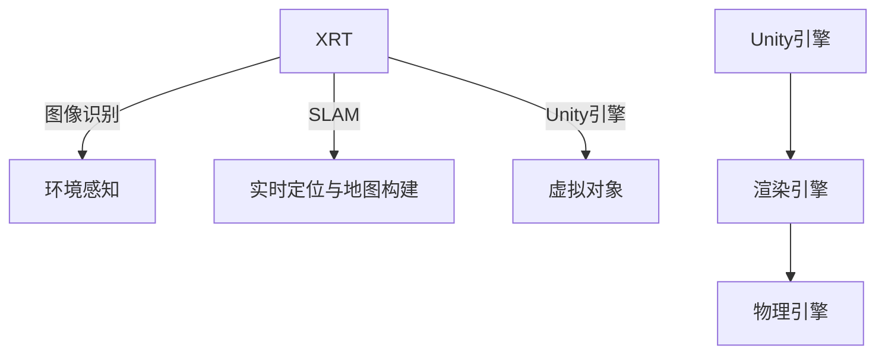

                 

# Unity AR游戏开发实战

## 1. 背景介绍

增强现实（Augmented Reality，AR）技术的飞速发展，正改变着人们与数字世界互动的方式。Unity引擎作为主流的3D游戏和AR开发平台，以其跨平台兼容性和强大的物理引擎，吸引了众多开发者参与。本文将深入探讨Unity AR游戏开发实战，从基础知识到高级技巧，全面解析Unity在AR领域的各项应用。

## 2. 核心概念与联系

### 2.1 核心概念概述

为更好地理解Unity AR游戏开发，我们需要掌握以下几个核心概念：

- **Unity引擎**：由Unity Technologies开发的游戏引擎，支持3D游戏、虚拟现实（VR）和AR等。

- **AR技术**：增强现实技术，通过在现实世界叠加数字信息，扩展现实世界的内容。

- **XRT（Unity 增强现实工具包）**：Unity提供的AR开发平台，支持在移动、桌面和VR平台上进行AR开发。

- **XR：扩展现实（Extended Reality）**：包括VR、AR和MR（混合现实）等多种技术。

- **SLAM： Simultaneous Localization and Mapping**：实时定位与地图构建技术，用于AR环境中的位置感知。

- **图像识别**：通过计算机视觉技术，对AR环境中的物体进行识别和追踪。

- **环境感知**：检测和理解现实世界环境，包括相机和传感器数据。

- **虚拟对象**：在游戏中可以交互的虚拟物体或场景。

这些概念之间通过Unity引擎进行连接，共同构成AR游戏的开发基础。

### 2.2 核心概念原理和架构的 Mermaid 流程图



这个流程图展示了XRT与Unity引擎如何结合，通过图像识别和SLAM技术实现环境感知和实时定位，进而构建虚拟对象和场景，并通过渲染引擎和物理引擎进行游戏渲染和交互。

## 3. 核心算法原理 & 具体操作步骤

### 3.1 算法原理概述

Unity AR游戏开发主要涉及以下算法原理：

- **图像识别算法**：使用计算机视觉技术对现实世界中的物体进行识别，为AR内容提供参考。
- **SLAM算法**：用于实时定位和地图构建，使AR内容能在真实世界中定位。
- **混合现实算法**：结合AR和VR技术的混合现实算法，使得虚拟对象与现实世界完美融合。
- **物理引擎**：模拟现实世界的物理法则，实现虚拟对象的逼真交互。

### 3.2 算法步骤详解

1. **环境感知**
   - 使用Unity的XRT工具包，设置相机和传感器。
   - 捕捉现实世界的图像信息。
   - 识别现实世界中的物体和场景。

2. **实时定位与地图构建**
   - 使用SLAM算法，根据捕捉到的图像和传感器数据，实时计算位置。
   - 构建环境地图，实时更新。

3. **虚拟对象和场景构建**
   - 根据环境感知和SLAM结果，在Unity中创建虚拟对象和场景。
   - 使用物理引擎，设置对象的物理属性。

4. **虚拟对象渲染与交互**
   - 渲染虚拟对象到屏幕上。
   - 实现虚拟对象与现实世界的交互。

5. **优化与调整**
   - 调整渲染参数和物理属性。
   - 优化性能，提高AR体验。

### 3.3 算法优缺点

**优点**：
- 跨平台兼容性好，可在移动、桌面和VR平台上开发。
- 强大的物理引擎和渲染引擎，能实现逼真的虚拟对象交互。
- 丰富的AR开发工具包和插件，简化开发流程。

**缺点**：
- 需要较高的编程水平和计算机视觉知识。
- 复杂的AR环境需要SLAM等高级算法支持。
- 大量图像数据处理和实时计算，可能带来性能瓶颈。

### 3.4 算法应用领域

Unity AR游戏开发在多个领域都有广泛应用：

- **教育培训**：虚拟教室、虚拟实验室等。
- **营销广告**：增强现实展示、互动广告等。
- **零售购物**：虚拟试衣镜、AR购物体验等。
- **旅游导览**：增强现实导览、虚拟博物馆等。
- **娱乐游戏**：AR游戏、虚拟现实游戏等。

## 4. 数学模型和公式 & 详细讲解 & 举例说明

### 4.1 数学模型构建

Unity AR游戏开发涉及大量数学模型，如相机投影、场景渲染、物理模拟等。以下以SLAM和图像识别模型为例：

- **SLAM模型**：使用粒子滤波或优化算法，实时估计位置和姿态，并进行地图构建。

- **图像识别模型**：使用深度学习模型（如CNN）对图像进行分类和物体检测。

### 4.2 公式推导过程

以图像识别模型为例，假设输入图像为 $I$，经过CNN模型处理后输出特征向量 $F$，输出为类别概率 $P(C)$。

$$
P(C|I) = \sigma(\sum_{i=1}^{n} w_i \times f_i^T \times F)
$$

其中 $\sigma$ 为激活函数，$w_i$ 为权重，$f_i$ 为特征向量，$n$ 为神经网络层数。

### 4.3 案例分析与讲解

以Unity中的AR相机为例，说明如何实现环境感知：

1. **相机设置**
   - 在Unity中创建一个XR相机。
   - 设置焦距、裁剪区域、近平面、远平面等参数。
   - 启用图像处理和深度感测功能。

2. **图像处理**
   - 使用Unity XRT工具包中的图像处理器，处理捕捉到的图像。
   - 实现颜色校正、去雾、增强等处理。

3. **深度感测**
   - 使用Unity XRT工具包中的深度感测器，获取环境中的深度信息。
   - 将深度信息转化为3D模型，用于虚拟对象的位置计算。

## 5. 项目实践：代码实例和详细解释说明

### 5.1 开发环境搭建

1. **安装Unity**：
   - 从Unity官网下载并安装适合的操作系统版本的Unity。

2. **安装XRT插件**：
   - 在Unity编辑器中安装Unity AR开发所需的插件，如XR相机、图像处理器、深度感测器等。

3. **设置项目**：
   - 创建新的AR项目，设置项目名称、路径、版本等信息。
   - 添加必要的XR相机、光源和纹理等资源。

### 5.2 源代码详细实现

以下是一个简单的Unity AR游戏开发示例，通过在Unity中创建一个AR相机，捕捉现实世界中的物体，并在场景中创建虚拟对象：

```csharp
using UnityEngine;
using UnityEngine.XR.ARCore;
using UnityEngine.XR.ARFoundation;

public class ARExample : MonoBehaviour
{
    private ARSession session;
    private CameraController cameraController;
    
    void Start()
    {
        session = new ARSession();
        cameraController = new CameraController();
        session.Start();
        cameraController.Initialize(session);
    }
    
    void Update()
    {
        UpdateCameraPosition();
        UpdateARContent();
    }
    
    void UpdateCameraPosition()
    {
        cameraController.Update();
    }
    
    void UpdateARContent()
    {
        XRSessionState sessionState = session.GetSessionState();
        if (sessionState == XRSessionState/mm_tracked)
        {
            ARRay ray = cameraController.GetCameraRay();
            ARHitResult hitResult = new ARHitResult(ray);
            ARTrackableHit hit = hitResult.Hit;
            if (hit.HitCount > 0)
            {
                ARPlanes plane = hit.Plane;
                if (plane != null)
                {
                    // 在场景中创建虚拟对象
                    GameObject virtualObject = Instantiate(virtualObjectPrefab, plane.transform.position, Quaternion.identity);
                }
            }
        }
    }
}
```

### 5.3 代码解读与分析

上述代码中，我们使用Unity XRT工具包，通过AR相机捕捉现实世界中的物体，并在平面上创建虚拟对象。

**主要步骤如下**：

1. **ARSession设置**：创建ARSession对象，初始化XR相机控制器。
2. **摄像机位置更新**：根据摄像机控制器的状态更新摄像机位置。
3. **AR内容更新**：根据摄像机的射线检测到现实世界中的物体，创建虚拟对象。

### 5.4 运行结果展示

运行上述代码，可以看到虚拟对象在现实世界中完美融合。在移动设备或PC上，用户可以通过触摸、手势等方式与虚拟对象进行互动。

## 6. 实际应用场景

### 6.1 教育培训

Unity AR游戏开发在教育培训领域有着广泛应用，如虚拟教室、虚拟实验室等。通过Unity AR技术，可以创建逼真的教学环境，让学生身临其境地参与学习。

### 6.2 营销广告

Unity AR游戏开发在营销广告领域也有广泛应用，如增强现实展示、互动广告等。通过Unity AR技术，可以创建互动性强、沉浸感高的广告体验，提升广告效果。

### 6.3 零售购物

Unity AR游戏开发在零售购物领域也有广泛应用，如虚拟试衣镜、AR购物体验等。通过Unity AR技术，可以创建沉浸式购物体验，提升用户购物体验。

### 6.4 旅游导览

Unity AR游戏开发在旅游导览领域也有广泛应用，如增强现实导览、虚拟博物馆等。通过Unity AR技术，可以创建逼真的导览体验，让用户足不出户即可遍游世界。

## 7. 工具和资源推荐

### 7.1 学习资源推荐

为了帮助开发者系统掌握Unity AR游戏开发的知识，以下是一些优质的学习资源：

1. **Unity官方文档**：Unity官方提供的详细文档，涵盖AR开发的相关API和插件。
2. **XRT官方文档**：Unity XRT官方提供的文档，介绍AR开发的工具和插件。
3. **ARKit官方文档**：苹果公司提供的ARKit开发文档，介绍AR开发的技术和实践。
4. **ARCore官方文档**：谷歌公司提供的ARCore开发文档，介绍AR开发的技术和实践。
5. **AR.js官方文档**：Web AR开发的文档，介绍AR技术在Web上的应用。

### 7.2 开发工具推荐

Unity AR游戏开发所需的工具包括：

1. **Unity编辑器**：Unity开发的主界面，用于创建和管理AR项目。
2. **XR相机控制器**：Unity XRT工具包中的相机控制器，用于实时捕捉现实世界中的物体。
3. **图像处理器**：Unity XRT工具包中的图像处理器，用于对捕捉到的图像进行处理。
4. **深度感测器**：Unity XRT工具包中的深度感测器，用于获取环境中的深度信息。
5. **ARRay类**：Unity AR开发中的光线类，用于实现射线检测。
6. **ARHitResult类**：Unity AR开发中的碰撞检测类，用于实现环境感测。

### 7.3 相关论文推荐

Unity AR游戏开发涉及大量计算机视觉和计算机图形学的理论，以下是几篇相关论文：

1. **《A Survey on SLAM Algorithms for Augmented Reality》**：介绍SLAM算法在AR中的应用，包括粒子滤波和优化算法。
2. **《Deep Learning for Computer Vision: A Review》**：介绍深度学习在计算机视觉中的应用，包括图像识别和物体检测。
3. **《A Survey of Augmented Reality Technology》**：介绍AR技术的发展历程和应用现状，涵盖AR硬件和软件技术。

## 8. 总结：未来发展趋势与挑战

### 8.1 总结

本文从基础知识到实际应用，全面介绍了Unity AR游戏开发的流程和方法。Unity AR游戏开发通过强大的物理引擎和渲染引擎，结合计算机视觉和计算机图形学技术，实现虚拟对象与现实世界的完美融合。通过AR技术，用户可以享受沉浸式、互动性强的游戏体验。

### 8.2 未来发展趋势

Unity AR游戏开发将呈现以下几个发展趋势：

1. **跨平台支持**：Unity引擎的跨平台能力将进一步扩展，支持更多平台和设备。
2. **实时渲染**：实时渲染技术将不断优化，提升AR体验。
3. **混合现实**：混合现实技术将结合AR和VR，实现更逼真的虚拟环境。
4. **人工智能**：人工智能技术将引入AR游戏开发，提升AR体验和交互效果。
5. **教育培训**：AR技术将进一步应用到教育培训领域，提升教学效果和用户体验。

### 8.3 面临的挑战

Unity AR游戏开发面临以下几个挑战：

1. **性能瓶颈**：复杂的AR环境和高频次的图像处理可能导致性能瓶颈。
2. **算法复杂性**：SLAM和图像识别算法复杂，需要高水平的开发和调试。
3. **硬件限制**：AR应用需要高性能硬件支持，可能面临硬件成本高的问题。
4. **用户接受度**：AR技术仍需市场教育和用户接受，推广难度较大。
5. **安全性和隐私**：AR应用需要解决用户隐私和数据安全问题。

### 8.4 研究展望

未来的研究将集中在以下几个方面：

1. **硬件优化**：优化硬件配置，提高AR应用的性能。
2. **算法优化**：优化SLAM和图像识别算法，提高AR应用的性能。
3. **用户接受度**：通过教育和体验设计，提高用户对AR应用的接受度。
4. **数据隐私**：设计隐私保护措施，保护用户数据安全。

通过不断优化和创新，Unity AR游戏开发必将在多个领域获得更广泛的应用。

## 9. 附录：常见问题与解答

### Q1: Unity AR游戏开发需要哪些硬件设备？

A: Unity AR游戏开发需要高性能的硬件设备，如PC或高性能移动设备。设备需要支持摄像机、传感器等AR硬件，并且具有足够的计算能力。

### Q2: Unity AR游戏开发对编程技能有何要求？

A: Unity AR游戏开发需要较高的编程技能，特别是计算机视觉和计算机图形学的知识。开发者需要熟悉Unity引擎、XRT工具包、ARCore和ARKit等API。

### Q3: 如何优化Unity AR游戏的性能？

A: 优化Unity AR游戏的性能可以从以下几个方面入手：
1. **降低图形复杂度**：减少场景中的复杂对象和材质。
2. **优化渲染管线**：使用批处理、延迟渲染等技术。
3. **降低计算量**：优化物理引擎和渲染引擎的计算。
4. **使用ARKit和ARCore优化**：利用Unity AR开发工具，优化AR设备的数据处理和渲染。

通过不断优化，可以提升Unity AR游戏的性能，提供更好的用户体验。

### Q4: 如何在Unity AR游戏中实现AR内容与现实世界的融合？

A: 在Unity AR游戏中实现AR内容与现实世界的融合，可以采用以下步骤：
1. **捕捉现实世界图像**：使用Unity的XR相机捕捉现实世界图像。
2. **图像处理**：对捕捉到的图像进行处理，实现颜色校正、去雾、增强等效果。
3. **深度感测**：使用Unity的深度感测器，获取环境中的深度信息。
4. **虚拟对象创建**：根据深度信息，在场景中创建虚拟对象，实现与现实世界的融合。

通过以上步骤，可以实现在Unity AR游戏中AR内容与现实世界的完美融合。

### Q5: 如何在Unity AR游戏中实现用户的互动体验？

A: 在Unity AR游戏中实现用户的互动体验，可以采用以下步骤：
1. **用户输入检测**：使用Unity的触摸、手势等输入检测，识别用户的互动行为。
2. **交互逻辑设计**：设计虚拟对象与用户的交互逻辑，实现用户的互动体验。
3. **实时反馈**：根据用户的互动行为，实时更新虚拟对象的状态，实现互动反馈。

通过以上步骤，可以在Unity AR游戏中实现用户的互动体验，提升用户体验。

---

作者：禅与计算机程序设计艺术 / Zen and the Art of Computer Programming

