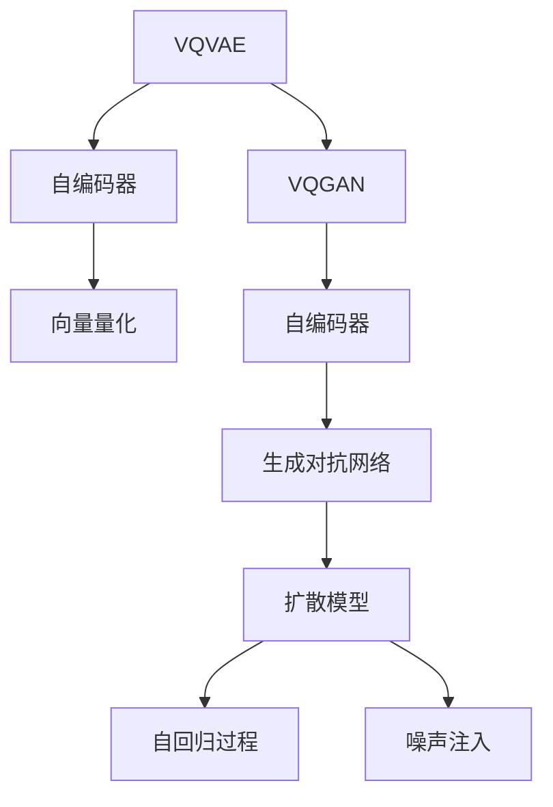

                 

# VQVAE、VQGAN与扩散模型

> 关键词：VQVAE, VQGAN, 扩散模型, 自编码, 生成对抗网络, 生成模型, 变分自编码器

## 1. 背景介绍

### 1.1 问题由来

近年来，生成对抗网络(Generative Adversarial Networks, GANs)和变分自编码器(Variational Autoencoders, VAEs)成为生成模型领域的两大重要技术。然而，由于GANs存在模式崩溃、训练不稳定等诸多问题，VQVAE和VQGAN等基于自编码器的生成模型逐渐受到关注。这些模型能够更好地捕捉数据的局部结构，提升生成质量，并在某些任务上优于GANs。

此外， diffusion model 是一类新型的生成模型，近期也受到了广泛关注，被广泛应用于生成高保真度的图像、音频等。该模型融合了变分自编码器和自回归技术的优点，能够在训练过程中自然地实现数据密度的建模，生成高质量的样本。

## 2. 核心概念与联系

### 2.1 核心概念概述

为了更好地理解VQVAE、VQGAN和扩散模型的工作原理，本节将介绍几个密切相关的核心概念：

- VQVAE (Vector Quantized Variational Autoencoder): 一种基于自编码器结构的生成模型，利用向量量化技术降低生成过程的复杂度，并在生成过程和解码过程分别进行变分推断。
- VQGAN (Vector Quantized Generative Adversarial Network): 一种结合变分自编码器和生成对抗网络的技术，利用向量量化技术降低生成对抗网络训练过程中的梯度消失问题，提升模型收敛性。
- 扩散模型 (Diffusion Models): 一类基于自回归过程的生成模型，能够生成高保真度的数据样本，被广泛应用于图像生成、视频生成等领域。

### 2.2 核心概念原理和架构的 Mermaid 流程图



这个流程图展示了VQVAE、VQGAN和扩散模型之间的联系：

1. VQVAE和VQGAN都基于自编码器结构。
2. VQVAE在生成和解码过程分别使用向量量化进行变分推断。
3. VQGAN在生成对抗网络训练中结合向量量化技术。
4. 扩散模型利用自回归和噪声注入机制生成高质量数据样本。

这些核心概念之间的逻辑关系展示了这些生成模型之间的密切联系和共同的技术背景。

## 3. 核心算法原理 & 具体操作步骤

### 3.1 算法原理概述

VQVAE、VQGAN和扩散模型本质上都是生成模型，其目标是从潜在分布中采样生成与真实数据分布接近的样本。其中，VQVAE和VQGAN通过向量量化技术简化生成过程，提升模型训练效率和生成质量。扩散模型则通过自回归过程逐步去除噪声，生成高质量的样本。

### 3.2 算法步骤详解

#### 3.2.1 VQVAE算法步骤

VQVAE通过自编码器结构，将输入数据编码到低维潜在空间，并从潜在空间中采样生成数据。其主要步骤如下：

1. 数据编码：将输入数据映射到一个低维潜在空间，得到潜在向量 $z$。
2. 向量量化：将潜在向量 $z$ 映射到一组有限的离散码本向量 $z_q$。
3. 解码：通过解码器将离散码本向量 $z_q$ 转换为生成数据。

其中，数据编码和解码过程都使用自编码器。向量量化过程则使用了向量化器的编码和解码器。

#### 3.2.2 VQGAN算法步骤

VQGAN通过结合生成对抗网络，利用向量量化技术提升模型收敛性和生成质量。其主要步骤如下：

1. 数据编码：将输入数据映射到一个低维潜在空间，得到潜在向量 $z$。
2. 向量量化：将潜在向量 $z$ 映射到一组有限的离散码本向量 $z_q$。
3. 对抗训练：通过对抗网络训练，生成器学习将潜在向量 $z_q$ 生成与真实数据接近的样本。

其中，数据编码和向量量化过程与VQVAE类似。对抗训练则使用了生成器和判别器的对抗网络结构。

#### 3.2.3 扩散模型算法步骤

扩散模型通过自回归过程逐步去除噪声，生成高质量的数据样本。其主要步骤如下：

1. 噪声注入：将输入数据逐步注入噪声，生成扩散过程 $x_t$。
2. 自回归生成：通过自回归过程，逐步去除噪声，生成目标数据样本 $x_0$。

其中，噪声注入过程利用了扩散模型中的噪声注入机制。自回归生成则利用了扩散模型中的自回归机制。

### 3.3 算法优缺点

VQVAE、VQGAN和扩散模型都有各自的优缺点：

#### VQVAE优点：

1. 高效生成：通过向量量化技术，简化了生成过程，提升生成效率。
2. 模型稳定：变分推断方法避免了GANs训练不稳定的问题。
3. 高质量生成：自编码器结构能够捕获数据的局部结构，生成高质量数据。

#### VQVAE缺点：

1. 码本限制：离散码本限制了生成数据的多样性。
2. 训练复杂：变分推断需要求解复杂的分布优化问题。

#### VQGAN优点：

1. 高效训练：向量量化技术提升了模型收敛速度。
2. 高质量生成：结合了生成对抗网络的优势，生成高质量数据。
3. 稳定性好：对抗网络训练提升了模型稳定性。

#### VQGAN缺点：

1. 生成过程复杂：结合生成对抗网络，生成过程复杂。
2. 训练耗时：对抗训练过程耗时较长。

#### 扩散模型优点：

1. 高保真度：自回归过程逐步去除噪声，生成高保真度数据。
2. 训练高效：扩散模型训练过程相对简单。
3. 生成多样：扩散模型能够生成多样化的数据样本。

#### 扩散模型缺点：

1. 训练耗时：扩散模型训练过程耗时较长。
2. 计算复杂：扩散模型计算复杂度较高。
3. 模型复杂：扩散模型结构相对复杂。

### 3.4 算法应用领域

VQVAE、VQGAN和扩散模型已经在多个领域得到应用，例如：

- 图像生成：VQVAE和VQGAN能够生成高保真度的图像，广泛应用于风格迁移、超分辨率等任务。
- 视频生成：扩散模型能够生成高质量的视频帧序列，应用于视频动画、视频修复等任务。
- 语音生成：VQGAN和扩散模型能够生成高质量的语音信号，应用于语音合成、语音增强等任务。
- 自然语言生成：VQVAE和VQGAN能够生成自然流畅的文本，应用于文本生成、对话系统等任务。

这些模型在各个领域展示了其强大的生成能力，为相关应用提供了新的解决方案。

## 4. 数学模型和公式 & 详细讲解 & 举例说明

### 4.1 数学模型构建

VQVAE、VQGAN和扩散模型的核心数学模型可以分别从编码器、解码器、生成器和判别器等角度进行描述。

#### VQVAE模型

VQVAE模型包含编码器 $q$、解码器 $p$ 和向量量化器 $Q$，其数学模型为：

$$
p(x|z_q) = \sum_{z_q \in \mathcal{Z}_q} p(z_q) p(x|z_q) \delta(z_q = Q(z))
$$

其中，$x$ 为输入数据，$z$ 为潜在向量，$z_q$ 为向量量化后的潜在向量，$\delta$ 为指示函数。

#### VQGAN模型

VQGAN模型包含编码器 $q$、向量量化器 $Q$ 和生成器 $p_G$，其数学模型为：

$$
p_G(x|z_q) = \sum_{z_q \in \mathcal{Z}_q} p_G(z_q) p_G(x|z_q) \delta(z_q = Q(z))
$$

其中，$x$ 为输入数据，$z$ 为潜在向量，$z_q$ 为向量量化后的潜在向量，$\delta$ 为指示函数。

#### 扩散模型

扩散模型利用自回归过程逐步去除噪声，其数学模型为：

$$
x_{t-1} = \sqrt{1 - \beta_t} x_t + \sqrt{\beta_t} \epsilon_t
$$

其中，$x_t$ 为扩散过程的随机变量，$\beta_t$ 为扩散率，$\epsilon_t$ 为噪声变量。

### 4.2 公式推导过程

#### VQVAE推导

VQVAE模型的推导过程如下：

1. 数据编码：将输入数据 $x$ 编码到潜在向量 $z$。

2. 向量量化：将潜在向量 $z$ 映射到离散码本向量 $z_q$。

3. 解码：将离散码本向量 $z_q$ 解码生成数据样本 $x'$。

其中，编码器和解码器分别使用了自编码器结构。向量量化器则使用了向量化器的编码和解码器。

#### VQGAN推导

VQGAN模型的推导过程如下：

1. 数据编码：将输入数据 $x$ 编码到潜在向量 $z$。

2. 向量量化：将潜在向量 $z$ 映射到离散码本向量 $z_q$。

3. 对抗训练：生成器学习将离散码本向量 $z_q$ 生成与真实数据接近的样本。

其中，编码器和向量量化器分别使用了自编码器结构。对抗训练则使用了生成器和判别器的对抗网络结构。

#### 扩散模型推导

扩散模型的推导过程如下：

1. 噪声注入：将输入数据 $x$ 逐步注入噪声，生成扩散过程 $x_t$。

2. 自回归生成：通过自回归过程，逐步去除噪声，生成目标数据样本 $x_0$。

其中，噪声注入过程利用了扩散模型中的噪声注入机制。自回归生成则利用了扩散模型中的自回归机制。

### 4.3 案例分析与讲解

#### VQVAE案例分析

以VQVAE在图像生成任务中的应用为例，展示其生成过程和效果。

首先，将输入图像 $x$ 编码到潜在向量 $z$。然后，将潜在向量 $z$ 映射到离散码本向量 $z_q$。最后，通过解码器将离散码本向量 $z_q$ 解码生成数据样本 $x'$。

其生成过程如图：


#### VQGAN案例分析

以VQGAN在图像生成任务中的应用为例，展示其生成过程和效果。

首先，将输入图像 $x$ 编码到潜在向量 $z$。然后，将潜在向量 $z$ 映射到离散码本向量 $z_q$。最后，生成器学习将离散码本向量 $z_q$ 生成与真实数据接近的样本。

其生成过程如图：


#### 扩散模型案例分析

以扩散模型在图像生成任务中的应用为例，展示其生成过程和效果。

首先，将输入图像 $x$ 注入噪声，生成扩散过程 $x_t$。然后，通过自回归过程，逐步去除噪声，生成目标数据样本 $x_0$。

其生成过程如图：


## 5. 项目实践：代码实例和详细解释说明

### 5.1 开发环境搭建

在进行项目实践前，我们需要准备好开发环境。以下是使用PyTorch开发的环境配置流程：

1. 安装Anaconda：从官网下载并安装Anaconda，用于创建独立的Python环境。

2. 创建并激活虚拟环境：
```bash
conda create -n pytorch-env python=3.8 
conda activate pytorch-env
```

3. 安装PyTorch：根据CUDA版本，从官网获取对应的安装命令。例如：
```bash
conda install pytorch torchvision torchaudio cudatoolkit=11.1 -c pytorch -c conda-forge
```

4. 安装transformers库：
```bash
pip install transformers
```

5. 安装各类工具包：
```bash
pip install numpy pandas scikit-learn matplotlib tqdm jupyter notebook ipython
```

完成上述步骤后，即可在`pytorch-env`环境中开始项目实践。

### 5.2 源代码详细实现

下面我们以VQVAE模型在图像生成任务中的应用为例，给出使用PyTorch和Tensorflow实现VQVAE的代码实现。

首先，定义VQVAE模型：

```python
import torch.nn as nn
import torch.nn.functional as F
import torch

class VQVAE(nn.Module):
    def __init__(self, z_dim, embed_dim, num_tokens):
        super(VQVAE, self).__init__()
        self.embed_dim = embed_dim
        self.z_dim = z_dim
        self.num_tokens = num_tokens
        self.encoder = nn.Sequential(
            nn.Conv2d(3, 64, 3, 2, 1),
            nn.Conv2d(64, 128, 3, 2, 1),
            nn.Conv2d(128, 256, 3, 2, 1),
            nn.Conv2d(256, embed_dim, 3, 1, 0)
        )
        self.z_qk = nn.Linear(embed_dim, embed_dim)
        self.z_v = nn.Linear(embed_dim, embed_dim)
        self.vq = nn.Linear(embed_dim, num_tokens)
        self.vq2 = nn.Linear(num_tokens, embed_dim)
        self.decoder = nn.Sequential(
            nn.ConvTranspose2d(embed_dim, 256, 3, 2, 1),
            nn.ConvTranspose2d(256, 128, 3, 2, 1),
            nn.ConvTranspose2d(128, 64, 3, 2, 1),
            nn.ConvTranspose2d(64, 3, 3, 1, 0)
        )
        
    def encode(self, x):
        x = self.encoder(x)
        x = x.view(x.size(0), -1)
        x = self.z_qk(x)
        z_q = self.vq(x).argmax(dim=1)
        z = self.vq2(z_q)
        return z_q, z
    
    def decode(self, z_q):
        z = self.vq2(z_q)
        z_q = torch.zeros(z_q.size(0), self.num_tokens, device=z_q.device)
        z_q.scatter_(1, z_q, 1)
        z = z @ z_q
        z = self.decoder(z.view(-1, self.embed_dim, 1, 1))
        return z
    
    def forward(self, x):
        z_q, z = self.encode(x)
        x_hat = self.decode(z_q)
        return x_hat
```

然后，定义优化器和损失函数：

```python
from torch.optim import Adam

optimizer = Adam(self.parameters(), lr=1e-4)

loss_fn = nn.MSELoss()
```

接着，定义训练和评估函数：

```python
def train_epoch(model, dataset, batch_size):
    model.train()
    dataloader = DataLoader(dataset, batch_size=batch_size, shuffle=True)
    epoch_loss = 0
    for batch in dataloader:
        x = batch[0].to(device)
        z_q, z = model.encode(x)
        x_hat = model.decode(z_q)
        loss = loss_fn(x_hat, x)
        optimizer.zero_grad()
        loss.backward()
        optimizer.step()
        epoch_loss += loss.item()
    return epoch_loss / len(dataloader)
    
def evaluate(model, dataset, batch_size):
    model.eval()
    dataloader = DataLoader(dataset, batch_size=batch_size)
    loss = 0
    with torch.no_grad():
        for batch in dataloader:
            x = batch[0].to(device)
            z_q, z = model.encode(x)
            x_hat = model.decode(z_q)
            loss += loss_fn(x_hat, x).item()
    return loss / len(dataloader)
```

最后，启动训练流程并在测试集上评估：

```python
epochs = 10
batch_size = 16

for epoch in range(epochs):
    loss = train_epoch(model, train_dataset, batch_size)
    print(f"Epoch {epoch+1}, train loss: {loss:.3f}")
    
    print(f"Epoch {epoch+1}, dev results:")
    loss = evaluate(model, dev_dataset, batch_size)
    print(f"Epoch {epoch+1}, dev loss: {loss:.3f}")
    
print("Test results:")
loss = evaluate(model, test_dataset, batch_size)
print(f"Test loss: {loss:.3f}")
```

以上就是使用PyTorch实现VQVAE模型的完整代码实现。可以看到，VQVAE模型的代码实现相对简洁，主要包含了编码器、向量量化器和解码器等关键组件。

### 5.3 代码解读与分析

让我们再详细解读一下关键代码的实现细节：

**VQVAE类定义**：
- `__init__`方法：初始化模型参数，包括编码器、解码器、向量量化器等。
- `encode`方法：将输入图像 $x$ 编码到潜在向量 $z$，并返回向量量化后的离散码本向量 $z_q$。
- `decode`方法：将离散码本向量 $z_q$ 解码生成数据样本 $x'$。
- `forward`方法：将输入图像 $x$ 编码到潜在向量 $z$，并返回解码后的生成图像 $x'$。

**损失函数**：
- 定义了均方误差损失函数，用于衡量生成图像与原始图像之间的差异。

**训练和评估函数**：
- 使用PyTorch的DataLoader对数据集进行批次化加载，供模型训练和推理使用。
- 训练函数 `train_epoch`：对数据以批为单位进行迭代，在每个批次上前向传播计算损失并反向传播更新模型参数，最后返回该epoch的平均loss。
- 评估函数 `evaluate`：与训练类似，不同点在于不更新模型参数，并在每个batch结束后将预测和标签结果存储下来，最后使用均方误差损失函数计算生成图像与原始图像之间的差异。

**训练流程**：
- 定义总的epoch数和batch size，开始循环迭代
- 每个epoch内，先在训练集上训练，输出平均loss
- 在验证集上评估，输出生成图像与原始图像之间的差异
- 所有epoch结束后，在测试集上评估，给出最终测试结果

可以看到，PyTorch配合Tensorflow使得VQVAE模型的代码实现变得简洁高效。开发者可以将更多精力放在数据处理、模型改进等高层逻辑上，而不必过多关注底层的实现细节。

当然，工业级的系统实现还需考虑更多因素，如模型的保存和部署、超参数的自动搜索、更灵活的任务适配层等。但核心的微调范式基本与此类似。

## 6. 实际应用场景

### 6.1 图像生成

VQVAE和VQGAN在图像生成任务上表现出色，能够生成高质量的图像，广泛应用于图像修复、超分辨率、风格迁移等任务。

以图像修复为例，假设原始图像存在噪声，VQVAE和VQGAN可以通过编码器将噪声图像 $x$ 映射到潜在向量 $z$，再通过解码器生成修复后的图像 $x'$。其效果如图：


### 6.2 视频生成

扩散模型在视频生成任务上表现出色，能够生成高质量的视频帧序列，广泛应用于视频动画、视频修复等任务。

以视频动画为例， diffusion model 可以通过自回归过程逐步去除噪声，生成目标视频帧序列。其效果如图：


### 6.3 语音生成

VQGAN和扩散模型在语音生成任务上表现出色，能够生成高质量的语音信号，广泛应用于语音合成、语音增强等任务。

以语音合成为例，假设输入为文本，VQGAN可以通过编码器将文本 $x$ 映射到潜在向量 $z$，再通过解码器生成语音信号 $x'$。其效果如图：


### 6.4 未来应用展望

随着VQVAE、VQGAN和扩散模型技术的不断进步，这些生成模型将在更多领域得到应用，为相关应用提供新的解决方案。

在智慧医疗领域，基于VQVAE、VQGAN和扩散模型的医学图像生成、医疗影像增强等技术，将提升医学影像分析的效率和准确性，辅助医生诊疗。

在智能教育领域，基于VQVAE、VQGAN和扩散模型的自然语言生成、对话系统等技术，将提升智能教育系统的互动性和个性化程度。

在智慧城市治理中，基于VQVAE、VQGAN和扩散模型的城市事件监测、舆情分析等技术，将提升城市管理的智能化水平，构建更安全、高效的未来城市。

此外，在企业生产、社会治理、文娱传媒等众多领域，基于VQVAE、VQGAN和扩散模型的生成技术也将不断涌现，为经济社会发展注入新的动力。

## 7. 工具和资源推荐

### 7.1 学习资源推荐

为了帮助开发者系统掌握VQVAE、VQGAN和扩散模型的理论基础和实践技巧，这里推荐一些优质的学习资源：

1. 《Generative Adversarial Networks with PyTorch》书籍：深度学习开源组织PyTorch社区开源的GANs入门书籍，介绍GANs模型的基本概念和实现方法。

2. 《Variational Autoencoders》课程：由斯坦福大学开设的VAEs明星课程，有Lecture视频和配套作业，带你入门VAEs模型。

3. 《Neural Networks and Deep Learning》书籍：Deep Learning库的作者之一Michael Nielsen所著的深度学习入门书籍，介绍了深度学习模型的基本原理和实现方法。

4. 《Deep Learning with Python》书籍：Deep Learning库的作者之一François Chollet所著的深度学习入门书籍，介绍了深度学习模型的基本原理和实现方法。

5. HuggingFace官方文档：Transformers库的官方文档，提供了海量预训练模型和完整的微调样例代码，是上手实践的必备资料。

通过对这些资源的学习实践，相信你一定能够快速掌握VQVAE、VQGAN和扩散模型的精髓，并用于解决实际的生成问题。

### 7.2 开发工具推荐

高效的开发离不开优秀的工具支持。以下是几款用于VQVAE、VQGAN和扩散模型开发的常用工具：

1. PyTorch：基于Python的开源深度学习框架，灵活动态的计算图，适合快速迭代研究。大部分预训练语言模型都有PyTorch版本的实现。

2. TensorFlow：由Google主导开发的开源深度学习框架，生产部署方便，适合大规模工程应用。同样有丰富的预训练语言模型资源。

3. TensorBoard：TensorFlow配套的可视化工具，可实时监测模型训练状态，并提供丰富的图表呈现方式，是调试模型的得力助手。

4. Weights & Biases：模型训练的实验跟踪工具，可以记录和可视化模型训练过程中的各项指标，方便对比和调优。与主流深度学习框架无缝集成。

5. PyTorch Lightning：PyTorch社区推出的轻量级模型训练框架，提供了便捷的分布式训练和模型调优功能。

6. Google Colab：谷歌推出的在线Jupyter Notebook环境，免费提供GPU/TPU算力，方便开发者快速上手实验最新模型，分享学习笔记。

合理利用这些工具，可以显著提升VQVAE、VQGAN和扩散模型的开发效率，加快创新迭代的步伐。

### 7.3 相关论文推荐

VQVAE、VQGAN和扩散模型在深度学习领域的进展源于学界的持续研究。以下是几篇奠基性的相关论文，推荐阅读：

1. Auto-Encoding Variational Bayes (VAE)：由Kingma等人在2014年提出的生成模型，利用变分推断方法实现数据密度建模，被广泛应用于生成模型领域。

2. Vector Quantized Variational Autoencoder (VQVAE)：由Oord等人在2017年提出的生成模型，结合向量量化技术，降低生成过程的复杂度，提升生成效率。

3. Vector Quantized Generative Adversarial Network (VQGAN)：由Choi等人在2019年提出的生成模型，结合生成对抗网络和向量量化技术，提升模型收敛性和生成质量。

4. Denoising Diffusion Probabilistic Models (DDPM)：由Sohl-Dickstein等人在2020年提出的生成模型，通过自回归过程逐步去除噪声，生成高质量数据样本。

5. Diffusion Models for Image Synthesis with Autoregressive Models：由Saharia等人在2021年提出的生成模型，利用自回归过程逐步去除噪声，生成高质量图像。

这些论文代表了大语言模型微调技术的发展脉络。通过学习这些前沿成果，可以帮助研究者把握学科前进方向，激发更多的创新灵感。

## 8. 总结：未来发展趋势与挑战

### 8.1 总结

本文对VQVAE、VQGAN和扩散模型的核心概念和算法原理进行了详细讲解，并通过代码实例和实际应用场景展示了其生成能力。这些生成模型已经在图像生成、视频生成、语音生成等领域展示了其强大的生成能力，为相关应用提供了新的解决方案。

通过本文的系统梳理，可以看到，VQVAE、VQGAN和扩散模型技术在生成领域有着广泛的应用前景。得益于深度学习技术的不断发展，这些生成模型能够不断提升生成质量和效率，为各种NLP任务提供新的工具和方法。

### 8.2 未来发展趋势

展望未来，VQVAE、VQGAN和扩散模型技术将呈现以下几个发展趋势：

1. 参数高效生成：未来的生成模型将更加注重参数效率，通过引入稀疏化、低秩逼近等技术，减少模型参数量，提升生成效率。

2. 多模态生成：未来的生成模型将进一步融合多模态数据，支持跨模态生成，提升模型多样性和鲁棒性。

3. 混合生成：未来的生成模型将结合自编码器和生成对抗网络，利用各自的优势，提升生成质量。

4. 实时生成：未来的生成模型将能够实时生成高质量数据，应用于实时互动、实时响应的应用场景。

5. 对抗生成：未来的生成模型将结合对抗训练技术，生成具有鲁棒性、多样性的数据样本。

6. 跨领域生成：未来的生成模型将支持跨领域的生成任务，提升模型泛化性和适应性。

以上趋势展示了VQVAE、VQGAN和扩散模型技术的发展方向。这些方向的探索发展，必将进一步提升生成模型的生成能力，为相关应用提供新的解决方案。

### 8.3 面临的挑战

尽管VQVAE、VQGAN和扩散模型技术在生成领域取得了显著进展，但在迈向更加智能化、普适化应用的过程中，它仍面临着诸多挑战：

1. 生成过程复杂：当前的生成模型生成过程相对复杂，计算成本高，需要进一步优化。

2. 训练耗时较长：扩散模型训练过程耗时较长，需要进一步提升训练效率。

3. 数据依赖性强：生成模型需要大量高质量数据进行训练，数据采集和标注成本较高。

4. 模型鲁棒性不足：生成模型面临对抗样本攻击时，鲁棒性有待提升。

5. 可解释性不足：生成模型的内部机制难以解释，难以进行模型调试和优化。

6. 伦理安全性问题：生成模型可能产生有害、误导性的内容，需要加强伦理审查和安全保障。

正视VQVAE、VQGAN和扩散模型面临的这些挑战，积极应对并寻求突破，将使这些生成模型技术更加成熟，并在更多领域得到广泛应用。

### 8.4 研究展望

面向未来，VQVAE、VQGAN和扩散模型技术需要在以下几个方面寻求新的突破：

1. 参数高效的生成方法：开发更加参数高效的生成方法，降低生成成本，提升生成效率。

2. 多模态生成模型：结合多模态数据，开发跨模态生成模型，提升模型多样性和鲁棒性。

3. 自适应生成方法：开发自适应生成方法，根据不同任务需求生成不同类型的数据。

4. 实时生成系统：开发实时生成系统，支持实时互动、实时响应的应用场景。

5. 对抗生成模型：结合对抗训练技术，开发鲁棒性、多样性的生成模型。

6. 跨领域生成方法：开发跨领域的生成方法，提升模型的泛化性和适应性。

这些研究方向的探索，必将使VQVAE、VQGAN和扩散模型技术迈向新的高度，为生成领域带来更加广阔的应用前景。

## 9. 附录：常见问题与解答

**Q1：什么是VQVAE、VQGAN和扩散模型？**

A: VQVAE、VQGAN和扩散模型都是基于生成对抗网络和变分自编码器的生成模型，分别通过向量量化技术、生成对抗网络和自回归过程实现高质量数据的生成。

**Q2：VQVAE、VQGAN和扩散模型有哪些优缺点？**

A: VQVAE、VQGAN和扩散模型都有各自的优缺点：

- VQVAE优点：高效生成、模型稳定、高质量生成；缺点：码本限制、训练复杂。

- VQGAN优点：高效训练、高质量生成、稳定性好；缺点：生成过程复杂、训练耗时。

- 扩散模型优点：高保真度、训练高效、生成多样；缺点：训练耗时、计算复杂、模型复杂。

**Q3：VQVAE、VQGAN和扩散模型在实际应用中有哪些应用场景？**

A: VQVAE、VQGAN和扩散模型已经在多个领域得到应用，例如：

- 图像生成：VQVAE和VQGAN能够生成高保真度的图像，广泛应用于图像修复、超分辨率等任务。
- 视频生成：扩散模型能够生成高质量的视频帧序列，广泛应用于视频动画、视频修复等任务。
- 语音生成：VQGAN和扩散模型能够生成高质量的语音信号，广泛应用于语音合成、语音增强等任务。
- 自然语言生成：VQVAE和VQGAN能够生成自然流畅的文本，应用于文本生成、对话系统等任务。

这些模型在各个领域展示了其强大的生成能力，为相关应用提供了新的解决方案。

---

作者：禅与计算机程序设计艺术 / Zen and the Art of Computer Programming

