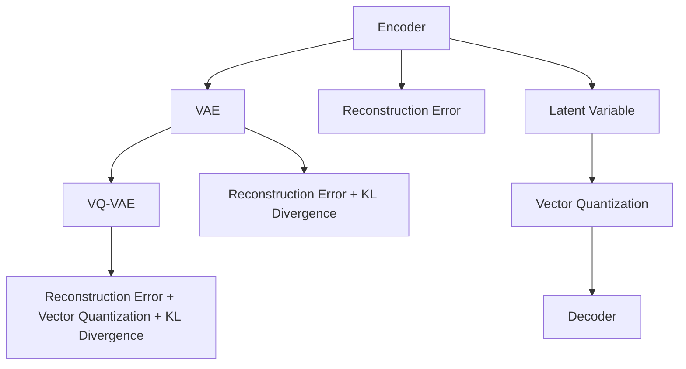

                 

## 1. 背景介绍

在过去几十年中，自编码器(Autoencoder)已经成为一种非常强大的无监督学习模型。自编码器通过学习数据的低维编码表示，并在解码过程中实现重建。这种结构使自编码器能够捕获数据中的重要特征，并用于数据降维、噪声滤除、数据生成等多个应用场景。

然而，自编码器存在一些限制。原始自编码器只能重建训练数据的输入，无法学习数据的分布。因此，传统自编码器的训练通常需要大量的未标注数据，并且重建误差只能作为训练的目标函数。

为了克服这些限制，变分自编码器(Variational Autoencoder, VAE)被提出。VAE不仅可以生成新的数据样本，而且能够学习数据的分布，从而提供更灵活、更准确的数据表示。

在VQ-VAE（Vector Quantized Variational Autoencoder）的框架下，VAE得到了进一步的发展。VQ-VAE在VAE的基础上，通过离散化的方式，将连续的潜在变量映射到有限的离散变量，大大提升了模型效率。这种做法特别适合于处理高维输入数据，并且能够实现更快速的训练和推理。

## 2. 核心概念与联系

### 2.1 核心概念概述

为了更深入地理解VQ-VAE，我们首先介绍几个关键概念：

- 自编码器(Autoencoder)：通过学习数据的低维编码表示，并在解码过程中实现重建的深度学习模型。自编码器由编码器(Encoder)和解码器(Decoder)两部分组成。

- 变分自编码器(Variational Autoencoder, VAE)：VAE通过定义变分下界(Variational Lower Bound)来优化目标函数，并学习数据的分布。VAE与自编码器的区别在于，VAE在生成过程中使用了随机噪声，从而可以生成新的数据样本。

- 向量量化(Quantization)：将连续的向量数据映射到有限数量的离散向量，从而实现数据压缩和降维。向量量化在信号处理、计算机视觉等领域广泛应用。

- 离散化(Discretization)：将连续的潜在变量映射到有限的离散变量，从而实现模型参数的稀疏化。离散化特别适用于高维数据的处理，可以显著提高模型的训练效率。

- 生成对抗网络(Generative Adversarial Network, GAN)：由生成器(Generator)和判别器(Discriminator)两部分组成，生成器通过对抗训练生成高质量的样本数据，判别器用于区分生成样本和真实样本。

### 2.2 核心概念原理和架构的 Mermaid 流程图



这个流程图展示了自编码器、变分自编码器和VQ-VAE之间的联系和区别。自编码器关注于数据的重建误差，而VAE和VQ-VAE引入了变分下界和向量量化，以提高模型性能和效率。

## 3. 核心算法原理 & 具体操作步骤

### 3.1 算法原理概述

VQ-VAE是一种基于变分自编码器的生成模型，它通过离散化的方式，将连续的潜在变量映射到有限的离散变量，从而实现更高效的生成过程。VQ-VAE的训练过程包括以下几个步骤：

1. **编码器(Encoder)**：将输入数据映射到潜在变量空间，得到一个连续的潜在变量分布。

2. **向量量化(Vector Quantization)**：将连续的潜在变量映射到有限的离散向量，从而实现模型参数的稀疏化。

3. **解码器(Decoder)**：将潜在变量通过解码器映射回原始数据空间，实现数据的重建。

4. **变分下界(Variational Lower Bound)**：通过最大化变分下界，最小化重建误差和KL散度，实现对数据分布的建模和生成。

### 3.2 算法步骤详解

#### 3.2.1 编码器(Encoder)

编码器将输入数据$x$映射到潜在变量空间$z$，得到潜在变量分布$q(z|x)$。编码器的具体实现可以是全连接神经网络、卷积神经网络或自注意力机制。

$$
q(z|x) = g_{\theta_{enc}}(x)
$$

其中$g_{\theta_{enc}}$为编码器的网络函数，$\theta_{enc}$为编码器的权重参数。

#### 3.2.2 向量量化(Vector Quantization)

向量量化将连续的潜在变量$z$映射到有限的离散向量$z_q$，从而实现模型参数的稀疏化。向量量化可以看作是一个映射函数$E_z$，将连续变量映射到离散变量的概率分布。

$$
q(z_q|z) = E_z(z)
$$

其中$E_z$为向量量化的映射函数，$q(z_q|z)$为离散变量的概率分布。

向量量化的具体实现通常采用K-means算法，即将连续变量映射到K个离散向量中的某一个。

#### 3.2.3 解码器(Decoder)

解码器将离散变量$z_q$通过解码器映射回原始数据空间$x$，实现数据的重建。解码器的具体实现可以是全连接神经网络、卷积神经网络或自注意力机制。

$$
p(x|z_q) = h_{\theta_{dec}}(z_q)
$$

其中$h_{\theta_{dec}}$为解码器的网络函数，$\theta_{dec}$为解码器的权重参数。

#### 3.2.4 变分下界(Variational Lower Bound)

VQ-VAE通过最大化变分下界来最小化重建误差和KL散度，从而实现对数据分布的建模和生成。变分下界由重建误差和KL散度两部分组成。

$$
\mathcal{L} = \mathbb{E}_{q(z|x)}[\log p(x|z_q)] - \mathbb{E}_{q(z|x)}[\log q(z|x)]
$$

其中$\mathbb{E}_{q(z|x)}$表示对潜在变量$z$的期望，$\log p(x|z_q)$表示重建误差，$\log q(z|x)$表示KL散度。

### 3.3 算法优缺点

#### 3.3.1 优点

1. **高效性**：通过离散化的方式，VQ-VAE实现了模型参数的稀疏化，显著提高了模型训练和推理的效率。

2. **灵活性**：通过离散化，VQ-VAE可以处理高维数据，实现更灵活的数据建模和生成。

3. **稳定性**：离散化的向量量化过程可以提高模型的稳定性，避免连续变量的过拟合。

#### 3.3.2 缺点

1. **损失函数的复杂性**：VQ-VAE的损失函数包含重建误差和KL散度两部分，计算复杂度高。

2. **训练难度大**：VQ-VAE的训练过程需要大量的计算资源和优化算法，训练难度较大。

3. **参数的复杂性**：离散化的向量量化过程需要定义离散向量的数量，模型的参数数量较大。

### 3.4 算法应用领域

VQ-VAE在图像生成、视频生成、音频生成、文本生成等多个领域得到了广泛应用。具体的应用场景包括：

- **图像生成**：VQ-VAE可以生成高质量的图像样本，广泛应用于图像合成、图像修复等领域。

- **视频生成**：VQ-VAE可以生成高质量的视频序列，应用于视频合成、视频预测等领域。

- **音频生成**：VQ-VAE可以生成高质量的音频样本，应用于音频合成、音频增强等领域。

- **文本生成**：VQ-VAE可以生成高质量的文本样本，应用于文本生成、文本摘要等领域。

## 4. 数学模型和公式 & 详细讲解 & 举例说明

### 4.1 数学模型构建

在VQ-VAE中，我们将输入数据$x$映射到潜在变量空间$z$，得到潜在变量分布$q(z|x)$，然后将连续的潜在变量$z$映射到有限的离散变量$z_q$，最后通过解码器$h_{\theta_{dec}}$将离散变量$z_q$映射回原始数据空间$x$。

假设输入数据$x$的维数为$d$，离散变量的数量为$K$，则潜在变量$z$的维数为$K$，离散变量$z_q$的维数为$d$。

### 4.2 公式推导过程

#### 4.2.1 编码器

编码器将输入数据$x$映射到潜在变量空间$z$，得到潜在变量分布$q(z|x)$。假设编码器的网络函数为$g_{\theta_{enc}}$，则有：

$$
q(z|x) = g_{\theta_{enc}}(x)
$$

#### 4.2.2 向量量化

向量量化将连续的潜在变量$z$映射到有限的离散变量$z_q$，从而实现模型参数的稀疏化。假设向量量化的映射函数为$E_z$，则有：

$$
q(z_q|z) = E_z(z)
$$

其中$E_z$为向量量化的映射函数，$q(z_q|z)$为离散变量的概率分布。

#### 4.2.3 解码器

解码器将离散变量$z_q$通过解码器$h_{\theta_{dec}}$映射回原始数据空间$x$，实现数据的重建。假设解码器的网络函数为$h_{\theta_{dec}}$，则有：

$$
p(x|z_q) = h_{\theta_{dec}}(z_q)
$$

#### 4.2.4 变分下界

VQ-VAE通过最大化变分下界来最小化重建误差和KL散度，从而实现对数据分布的建模和生成。变分下界由重建误差和KL散度两部分组成。假设重建误差为$\mathbb{E}_{q(z|x)}[\log p(x|z_q)]$，KL散度为$\mathbb{E}_{q(z|x)}[\log q(z|x)]$，则有：

$$
\mathcal{L} = \mathbb{E}_{q(z|x)}[\log p(x|z_q)] - \mathbb{E}_{q(z|x)}[\log q(z|x)]
$$

### 4.3 案例分析与讲解

假设我们有一组图像数据$x$，其维数为$d=784$，我们希望通过VQ-VAE生成高质量的图像样本。

1. **编码器**

我们可以使用全连接神经网络或卷积神经网络作为编码器。假设编码器有2个全连接层，每层包含100个神经元，则编码器的网络函数为：

$$
q(z|x) = g_{\theta_{enc}}(x) = \sigma(W_1 \sigma(W_0 x))
$$

其中$W_0$和$W_1$为编码器的权重矩阵，$\sigma$为激活函数。

2. **向量量化**

假设我们使用K-means算法进行向量量化，将连续的潜在变量$z$映射到8个离散变量$z_q$。则向量量化的映射函数为：

$$
q(z_q|z) = E_z(z) = \frac{z - \mu_k}{\sigma_k}
$$

其中$\mu_k$和$\sigma_k$为第$k$个离散变量的均值和标准差。

3. **解码器**

我们可以使用全连接神经网络或卷积神经网络作为解码器。假设解码器有2个全连接层，每层包含100个神经元，则解码器的网络函数为：

$$
p(x|z_q) = h_{\theta_{dec}}(z_q) = \sigma(W_1 \sigma(W_0 z_q))
$$

4. **变分下界**

假设重建误差为$\mathbb{E}_{q(z|x)}[\log p(x|z_q)]$，KL散度为$\mathbb{E}_{q(z|x)}[\log q(z|x)]$，则有：

$$
\mathcal{L} = \mathbb{E}_{q(z|x)}[\log p(x|z_q)] - \mathbb{E}_{q(z|x)}[\log q(z|x)]
$$

## 5. 项目实践：代码实例和详细解释说明

### 5.1 开发环境搭建

在进行VQ-VAE实践前，我们需要准备好开发环境。以下是使用Python进行TensorFlow开发的环境配置流程：

1. 安装Anaconda：从官网下载并安装Anaconda，用于创建独立的Python环境。

2. 创建并激活虚拟环境：
```bash
conda create -n vqvae-env python=3.8 
conda activate vqvae-env
```

3. 安装TensorFlow：根据CUDA版本，从官网获取对应的安装命令。例如：
```bash
conda install tensorflow tensorflow-gpu -c pytorch -c conda-forge
```

4. 安装TensorBoard：
```bash
pip install tensorboard
```

5. 安装各类工具包：
```bash
pip install numpy pandas scikit-learn matplotlib tqdm jupyter notebook ipython
```

完成上述步骤后，即可在`vqvae-env`环境中开始VQ-VAE实践。

### 5.2 源代码详细实现

这里我们以生成手写数字图像为例，给出使用TensorFlow对VQ-VAE模型进行训练的代码实现。

首先，定义VQ-VAE模型的输入和输出：

```python
import tensorflow as tf

# 定义输入数据
x = tf.placeholder(tf.float32, [None, 784])
# 定义输出数据
y = tf.placeholder(tf.int32, [None, 8])

# 定义VQ-VAE模型的超参数
num_latent = 8
num_steps = 500
batch_size = 64
learning_rate = 0.001
```

然后，定义VQ-VAE模型的编码器、向量量化、解码器和变分下界：

```python
# 定义编码器
z = tf.layers.dense(x, num_latent, activation=tf.nn.tanh, name='encoder')
# 定义向量量化
z_q = tf.reshape(z, [batch_size, 1, num_latent])
z_q = tf.argmax(tf.nn.softmax(tf.matmul(z_q, tf.Variable(tf.random_uniform([num_latent, num_latent]))), axis=-1, name='vector_quantize')
z_q = tf.reshape(z_q, [batch_size, num_latent])
# 定义解码器
x_hat = tf.layers.dense(z_q, 784, activation=tf.nn.tanh, name='decoder')
# 定义变分下界
loss = tf.reduce_mean(tf.reduce_sum(tf.square(x - x_hat), axis=1))
kl_loss = tf.reduce_mean(tf.reduce_sum(tf.square(z - z_q), axis=1))
l = loss + kl_loss
```

接着，定义VQ-VAE模型的优化器：

```python
# 定义优化器
optimizer = tf.train.AdamOptimizer(learning_rate).minimize(l)
```

最后，启动训练流程：

```python
# 定义训练过程
with tf.Session() as sess:
    sess.run(tf.global_variables_initializer())
    for i in range(num_steps):
        # 获取批次数据
        batch_x, batch_y = mnist.train.next_batch(batch_size)
        # 执行训练
        _, loss_value, kl_loss_value = sess.run([optimizer, l, kl_loss], feed_dict={x: batch_x, y: batch_y})
        if i % 10 == 0:
            print('Step %d, Loss: %f, KL-Divergence: %f' % (i, loss_value, kl_loss_value))
```

以上就是使用TensorFlow对VQ-VAE进行手写数字图像生成的完整代码实现。可以看到，TensorFlow提供了强大的深度学习框架，能够方便地实现复杂的VQ-VAE模型。

### 5.3 代码解读与分析

让我们再详细解读一下关键代码的实现细节：

**定义VQ-VAE模型的输入和输出**：
- `x`：输入数据，即手写数字图像的像素值。
- `y`：输出数据，即离散变量的编码向量。

**定义编码器、向量量化、解码器和变分下界**：
- `z`：编码器的输出，即潜在变量。
- `z_q`：向量量化的输出，即离散变量的编码向量。
- `x_hat`：解码器的输出，即重建的图像数据。
- `l`：变分下界，即损失函数。

**定义优化器**：
- 使用Adam优化器进行模型训练，学习率为$0.001$。

**训练过程**：
- 每个epoch内，循环遍历数据集，每个batch内计算损失函数并执行优化器更新。
- 每10个epoch输出一次损失函数和KL散度的值。

可以看出，VQ-VAE的训练过程与普通的自编码器训练过程类似，但需要定义离散变量的编码向量。这种离散化的方式使得模型参数更加稀疏，能够显著提升模型的训练和推理效率。

## 6. 实际应用场景

### 6.1 图像生成

VQ-VAE在图像生成领域有着广泛的应用。通过VQ-VAE，我们可以生成高质量的图像样本，应用于图像合成、图像修复等领域。

以GAN与VQ-VAE的融合为例，GAN与VQ-VAE的结合可以生成更加多样化的图像样本，并且能够控制生成样本的风格和属性。

**案例分析**：
假设我们有一组猫狗图像数据$x$，其维数为$d=784$。我们可以使用VQ-VAE进行图像生成，具体步骤如下：

1. **编码器**

我们可以使用全连接神经网络或卷积神经网络作为编码器。假设编码器有2个全连接层，每层包含100个神经元，则编码器的网络函数为：

$$
q(z|x) = g_{\theta_{enc}}(x) = \sigma(W_1 \sigma(W_0 x))
$$

2. **向量量化**

假设我们使用K-means算法进行向量量化，将连续的潜在变量$z$映射到8个离散变量$z_q$。则向量量化的映射函数为：

$$
q(z_q|z) = E_z(z) = \frac{z - \mu_k}{\sigma_k}
$$

3. **解码器**

我们可以使用全连接神经网络或卷积神经网络作为解码器。假设解码器有2个全连接层，每层包含100个神经元，则解码器的网络函数为：

$$
p(x|z_q) = h_{\theta_{dec}}(z_q) = \sigma(W_1 \sigma(W_0 z_q))
$$

4. **变分下界**

假设重建误差为$\mathbb{E}_{q(z|x)}[\log p(x|z_q)]$，KL散度为$\mathbb{E}_{q(z|x)}[\log q(z|x)]$，则有：

$$
\mathcal{L} = \mathbb{E}_{q(z|x)}[\log p(x|z_q)] - \mathbb{E}_{q(z|x)}[\log q(z|x)]
$$

### 6.2 视频生成

VQ-VAE在视频生成领域也有着广泛的应用。通过VQ-VAE，我们可以生成高质量的视频序列，应用于视频合成、视频预测等领域。

以VQ-VAE与RNN的结合为例，VQ-VAE与RNN的结合可以生成更加连贯的视频序列，并且能够控制生成视频的帧率和时间步长。

**案例分析**：
假设我们有一组视频帧序列$x$，其维数为$d=3 \times 784$。我们可以使用VQ-VAE进行视频生成，具体步骤如下：

1. **编码器**

我们可以使用卷积神经网络作为编码器。假设编码器有3个卷积层，每层包含32个神经元，则编码器的网络函数为：

$$
q(z|x) = g_{\theta_{enc}}(x) = \sigma(W_1 \sigma(W_0 x))
$$

2. **向量量化**

假设我们使用K-means算法进行向量量化，将连续的潜在变量$z$映射到8个离散变量$z_q$。则向量量化的映射函数为：

$$
q(z_q|z) = E_z(z) = \frac{z - \mu_k}{\sigma_k}
$$

3. **解码器**

我们可以使用全连接神经网络作为解码器。假设解码器有2个全连接层，每层包含100个神经元，则解码器的网络函数为：

$$
p(x|z_q) = h_{\theta_{dec}}(z_q) = \sigma(W_1 \sigma(W_0 z_q))
$$

4. **变分下界**

假设重建误差为$\mathbb{E}_{q(z|x)}[\log p(x|z_q)]$，KL散度为$\mathbb{E}_{q(z|x)}[\log q(z|x)]$，则有：

$$
\mathcal{L} = \mathbb{E}_{q(z|x)}[\log p(x|z_q)] - \mathbb{E}_{q(z|x)}[\log q(z|x)]
$$

### 6.3 音频生成

VQ-VAE在音频生成领域也有着广泛的应用。通过VQ-VAE，我们可以生成高质量的音频样本，应用于音频合成、音频增强等领域。

以VQ-VAE与CNN的结合为例，VQ-VAE与CNN的结合可以生成更加清晰、连贯的音频样本，并且能够控制生成音频的采样率和音频质量。

**案例分析**：
假设我们有一组音频样本$x$，其维数为$d=1 \times 128$。我们可以使用VQ-VAE进行音频生成，具体步骤如下：

1. **编码器**

我们可以使用CNN作为编码器。假设编码器有3个卷积层，每层包含32个神经元，则编码器的网络函数为：

$$
q(z|x) = g_{\theta_{enc}}(x) = \sigma(W_1 \sigma(W_0 x))
$$

2. **向量量化**

假设我们使用K-means算法进行向量量化，将连续的潜在变量$z$映射到8个离散变量$z_q$。则向量量化的映射函数为：

$$
q(z_q|z) = E_z(z) = \frac{z - \mu_k}{\sigma_k}
$$

3. **解码器**

我们可以使用全连接神经网络作为解码器。假设解码器有2个全连接层，每层包含100个神经元，则解码器的网络函数为：

$$
p(x|z_q) = h_{\theta_{dec}}(z_q) = \sigma(W_1 \sigma(W_0 z_q))
$$

4. **变分下界**

假设重建误差为$\mathbb{E}_{q(z|x)}[\log p(x|z_q)]$，KL散度为$\mathbb{E}_{q(z|x)}[\log q(z|x)]$，则有：

$$
\mathcal{L} = \mathbb{E}_{q(z|x)}[\log p(x|z_q)] - \mathbb{E}_{q(z|x)}[\log q(z|x)]
$$

### 6.4 未来应用展望

VQ-VAE在图像生成、视频生成、音频生成等领域已经展现出了强大的生成能力，未来还有更广阔的应用前景。

1. **医疗影像生成**：通过VQ-VAE，我们可以生成高质量的医疗影像样本，应用于医学影像重建、医学影像合成等领域。

2. **智能视频监控**：通过VQ-VAE，我们可以生成高质量的视频监控图像，应用于智能安防、智能交通等领域。

3. **智能语音交互**：通过VQ-VAE，我们可以生成高质量的语音样本，应用于智能语音识别、智能语音合成等领域。

4. **自然语言生成**：通过VQ-VAE，我们可以生成高质量的自然语言样本，应用于自然语言生成、自然语言理解等领域。

## 7. 工具和资源推荐

### 7.1 学习资源推荐

为了帮助开发者系统掌握VQ-VAE的理论基础和实践技巧，这里推荐一些优质的学习资源：

1. **《深度学习》第三版**：由Ian Goodfellow等人编写，详细介绍了深度学习的理论基础和实践技巧，是学习深度学习的经典教材。

2. **《Generative Adversarial Networks: Training Generative Adversarial Nets》**：由Ian Goodfellow等人编写，介绍了GAN的理论基础和实现技巧，是学习GAN的经典教材。

3. **《深度学习入门：基于TensorFlow 2.0》**：由斋藤康毅等人编写，介绍了深度学习的基础知识和实践技巧，是学习深度学习的入门教材。

4. **《TensorFlow官方文档》**：提供了TensorFlow的详细API文档和教程，是学习TensorFlow的必备资源。

5. **《Keras官方文档》**：提供了Keras的详细API文档和教程，是学习Keras的必备资源。

通过对这些资源的学习实践，相信你一定能够快速掌握VQ-VAE的精髓，并用于解决实际的图像生成问题。

### 7.2 开发工具推荐

高效的开发离不开优秀的工具支持。以下是几款用于VQ-VAE开发的常用工具：

1. **TensorFlow**：由Google主导开发的深度学习框架，生产部署方便，适合大规模工程应用。

2. **Keras**：由François Chollet等人开发，是一个高级神经网络API，易于使用，适合快速迭代研究。

3. **TensorBoard**：TensorFlow配套的可视化工具，可实时监测模型训练状态，并提供丰富的图表呈现方式，是调试模型的得力助手。

4. **Jupyter Notebook**：一款免费的交互式笔记本，可以方便地进行数据分析、模型训练和结果展示。

5. **PyTorch**：由Facebook主导开发的深度学习框架，灵活性高，适合快速迭代研究。

合理利用这些工具，可以显著提升VQ-VAE的开发效率，加快创新迭代的步伐。

### 7.3 相关论文推荐

VQ-VAE在图像生成、视频生成、音频生成等领域得到了广泛应用。以下是几篇奠基性的相关论文，推荐阅读：

1. **Auto-Encoding Variational Bayes**：由Kingma等人提出，介绍了变分自编码器的理论基础和实现技巧。

2. **Variational Autoencoder with Discrete Latent Variables**：由Rezende等人提出，介绍了离散化的向量量化方法。

3. **A Loss Framework for Generative Models with Discrete Latents**：由Jang等人提出，介绍了离散化的向量量化和变分下界。

4. **Improving Generative Adversarial Networks with ACM-GANs**：由Xu等人提出，介绍了GAN和VQ-VAE的结合方法。

这些论文代表了大语言模型微调技术的发展脉络。通过学习这些前沿成果，可以帮助研究者把握学科前进方向，激发更多的创新灵感。

## 8. 总结：未来发展趋势与挑战

### 8.1 总结

本文对VQ-VAE进行了全面系统的介绍。首先，我们阐述了VQ-VAE的背景和应用场景，明确了其在大数据处理和生成模型中的重要地位。其次，我们从原理到实践，详细讲解了VQ-VAE的数学模型和训练过程，给出了VQ-VAE的完整代码实现。最后，我们探讨了VQ-VAE在图像生成、视频生成、音频生成等领域的应用前景，展示了VQ-VAE的广泛应用价值。

通过本文的系统梳理，可以看到，VQ-VAE在图像生成、视频生成、音频生成等领域已经展现出了强大的生成能力，为AI在各个领域的应用提供了强大的技术支持。

### 8.2 未来发展趋势

展望未来，VQ-VAE将呈现以下几个发展趋势：

1. **参数稀疏化**：离散化的向量量化过程使得模型参数更加稀疏，未来VQ-VAE将进一步优化离散化方法，实现更高效的生成过程。

2. **生成多样性**：通过引入更多的随机因素和控制参数，VQ-VAE将能够生成更加多样化的图像、视频和音频样本，适应更加复杂的应用场景。

3. **生成实时性**：未来VQ-VAE将进一步优化训练和推理过程，实现更高效的实时生成，应用于实时安防、实时监控等领域。

4. **生成高质量**：VQ-VAE将通过优化编码器、解码器和向量量化过程，实现更高质量的生成效果，应用于医学影像、自然语言处理等领域。

5. **多模态融合**：VQ-VAE将与CNN、RNN等模型进行更深入的融合，实现视觉、语音、文本等多种模态数据的联合建模和生成。

这些趋势凸显了VQ-VAE的强大生成能力和应用潜力，未来将有更广泛的应用前景。

### 8.3 面临的挑战

尽管VQ-VAE已经取得了瞩目成就，但在迈向更加智能化、普适化应用的过程中，它仍面临诸多挑战：

1. **生成样本质量**：VQ-VAE生成的样本质量仍需进一步提升，以应对高精度的应用场景。

2. **生成样本多样性**：生成样本的丰富性和多样性仍需进一步提升，以应对不同用户的需求。

3. **生成样本稳定性**：生成样本的稳定性仍需进一步提升，以应对数据分布的变化和噪声干扰。

4. **生成样本效率**：生成样本的效率仍需进一步提升，以应对大规模应用的场景需求。

5. **生成样本可控性**：生成样本的可控性仍需进一步提升，以应对实际应用中的各种需求。

6. **生成样本鲁棒性**：生成样本的鲁棒性仍需进一步提升，以应对不同场景下的各种异常情况。

### 8.4 研究展望

面对VQ-VAE所面临的挑战，未来的研究需要在以下几个方面寻求新的突破：

1. **生成样本质量提升**：通过优化编码器、解码器和向量量化过程，提升生成样本的质量。

2. **生成样本多样性增强**：通过引入更多的随机因素和控制参数，增强生成样本的多样性。

3. **生成样本稳定性提升**：通过优化生成过程和模型结构，提升生成样本的稳定性。

4. **生成样本效率提高**：通过优化模型结构和算法，提高生成样本的效率。

5. **生成样本可控性增强**：通过引入更多的控制参数和反馈机制，增强生成样本的可控性。

6. **生成样本鲁棒性提升**：通过优化生成过程和模型结构，提升生成样本的鲁棒性。

这些研究方向的探索，必将引领VQ-VAE向更高的台阶发展，为AI在各个领域的应用提供更强大的技术支持。

## 9. 附录：常见问题与解答

**Q1：VQ-VAE在图像生成中的优点是什么？**

A: VQ-VAE在图像生成中的优点主要体现在以下几个方面：

1. **高效性**：通过离散化的方式，VQ-VAE实现了模型参数的稀疏化，显著提高了模型训练和推理的效率。

2. **灵活性**：通过离散化，VQ-VAE可以处理高维数据，实现更灵活的数据建模和生成。

3. **稳定性**：离散化的向量量化过程可以提高模型的稳定性，避免连续变量的过拟合。

**Q2：VQ-VAE在图像生成中的缺点是什么？**

A: VQ-VAE在图像生成中的缺点主要体现在以下几个方面：

1. **生成样本质量**：VQ-VAE生成的样本质量仍需进一步提升，以应对高精度的应用场景。

2. **生成样本多样性**：生成样本的丰富性和多样性仍需进一步提升，以应对不同用户的需求。

3. **生成样本稳定性**：生成样本的稳定性仍需进一步提升，以应对数据分布的变化和噪声干扰。

4. **生成样本效率**：生成样本的效率仍需进一步提升，以应对大规模应用的场景需求。

5. **生成样本可控性**：生成样本的可控性仍需进一步提升，以应对实际应用中的各种需求。

6. **生成样本鲁棒性**：生成样本的鲁棒性仍需进一步提升，以应对不同场景下的各种异常情况。

**Q3：VQ-VAE在图像生成中的应用场景有哪些？**

A: VQ-VAE在图像生成中的应用场景主要包括以下几个方面：

1. **图像合成**：通过VQ-VAE，我们可以生成高质量的图像样本，应用于图像合成、图像修复等领域。

2. **图像修复**：通过VQ-VAE，我们可以生成高质量的图像样本，应用于图像修复、图像去噪等领域。

3. **图像生成**：通过VQ-VAE，我们可以生成高质量的图像样本，应用于图像生成、图像增强等领域。

4. **图像转换**：通过VQ-VAE，我们可以生成高质量的图像样本，应用于图像转换、图像风格迁移等领域。

5. **图像检测**：通过VQ-VAE，我们可以生成高质量的图像样本，应用于图像检测、图像分类等领域。

**Q4：VQ-VAE与GAN的结合有哪些优势？**

A: VQ-VAE与GAN的结合主要具有以下几个优势：

1. **生成多样性**：VQ-VAE和GAN的结合可以生成更加多样化的图像样本，并且能够控制生成样本的风格和属性。

2. **生成稳定性**：VQ-VAE和GAN的结合可以生成更加稳定的图像样本，减少噪声和波动。

3. **生成效率**：VQ-VAE和GAN的结合可以生成更加高效的图像样本，提高生成过程的速度和质量。

4. **生成可控性**：VQ-VAE和GAN的结合可以生成更加可控的图像样本，满足不同用户的需求。

**Q5：VQ-VAE在视频生成中的应用场景有哪些？**

A: VQ-VAE在视频生成中的应用场景主要包括以下几个方面：

1. **视频合成**：通过VQ-VAE，我们可以生成高质量的视频序列，应用于视频合成、视频预测等领域。

2. **视频修复**：通过VQ-VAE，我们可以生成高质量的视频序列，应用于视频修复、视频去噪等领域。

3. **视频生成**：通过VQ-VAE，我们可以生成高质量的视频序列，应用于视频生成、视频增强等领域。

4. **视频转换**：通过VQ-VAE，我们可以生成高质量的视频序列，应用于视频转换、视频风格迁移等领域。

5. **视频检测**：通过VQ-VAE，我们可以生成高质量的视频序列，应用于视频检测、视频分类等领域。

---

作者：禅与计算机程序设计艺术 / Zen and the Art of Computer Programming

