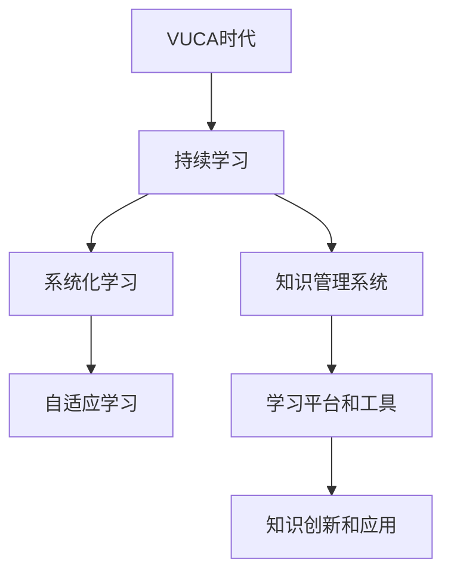

                 

## 1. 背景介绍

### 1.1 问题由来

VUCA（Volatile, Uncertain, Complex, Ambiguous）时代，是一个充满变化、不确定性、复杂性和模糊性的环境。在这个时代，无论是企业还是个人，都需要具备快速应变、灵活适应的能力。而这种能力，很大程度上来源于持续的学习与自我提升。

### 1.2 问题核心关键点

持续学习成为企业竞争力的关键因素，但传统的学习模式面临诸多挑战：

1. **信息过载**：互联网时代信息量爆炸，筛选有用信息变得困难。
2. **知识更新快**：新兴技术和方法不断涌现，终身学习者需要不断更新知识体系。
3. **知识碎片化**：信息获取方式多样，知识难以系统化整合。
4. **学习效率低**：许多知识以零散方式呈现，难以高效掌握。
5. **学习动机弱**：成人学习者在时间、精力上的限制，导致学习意愿不足。

如何在VUCA时代，构建一个高效、系统、持续的学习策略，成为当前亟待解决的问题。

## 2. 核心概念与联系

### 2.1 核心概念概述

为更好地理解VUCA时代下的学习策略，本节将介绍几个关键概念：

- **VUCA时代**：指当前全球经济、政治、社会、技术环境的不确定性、复杂性和模糊性。
- **持续学习**：指学习者不断获取新知识，提升个人和组织能力的过程。
- **系统化学习**：强调知识的系统性、整体性，避免零散化、碎片化。
- **自适应学习**：根据环境变化动态调整学习策略和内容。
- **知识管理系统(KMS)**：使用技术手段管理和优化知识获取、分享、应用。
- **学习平台和工具**：如在线课程、社交网络、知识社区等，为学习提供便利。
- **知识创新和应用**：将学习到的知识转化为具体的实践和创新。

这些概念之间的逻辑关系可以通过以下Mermaid流程图来展示：



这个流程图展示了一个连续的学习过程，从VUCA环境出发，通过持续学习，逐步实现知识系统化、自适应化，并通过知识管理系统和工具，最终实现知识创新和应用。

## 3. 核心算法原理 & 具体操作步骤
### 3.1 算法原理概述

VUCA时代下的学习策略，本质上是一个动态调整和优化的过程。其核心思想是：通过不断获取新信息，系统化整合知识，动态调整学习内容和方法，以适应环境变化，提升学习效果。

形式化地，假设学习者初始状态为 $L_{initial}$，环境变化后的目标状态为 $L_{target}$。学习策略的目标是通过一系列动作（如选择课程、阅读文章、参与讨论等），逐步将 $L_{initial}$ 转化为 $L_{target}$。

具体步骤如下：

1. **环境分析**：收集当前环境的相关信息，确定需要学习的内容。
2. **目标设定**：根据环境变化，设定具体的学习目标。
3. **学习策略制定**：选择适合的学习资源和方法。
4. **知识获取**：通过学习资源获取知识。
5. **知识整合**：系统化整合获取到的知识。
6. **学习效果评估**：通过测试、应用等手段评估学习效果。
7. **策略调整**：根据评估结果，调整学习策略。
8. **重复迭代**：持续迭代上述步骤，直至达到目标。

### 3.2 算法步骤详解

以软件开发为例，下面详细介绍VUCA时代下，软件开发者的学习策略步骤：

**Step 1: 环境分析**
- 定期收集行业动态，了解新技术、新框架、新工具。
- 参加行业会议、读书会、在线课程，获取最新信息。
- 与同行交流，分享心得，获取一手反馈。

**Step 2: 目标设定**
- 根据技术栈需求，设定短期和长期的学习目标。
- 区分核心技术（如编程语言、架构设计）和辅助技术（如版本控制、测试工具），优先学习核心技术。
- 根据项目需求，设置具体学习内容，如新框架、新工具的掌握和使用。

**Step 3: 学习策略制定**
- 选择合适的学习资源，如书籍、在线课程、官方文档、社区讨论等。
- 制定详细的学习计划，包括每天/每周的学习时间和内容。
- 使用时间管理工具，如Trello、Todoist等，跟踪进度和完成情况。

**Step 4: 知识获取**
- 按照计划学习资源，如阅读书籍、观看课程、实践编码等。
- 使用笔记工具，如Evernote、OneNote等，记录学习笔记和思考。
- 加入技术社区，参与讨论，解决疑惑。

**Step 5: 知识整合**
- 将学习到的知识系统化，整理成文档、思维导图等形式。
- 编写学习博客或案例分析，帮助理解和记忆。
- 与团队成员分享，进行技术交流和反馈。

**Step 6: 学习效果评估**
- 通过实际项目应用，检验学习效果。
- 定期进行知识测验、编码练习等，评估掌握程度。
- 使用代码质量分析工具，如SonarQube、PMD等，检测代码质量提升。

**Step 7: 策略调整**
- 根据评估结果，调整学习策略，如增加难度、调整顺序、优化资源等。
- 重新分析环境变化，更新学习目标。
- 保持学习热情，激励自我持续进步。

**Step 8: 重复迭代**
- 持续循环上述步骤，保持学习动态。
- 定期回顾学习进度和效果，总结经验教训。
- 不断迭代，提升学习效率和效果。

### 3.3 算法优缺点

VUCA时代下的学习策略，具有以下优点：
1. **灵活适应**：通过动态调整学习策略，能快速应对环境变化。
2. **系统化整合**：将知识系统化、整体化，避免碎片化。
3. **持续进步**：定期评估和调整学习效果，保持不断进步。
4. **高效利用资源**：通过系统分析环境，合理利用学习资源。

同时，该策略也存在一定的局限性：
1. **信息量大**：面对海量信息，筛选有效信息和知识难度较大。
2. **自我激励**：缺乏外部激励时，易出现学习动机弱的问题。
3. **学习投入高**：需要大量时间和精力进行持续学习，对个人资源要求较高。
4. **评估困难**：知识创新和应用的效果评估较难量化，难以精确衡量。

尽管存在这些局限性，但就目前而言，VUCA时代下的学习策略仍是一种高效、系统、持续的学习方式。未来相关研究的重点在于如何进一步降低信息过载问题，提高自我激励机制，优化学习资源利用，同时兼顾知识创新和应用的评估方法。

### 3.4 算法应用领域

VUCA时代下的学习策略，不仅适用于软件开发，还能广泛应用到更多领域，如医疗、教育、金融等。具体而言：

- **医疗**：定期学习医学新知识，更新诊疗方案，提高医疗水平。
- **教育**：持续学习教学新方法，提升教学质量，适应学生需求。
- **金融**：不断学习市场新动态，优化投资策略，提升风险控制能力。

除了这些常见领域外，VUCA时代下的学习策略还能帮助个体提升职场竞争力，增强创新能力，提高生活品质。在快速变化的VUCA环境中，持续学习成为生存和发展的重要保障。

## 4. 数学模型和公式 & 详细讲解
### 4.1 数学模型构建

VUCA时代下的学习策略，本质上是一个动态优化过程，可以使用数学模型进行形式化描述。

假设学习者初始状态为 $L_{initial}$，环境变化后的目标状态为 $L_{target}$，学习过程中获得的知识为 $K$，则学习过程可以表示为：

$$
L_{target} = f(L_{initial}, K)
$$

其中 $f$ 为映射函数，表示知识 $K$ 如何通过学习策略 $L$ 转化为目标状态 $L_{target}$。

### 4.2 公式推导过程

以软件开发为例，假设学习者初始技能水平为 $L_0$，学习后获得的技能提升为 $K$，则目标技能水平 $L_{target}$ 可以表示为：

$$
L_{target} = L_0 + K
$$

其中 $L_0$ 为初始技能水平，$K$ 为学习获得的知识。

通过以上公式，我们可以看出，学习过程本质上是知识 $K$ 的累加过程。知识 $K$ 包括书籍阅读、编程实践、项目经验等，而学习策略 $L$ 则包括时间管理、资源选择、评估调整等。

### 4.3 案例分析与讲解

以机器学习工程师为例，假设初始技能水平为 $L_0$，需要掌握的新技能为 $\{K_1, K_2, K_3\}$。学习策略为：

- 阅读相关书籍 $L_1 = \text{书籍阅读}$
- 完成在线课程 $L_2 = \text{在线课程}$ 
- 完成项目实践 $L_3 = \text{项目实践}$
- 定期评估 $L_4 = \text{评估与反馈}$

则目标技能水平 $L_{target}$ 可以表示为：

$$
L_{target} = L_0 + L_1 + L_2 + L_3 + L_4
$$

通过以上案例，我们可以看到，学习策略通过动态调整，能够有效提升技能水平，达到目标状态。

## 5. 项目实践：代码实例和详细解释说明
### 5.1 开发环境搭建

在进行项目实践前，我们需要准备好开发环境。以下是使用Python进行Keras开发的环境配置流程：

1. 安装Anaconda：从官网下载并安装Anaconda，用于创建独立的Python环境。

2. 创建并激活虚拟环境：
```bash
conda create -n keras-env python=3.8 
conda activate keras-env
```

3. 安装Keras：
```bash
conda install keras
```

4. 安装必要的依赖库：
```bash
conda install numpy pandas matplotlib scikit-learn
```

完成上述步骤后，即可在`keras-env`环境中开始项目实践。

### 5.2 源代码详细实现

下面以构建一个简单的分类模型为例，给出使用Keras进行学习策略项目开发的PyTorch代码实现。

首先，导入必要的库：

```python
import numpy as np
import pandas as pd
from sklearn.model_selection import train_test_split
from sklearn.preprocessing import StandardScaler
from keras.models import Sequential
from keras.layers import Dense, Dropout
from keras.optimizers import Adam
from keras.callbacks import EarlyStopping

# 加载数据
data = pd.read_csv('data.csv')
X = data.iloc[:, :-1].values
y = data.iloc[:, -1].values

# 数据预处理
scaler = StandardScaler()
X = scaler.fit_transform(X)
X_train, X_test, y_train, y_test = train_test_split(X, y, test_size=0.2, random_state=42)

# 构建模型
model = Sequential()
model.add(Dense(32, activation='relu', input_dim=X_train.shape[1]))
model.add(Dropout(0.2))
model.add(Dense(16, activation='relu'))
model.add(Dropout(0.2))
model.add(Dense(1, activation='sigmoid'))

# 配置优化器
optimizer = Adam(lr=0.001)

# 编译模型
model.compile(optimizer=optimizer, loss='binary_crossentropy', metrics=['accuracy'])

# 训练模型
history = model.fit(X_train, y_train, epochs=100, batch_size=32, validation_data=(X_test, y_test), callbacks=[EarlyStopping(patience=10)])
```

然后，对模型进行评估和调整：

```python
# 评估模型
test_loss, test_acc = model.evaluate(X_test, y_test)
print('Test accuracy:', test_acc)

# 调整模型参数
model.save('model.h5')
```

以上就是使用Keras进行学习策略项目开发的完整代码实现。可以看到，Keras提供了便捷的API，使得构建、训练和评估模型变得简洁高效。

### 5.3 代码解读与分析

让我们再详细解读一下关键代码的实现细节：

**数据预处理**：
- 加载数据：使用Pandas库读取CSV文件，获取特征矩阵和标签向量。
- 数据标准化：使用Scikit-learn库进行标准化处理，确保特征值在同一量级。
- 划分训练集和测试集：使用Scikit-learn库的train_test_split函数，将数据分为训练集和测试集。

**模型构建**：
- 初始化模型：使用Keras库的Sequential类，构建一个序列模型。
- 添加层：依次添加输入层、隐藏层、输出层，每层后添加Dropout层，防止过拟合。
- 配置优化器：使用Adam优化器，设置学习率为0.001。
- 编译模型：指定损失函数为二元交叉熵，评估指标为准确率。

**训练模型**：
- 调用模型的fit方法进行训练，设置训练轮数为100，批次大小为32，使用EarlyStopping回调函数避免过拟合。
- 保存模型：训练完成后，使用模型的save方法保存模型到文件，以便后续使用。

**评估模型**：
- 使用模型的evaluate方法在测试集上评估模型性能，输出准确率。
- 调整模型参数：保存模型，以便下次重新加载和使用。

可以看到，Keras提供了丰富的API和便捷的接口，使得模型构建、训练和评估变得简单直观。开发者可以更多地关注模型的优化和调整，而不必过多纠结于底层实现细节。

## 6. 实际应用场景
### 6.1 智能客服系统

在VUCA时代，智能客服系统的需求不断变化，客户咨询内容多样，服务流程复杂。基于持续学习策略的智能客服系统，可以实时监控客户反馈，动态调整回答策略，提升客户满意度。

具体而言，可以通过微调对话模型，使智能客服系统根据客户咨询历史和实时反馈，动态生成对话模板和回答内容。同时，定期更新客户行为数据，进行模型微调，提升客服系统的智能化水平。

### 6.2 金融舆情监测

金融市场瞬息万变，舆情监测需要实时性、准确性、全面性。基于持续学习策略的金融舆情监测系统，可以自动监控市场动态，及时分析舆情变化，提供实时的预警和建议。

具体而言，可以通过微调情感分析模型，使系统实时分析新闻、评论、社交媒体等数据，判断市场情绪，识别潜在风险。同时，根据市场变化，动态调整分析模型，提升预测准确率。

### 6.3 个性化推荐系统

在VUCA时代，用户需求和市场环境不断变化，推荐系统需要实时调整推荐策略。基于持续学习策略的个性化推荐系统，可以动态学习用户行为，实时调整推荐内容，提升用户体验和满意度。

具体而言，可以通过微调协同过滤模型，使推荐系统实时学习用户行为变化，动态调整推荐算法和策略。同时，定期更新用户数据，进行模型微调，提升推荐效果。

### 6.4 未来应用展望

VUCA时代下的学习策略，将在更多领域得到应用，为各行各业带来变革性影响。

在智慧医疗领域，基于持续学习策略的智能诊疗系统，可以实时学习患者数据，动态调整诊疗方案，提高诊疗效果。

在智能教育领域，基于持续学习策略的学习管理系统，可以实时监控学习进度，动态调整学习内容，提升学习效果。

在智慧城市治理中，基于持续学习策略的城市管理系统，可以实时分析城市运行数据，动态调整管理策略，提升城市管理效率。

此外，在企业生产、社会治理、文娱传媒等众多领域，基于持续学习策略的人工智能应用也将不断涌现，为经济社会发展注入新的动力。相信随着技术的发展，持续学习策略必将在更多领域发挥重要作用。

## 7. 工具和资源推荐
### 7.1 学习资源推荐

为了帮助开发者系统掌握VUCA时代下的学习策略，这里推荐一些优质的学习资源：

1. Coursera《学习科学基础》课程：介绍学习理论、学习策略、学习评估等基础概念，帮助构建系统化学习框架。

2. Udemy《持续学习的艺术》课程：讲解如何构建终身学习系统，提升自我管理能力。

3. Mindshift《未来的学习者》书籍：探讨未来学习和教育的新趋势，提供系统化学习指导。

4. LinkedIn Learning《高效学习技巧》课程：提供实用的学习技巧和方法，帮助提升学习效率。

5. EdX《设计思维》课程：介绍设计思维方法，帮助创新和解决问题。

通过对这些资源的学习实践，相信你一定能够掌握VUCA时代下的学习策略，并在实际工作中取得更好的效果。
###  7.2 开发工具推荐

高效的开发离不开优秀的工具支持。以下是几款用于VUCA时代下学习策略开发的常用工具：

1. Jupyter Notebook：用于编写和分享学习笔记本，支持Python、R等语言。

2. GitHub：用于协作管理代码，分享和交流项目，支持版本控制。

3. Evernote：用于记录和管理学习笔记，支持文本、图片、语音等多种格式。

4. Trello：用于项目管理和任务跟踪，支持任务分配、进度跟踪等功能。

5. Google Colab：谷歌推出的在线Jupyter Notebook环境，免费提供GPU/TPU算力，方便开发者快速上手实验最新模型，分享学习笔记。

合理利用这些工具，可以显著提升VUCA时代下学习策略的开发效率，加快创新迭代的步伐。

### 7.3 相关论文推荐

VUCA时代下的学习策略，涉及多学科的交叉和融合，以下几篇论文代表了这个领域的研究方向，推荐阅读：

1. "The Learning Curve: Overcoming the Challenges of Lifelong Learning"（朱迪·扎普里奇等，2020）：介绍了终身学习的挑战和应对策略，提供了系统化学习的框架。

2. "Adaptive Learning Environments: Architectures and Challenges"（德米特里斯·卡泰尼斯等，2020）：探讨了自适应学习环境的设计和挑战，提出了多种自适应学习模型。

3. "Learning from Experience: Designing Learning Processes for Effective Learning"（大卫·麦肯齐等，2019）：介绍了设计高效学习过程的方法，提供了实际应用案例。

4. "Knowledge Management Systems: Architecture and Technology"（约翰·C. 文特韦格尔等，2019）：介绍了知识管理系统的架构和技术，提供了知识管理的实践指导。

这些论文代表了大语言模型微调技术的发展脉络。通过学习这些前沿成果，可以帮助研究者把握学科前进方向，激发更多的创新灵感。

## 8. 总结：未来发展趋势与挑战

### 8.1 总结

本文对VUCA时代下的学习策略进行了全面系统的介绍。首先阐述了VUCA时代的环境特征和持续学习的重要性，明确了系统化学习、自适应学习等关键概念及其相互关系。其次，从原理到实践，详细讲解了持续学习的数学模型和详细步骤，给出了Keras微调模型的代码实例。同时，本文还广泛探讨了持续学习策略在智能客服、金融舆情、个性化推荐等多个行业领域的应用前景，展示了持续学习策略的广阔潜力。此外，本文精选了持续学习技术的各类学习资源，力求为读者提供全方位的技术指引。

通过本文的系统梳理，可以看到，VUCA时代下的学习策略是一种高效、系统、持续的学习方式，能够在快速变化的环境中，提升个人和组织的竞争力。未来，伴随技术的发展和应用场景的拓展，持续学习策略必将在更多领域发挥重要作用。

### 8.2 未来发展趋势

展望未来，VUCA时代下的学习策略将呈现以下几个发展趋势：

1. **个性化学习**：根据学习者的兴趣、需求、能力等个性化特征，动态调整学习内容和方法，提供定制化学习体验。
2. **社会化学习**：利用社交网络、知识社区等平台，促进学习者之间的互动和合作，增强学习效果。
3. **跨领域学习**：将不同学科的知识进行交叉融合，形成跨领域、跨学科的综合学习体系。
4. **数据驱动学习**：利用大数据和AI技术，分析学习数据，优化学习策略，提升学习效果。
5. **混合学习**：结合线上线下多种学习方式，提供灵活多样的学习途径。
6. **情境感知学习**：根据学习者所在的环境、时间、情绪等情境因素，动态调整学习内容和方法。

这些趋势凸显了VUCA时代下学习策略的广泛应用和不断演进，将为学习者提供更加灵活、高效、个性化的学习体验。

### 8.3 面临的挑战

尽管VUCA时代下的学习策略已经取得了一定的成效，但在实施过程中仍面临诸多挑战：

1. **信息过载**：海量信息源带来信息过载问题，筛选有价值信息变得困难。
2. **知识碎片化**：学习内容碎片化，难以系统化整合。
3. **学习动机不足**：成人学习者在时间和精力上的限制，导致学习动机不足。
4. **知识应用难**：理论知识难以转化为实际应用能力。
5. **技术依赖强**：学习策略依赖于技术工具，技术故障或失效可能导致学习中断。
6. **评估标准不统一**：学习效果难以统一量化，缺乏标准化评估标准。

尽管存在这些挑战，但通过不断的技术进步和教育改革，相信VUCA时代下的学习策略能够克服这些困难，实现更加高效、系统、持续的学习。

### 8.4 研究展望

未来，VUCA时代下的学习策略研究需要在以下几个方面寻求新的突破：

1. **混合现实学习**：结合虚拟现实、增强现实技术，提供沉浸式学习体验。
2. **多模态学习**：利用图像、音频、视频等多模态信息，丰富学习内容。
3. **智能推荐系统**：基于机器学习算法，提供个性化学习推荐。
4. **虚拟导师**：利用自然语言处理技术，提供智能学习辅助。
5. **智能评估系统**：基于AI技术，实现学习效果自动化评估。
6. **自适应学习平台**：开发智能自适应学习平台，根据学习者特征动态调整学习策略。

这些研究方向将进一步推动VUCA时代下的学习策略发展，提升学习效率和效果，构建更加智能、高效的学习体系。

## 9. 附录：常见问题与解答

**Q1：如何选择合适的学习资源？**

A: 选择合适的学习资源，需要考虑以下几个方面：
1. 学习目标：根据学习目标选择资源，如技能提升、知识更新、认知拓展等。
2. 资源质量：选择权威、系统、实用的学习资源，如官方文档、权威课程、专家书籍等。
3. 学习方式：选择适合自己的学习方式，如视频课程、在线课程、线下培训等。
4. 资源更新：选择更新频率高、内容新鲜的资源，确保知识的时效性。

**Q2：如何构建有效的学习计划？**

A: 构建有效的学习计划，需要考虑以下几个方面：
1. 明确学习目标：设定具体、可量化的学习目标，如掌握某项技能、理解某个概念等。
2. 分解学习任务：将大目标分解为小任务，逐步完成，如每天学习1小时、每周完成1个项目等。
3. 设定时间表：根据学习任务和优先级，制定详细的学习时间表，合理安排时间。
4. 设定反馈机制：定期评估学习效果，根据评估结果调整学习计划，如调整学习内容、改进学习方法等。

**Q3：如何提高学习动机？**

A: 提高学习动机，需要从以下几个方面入手：
1. 设定奖励机制：设定具体的奖励，如完成学习任务后进行自我奖励，如看电影、吃美食等。
2. 找到学习兴趣点：选择感兴趣的学习内容，提升学习的积极性和主动性。
3. 与他人分享：与他人分享学习成果，获得反馈和鼓励，增强学习动力。
4. 制定挑战目标：设定具有挑战性的学习目标，提升学习的成就感和满足感。

**Q4：如何评估学习效果？**

A: 评估学习效果，需要从以下几个方面进行：
1. 理论测试：通过理论测试，评估对知识点的掌握程度。
2. 实践应用：通过实际项目、案例分析等，检验学习效果。
3. 反馈收集：通过同事、导师、自我反馈，获取学习效果评价。
4. 持续改进：根据评估结果，调整学习策略，持续改进。

**Q5：如何应对信息过载？**

A: 应对信息过载，需要从以下几个方面进行：
1. 筛选信息源：选择权威、可靠的信息源，避免信息过载。
2. 使用工具：利用信息管理工具，如RSS订阅、信息聚合工具等，高效获取信息。
3. 定期整理：定期整理学习资料，避免信息碎片化。
4. 深度学习：选择深度阅读，理解信息本质，避免浅层学习。

---

作者：禅与计算机程序设计艺术 / Zen and the Art of Computer Programming

