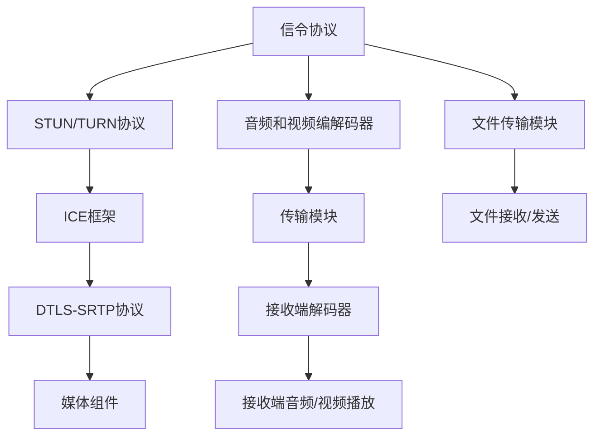

                 

# WebRTC技术：实现浏览器间的实时通信

## 1. 背景介绍

在互联网时代，随着Web应用的普及和扩展，用户对实时通信的需求日益增长。WebRTC（Real-Time Communication via WebRTC）作为一种开源的实时通信技术，可以让浏览器之间直接进行音频、视频、文件传输等实时通信，无需依赖第三方服务器，极大地提升了用户体验。本文将详细介绍WebRTC的核心概念、原理和应用，并分享一些实践经验和最佳实践。

## 2. 核心概念与联系

### 2.1 核心概念概述

WebRTC是一项基于HTML5、JavaScript和浏览器API的技术，旨在实现点对点（P2P）的实时通信，无需通过第三方服务器。其核心组件包括：

- **信令协议**：WebRTC使用STUN/TURN协议进行网络穿透和语音/视频流的媒体传输。STUN用于发现本地网络地址，TURN用于穿越NAT和防火墙，实现P2P通信。
- **媒体组件**：包括音频和视频编码器、解码器和传输模块，实现音频和视频流的编解码和传输。
- **ICE框架**：ICE（Interactive Connectivity Establishment）是WebRTC用于网络连接的框架，通过STUN和TURN服务，自动选择最优路径，建立点对点连接。
- **DTLS-SRTP协议**：WebRTC使用DTLS-SRTP协议对传输的数据流进行加密和保护，确保通信的安全性。

这些组件共同构成了WebRTC的通信框架，支持音频、视频、文件等实时通信功能。

### 2.2 核心概念原理和架构的 Mermaid 流程图



以上流程图展示了WebRTC的核心组件和工作流程：信令协议负责建立连接，ICE框架自动选择最优路径，DTLS-SRTP协议保障数据传输的安全性，媒体组件实现音频、视频的编解码和传输，文件传输模块支持文件传输功能。

## 3. 核心算法原理 & 具体操作步骤

### 3.1 算法原理概述

WebRTC的核心算法包括以下几个方面：

- **信令传输**：WebRTC使用STUN/TURN协议进行网络穿透，自动发现本地IP地址，选择合适的路径进行数据传输。
- **ICE框架**：ICE框架通过STUN和TURN服务，自动选择最优路径，建立点对点连接，保证通信的可靠性。
- **DTLS-SRTP加密**：WebRTC使用DTLS-SRTP协议对数据流进行加密和保护，确保通信的安全性。
- **媒体编码和解码**：WebRTC支持多种音频和视频编码格式，包括VP8、VP9、H264等，根据网络条件自动选择最优编码方式，确保通信的流畅性和质量。

### 3.2 算法步骤详解

#### 步骤1：信令传输

WebRTC使用STUN/TURN协议进行信令传输，发现本地IP地址，自动选择最优路径进行数据传输。

- **STUN**：STUN服务器通过查询本地IP地址，帮助客户端发现公网IP地址，从而实现P2P通信。
- **TURN**：TURN服务器通过中继传输，绕过NAT和防火墙，实现P2P通信。

#### 步骤2：ICE框架

ICE框架通过STUN和TURN服务，自动选择最优路径，建立点对点连接。

- **STUN寻址**：WebRTC使用STUN协议进行本地IP地址发现，以便选择合适的路径。
- **ICE协议**：ICE协议自动选择最优路径，建立P2P连接，确保通信的可靠性。

#### 步骤3：DTLS-SRTP加密

WebRTC使用DTLS-SRTP协议对数据流进行加密和保护，确保通信的安全性。

- **DTLS加密**：DTLS协议对数据流进行加密，确保数据传输的安全性。
- **SRTP加密**：SRTP协议对音频和视频数据流进行加密，确保通信的私密性。

#### 步骤4：媒体编码和解码

WebRTC支持多种音频和视频编码格式，根据网络条件自动选择最优编码方式，确保通信的流畅性和质量。

- **VP8/V9**：WebRTC使用VP8和VP9格式对视频数据进行编码和解码。
- **H264**：WebRTC支持H264格式进行音频和视频编解码。
- **DAMTP格式**：WebRTC支持DAMTP格式进行音频编解码。

### 3.3 算法优缺点

#### 优点：

- **P2P通信**：WebRTC基于P2P技术，减少了对第三方服务器的依赖，降低了通信成本，提高了通信效率。
- **低延迟**：WebRTC采用点对点通信，减少了数据传输的中间环节，降低了延迟，提高了通信的实时性。
- **自适应编码**：WebRTC根据网络条件自动选择最优编码方式，确保通信的流畅性和质量。
- **加密保护**：WebRTC使用DTLS-SRTP协议对数据流进行加密和保护，确保通信的安全性。

#### 缺点：

- **兼容性**：不同浏览器和设备对WebRTC的支持程度不同，需要开发者进行兼容性测试和优化。
- **资源消耗**：WebRTC需要在浏览器中运行大量的JavaScript代码，对系统资源消耗较大，需要优化。
- **配置复杂**：WebRTC的配置和调试需要一定的技术背景，增加了开发难度。
- **安全性**：WebRTC的加密机制需要开发者自行实现，容易产生安全漏洞。

### 3.4 算法应用领域

WebRTC广泛应用于以下领域：

- **在线教育**：在线教育平台使用WebRTC进行实时视频会议，支持学生与老师进行互动。
- **远程办公**：远程办公使用WebRTC进行音频和视频会议，支持团队协作和沟通。
- **在线医疗**：在线医疗平台使用WebRTC进行远程诊疗，支持医生和患者进行实时沟通。
- **在线会议**：企业使用WebRTC进行视频会议，支持跨地域的团队协作。
- **实时娱乐**：游戏和娱乐应用使用WebRTC进行实时互动，支持多人在线游戏和互动。

## 4. 数学模型和公式 & 详细讲解 & 举例说明

### 4.1 数学模型构建

WebRTC的核心算法涉及多个网络协议和通信机制，包括STUN、TURN、ICE、DTLS-SRTP等。这些协议和机制通过JavaScript实现，不需要复杂的数学模型和公式。但为了更好地理解WebRTC的工作原理，我们可以通过以下例子来描述其核心算法。

### 4.2 公式推导过程

#### STUN协议

STUN协议通过查询本地IP地址，帮助客户端发现公网IP地址。假设客户端向STUN服务器发送查询请求，服务器返回客户端的公网IP地址和端口号，客户端即可建立P2P连接。

#### ICE协议

ICE协议通过STUN和TURN服务，自动选择最优路径，建立P2P连接。假设客户端通过STUN协议发现本地IP地址为192.168.1.100，向服务器发送连接请求，服务器通过TURN协议将连接请求转发给对端客户端，对端客户端通过STUN协议发现本地IP地址为192.168.2.200，建立P2P连接。

#### DTLS-SRTP协议

DTLS-SRTP协议对数据流进行加密和保护。假设客户端和服务器建立TCP连接，发送RTCP协议控制包，服务器生成SRTP密钥，使用DTLS-SRTP协议进行加密和保护，确保数据传输的安全性。

### 4.3 案例分析与讲解

假设两个用户Alice和Bob使用WebRTC进行音频和视频通话，整个过程包括以下步骤：

1. Alice和Bob通过ICE协议建立P2P连接，发现本地IP地址和端口号。
2. Alice和Bob通过STUN协议查询本地IP地址，发现公网IP地址。
3. Alice和Bob通过TURN协议进行网络穿透，绕过NAT和防火墙。
4. Alice和Bob使用DTLS-SRTP协议对音频和视频数据流进行加密和保护。
5. Alice和Bob使用VP8/V9编码器对音频和视频数据进行编解码，发送和接收数据。

通过上述步骤，Alice和Bob可以顺利建立P2P连接，进行音频和视频通话，实现实时通信。

## 5. 项目实践：代码实例和详细解释说明

### 5.1 开发环境搭建

开发WebRTC应用需要安装Node.js和相关的WebRTC库，具体步骤如下：

1. 安装Node.js：
   ```
   sudo apt-get install nodejs
   ```
2. 安装WebRTC库：
   ```
   npm install webrtc-adapter
   npm install signalr2
   npm install node-webrtc-streams
   ```

### 5.2 源代码详细实现

以下是一个简单的WebRTC音频和视频通话示例代码：

```javascript
const webrtcAdapter = require('webrtc-adapter');
const signalR = require('signalr2');
const webrtcStreams = require('node-webrtc-streams');

// 创建WebRTC连接
const connection = new signalR.Connection('http://localhost:8080');
const peerConnection = new RTCPeerConnection();
const stream = webrtcStreams.createVideoStream();

// 处理ICE连接
peerConnection.onicecandidate = (event) => {
  if (event.candidate) {
    connection.invoke('iceCandidate', event.candidate.candidate);
  }
};

// 处理音频和视频流
peerConnection.ontrack = (event) => {
  const track = event.streams[0];
  const videoElement = document.querySelector('video');
  videoElement.srcObject = track;
};

// 发送音频和视频流
const createOffer = () => {
  peerConnection.createOffer((offer) => {
    peerConnection.setLocalDescription(offer);
    connection.invoke('createOffer', offer.sdp);
  });
};

createOffer();
```

### 5.3 代码解读与分析

以上代码实现了一个简单的WebRTC音频和视频通话功能，具体步骤如下：

1. 创建WebRTC连接：使用SignalR库创建WebRTC连接，监听ICE连接请求和音频/视频流。
2. 创建WebRTC连接：使用WebRTC API创建RTCPeerConnection，并创建视频流。
3. 处理ICE连接：监听ICE候选人的变化，将ICE候选人和音频/视频流发送给服务器。
4. 处理音频和视频流：监听接收到的音频/视频流，并将其显示在视频元素中。
5. 发送音频和视频流：使用WebRTC API创建Offer，并发送给服务器。

### 5.4 运行结果展示

运行以上代码，可以在浏览器中实现简单的WebRTC音频和视频通话，实时显示对方发送的音频和视频流。

## 6. 实际应用场景

### 6.1 在线教育

在线教育平台使用WebRTC进行实时视频会议，支持学生与老师进行互动。教师可以实时监控学生的学习情况，并进行指导和互动。学生可以通过视频和音频与老师进行交流，增强学习效果。

### 6.2 远程办公

远程办公使用WebRTC进行音频和视频会议，支持团队协作和沟通。团队成员可以在不同地点通过视频会议进行实时沟通，协同工作，提高工作效率。

### 6.3 在线医疗

在线医疗平台使用WebRTC进行远程诊疗，支持医生和患者进行实时沟通。医生可以通过视频会议对患者进行诊断和治疗，患者可以实时与医生交流，获得专业的医疗指导。

### 6.4 在线会议

企业使用WebRTC进行视频会议，支持跨地域的团队协作。员工可以在不同地点通过视频会议进行实时沟通，增强团队协作和沟通效果，提高工作效率。

### 6.5 实时娱乐

游戏和娱乐应用使用WebRTC进行实时互动，支持多人在线游戏和互动。玩家可以通过视频和音频进行实时互动，增强游戏体验和趣味性。

## 7. 工具和资源推荐

### 7.1 学习资源推荐

为了帮助开发者掌握WebRTC技术，以下是一些优质的学习资源：

1. **WebRTC官方文档**：WebRTC官方文档详细介绍了WebRTC的API和使用方法，是学习WebRTC的最佳资料。
2. **MDN WebRTC教程**：MDN WebRTC教程提供了详细的WebRTC API文档和示例代码，适合初学者学习。
3. **Udemy WebRTC课程**：Udemy提供了多门WebRTC课程，涵盖WebRTC的各个方面，适合进阶学习。
4. **WebRTC Workshop**：WebRTC Workshop是一个开源项目，提供了WebRTC的代码示例和开发指南，适合实战练习。

### 7.2 开发工具推荐

WebRTC开发工具包括以下几种：

1. **Visual Studio Code**：Visual Studio Code是一个轻量级的编辑器，支持WebRTC开发和调试，适合快速开发和调试。
2. **Chrome DevTools**：Chrome DevTools是一个浏览器调试工具，支持WebRTC网络调试和性能分析，适合性能优化。
3. **Firefox Developer Tools**：Firefox Developer Tools也是一个浏览器调试工具，支持WebRTC网络调试和性能分析，适合性能优化。

### 7.3 相关论文推荐

WebRTC技术的发展离不开学界的持续研究。以下是几篇相关的经典论文，推荐阅读：

1. **WebRTC标准文档**：WebRTC标准文档详细介绍了WebRTC的协议和API，是WebRTC研究和开发的重要参考。
2. **WebRTC: End-to-end P2P Communication via WebRTC**：WebRTC: End-to-end P2P Communication via WebRTC是一篇经典论文，介绍了WebRTC的核心算法和工作原理。
3. **WebRTC: A Streaming Protocol for Peer-to-Peer Communication**：WebRTC: A Streaming Protocol for Peer-to-Peer Communication介绍了WebRTC的传输协议和通信机制。

## 8. 总结：未来发展趋势与挑战

### 8.1 总结

WebRTC技术是一种强大的点对点实时通信技术，可以实现音频、视频和文件传输等实时通信功能。WebRTC的核心算法包括STUN、TURN、ICE、DTLS-SRTP等，这些算法保证了通信的实时性、可靠性和安全性。通过本文的系统梳理，可以看到，WebRTC技术正在广泛应用于在线教育、远程办公、在线医疗、在线会议和实时娱乐等多个领域，为人们的日常工作和生活带来了便利和高效。

### 8.2 未来发展趋势

展望未来，WebRTC技术的发展趋势如下：

1. **跨平台支持**：WebRTC技术将进一步优化跨平台支持，提高在不同浏览器和设备上的兼容性，让更多用户能够享受WebRTC带来的便利。
2. **多媒体支持**：WebRTC技术将进一步增强对多媒体的支持，包括音频、视频、文件和手势等，提高用户的交互体验。
3. **低延迟优化**：WebRTC技术将进一步优化网络延迟，提高通信的实时性，让用户能够更快地进行实时通信。
4. **安全性增强**：WebRTC技术将进一步增强通信的安全性，通过加密和认证机制，保障通信的安全性。
5. **云服务集成**：WebRTC技术将进一步集成云服务，提供更多的通信功能和体验，让用户能够更好地进行实时通信。

### 8.3 面临的挑战

WebRTC技术在发展和应用过程中，也面临着一些挑战：

1. **兼容性问题**：不同浏览器和设备对WebRTC的支持程度不同，需要开发者进行兼容性测试和优化。
2. **资源消耗**：WebRTC技术需要在浏览器中运行大量的JavaScript代码，对系统资源消耗较大，需要优化。
3. **配置复杂**：WebRTC技术的使用需要一定的技术背景，增加了开发难度。
4. **安全性问题**：WebRTC技术的加密机制需要开发者自行实现，容易产生安全漏洞。
5. **网络稳定性**：WebRTC技术对网络稳定性要求较高，需要在网络质量较差的场景下进行优化。

### 8.4 研究展望

未来，WebRTC技术的研究方向包括：

1. **跨平台优化**：进一步优化WebRTC技术的跨平台支持，提高在不同浏览器和设备上的兼容性。
2. **多媒体增强**：增强WebRTC技术对多媒体的支持，包括音频、视频、文件和手势等，提高用户的交互体验。
3. **低延迟优化**：优化WebRTC技术的低延迟特性，提高通信的实时性。
4. **安全性增强**：增强WebRTC技术的安全性，通过加密和认证机制，保障通信的安全性。
5. **云服务集成**：集成云服务，提供更多的通信功能和体验，让用户能够更好地进行实时通信。

## 9. 附录：常见问题与解答

**Q1：WebRTC的原理是什么？**

A: WebRTC基于P2P技术，使用STUN/TURN协议进行网络穿透，通过ICE框架自动选择最优路径，使用DTLS-SRTP协议对数据流进行加密和保护，支持音频、视频和文件传输等功能。

**Q2：WebRTC的优点和缺点是什么？**

A: WebRTC的优点包括P2P通信、低延迟、自适应编码、加密保护等。缺点包括兼容性差、资源消耗大、配置复杂、安全性问题等。

**Q3：WebRTC有哪些实际应用场景？**

A: WebRTC广泛应用于在线教育、远程办公、在线医疗、在线会议和实时娱乐等多个领域，为人们的日常工作和生活带来了便利和高效。

**Q4：如何优化WebRTC的性能？**

A: 优化WebRTC的性能可以从以下几方面入手：

1. 优化跨平台支持，提高在不同浏览器和设备上的兼容性。
2. 优化多媒体支持，提高音频、视频和文件传输的流畅性和质量。
3. 优化网络延迟，提高通信的实时性。
4. 增强安全性，通过加密和认证机制，保障通信的安全性。
5. 集成云服务，提供更多的通信功能和体验。

**Q5：WebRTC的未来发展方向是什么？**

A: WebRTC的未来发展方向包括跨平台优化、多媒体增强、低延迟优化、安全性增强、云服务集成等。

作者：禅与计算机程序设计艺术 / Zen and the Art of Computer Programming

