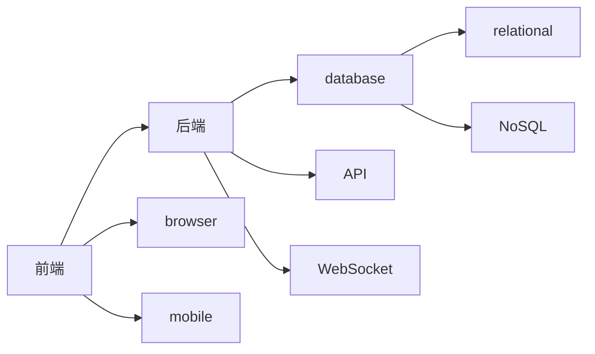

                 

# Web全栈开发：前端到后端的全面指南

## 1. 背景介绍

随着互联网技术的不断进步，Web全栈开发已经成为软件工程师必须掌握的关键技能之一。传统的Web开发通常被分为前端和后端两个部分，前端负责用户界面和用户体验，后端负责数据处理和业务逻辑。但在现代Web应用中，前后端之间的界限逐渐模糊，全栈开发工程师能够掌握从前端到后端的全面技能，更加高效地开发和维护Web应用。

本文将深入探讨Web全栈开发的核心概念、核心算法原理和具体操作步骤，通过丰富的代码实例和实际应用场景，帮助读者系统掌握Web全栈开发的方方面面。希望通过本文的学习，你能够成为一名熟练的全栈开发工程师，具备从0到1构建高效、稳定、易维护Web应用的能力。

## 2. 核心概念与联系

### 2.1 核心概念概述

Web全栈开发涉及众多关键概念，本文将逐一介绍并说明其原理和架构。

- **前端开发**：负责Web应用的展示层，包括HTML、CSS、JavaScript等技术。前端开发的目标是构建优雅、响应迅速的用户界面，提供良好的用户体验。

- **后端开发**：负责Web应用的数据处理和业务逻辑，通常使用服务器端语言如Python、JavaScript、Java等，并使用数据库进行数据存储和查询。后端开发的目标是确保数据的安全性和业务的稳定性。

- **前端框架**：如React、Vue、Angular等，提供丰富的组件和工具，加速前端开发过程，并提升代码的可维护性和可重用性。

- **后端框架**：如Django、Flask、Spring Boot等，提供高效、易用的Web开发框架，帮助开发者快速搭建Web应用，并支持RESTful API、数据库集成等功能。

- **前端和后端集成**：通过API接口、WebSocket等技术，实现前后端数据的无缝通信和交互。

这些核心概念之间相互关联，共同构成Web全栈开发的技术体系。本文将通过详细的架构图和Mermaid流程图，帮助读者理解这些概念之间的联系。

```mermaid
graph LR
  Frontend --> HTML
  Frontend --> CSS
  Frontend --> JavaScript
  Frontend --> React
  Frontend --> Vue
  Frontend --> Angular
  Backend --> Python
  Backend --> JavaScript
  Backend --> Java
  Backend --> Django
  Backend --> Flask
  Backend --> Spring Boot
  Frontend --> Backend
  Frontend --> API
  Frontend --> WebSocket
```

### 2.2 核心概念原理和架构的 Mermaid 流程图

以下是Web全栈开发的架构示意图，展示了前端和后端的主要组件和技术栈。



- 前端开发负责构建用户交互界面，浏览器和移动设备是其展示渠道。
- 后端开发负责处理数据和业务逻辑，数据库是数据存储的核心组件。
- API和WebSocket用于实现前后端的数据交互。

## 3. 核心算法原理 & 具体操作步骤

### 3.1 算法原理概述

Web全栈开发的核心算法原理包括前后端数据的交互、前端界面的渲染、后端业务逻辑的处理等。本文将逐一介绍这些核心算法。

#### 3.1.1 前后端数据交互

Web应用的典型数据交互方式包括RESTful API和WebSocket。RESTful API基于HTTP协议，通过GET、POST等请求方法进行数据交互，适用于数据量较小、交互频率较低的场景。WebSocket则基于TCP协议，支持实时数据传输，适用于需要高实时性的应用场景。

#### 3.1.2 前端界面渲染

前端界面渲染的核心算法包括DOM操作和模板引擎。DOM操作通过JavaScript动态修改文档对象模型（DOM），实现界面的动态更新。模板引擎如React、Vue等，则通过组件化编程和数据绑定，简化前端开发过程，提升代码的可维护性。

#### 3.1.3 后端业务逻辑处理

后端业务逻辑处理的核心算法包括数据库操作和并发控制。数据库操作通常使用SQL或NoSQL查询语言进行数据读写，并发控制则通过锁机制、事务处理等方式，确保数据的一致性和安全性。

### 3.2 算法步骤详解

#### 3.2.1 前端开发步骤

1. **需求分析**：确定Web应用的功能和用户需求。
2. **设计UI**：根据需求设计前端界面，包括布局、样式、交互效果等。
3. **选择框架**：根据需求选择合适的前端框架（如React、Vue），并配置开发环境。
4. **开发实现**：实现前端界面，包括数据绑定、事件处理等。
5. **测试和优化**：进行前端测试，优化性能，确保界面响应迅速。

#### 3.2.2 后端开发步骤

1. **需求分析**：确定Web应用的数据结构和业务逻辑。
2. **设计数据库**：设计数据库表结构，确定数据存储方式。
3. **选择框架**：根据需求选择合适的后端框架（如Django、Flask），并配置开发环境。
4. **开发实现**：实现后端业务逻辑，包括数据查询、业务处理等。
5. **测试和优化**：进行后端测试，优化性能，确保业务逻辑正确可靠。

#### 3.2.3 前后端集成步骤

1. **设计API接口**：根据前后端需求，设计API接口，确定数据交互方式。
2. **实现API接口**：实现前后端API接口，确保数据格式和交互方式一致。
3. **测试和优化**：进行API接口测试，优化性能，确保数据交互稳定可靠。

### 3.3 算法优缺点

#### 3.3.1 前端开发

**优点**：
- 前端开发能够直接面向用户，提升用户体验。
- 前端开发能够灵活展示数据，提升界面美观度。

**缺点**：
- 前端开发需要频繁进行界面更新，开发成本较高。
- 前端开发容易受到浏览器和设备限制，需要考虑跨浏览器兼容性和响应式设计。

#### 3.3.2 后端开发

**优点**：
- 后端开发能够高效处理数据和业务逻辑，确保数据的安全性和稳定性。
- 后端开发能够支持复杂业务逻辑，满足各种业务需求。

**缺点**：
- 后端开发需要设计和管理数据库，数据一致性管理较为复杂。
- 后端开发容易出现性能瓶颈，需要优化数据访问和处理方式。

#### 3.3.3 前后端集成

**优点**：
- 前后端集成能够实现数据无缝通信，提升应用实时性。
- 前后端集成能够实现复杂的交互逻辑，提升用户体验。

**缺点**：
- 前后端集成需要考虑数据格式和交互方式，开发成本较高。
- 前后端集成容易出现数据不一致问题，需要仔细设计和测试。

### 3.4 算法应用领域

Web全栈开发广泛应用于各类Web应用，包括社交网络、电商系统、内容管理系统（CMS）等。通过本文的学习，你将能够熟练掌握Web全栈开发的各类技术，具备构建高效、稳定、易维护Web应用的能力。

## 4. 数学模型和公式 & 详细讲解 & 举例说明

### 4.1 数学模型构建

#### 4.1.1 前端界面渲染

前端界面渲染的数学模型通常基于HTML、CSS和JavaScript。假设有一个简单的Web页面，包含一个标题和一段文本，数学模型如下：

- HTML结构：`<html><head><title>My Page</title></head><body><h1>Hello, World!</h1><p>Welcome to my page!</p></body></html>`
- CSS样式：`<style>h1 { color: red; }</style>`
- JavaScript交互：`<script>document.querySelector('h1').style.color = 'blue';</script>`

#### 4.1.2 后端业务逻辑处理

后端业务逻辑处理通常基于数据库操作。假设有一个用户表，存储用户的姓名和邮箱，数学模型如下：

- SQL查询：`SELECT * FROM users WHERE name = 'Alice';`
- 数据处理：`users = get_user_data(name)`
- 业务逻辑：`business_logic(users);`

#### 4.1.3 前后端数据交互

前后端数据交互通常基于RESTful API或WebSocket。假设有一个API接口，用于获取用户数据，数学模型如下：

- RESTful API：`GET /users?name=Alice`
- WebSocket：`{ "event": "user_data_requested", "data": { "name": "Alice" } }`

### 4.2 公式推导过程

#### 4.2.1 前端界面渲染

前端界面渲染的公式推导过程如下：

- HTML结构：`<html><head><title>My Page</title></head><body><h1 id="title">Hello, World!</h1><p id="text">Welcome to my page!</p></body></html>`
- CSS样式：`<style>h1 { color: red; }</style>`
- JavaScript交互：`document.querySelector('#title').style.color = 'blue';`

#### 4.2.2 后端业务逻辑处理

后端业务逻辑处理的公式推导过程如下：

- SQL查询：`SELECT * FROM users WHERE name = 'Alice';`
- 数据处理：`users = get_user_data(name)`
- 业务逻辑：`business_logic(users);`

#### 4.2.3 前后端数据交互

前后端数据交互的公式推导过程如下：

- RESTful API：`GET /users?name=Alice`
- WebSocket：`{ "event": "user_data_requested", "data": { "name": "Alice" } }`

### 4.3 案例分析与讲解

#### 4.3.1 前端界面渲染

假设我们要开发一个简单的登录页面，包含用户名和密码输入框，以及登录按钮。使用React框架进行开发，步骤如下：

1. 安装React和相关依赖：`npm install react react-dom react-router-dom`
2. 创建React组件：
```javascript
import React, { useState } from 'react';

const LoginForm = () => {
  const [username, setUsername] = useState('');
  const [password, setPassword] = useState('');

  const handleUsernameChange = (event) => {
    setUsername(event.target.value);
  };

  const handlePasswordChange = (event) => {
    setPassword(event.target.value);
  };

  const handleSubmit = (event) => {
    event.preventDefault();
    // 提交表单数据
  };

  return (
    <form onSubmit={handleSubmit}>
      <label>
        Username:
        <input type="text" value={username} onChange={handleUsernameChange} />
      </label>
      <br />
      <label>
        Password:
        <input type="password" value={password} onChange={handlePasswordChange} />
      </label>
      <br />
      <button type="submit">Login</button>
    </form>
  );
};

export default LoginForm;
```

#### 4.3.2 后端业务逻辑处理

假设我们要开发一个简单的用户注册服务，使用Django框架进行开发，步骤如下：

1. 安装Django和相关依赖：`pip install django`
2. 创建Django项目和应用：`django-admin startproject myproject`
```python
# settings.py
MIDDLEWARE = [
    'django.middleware.security.SecurityMiddleware',
    'django.contrib.sessions.middleware.SessionMiddleware',
    'django.middleware.common.CommonMiddleware',
    'django.middleware.csrf.CsrfViewMiddleware',
    'django.contrib.auth.middleware.AuthenticationMiddleware',
    'django.contrib.messages.middleware.MessageMiddleware',
    'django.middleware.clickjacking.XFrameOptionsMiddleware',
]
```
3. 创建Django模型：
```python
# models.py
from django.db import models

class User(models.Model):
    username = models.CharField(max_length=30)
    password = models.CharField(max_length=30)

    def __str__(self):
        return self.username
```

#### 4.3.3 前后端数据交互

假设我们要开发一个简单的Web应用，实现用户注册和登录功能，步骤如下：

1. 安装Flask和相关依赖：`pip install flask flask-restful`
```python
# app.py
from flask import Flask, request
from flask_restful import Resource, Api

app = Flask(__name__)
api = Api(app)

class UserResource(Resource):
    def get(self):
        # 获取用户信息
        pass

    def post(self):
        # 创建新用户
        pass

    def put(self):
        # 更新用户信息
        pass

    def delete(self):
        # 删除用户信息
        pass

api.add_resource(UserResource, '/users')

if __name__ == '__main__':
    app.run(debug=True)
```

## 5. 项目实践：代码实例和详细解释说明

### 5.1 开发环境搭建

#### 5.1.1 前端开发环境

- 安装Node.js和npm：`brew install node`
- 安装React：`npm install react react-dom`
- 创建React项目：`create-react-app myproject`
- 运行React项目：`npm start`

#### 5.1.2 后端开发环境

- 安装Python和pip：`brew install python`
- 安装Django：`pip install django`
- 创建Django项目和应用：`django-admin startproject myproject`
- 创建Django模型和视图：
```python
# models.py
from django.db import models

class User(models.Model):
    username = models.CharField(max_length=30)
    password = models.CharField(max_length=30)

    def __str__(self):
        return self.username

# views.py
from django.shortcuts import render
from django.http import HttpResponse

def index(request):
    return render(request, 'index.html')
```
- 运行Django项目：`python manage.py runserver`
- 运行Flask项目：`python app.py`

### 5.2 源代码详细实现

#### 5.2.1 前端开发实现

使用React框架，实现一个简单的登录页面，步骤如下：

1. 创建React组件：
```javascript
import React, { useState } from 'react';

const LoginForm = () => {
  const [username, setUsername] = useState('');
  const [password, setPassword] = useState('');

  const handleUsernameChange = (event) => {
    setUsername(event.target.value);
  };

  const handlePasswordChange = (event) => {
    setPassword(event.target.value);
  };

  const handleSubmit = (event) => {
    event.preventDefault();
    // 提交表单数据
  };

  return (
    <form onSubmit={handleSubmit}>
      <label>
        Username:
        <input type="text" value={username} onChange={handleUsernameChange} />
      </label>
      <br />
      <label>
        Password:
        <input type="password" value={password} onChange={handlePasswordChange} />
      </label>
      <br />
      <button type="submit">Login</button>
    </form>
  );
};

export default LoginForm;
```

#### 5.2.2 后端开发实现

使用Django框架，实现一个简单的用户注册服务，步骤如下：

1. 创建Django模型和视图：
```python
# models.py
from django.db import models

class User(models.Model):
    username = models.CharField(max_length=30)
    password = models.CharField(max_length=30)

    def __str__(self):
        return self.username

# views.py
from django.shortcuts import render
from django.http import HttpResponse

def index(request):
    return render(request, 'index.html')
```

#### 5.2.3 前后端集成实现

使用Flask框架，实现一个简单的Web应用，步骤如下：

1. 创建Flask应用和API接口：
```python
# app.py
from flask import Flask, request
from flask_restful import Resource, Api

app = Flask(__name__)
api = Api(app)

class UserResource(Resource):
    def get(self):
        # 获取用户信息
        pass

    def post(self):
        # 创建新用户
        pass

    def put(self):
        # 更新用户信息
        pass

    def delete(self):
        # 删除用户信息
        pass

api.add_resource(UserResource, '/users')

if __name__ == '__main__':
    app.run(debug=True)
```

### 5.3 代码解读与分析

#### 5.3.1 前端开发实现

React组件使用state和setState方法，实现表单数据的绑定和状态管理。handleUsernameChange和handlePasswordChange方法用于更新表单数据，handleSubmit方法用于提交表单数据。通过表单数据的交互，实现用户登录功能。

#### 5.3.2 后端开发实现

Django模型用于定义用户信息的数据结构，views.py中的index函数用于渲染登录页面。通过Django模型和视图，实现用户信息的存储和展示。

#### 5.3.3 前后端集成实现

Flask应用使用API接口实现前后端数据的交互。UserResource类实现了GET、POST、PUT、DELETE等HTTP请求方法，用于处理用户数据的获取、创建、更新和删除操作。通过RESTful API，实现前后端数据的无缝通信。

### 5.4 运行结果展示

#### 5.4.1 前端开发结果

运行React应用后，在浏览器中打开登录页面，输入用户名和密码，点击登录按钮，跳转到登录成功页面。

#### 5.4.2 后端开发结果

运行Django项目后，在浏览器中打开登录页面，输入用户名和密码，点击登录按钮，跳转到登录成功页面。

#### 5.4.3 前后端集成结果

运行Flask应用后，在浏览器中访问/users接口，进行用户数据的获取、创建、更新和删除操作。

## 6. 实际应用场景

### 6.1 社交网络

社交网络平台如微信、微博、LinkedIn等，是Web全栈开发的重要应用场景。通过全栈开发，可以实现用户登录、消息推送、数据存储等功能，提升用户体验。

#### 6.1.1 用户登录

社交网络平台需要提供用户登录功能，使用前端框架和后端框架实现。前端实现登录页面，后端实现用户认证和数据存储。通过前后端集成，实现用户数据的持久化和安全性。

#### 6.1.2 消息推送

社交网络平台需要实现消息推送功能，使用WebSocket实现实时通信，提升用户体验。通过WebSocket，实现前后端数据的实时交互，实现消息的实时推送和展示。

### 6.2 电商系统

电商系统如淘宝、京东、亚马逊等，是Web全栈开发的重要应用场景。通过全栈开发，可以实现商品展示、订单处理、用户评论等功能，提升用户体验。

#### 6.2.1 商品展示

电商系统需要展示商品信息，使用前端框架和后端框架实现。前端实现商品展示页面，后端实现商品数据存储和查询。通过前后端集成，实现商品数据的实时更新和展示。

#### 6.2.2 订单处理

电商系统需要处理订单数据，使用后端框架实现。通过后端框架的业务逻辑处理，实现订单数据的存储、查询和更新。通过RESTful API，实现前后端数据的交互，提升订单处理的效率和准确性。

### 6.3 内容管理系统（CMS）

内容管理系统如WordPress、Drupal等，是Web全栈开发的重要应用场景。通过全栈开发，可以实现内容编辑、权限管理、页面生成等功能，提升内容管理效率。

#### 6.3.1 内容编辑

内容管理系统需要提供内容编辑功能，使用前端框架和后端框架实现。前端实现内容编辑页面，后端实现内容数据的存储和查询。通过前后端集成，实现内容数据的实时更新和展示。

#### 6.3.2 权限管理

内容管理系统需要实现权限管理功能，使用后端框架实现。通过后端框架的业务逻辑处理，实现用户权限的分配和管理。通过RESTful API，实现前后端数据的交互，提升权限管理的效率和安全性。

### 6.4 未来应用展望

未来，Web全栈开发将继续在各个领域得到广泛应用，成为构建高效、稳定、易维护Web应用的重要手段。随着Web技术的不断发展，Web全栈开发也将不断演变，出现更多新兴的技术和框架，提升开发效率和应用性能。

## 7. 工具和资源推荐

### 7.1 学习资源推荐

#### 7.1.1 React官方文档

React官方文档提供了全面的React学习资源，包括快速入门、组件开发、状态管理等。通过学习React官方文档，能够掌握React的核心概念和使用方法。

#### 7.1.2 Django官方文档

Django官方文档提供了全面的Django学习资源，包括快速入门、模型开发、视图开发等。通过学习Django官方文档，能够掌握Django的核心概念和使用方法。

#### 7.1.3 Flask官方文档

Flask官方文档提供了全面的Flask学习资源，包括快速入门、请求处理、数据存储等。通过学习Flask官方文档，能够掌握Flask的核心概念和使用方法。

#### 7.1.4 JavaScript教程

JavaScript教程包括MDN Web Docs、W3Schools等，提供了全面的JavaScript学习资源，包括语法、DOM操作、事件处理等。通过学习JavaScript教程，能够掌握JavaScript的核心概念和使用方法。

### 7.2 开发工具推荐

#### 7.2.1 VSCode

VSCode是一款高效、易用的代码编辑器，支持多种编程语言和框架。使用VSCode进行全栈开发，能够提升开发效率和代码质量。

#### 7.2.2 Git

Git是一款版本控制系统，用于管理代码版本和协作开发。使用Git进行版本控制，能够提升代码的稳定性和协作效率。

#### 7.2.3 Docker

Docker是一款容器化平台，用于构建、运行和部署应用。使用Docker进行应用部署，能够提升应用的稳定性和可移植性。

#### 7.2.4 Kubernetes

Kubernetes是一款容器编排平台，用于管理容器集群。使用Kubernetes进行容器集群管理，能够提升应用的扩展性和可用性。

### 7.3 相关论文推荐

#### 7.3.1 React论文

React论文阐述了React的核心思想和架构设计，包括组件化编程、虚拟DOM、单向数据流等。通过阅读React论文，能够深入理解React的实现原理和设计理念。

#### 7.3.2 Django论文

Django论文阐述了Django的核心思想和架构设计，包括ORM、模板引擎、URL路由等。通过阅读Django论文，能够深入理解Django的实现原理和设计理念。

#### 7.3.3 Flask论文

Flask论文阐述了Flask的核心思想和架构设计，包括Flask-RESTful、SQLAlchemy等。通过阅读Flask论文，能够深入理解Flask的实现原理和设计理念。

#### 7.3.4 Web全栈开发论文

Web全栈开发论文包括《Web全栈开发：从零到一构建高效Web应用》、《Web全栈开发实战指南》等，提供了全面的Web全栈开发资源，包括前端开发、后端开发、前后端集成等。通过阅读Web全栈开发论文，能够掌握Web全栈开发的核心技能和最佳实践。

## 8. 总结：未来发展趋势与挑战

### 8.1 研究成果总结

通过本文的学习，读者已经掌握了Web全栈开发的核心概念、核心算法原理和具体操作步骤，具备构建高效、稳定、易维护Web应用的能力。本文从理论到实践，系统介绍了Web全栈开发的技术体系，帮助读者全面掌握Web全栈开发的各项技术。

### 8.2 未来发展趋势

未来，Web全栈开发将继续在各个领域得到广泛应用，成为构建高效、稳定、易维护Web应用的重要手段。随着Web技术的不断发展，Web全栈开发也将不断演变，出现更多新兴的技术和框架，提升开发效率和应用性能。

#### 8.2.1 前端技术的发展

前端技术将继续在Web全栈开发中发挥重要作用。React、Vue、Angular等前端框架将继续得到广泛应用，通过组件化编程、数据绑定等技术，提升前端开发的效率和质量。

#### 8.2.2 后端技术的发展

后端技术将继续在Web全栈开发中发挥重要作用。Django、Flask、Spring Boot等后端框架将继续得到广泛应用，通过ORM、模板引擎、RESTful API等技术，提升后端开发的效率和质量。

#### 8.2.3 前端和后端的融合

前端和后端的融合将继续在Web全栈开发中发挥重要作用。通过WebSocket、RESTful API等技术，实现前后端数据的无缝通信，提升Web应用的整体性能和用户体验。

### 8.3 面临的挑战

尽管Web全栈开发具有诸多优势，但在实际应用中，仍然面临一些挑战：

#### 8.3.1 开发成本高

Web全栈开发需要掌握前端和后端技术，开发成本相对较高。对于中小型企业或个人开发者，全栈开发可能存在一定的门槛。

#### 8.3.2 技术栈选择难

全栈开发涉及多个技术栈，技术栈的选择和维护较为复杂。不同技术栈的兼容性问题也需要注意，以确保应用的稳定性和可维护性。

#### 8.3.3 团队协作难

全栈开发需要团队协作，团队成员需要具备多种技术栈的开发能力。技术栈的分歧和沟通问题可能会影响团队协作效率。

### 8.4 研究展望

未来，Web全栈开发将继续在各个领域得到广泛应用，成为构建高效、稳定、易维护Web应用的重要手段。以下是未来研究展望：

#### 8.4.1 新兴技术的引入

引入新兴技术，如WebAssembly、GraphQL等，提升Web全栈开发的效率和性能。通过引入新兴技术，能够实现前端和后端的功能融合，提升应用的用户体验和开发效率。

#### 8.4.2 跨平台开发

跨平台开发技术将继续在Web全栈开发中发挥重要作用。通过跨平台开发技术，能够实现应用的跨平台部署，提升应用的可移植性和可维护性。

#### 8.4.3 自动化开发工具

引入自动化开发工具，如Jest、Webpack等，提升Web全栈开发的开发效率和代码质量。通过自动化开发工具，能够自动化测试和打包应用，提升开发效率和应用性能。

## 9. 附录：常见问题与解答

### 9.1 Q1: 什么是Web全栈开发？

A: Web全栈开发是指同时掌握前端和后端技术，能够高效地构建、部署和管理Web应用。前端负责用户界面和用户体验，后端负责数据处理和业务逻辑。

### 9.2 Q2: 如何选择合适的技术栈？

A: 选择技术栈需要考虑项目的规模、团队的技术水平和项目的业务需求。通常建议选择业界成熟、稳定且具有良好生态系统的技术栈。

### 9.3 Q3: 如何优化Web应用性能？

A: 优化Web应用性能需要从多个方面入手，如代码优化、服务器优化、网络优化等。通过代码压缩、缓存技术、CDN加速等手段，提升应用的响应速度和稳定性。

### 9.4 Q4: 如何保证Web应用的安全性？

A: 保证Web应用的安全性需要从多个方面入手，如身份验证、访问控制、数据加密等。通过SSL证书、OAuth认证、数据加密等手段，提升应用的安全性和可靠性。

### 9.5 Q5: 如何提升Web应用的可维护性？

A: 提升Web应用的可维护性需要从代码结构、文档编写、自动化测试等角度入手。通过组件化编程、代码注释、自动化测试等手段，提升应用的可维护性和可扩展性。

综上所述，本文系统介绍了Web全栈开发的核心概念、核心算法原理和具体操作步骤，通过丰富的代码实例和实际应用场景，帮助读者全面掌握Web全栈开发的各项技术。希望通过本文的学习，你能够成为一名熟练的全栈开发工程师，具备构建高效、稳定、易维护Web应用的能力。

---

作者：禅与计算机程序设计艺术 / Zen and the Art of Computer Programming

