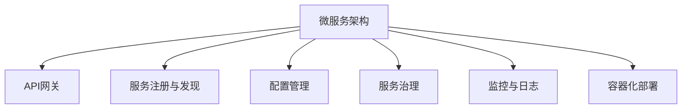

                 

# Web后端微服务架构设计

> 关键词：微服务架构，后端开发，分布式系统，服务治理，DevOps，API网关，监控与日志，容器化部署

## 1. 背景介绍

### 1.1 问题由来

随着互联网和云计算技术的快速发展，Web后端系统逐渐从传统的单点式架构向微服务架构转型。微服务架构通过将系统拆分成多个独立的小服务，增强了系统的扩展性、弹性和可靠性，但也带来了一系列新的挑战，如服务间通信、服务治理、服务部署等问题。

本文旨在通过深入分析微服务架构的原理、优势和挑战，探讨如何构建高效、可扩展的Web后端微服务系统。

### 1.2 问题核心关键点

微服务架构的核心思想是将复杂的单体应用拆分成多个独立的服务，每个服务围绕业务核心能力展开设计。服务间通过轻量级的通信协议（如HTTP/REST）进行通信，使得系统具有高度的灵活性和可扩展性。

微服务架构的优势包括：

1. 增强系统可扩展性：服务可以独立部署和扩展，适应业务增长。
2. 提高系统可靠性：服务的独立部署和隔离机制降低了单点故障的风险。
3. 促进技术创新：各服务模块可以采用不同的技术和语言，实现技术创新和多样化。

但微服务架构也面临一些挑战，如服务间通信复杂、服务治理困难、部署和运维难度增加等。因此，在设计和实施微服务架构时，需要综合考虑系统的复杂性和可用性。

## 2. 核心概念与联系

### 2.1 核心概念概述

为更好地理解微服务架构的原理和实现，本节将介绍几个密切相关的核心概念：

- **微服务架构(Microservices Architecture)**：将复杂的单体应用拆分成多个独立的服务，每个服务围绕业务核心能力展开设计。服务间通过轻量级的通信协议进行通信。

- **API网关(API Gateway)**：负责处理请求路由、协议转换、负载均衡、安全认证等功能，作为服务间的统一入口。

- **服务注册与发现(Service Registry & Discovery)**：管理服务的注册和发现，动态更新服务地址和负载信息，实现服务的自动发现和调用。

- **配置管理(Configuration Management)**：集中管理服务的配置信息，如环境变量、密钥等，实现配置的集中统一管理。

- **服务治理(Service Governance)**：规范服务间的调用规则，如限流、熔断、故障恢复等，确保系统的稳定性和可用性。

- **监控与日志(Monitoring & Logging)**：实时监控系统运行状态和性能指标，记录系统日志和错误信息，帮助快速定位和解决问题。

- **容器化部署(Containerization Deployment)**：使用容器技术（如Docker）封装和部署服务，实现快速部署和扩展。

这些核心概念之间的逻辑关系可以通过以下Mermaid流程图来展示：



这个流程图展示了几大核心概念及其之间的关系：

1. 微服务架构是整个系统的基础，将系统拆分为多个独立的服务。
2. API网关作为服务间的统一入口，负责处理请求路由和协议转换。
3. 服务注册与发现管理服务的注册和发现，实现服务的自动发现和调用。
4. 配置管理集中管理服务的配置信息，实现配置的集中统一管理。
5. 服务治理规范服务间的调用规则，确保系统的稳定性和可用性。
6. 监控与日志实时监控系统运行状态和性能指标，记录系统日志和错误信息。
7. 容器化部署使用容器技术封装和部署服务，实现快速部署和扩展。

这些概念共同构成了微服务架构的核心框架，使得Web后端系统具备高效、可扩展的特性。

## 3. 核心算法原理 & 具体操作步骤

### 3.1 算法原理概述

微服务架构的核心思想是将复杂的单体应用拆分成多个独立的服务，每个服务围绕业务核心能力展开设计。服务间通过轻量级的通信协议（如HTTP/REST）进行通信，使得系统具有高度的灵活性和可扩展性。

形式化地，假设系统由N个微服务组成，每个服务 $S_i$ 具备独立的功能和数据存储。服务间通过API网关进行通信，API网关负责请求路由、负载均衡、安全认证等功能。系统调用流程可以表示为：

1. 客户端发送请求到API网关。
2. API网关路由请求到相应的服务 $S_i$。
3. 服务 $S_i$ 处理请求并返回响应。
4. API网关将响应返回给客户端。

通过这种设计，系统可以独立部署、扩展和维护每个服务，增强了系统的灵活性和可扩展性。

### 3.2 算法步骤详解

微服务架构的实现步骤如下：

**Step 1: 拆分应用模块**
- 根据业务功能，将单体应用拆分成多个独立的服务。每个服务围绕业务核心能力展开设计。

**Step 2: 设计服务接口**
- 为每个服务设计统一的API接口，包括请求参数、响应格式、错误码等。

**Step 3: 实现服务逻辑**
- 为每个服务实现具体的业务逻辑，存储数据和服务状态。

**Step 4: 设计API网关**
- 设计API网关，负责请求路由、负载均衡、安全认证等功能。

**Step 5: 实现服务注册与发现**
- 实现服务注册与发现机制，动态更新服务地址和负载信息，实现服务的自动发现和调用。

**Step 6: 实现配置管理**
- 集中管理服务的配置信息，如环境变量、密钥等，实现配置的集中统一管理。

**Step 7: 实现服务治理**
- 规范服务间的调用规则，如限流、熔断、故障恢复等，确保系统的稳定性和可用性。

**Step 8: 实现监控与日志**
- 实时监控系统运行状态和性能指标，记录系统日志和错误信息，帮助快速定位和解决问题。

**Step 9: 实现容器化部署**
- 使用容器技术（如Docker）封装和部署服务，实现快速部署和扩展。

通过以上步骤，可以构建一个高效、可扩展的微服务系统，满足业务需求。

### 3.3 算法优缺点

微服务架构具有以下优点：

1. 增强系统可扩展性：服务可以独立部署和扩展，适应业务增长。
2. 提高系统可靠性：服务的独立部署和隔离机制降低了单点故障的风险。
3. 促进技术创新：各服务模块可以采用不同的技术和语言，实现技术创新和多样化。

同时，该架构也面临一些缺点：

1. 服务间通信复杂：服务间需要通过API网关进行通信，增加了复杂性。
2. 服务治理困难：服务间的依赖关系增加了系统调度和故障恢复的难度。
3. 部署和运维难度增加：服务数量增多，部署和运维难度增加。

尽管存在这些缺点，但微服务架构在应对复杂系统和高并发场景时，仍然具有显著优势。

### 3.4 算法应用领域

微服务架构广泛应用于互联网和云平台领域，如电子商务、金融、社交网络、物联网等。微服务架构的高可用性和可扩展性，使得系统能够更好地应对业务变化和技术演进。

具体应用场景包括：

1. 电商平台的商品管理、订单处理、物流配送等模块。
2. 金融系统的交易处理、风险管理、用户认证等模块。
3. 社交网络的内容发布、用户互动、广告推荐等模块。
4. 物联网设备的连接管理、数据采集、数据分析等模块。

这些领域的应用展示了微服务架构的强大适应性和灵活性。

## 4. 数学模型和公式 & 详细讲解 & 举例说明

### 4.1 数学模型构建

微服务架构的数学模型可以基于服务调用的时序图进行构建。假设系统由N个微服务组成，服务 $S_i$ 在时间 $t$ 时刻响应时间为 $r_i(t)$，调用请求到达时间为 $a_i(t)$，响应时间为 $r_i(t)$，响应时间为 $c_i(t)$。服务调用关系可以表示为：

$$
r_i(t) = a_i(t) + c_i(t) - a_{i-1}(t)
$$

其中 $a_{i-1}(t)$ 表示上一个服务 $S_{i-1}$ 的处理时间。

通过以上公式，可以计算每个服务的响应时间，并进一步分析系统整体的时序性能。

### 4.2 公式推导过程

根据上述公式，可以推导出系统的响应时间表达式：

$$
R(t) = \sum_{i=1}^{N} r_i(t)
$$

其中 $R(t)$ 表示系统在时间 $t$ 的响应时间。

进一步分析系统的时序性能，可以使用以下公式：

$$
P(t) = \frac{R(t)}{t}
$$

其中 $P(t)$ 表示系统在时间 $t$ 的吞吐量，即单位时间内的响应次数。

根据以上公式，可以对系统进行性能分析和调优。

### 4.3 案例分析与讲解

以电商平台的商品管理模块为例，分析微服务架构的时序性能。假设商品管理模块包含商品查询、商品上架、商品下架三个服务，每个服务响应时间分别为 $r_1(t)$、$r_2(t)$、$r_3(t)$。

1. 商品查询服务 $S_1$ 在时间 $t$ 时刻响应时间为 $r_1(t)$。
2. 商品上架服务 $S_2$ 在时间 $t$ 时刻响应时间为 $r_2(t)$。
3. 商品下架服务 $S_3$ 在时间 $t$ 时刻响应时间为 $r_3(t)$。

通过上述公式，可以计算出商品管理模块的响应时间：

$$
R(t) = r_1(t) + r_2(t) + r_3(t)
$$

假设商品查询服务响应时间为0.1秒，商品上架服务响应时间为0.2秒，商品下架服务响应时间为0.3秒。

1. 在时间 $t=1$ 秒时，商品管理模块的响应时间为 $R(1)=0.1+0.2+0.3=0.6$ 秒。
2. 在时间 $t=2$ 秒时，商品管理模块的响应时间为 $R(2)=0.1+0.2+0.3=0.6$ 秒。

可以看出，在固定服务响应时间的情况下，商品管理模块的响应时间稳定在0.6秒左右。

进一步分析吞吐量：

$$
P(t) = \frac{R(t)}{t} = \frac{0.6}{1} = 0.6\text{次/秒}
$$

在时间 $t=1$ 秒时，商品管理模块的吞吐量为0.6次/秒。

通过以上分析，可以发现微服务架构的性能和时序关系，为系统调优提供依据。

## 5. 项目实践：代码实例和详细解释说明

### 5.1 开发环境搭建

在进行微服务架构的实践前，需要准备好开发环境。以下是使用Java和Spring Boot进行微服务开发的配置步骤：

1. 安装Java Development Kit（JDK）：从官网下载并安装JDK 11或以上版本。

2. 安装Maven：从官网下载并安装Maven 3.6或以上版本。

3. 创建Maven项目：在终端中执行以下命令：

```bash
mvn archetype:generate -DgroupId=com.example -DartifactId=my-service -DarchetypeArtifactId=maven-archetype-quickstart -DinteractiveMode=false
```

4. 引入Spring Boot和Spring Cloud：在pom.xml文件中添加依赖：

```xml
<dependencies>
    <dependency>
        <groupId>org.springframework.boot</groupId>
        <artifactId>spring-boot-starter</artifactId>
    </dependency>
    <dependency>
        <groupId>org.springframework.cloud</groupId>
        <artifactId>spring-cloud-starter-netflix-ribbon</artifactId>
    </dependency>
    <dependency>
        <groupId>org.springframework.cloud</groupId>
        <artifactId>spring-cloud-starter-netflix-eureka</artifactId>
    </dependency>
    <dependency>
        <groupId>org.springframework.cloud</groupId>
        <artifactId>spring-cloud-starter-netflix-zuul</artifactId>
    </dependency>
</dependencies>
```

5. 配置Spring Cloud：在application.properties文件中添加以下配置：

```properties
spring.cloud.netflix.eureka.server.enabled=true
spring.cloud.netflix.eureka.instance.serviceId=my-service
spring.cloud.netflix.eureka.instance.ipAddress=${local.server.port}
```

通过以上配置，可以搭建一个基于Eureka的微服务注册和发现服务，实现服务的自动注册和调用。

### 5.2 源代码详细实现

下面我们以电商平台的商品管理模块为例，给出使用Spring Boot和Spring Cloud进行微服务开发的代码实现。

首先，定义商品查询服务：

```java
@RestController
@RequestMapping("/product")
public class ProductController {

    @Autowired
    private ProductService productService;

    @GetMapping("/{id}")
    public Product getProductById(@PathVariable Long id) {
        return productService.findById(id);
    }
}
```

接着，定义商品服务：

```java
@Service
public class ProductService {

    @Autowired
    private ProductRepository productRepository;

    public Product findById(Long id) {
        return productRepository.findById(id).orElse(null);
    }

    public Product save(Product product) {
        return productRepository.save(product);
    }
}
```

然后，定义商品存储：

```java
@Repository
public interface ProductRepository extends JpaRepository<Product, Long> {
}
```

接下来，定义商品上架服务：

```java
@RestController
@RequestMapping("/product")
public class ProductController {

    @Autowired
    private ProductService productService;

    @PostMapping
    public String addProduct(@RequestBody Product product) {
        productService.save(product);
        return "Product added successfully";
    }
}
```

最后，定义商品下架服务：

```java
@RestController
@RequestMapping("/product")
public class ProductController {

    @Autowired
    private ProductService productService;

    @DeleteMapping("/{id}")
    public String deleteProduct(@PathVariable Long id) {
        productService.deleteById(id);
        return "Product deleted successfully";
    }
}
```

通过以上代码，我们实现了商品查询、上架和下架三个微服务。每个服务都在Spring Boot中通过注解定义，并通过Spring Cloud集成的Netflix Eureka和Zuul等组件，实现了服务的自动注册和调用。

### 5.3 代码解读与分析

让我们再详细解读一下关键代码的实现细节：

**ProductController类**：
- `@Autowired`注解用于自动装配Spring容器中的ProductService实例。
- `@RequestMapping`注解用于映射HTTP请求的URL和HTTP方法。

**ProductService类**：
- `@Autowired`注解用于自动装配Spring容器中的ProductRepository实例。
- `@GetMapping`注解用于映射HTTP GET请求的URL和参数。

**ProductRepository接口**：
- `@Repository`注解用于标记Spring容器中的数据访问对象（DAO）。
- `JpaRepository`接口提供了常用的数据库操作方法。

通过以上代码，我们可以看到Spring Boot和Spring Cloud在微服务开发中的应用，代码简洁高效，易于维护。

### 5.4 运行结果展示

启动微服务后，可以通过Swagger UI访问API文档，获取每个服务的详细说明和示例。例如，商品查询服务的API文档如下：

```yaml
swagger: "2.0"
info:
  title: Product Service
  description: "商品管理模块的API接口"
  version: "1.0"
paths:
  "/product/{id}":
    get:
      summary: "根据ID获取商品信息"
      description: "获取指定ID的商品信息"
      produces:
        - "application/json"
      parameters:
        - name: id
          in: path
          required: true
          type: string
          description: "商品ID"
      responses:
        200:
          description: "成功"
          schema:
            $ref: "#/definitions/Product"
```

通过以上API文档，可以清晰地了解商品查询服务的调用方式和返回结果。

## 6. 实际应用场景

### 6.1 电商平台的商品管理模块

电商平台的商品管理模块可以采用微服务架构，实现商品查询、上架、下架等功能。具体实现步骤如下：

1. 将商品查询、上架、下架三个服务拆分出来，每个服务围绕业务核心能力展开设计。
2. 为每个服务设计统一的API接口，包括请求参数、响应格式、错误码等。
3. 为每个服务实现具体的业务逻辑，存储数据和服务状态。
4. 设计API网关，负责请求路由、负载均衡、安全认证等功能。
5. 实现服务注册与发现机制，动态更新服务地址和负载信息，实现服务的自动发现和调用。
6. 实现配置管理，集中管理服务的配置信息，如环境变量、密钥等，实现配置的集中统一管理。
7. 实现服务治理，规范服务间的调用规则，如限流、熔断、故障恢复等，确保系统的稳定性和可用性。
8. 实现监控与日志，实时监控系统运行状态和性能指标，记录系统日志和错误信息，帮助快速定位和解决问题。
9. 实现容器化部署，使用容器技术封装和部署服务，实现快速部署和扩展。

通过以上步骤，可以构建一个高效、可扩展的微服务系统，满足电商平台的业务需求。

### 6.2 金融系统的交易处理模块

金融系统的交易处理模块可以采用微服务架构，实现交易处理、风险管理、用户认证等功能。具体实现步骤如下：

1. 将交易处理、风险管理、用户认证三个服务拆分出来，每个服务围绕业务核心能力展开设计。
2. 为每个服务设计统一的API接口，包括请求参数、响应格式、错误码等。
3. 为每个服务实现具体的业务逻辑，存储数据和服务状态。
4. 设计API网关，负责请求路由、负载均衡、安全认证等功能。
5. 实现服务注册与发现机制，动态更新服务地址和负载信息，实现服务的自动发现和调用。
6. 实现配置管理，集中管理服务的配置信息，如环境变量、密钥等，实现配置的集中统一管理。
7. 实现服务治理，规范服务间的调用规则，如限流、熔断、故障恢复等，确保系统的稳定性和可用性。
8. 实现监控与日志，实时监控系统运行状态和性能指标，记录系统日志和错误信息，帮助快速定位和解决问题。
9. 实现容器化部署，使用容器技术封装和部署服务，实现快速部署和扩展。

通过以上步骤，可以构建一个高效、可扩展的微服务系统，满足金融系统的业务需求。

## 7. 工具和资源推荐

### 7.1 学习资源推荐

为了帮助开发者系统掌握微服务架构的理论基础和实践技巧，这里推荐一些优质的学习资源：

1. 《Spring Boot 2.0实战》：详细介绍了Spring Boot和Spring Cloud的原理和应用。
2. 《Spring Cloud 微服务实战》：系统讲解了Spring Cloud在微服务架构中的应用，包括API网关、服务注册、配置管理、服务治理、监控与日志等功能。
3. 《微服务架构基础》：介绍了微服务架构的基本概念、优势、挑战和实现方法。
4. 《Spring Cloud Netflix系列》：详细讲解了Spring Cloud Netflix在微服务架构中的应用，包括Eureka、Zuul、Ribbon等功能。
5. 《微服务设计与实践》：探讨了微服务架构的设计原则和实践技巧，包括服务拆分、API设计、服务治理、监控与日志等功能。

通过对这些资源的学习实践，相信你一定能够快速掌握微服务架构的精髓，并用于解决实际的Web后端系统问题。

### 7.2 开发工具推荐

高效的开发离不开优秀的工具支持。以下是几款用于微服务架构开发的常用工具：

1. IntelliJ IDEA：一款功能强大的Java IDE，支持Spring Boot和Spring Cloud的开发和调试。
2. Postman：一款流行的API测试工具，可以模拟HTTP请求，查看API响应。
3. Swagger UI：一款API文档工具，可以自动生成API文档，提供交互式体验。
4. JIRA：一款项目管理工具，可以帮助团队协作开发，跟踪任务进度。
5. Docker：一款容器化部署工具，可以实现服务的快速部署和扩展。

合理利用这些工具，可以显著提升微服务架构的开发效率，加快创新迭代的步伐。

### 7.3 相关论文推荐

微服务架构的研究源于学界的持续探索。以下是几篇奠基性的相关论文，推荐阅读：

1. 《Building Microservices》：介绍微服务架构的基本概念和设计原则。
2. 《Microservices: A Personal Perspective》：从作者视角探讨微服务架构的优缺点。
3. 《Designing Distributed Systems》：介绍分布式系统的设计原理和实现方法。
4. 《The Twelve-Factor App》：介绍容器化部署和微服务架构的最佳实践。
5. 《Microservices: Principles and Patterns for Building Flexible Software Systems》：系统讲解微服务架构的设计原则和实现方法。

这些论文代表了大规模微服务架构的研究方向，为微服务架构的深入研究提供了理论基础。

## 8. 总结：未来发展趋势与挑战

### 8.1 总结

本文对微服务架构的设计、实现和优化进行了全面系统的介绍。首先阐述了微服务架构的核心思想和优势，明确了微服务架构在Web后端系统中的应用前景。其次，从原理到实践，详细讲解了微服务架构的数学模型、关键步骤和具体实现，提供了微服务架构的完整代码实例。同时，本文还探讨了微服务架构在电商、金融等领域的应用案例，展示了微服务架构的强大适应性和灵活性。此外，本文精选了微服务架构的相关资源，力求为读者提供全方位的技术指引。

通过本文的系统梳理，可以看到，微服务架构在应对复杂系统和高并发场景时，仍然具有显著优势。微服务架构的高可用性和可扩展性，使得系统能够更好地适应业务变化和技术演进。未来，伴随微服务架构的持续演进，相信在更多的领域，微服务架构将会发挥更大的作用，构建更加高效、可扩展的Web后端系统。

### 8.2 未来发展趋势

展望未来，微服务架构将呈现以下几个发展趋势：

1. 云原生微服务：微服务架构将与云原生技术深度结合，借助容器化、Kubernetes等技术，实现快速部署、弹性伸缩和自愈性。
2. 服务网格(Servicemesh)：通过服务网格技术，实现微服务之间的通信优化、流量控制和故障恢复，提升微服务的可靠性和可用性。
3. 低代码/无代码开发：通过低代码/无代码平台，快速构建微服务应用，降低开发门槛，提升开发效率。
4. 声明式API管理：通过声明式API管理技术，实现API的自动化设计和治理，提升API管理效率。
5. 多云微服务：通过多云微服务架构，实现跨云平台的服务部署和管理，提升资源利用率，降低云平台成本。
6. 微服务安全：通过微服务安全架构，实现微服务的身份认证、授权、加密等安全措施，确保系统的安全性和可靠性。

以上趋势凸显了微服务架构的广阔前景。这些方向的探索发展，必将进一步提升微服务架构的性能和应用范围，为构建高效、可扩展的Web后端系统提供新的动力。

### 8.3 面临的挑战

尽管微服务架构在Web后端系统中的应用已经取得了显著成效，但在迈向更加智能化、普适化应用的过程中，它仍面临诸多挑战：

1. 服务间通信复杂：服务间需要通过API网关进行通信，增加了复杂性。
2. 服务治理困难：服务间的依赖关系增加了系统调度和故障恢复的难度。
3. 部署和运维难度增加：服务数量增多，部署和运维难度增加。
4. 数据一致性问题：微服务架构下的数据一致性问题需要特殊设计，如分布式事务、本地缓存等。
5. 监控与日志难度增加：服务数量的增加使得监控与日志的难度增加，需要系统化的监控与日志解决方案。
6. 技术选型困难：微服务架构涉及多种技术栈和中间件，选择合适的技术栈和中间件是关键挑战。

尽管存在这些挑战，但微服务架构在应对复杂系统和高并发场景时，仍然具有显著优势。通过持续优化和改进，微服务架构将克服上述挑战，进一步提升Web后端系统的性能和可靠性。

### 8.4 研究展望

面对微服务架构所面临的种种挑战，未来的研究需要在以下几个方面寻求新的突破：

1. 探索云原生微服务：结合云原生技术，实现微服务的快速部署、弹性伸缩和自愈性。
2. 研究服务网格技术：通过服务网格技术，优化微服务之间的通信和流量控制，提升微服务的可靠性和可用性。
3. 融合低代码/无代码开发：通过低代码/无代码平台，降低微服务开发门槛，提升开发效率。
4. 引入声明式API管理：通过声明式API管理技术，提升API的自动化设计和治理效率。
5. 发展多云微服务：通过多云微服务架构，提升跨云平台的服务部署和管理效率。
6. 研究微服务安全：通过微服务安全架构，确保微服务的身份认证、授权、加密等安全措施，提升系统的安全性。

这些研究方向将进一步推动微服务架构的发展，为构建高效、可扩展的Web后端系统提供新的思路和方法。

## 9. 附录：常见问题与解答

**Q1：微服务架构和单体架构有什么区别？**

A: 微服务架构和单体架构的主要区别在于系统设计的方式。单体架构将整个系统作为一个整体进行设计，所有的模块都运行在一个进程中。而微服务架构将系统拆分为多个独立的服务，每个服务围绕业务核心能力展开设计，通过轻量级的通信协议进行通信。

**Q2：微服务架构的优势和挑战分别是什么？**

A: 微服务架构的优势在于：

1. 增强系统可扩展性：服务可以独立部署和扩展，适应业务增长。
2. 提高系统可靠性：服务的独立部署和隔离机制降低了单点故障的风险。
3. 促进技术创新：各服务模块可以采用不同的技术和语言，实现技术创新和多样化。

但微服务架构也面临一些挑战：

1. 服务间通信复杂：服务间需要通过API网关进行通信，增加了复杂性。
2. 服务治理困难：服务间的依赖关系增加了系统调度和故障恢复的难度。
3. 部署和运维难度增加：服务数量增多，部署和运维难度增加。

**Q3：微服务架构如何实现服务的自动发现和调用？**

A: 微服务架构通过服务注册与发现机制，实现服务的自动发现和调用。具体步骤如下：

1. 每个微服务启动时，向注册中心（如Eureka）注册自己的服务信息。
2. 服务调用时，通过API网关（如Zuul）查询注册中心的可用服务实例，并选择其中一个实例进行调用。
3. 服务实例更新时，注册中心自动更新可用服务的实例信息，API网关实时获取最新的服务实例列表。

通过以上步骤，可以实现服务的自动发现和调用，提升系统的灵活性和可靠性。

**Q4：微服务架构如何实现高并发下的性能优化？**

A: 微服务架构可以通过以下方法实现高并发下的性能优化：

1. 采用负载均衡技术：通过负载均衡器（如Nginx、HAProxy等）将请求分配到多个服务实例上，提高系统的并发处理能力。
2. 实现服务缓存：通过本地缓存（如Redis、Ehcache等）缓存热点数据，减少数据库的访问压力。
3. 使用异步通信：通过消息队列（如RabbitMQ、Kafka等）实现异步通信，提升系统的响应速度。
4. 实现限流和熔断：通过限流和熔断机制，防止服务过载和故障扩散，确保系统的稳定性和可用性。

通过以上优化措施，可以提升微服务架构在高并发场景下的性能和可靠性。

**Q5：微服务架构如何实现服务的快速部署和扩展？**

A: 微服务架构可以通过以下方法实现服务的快速部署和扩展：

1. 使用容器化技术：通过容器技术（如Docker）封装和部署服务，实现快速部署和扩展。
2. 采用Kubernetes：通过Kubernetes容器编排平台，实现服务的自动扩缩容和负载均衡。
3. 实现弹性伸缩：通过弹性伸缩技术（如CloudWatch、Prometheus等），根据系统负载动态调整服务实例的数量。
4. 使用服务网格（Service Mesh）：通过服务网格技术（如Istio、Linkerd等），实现服务的自动发现、路由和负载均衡。

通过以上方法，可以确保微服务架构的快速部署和扩展，提升系统的灵活性和可扩展性。

---

作者：禅与计算机程序设计艺术 / Zen and the Art of Computer Programming

