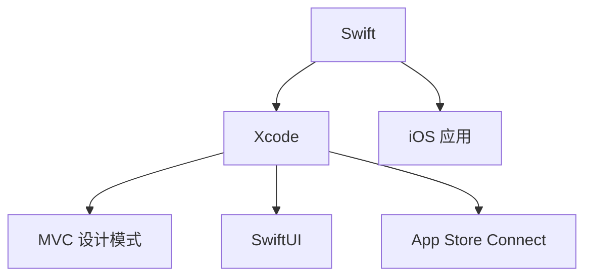

                 

# iOS 开发入门：Swift 和 Xcode

> 关键词：iOS 开发, Swift 编程语言, Xcode IDE, 移动应用开发, 开发者入门

## 1. 背景介绍

### 1.1 问题由来
随着智能手机普及率的持续提升，移动应用市场也随之繁荣。据统计，全球范围内超过一半的互联网流量都来自移动设备。iOS作为苹果公司推出的移动操作系统，凭借其流畅的用户体验和强大的应用生态，吸引了无数开发者投身于iOS应用的开发之中。

然而，相较于Web开发和桌面应用开发，iOS开发的技术门槛相对较高，这主要归因于Swift编程语言的特性以及Xcode集成开发环境(IDE)的复杂性。为了帮助初学者顺利入门，本系列文章将详细介绍Swift语言的基础知识、Xcode IDE的使用方法，并通过实战案例讲解iOS应用的开发流程。

### 1.2 问题核心关键点
iOS开发的核心在于掌握Swift编程语言和Xcode IDE的使用。Swift是苹果公司推出的编程语言，专为iOS开发设计，兼具C++的强大功能和Java的易用性。而Xcode作为苹果官方的开发工具，集成了代码编辑器、调试器、模拟器等一整套开发工具，是iOS开发者不可或缺的工作伙伴。

通过深入学习Swift和Xcode，开发者可以高效地开发出功能丰富、性能卓越的iOS应用。本系列文章将围绕这两个核心点，系统讲解iOS开发的入门知识，帮助读者快速上手，构建自己的iOS应用。

### 1.3 问题研究意义
掌握Swift和Xcode对于初学者来说，不仅可以提升个人技能，还能为职业发展打下坚实的基础。iOS应用开发是当前市场需求量大、待遇优厚的技术岗位之一，掌握这一技能有助于提升就业竞争力，开启成功职业生涯。

此外，iOS应用开发在提升用户体验、推动社会进步方面也具有重要意义。通过iOS应用，开发者可以为用户提供更加便捷、高效的服务，如健康管理、金融理财、在线教育等，进一步促进数字化生活的普及和社会的数字化转型。

## 2. 核心概念与联系

### 2.1 核心概念概述

为了更好地理解iOS开发，本节将介绍几个关键概念：

- **Swift**：苹果公司推出的面向对象的编程语言，专为iOS应用开发设计，具有安全、快速、高效等特点。Swift语言支持面向对象、函数式编程等多种编程范式，同时具备自动内存管理、类型推断等先进特性。

- **Xcode**：苹果官方提供的集成开发环境，集成了代码编辑器、调试器、模拟器等功能，支持Swift、Objective-C等多种编程语言。Xcode通过IDE工具和内置的框架支持，极大提升了iOS应用开发的效率和质量。

- **iOS应用**：运行于iOS设备上的应用程序，通常包括界面设计、数据处理、网络连接等核心功能模块。iOS应用通过App Store发布，提供丰富的用户体验和服务。

- **MVC设计模式**：iOS应用开发中常用的设计模式之一，将用户界面(UI)、数据模型(M)、控制器(C)三个部分分离开来，有助于提高代码的可维护性和可重用性。

- **SwiftUI**：苹果公司推出的用于快速构建用户界面的声明式UI框架，支持从声明式方式构建界面，减少了传统Objective-C编写的复杂性。

- **App Store Connect**：苹果公司提供的应用发布平台，用于发布和管理iOS应用，支持App Store搜索、下载、更新等功能。

这些核心概念之间的逻辑关系可以通过以下Mermaid流程图来展示：



这个流程图展示了大语言模型的核心概念及其之间的关系：

1. Swift是iOS应用开发的核心语言，与Xcode IDE紧密配合。
2. iOS应用包含UI、M、C三个部分，遵循MVC设计模式。
3. SwiftUI是Swift语言的UI框架，用于快速构建界面。
4. App Store Connect是应用的发布平台，连接开发和用户。

这些概念共同构成了iOS应用开发的基础框架，有助于开发者系统掌握开发技能，构建出高质量的iOS应用。

## 3. 核心算法原理 & 具体操作步骤

### 3.1 算法原理概述

iOS应用开发的基本流程可以概括为需求分析、设计、编码、测试、发布等几个阶段。在这一过程中，Swift和Xcode扮演着至关重要的角色。Swift作为应用的主要编程语言，提供代码编写、数据处理等功能，而Xcode则通过IDE工具和框架支持，帮助开发者高效进行开发。

本节将详细讲解iOS应用开发的算法原理和具体操作步骤。

### 3.2 算法步骤详解

iOS应用开发的具体步骤包括以下几个关键环节：

**Step 1: 需求分析和设计**
- 了解应用需求和目标用户群体，明确应用的核心功能和用户界面设计。
- 使用Xcode的Storyboard工具设计UI界面，定义应用布局和交互逻辑。
- 使用SwiftUI框架设计界面，支持声明式UI构建方式。

**Step 2: 编码实现**
- 使用Swift编写应用的核心逻辑和数据处理代码。
- 利用Xcode的调试器进行代码调试和性能优化。
- 使用Swift语言的高级特性，如类型推断、扩展、协议等，提高代码的可读性和可维护性。

**Step 3: 测试和调试**
- 使用Xcode的测试框架进行单元测试和集成测试，确保应用功能正确。
- 使用模拟器和真实设备进行应用测试，修复出现的bug和性能问题。
- 利用Swift语言的assert语句和单元测试框架，确保代码的正确性和健壮性。

**Step 4: 发布和部署**
- 使用Xcode的Archive工具生成应用归档文件，准备发布。
- 在App Store Connect平台上提交应用审核，等待苹果公司的审核通过。
- 发布应用到App Store，供用户下载和使用。

### 3.3 算法优缺点

iOS应用开发具有以下优点：

1. **高效性**：Swift语言的编译效率和运行效率较高，可以显著提升应用性能。
2. **安全性**：Swift语言具备类型推断和自动内存管理等特性，有助于减少内存泄漏和运行时错误。
3. **跨平台性**：通过Swift语言和Xcode IDE，开发者可以在多个iOS设备和平台之间灵活切换和开发。
4. **工具支持**：Xcode提供了丰富的开发工具和框架支持，包括调试器、模拟器、测试框架等，极大提升了开发效率。

同时，iOS应用开发也存在以下局限性：

1. **入门门槛高**：相较于其他编程语言，Swift语言的学习曲线较陡峭，需要掌握一些高级特性。
2. **生态系统封闭**：iOS应用只能运行在苹果设备上，限制了应用的可移植性。
3. **开发成本高**：iOS应用的开发和维护成本相对较高，需要一定的技术积累和团队协作。

尽管存在这些局限性，但iOS应用开发凭借其出色的性能和用户体验，仍然是移动应用开发领域的主流选择之一。

### 3.4 算法应用领域

iOS应用开发在各个领域都有广泛的应用，包括但不限于：

- **娱乐**：视频播放、游戏、社交网络等。
- **教育**：在线课程、电子书、学习工具等。
- **健康**：健康管理、运动跟踪、营养记录等。
- **金融**：在线支付、理财规划、股票交易等。
- **商务**：项目管理、客户管理、在线会议等。
- **电商**：商品推荐、在线购物、订单管理等。
- **生活服务**：地图导航、天气预报、旅游规划等。

iOS应用开发不仅能够满足用户的多样化需求，还能推动各行各业的数字化转型，提升社会生产的效率和质量。

## 4. 数学模型和公式 & 详细讲解 & 举例说明

### 4.1 数学模型构建

本节将使用数学语言对iOS应用开发的算法原理进行更加严格的刻画。

假设iOS应用的核心功能为$F$，用户界面为$U$，数据模型为$M$，控制器为$C$。其中，$U$由Xcode的Storyboard工具设计，$F$和$M$通过Swift语言实现，$C$负责处理用户交互和数据流。则iOS应用的开发过程可以表示为以下数学模型：

$$
A = F(U, M, C)
$$

其中，$A$表示最终的应用输出，包括用户界面、数据展示、用户交互等功能。该模型强调了各个组件之间的依赖关系，即用户界面设计($U$)、数据模型($M$)和控制器($C$)共同作用，实现应用的核心功能($F$)。

### 4.2 公式推导过程

以一个简单的计数器应用为例，推导其开发过程的数学公式。

假设计数器应用的核心功能为$F$，即增加和减少计数器的数值。用户界面$U$包含一个按钮和显示器的视图，数据模型$M$是一个简单的整数类型。控制器$C$处理按钮点击事件，更新计数器的值，并显示在界面上。则开发过程的数学公式为：

$$
A = F(U, M, C) = \text{显示 } (M, C)
$$

其中，$M$表示当前计数器的数值，$C$处理按钮点击事件，将计数器数值加1或减1，并将结果显示在界面上。

### 4.3 案例分析与讲解

以一个天气应用为例，详细讲解其开发过程。

**需求分析**：
- 实现当前天气的展示和未来天气的预测。
- 提供城市选择和单位切换功能。

**设计**：
- 使用Xcode的Storyboard工具设计UI界面，包括城市选择器、天气展示框、单位切换按钮等。
- 使用SwiftUI框架设计声明式UI，简化界面的构建过程。

**编码实现**：
- 使用Swift编写核心逻辑，包括从API获取天气数据、处理数据、展示天气信息等。
- 利用Swift语言的高级特性，如扩展、协议、泛型等，提高代码的复用性和可维护性。

**测试和调试**：
- 使用Xcode的测试框架进行单元测试和集成测试，确保应用功能的正确性。
- 使用模拟器和真实设备进行应用测试，修复bug和性能问题。
- 利用Swift语言的assert语句和单元测试框架，确保代码的正确性和健壮性。

**发布和部署**：
- 使用Xcode的Archive工具生成应用归档文件，准备发布。
- 在App Store Connect平台上提交应用审核，等待苹果公司的审核通过。
- 发布应用到App Store，供用户下载和使用。

通过这个案例，可以看到iOS应用的开发过程包含了需求分析、设计、编码、测试、发布等多个环节，每一步都依赖Swift语言和Xcode IDE的支持。

## 5. 项目实践：代码实例和详细解释说明

### 5.1 开发环境搭建

在进行iOS应用开发前，我们需要准备好开发环境。以下是使用Xcode进行iOS开发的环境配置流程：

1. 安装Xcode：从苹果官网下载并安装最新版本的Xcode。
2. 配置开发环境：Xcode安装完成后，打开Xcode，配置开发环境，如安装Swift语言和框架，下载并安装模拟器等。
3. 创建新项目：在Xcode中选择"Create a new Xcode project"，选择iOS应用模板，填写项目信息，创建新项目。

完成上述步骤后，即可在Xcode中开始iOS应用的开发实践。

### 5.2 源代码详细实现

下面以一个简单的计数器应用为例，展示使用Xcode和Swift语言进行iOS应用的开发过程。

首先，在Xcode中创建新项目，选择"Single View App"模板。

**Step 1: 设计UI界面**

打开Storyboard，拖动视图控制器、按钮、标签等控件，并设置其属性。具体步骤如下：

1. 拖动一个视图控制器到Storyboard中。
2. 拖动到主屏幕上，连接两个视图控制器，使其关联。
3. 拖动到视图控制器中，创建一个按钮控件。
4. 拖动到按钮上，创建一个标签控件。

**Step 2: 编写Swift代码**

在ViewController.swift中编写Swift代码，实现计数器的核心功能。具体步骤如下：

1. 创建一个变量count，初始值为0，用于存储计数器的数值。
2. 在按钮的点击事件中，增加或减少计数器的数值，并更新标签的显示内容。

```swift
class ViewController: UIViewController {
    
    @IBOutlet weak var countLabel: UILabel!
    var count: Int = 0
    
    override func viewDidLoad() {
        super.viewDidLoad()
        // Do any additional setup after loading the view, typically from a nib.
        // Register button click action
        let button = UIButton()
        button.setTitle("Click Me", for: .normal)
        button.addTarget(self, action: #selector(incrementCount), for: .touchUpInside)
        self.view.addSubview(button)
        button.center = CGPoint(x: view.frame.width/2, y: view.frame.height/2)
    }
    
    @objc func incrementCount() {
        count += 1
        countLabel.text = "\(count)"
    }
    
    // ...
}
```

**Step 3: 运行和调试**

点击Xcode顶部的"Run"按钮，运行应用，并在模拟器上测试。

在运行过程中，点击按钮，可以观察到计数器的数值不断增加，并显示在界面上。

通过这个简单的计数器应用，展示了Swift语言和Xcode IDE的基本使用，帮助开发者熟悉iOS应用的开发流程。

### 5.3 代码解读与分析

让我们再详细解读一下关键代码的实现细节：

**ViewController类**：
- 继承自UIViewController，作为应用的主要控制器。
- 包含一个标签控件和计数器变量count，用于显示计数器的数值。

**viewDidLoad方法**：
- 在视图加载完成后调用，用于初始化视图和控件。
- 创建按钮控件，并设置点击事件处理函数incrementCount。

**incrementCount方法**：
- 响应按钮的点击事件，增加计数器的数值，并更新标签的显示内容。
- 使用Swift语言的@objc关键字，将方法定义为可调用对象，使其可以通过Selector对象调用。

通过这个代码示例，可以看出Swift语言的简洁性和Xcode IDE的易用性，使得iOS应用的开发变得更加高效和直观。

## 6. 实际应用场景

### 6.1 智能家居应用

iOS应用开发在智能家居领域有广泛的应用。通过iOS应用，用户可以远程控制家中的各种智能设备，如灯光、温度、安防等。智能家居应用通常包含设备控制、场景设置、设备信息展示等功能。

具体实现步骤包括：

- 收集和整合智能设备的数据，设计设备数据模型和UI界面。
- 编写核心逻辑代码，实现设备控制和数据展示。
- 利用Xcode的调试器和模拟器进行应用测试，确保设备控制和数据展示的准确性。
- 通过App Store Connect平台发布应用，供用户下载和使用。

智能家居应用不仅提升了家庭生活的便利性，还为用户提供了更好的居住体验。

### 6.2 在线教育平台

iOS应用开发在在线教育领域也有广泛的应用。通过iOS应用，用户可以随时随地学习课程，参与互动讨论，获取在线辅导等。在线教育应用通常包含课程推荐、学习进度管理、在线直播等功能。

具体实现步骤包括：

- 收集和整合教育资源，设计课程数据模型和UI界面。
- 编写核心逻辑代码，实现课程推荐和进度管理。
- 利用Xcode的调试器和模拟器进行应用测试，确保课程推荐和进度管理的准确性。
- 通过App Store Connect平台发布应用，供用户下载和使用。

在线教育应用不仅为学生提供了更加灵活和便捷的学习方式，还为教育机构提供了更高效的教学工具。

### 6.3 健康管理应用

iOS应用开发在健康管理领域也有广泛的应用。通过iOS应用，用户可以记录健康数据，获取健康建议，参与健康管理计划等。健康管理应用通常包含健康数据记录、健康建议展示、健康计划管理等功能。

具体实现步骤包括：

- 收集和整合健康数据，设计健康数据模型和UI界面。
- 编写核心逻辑代码，实现健康数据记录和建议展示。
- 利用Xcode的调试器和模拟器进行应用测试，确保健康数据记录和建议展示的准确性。
- 通过App Store Connect平台发布应用，供用户下载和使用。

健康管理应用不仅提高了用户的健康意识，还为用户提供了更好的健康管理方案。

### 6.4 未来应用展望

随着iOS应用开发技术的不断进步，iOS应用在未来将会有更加广泛的应用场景。以下是几个可能的应用领域：

- **智慧办公**：通过iOS应用，用户可以实现远程办公、协作、会议等功能。
- **智能医疗**：通过iOS应用，用户可以预约医生、在线咨询、查看健康数据等。
- **智能交通**：通过iOS应用，用户可以查询实时交通路况、规划出行路线等。
- **社交娱乐**：通过iOS应用，用户可以和朋友互动、参与社交活动、获取娱乐内容等。
- **智能家居**：通过iOS应用，用户可以控制家中的智能设备，提升生活质量。

未来，随着技术的不断进步和应用的不断拓展，iOS应用开发将在各行各业发挥越来越重要的作用，为人类社会带来更多的便利和创新。

## 7. 工具和资源推荐

### 7.1 学习资源推荐

为了帮助开发者系统掌握iOS开发的技术基础，以下是一些优质的学习资源：

1. Apple官方文档：苹果公司提供的官方文档，涵盖Swift语言、Xcode IDE、iOS应用开发等方面的详细信息。
2. Ray Wenderlich网站：提供iOS应用开发的教程、文章和代码示例，适合初学者和中级开发者。
3. Stanford University iOS开发课程：斯坦福大学开设的iOS应用开发课程，提供系统性的理论知识和实践经验。
4. SwiftUI官方文档：苹果公司提供的SwiftUI框架官方文档，涵盖声明式UI构建方式的详细信息。
5. Swift语言参考手册：苹果公司提供的Swift语言参考手册，提供Swift语言的详细语法和特性说明。

通过对这些资源的学习实践，相信你一定能够快速掌握iOS开发的精髓，并用于解决实际的开发问题。

### 7.2 开发工具推荐

iOS应用开发的工具多种多样，以下是几款常用的工具：

1. Xcode：苹果公司提供的集成开发环境，集成了代码编辑器、调试器、模拟器等功能，是iOS开发的首选工具。
2. GitHub：全球最大的代码托管平台，提供开源代码库和协作工具，便于开发者共享和交流代码。
3. Bitbucket：Bitbucket提供代码托管、协作、代码审查等功能，适合团队开发。
4. JIRA：JIRA提供项目管理、任务追踪、Bug管理等功能，帮助开发者进行项目管理和协调。
5. CocoaPods：CocoaPods提供Swift和Objective-C框架的依赖管理工具，便于开发者快速集成第三方库。

合理利用这些工具，可以显著提升iOS应用开发的效率和质量，加快创新迭代的步伐。

### 7.3 相关论文推荐

iOS应用开发的研究涉及多个领域，以下是几篇奠基性的相关论文，推荐阅读：

1. A Survey on iOS Mobile Application Development：介绍iOS应用开发的现状和未来发展方向。
2. Swift Programming Language：苹果公司发布的Swift语言白皮书，详细介绍了Swift语言的设计思想和特性。
3. Xcode: The IDE for iOS App Development：苹果公司发布的Xcode IDE白皮书，详细介绍了Xcode IDE的设计理念和功能。
4. Accelerating Swift Application Development with App Store Connect：苹果公司发布的App Store Connect平台白皮书，详细介绍App Store Connect的应用发布和管理机制。
5. SwiftUI: A framework for declarative UI programming：苹果公司发布的SwiftUI框架白皮书，详细介绍声明式UI构建方式的实现原理和优势。

这些论文代表了大语言模型微调技术的发展脉络。通过学习这些前沿成果，可以帮助研究者把握学科前进方向，激发更多的创新灵感。

## 8. 总结：未来发展趋势与挑战

### 8.1 总结

本文对iOS应用开发的算法原理和操作步骤进行了全面系统的介绍。首先阐述了iOS应用开发的背景和意义，明确了Swift语言和Xcode IDE在开发中的核心地位。其次，从原理到实践，详细讲解了iOS应用开发的数学模型和具体操作步骤，给出了iOS应用开发的完整代码实例。同时，本文还广泛探讨了iOS应用开发在各个领域的应用前景，展示了iOS应用开发的广阔前景。

通过本文的系统梳理，可以看到，iOS应用开发的技术基础已经成熟，开发者可以高效地使用Swift语言和Xcode IDE，构建出功能丰富、性能卓越的iOS应用。掌握这一技术，不仅能够提升个人技能，还能为职业发展奠定坚实基础。

### 8.2 未来发展趋势

展望未来，iOS应用开发将呈现以下几个发展趋势：

1. **跨平台性**：未来的iOS应用开发将更加注重跨平台性，支持在多个平台和设备上运行。
2. **AI技术融合**：iOS应用开发将更多地融合人工智能技术，如自然语言处理、计算机视觉等，提升应用智能化水平。
3. **隐私保护**：随着用户隐私意识的提升，未来的iOS应用开发将更加注重用户数据的安全和隐私保护。
4. **用户定制化**：未来的iOS应用开发将更加注重用户定制化，通过用户行为数据和学习算法，为用户提供个性化服务。
5. **生态系统协同**：未来的iOS应用开发将更加注重生态系统的协同，通过App Store Connect平台和开发者社区，形成更强大的应用生态。
6. **新兴技术探索**：未来的iOS应用开发将更多地探索新兴技术，如AR/VR、区块链等，推动技术前沿的不断突破。

以上趋势凸显了iOS应用开发技术的广阔前景。这些方向的探索发展，必将进一步提升iOS应用的性能和用户体验，推动技术创新和社会进步。

### 8.3 面临的挑战

尽管iOS应用开发已经取得了显著的成就，但在迈向更加智能化、普适化应用的过程中，它仍面临着诸多挑战：

1. **学习曲线陡峭**：Swift语言的特性和Xcode IDE的复杂性，使得iOS开发对初学者来说存在一定的门槛。
2. **生态系统封闭**：iOS应用开发只能在苹果生态系统中进行，限制了应用的可移植性。
3. **开发成本高**：iOS应用的开发和维护成本相对较高，需要一定的技术积累和团队协作。
4. **技术更新快**：iOS开发技术更新迭代快，开发者需要不断学习和更新，保持技术领先。
5. **用户隐私保护**：用户隐私保护和数据安全成为开发者必须面对的重要问题，需要严格遵守相关法律法规。
6. **应用碎片化**：不同设备和操作系统的差异，导致iOS应用存在一定的碎片化，开发者需要针对不同平台进行适配和优化。

正视iOS应用开发面临的这些挑战，积极应对并寻求突破，将是在未来取得成功的关键。

### 8.4 研究展望

未来的iOS应用开发需要在以下几个方面进行进一步探索：

1. **AI技术融合**：结合自然语言处理、计算机视觉等AI技术，提升iOS应用的智能化水平。
2. **跨平台开发**：探索跨平台开发工具和框架，实现iOS应用在多个平台和设备上的运行。
3. **隐私保护**：制定和实施更严格的数据隐私保护机制，保护用户数据安全。
4. **用户定制化**：通过机器学习和用户行为数据，实现应用的个性化和定制化。
5. **生态系统协同**：通过开发者社区和App Store Connect平台，建立更强大的应用生态。
6. **新兴技术探索**：探索和应用新兴技术，如AR/VR、区块链等，推动技术前沿的突破。

通过在这些方面的进一步探索，未来的iOS应用开发将更加智能化、普适化，为用户带来更好的体验，推动社会的数字化转型。

## 9. 附录：常见问题与解答

**Q1: 如何选择合适的iOS开发平台？**

A: 选择合适的iOS开发平台，需要考虑多个因素，包括：
- 开发工具的易用性和功能：如Xcode的IDE支持、Swift语言的特性等。
- 应用的目标用户群体：如企业用户、普通用户等。
- 应用的功能需求：如定制化、智能化、跨平台等。
- 开发团队的技术积累和资源：如团队规模、技术储备等。
综合考虑以上因素，选择最适合的项目需求和技术背景的开发平台，有助于提高开发效率和应用质量。

**Q2: Swift语言有哪些特性？**

A: Swift语言具有以下特性：
- 安全：支持自动内存管理、类型推断、隐式实现等，减少内存泄漏和运行时错误。
- 快速：编译效率高，运行速度快。
- 高效：支持并发编程、协程等特性，提升应用性能。
- 现代化：支持函数式编程、协议、扩展等先进特性，提高代码的可读性和可维护性。
- 开源：开源社区支持广泛，资源丰富。
这些特性使得Swift语言成为iOS开发的首选语言。

**Q3: Xcode有哪些常用功能？**

A: Xcode集成了多种开发工具和框架，支持iOS应用的完整开发流程。常用的功能包括：
- 代码编辑器：支持Swift语言的编写、调试、重构等。
- 模拟器：支持在模拟器上测试和调试应用。
- 调试器：支持断点调试、性能分析等。
- 设计工具：支持Storyboard和SwiftUI的设计和布局。
- 测试框架：支持单元测试、集成测试、性能测试等。
这些功能使得Xcode成为iOS开发不可或缺的工具。

**Q4: 如何进行单元测试和集成测试？**

A: 在Xcode中，可以使用测试框架进行单元测试和集成测试。常用的测试框架包括 XCTest、Quick/Nimble等。
- 单元测试：在单元测试中，编写测试用例，模拟应用的功能模块，验证其正确性和健壮性。
- 集成测试：在集成测试中，模拟应用的整体流程，验证各模块的协同工作。
- 性能测试：使用性能测试工具，如Xcode的Profiler，分析应用的性能瓶颈，优化性能。
通过单元测试和集成测试，可以确保应用功能的正确性和可靠性。

**Q5: 如何使用App Store Connect平台？**

A: 在Xcode中，可以使用App Store Connect平台进行应用的发布和管理。
- 创建开发者账号：在App Store Connect平台创建开发者账号，填写相关信息，生成认证密钥。
- 发布应用：在Xcode中填写App Store Connect的信息，提交应用审核。
- 审核通过后，应用将被发布到App Store，用户可以通过App Store下载和使用。
App Store Connect平台支持应用的分发、监控、更新等功能，是iOS应用发布的必备工具。

通过对这些问题的解答，希望能够帮助开发者更好地理解和使用iOS开发技术，构建出高效、优质的iOS应用。

---

作者：禅与计算机程序设计艺术 / Zen and the Art of Computer Programming

