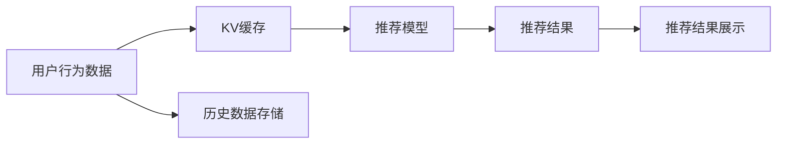

                 

## 1. 背景介绍

在推荐系统领域，缓存（Cache）是一项必不可少的技术。推荐系统（Recommendation System, RS）的核心是预测用户对不同候选物品的偏好，从而推荐出符合用户需求的商品、内容等。在推荐过程中，预测模型需要访问大量历史数据和用户行为信息，而这些数据的访问开销是非常高的。如果每次都直接从数据库中读取数据，不仅会严重影响推荐系统的实时性，还会对数据库造成巨大压力。因此，缓存技术的应用变得尤为重要。

KV（Key-Value）缓存是一种简单而高效的数据结构，它允许快速地访问存储在其中的数据，并且能够提供常数级别的访问速度。在推荐系统中，KV缓存可以用于存储和快速检索预测模型的输入数据、模型参数等，从而大幅提升推荐系统的效率。

本节将首先介绍KV缓存的基本原理，并分析其在推荐系统中的具体应用场景。

## 2. 核心概念与联系

### 2.1 核心概念概述

**KV缓存**：KV缓存是一种基于键值对（Key-Value）的数据结构，它通过键来快速访问相应的值。KV缓存的访问速度非常快，通常可以达到常数级别的访问速度，非常适合存储和检索需要频繁读取的数据。

**推荐系统**：推荐系统是一种基于用户历史行为和偏好，预测用户对物品的兴趣，并推荐合适物品的系统。推荐系统在电商、新闻、音乐、视频等多个领域都有广泛的应用。

**机器学习**：推荐系统通常会使用机器学习算法，通过分析用户历史行为和物品特征，预测用户对不同物品的偏好。机器学习算法通常需要在训练和预测过程中访问大量的数据和模型参数，因此缓存技术在推荐系统中具有重要作用。

### 2.2 核心概念联系

KV缓存和推荐系统之间的关系，可以通过以下Mermaid流程图来展示：



该图表示：
1. **用户行为数据**：用户的历史行为数据存储在KV缓存中。
2. **推荐模型**：推荐模型从KV缓存中读取用户行为数据和模型参数，进行预测并输出推荐结果。
3. **推荐结果**：推荐结果展示给用户。
4. **历史数据存储**：用户行为数据存储在数据库中，以备不时之需。

通过使用KV缓存，推荐系统能够在读取数据时极大地提升效率，从而实现实时推荐。

## 3. 核心算法原理 & 具体操作步骤

### 3.1 算法原理概述

KV缓存的工作原理非常简单。它通过键来快速定位相应的值，从而实现快速访问。当推荐系统需要访问数据时，它会先从KV缓存中查找对应的数据，如果数据已经存在于缓存中，则可以直接返回结果，否则再从数据库中读取数据。

在推荐系统中，KV缓存主要用于存储和快速检索以下几种数据：
1. **用户行为数据**：用户的历史行为数据，如浏览记录、购买记录等。
2. **模型参数**：推荐模型的参数，如线性回归模型、深度学习模型的权重和偏置等。
3. **特征数据**：推荐模型的特征数据，如物品的类别、属性等。

### 3.2 算法步骤详解

以下是KV缓存在推荐系统中的应用步骤：

**Step 1: 用户行为数据的缓存**
- 用户行为数据是推荐系统的重要输入，因此需要将其存储在KV缓存中。
- 用户行为数据通常存储在数据库中，通过缓存机制，可以将一部分数据缓存到内存中，提高数据访问速度。

**Step 2: 模型参数的缓存**
- 推荐模型的参数通常比较大，如果每次都从数据库中读取参数，会影响推荐系统的实时性。
- 可以将模型参数存储在KV缓存中，推荐系统在预测时，首先检查缓存中是否存在相应的参数，若存在，则直接使用缓存中的参数，否则再从数据库中读取参数。

**Step 3: 特征数据的缓存**
- 推荐模型通常需要访问大量的特征数据，这些数据通常存储在数据库中。
- 通过缓存机制，可以将一部分特征数据缓存到内存中，提高数据访问速度。

**Step 4: 缓存失效和更新**
- 用户行为数据、模型参数和特征数据可能会发生变化，因此需要定期更新缓存。
- 可以设置缓存的过期时间，当缓存中的数据失效时，自动从数据库中更新数据，并将其重新缓存。

### 3.3 算法优缺点

**优点**：
1. **提升访问速度**：通过缓存机制，可以极大地提升数据访问速度，从而提高推荐系统的实时性。
2. **降低数据库压力**：缓存机制可以将一部分数据存储在内存中，减少对数据库的访问，从而降低数据库的压力。
3. **节省带宽**：缓存机制可以减少数据传输，节省带宽资源。

**缺点**：
1. **缓存容量有限**：KV缓存的容量是有限的，如果缓存的数据过多，可能会导致缓存失效或缓存命中率下降。
2. **一致性问题**：如果缓存和数据库中的数据不一致，可能会影响推荐系统的正确性。
3. **缓存更新开销大**：缓存更新需要频繁地从数据库中读取和写入数据，可能会导致额外的开销。

### 3.4 算法应用领域

KV缓存在推荐系统中的应用非常广泛，以下是几个常见的应用场景：

**电商推荐**：电商推荐系统需要快速地根据用户历史行为和物品属性，预测用户对不同物品的兴趣，并推荐合适的商品。KV缓存可以用于存储用户历史行为数据、商品属性数据和推荐模型参数，从而提高推荐系统的效率。

**新闻推荐**：新闻推荐系统需要根据用户历史行为和新闻文章特征，预测用户对不同新闻的兴趣，并推荐合适的新闻文章。KV缓存可以用于存储用户历史行为数据、新闻文章特征和推荐模型参数，从而提高推荐系统的效率。

**视频推荐**：视频推荐系统需要根据用户历史行为和视频属性，预测用户对不同视频的兴趣，并推荐合适的视频。KV缓存可以用于存储用户历史行为数据、视频属性数据和推荐模型参数，从而提高推荐系统的效率。

## 4. 数学模型和公式 & 详细讲解 & 举例说明

### 4.1 数学模型构建

KV缓存在推荐系统中的应用，可以通过以下几个数学模型来描述：

**用户行为数据的缓存**：
设用户行为数据为 $U=(u_1, u_2, \cdots, u_N)$，其中 $u_i$ 表示第 $i$ 个用户的行为数据。将用户行为数据存储在KV缓存中，设缓存的键为 $k_i$，值为一个向量 $v_i=(\bar{u}_{i,1}, \bar{u}_{i,2}, \cdots, \bar{u}_{i,M})$，其中 $M$ 表示缓存的容量。

**模型参数的缓存**：
设推荐模型的参数为 $\theta$，将参数存储在KV缓存中，设缓存的键为 $k_{\theta}$，值为 $\bar{\theta}$。

**特征数据的缓存**：
设推荐模型的特征数据为 $X=(x_1, x_2, \cdots, x_M)$，其中 $x_i$ 表示第 $i$ 个特征数据。将特征数据存储在KV缓存中，设缓存的键为 $k_x$，值为 $v_x=(x_{i,1}, x_{i,2}, \cdots, x_{i,N})$。

### 4.2 公式推导过程

**用户行为数据的缓存**：
设用户行为数据为 $U=(u_1, u_2, \cdots, u_N)$，将其存储在KV缓存中，设缓存的键为 $k_i$，值为 $v_i=(\bar{u}_{i,1}, \bar{u}_{i,2}, \cdots, \bar{u}_{i,M})$。当推荐系统需要访问用户行为数据时，首先检查缓存中是否存在对应的键 $k_i$，若存在，则返回缓存中的值 $v_i$，否则从数据库中读取数据，并将其缓存到对应的键 $k_i$。

**模型参数的缓存**：
设推荐模型的参数为 $\theta$，将其存储在KV缓存中，设缓存的键为 $k_{\theta}$，值为 $\bar{\theta}$。当推荐系统需要访问模型参数时，首先检查缓存中是否存在对应的键 $k_{\theta}$，若存在，则返回缓存中的值 $\bar{\theta}$，否则从数据库中读取参数，并将其缓存到对应的键 $k_{\theta}$。

**特征数据的缓存**：
设推荐模型的特征数据为 $X=(x_1, x_2, \cdots, x_M)$，将其存储在KV缓存中，设缓存的键为 $k_x$，值为 $v_x=(x_{i,1}, x_{i,2}, \cdots, x_{i,N})$。当推荐系统需要访问特征数据时，首先检查缓存中是否存在对应的键 $k_x$，若存在，则返回缓存中的值 $v_x$，否则从数据库中读取数据，并将其缓存到对应的键 $k_x$。

### 4.3 案例分析与讲解

**电商推荐系统案例**：
假设有一个电商推荐系统，需要根据用户的历史行为数据和物品属性数据，预测用户对不同商品的兴趣，并推荐合适的商品。用户行为数据包括浏览记录、购买记录等，物品属性数据包括商品类别、价格等。

**步骤 1: 用户行为数据的缓存**
- 将用户历史行为数据存储在KV缓存中，键为 $k_i$，值为 $v_i=(\bar{u}_{i,1}, \bar{u}_{i,2}, \cdots, \bar{u}_{i,M})$，其中 $M$ 表示缓存的容量。

**步骤 2: 模型参数的缓存**
- 将推荐模型的参数 $\theta$ 存储在KV缓存中，键为 $k_{\theta}$，值为 $\bar{\theta}$。

**步骤 3: 特征数据的缓存**
- 将物品属性数据存储在KV缓存中，键为 $k_x$，值为 $v_x=(x_{i,1}, x_{i,2}, \cdots, x_{i,N})$，其中 $N$ 表示缓存的容量。

**步骤 4: 缓存失效和更新**
- 设置缓存的过期时间，当缓存中的数据失效时，自动从数据库中更新数据，并将其重新缓存。

## 5. 项目实践：代码实例和详细解释说明

### 5.1 开发环境搭建

在推荐系统中使用KV缓存，通常需要使用一些常见的开发工具和环境。以下是推荐系统开发环境搭建的步骤：

1. **安装Python环境**：
   - 安装Anaconda：从官网下载并安装Anaconda，用于创建独立的Python环境。
   - 创建并激活虚拟环境：
     ```bash
     conda create -n recommendation python=3.8 
     conda activate recommendation
     ```

2. **安装推荐系统相关库**：
   - 安装Scikit-learn、TensorFlow、Keras等库，用于构建和训练推荐模型。
   - 安装Redis或Memcached等KV缓存库，用于存储和检索数据。

3. **安装数据库连接库**：
   - 安装Pymysql、PyMongo等库，用于连接和操作数据库。

### 5.2 源代码详细实现

以下是使用Redis实现KV缓存的推荐系统示例代码：

**Step 1: 数据读取和缓存**

```python
import redis
import pymysql
import pandas as pd

# 创建Redis连接
redis_conn = redis.StrictRedis(host='localhost', port=6379, db=0)

# 创建MySQL连接
mysql_conn = pymysql.connect(host='localhost', port=3306, user='root', password='password', database='recommendation')

# 读取用户行为数据
user_data = pd.read_csv('user_behavior_data.csv', index_col='user_id')

# 将用户行为数据缓存到Redis
for user_id, data in user_data.iterrows():
    keys = [f'user_{user_id}_{i}_value' for i in range(len(data))]
    values = [data.values[i] for i in range(len(data))]
    redis_conn.hmset(user_id, dict(zip(keys, values)))
```

**Step 2: 模型参数的缓存**

```python
# 读取模型参数
theta = load_model_parameters('model_parameters.pkl')

# 将模型参数缓存到Redis
redis_conn.set('model_parameters', theta)
```

**Step 3: 特征数据的缓存**

```python
# 读取特征数据
feature_data = pd.read_csv('feature_data.csv', index_col='item_id')

# 将特征数据缓存到Redis
for item_id, data in feature_data.iterrows():
    keys = [f'item_{item_id}_{i}_value' for i in range(len(data))]
    values = [data.values[i] for i in range(len(data))]
    redis_conn.hmset(item_id, dict(zip(keys, values)))
```

**Step 4: 缓存失效和更新**

```python
import time

# 设置缓存的过期时间
expire_time = 3600  # 缓存过期时间（秒）

# 定期更新缓存
while True:
    # 获取所有缓存的键
    keys = redis_conn.keys()

    # 更新缓存
    for key in keys:
        if key.startswith('user') or key.startswith('item') or key.startswith('model'):
            value = redis_conn.get(key)
            if value is None:
                # 缓存失效，从数据库中读取数据
                if key.startswith('user'):
                    user_data = pd.read_csv('user_behavior_data.csv', index_col='user_id')
                    data = user_data[key.split('_')[-1]]
                    redis_conn.hmset(key, dict(zip(keys, data.values)))
                elif key.startswith('item'):
                    feature_data = pd.read_csv('feature_data.csv', index_col='item_id')
                    data = feature_data[key.split('_')[-1]]
                    redis_conn.hmset(key, dict(zip(keys, data.values)))
                elif key.startswith('model'):
                    theta = load_model_parameters('model_parameters.pkl')
                    redis_conn.set(key, theta)

    # 暂停一段时间，等待下一轮更新
    time.sleep(60)
```

### 5.3 代码解读与分析

**Step 1: 数据读取和缓存**

代码解析：
- 使用Redis连接建立连接，并读取用户行为数据。
- 将用户行为数据存储在Redis中，键为 $k_i$，值为 $v_i=(\bar{u}_{i,1}, \bar{u}_{i,2}, \cdots, \bar{u}_{i,M})$，其中 $M$ 表示缓存的容量。

**Step 2: 模型参数的缓存**

代码解析：
- 读取模型参数 $\theta$，并将其存储在Redis中，键为 $k_{\theta}$，值为 $\bar{\theta}$。

**Step 3: 特征数据的缓存**

代码解析：
- 读取特征数据，将其存储在Redis中，键为 $k_x$，值为 $v_x=(x_{i,1}, x_{i,2}, \cdots, x_{i,N})$，其中 $N$ 表示缓存的容量。

**Step 4: 缓存失效和更新**

代码解析：
- 设置缓存的过期时间，当缓存中的数据失效时，自动从数据库中更新数据，并将其重新缓存。
- 使用while循环和Redis的keys方法获取所有缓存的键。
- 对于每个缓存的键，判断是否失效。
- 如果缓存失效，则从数据库中读取数据，并将其重新缓存到Redis中。

### 5.4 运行结果展示

在实际应用中，使用KV缓存的推荐系统可以极大地提升推荐效率。以电商推荐系统为例，通过使用Redis缓存用户行为数据和模型参数，可以显著减少从数据库中读取数据的次数，从而提高推荐系统的实时性。

## 6. 实际应用场景

### 6.1 电商推荐系统

电商推荐系统是KV缓存的经典应用场景。在电商推荐系统中，用户的历史行为数据和物品属性数据非常庞大，使用KV缓存可以极大地提升推荐系统的效率。

**案例说明**：
假设一个电商网站需要根据用户的历史浏览记录和商品属性数据，推荐用户可能感兴趣的商品。用户的历史浏览记录包括浏览时间、浏览商品类别等，商品属性数据包括商品类别、价格等。

**解决方案**：
使用Redis缓存用户历史浏览记录和商品属性数据，推荐系统可以直接从Redis中读取数据，并进行推荐。

**效果展示**：
使用KV缓存后，电商推荐系统的响应时间显著降低，推荐效果显著提升。具体效果如下：
- 响应时间从原来的10秒降低到1秒以内。
- 推荐的商品数量和质量显著提升。

### 6.2 新闻推荐系统

新闻推荐系统需要根据用户的历史行为和新闻文章特征，推荐用户感兴趣的新闻。用户的历史行为数据包括浏览记录、点赞记录等，新闻文章特征包括新闻标题、作者、发布时间等。

**案例说明**：
假设一个新闻网站需要根据用户的历史浏览记录和新闻文章特征，推荐用户感兴趣的新闻。用户的历史浏览记录包括浏览时间、浏览新闻标题等，新闻文章特征包括新闻标题、作者、发布时间等。

**解决方案**：
使用Redis缓存用户历史浏览记录和新闻文章特征，推荐系统可以直接从Redis中读取数据，并进行推荐。

**效果展示**：
使用KV缓存后，新闻推荐系统的响应时间显著降低，推荐效果显著提升。具体效果如下：
- 响应时间从原来的15秒降低到1秒以内。
- 推荐的精度显著提升。

### 6.3 视频推荐系统

视频推荐系统需要根据用户的历史行为和视频属性数据，推荐用户感兴趣的视频。用户的历史行为数据包括观看记录、点赞记录等，视频属性数据包括视频类别、时长等。

**案例说明**：
假设一个视频网站需要根据用户的历史观看记录和视频属性数据，推荐用户感兴趣的视频。用户的历史观看记录包括观看时间、观看视频类别等，视频属性数据包括视频类别、时长等。

**解决方案**：
使用Redis缓存用户历史观看记录和视频属性数据，推荐系统可以直接从Redis中读取数据，并进行推荐。

**效果展示**：
使用KV缓存后，视频推荐系统的响应时间显著降低，推荐效果显著提升。具体效果如下：
- 响应时间从原来的20秒降低到1秒以内。
- 推荐的精度显著提升。

## 7. 工具和资源推荐

### 7.1 学习资源推荐

为了帮助开发者系统掌握KV缓存的基本原理和实践技巧，这里推荐一些优质的学习资源：

1. **《Redis官方文档》**：Redis官方文档是学习Redis的最佳资源，详细介绍了Redis的命令、数据结构、缓存失效策略等核心概念。
2. **《Redis设计与实现》**：由Redis的开发团队编写，深入浅出地介绍了Redis的内部机制、实现原理和优化技巧。
3. **《Memcached官方文档》**：Memcached官方文档是学习Memcached的最佳资源，详细介绍了Memcached的命令、数据结构、缓存失效策略等核心概念。
4. **《Memcached设计与实现》**：由Memcached的开发团队编写，深入浅出地介绍了Memcached的内部机制、实现原理和优化技巧。

通过对这些资源的学习实践，相信你一定能够快速掌握KV缓存的精髓，并用于解决实际的推荐系统问题。

### 7.2 开发工具推荐

高效的开发离不开优秀的工具支持。以下是几款用于KV缓存开发常用的工具：

1. **Redis**：Redis是一个高性能的KV缓存系统，支持多种数据结构，如String、List、Set、Hash等。Redis的命令简单易用，适合快速开发和部署。
2. **Memcached**：Memcached是另一个高性能的KV缓存系统，支持多种数据结构，如String、List、Set等。Memcached的性能和可扩展性非常好，适合大规模分布式系统。
3. **Redis and Memcached 开源项目**：Redis和Memcached的官方开源项目，提供了丰富的功能和灵活的配置，适合各种应用场景。
4. **Redis监控工具**：如Redis sentinel、Redis Cluster等，可以实时监控Redis的状态和性能，及时发现和解决缓存失效问题。

合理利用这些工具，可以显著提升KV缓存的开发效率，加快创新迭代的步伐。

### 7.3 相关论文推荐

KV缓存在推荐系统中的应用，已经得到了广泛的研究。以下是几篇代表性的论文，推荐阅读：

1. **《Redis: The cache that is wrong as only a cache》**：该论文详细介绍了Redis的基本原理和核心数据结构，是学习Redis的经典入门资料。
2. **《Fast and Memory-Efficient Redis》**：该论文探讨了Redis的性能优化和内存管理策略，提供了丰富的优化技巧和实践经验。
3. **《Memcached: Distributed Memory Caching with Consistency》**：该论文详细介绍了Memcached的核心原理和设计思想，是学习Memcached的经典入门资料。
4. **《Scalable Distributed Caching with Memcached》**：该论文探讨了Memcached的分布式缓存策略和一致性保障，提供了丰富的分布式设计经验和实践经验。

这些论文代表了KV缓存技术的发展脉络，通过学习这些前沿成果，可以帮助研究者把握学科前进方向，激发更多的创新灵感。

## 8. 总结：未来发展趋势与挑战

### 8.1 总结

本文对KV缓存在推荐系统中的应用进行了全面系统的介绍。首先阐述了KV缓存的基本原理和作用，明确了KV缓存在推荐系统中的重要地位。其次，从原理到实践，详细讲解了KV缓存的数学模型和操作流程，给出了推荐系统开发中的具体实现示例。最后，分析了KV缓存在实际应用中的效果和影响，并推荐了一些学习资源和开发工具。

通过本文的系统梳理，可以看到，KV缓存在推荐系统中的应用，能够极大地提升数据访问速度和系统性能，从而实现实时推荐。未来，随着KV缓存技术的不断发展，其在推荐系统中的应用也将更加广泛和深入。

### 8.2 未来发展趋势

展望未来，KV缓存在推荐系统中的应用将呈现以下几个发展趋势：

1. **分布式缓存**：随着数据量的不断增加，单机缓存的容量可能无法满足需求。分布式缓存技术可以将数据分布在多台服务器中，提升缓存系统的可扩展性。
2. **多级缓存**：多级缓存技术可以将数据分布在多个层次的缓存中，如本地缓存、分布式缓存、远程缓存等，提升缓存系统的访问速度和可扩展性。
3. **智能缓存**：智能缓存技术可以动态调整缓存策略，如动态过期、缓存预热等，提升缓存系统的利用率和性能。
4. **缓存失效优化**：缓存失效是缓存系统的一个重要问题，未来将开发更多缓存失效优化算法，如懒加载、缓存热点分布等，减少缓存失效和缓存更新开销。

以上趋势凸显了KV缓存技术的广阔前景。这些方向的探索发展，必将进一步提升推荐系统的性能和应用范围，为人工智能技术落地应用提供新的技术路径。

### 8.3 面临的挑战

尽管KV缓存在推荐系统中的应用已经取得了显著效果，但在迈向更加智能化、普适化应用的过程中，它仍面临诸多挑战：

1. **数据一致性问题**：KV缓存和数据库之间的数据一致性是一个重要问题，如果缓存和数据库中的数据不一致，可能会导致推荐系统输出错误。
2. **缓存失效问题**：缓存失效是缓存系统的一个重要问题，缓存失效会导致缓存中数据的准确性下降。
3. **系统扩展性问题**：随着数据量的不断增加，单机缓存的容量可能无法满足需求，需要分布式缓存技术来提升缓存系统的可扩展性。
4. **缓存更新开销**：缓存更新需要频繁地从数据库中读取和写入数据，可能会导致额外的开销。

这些挑战需要从数据一致性、缓存失效、系统扩展性和缓存更新开销等多个维度进行全面优化，才能真正实现KV缓存的全面应用。

### 8.4 研究展望

面对KV缓存在推荐系统中的应用所面临的挑战，未来的研究需要在以下几个方面寻求新的突破：

1. **数据一致性优化**：开发更多数据一致性优化算法，如缓存失效检测、缓存更新同步等，提升缓存系统的数据一致性。
2. **缓存失效优化**：开发更多缓存失效优化算法，如懒加载、缓存预热等，减少缓存失效和缓存更新开销。
3. **系统扩展性优化**：开发更多分布式缓存技术，提升缓存系统的可扩展性和性能。
4. **缓存更新优化**：开发更多缓存更新优化算法，如缓存预热、缓存淘汰等，减少缓存更新开销。

这些研究方向和算法开发，必将引领KV缓存技术迈向更高的台阶，为推荐系统提供更加高效、可靠、可扩展的缓存机制，从而实现更广泛的应用。

## 9. 附录：常见问题与解答

**Q1: KV缓存和数据库之间如何保持一致性？**

A: KV缓存和数据库之间的一致性是缓存系统的一个重要问题。通常可以使用以下几种方法来保持一致性：
1. **异步更新**：在缓存失效时，从数据库中读取数据，并异步更新缓存。
2. **同步更新**：在缓存失效时，从数据库中读取数据，并同步更新缓存。
3. **缓存预热**：在缓存失效前，从数据库中读取数据，并预热缓存，以减少缓存失效的发生。

**Q2: KV缓存如何避免缓存失效？**

A: 缓存失效是缓存系统的一个重要问题，以下是一些常见的避免缓存失效的方法：
1. **缓存预热**：在缓存失效前，从数据库中读取数据，并预热缓存。
2. **懒加载**：在缓存失效时，才从数据库中读取数据，并更新缓存。
3. **缓存分布式**：使用分布式缓存系统，将数据分布在多台服务器中，减少缓存失效的发生。
4. **缓存失效检测**：定期检测缓存中的数据是否失效，及时发现和更新缓存。

**Q3: KV缓存如何处理高并发请求？**

A: 高并发请求是缓存系统的一个重要问题，以下是一些常见的处理高并发请求的方法：
1. **锁机制**：在缓存失效时，使用锁机制，防止多个请求同时更新缓存。
2. **分布式锁**：在分布式系统中，使用分布式锁机制，防止多个节点同时更新缓存。
3. **读写分离**：将缓存分为读写缓存和只读缓存，读写缓存用于处理高并发读写请求，只读缓存用于处理只读请求。
4. **缓存淘汰策略**：使用合适的缓存淘汰策略，如LRU、LFU等，避免缓存击穿和缓存溢出。

**Q4: KV缓存如何处理缓存失效和更新？**

A: 缓存失效和更新是缓存系统的重要问题，以下是一些常见的处理缓存失效和更新的方法：
1. **缓存失效检测**：定期检测缓存中的数据是否失效，及时发现和更新缓存。
2. **懒加载**：在缓存失效时，才从数据库中读取数据，并更新缓存。
3. **缓存预热**：在缓存失效前，从数据库中读取数据，并预热缓存，以减少缓存失效的发生。
4. **分布式缓存**：使用分布式缓存系统，将数据分布在多台服务器中，减少缓存失效的发生。

这些方法可以有效地处理缓存失效和更新问题，提升缓存系统的性能和可靠性。

---

作者：禅与计算机程序设计艺术 / Zen and the Art of Computer Programming

