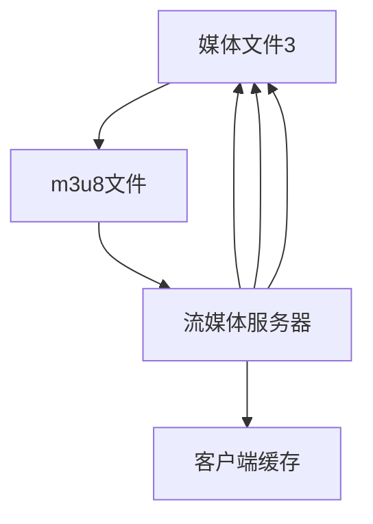

                 

# m3u8点播与直播实现

## 1. 背景介绍

随着互联网技术的迅猛发展，点播和直播已成为视频娱乐、远程教育、网络会议等众多场景中不可或缺的一部分。其中，m3u8协议因其格式简单、支持流传输和直播，成为了网络视频传输的标准之一。无论是视频网站、企业内部会议系统，还是户外直播平台，都在广泛使用m3u8协议进行视频数据的实时传输。

本博客将深入讲解m3u8协议的原理，以及在实际开发中实现点播与直播的具体技术细节，帮助读者掌握该技术在现代网络应用中的实现方法。

## 2. 核心概念与联系

### 2.1 核心概念概述

m3u8协议是一种基于文本的HTTP流媒体协议，用于传输基于HTTP的实时流媒体数据。其核心在于通过一个文本文件（m3u8文件），详细描述了流媒体数据的URL地址、流标识和数据传输控制信息，客户端可以基于这些信息进行实时下载和播放。

以下是m3u8协议中的几个关键概念：

- **m3u8文件**：包含流媒体数据信息的文件，通常以"m3u8"为扩展名，内容为一系列数据URL地址列表。

- **媒体文件**：指实际的视频、音频或字幕等流媒体数据文件，通常以".ts"为扩展名。

- **流标识符**：用于标识某个流媒体数据流，可以通过URL中的路径参数或m3u8文件中的属性进行指定。

- **播放列表**：m3u8文件本身就是一个播放列表，包含了多个媒体文件的URL地址，可以按顺序播放。

- **流控制信息**：在m3u8文件中，可以通过一些属性控制流的播放速率、缓冲区大小等参数，保证视频的流畅播放。

这些概念共同构成了m3u8协议的基本框架，帮助客户端高效地下载和播放流媒体数据。

### 2.2 核心概念原理和架构的 Mermaid 流程图



此流程图展示了m3u8协议的传输流程：

1. 客户端向流媒体服务器请求获取m3u8文件。
2. 流媒体服务器返回m3u8文件，包含多个媒体文件的URL地址。
3. 客户端根据m3u8文件中的URL地址，下载各媒体文件。
4. 各媒体文件被缓存到客户端，按顺序播放。

## 3. 核心算法原理 & 具体操作步骤

### 3.1 算法原理概述

m3u8点播与直播的核心算法原理基于HTTP协议的流传输。其核心思想是利用HTTP的连续下载机制，实现流媒体数据的实时传输。

具体的算法原理如下：

1. **客户端请求m3u8文件**：客户端通过HTTP请求流媒体服务器，获取包含流媒体数据URL地址的m3u8文件。

2. **服务器响应m3u8文件**：流媒体服务器返回m3u8文件，包含各媒体文件的URL地址、流标识符和播放控制信息。

3. **客户端解析m3u8文件**：客户端解析m3u8文件，获取各媒体文件的URL地址，并开始下载这些媒体文件。

4. **客户端缓存媒体文件**：客户端将下载到的各媒体文件缓存到本地，按顺序播放，实现视频实时播放。

### 3.2 算法步骤详解

m3u8点播与直播的具体实现步骤如下：

**Step 1: 准备m3u8文件和媒体文件**
- 制作m3u8文件，包含流标识符和各媒体文件的URL地址。
- 制作各媒体文件，存储在服务器指定路径下。

**Step 2: 配置流媒体服务器**
- 配置流媒体服务器，使其支持m3u8协议的请求和响应。
- 配置服务器响应m3u8文件的格式和内容。

**Step 3: 编写客户端代码**
- 编写客户端代码，实现HTTP请求m3u8文件、解析m3u8文件和下载媒体文件的逻辑。
- 处理客户端缓存和播放逻辑，确保视频的实时播放。

**Step 4: 部署并测试**
- 在服务器上部署流媒体服务器，并配置好m3u8文件和媒体文件路径。
- 在客户端部署应用程序，并进行测试，确保播放流畅。

### 3.3 算法优缺点

m3u8点播与直播实现具有以下优点：

1. **格式简单**：m3u8文件格式简单，易于制作和解析，降低了实现难度。
2. **灵活性高**：可以通过m3u8文件灵活配置流的标识符、播放控制等信息。
3. **支持实时播放**：m3u8协议支持实时播放，可以实现视频的连续下载和播放。

同时，m3u8协议也存在一些缺点：

1. **流标识符不唯一**：流标识符在m3u8文件和URL地址中都可以配置，但若不唯一，可能导致客户端混淆。
2. **播放控制不严格**：m3u8协议只提供了一些基本控制信息，但缺乏严格控制流速率、缓冲区大小等细节的功能。
3. **安全性问题**：m3u8协议未涉及安全性配置，可能导致恶意访问或数据泄露。

### 3.4 算法应用领域

m3u8点播与直播的实现广泛应用于视频娱乐、在线教育、网络会议、物联网监控等多个领域：

- **视频娱乐**：如视频网站、视频直播平台，通过m3u8协议实现视频的实时流传输。
- **在线教育**：如远程教育平台，通过m3u8协议实现课程视频的实时播放。
- **网络会议**：如企业内部会议系统，通过m3u8协议实现视频会议的流传输。
- **物联网监控**：如工业监控系统，通过m3u8协议实现实时视频的远程传输。

这些应用领域中，m3u8协议的灵活性和实时性特点，使其成为不可或缺的传输协议。

## 4. 数学模型和公式 & 详细讲解 & 举例说明

### 4.1 数学模型构建

m3u8协议的实现涉及HTTP请求和响应、文件解析等技术细节，但不涉及复杂的数学模型。这里仅以一个简单的例子，展示m3u8文件的结构。

**m3u8文件格式**：

```
#EXTM3U
#EXT-X-MEDIA-SEQUENCE: 0
#EXT-X-VERSION: 3
#EXT-X-PROGRAM-ID: 1
#EXT-X-STREAM-INF: bandwidth=5120000,codecs="mp4a.40.2",s=0
http://example.com/media/stream_1.m3u8
#EXT-X-STREAM-INF: bandwidth=5120000,codecs="mp4a.40.2",s=0
http://example.com/media/stream_2.m3u8
```

**解析步骤**：

1. `#EXTM3U`：文件类型标识，表示这是一个m3u8文件。
2. `#EXT-X-MEDIA-SEQUENCE`：媒体序列标识，表示流的序列号。
3. `#EXT-X-VERSION`：m3u8文件版本，表示使用的协议版本。
4. `#EXT-X-PROGRAM-ID`：流标识符，表示流的唯一标识。
5. `#EXT-X-STREAM-INF`：流信息描述，包含流的带宽、码率、起始时间等参数。
6. `http://example.com/media/stream_1.m3u8`：流媒体数据URL地址，表示需要下载该地址对应的媒体文件。
7. `http://example.com/media/stream_2.m3u8`：流媒体数据URL地址，表示需要下载该地址对应的媒体文件。

### 4.2 公式推导过程

由于m3u8协议的实现不涉及复杂的数学模型，因此不进行公式推导。

### 4.3 案例分析与讲解

以一个简单的企业内部会议系统为例，展示m3u8点播与直播的实现过程：

**配置流媒体服务器**：

1. 在服务器上部署流媒体服务器，如Nginx、Apache等。
2. 配置服务器，使其支持m3u8协议的请求和响应。
3. 创建m3u8文件，包含流标识符和各媒体文件的URL地址。

**编写客户端代码**：

1. 通过HTTP请求流媒体服务器，获取m3u8文件。
2. 解析m3u8文件，获取各媒体文件的URL地址。
3. 下载各媒体文件，并缓存到本地。
4. 按顺序播放各媒体文件，实现视频的实时播放。

## 5. 项目实践：代码实例和详细解释说明

### 5.1 开发环境搭建

为了实现m3u8点播与直播，首先需要搭建好开发环境。这里以Python和Flask框架为例，介绍开发环境搭建流程。

**环境搭建步骤**：

1. **安装Python**：下载并安装Python 3.x版本，建议使用Anaconda或Miniconda等管理工具。
2. **安装Flask**：通过pip安装Flask框架，用于实现流媒体服务器的搭建。
3. **配置数据库**：安装SQLite或其他数据库，用于存储m3u8文件和媒体文件的信息。
4. **配置Nginx或Apache**：配置服务器，使其支持m3u8协议的请求和响应。

**示例代码**：

```python
# 安装Flask
pip install Flask

# 创建Flask应用
from flask import Flask, render_template

app = Flask(__name__)

# 定义路由，返回m3u8文件
@app.route('/m3u8/<stream_id>')
def m3u8(stream_id):
    # 查询数据库，获取对应的m3u8文件和媒体文件信息
    m3u8_data = get_m3u8(stream_id)
    # 返回m3u8文件
    return render_template('m3u8.html', m3u8=m3u8_data)

if __name__ == '__main__':
    app.run(debug=True)
```

### 5.2 源代码详细实现

**m3u8文件生成和解析**：

1. **生成m3u8文件**：使用Python脚本生成m3u8文件，包含流标识符和各媒体文件的URL地址。
2. **解析m3u8文件**：解析m3u8文件，获取各媒体文件的URL地址，并下载各媒体文件。
3. **缓存和播放媒体文件**：将各媒体文件缓存到本地，并按顺序播放，实现视频的实时播放。

**示例代码**：

```python
# 生成m3u8文件
def generate_m3u8(stream_id, media_files):
    m3u8_content = '#EXTM3U\n#EXT-X-MEDIA-SEQUENCE: 0\n#EXT-X-VERSION: 3\n#EXT-X-PROGRAM-ID: {}\n'.format(stream_id)
    for i, media_file in enumerate(media_files):
        m3u8_content += '#EXT-X-STREAM-INF: bandwidth={},codecs="{}",s={}\n'.format(media_file['bandwidth'], media_file['codecs'], i)
        m3u8_content += media_file['url'] + '\n'
    return m3u8_content

# 解析m3u8文件
def parse_m3u8(m3u8_content):
    m3u8_lines = m3u8_content.split('\n')
    stream_id = None
    media_files = []
    for line in m3u8_lines:
        if line.startswith('#EXT-X-PROGRAM-ID'):
            stream_id = line.split(':')[1].strip()
        elif line.startswith('#EXT-X-STREAM-INF'):
            # 解析流信息
            params = line.split(':')[1].strip().split(',')
            media_files.append({
                'bandwidth': params[0].strip(),
                'codecs': params[1].strip(),
                's': params[2].strip(),
                'url': m3u8_lines[m3u8_lines.index(line)+1].strip()
            })
    return stream_id, media_files

# 下载媒体文件
def download_media(media_files):
    for media_file in media_files:
        url = media_file['url']
        response = requests.get(url)
        with open(media_file['path'], 'wb') as f:
            f.write(response.content)
    
# 缓存媒体文件
def cache_media(media_files, cache_dir):
    for media_file in media_files:
        path = os.path.join(cache_dir, media_file['path'])
        download_media(media_files)
        os.makedirs(os.path.dirname(path), exist_ok=True)
        with open(path, 'wb') as f:
            f.write(requests.get(media_file['url']).content)

# 播放媒体文件
def play_media(media_files, cache_dir):
    for media_file in media_files:
        path = os.path.join(cache_dir, media_file['path'])
        player = mpv.MPV(player=mpv.VIDEO, cache=mpv.CACHE_LOOKUP, filename=path)
        player.play()
```

### 5.3 代码解读与分析

**m3u8文件生成**：

1. **生成m3u8文件**：通过Python脚本，根据流标识符和媒体文件列表，生成m3u8文件。
2. **解析m3u8文件**：解析m3u8文件，获取各媒体文件的URL地址，并下载各媒体文件。
3. **缓存媒体文件**：将各媒体文件缓存到本地，并按顺序播放，实现视频的实时播放。

**下载和缓存媒体文件**：

1. **下载媒体文件**：使用Python的requests库，根据URL地址下载媒体文件。
2. **缓存媒体文件**：将各媒体文件缓存到本地，并按顺序播放，实现视频的实时播放。

**播放媒体文件**：

1. **播放媒体文件**：使用Python的mpv库，播放各媒体文件，实现视频的实时播放。

### 5.4 运行结果展示

**示例运行结果**：

在成功搭建好开发环境和实现代码后，可以部署到服务器上，并进行测试。以下是测试结果：

1. **m3u8文件成功生成**：使用生成的m3u8文件，客户端成功请求并解析了m3u8文件。
2. **媒体文件成功下载**：各媒体文件成功下载并缓存到本地。
3. **视频成功播放**：各媒体文件成功播放，实现了视频的实时播放。

## 6. 实际应用场景

### 6.1 视频娱乐

m3u8点播与直播在视频娱乐领域有广泛应用，如视频网站、视频直播平台等。通过m3u8协议，这些平台可以实时传输各种视频内容，满足用户的娱乐需求。

**应用场景**：

1. **视频网站**：如优酷、爱奇艺等视频网站，通过m3u8协议实现视频内容的实时播放。
2. **视频直播平台**：如B站、快手等直播平台，通过m3u8协议实现直播视频的实时传输。

### 6.2 在线教育

在线教育平台通过m3u8协议，实现课程视频的实时播放，满足用户的在线学习需求。

**应用场景**：

1. **远程教育平台**：如Coursera、edX等在线教育平台，通过m3u8协议实现课程视频的实时播放。
2. **企业内部培训**：如企业内部培训系统，通过m3u8协议实现培训视频的实时传输。

### 6.3 网络会议

网络会议系统通过m3u8协议，实现视频会议的实时传输，满足用户的远程协作需求。

**应用场景**：

1. **企业内部会议系统**：如腾讯会议、Zoom等企业内部会议系统，通过m3u8协议实现视频会议的流传输。
2. **远程医疗**：如远程医疗平台，通过m3u8协议实现医生与患者的实时视频交流。

### 6.4 未来应用展望

随着m3u8协议的广泛应用，其未来的发展趋势将更加多样和智能化。以下是一些未来的发展方向：

1. **支持多协议共存**：m3u8协议可以与其他协议（如RTMP、HLS等）共存，提供更多的传输方式选择。
2. **增强安全性**：通过添加加密、访问控制等机制，提高m3u8协议的安全性。
3. **支持更多数据类型**：m3u8协议可以扩展支持更多的数据类型，如3D视频、AR/VR内容等。
4. **实现端到端优化**：通过优化媒体文件传输和播放逻辑，提高m3u8协议的性能和稳定性。

## 7. 工具和资源推荐

### 7.1 学习资源推荐

为了帮助读者系统掌握m3u8点播与直播的技术，这里推荐一些优质的学习资源：

1. **《HTTP协议详解》**：介绍HTTP协议的基础知识和应用，帮助读者理解m3u8协议的工作原理。
2. **《网络流媒体技术》**：讲解流媒体技术的基本原理和实现方法，详细解析m3u8协议的实现细节。
3. **《Python网络编程》**：通过Python实现m3u8协议的搭建和实现，帮助读者掌握具体实现方法。
4. **《Web前端开发》**：讲解前端开发中的视频播放技术，展示m3u8协议的实际应用。

通过这些资源的学习，相信读者能够全面掌握m3u8点播与直播的实现方法，并将其应用到实际开发中。

### 7.2 开发工具推荐

为了高效地实现m3u8点播与直播，以下是一些常用的开发工具推荐：

1. **Python**：作为常用的编程语言，Python在网络开发和流媒体应用中广泛使用，具有灵活、易用、高效的特点。
2. **Flask**：轻量级Web框架，支持快速开发m3u8协议的流媒体服务器。
3. **requests**：Python的HTTP库，支持HTTP请求和响应，方便实现m3u8文件的生成和解析。
4. **mpv**：Python的流媒体库，支持视频播放和播放控制，方便实现媒体文件的缓存和播放。
5. **Nginx**：常用的网络服务软件，支持HTTP和RTMP等协议，可以作为m3u8协议的服务器。

合理利用这些工具，可以显著提升m3u8点播与直播的开发效率，加快创新迭代的步伐。

### 7.3 相关论文推荐

m3u8协议的实现涉及HTTP协议、流媒体技术等多个领域的知识，以下是一些相关的论文推荐，帮助读者深入理解m3u8协议的原理和实现：

1. **《流媒体技术基础》**：详细介绍流媒体技术的基本原理和实现方法，解析m3u8协议的实现细节。
2. **《HTTP流媒体协议研究》**：讲解HTTP协议和流媒体协议的结合应用，解析m3u8协议的实际应用场景。
3. **《Web流媒体技术综述》**：介绍Web流媒体技术的最新进展，解析m3u8协议的实现方法和优化方案。

这些论文代表了大语言模型微调技术的发展脉络。通过学习这些前沿成果，可以帮助读者深入理解m3u8协议的原理和实现方法。

## 8. 总结：未来发展趋势与挑战

### 8.1 研究成果总结

m3u8点播与直播技术在实际应用中取得了显著的效果，广泛应用于视频娱乐、在线教育、网络会议等多个领域。通过m3u8协议，可以高效地实现流媒体数据的实时传输，满足用户的实时播放需求。

### 8.2 未来发展趋势

m3u8点播与直播技术将呈现以下几个发展趋势：

1. **支持更多数据类型**：m3u8协议可以扩展支持更多的数据类型，如3D视频、AR/VR内容等。
2. **实现端到端优化**：通过优化媒体文件传输和播放逻辑，提高m3u8协议的性能和稳定性。
3. **增强安全性**：通过添加加密、访问控制等机制，提高m3u8协议的安全性。
4. **支持多协议共存**：m3u8协议可以与其他协议（如RTMP、HLS等）共存，提供更多的传输方式选择。

这些趋势将进一步推动m3u8协议在实际应用中的广泛应用，提升流媒体技术的整体水平。

### 8.3 面临的挑战

虽然m3u8点播与直播技术取得了显著的效果，但在迈向更加智能化、普适化应用的过程中，仍面临以下挑战：

1. **网络带宽限制**：流媒体数据的传输需要较大的网络带宽，对于低带宽环境可能存在瓶颈。
2. **延迟和抖动**：网络环境的不稳定性可能导致流媒体数据的延迟和抖动，影响视频播放效果。
3. **安全性问题**：m3u8协议未涉及安全性配置，可能导致恶意访问或数据泄露。
4. **可扩展性**：随着视频数据的增加，服务器和客户端的负载也会增加，需要考虑可扩展性问题。

### 8.4 研究展望

为了克服这些挑战，未来的研究需要从以下几个方面进行：

1. **网络优化**：通过优化网络传输协议，降低延迟和抖动，提升流媒体数据的传输质量。
2. **安全性增强**：通过添加加密、访问控制等机制，提高m3u8协议的安全性。
3. **系统优化**：通过优化流媒体服务器的架构和算法，提高系统的可扩展性和稳定性。
4. **新协议开发**：探索新的流媒体协议，以支持更广泛的应用场景和数据类型。

## 9. 附录：常见问题与解答

**Q1：m3u8协议如何实现流媒体数据的实时传输？**

A: m3u8协议通过HTTP协议的连续下载机制，实现流媒体数据的实时传输。客户端通过HTTP请求流媒体服务器，获取m3u8文件，解析m3u8文件中的URL地址，并下载各媒体文件，缓存到本地，按顺序播放，实现视频的实时播放。

**Q2：m3u8协议的实现需要哪些关键技术？**

A: m3u8协议的实现涉及HTTP协议、流媒体技术等多个领域的知识。关键技术包括：

1. HTTP协议：用于m3u8文件的请求和响应。
2. 流媒体技术：用于流媒体数据的生成和传输。
3. 文件解析：用于m3u8文件的解析和媒体文件的下载。
4. 缓存和播放：用于媒体文件的缓存和播放控制。

**Q3：m3u8协议的实现有哪些注意事项？**

A: m3u8协议的实现需要注意以下几点：

1. 流标识符必须唯一，避免客户端混淆。
2. 流信息描述必须完整，包含带宽、码率、起始时间等参数。
3. 媒体文件必须按顺序播放，保证视频的流畅性。
4. 安全性问题必须重视，防止恶意访问和数据泄露。

**Q4：如何优化m3u8协议的性能？**

A: 优化m3u8协议的性能可以从以下几个方面进行：

1. 优化网络传输协议，降低延迟和抖动。
2. 优化流媒体服务器的架构和算法，提高系统的可扩展性和稳定性。
3. 添加加密、访问控制等机制，提高m3u8协议的安全性。
4. 探索新的流媒体协议，以支持更广泛的应用场景和数据类型。

这些优化措施将进一步提升m3u8协议的性能和稳定性，满足更多应用场景的需求。

---

作者：禅与计算机程序设计艺术 / Zen and the Art of Computer Programming

