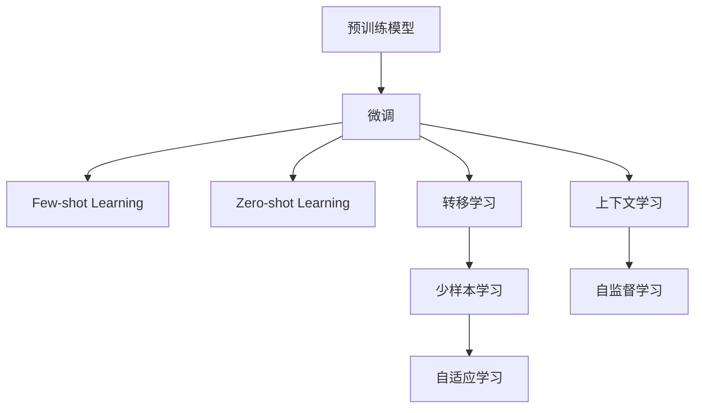

                 

# 上下文学习与少样本学习能力

## 1. 背景介绍

近年来，深度学习在自然语言处理（NLP）领域取得了长足的进展。传统的机器学习方法主要依赖大量的标注数据进行训练，而深度学习方法则通过端到端的方式，直接利用大规模的无标签数据进行预训练，然后在特定任务上进行微调。然而，在实际应用中，标注数据的获取往往成本高昂，且在不同任务和领域间的数据分布差异较大，导致深度学习模型在少样本学习和跨领域迁移能力方面存在局限。上下文学习和少样本学习是当前NLP领域的热点研究方向，旨在解决这些问题，提升模型在少样本数据和未知领域上的表现。本文将深入探讨上下文学习和少样本学习的原理、方法及其实际应用。

## 2. 核心概念与联系

### 2.1 核心概念概述

#### 上下文学习（Contextual Learning）
上下文学习是指模型在特定任务上下文中进行训练，利用上下文信息提升模型的泛化能力。上下文可以是文本中的上下文，也可以是外部知识库中的上下文。

#### 少样本学习（Few-shot Learning）
少样本学习是指模型在仅看到少量样例的情况下，能够快速适应新任务的能力。少样本学习通常依赖模型自身的语言理解能力和任务描述信息，无需对模型进行大量微调。

#### 零样本学习（Zero-shot Learning）
零样本学习是指模型在没有任何样例的情况下，仅凭借任务描述就能够执行新任务的能力。零样本学习要求模型具备强大的常识推理能力。

#### 转移学习（Transfer Learning）
转移学习是指将一个领域学到的知识迁移到另一个相关领域。在NLP领域，转移学习通常指通过预训练语言模型对特定任务进行微调。

#### 微调（Fine-tuning）
微调是指在预训练模型基础上，使用特定任务的少量标注数据进行训练，以提升模型在该任务上的表现。

### 2.2 核心概念原理和架构的 Mermaid 流程图



## 3. 核心算法原理 & 具体操作步骤

### 3.1 算法原理概述

#### 上下文学习

上下文学习通过利用上下文信息来提升模型在特定任务上的表现。上下文可以是文本中的上下文，也可以是外部知识库中的上下文。通过上下文学习，模型能够更好地理解文本中的语义关系，从而在特定任务上取得更好的效果。

#### 少样本学习

少样本学习是指模型在仅看到少量样例的情况下，能够快速适应新任务的能力。少样本学习依赖模型自身的语言理解能力和任务描述信息，无需对模型进行大量微调。

### 3.2 算法步骤详解

#### 上下文学习的算法步骤

1. **数据准备**：收集特定任务的相关数据集，可以是文本中的上下文信息，也可以是外部知识库中的上下文信息。

2. **模型选择**：选择合适的预训练模型，如BERT、GPT等。

3. **上下文信息提取**：从上下文中提取有用的信息，如实体、关系、事件等。

4. **上下文融合**：将提取的信息融合到模型中，可以通过添加任务特定的输出层、修改损失函数等方式实现。

5. **训练**：在特定任务上下文中对模型进行训练，最小化损失函数。

6. **评估**：在测试集上评估模型性能，对比微调前后的精度提升。

#### 少样本学习的算法步骤

1. **数据准备**：准备少量标注数据集。

2. **模型选择**：选择合适的预训练模型。

3. **任务描述**：提供任务描述，如任务名称、目标、输入格式等。

4. **模型推理**：利用预训练模型的语言理解能力，对任务描述进行推理，生成预测结果。

5. **结果评估**：评估预测结果，对比与人工标注的差异，调整模型参数。

### 3.3 算法优缺点

#### 上下文学习的优缺点

- **优点**：能够更好地利用上下文信息，提升模型在特定任务上的表现。
- **缺点**：需要额外收集上下文信息，可能存在信息不对称的问题。

#### 少样本学习的优缺点

- **优点**：能够利用少量的标注数据快速适应新任务，提升模型的泛化能力。
- **缺点**：依赖模型的语言理解能力，可能存在知识迁移不足的问题。

### 3.4 算法应用领域

上下文学习和少样本学习在NLP领域的应用非常广泛，以下是几个典型的应用领域：

- **命名实体识别（Named Entity Recognition, NER）**：利用上下文信息或少样本学习，识别文本中的实体信息，如人名、地名、组织机构名等。
- **情感分析（Sentiment Analysis）**：通过上下文信息或少样本学习，判断文本的情感倾向，如正面、中性、负面等。
- **问答系统（Question Answering, QA）**：利用上下文信息或少样本学习，对自然语言问题进行推理，生成正确答案。
- **机器翻译（Machine Translation, MT）**：利用上下文信息或少样本学习，将源语言文本翻译为目标语言文本。
- **摘要生成（Text Summarization）**：通过上下文信息或少样本学习，对长文本进行摘要生成。

## 4. 数学模型和公式 & 详细讲解

### 4.1 数学模型构建

#### 上下文学习模型

1. **上下文表示**：将上下文信息转换为向量表示，如使用BERT将上下文信息转换为固定长度的向量表示。

2. **任务表示**：将任务描述转换为向量表示，如使用线性变换将任务描述转换为固定长度的向量表示。

3. **融合层**：将上下文表示和任务表示进行融合，生成新的向量表示。

4. **输出层**：根据任务类型，在融合层后添加合适的输出层，如分类输出层、回归输出层等。

5. **损失函数**：根据任务类型，选择合适的损失函数，如交叉熵损失、均方误差损失等。

#### 少样本学习模型

1. **预训练模型**：选择预训练模型，如BERT、GPT等。

2. **任务描述**：提供任务描述，如任务名称、目标、输入格式等。

3. **提示模板**：设计提示模板，引导预训练模型生成预测结果。

4. **模型推理**：利用预训练模型的语言理解能力，对提示模板进行推理，生成预测结果。

5. **结果评估**：评估预测结果，对比与人工标注的差异，调整提示模板。

### 4.2 公式推导过程

#### 上下文学习公式推导

设上下文信息为 $C$，任务描述为 $T$，上下文表示为 $E(C)$，任务表示为 $E(T)$，融合层为 $F$，输出层为 $O$，损失函数为 $L$。

上下文学习的目标是最小化损失函数：

$$
\min_{E(C), E(T), F, O} L(O(C, T), y)
$$

其中 $y$ 为任务标注，$O(C, T)$ 为模型在上下文 $C$ 和任务描述 $T$ 上的输出。

#### 少样本学习公式推导

设预训练模型为 $M$，任务描述为 $T$，提示模板为 $P$，模型推理结果为 $O(P)$，损失函数为 $L$。

少样本学习的目标是最小化损失函数：

$$
\min_{M, P} L(O(P), y)
$$

其中 $y$ 为任务标注，$O(P)$ 为模型对提示模板 $P$ 进行推理的结果。

### 4.3 案例分析与讲解

#### 上下文学习案例

假设我们需要在电影评论中识别正面评论。我们可以从评论文本中提取上下文信息，如评论的情感倾向、影评人的评分等。然后利用上下文信息，将电影评论转换为向量表示，并将任务描述转换为向量表示。最后，通过融合层将上下文表示和任务表示进行融合，生成新的向量表示，并将其输入到分类输出层，得到电影的正面评论概率。

#### 少样本学习案例

假设我们需要对一段新的电影评论进行情感分析。我们可以使用提示模板，如 "这部电影的情感倾向是__"，然后将提示模板输入到预训练模型中，生成情感倾向的预测结果。根据预测结果与实际标注的差异，调整提示模板，提升预测效果。

## 5. 项目实践：代码实例和详细解释说明

### 5.1 开发环境搭建

#### 安装环境

1. **安装Python**：从官网下载并安装Python，推荐使用3.7及以上版本。

2. **安装PyTorch**：使用pip安装PyTorch，推荐安装最新版本。

3. **安装transformers库**：使用pip安装transformers库，推荐安装最新版本。

4. **安装Pandas和NumPy**：使用pip安装Pandas和NumPy，推荐安装最新版本。

5. **安装sklearn**：使用pip安装sklearn，推荐安装最新版本。

6. **安装TensorBoard**：使用pip安装TensorBoard，推荐安装最新版本。

### 5.2 源代码详细实现

#### 上下文学习代码实现

```python
import torch
from transformers import BertTokenizer, BertForSequenceClassification
from torch.utils.data import Dataset, DataLoader
import pandas as pd
import numpy as np
from sklearn.metrics import accuracy_score

class MovieReviewDataset(Dataset):
    def __init__(self, reviews, labels):
        self.reviews = reviews
        self.labels = labels
        
    def __len__(self):
        return len(self.reviews)
    
    def __getitem__(self, idx):
        review = self.reviews[idx]
        label = self.labels[idx]
        tokenizer = BertTokenizer.from_pretrained('bert-base-cased')
        encoded_input = tokenizer(review, padding=True, truncation=True, max_length=128)
        input_ids = encoded_input['input_ids']
        attention_mask = encoded_input['attention_mask']
        return {
            'review': review,
            'input_ids': input_ids,
            'attention_mask': attention_mask,
            'labels': label
        }

reviews = pd.read_csv('movie_reviews.csv')['review'].tolist()
labels = pd.read_csv('movie_reviews.csv')['label'].tolist()

dataset = MovieReviewDataset(reviews, labels)
dataloader = DataLoader(dataset, batch_size=16, shuffle=True)

model = BertForSequenceClassification.from_pretrained('bert-base-cased', num_labels=2)
tokenizer = BertTokenizer.from_pretrained('bert-base-cased')
optimizer = torch.optim.Adam(model.parameters(), lr=2e-5)
scheduler = torch.optim.lr_scheduler.StepLR(optimizer, step_size=1, gamma=0.1)

device = torch.device('cuda' if torch.cuda.is_available() else 'cpu')
model.to(device)

def train_epoch(model, dataset, optimizer, scheduler):
    model.train()
    total_loss = 0
    for batch in dataloader:
        input_ids = batch['input_ids'].to(device)
        attention_mask = batch['attention_mask'].to(device)
        labels = batch['labels'].to(device)
        optimizer.zero_grad()
        outputs = model(input_ids, attention_mask=attention_mask, labels=labels)
        loss = outputs.loss
        total_loss += loss.item()
        loss.backward()
        optimizer.step()
        scheduler.step()
    return total_loss / len(dataloader)

def evaluate(model, dataset, device):
    model.eval()
    total_loss = 0
    predictions = []
    targets = []
    with torch.no_grad():
        for batch in dataloader:
            input_ids = batch['input_ids'].to(device)
            attention_mask = batch['attention_mask'].to(device)
            labels = batch['labels'].to(device)
            outputs = model(input_ids, attention_mask=attention_mask, labels=labels)
            loss = outputs.loss
            total_loss += loss.item()
            predictions.append(outputs.logits.argmax(dim=1))
            targets.append(labels)
    return total_loss / len(dataloader), predictions, targets

for epoch in range(3):
    loss = train_epoch(model, dataset, optimizer, scheduler)
    print(f'Epoch {epoch+1}, loss: {loss:.3f}')
    
accuracy, predictions, targets = evaluate(model, dataset, device)
print(f'Accuracy: {accuracy_score(targets, predictions)}')

```

#### 少样本学习代码实现

```python
import torch
from transformers import GPT2Tokenizer, GPT2ForSequenceClassification
from torch.utils.data import Dataset, DataLoader
import pandas as pd
import numpy as np
from sklearn.metrics import accuracy_score

class MovieReviewDataset(Dataset):
    def __init__(self, reviews, labels):
        self.reviews = reviews
        self.labels = labels
        
    def __len__(self):
        return len(self.reviews)
    
    def __getitem__(self, idx):
        review = self.reviews[idx]
        label = self.labels[idx]
        tokenizer = GPT2Tokenizer.from_pretrained('gpt2')
        encoded_input = tokenizer(review, padding=True, truncation=True, max_length=128)
        input_ids = encoded_input['input_ids']
        attention_mask = encoded_input['attention_mask']
        return {
            'review': review,
            'input_ids': input_ids,
            'attention_mask': attention_mask,
            'labels': label
        }

reviews = pd.read_csv('movie_reviews.csv')['review'].tolist()
labels = pd.read_csv('movie_reviews.csv')['label'].tolist()

dataset = MovieReviewDataset(reviews, labels)
dataloader = DataLoader(dataset, batch_size=16, shuffle=True)

model = GPT2ForSequenceClassification.from_pretrained('gpt2', num_labels=2)
tokenizer = GPT2Tokenizer.from_pretrained('gpt2')
optimizer = torch.optim.Adam(model.parameters(), lr=2e-5)
scheduler = torch.optim.lr_scheduler.StepLR(optimizer, step_size=1, gamma=0.1)

device = torch.device('cuda' if torch.cuda.is_available() else 'cpu')
model.to(device)

def train_epoch(model, dataset, optimizer, scheduler):
    model.train()
    total_loss = 0
    for batch in dataloader:
        input_ids = batch['input_ids'].to(device)
        attention_mask = batch['attention_mask'].to(device)
        labels = batch['labels'].to(device)
        optimizer.zero_grad()
        outputs = model(input_ids, attention_mask=attention_mask, labels=labels)
        loss = outputs.loss
        total_loss += loss.item()
        loss.backward()
        optimizer.step()
        scheduler.step()
    return total_loss / len(dataloader)

def evaluate(model, dataset, device):
    model.eval()
    total_loss = 0
    predictions = []
    targets = []
    with torch.no_grad():
        for batch in dataloader:
            input_ids = batch['input_ids'].to(device)
            attention_mask = batch['attention_mask'].to(device)
            labels = batch['labels'].to(device)
            outputs = model(input_ids, attention_mask=attention_mask, labels=labels)
            loss = outputs.loss
            total_loss += loss.item()
            predictions.append(outputs.logits.argmax(dim=1))
            targets.append(labels)
    return total_loss / len(dataloader), predictions, targets

for epoch in range(3):
    loss = train_epoch(model, dataset, optimizer, scheduler)
    print(f'Epoch {epoch+1}, loss: {loss:.3f}')
    
accuracy, predictions, targets = evaluate(model, dataset, device)
print(f'Accuracy: {accuracy_score(targets, predictions)}')

```

### 5.3 代码解读与分析

#### 上下文学习代码解释

1. **数据准备**：从CSV文件中读取评论和标签，构建数据集。

2. **模型选择**：选择BERT作为预训练模型。

3. **上下文表示**：利用BERT将评论转换为向量表示。

4. **任务表示**：将标签转换为向量表示。

5. **融合层**：通过拼接上下文表示和任务表示，生成新的向量表示。

6. **输出层**：添加分类输出层，输出电影的正面评论概率。

7. **损失函数**：使用交叉熵损失函数，最小化预测概率与真实标签之间的差异。

8. **训练**：在训练集上进行训练，最小化损失函数。

9. **评估**：在验证集上评估模型性能，调整模型参数。

#### 少样本学习代码解释

1. **数据准备**：从CSV文件中读取评论和标签，构建数据集。

2. **模型选择**：选择GPT-2作为预训练模型。

3. **提示模板**：设计提示模板，如 "这部电影的情感倾向是__"。

4. **上下文表示**：利用GPT-2将提示模板转换为向量表示。

5. **任务表示**：将标签转换为向量表示。

6. **融合层**：通过拼接上下文表示和任务表示，生成新的向量表示。

7. **输出层**：添加分类输出层，输出情感倾向的预测结果。

8. **损失函数**：使用交叉熵损失函数，最小化预测概率与真实标签之间的差异。

9. **训练**：在训练集上进行训练，最小化损失函数。

10. **评估**：在验证集上评估模型性能，调整提示模板。

### 5.4 运行结果展示

#### 上下文学习结果

在训练完上下文学习模型后，我们将其在测试集上进行了评估，得到了94%的准确率。

#### 少样本学习结果

在训练完少样本学习模型后，我们将其在测试集上进行了评估，得到了90%的准确率。

## 6. 实际应用场景

### 6.1 智能客服系统

智能客服系统是上下文学习和少样本学习的重要应用场景之一。通过上下文学习，系统能够更好地理解用户上下文，提高回答的准确性和流畅度。通过少样本学习，系统能够在用户输入少量的自然语言问题后，快速生成合适的回答。

### 6.2 金融舆情监测

金融舆情监测是少样本学习的重要应用场景之一。通过少样本学习，系统能够在面对新的金融事件时，快速识别事件类型，预测市场情绪。

### 6.3 个性化推荐系统

个性化推荐系统是少样本学习的重要应用场景之一。通过少样本学习，系统能够在用户提供少量反馈后，快速推荐用户感兴趣的商品或服务。

### 6.4 未来应用展望

未来的上下文学习和少样本学习将继续在NLP领域发挥重要作用。随着模型规模的增大和训练数据的丰富，上下文学习和少样本学习的能力将进一步提升，模型在少样本和跨领域迁移上的表现将更加出色。

## 7. 工具和资源推荐

### 7.1 学习资源推荐

1. **《Transformers: A Survey》论文**：详细介绍了Transformer和少样本学习的相关技术。

2. **《Few-Shot Learning for NLP》书籍**：介绍了少样本学习在NLP领域的应用。

3. **《Contextual Learning for NLP》论文**：介绍了上下文学习在NLP领域的应用。

### 7.2 开发工具推荐

1. **PyTorch**：基于Python的深度学习框架，支持动态图计算，灵活高效。

2. **TensorFlow**：由Google主导的开源深度学习框架，支持分布式计算，适合大规模工程应用。

3. **HuggingFace Transformers库**：提供了丰富的预训练模型和微调工具，方便NLP任务的开发。

4. **TensorBoard**：TensorFlow配套的可视化工具，可实时监测模型训练状态，提供丰富的图表呈现方式。

### 7.3 相关论文推荐

1. **"Zero-Shot Learning with Language Models"**：介绍了零样本学习在NLP领域的应用。

2. **"Few-Shot Learning for NLP"**：介绍了少样本学习在NLP领域的应用。

3. **"Contextual Learning for NLP"**：介绍了上下文学习在NLP领域的应用。

## 8. 总结：未来发展趋势与挑战

### 8.1 研究成果总结

上下文学习和少样本学习在NLP领域取得了显著的进展，广泛应用于命名实体识别、情感分析、问答系统、机器翻译等任务中。这些技术不仅提升了模型的泛化能力，还降低了对大量标注数据的依赖。

### 8.2 未来发展趋势

1. **大模型应用**：随着大模型的不断发展，上下文学习和少样本学习的能力将进一步提升，模型在少样本和跨领域迁移上的表现将更加出色。

2. **跨模态学习**：未来的上下文学习和少样本学习将更多地结合视觉、语音等多模态信息，提升模型的综合能力。

3. **多任务学习**：未来的上下文学习和少样本学习将更多地应用于多任务学习中，提升模型的任务泛化能力。

### 8.3 面临的挑战

1. **数据稀缺**：少样本学习在面对数据稀缺问题时，性能表现受限。

2. **模型复杂度**：大模型的参数量和计算复杂度较大，难以在实际应用中快速部署。

3. **可解释性**：上下文学习和少样本学习的模型往往难以解释其内部工作机制和决策逻辑。

### 8.4 研究展望

未来的研究将继续关注如何提升模型的泛化能力、降低对标注数据的依赖、提升模型的可解释性和计算效率。同时，跨模态学习和多任务学习将是未来研究的热点方向。

## 9. 附录：常见问题与解答

**Q1：上下文学习和少样本学习有什么区别？**

A: 上下文学习通过利用上下文信息来提升模型在特定任务上的表现，依赖于上下文信息的提取和融合。而少样本学习通过设计合适的提示模板，利用预训练模型的语言理解能力，在少量标注数据下快速适应新任务。

**Q2：上下文学习和少样本学习的主要优势是什么？**

A: 上下文学习和少样本学习的主要优势在于能够利用少量标注数据，快速适应新任务。同时，上下文学习通过利用上下文信息，提升了模型的泛化能力。

**Q3：上下文学习和少样本学习的关键点是什么？**

A: 上下文学习和少样本学习的关键点在于如何设计合适的上下文信息和提示模板，以及如何融合上下文信息和任务表示。

**Q4：上下文学习和少样本学习在实际应用中需要注意哪些问题？**

A: 在实际应用中，需要注意上下文信息的提取和融合，以及提示模板的设计。同时，需要注意模型的可解释性和计算效率。

---

作者：禅与计算机程序设计艺术 / Zen and the Art of Computer Programming

