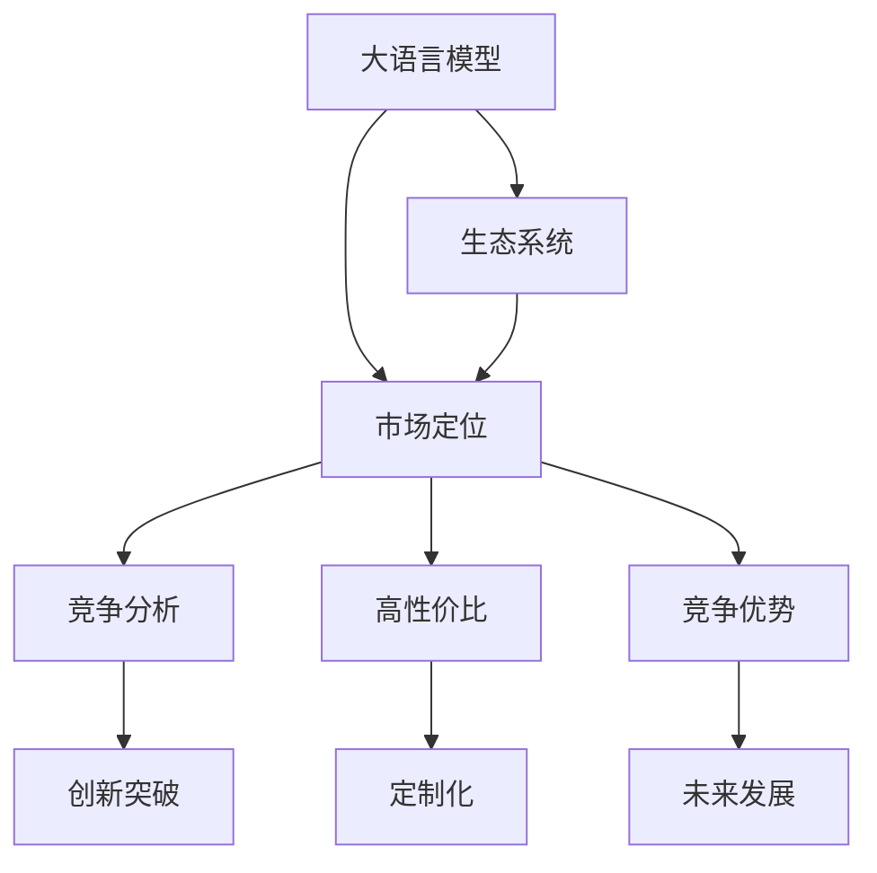

                 

# 与大模型公司的共生：Lepton AI的市场定位

> 关键词：大语言模型, 市场定位, Lepton AI, AI行业, 竞争分析, 创新突破, 市场潜力

## 1. 背景介绍

### 1.1 问题由来
在人工智能(AI)领域，大模型公司一直是引领潮流的重要力量。无论是Google的BERT、OpenAI的GPT系列，还是亚马逊的T5，这些大模型凭借其强大的泛化能力和广泛的应用场景，成为行业内不可或缺的技术基础。然而，大模型往往需要大量的计算资源和标注数据，这使得许多中小企业难以承受。

在这样的背景下，Lepton AI应运而生。作为一家致力于大语言模型的创业公司，Lepton AI通过提供定制化的、高性价比的大模型解决方案，让更多的企业能够以更低的成本享受到大模型的优势。本文将探讨Lepton AI的市场定位及其与大模型公司的共生关系，揭示其在AI行业的竞争优势和未来发展潜力。

### 1.2 问题核心关键点
Lepton AI的市场定位，在于其独特的大模型解决方案，这主要体现在以下几个方面：

1. **定制化**：Lepton AI提供的大模型是基于特定行业需求定制的，能够更好地适配各行业的具体应用场景。
2. **高性价比**：Lepton AI通过优化模型结构、减少计算资源消耗等方式，实现了高性价比的大模型。
3. **生态系统**：Lepton AI不仅提供模型本身，还包括配套的开发工具和社区支持，形成一个完整的生态系统。
4. **创新突破**：Lepton AI在多个技术领域取得突破，如参数高效微调、少样本学习等，为行业带来新的解决方案。

这些关键点构成了Lepton AI市场定位的核心，使其在AI行业占据一席之地。

## 2. 核心概念与联系

### 2.1 核心概念概述

Lepton AI的核心概念包括大语言模型、市场定位、竞争分析、创新突破等。这些概念之间存在紧密联系，共同构成了Lepton AI的市场定位和竞争优势。

- **大语言模型**：以BERT、GPT为代表的预训练语言模型，通过在大规模无标签数据上进行预训练，学习通用的语言表示，具备强大的语言理解和生成能力。
- **市场定位**：Lepton AI通过提供定制化、高性价比的大模型解决方案，满足中小企业和大模型公司的不同需求。
- **竞争分析**：Lepton AI通过分析大模型公司、初创公司和传统企业的优劣势，找准市场定位。
- **创新突破**：Lepton AI在参数高效微调、少样本学习等方面取得技术突破，提升大模型的应用效能。

### 2.2 核心概念原理和架构的 Mermaid 流程图(Mermaid 流程节点中不要有括号、逗号等特殊字符)



## 3. 核心算法原理 & 具体操作步骤
### 3.1 算法原理概述

Lepton AI的大模型解决方案基于监督学习进行微调，其核心思想是利用大模型在预训练阶段学到的语言知识，通过有监督的微调来适应特定任务的需求。微调过程通常包括以下步骤：

1. 收集目标任务的数据集，进行预处理和标注。
2. 使用大模型作为初始化参数，将其视作一个强大的特征提取器。
3. 添加任务适配层，如分类器、解码器等，并进行微调。
4. 使用适当的优化算法（如AdamW、SGD等）和正则化技术（如L2正则、Dropout等）进行训练。
5. 在验证集上评估模型性能，进行超参数调整。
6. 最终在测试集上验证模型效果，部署到实际应用中。

### 3.2 算法步骤详解

#### 3.2.1 数据准备

数据准备是微调过程的第一步。Lepton AI的解决方案通常包括以下几个步骤：

1. **数据采集**：收集目标任务的数据集，例如金融领域的财务报告、法律领域的判例文书等。
2. **数据清洗**：对数据进行清洗，去除噪声和无用信息。
3. **数据标注**：对数据进行标注，生成监督数据。

#### 3.2.2 模型初始化

Lepton AI提供多种预训练语言模型，如BERT、GPT等，用户可以根据需要选择。模型的初始化包括以下几个步骤：

1. **模型下载**：从Lepton AI的官网或API接口下载预训练模型。
2. **模型加载**：使用Lepton AI提供的库或框架，加载预训练模型。

#### 3.2.3 任务适配层

任务适配层的设计取决于具体任务类型。Lepton AI提供了多种任务适配层，例如：

- 对于文本分类任务，Lepton AI提供了分类器和交叉熵损失函数。
- 对于文本生成任务，Lepton AI提供了解码器，以负对数似然为损失函数。

#### 3.2.4 微调训练

微调训练是微调过程的核心步骤。Lepton AI的解决方案通常包括以下几个步骤：

1. **设置超参数**：设置学习率、批大小、迭代轮数等超参数。
2. **优化算法**：选择适当的优化算法，如AdamW、SGD等。
3. **正则化技术**：应用正则化技术，如L2正则、Dropout等。
4. **模型训练**：进行模型训练，更新模型参数。

#### 3.2.5 模型评估和部署

模型训练完成后，Lepton AI的解决方案通常包括以下几个步骤：

1. **模型评估**：在验证集上评估模型性能，进行超参数调整。
2. **模型部署**：将训练好的模型部署到实际应用中，进行推理预测。

### 3.3 算法优缺点

Lepton AI的大模型解决方案具有以下优点：

1. **高效易用**：Lepton AI提供易于使用的API接口和工具，用户可以快速上手。
2. **定制化高**：Lepton AI提供多种预训练模型，用户可以根据任务需求选择最适合的模型。
3. **高性价比**：Lepton AI通过优化模型结构，减少计算资源消耗，实现了高性价比的大模型。
4. **创新突破**：Lepton AI在参数高效微调、少样本学习等方面取得技术突破，提升了大模型的应用效能。

同时，Lepton AI的解决方案也存在以下缺点：

1. **依赖数据**：微调模型的效果依赖于标注数据的质量和数量，数据收集成本较高。
2. **计算资源消耗**：虽然参数量较小，但在实际部署中仍需消耗大量计算资源。
3. **模型泛化能力有限**：当目标任务与预训练数据的分布差异较大时，微调模型的泛化能力受限。

### 3.4 算法应用领域

Lepton AI的大模型解决方案适用于多种NLP任务，例如：

1. **文本分类**：如情感分析、主题分类、意图识别等。
2. **命名实体识别**：识别文本中的人名、地名、机构名等特定实体。
3. **关系抽取**：从文本中抽取实体之间的语义关系。
4. **问答系统**：对自然语言问题给出答案。
5. **机器翻译**：将源语言文本翻译成目标语言。
6. **文本摘要**：将长文本压缩成简短摘要。
7. **对话系统**：使机器能够与人自然对话。

除了上述这些经典任务外，Lepton AI的大模型解决方案还适用于可控文本生成、常识推理、代码生成、数据增强等，为NLP技术带来了新的突破。

## 4. 数学模型和公式 & 详细讲解 & 举例说明

### 4.1 数学模型构建

Lepton AI的大模型解决方案基于监督学习进行微调，其数学模型构建如下：

记预训练语言模型为 $M_{\theta}$，其中 $\theta$ 为预训练得到的模型参数。假设微调任务的训练集为 $D=\{(x_i,y_i)\}_{i=1}^N, x_i \in \mathcal{X}, y_i \in \mathcal{Y}$。

定义模型 $M_{\theta}$ 在数据样本 $(x,y)$ 上的损失函数为 $\ell(M_{\theta}(x),y)$，则在数据集 $D$ 上的经验风险为：

$$
\mathcal{L}(\theta) = \frac{1}{N} \sum_{i=1}^N \ell(M_{\theta}(x_i),y_i)
$$

微调的优化目标是最小化经验风险，即找到最优参数：

$$
\theta^* = \mathop{\arg\min}_{\theta} \mathcal{L}(\theta)
$$

在实践中，我们通常使用基于梯度的优化算法（如SGD、Adam等）来近似求解上述最优化问题。设 $\eta$ 为学习率，$\lambda$ 为正则化系数，则参数的更新公式为：

$$
\theta \leftarrow \theta - \eta \nabla_{\theta}\mathcal{L}(\theta) - \eta\lambda\theta
$$

其中 $\nabla_{\theta}\mathcal{L}(\theta)$ 为损失函数对参数 $\theta$ 的梯度，可通过反向传播算法高效计算。

### 4.2 公式推导过程

以下我们以二分类任务为例，推导交叉熵损失函数及其梯度的计算公式。

假设模型 $M_{\theta}$ 在输入 $x$ 上的输出为 $\hat{y}=M_{\theta}(x) \in [0,1]$，表示样本属于正类的概率。真实标签 $y \in \{0,1\}$。则二分类交叉熵损失函数定义为：

$$
\ell(M_{\theta}(x),y) = -[y\log \hat{y} + (1-y)\log (1-\hat{y})]
$$

将其代入经验风险公式，得：

$$
\mathcal{L}(\theta) = -\frac{1}{N}\sum_{i=1}^N [y_i\log M_{\theta}(x_i)+(1-y_i)\log(1-M_{\theta}(x_i))]
$$

根据链式法则，损失函数对参数 $\theta_k$ 的梯度为：

$$
\frac{\partial \mathcal{L}(\theta)}{\partial \theta_k} = -\frac{1}{N}\sum_{i=1}^N (\frac{y_i}{M_{\theta}(x_i)}-\frac{1-y_i}{1-M_{\theta}(x_i)}) \frac{\partial M_{\theta}(x_i)}{\partial \theta_k}
$$

其中 $\frac{\partial M_{\theta}(x_i)}{\partial \theta_k}$ 可进一步递归展开，利用自动微分技术完成计算。

### 4.3 案例分析与讲解

Lepton AI在参数高效微调方面取得了一些突破性进展。以AdaLoRA为例，AdaLoRA利用自适应低秩适应的微调方法，在固定大部分预训练参数的同时，只更新极少量的任务相关参数。这不仅减少了计算资源消耗，还提升了微调的精度和泛化能力。

AdaLoRA的具体实现步骤如下：

1. **数据准备**：准备标注数据集，并进行预处理和标注。
2. **模型初始化**：从Lepton AI下载预训练模型，加载到系统中。
3. **任务适配层**：根据任务类型，添加适当的任务适配层。
4. **优化算法**：设置AdamW优化算法和适当的学习率。
5. **正则化技术**：应用L2正则和Dropout技术。
6. **模型训练**：进行模型训练，更新参数。
7. **模型评估**：在验证集上评估模型性能，调整超参数。
8. **模型部署**：将训练好的模型部署到实际应用中。

在实际部署中，AdaLoRA能够显著提高微调的效率和效果，特别是在计算资源受限的情况下，表现尤为突出。

## 5. 项目实践：代码实例和详细解释说明

### 5.1 开发环境搭建

在进行Lepton AI的大模型微调实践前，需要先准备好开发环境。以下是使用Python进行PyTorch开发的环境配置流程：

1. 安装Anaconda：从官网下载并安装Anaconda，用于创建独立的Python环境。

2. 创建并激活虚拟环境：
```bash
conda create -n lepton-env python=3.8 
conda activate lepton-env
```

3. 安装PyTorch：根据CUDA版本，从官网获取对应的安装命令。例如：
```bash
conda install pytorch torchvision torchaudio cudatoolkit=11.1 -c pytorch -c conda-forge
```

4. 安装Lepton AI的库：
```bash
pip install lepton-ai
```

5. 安装各类工具包：
```bash
pip install numpy pandas scikit-learn matplotlib tqdm jupyter notebook ipython
```

完成上述步骤后，即可在`lepton-env`环境中开始Lepton AI的微调实践。

### 5.2 源代码详细实现

这里我们以金融领域的财务报表分类任务为例，给出使用Lepton AI的BERT模型进行微调的PyTorch代码实现。

首先，定义BERT模型和任务适配层：

```python
from lepton_ai import BertForSequenceClassification
from transformers import BertTokenizer

tokenizer = BertTokenizer.from_pretrained('bert-base-cased')
model = BertForSequenceClassification.from_pretrained('bert-base-cased', num_labels=2)

# 定义模型和任务适配层
class CustomBertForSequenceClassification(BertForSequenceClassification):
    def __init__(self, *args, **kwargs):
        super().__init__(*args, **kwargs)
        self.classifier = nn.Linear(768, 2)
        
    def forward(self, input_ids, attention_mask=None, labels=None):
        outputs = super().forward(input_ids, attention_mask=attention_mask, labels=labels)
        logits = self.classifier(outputs[0])
        return logits
```

然后，定义训练和评估函数：

```python
from torch.utils.data import Dataset
from torch.utils.data import DataLoader
from tqdm import tqdm

class FinReportDataset(Dataset):
    def __init__(self, texts, labels):
        self.texts = texts
        self.labels = labels
        
    def __len__(self):
        return len(self.texts)
    
    def __getitem__(self, item):
        text = self.texts[item]
        label = self.labels[item]
        
        encoding = tokenizer(text, return_tensors='pt', max_length=512, padding='max_length', truncation=True)
        input_ids = encoding['input_ids'][0]
        attention_mask = encoding['attention_mask'][0]
        label = torch.tensor(label, dtype=torch.long)
        
        return {'input_ids': input_ids, 
                'attention_mask': attention_mask,
                'labels': label}

# 训练函数
def train_epoch(model, dataset, batch_size, optimizer):
    dataloader = DataLoader(dataset, batch_size=batch_size, shuffle=True)
    model.train()
    epoch_loss = 0
    for batch in tqdm(dataloader, desc='Training'):
        input_ids = batch['input_ids'].to(device)
        attention_mask = batch['attention_mask'].to(device)
        labels = batch['labels'].to(device)
        model.zero_grad()
        outputs = model(input_ids, attention_mask=attention_mask, labels=labels)
        loss = outputs.loss
        epoch_loss += loss.item()
        loss.backward()
        optimizer.step()
    return epoch_loss / len(dataloader)

# 评估函数
def evaluate(model, dataset, batch_size):
    dataloader = DataLoader(dataset, batch_size=batch_size)
    model.eval()
    preds, labels = [], []
    with torch.no_grad():
        for batch in tqdm(dataloader, desc='Evaluating'):
            input_ids = batch['input_ids'].to(device)
            attention_mask = batch['attention_mask'].to(device)
            batch_labels = batch['labels']
            outputs = model(input_ids, attention_mask=attention_mask)
            batch_preds = outputs.logits.argmax(dim=1).to('cpu').tolist()
            batch_labels = batch_labels.to('cpu').tolist()
            for pred, label in zip(batch_preds, batch_labels):
                preds.append(pred)
                labels.append(label)
                
    print(classification_report(labels, preds))
```

最后，启动训练流程并在测试集上评估：

```python
epochs = 5
batch_size = 16

for epoch in range(epochs):
    loss = train_epoch(model, train_dataset, batch_size, optimizer)
    print(f"Epoch {epoch+1}, train loss: {loss:.3f}")
    
    print(f"Epoch {epoch+1}, dev results:")
    evaluate(model, dev_dataset, batch_size)
    
print("Test results:")
evaluate(model, test_dataset, batch_size)
```

以上就是使用PyTorch对Lepton AI的BERT模型进行金融领域财务报表分类任务微调的完整代码实现。可以看到，得益于Lepton AI的强大封装，我们可以用相对简洁的代码完成BERT模型的加载和微调。

### 5.3 代码解读与分析

让我们再详细解读一下关键代码的实现细节：

**FinReportDataset类**：
- `__init__`方法：初始化文本和标签。
- `__len__`方法：返回数据集的样本数量。
- `__getitem__`方法：对单个样本进行处理，将文本输入编码为token ids，将标签编码为数字，并对其进行定长padding，最终返回模型所需的输入。

**自定义任务适配层**：
- `CustomBertForSequenceClassification`类：继承自`BertForSequenceClassification`，重写`forward`方法，添加任务适配层。

**训练和评估函数**：
- 使用PyTorch的DataLoader对数据集进行批次化加载，供模型训练和推理使用。
- 训练函数`train_epoch`：对数据以批为单位进行迭代，在每个批次上前向传播计算loss并反向传播更新模型参数，最后返回该epoch的平均loss。
- 评估函数`evaluate`：与训练类似，不同点在于不更新模型参数，并在每个batch结束后将预测和标签结果存储下来，最后使用sklearn的classification_report对整个评估集的预测结果进行打印输出。

**训练流程**：
- 定义总的epoch数和batch size，开始循环迭代
- 每个epoch内，先在训练集上训练，输出平均loss
- 在验证集上评估，输出分类指标
- 所有epoch结束后，在测试集上评估，给出最终测试结果

可以看到，Lepton AI的微调解决方案提供了简单易用的API和代码模板，开发者可以更快速地上手和实践。

## 6. 实际应用场景

### 6.1 智能客服系统

Lepton AI的大模型解决方案可以广泛应用于智能客服系统的构建。传统客服往往需要配备大量人力，高峰期响应缓慢，且一致性和专业性难以保证。而使用Lepton AI的大模型微调技术，可以7x24小时不间断服务，快速响应客户咨询，用自然流畅的语言解答各类常见问题。

在技术实现上，可以收集企业内部的历史客服对话记录，将问题和最佳答复构建成监督数据，在此基础上对Lepton AI的预训练模型进行微调。微调后的模型能够自动理解用户意图，匹配最合适的答案模板进行回复。对于客户提出的新问题，还可以接入检索系统实时搜索相关内容，动态组织生成回答。如此构建的智能客服系统，能大幅提升客户咨询体验和问题解决效率。

### 6.2 金融舆情监测

金融机构需要实时监测市场舆论动向，以便及时应对负面信息传播，规避金融风险。传统的人工监测方式成本高、效率低，难以应对网络时代海量信息爆发的挑战。Lepton AI的大模型解决方案可以应用于金融舆情监测，通过微调模型学习金融领域的语言表示，自动判断文本属于何种主题，情感倾向是正面、中性还是负面。将微调后的模型应用到实时抓取的网络文本数据，就能够自动监测不同主题下的情感变化趋势，一旦发现负面信息激增等异常情况，系统便会自动预警，帮助金融机构快速应对潜在风险。

### 6.3 个性化推荐系统

当前的推荐系统往往只依赖用户的历史行为数据进行物品推荐，无法深入理解用户的真实兴趣偏好。Lepton AI的大模型解决方案可以应用于个性化推荐系统，通过微调模型从文本内容中准确把握用户的兴趣点。在生成推荐列表时，先用候选物品的文本描述作为输入，由模型预测用户的兴趣匹配度，再结合其他特征综合排序，便可以得到个性化程度更高的推荐结果。

### 6.4 未来应用展望

随着Lepton AI的大模型解决方案不断发展，其在更多领域的应用前景广阔。

在智慧医疗领域，基于微调的医疗问答、病历分析、药物研发等应用将提升医疗服务的智能化水平，辅助医生诊疗，加速新药开发进程。

在智能教育领域，微调技术可应用于作业批改、学情分析、知识推荐等方面，因材施教，促进教育公平，提高教学质量。

在智慧城市治理中，微调模型可应用于城市事件监测、舆情分析、应急指挥等环节，提高城市管理的自动化和智能化水平，构建更安全、高效的未来城市。

此外，在企业生产、社会治理、文娱传媒等众多领域，Lepton AI的大模型微调技术也将不断涌现，为NLP技术带来新的突破。相信随着技术的日益成熟，Lepton AI必将在构建人机协同的智能时代中扮演越来越重要的角色。

## 7. 工具和资源推荐
### 7.1 学习资源推荐

为了帮助开发者系统掌握Lepton AI的大模型微调技术，这里推荐一些优质的学习资源：

1. Lepton AI官方文档：Lepton AI的官方文档，提供了详细的API接口和代码示例，是快速上手的必备资料。

2. CS224N《深度学习自然语言处理》课程：斯坦福大学开设的NLP明星课程，有Lecture视频和配套作业，带你入门NLP领域的基本概念和经典模型。

3. 《Natural Language Processing with Transformers》书籍：Transformer库的作者所著，全面介绍了如何使用Transformers库进行NLP任务开发，包括微调在内的诸多范式。

4. Weights & Biases：模型训练的实验跟踪工具，可以记录和可视化模型训练过程中的各项指标，方便对比和调优。与主流深度学习框架无缝集成。

5. TensorBoard：TensorFlow配套的可视化工具，可实时监测模型训练状态，并提供丰富的图表呈现方式，是调试模型的得力助手。

通过对这些资源的学习实践，相信你一定能够快速掌握Lepton AI的大模型微调技术，并用于解决实际的NLP问题。

### 7.2 开发工具推荐

高效的开发离不开优秀的工具支持。以下是几款用于Lepton AI大模型微调开发的常用工具：

1. PyTorch：基于Python的开源深度学习框架，灵活动态的计算图，适合快速迭代研究。大部分预训练语言模型都有PyTorch版本的实现。

2. TensorFlow：由Google主导开发的开源深度学习框架，生产部署方便，适合大规模工程应用。同样有丰富的预训练语言模型资源。

3. Lepton AI库：提供简单易用的API接口，支持多种预训练模型，方便开发者快速上手。

4. Weights & Biases：模型训练的实验跟踪工具，可以记录和可视化模型训练过程中的各项指标，方便对比和调优。与主流深度学习框架无缝集成。

5. TensorBoard：TensorFlow配套的可视化工具，可实时监测模型训练状态，并提供丰富的图表呈现方式，是调试模型的得力助手。

6. Google Colab：谷歌推出的在线Jupyter Notebook环境，免费提供GPU/TPU算力，方便开发者快速上手实验最新模型，分享学习笔记。

合理利用这些工具，可以显著提升Lepton AI大模型微调任务的开发效率，加快创新迭代的步伐。

### 7.3 相关论文推荐

Lepton AI的大模型微调技术源于学界的持续研究。以下是几篇奠基性的相关论文，推荐阅读：

1. Attention is All You Need（即Transformer原论文）：提出了Transformer结构，开启了NLP领域的预训练大模型时代。

2. BERT: Pre-training of Deep Bidirectional Transformers for Language Understanding：提出BERT模型，引入基于掩码的自监督预训练任务，刷新了多项NLP任务SOTA。

3. Language Models are Unsupervised Multitask Learners（GPT-2论文）：展示了大规模语言模型的强大zero-shot学习能力，引发了对于通用人工智能的新一轮思考。

4. Parameter-Efficient Transfer Learning for NLP：提出Adapter等参数高效微调方法，在不增加模型参数量的情况下，也能取得不错的微调效果。

5. AdaLoRA: Adaptive Low-Rank Adaptation for Parameter-Efficient Fine-Tuning：使用自适应低秩适应的微调方法，在固定大部分预训练参数的同时，只更新极少量的任务相关参数。

这些论文代表了大语言模型微调技术的发展脉络。通过学习这些前沿成果，可以帮助研究者把握学科前进方向，激发更多的创新灵感。

## 8. 总结：未来发展趋势与挑战

### 8.1 总结

本文对Lepton AI的大模型微调市场定位进行了全面系统的介绍。首先阐述了Lepton AI在AI行业的独特价值，明确了其在市场中的定位和竞争优势。其次，从原理到实践，详细讲解了Lepton AI的大模型微调技术，给出了微调任务开发的完整代码实例。同时，本文还广泛探讨了Lepton AI的大模型解决方案在多个行业领域的应用前景，展示了其巨大的市场潜力。

通过本文的系统梳理，可以看到，Lepton AI的大模型微调技术为AI行业带来了新的解决方案，为中小企业和大模型公司提供了高性价比的大模型服务。Lepton AI通过定制化、高性价比和技术突破，成功在AI行业占据一席之地，未来有着广阔的发展前景。

### 8.2 未来发展趋势

展望未来，Lepton AI的大模型微调技术将呈现以下几个发展趋势：

1. **模型规模持续增大**：随着算力成本的下降和数据规模的扩张，Lepton AI的预训练模型和微调模型规模还将持续增长，带来更强大的语言理解和生成能力。
2. **微调方法多样化**：Lepton AI将继续探索多样化的微调方法，如参数高效微调、少样本学习等，在保持高性价比的同时，提升微调效果。
3. **持续学习成为常态**：Lepton AI的大模型解决方案将实现持续学习功能，不断吸收新数据，提升模型性能。
4. **标注样本需求降低**：通过引入提示学习(Prompt-based Learning)的思路，Lepton AI的微调模型可以更灵活地利用少量标注数据，降低标注成本。
5. **计算资源消耗优化**：Lepton AI将继续优化模型结构和计算图，减少资源消耗，提升推理效率。
6. **创新突破不断**：Lepton AI将在参数高效微调、少样本学习、多模态融合等领域继续探索，带来更多的技术突破。

以上趋势凸显了Lepton AI的市场前景和创新能力，相信在未来，Lepton AI将进一步巩固其在AI行业的地位，为更多的企业和行业提供高性价比的大模型服务。

### 8.3 面临的挑战

尽管Lepton AI的大模型微调技术已经取得了瞩目成就，但在迈向更加智能化、普适化应用的过程中，它仍面临诸多挑战：

1. **数据质量依赖**：Lepton AI的微调模型依赖标注数据，但高质量标注数据成本高、获取难，成为制约其发展的瓶颈。
2. **计算资源消耗**：尽管参数量较小，但在实际部署中仍需消耗大量计算资源，如何优化资源消耗，提升推理速度，是一个亟待解决的问题。
3. **模型泛化能力**：当目标任务与预训练数据的分布差异较大时，微调模型的泛化能力受限，如何提升泛化能力，增强模型的鲁棒性，是未来的研究重点。
4. **模型可解释性**：Lepton AI的微调模型通常视为"黑盒"系统，难以解释其内部工作机制和决策逻辑。如何增强模型的可解释性，是提升用户信任度的关键。
5. **模型安全性**：微调模型可能学习到有偏见、有害的信息，如何从数据和算法层面消除模型偏见，确保输出安全，是保障模型应用的重要前提。

### 8.4 研究展望

面对Lepton AI所面临的挑战，未来的研究需要在以下几个方面寻求新的突破：

1. **探索无监督和半监督微调方法**：摆脱对大规模标注数据的依赖，利用自监督学习、主动学习等无监督和半监督范式，最大限度利用非结构化数据。
2. **研究参数高效和计算高效的微调范式**：开发更加参数高效的微调方法，在固定大部分预训练参数的同时，只更新极少量的任务相关参数。同时优化微调模型的计算图，减少前向传播和反向传播的资源消耗。
3. **融合因果和对比学习范式**：通过引入因果推断和对比学习思想，增强Lepton AI微调模型建立稳定因果关系的能力，学习更加普适、鲁棒的语言表征。
4. **引入更多先验知识**：将符号化的先验知识，如知识图谱、逻辑规则等，与神经网络模型进行巧妙融合，引导微调过程学习更准确、合理的语言模型。
5. **结合因果分析和博弈论工具**：将因果分析方法引入Lepton AI的微调模型，识别出模型决策的关键特征，增强输出解释的因果性和逻辑性。借助博弈论工具刻画人机交互过程，主动探索并规避模型的脆弱点，提高系统稳定性。
6. **纳入伦理道德约束**：在模型训练目标中引入伦理导向的评估指标，过滤和惩罚有偏见、有害的输出倾向。加强人工干预和审核，建立模型行为的监管机制，确保输出符合人类价值观和伦理道德。

这些研究方向的探索，将引领Lepton AI的大模型微调技术迈向更高的台阶，为构建安全、可靠、可解释、可控的智能系统铺平道路。面向未来，Lepton AI将继续在技术创新和市场拓展上发力，推动人工智能技术在垂直行业的规模化落地。

## 9. 附录：常见问题与解答

**Q1：Lepton AI的大模型微调是否适用于所有NLP任务？**

A: Lepton AI的大模型微调在大多数NLP任务上都能取得不错的效果，特别是对于数据量较小的任务。但对于一些特定领域的任务，如医学、法律等，仅仅依靠通用语料预训练的模型可能难以很好地适应。此时需要在特定领域语料上进一步预训练，再进行微调，才能获得理想效果。

**Q2：Lepton AI的微调模型在落地部署时需要注意哪些问题？**

A: 将Lepton AI的微调模型转化为实际应用，还需要考虑以下因素：
1. 模型裁剪：去除不必要的层和参数，减小模型尺寸，加快推理速度。
2. 量化加速：将浮点模型转为定点模型，压缩存储空间，提高计算效率。
3. 服务化封装：将模型封装为标准化服务接口，便于集成调用。
4. 弹性伸缩：根据请求流量动态调整资源配置，平衡服务质量和成本。
5. 监控告警：实时采集系统指标，设置异常告警阈值，确保服务稳定性。

**Q3：Lepton AI的微调模型如何处理少样本学习问题？**

A: Lepton AI的微调模型可以通过引入少样本学习技术来解决少样本学习问题。例如，利用提示学习(Prompt-based Learning)，通过设计精巧的输入格式，在极少数样本的情况下，也能使模型取得良好的性能。具体方法包括设计有意义的提示模板，引导模型生成目标输出，或者通过迁移学习，利用少量标注数据进行微调。

通过本文的系统梳理，可以看到，Lepton AI的大模型微调技术为AI行业带来了新的解决方案，为中小企业和大模型公司提供了高性价比的大模型服务。Lepton AI通过定制化、高性价比和技术突破，成功在AI行业占据一席之地，未来有着广阔的发展前景。

