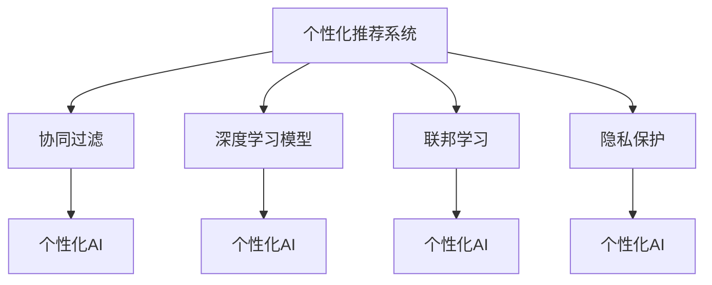

                 

# 个性化AI:满足不同用户需求的关键

## 1. 背景介绍

### 1.1 问题由来
随着人工智能技术的发展，个性化AI成为当前IT行业的一大热门话题。人工智能技术不仅能提高效率，还能根据用户的个性化需求提供更精准的服务。在医疗、教育、零售、金融等行业，个性化AI的应用已经初现成效，极大提升了用户体验和业务效果。

在实践中，个性化AI系统需要根据不同用户的行为、偏好、习惯等数据，动态调整算法和模型，以满足用户的个性化需求。例如，在医疗领域，一个个性化AI医生可以帮助患者通过历史数据、基因信息等分析出最适合的治疗方案；在教育领域，个性化AI老师可以针对学生的学习进度、兴趣点等提供个性化的学习资源和指导。

然而，如何设计高效、稳定的个性化AI系统，同时保证数据安全和用户隐私，成为了当前研究的难点。本文将从个性化AI的核心概念、算法原理、具体操作步骤、实际应用场景等方面进行详细探讨，力求为AI开发者和从业者提供一些有价值的参考。

### 1.2 问题核心关键点
个性化AI的核心在于理解用户需求、分析用户行为，并提供个性化的解决方案。基于机器学习和数据挖掘技术，通过大量历史数据的学习，AI系统可以挖掘出用户行为模式，预测其未来行为，从而提供定制化服务。

为满足不同用户的需求，个性化AI系统通常具备以下特性：

- **数据驱动**：依靠历史数据训练模型，预测用户行为。
- **模型多样化**：不同的用户可能需要不同的模型，系统应支持多种算法和模型。
- **动态调整**：用户行为和需求是动态变化的，系统应能实时调整模型参数，以适应最新数据。
- **隐私保护**：保护用户隐私，确保数据安全和合规性。

本文将详细介绍如何通过数据驱动、模型多样化、动态调整和隐私保护，构建高效、稳定的个性化AI系统。

## 2. 核心概念与联系

### 2.1 核心概念概述

为深入理解个性化AI系统的设计原理和架构，本节将介绍几个关键概念及其相互联系：

- **个性化推荐系统(Recommender Systems)**：根据用户的历史行为、兴趣偏好，推荐合适的内容和服务。
- **协同过滤(Collaborative Filtering)**：通过分析用户与内容之间的交互历史，预测用户可能感兴趣的内容。
- **深度学习模型(Deep Learning Models)**：基于神经网络等深度学习技术，通过大量数据训练模型，实现更准确的推荐和预测。
- **联邦学习(Federated Learning)**：在不共享用户数据的前提下，多个设备或系统共同训练模型，提升模型性能。
- **隐私保护(P privacy Protection)**：通过差分隐私、同态加密等技术，保护用户数据隐私，同时确保模型性能。

这些概念之间的联系通过以下Mermaid流程图展示：



这个流程图展示了个性化AI的核心概念及其相互联系：

1. 个性化推荐系统是基础，通过协同过滤等技术分析用户行为。
2. 深度学习模型作为核心技术，通过大量数据训练预测用户需求。
3. 联邦学习提升模型性能，通过分布式训练加速模型更新。
4. 隐私保护确保用户数据安全，同时满足合规要求。

这些概念共同构成了个性化AI的核心框架，使其能够高效、稳定地运行。

## 3. 核心算法原理 & 具体操作步骤
### 3.1 算法原理概述

个性化AI的算法原理主要包括以下几个步骤：

1. **数据收集与处理**：收集用户的历史行为数据，并进行预处理和清洗。
2. **用户行为分析**：使用协同过滤、深度学习等算法，分析用户行为模式，预测未来行为。
3. **模型训练与优化**：使用训练数据训练个性化AI模型，并通过优化算法调整模型参数。
4. **动态调整**：实时更新模型参数，以适应新数据的到来。
5. **隐私保护**：采用隐私保护技术，确保用户数据安全和合规。

### 3.2 算法步骤详解

#### 3.2.1 数据收集与处理

1. **数据收集**：通过API、日志、传感器等方式收集用户行为数据，如浏览记录、购买记录、搜索记录等。
2. **数据清洗**：去除无效、重复、噪声数据，确保数据质量。
3. **数据增强**：使用数据增强技术，如回译、近义词替换、数据扩充等，增加训练集的多样性。

#### 3.2.2 用户行为分析

1. **特征工程**：从收集的数据中提取有意义的特征，如用户ID、时间戳、物品ID等。
2. **协同过滤**：分析用户与物品之间的交互记录，找出用户对物品的偏好。
3. **深度学习模型**：使用神经网络等深度学习模型，通过大量数据训练，预测用户行为。

#### 3.2.3 模型训练与优化

1. **模型选择**：选择合适的算法和模型，如协同过滤、深度神经网络等。
2. **数据分割**：将数据划分为训练集、验证集和测试集。
3. **模型训练**：在训练集上训练模型，并通过验证集调整模型参数。
4. **优化算法**：使用梯度下降等优化算法，最小化损失函数，提高模型性能。

#### 3.2.4 动态调整

1. **实时数据采集**：实时采集用户新行为数据。
2. **模型更新**：使用新数据更新模型参数，以适应最新的用户行为。
3. **性能评估**：定期评估模型性能，确保模型持续优化。

#### 3.2.5 隐私保护

1. **数据加密**：对用户数据进行加密处理，防止泄露。
2. **差分隐私**：在训练模型时加入噪声，保护用户隐私。
3. **同态加密**：对数据进行加密，保持原始数据形态的同时进行计算。

### 3.3 算法优缺点

个性化AI系统的优点包括：

1. **个性化推荐**：根据用户历史数据和行为，提供个性化服务，提升用户体验。
2. **高精度**：深度学习模型通过大量数据训练，可以实现高精度的预测和推荐。
3. **实时性**：通过实时数据处理和模型更新，系统能够快速响应用户需求。
4. **灵活性**：支持多种算法和模型，可以适应不同应用场景。

同时，个性化AI系统也存在以下缺点：

1. **数据隐私问题**：大量用户数据被用于训练模型，隐私保护成为重要问题。
2. **数据不平衡**：用户数据不平衡可能导致模型预测偏差。
3. **计算资源消耗大**：深度学习模型计算量大，需要高性能硬件支持。
4. **模型过拟合**：大规模数据可能带来模型过拟合问题。

### 3.4 算法应用领域

个性化AI技术在多个领域得到了广泛应用，包括：

- **医疗推荐**：根据患者历史病历和基因信息，推荐个性化的治疗方案。
- **电商推荐**：通过分析用户浏览和购买行为，推荐个性化商品。
- **教育推荐**：根据学生学习历史和兴趣点，推荐个性化学习资源。
- **金融推荐**：通过分析用户投资历史和行为，推荐个性化的金融产品。
- **媒体推荐**：根据用户观看历史和兴趣点，推荐个性化视频和内容。

## 4. 数学模型和公式 & 详细讲解  
### 4.1 数学模型构建

个性化AI系统的核心是深度学习模型。下面将从数学角度详细讲解深度学习模型的构建。

假设有N个用户，M个物品，T个时间戳，用户对物品在时间t下的评分记为$x_{ut}$，深度学习模型的目标是学习到用户u对物品i的评分，即预测模型$y_{ui}$。

模型采用矩阵分解的方式，用户特征和物品特征分别表示为$U$和$V$，模型可表示为：

$$
y_{ui} = <U_u, V_i> + b_u + c_i + \epsilon_{ui}
$$

其中$<.,.>$表示向量内积，$b_u$和$c_i$为偏差项，$\epsilon_{ui}$为噪声项。

通过最小化损失函数，求解出模型参数$U$和$V$，即可实现个性化推荐。

### 4.2 公式推导过程

假设模型的损失函数为均方误差：

$$
L=\frac{1}{N}\sum_{u=1}^{N}\sum_{i=1}^{M}(r_{ui}-\hat{r}_{ui})^2
$$

其中$r_{ui}$为用户u在时间t对物品i的实际评分，$\hat{r}_{ui}$为模型预测评分。

通过梯度下降算法求解模型参数：

$$
\frac{\partial L}{\partial U}=-2\frac{1}{N}\sum_{u=1}^{N}\sum_{i=1}^{M}(x_{ui}-<U_u, V_i>)V_i
$$

$$
\frac{\partial L}{\partial V}=-2\frac{1}{N}\sum_{u=1}^{N}\sum_{i=1}^{M}(x_{ui}-<U_u, V_i>)U_u
$$

通过上述公式，可以求解出用户特征$U$和物品特征$V$，进而实现个性化推荐。

### 4.3 案例分析与讲解

以电商推荐为例，分析个性化AI系统的实现过程。

1. **数据收集**：电商网站通过API收集用户浏览记录、购买记录、评价记录等。
2. **数据清洗**：清洗无效数据，如错误ID、噪声数据等。
3. **特征工程**：提取用户特征如年龄、性别、浏览时间等，提取物品特征如价格、类别、品牌等。
4. **协同过滤**：分析用户与物品之间的交互记录，找出用户对物品的偏好。
5. **深度学习模型**：使用神经网络模型，通过大量数据训练，预测用户行为。
6. **模型训练与优化**：在训练集上训练模型，并通过验证集调整模型参数。
7. **动态调整**：实时更新模型参数，以适应新数据的到来。
8. **隐私保护**：对用户数据进行加密处理，保护隐私。

通过以上步骤，即可实现个性化电商推荐系统。

## 5. 项目实践：代码实例和详细解释说明
### 5.1 开发环境搭建

在进行个性化AI项目实践前，我们需要准备好开发环境。以下是使用Python进行TensorFlow开发的环境配置流程：

1. 安装Anaconda：从官网下载并安装Anaconda，用于创建独立的Python环境。

2. 创建并激活虚拟环境：
```bash
conda create -n pytensorflow-env python=3.8 
conda activate pytensorflow-env
```

3. 安装TensorFlow：根据CUDA版本，从官网获取对应的安装命令。例如：
```bash
conda install tensorflow tensorflow-gpu -c conda-forge -c nvidia
```

4. 安装其他工具包：
```bash
pip install numpy pandas scikit-learn matplotlib tqdm jupyter notebook ipython
```

完成上述步骤后，即可在`pytensorflow-env`环境中开始项目实践。

### 5.2 源代码详细实现

这里我们以电商推荐系统为例，给出使用TensorFlow进行个性化AI开发的PyTorch代码实现。

首先，定义推荐系统的输入和输出：

```python
import tensorflow as tf

# 定义输入数据
user_id = tf.placeholder(tf.int32, shape=[None, 1])
item_id = tf.placeholder(tf.int32, shape=[None, 1])
timestamp = tf.placeholder(tf.int32, shape=[None, 1])
rating = tf.placeholder(tf.float32, shape=[None, 1])

# 定义输出数据
prediction = tf.placeholder(tf.float32, shape=[None, 1])
```

然后，定义模型：

```python
# 定义用户特征和物品特征
U = tf.Variable(tf.random_normal([N, D], stddev=0.1))
V = tf.Variable(tf.random_normal([M, D], stddev=0.1))

# 定义预测模型
rating_pred = tf.matmul(tf.nn.embedding_lookup(U, user_id), tf.nn.embedding_lookup(V, item_id)) + \
              tf.reduce_mean(tf.nn.embedding_lookup(tf.get_variable('b', shape=[N]), user_id)) + \
              tf.reduce_mean(tf.nn.embedding_lookup(tf.get_variable('c', shape=[M]), item_id))

# 定义损失函数
loss = tf.reduce_mean(tf.square(prediction - rating_pred))

# 定义优化器
optimizer = tf.train.AdamOptimizer(learning_rate=0.001).minimize(loss)
```

接着，训练模型：

```python
# 定义训练函数
def train(model, session, train_data, validation_data, batch_size, num_epochs):
    for epoch in range(num_epochs):
        for batch in train_data:
            user, item, timestamp, rating = batch
            session.run(optimizer, feed_dict={user_id: user, item_id: item, timestamp: timestamp, rating: rating})
        valid_loss = session.run(loss, feed_dict={user_id: validation_data['user'], item_id: validation_data['item'], timestamp: validation_data['timestamp'], prediction: validation_data['rating']})
        print('Epoch: {}, Validation Loss: {}'.format(epoch+1, valid_loss))

# 加载数据
train_data = ...
validation_data = ...
test_data = ...

# 训练模型
with tf.Session() as session:
    session.run(tf.global_variables_initializer())
    train(model, session, train_data, validation_data, batch_size=64, num_epochs=100)
```

最后，评估模型：

```python
# 定义评估函数
def evaluate(model, session, test_data, batch_size):
    total_loss = 0
    for batch in test_data:
        user, item, timestamp, rating = batch
        total_loss += session.run(loss, feed_dict={user_id: user, item_id: item, timestamp: timestamp, prediction: rating})
    print('Test Loss: {}'.format(total_loss/len(test_data)))

# 评估模型
evaluate(model, session, test_data, batch_size=64)
```

以上就是使用TensorFlow进行个性化电商推荐系统开发的完整代码实现。可以看到，通过TensorFlow提供的高级API，开发个性化AI模型变得更加便捷。

### 5.3 代码解读与分析

让我们再详细解读一下关键代码的实现细节：

**User特征和物品特征的定义**：

```python
U = tf.Variable(tf.random_normal([N, D], stddev=0.1))
V = tf.Variable(tf.random_normal([M, D], stddev=0.1))
```

这里定义了用户特征$U$和物品特征$V$，均为随机初始化的变量。$N$为用户数量，$M$为物品数量，$D$为特征维度。

**预测模型的定义**：

```python
rating_pred = tf.matmul(tf.nn.embedding_lookup(U, user_id), tf.nn.embedding_lookup(V, item_id)) + \
              tf.reduce_mean(tf.nn.embedding_lookup(tf.get_variable('b', shape=[N]), user_id)) + \
              tf.reduce_mean(tf.nn.embedding_lookup(tf.get_variable('c', shape=[M]), item_id))
```

通过矩阵分解的方式，将用户特征和物品特征进行内积，再加上偏差项$b$和$c$，最终得到预测评分$\hat{r}_{ui}$。

**损失函数的定义**：

```python
loss = tf.reduce_mean(tf.square(prediction - rating_pred))
```

采用均方误差作为损失函数，衡量预测评分与真实评分之间的差距。

**优化器的定义**：

```python
optimizer = tf.train.AdamOptimizer(learning_rate=0.001).minimize(loss)
```

使用Adam优化器进行模型训练，学习率为0.001。

**训练函数**：

```python
def train(model, session, train_data, validation_data, batch_size, num_epochs):
    for epoch in range(num_epochs):
        for batch in train_data:
            user, item, timestamp, rating = batch
            session.run(optimizer, feed_dict={user_id: user, item_id: item, timestamp: timestamp, rating: rating})
        valid_loss = session.run(loss, feed_dict={user_id: validation_data['user'], item_id: validation_data['item'], timestamp: validation_data['timestamp'], prediction: validation_data['rating']})
        print('Epoch: {}, Validation Loss: {}'.format(epoch+1, valid_loss))
```

在每个epoch内，先对训练数据进行迭代，使用Adam优化器进行模型训练。然后使用验证数据评估模型性能，打印出每个epoch的验证损失。

**评估函数**：

```python
def evaluate(model, session, test_data, batch_size):
    total_loss = 0
    for batch in test_data:
        user, item, timestamp, rating = batch
        total_loss += session.run(loss, feed_dict={user_id: user, item_id: item, timestamp: timestamp, prediction: rating})
    print('Test Loss: {}'.format(total_loss/len(test_data)))
```

对测试数据进行评估，计算测试损失并打印结果。

## 6. 实际应用场景
### 6.1 智能客服系统

个性化AI技术在智能客服系统中得到了广泛应用。传统客服往往依赖人工服务，响应速度慢，且成本高昂。个性化AI客服系统可以根据用户的历史咨询记录和问题类型，提供更快速、更准确的回复，提升客户满意度。

在技术实现上，可以收集客户的历史咨询记录和问题类型，将问题和答案构建成监督数据，训练个性化AI模型。模型能够根据用户的问题类型和历史行为，推荐最合适的答案模板，并提供个性化的回复生成。对于客户提出的新问题，系统还可以动态生成合适的答案，确保服务的及时性和准确性。

### 6.2 金融理财平台

个性化AI技术在金融理财平台中也得到了应用。传统的理财平台往往无法根据用户的财务状况和理财目标，提供个性化的理财建议。个性化AI理财平台可以根据用户的历史投资记录和财务状况，推荐最合适的理财方案，提升用户的理财收益。

在技术实现上，可以收集用户的财务记录、投资偏好和目标，将历史数据作为监督数据，训练个性化AI模型。模型能够根据用户的历史数据和行为，推荐最适合的理财产品和投资策略，并提供动态调整的理财方案，确保用户的理财收益最大化。

### 6.3 教育平台

个性化AI技术在教育平台中也得到了应用。传统的教育平台往往无法根据学生的学习进度和兴趣点，提供个性化的学习资源和指导。个性化AI教育平台可以根据学生的历史学习记录和兴趣点，推荐最适合的学习资源和课程，提升学生的学习效果。

在技术实现上，可以收集学生的历史学习记录和兴趣点，将数据作为监督数据，训练个性化AI模型。模型能够根据学生的历史数据和行为，推荐最适合的学习资源和课程，并提供个性化的学习计划和指导，确保学生的学习效果最大化。

## 7. 工具和资源推荐
### 7.1 学习资源推荐

为了帮助开发者系统掌握个性化AI的理论基础和实践技巧，这里推荐一些优质的学习资源：

1. 《推荐系统基础与实践》系列博文：由大模型技术专家撰写，深入浅出地介绍了推荐系统的工作原理和实践技巧。

2. CS248《深度学习与数据挖掘》课程：斯坦福大学开设的NLP明星课程，有Lecture视频和配套作业，带你入门NLP领域的基本概念和经典模型。

3. 《推荐系统》书籍：由推荐系统领域专家撰写，全面介绍了推荐系统的理论基础和实际应用，包括个性化AI在内的多种推荐方式。

4. Kaggle数据集：Kaggle提供的大量推荐系统数据集，可供开发者进行实践练习。

5. TensorFlow官方文档：TensorFlow配套的官方文档，提供了海量API和模型，是开发个性化AI的必备资源。

通过对这些资源的学习实践，相信你一定能够快速掌握个性化AI的精髓，并用于解决实际的业务问题。

### 7.2 开发工具推荐

高效的开发离不开优秀的工具支持。以下是几款用于个性化AI开发常用的工具：

1. TensorFlow：基于Python的开源深度学习框架，灵活动态的计算图，适合快速迭代研究。大量预训练语言模型都有TensorFlow版本的实现。

2. PyTorch：基于Python的开源深度学习框架，灵活易用，支持动态图和静态图，适合快速原型开发。

3. scikit-learn：开源机器学习库，提供了丰富的分类、回归、聚类算法，支持数据预处理和模型评估。

4. Jupyter Notebook：开源的交互式开发环境，支持代码编写、数据可视化和模型评估，适合开发和实验新算法。

5. Weights & Biases：模型训练的实验跟踪工具，可以记录和可视化模型训练过程中的各项指标，方便对比和调优。

合理利用这些工具，可以显著提升个性化AI系统的开发效率，加快创新迭代的步伐。

### 7.3 相关论文推荐

个性化AI技术的发展源于学界的持续研究。以下是几篇奠基性的相关论文，推荐阅读：

1. The Bellman-Ford Algorithm（Bellman-Ford算法）：介绍了一种经典的动态规划算法，是构建个性化AI系统的重要基础。

2. Deep Collaborative Filtering（深度协同过滤）：提出了一种基于深度学习的方法，通过大量数据训练，实现高精度的推荐。

3. Neural Collaborative Filtering（神经协同过滤）：提出了一种基于神经网络的推荐算法，通过大量数据训练，实现高精度的推荐。

4. Personalized Ranking in Matrix Factorization（矩阵分解的个性化排序）：提出了一种基于矩阵分解的推荐算法，通过矩阵分解的方式，实现高精度的推荐。

5. Privacy-Preserving Machine Learning（隐私保护的机器学习）：提出了一种隐私保护的方法，通过差分隐私、同态加密等技术，保护用户数据隐私。

这些论文代表了个性化AI技术的发展脉络。通过学习这些前沿成果，可以帮助研究者把握学科前进方向，激发更多的创新灵感。

## 8. 总结：未来发展趋势与挑战

### 8.1 总结

本文对个性化AI的核心概念、算法原理、具体操作步骤、实际应用场景等方面进行了详细探讨。个性化AI技术通过深度学习模型和大数据分析，能够根据用户的历史数据和行为，提供个性化的服务和推荐，提升用户体验和业务效果。本文从数据驱动、模型多样化、动态调整和隐私保护等方面，详细阐述了个性化AI系统的设计原理和实现方法。

通过本文的系统梳理，可以看到，个性化AI技术在多个领域得到了广泛应用，为传统业务带来了深刻变革。未来，伴随技术的持续演进，个性化AI将进一步拓展其应用边界，推动人工智能技术在垂直行业的发展。

### 8.2 未来发展趋势

展望未来，个性化AI技术将呈现以下几个发展趋势：

1. **模型多样化**：个性化AI系统将支持多种算法和模型，满足不同应用场景的需求。

2. **数据智能获取**：个性化AI系统将更加注重数据智能获取，通过主动学习、自监督学习等方式，提高数据质量和多样性。

3. **跨模态融合**：个性化AI系统将更加注重跨模态融合，融合视觉、语音、文本等多模态数据，提升模型的泛化能力和鲁棒性。

4. **隐私保护强化**：个性化AI系统将更加注重隐私保护，通过差分隐私、同态加密等技术，确保用户数据安全和合规。

5. **实时动态调整**：个性化AI系统将更加注重实时动态调整，通过在线学习、增量学习等方式，实现模型参数的实时更新和优化。

6. **智能决策支持**：个性化AI系统将更加注重智能决策支持，通过因果分析、决策树等技术，提升系统的解释性和决策质量。

以上趋势凸显了个性化AI技术的广阔前景。这些方向的探索发展，必将进一步提升个性化AI系统的性能和应用范围，为人工智能技术在各个领域的发展提供更多可能。

### 8.3 面临的挑战

尽管个性化AI技术已经取得了显著成果，但在迈向更加智能化、普适化应用的过程中，仍然面临着诸多挑战：

1. **数据质量问题**：用户数据质量参差不齐，数据不平衡、噪声等问题可能导致模型预测偏差。

2. **计算资源消耗大**：深度学习模型计算量大，需要高性能硬件支持，成本较高。

3. **模型鲁棒性不足**：模型面对新数据时，泛化性能往往大打折扣。

4. **用户隐私保护**：用户数据隐私保护成为重要问题，如何在保护隐私的同时，实现模型训练和优化，是重要课题。

5. **实时动态调整**：个性化AI系统需要实时动态调整，技术实现复杂。

6. **模型解释性不足**：深度学习模型的内部机制复杂，难以解释，给应用带来了挑战。

7. **多模态数据融合**：多模态数据的融合和处理，技术难度大，需要更强的工程能力。

8. **智能决策支持**：智能决策支持系统的构建，需要更多跨学科知识，技术难度高。

正视这些挑战，积极应对并寻求突破，将是个性化AI技术走向成熟的重要方向。相信随着学界和产业界的共同努力，这些挑战终将一一被克服，个性化AI技术必将在构建人机协同的智能时代中扮演越来越重要的角色。

### 8.4 研究展望

面向未来，个性化AI技术需要在以下几个方面寻求新的突破：

1. **无监督学习和半监督学习**：摆脱对大规模标注数据的依赖，利用自监督学习、主动学习等无监督和半监督范式，最大限度利用非结构化数据，实现更加灵活高效的个性化AI系统。

2. **联邦学习和分布式学习**：在不共享用户数据的前提下，通过分布式训练提升模型性能，提高数据利用效率。

3. **隐私保护技术**：通过差分隐私、同态加密等技术，保护用户数据隐私，同时确保模型性能。

4. **实时动态调整技术**：通过在线学习、增量学习等方式，实现模型参数的实时更新和优化，提高系统实时响应能力。

5. **智能决策支持技术**：通过因果分析、决策树等技术，提升系统的解释性和决策质量，构建更加智能的个性化AI系统。

6. **多模态数据融合技术**：融合视觉、语音、文本等多模态数据，提升模型的泛化能力和鲁棒性，构建更加全面、准确的信息整合能力。

7. **个性化AI算法创新**：结合因果分析和博弈论工具，增强模型的决策能力，提高系统的稳定性和鲁棒性。

8. **知识图谱和规则库的引入**：将符号化的先验知识，如知识图谱、逻辑规则等，与神经网络模型进行融合，引导个性化AI系统学习更准确、合理的语言模型。

这些研究方向将引领个性化AI技术迈向更高的台阶，为构建安全、可靠、可解释、可控的智能系统提供新的思路。面向未来，个性化AI技术还需要与其他人工智能技术进行更深入的融合，如知识表示、因果推理、强化学习等，多路径协同发力，共同推动自然语言理解和智能交互系统的进步。只有勇于创新、敢于突破，才能不断拓展人工智能技术的边界，让智能技术更好地造福人类社会。

## 9. 附录：常见问题与解答

**Q1：个性化AI与推荐系统有何区别？**

A: 个性化AI和推荐系统都是基于用户数据进行个性化推荐，但推荐系统更加关注用户对物品的兴趣偏好，而个性化AI可以涵盖更广泛的用户需求，如金融理财、教育、医疗等，应用场景更加多样化。

**Q2：如何提高个性化AI系统的效率？**

A: 提高个性化AI系统的效率可以从以下几个方面入手：

1. **数据压缩**：通过数据压缩技术，减少数据的存储空间和传输带宽。
2. **模型压缩**：通过模型压缩技术，减少模型的参数量和计算量。
3. **硬件优化**：使用高性能硬件设备，如GPU、TPU等，提高模型的计算效率。
4. **分布式训练**：通过分布式训练技术，将计算任务分散到多台设备上，提高训练效率。
5. **模型并行**：通过模型并行技术，将计算任务分解成多个子任务，提高计算效率。

**Q3：个性化AI系统如何保护用户隐私？**

A: 个性化AI系统保护用户隐私，主要通过以下方式实现：

1. **差分隐私**：在训练模型时加入噪声，保护用户数据隐私。
2. **同态加密**：对数据进行加密，保持原始数据形态的同时进行计算，保护数据隐私。
3. **联邦学习**：在不共享用户数据的前提下，多个设备或系统共同训练模型，提升模型性能。
4. **访问控制**：通过访问控制技术，限制对用户数据的访问权限，保护数据安全。
5. **匿名化**：对用户数据进行匿名化处理，保护用户隐私。

这些隐私保护技术可以帮助个性化AI系统在保护用户隐私的同时，实现模型的训练和优化。

通过本文的系统梳理，可以看到，个性化AI技术在多个领域得到了广泛应用，为传统业务带来了深刻变革。未来，伴随技术的持续演进，个性化AI将进一步拓展其应用边界，推动人工智能技术在垂直行业的发展。

