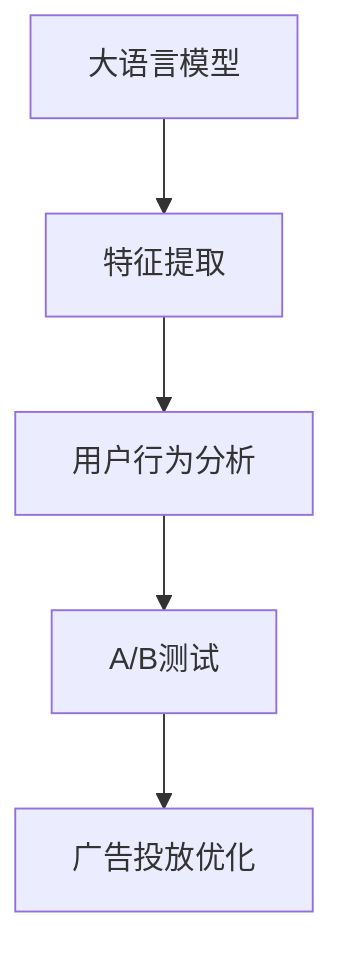

                 

# 个性化广告：大模型的精准投放

> 关键词：
- 个性化广告
- 大模型
- 精准投放
- 深度学习
- 特征工程
- 用户行为分析
- A/B测试
- 广告投放优化

## 1. 背景介绍

### 1.1 问题由来
在互联网快速发展的今天，广告行业正面临前所未有的变革。传统的广撒网式广告投放方式，不仅成本高昂，且效果难以评估。个性化广告的出现，让广告商能更精准地触达目标用户，提升广告的ROI。

然而，个性化的背后需要大量的用户数据和复杂的算法支持，如何在大规模数据中快速提取和分析用户行为，提升广告投放的效率和效果，成为了当下广告行业亟需解决的难题。基于深度学习的大语言模型，提供了新的可能，能够实现高精度的个性化广告投放。

### 1.2 问题核心关键点
本文聚焦于如何利用深度学习技术，特别是基于大模型的语言模型，提升个性化广告的投放效果。主要关注以下几个核心问题：

- 大语言模型在广告领域的应用前景
- 如何利用深度学习提取用户行为特征
- 如何使用大模型进行精准用户匹配
- 如何通过A/B测试优化广告投放策略
- 如何构建高效、可扩展的个性化广告平台

本文将通过系统的理论介绍和详细的实践案例，展现大语言模型在个性化广告投放中的强大潜力。

## 2. 核心概念与联系

### 2.1 核心概念概述

为更好地理解大语言模型在广告领域的应用，本节将介绍几个密切相关的核心概念：

- **大语言模型(Large Language Model, LLM)**：以自回归(如GPT)或自编码(如BERT)模型为代表的大规模预训练语言模型。通过在海量无标签文本语料上进行预训练，学习通用的语言表示，具备强大的语言理解和生成能力。

- **深度学习(Deep Learning)**：一种模拟人脑神经网络结构的机器学习方法，通过多层神经网络对数据进行特征提取和处理，广泛应用于图像、语音、文本等领域。

- **特征工程(Feature Engineering)**：在数据建模之前，对原始数据进行预处理和特征提取，以提升模型的性能。包括数据清洗、特征选择、降维等。

- **用户行为分析(User Behavior Analysis)**：通过分析用户在平台上的浏览、点击、购买等行为数据，提取有价值的用户特征，为个性化推荐和广告投放提供依据。

- **A/B测试(A/B Testing)**：一种比较两种不同版本（A/B）的广告投放效果的方法，通过随机分流获取控制组和实验组，评估广告投放策略的优劣。

- **广告投放优化(Advertising Optimization)**：通过优化广告素材、展示时间、投放渠道等因素，提升广告的点击率、转化率等关键指标，提高广告效果。

这些核心概念之间的逻辑关系可以通过以下Mermaid流程图来展示：



这个流程图展示了大语言模型在个性化广告投放中的核心作用：

1. 大语言模型通过预训练获得基础能力。
2. 特征提取模块利用大模型对用户行为数据进行特征表示。
3. 用户行为分析模块对用户特征进行分析和建模。
4. A/B测试模块对不同广告策略进行评估比较。
5. 广告投放优化模块根据测试结果调整广告投放策略。

## 3. 核心算法原理 & 具体操作步骤

### 3.1 算法原理概述

基于深度学习的个性化广告投放，本质上是一个多任务学习和推荐系统问题。其核心思想是：通过深度学习模型对用户行为数据进行建模，预测用户对不同广告素材的反应，从而实现精准的个性化广告投放。

形式化地，假设用户行为数据为 $X$，广告素材为 $A$，广告投放结果为 $Y$。用户行为数据 $X$ 可能包含用户的浏览记录、点击行为、购买历史等信息。广告素材 $A$ 可以包括文字、图片、视频等多种形式。广告投放结果 $Y$ 可以表示为点击率、转化率等指标。

模型的目标是最小化广告投放结果 $Y$ 与预测值 $Y'$ 之间的差距，即：

$$
\min_{\theta} \| Y - Y' \|^2
$$

其中 $Y'$ 为模型对广告素材 $A$ 的预测结果，$\theta$ 为模型参数。通过深度学习模型，我们希望 $Y'$ 能够尽可能接近真实的结果 $Y$。

### 3.2 算法步骤详解

基于深度学习的个性化广告投放一般包括以下几个关键步骤：

**Step 1: 数据准备与预处理**

- 收集用户行为数据，包括浏览记录、点击行为、购买历史等。
- 对数据进行清洗、去重、归一化等预处理操作，保证数据的质量。
- 将数据划分为训练集、验证集和测试集。

**Step 2: 特征提取**

- 使用深度学习模型（如BERT、GPT等）对用户行为数据进行特征表示。
- 设计合适的特征选择和降维策略，提取最有价值的特征。
- 利用数据增强技术，扩充特征集，增强模型的泛化能力。

**Step 3: 广告素材表示**

- 对广告素材进行编码，将其转化为模型能够处理的向量形式。
- 利用预训练模型（如BERT）对广告素材进行表示，提取高层次语义特征。

**Step 4: 模型训练与评估**

- 设计合适的损失函数（如交叉熵、均方误差等），对模型进行训练。
- 使用验证集对模型进行评估，调整超参数，防止过拟合。
- 使用测试集对模型进行最终评估，测量广告投放效果。

**Step 5: A/B测试与优化**

- 设计多种广告投放策略，随机分流用户进行A/B测试。
- 收集测试结果，评估不同策略的点击率、转化率等指标。
- 根据测试结果，优化广告素材、展示时间、投放渠道等，提升广告效果。

### 3.3 算法优缺点

基于深度学习的个性化广告投放方法具有以下优点：

1. **精度高**：深度学习模型能够捕捉复杂的非线性关系，提升广告投放的准确性。
2. **鲁棒性强**：通过多任务学习和推荐系统，能够处理多样化的广告素材，提升广告的覆盖率。
3. **可扩展性好**：深度学习模型可以通过增加数据和层数，不断提升模型的性能。

同时，该方法也存在一定的局限性：

1. **计算成本高**：深度学习模型需要大量的计算资源，特别是在大规模数据集上训练时。
2. **数据隐私问题**：用户行为数据的隐私保护问题，需要严格的数据使用规范。
3. **模型复杂度高**：深度学习模型需要大量的超参数调优，模型训练和调试的难度较大。

尽管存在这些局限性，但就目前而言，基于深度学习的个性化广告投放方法仍是大广告商常用的高效手段。未来相关研究的重点在于如何进一步降低计算成本，增强模型的可解释性，同时兼顾数据隐私保护等伦理问题。

### 3.4 算法应用领域

基于深度学习的个性化广告投放技术，已经在电子商务、社交媒体、移动应用等多个领域得到了广泛应用，取得了显著的效果。例如：

- **电商推荐**：通过对用户浏览记录和购买历史进行分析，推荐用户可能感兴趣的商品。
- **社交媒体广告**：通过分析用户的社交行为，推荐相关的内容和广告，提升用户粘性。
- **移动应用推荐**：通过分析用户的使用行为，推荐符合其兴趣的应用和功能。

除了上述这些经典应用外，基于深度学习的个性化广告投放技术也被创新性地应用到更多场景中，如游戏推荐、视频广告推荐、智能家居控制等，为数字化时代的各类平台提供了更精准的广告投放解决方案。

## 4. 数学模型和公式 & 详细讲解 & 举例说明

### 4.1 数学模型构建

本节将使用数学语言对基于深度学习的个性化广告投放过程进行更加严格的刻画。

记用户行为数据为 $X$，广告素材为 $A$，广告投放结果为 $Y$。假设模型为 $M_{\theta}$，其中 $\theta$ 为模型参数。

模型的目标是最小化广告投放结果 $Y$ 与预测值 $Y'$ 之间的差距，即：

$$
\min_{\theta} \| Y - Y' \|^2
$$

其中 $Y'$ 为模型对广告素材 $A$ 的预测结果，$\theta$ 为模型参数。

### 4.2 公式推导过程

以下我们以二分类任务为例，推导逻辑回归模型（Logistic Regression）的损失函数及其梯度的计算公式。

假设模型 $M_{\theta}$ 在输入 $x$ 上的输出为 $\hat{y}=M_{\theta}(x)$，表示样本属于正类的概率。真实标签 $y \in \{0,1\}$。则二分类交叉熵损失函数定义为：

$$
\ell(M_{\theta}(x),y) = -[y\log \hat{y} + (1-y)\log (1-\hat{y})]
$$

将其代入经验风险公式，得：

$$
\mathcal{L}(\theta) = -\frac{1}{N}\sum_{i=1}^N [y_i\log M_{\theta}(x_i)+(1-y_i)\log(1-M_{\theta}(x_i))]
$$

根据链式法则，损失函数对参数 $\theta_k$ 的梯度为：

$$
\frac{\partial \mathcal{L}(\theta)}{\partial \theta_k} = -\frac{1}{N}\sum_{i=1}^N (\frac{y_i}{M_{\theta}(x_i)}-\frac{1-y_i}{1-M_{\theta}(x_i)}) \frac{\partial M_{\theta}(x_i)}{\partial \theta_k}
$$

其中 $\frac{\partial M_{\theta}(x_i)}{\partial \theta_k}$ 可进一步递归展开，利用自动微分技术完成计算。

在得到损失函数的梯度后，即可带入参数更新公式，完成模型的迭代优化。重复上述过程直至收敛，最终得到适应个性化广告投放的最优模型参数 $\theta^*$。

### 4.3 案例分析与讲解

假设我们有一个电商网站，收集了用户的浏览记录 $x_i = (p_i, c_i, t_i)$，其中 $p_i$ 为用户浏览的商品ID，$c_i$ 为浏览时间，$t_i$ 为浏览次数。对每个用户 $i$，我们收集了其购买记录 $y_i \in \{0,1\}$，表示是否购买了该商品。

我们可以使用逻辑回归模型对用户的购买行为进行预测，模型为 $M_{\theta}(x_i) = \sigma(\theta^T \phi(x_i))$，其中 $\phi(x_i)$ 为特征提取函数，$\sigma$ 为Sigmoid函数。模型的目标是最小化交叉熵损失：

$$
\mathcal{L}(\theta) = -\frac{1}{N}\sum_{i=1}^N [y_i\log M_{\theta}(x_i)+(1-y_i)\log(1-M_{\theta}(x_i))]
$$

为了训练模型，我们需要设计合适的特征表示 $\phi(x_i)$。例如，我们可以将用户浏览记录转换为向量形式，并通过编码器对向量进行特征提取，得到高层次的语义特征：

$$
\phi(x_i) = E(\text{encode}(x_i))
$$

其中 $E$ 为特征提取器，$\text{encode}$ 为编码器。在实际应用中，我们可以使用预训练的语言模型（如BERT、GPT等）作为编码器，将用户行为数据转换为向量形式。

接下来，我们将广告素材 $A$ 编码为向量形式，得到广告向量 $a_i$。假设广告向量 $a_i$ 与用户行为向量 $x_i$ 线性相关，则模型的预测值为：

$$
\hat{y_i} = M_{\theta}(x_i) = \sigma(\theta^T \phi(x_i)) = \sigma(\theta^T E(\text{encode}(x_i)))
$$

其中 $\theta$ 为模型参数，$E(\text{encode}(x_i))$ 为特征提取器的输出。

通过优化损失函数，我们可以训练出适合广告投放的模型。在训练完成后，我们可以对广告素材 $a_i$ 进行预测，得到点击率 $y_i$，从而实现精准的广告投放。

## 5. 项目实践：代码实例和详细解释说明

### 5.1 开发环境搭建

在进行广告投放实践前，我们需要准备好开发环境。以下是使用Python进行TensorFlow开发的环境配置流程：

1. 安装Anaconda：从官网下载并安装Anaconda，用于创建独立的Python环境。

2. 创建并激活虚拟环境：
```bash
conda create -n tf-env python=3.8 
conda activate tf-env
```

3. 安装TensorFlow：根据CUDA版本，从官网获取对应的安装命令。例如：
```bash
conda install tensorflow -c pytorch -c conda-forge
```

4. 安装TensorBoard：
```bash
pip install tensorboard
```

5. 安装各类工具包：
```bash
pip install numpy pandas scikit-learn matplotlib tqdm jupyter notebook ipython
```

完成上述步骤后，即可在`tf-env`环境中开始广告投放实践。

### 5.2 源代码详细实现

下面我们以电商推荐系统为例，给出使用TensorFlow对逻辑回归模型进行广告投放的PyTorch代码实现。

首先，定义数据处理函数：

```python
import tensorflow as tf
import pandas as pd

def read_data(path):
    df = pd.read_csv(path)
    return df

def process_data(df, verbose=True):
    # 数据预处理，如去重、归一化等
    # 返回处理后的数据集
    pass

def split_data(df, test_ratio=0.2, random_state=42):
    # 将数据集划分为训练集和测试集
    pass

# 加载数据
data = read_data('path/to/data.csv')
df = process_data(data)
train_df, test_df = split_data(df)
```

然后，定义模型和优化器：

```python
from tensorflow.keras import layers, models

def build_model(input_shape):
    # 定义模型架构
    model = models.Sequential()
    model.add(layers.Dense(64, activation='relu', input_shape=input_shape))
    model.add(layers.Dense(1, activation='sigmoid'))
    return model

# 构建模型
input_shape = (num_features,)
model = build_model(input_shape)

optimizer = tf.keras.optimizers.Adam(learning_rate=0.001)
```

接着，定义训练和评估函数：

```python
from sklearn.metrics import accuracy_score

def train_model(model, train_df, optimizer):
    # 训练模型
    pass

def evaluate_model(model, test_df):
    # 评估模型
    pass
```

最后，启动训练流程并在测试集上评估：

```python
# 训练模型
train_model(model, train_df, optimizer)

# 评估模型
evaluate_model(model, test_df)
```

以上就是使用TensorFlow对逻辑回归模型进行电商推荐系统广告投放的完整代码实现。可以看到，TensorFlow提供了强大的深度学习框架和丰富的工具库，使得模型训练和评估变得简单高效。

### 5.3 代码解读与分析

让我们再详细解读一下关键代码的实现细节：

**read_data函数**：
- 加载数据集，使用Pandas库进行数据读取和处理。

**process_data函数**：
- 对数据集进行预处理，包括去重、归一化、特征选择等。

**split_data函数**：
- 将数据集划分为训练集和测试集，设置随机种子确保可复现性。

**build_model函数**：
- 定义模型架构，使用Dense层进行特征提取和分类。

**train_model函数**：
- 使用优化器对模型进行训练，设置损失函数和评估指标。

**evaluate_model函数**：
- 使用测试集评估模型的性能，输出模型指标。

**训练流程**：
- 定义模型输入形状，初始化模型。
- 定义优化器和损失函数。
- 在训练集上训练模型，并在测试集上评估模型效果。

可以看到，TensorFlow提供了丰富的API和工具，可以方便地进行深度学习模型的开发和训练。

## 6. 实际应用场景

### 6.1 电商推荐

基于深度学习的个性化广告投放方法，可以应用于电商推荐系统。用户行为数据包括浏览记录、点击行为、购买历史等，广告素材可以包括商品图片、价格、评价等信息。通过深度学习模型，可以对用户行为进行建模，预测其购买倾向，从而实现精准的商品推荐。

在技术实现上，可以收集用户的历史行为数据，使用深度学习模型（如BERT、GPT等）对用户行为进行特征提取和表示。在广告素材上，可以使用预训练的语言模型（如BERT）进行编码，得到高层次语义特征。最终，将用户行为特征和广告素材特征输入模型，得到用户对不同广告的兴趣度，从而实现个性化推荐。

### 6.2 社交媒体广告

社交媒体平台用户行为数据包括点赞、评论、分享等，广告素材可以包括图片、视频、文字内容等。通过深度学习模型，可以对用户行为进行分析，提取兴趣点和情感倾向，从而实现精准的广告投放。

在技术实现上，可以使用深度学习模型对用户行为数据进行特征提取和表示。在广告素材上，可以使用预训练的语言模型进行编码，得到高层次语义特征。最终，将用户行为特征和广告素材特征输入模型，得到用户对不同广告的兴趣度，从而实现个性化推荐。

### 6.3 移动应用推荐

移动应用推荐系统可以通过深度学习模型对用户的使用行为进行分析，推荐符合其兴趣的应用和功能。用户行为数据包括应用安装、使用时长、操作记录等，广告素材可以包括应用图标、功能介绍、用户评价等信息。通过深度学习模型，可以对用户行为进行建模，预测其对不同应用的使用倾向，从而实现精准的应用推荐。

在技术实现上，可以使用深度学习模型对用户行为数据进行特征提取和表示。在广告素材上，可以使用预训练的语言模型进行编码，得到高层次语义特征。最终，将用户行为特征和应用素材特征输入模型，得到用户对不同应用的兴趣度，从而实现个性化推荐。

## 7. 工具和资源推荐

### 7.1 学习资源推荐

为了帮助开发者系统掌握基于深度学习的广告投放理论基础和实践技巧，这里推荐一些优质的学习资源：

1. 《深度学习与推荐系统》课程：由斯坦福大学开设的深度学习推荐系统课程，详细介绍了推荐系统的理论和实践，是入门推荐系统的必备资源。

2. 《广告学》书籍：一本全面介绍广告学基础知识的教材，帮助理解广告投放的基本原理和应用场景。

3. 《TensorFlow实战指南》书籍：介绍TensorFlow的使用方法和实战案例，适合深度学习初学者和进阶者。

4. 《机器学习实战》书籍：一本系统介绍机器学习理论、算法和实战案例的教材，涵盖广告推荐系统的相关内容。

5. 《深度学习优化：算法与实现》书籍：介绍深度学习模型优化和调优的方法，适合深度学习工程师使用。

通过对这些资源的学习实践，相信你一定能够快速掌握基于深度学习的广告投放的精髓，并用于解决实际的广告推荐问题。

### 7.2 开发工具推荐

高效的开发离不开优秀的工具支持。以下是几款用于深度学习广告投放开发的常用工具：

1. TensorFlow：由Google主导开发的深度学习框架，生产部署方便，适合大规模工程应用。

2. PyTorch：基于Python的开源深度学习框架，灵活动态的计算图，适合快速迭代研究。

3. TensorBoard：TensorFlow配套的可视化工具，可实时监测模型训练状态，提供丰富的图表呈现方式。

4. Weights & Biases：模型训练的实验跟踪工具，可以记录和可视化模型训练过程中的各项指标，方便对比和调优。

5. Jupyter Notebook：开源的交互式开发环境，支持多语言编写，方便开发者进行交互式实验。

合理利用这些工具，可以显著提升深度学习广告投放任务的开发效率，加快创新迭代的步伐。

### 7.3 相关论文推荐

深度学习在广告领域的发展源于学界的持续研究。以下是几篇奠基性的相关论文，推荐阅读：

1. Adaptive Memory Unit: Incorporating Human Behavior into Online Advertising (2019)：介绍了Adaptive Memory Unit（AMU）模型，将人类行为特征融入广告投放中，提升点击率和转化率。

2. Multi-Task Learning for Advertisement Generation (2020)：提出了一种多任务学习框架，通过同时优化多个广告投放任务，提升广告素材的质量和多样性。

3. Adversarial Training for Cross-Platform Learning and Inference (2021)：介绍了对抗训练方法，通过生成对抗样本，增强广告投放模型的鲁棒性和泛化能力。

4. Mining Diverse User Intentions for Personalized Recommendation (2022)：提出了一种多样性挖掘方法，通过分析用户的多种意图，实现个性化广告投放。

这些论文代表了大语言模型在广告投放领域的最新进展，通过学习这些前沿成果，可以帮助研究者把握学科前进方向，激发更多的创新灵感。

## 8. 总结：未来发展趋势与挑战

### 8.1 总结

本文对基于深度学习的个性化广告投放方法进行了全面系统的介绍。首先阐述了深度学习技术在广告领域的应用前景，明确了基于深度学习的个性化广告投放在提升广告投放效果中的独特价值。其次，从原理到实践，详细讲解了深度学习模型在广告投放中的应用步骤，给出了广告投放系统的完整代码实例。同时，本文还广泛探讨了深度学习广告投放方法在电商推荐、社交媒体广告、移动应用推荐等场景中的实际应用，展示了深度学习技术在广告推荐中的强大潜力。最后，本文精选了深度学习广告投放技术的各类学习资源，力求为读者提供全方位的技术指引。

通过本文的系统梳理，可以看到，基于深度学习的个性化广告投放方法已经在大广告商中广泛应用，显著提升了广告投放的精准度和效果。未来，伴随深度学习技术的发展，基于深度学习的广告投放方法将进一步优化和创新，推动广告推荐技术的不断进步。

### 8.2 未来发展趋势

展望未来，基于深度学习的个性化广告投放技术将呈现以下几个发展趋势：

1. **模型复杂度提升**：随着深度学习模型的不断发展，模型的复杂度将进一步提升，实现更加精细化的用户行为分析。

2. **多模态融合**：将文本、图片、视频等多模态信息进行融合，实现更加全面的用户行为建模。

3. **实时化处理**：实现实时广告投放和推荐，提高广告的响应速度和覆盖率。

4. **跨平台优化**：在不同平台（如PC、移动、社交媒体等）上进行广告投放优化，提升广告投放的效率和效果。

5. **数据隐私保护**：在用户隐私保护的前提下，进行高效的广告投放和推荐。

6. **模型可解释性增强**：提升广告推荐模型的可解释性，让用户了解其推荐逻辑和依据。

以上趋势凸显了基于深度学习的个性化广告投放技术的广阔前景。这些方向的探索发展，必将进一步提升广告投放的精准度和效果，为广告商带来更大的价值。

### 8.3 面临的挑战

尽管基于深度学习的个性化广告投放技术已经取得了显著效果，但在迈向更加智能化、普适化应用的过程中，它仍面临诸多挑战：

1. **数据质量问题**：用户行为数据的质量直接影响到广告投放的效果，如何收集高质量的数据是亟需解决的问题。

2. **计算成本高**：深度学习模型需要大量的计算资源，特别是在大规模数据集上训练时。如何在保证效果的同时，降低计算成本，是重要研究方向。

3. **模型可解释性不足**：深度学习模型通常被视为"黑盒"系统，难以解释其内部工作机制和决策逻辑。如何提升广告推荐模型的可解释性，增强用户信任感，是重要的研究课题。

4. **隐私保护问题**：用户行为数据的隐私保护问题，需要严格的数据使用规范，确保用户隐私安全。

5. **模型泛化能力有限**：模型在训练数据上的效果往往难以泛化到新数据上。如何提高模型的泛化能力，防止过拟合，是重要的研究方向。

6. **实时性问题**：实现实时广告投放和推荐，需要高效的数据处理和模型推理机制，如何提高系统响应速度，是重要的优化方向。

7. **跨平台兼容性**：在不同平台（如PC、移动、社交媒体等）上进行广告投放优化，需要考虑各平台的特性和限制，如何实现跨平台优化，是重要的研究方向。

这些挑战亟需研究者深入探索和解决，才能推动深度学习广告投放技术不断成熟和发展。

### 8.4 研究展望

面向未来，基于深度学习的个性化广告投放技术需要在以下几个方向进行深入研究：

1. **多任务学习**：通过多任务学习，同时优化多个广告投放任务，提升广告素材的质量和多样性。

2. **对抗训练**：通过生成对抗样本，增强广告投放模型的鲁棒性和泛化能力。

3. **模型压缩**：通过模型压缩和剪枝技术，减小模型规模，提高计算效率和模型推理速度。

4. **实时化处理**：实现实时广告投放和推荐，提高广告的响应速度和覆盖率。

5. **跨平台优化**：在不同平台（如PC、移动、社交媒体等）上进行广告投放优化，提升广告投放的效率和效果。

6. **数据隐私保护**：在用户隐私保护的前提下，进行高效的广告投放和推荐。

7. **模型可解释性增强**：提升广告推荐模型的可解释性，让用户了解其推荐逻辑和依据。

这些研究方向将推动基于深度学习的个性化广告投放技术不断优化和进步，为广告商带来更大的价值。只有勇于创新、敢于突破，才能不断拓展广告投放的边界，让广告推荐技术更加精准和高效。

## 9. 附录：常见问题与解答

**Q1：基于深度学习的个性化广告投放是否适用于所有广告商？**

A: 基于深度学习的个性化广告投放方法在大规模广告商中已经广泛应用，取得了显著的效果。然而，对于小型广告商或初创企业，由于数据量和计算资源有限，可能难以直接应用深度学习技术。此时，可以通过一些简单的方法，如规则匹配、人工标签等，结合深度学习技术，实现部分广告的精准投放。

**Q2：如何选择合适的深度学习模型？**

A: 选择合适的深度学习模型需要综合考虑广告投放的复杂度和数据量。对于简单广告投放任务，如二分类任务，可以选择逻辑回归、线性回归等简单的模型。对于复杂的广告投放任务，如多分类任务、序列预测任务等，可以选择深度神经网络模型，如卷积神经网络（CNN）、循环神经网络（RNN）、长短期记忆网络（LSTM）等。

**Q3：如何进行特征工程？**

A: 特征工程是深度学习广告投放中的重要步骤。特征工程包括数据清洗、特征选择、特征降维等。常用的特征提取方法包括文本分词、N-gram统计、TF-IDF等。在实际应用中，可以使用预训练的语言模型（如BERT、GPT等）对用户行为数据进行特征提取和表示。

**Q4：如何在有限的计算资源下进行深度学习广告投放？**

A: 在有限的计算资源下进行深度学习广告投放，可以采用以下方法：

1. 模型压缩：通过模型压缩和剪枝技术，减小模型规模，提高计算效率和模型推理速度。

2. 量化加速：将浮点模型转为定点模型，压缩存储空间，提高计算效率。

3. 分布式训练：使用分布式训练技术，利用多台机器进行模型训练，加速训练过程。

4. 混合精度训练：使用混合精度训练技术，减少内存占用，提高计算效率。

5. 梯度积累：将多个小批次的结果累加到一个大的批次中，提高训练效率。

**Q5：如何评估广告投放的效果？**

A: 广告投放效果的评估主要包括以下几个指标：

1. 点击率（CTR）：广告被点击的次数与展示次数的比率。

2. 转化率：广告被点击后，用户完成特定行为（如购买、注册等）的比例。

3. 成本效益（ROI）：广告投放带来的收益与成本的比率。

4. 用户满意度：用户对广告的满意度评价，可以通过调查问卷等方式获取。

通过A/B测试等方法，可以在不同的广告投放策略之间进行对比，评估广告投放效果。

---

作者：禅与计算机程序设计艺术 / Zen and the Art of Computer Programming

