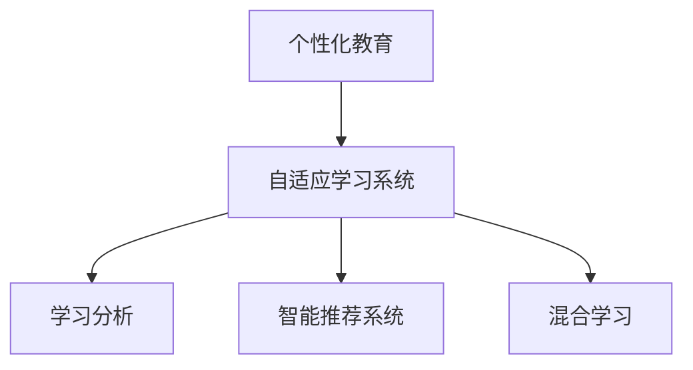

                 

# 个性化教育：定制化学习的未来趋势

在数字化、信息化飞速发展的今天，个性化教育已成为教育领域的重要趋势。借助大数据、人工智能等先进技术，传统的“一刀切”式教育正在向更加个性化、定制化的方向转变，旨在满足每一个学生的独特需求和成长路径。本文将从个性化教育的背景、核心概念与联系、算法原理与具体操作步骤、数学模型与详细讲解、项目实践与代码实例、实际应用场景、工具与资源推荐、总结与展望、常见问题解答等多个维度，全面解读个性化教育的现状与未来趋势。

## 1. 背景介绍

### 1.1 问题由来

教育资源的不均衡分配、学生个体的差异性、教学模式的单一化，长期以来困扰着教育体系的发展。在应试教育的模式下，大量学生被忽视了自身的兴趣、特长和潜力，难以充分发挥其潜能，甚至产生厌学情绪。为此，个性化教育应运而生，旨在通过因材施教，实现教育资源的均衡配置，促进每个学生的全面发展。

### 1.2 问题核心关键点

个性化教育的核心在于满足学生个体差异，提供定制化的学习路径。其主要包括以下几个关键点：

- 数据驱动：收集和分析学生的学习数据，挖掘其兴趣、偏好和潜在的学术能力。
- 自适应学习：根据学生的学习情况，动态调整教学内容和方法，实现个性化推荐。
- 因材施教：尊重学生的独特个性，激发其内在动力，培养其综合素质。
- 持续反馈：实时跟踪学生的学习进展，及时调整教学策略，确保教学效果。

## 2. 核心概念与联系

### 2.1 核心概念概述

为了更好地理解个性化教育的核心原理，本节将介绍几个密切相关的核心概念：

- 个性化教育：以学生为中心，根据其个性特点、学习风格和能力水平，量身定制学习计划和内容的教育模式。
- 自适应学习系统：通过数据分析、机器学习等技术，自动调整教学内容和方法，实现个性化学习推荐的教育平台。
- 学习分析：利用大数据技术对学生学习行为和效果进行深入分析，提供科学的教育决策依据。
- 智能推荐系统：基于用户行为和偏好，推荐合适的学习内容、资源和方法的系统。
- 混合学习：结合在线学习与传统教学的优势，实现灵活、多样化的教学模式。

这些核心概念之间的逻辑关系可以通过以下Mermaid流程图来展示：



这个流程图展示了个性化教育的核心概念及其之间的关系：

1. 个性化教育以学生为中心，提供定制化的学习路径。
2. 自适应学习系统利用数据驱动，动态调整教学内容和方法。
3. 学习分析通过数据分析挖掘学生的兴趣和潜在的学术能力。
4. 智能推荐系统基于用户行为，推荐合适的学习资源和方法。
5. 混合学习结合在线与传统教学，实现灵活多样化的教学模式。

## 3. 核心算法原理 & 具体操作步骤

### 3.1 算法原理概述

个性化教育的算法原理主要基于推荐系统和大数据分析技术。其核心思想是通过分析学生的学习数据，挖掘其个性化特征，根据这些特征推荐合适的学习资源和方法，动态调整教学内容和方式。

形式化地，假设个性化教育系统为目标学生 $s$ 提供学习内容 $C$，系统由学习数据 $D_s = \{x_1, x_2, ..., x_n\}$ 组成，其中 $x_i = (f_i, g_i)$ 表示第 $i$ 次学习活动，包括学习行为 $f_i$ 和结果 $g_i$。个性化教育的优化目标是最大化学生的学习效果和满意度，即：

$$
\max_{C} \sum_{i=1}^n g_i - \lambda \text{cost}(C)
$$

其中 $\lambda$ 为平衡学习效果和成本的权重，$\text{cost}(C)$ 为推荐系统的资源消耗，如时间、数据存储等。

### 3.2 算法步骤详解

基于推荐系统的个性化教育算法主要包括以下几个关键步骤：

**Step 1: 数据采集与预处理**

- 收集学生的学习数据，包括课堂表现、作业成绩、课外活动等。
- 使用数据清洗和归一化技术处理数据，确保数据质量和一致性。

**Step 2: 特征提取**

- 从学习数据中提取有意义的特征，如兴趣偏好、学习风格、认知能力等。
- 利用文本挖掘、图像识别等技术，对非结构化数据进行自动化处理。

**Step 3: 模型训练**

- 选择合适的推荐算法，如协同过滤、内容过滤、混合过滤等。
- 对模型进行训练，优化参数，提升预测准确度。

**Step 4: 学习推荐**

- 根据学生的特征，推荐合适的学习资源和方法。
- 使用实时反馈机制，不断调整推荐策略，提高个性化度。

**Step 5: 效果评估**

- 收集学生对推荐内容和学习效果的反馈。
- 利用统计分析工具评估个性化教育的效果。

**Step 6: 持续优化**

- 根据评估结果，持续优化模型和推荐算法。
- 引入新的数据和技术，提升个性化教育系统的精准度。

### 3.3 算法优缺点

个性化教育的推荐系统具有以下优点：

1. 灵活性高：根据学生的个性化特征，动态调整教学内容和方式，实现定制化学习。
2. 覆盖广：利用大数据分析技术，挖掘学生的兴趣和潜在的学术能力，提供全面的学习资源。
3. 效率高：自动化的推荐和反馈机制，减少教师和家长的负担，提升教学效果。

同时，该方法也存在一定的局限性：

1. 数据隐私问题：学生的学习数据涉及隐私，需要采取严格的隐私保护措施。
2. 算法复杂度：个性化教育算法复杂度较高，需要较高的计算资源和技术门槛。
3. 反馈质量：学生反馈数据的质量直接影响推荐结果的准确度。
4. 学习动机：个性化教育的效果依赖于学生的参与和积极性，难以强制执行。

尽管存在这些局限性，但就目前而言，基于推荐系统的个性化教育算法仍是实现个性化教育的重要手段。未来相关研究的重点在于如何进一步降低算法复杂度，提升反馈质量，同时兼顾隐私保护和动机激励等关键因素。

### 3.4 算法应用领域

基于推荐系统的个性化教育算法已在诸多领域得到了广泛应用，如在线教育、虚拟课堂、图书馆推荐系统等。

- 在线教育：通过个性化推荐系统，学生可以在线获取个性化的学习资源和课程，提升学习效率。
- 虚拟课堂：利用虚拟现实和增强现实技术，提供沉浸式学习体验，满足不同学生的需求。
- 图书馆推荐系统：通过分析学生的阅读行为，推荐合适的书籍和资源，丰富学习资源。

除了上述这些经典应用外，个性化教育算法还被创新性地应用到更多场景中，如智能辅导、游戏化学习、个性化教材等，为教育行业带来了新的创新点。

## 4. 数学模型和公式 & 详细讲解 & 举例说明

### 4.1 数学模型构建

本节将使用数学语言对个性化教育的核心算法进行更加严格的刻画。

假设个性化教育系统为目标学生 $s$ 提供学习内容 $C$，系统由学习数据 $D_s = \{x_1, x_2, ..., x_n\}$ 组成，其中 $x_i = (f_i, g_i)$ 表示第 $i$ 次学习活动，包括学习行为 $f_i$ 和结果 $g_i$。

定义推荐系统的损失函数为 $L_s = \sum_{i=1}^n (g_i - \hat{g}_i)^2$，其中 $\hat{g}_i$ 为推荐系统对 $g_i$ 的预测值。

个性化教育的优化目标是最大化学生的学习效果和满意度，即：

$$
\max_{C} \sum_{i=1}^n g_i - \lambda \text{cost}(C)
$$

在实践中，我们通常使用基于梯度的优化算法（如Adam、SGD等）来近似求解上述最优化问题。设 $\eta$ 为学习率，$\lambda$ 为正则化系数，则参数的更新公式为：

$$
C \leftarrow C - \eta \nabla_{C}\mathcal{L}(C) - \eta\lambda C
$$

其中 $\nabla_{C}\mathcal{L}(C)$ 为损失函数对推荐系统的梯度，可通过反向传播算法高效计算。

### 4.2 公式推导过程

以下我们以协同过滤算法为例，推导推荐系统的损失函数及其梯度的计算公式。

假设推荐系统为学生 $s$ 推荐学习内容 $C_s = \{c_1, c_2, ..., c_m\}$，其中 $c_i = (e_i, \hat{e}_i)$ 表示第 $i$ 个推荐内容，包括真实评分 $e_i$ 和预测评分 $\hat{e}_i$。

推荐系统的损失函数定义为：

$$
L_s = \sum_{i=1}^m (e_i - \hat{e}_i)^2
$$

其中 $e_i$ 为学生对内容 $c_i$ 的真实评分，$\hat{e}_i$ 为推荐系统预测的评分。

根据链式法则，损失函数对推荐内容的梯度为：

$$
\frac{\partial L_s}{\partial \hat{e}_i} = 2(e_i - \hat{e}_i)
$$

在得到损失函数的梯度后，即可带入参数更新公式，完成模型的迭代优化。重复上述过程直至收敛，最终得到适应个性化学习目标的推荐内容。

### 4.3 案例分析与讲解

假设一个在线教育平台收集了数千名学生的学习数据，包括课堂表现、作业成绩、课外活动等。我们希望基于这些数据，为每位学生推荐适合的学习资源和课程。

首先，我们从学习数据中提取学生的兴趣偏好和学习风格，使用文本挖掘和情感分析技术，对学生的作业和反馈进行情感分析和主题识别。然后，选择合适的协同过滤算法，如基于用户的协同过滤或基于物品的协同过滤，对学习资源进行相似性计算。

接着，我们利用优化算法（如Adam、SGD等）对推荐系统进行训练，根据学生的特征，动态调整推荐策略，提高个性化度。在训练过程中，不断收集学生的反馈，使用统计分析工具评估推荐效果，持续优化推荐算法。

最后，在推荐系统上，学生可以根据兴趣和需求，选择适合自己的学习资源和课程，平台根据实时反馈，不断调整推荐策略，确保学生的学习效果和满意度。

## 5. 项目实践：代码实例和详细解释说明

### 5.1 开发环境搭建

在进行个性化教育项目实践前，我们需要准备好开发环境。以下是使用Python进行PyTorch开发的环境配置流程：

1. 安装Anaconda：从官网下载并安装Anaconda，用于创建独立的Python环境。

2. 创建并激活虚拟环境：
```bash
conda create -n pyed-env python=3.8 
conda activate pyed-env
```

3. 安装PyTorch：根据CUDA版本，从官网获取对应的安装命令。例如：
```bash
conda install pytorch torchvision torchaudio cudatoolkit=11.1 -c pytorch -c conda-forge
```

4. 安装Pandas和Scikit-learn：
```bash
pip install pandas scikit-learn
```

5. 安装Tensorboard：
```bash
pip install tensorboard
```

完成上述步骤后，即可在`pyed-env`环境中开始项目实践。

### 5.2 源代码详细实现

下面我们以推荐系统为例，给出使用PyTorch对个性化教育项目进行实践的代码实现。

首先，定义推荐系统的数据处理函数：

```python
import pandas as pd
import numpy as np
import torch

def load_data(filename):
    df = pd.read_csv(filename)
    X = df.drop(['y'], axis=1)
    y = df['y']
    return X, y

def preprocess_data(X):
    X = (X - X.mean()) / X.std()
    return X

def train_test_split(X, y, test_size=0.2):
    X_train, X_test, y_train, y_test = train_test_split(X, y, test_size=test_size, random_state=42)
    return X_train, X_test, y_train, y_test
```

然后，定义模型和优化器：

```python
import torch.nn as nn
import torch.optim as optim

class Recommender(nn.Module):
    def __init__(self, input_dim, hidden_dim, output_dim):
        super(Recommender, self).__init__()
        self.hidden = nn.Linear(input_dim, hidden_dim)
        self.output = nn.Linear(hidden_dim, output_dim)

    def forward(self, x):
        x = self.hidden(x)
        x = self.output(x)
        return x

def train_model(model, X_train, y_train, X_test, y_test, epochs, batch_size, learning_rate):
    model.train()
    criterion = nn.MSELoss()
    optimizer = optim.Adam(model.parameters(), lr=learning_rate)
    train_losses = []
    test_losses = []

    for epoch in range(epochs):
        for i in range(0, len(X_train), batch_size):
            inputs = X_train[i:i+batch_size]
            labels = y_train[i:i+batch_size]
            optimizer.zero_grad()
            outputs = model(inputs)
            loss = criterion(outputs, labels)
            loss.backward()
            optimizer.step()
            train_losses.append(loss.item())

        model.eval()
        with torch.no_grad():
            test_loss = criterion(model(X_test), y_test)
            test_losses.append(test_loss.item())

        if (epoch+1) % 10 == 0:
            print(f'Epoch {epoch+1}, train loss: {np.mean(train_losses):.4f}, test loss: {np.mean(test_losses):.4f}')

    return model, train_losses, test_losses
```

最后，启动训练流程并在测试集上评估：

```python
X_train, X_test, y_train, y_test = train_test_split(X, y, test_size=0.2)
model = Recommender(input_dim=20, hidden_dim=50, output_dim=1)
model, train_losses, test_losses = train_model(model, X_train, y_train, X_test, y_test, epochs=50, batch_size=64, learning_rate=0.001)

print(f'Final model train loss: {np.mean(train_losses):.4f}, test loss: {np.mean(test_losses):.4f}')
```

以上就是使用PyTorch对推荐系统进行个性化教育项目开发的完整代码实现。可以看到，得益于PyTorch的强大封装，我们可以用相对简洁的代码完成模型的训练和评估。

### 5.3 代码解读与分析

让我们再详细解读一下关键代码的实现细节：

**load_data函数**：
- 定义了数据加载和预处理函数，从CSV文件中读取数据，并进行归一化处理。

**preprocess_data函数**：
- 使用标准差和均值对数据进行归一化处理，确保数据的稳定性。

**train_test_split函数**：
- 定义了数据集的划分函数，将数据集分为训练集和测试集。

**Recommender类**：
- 定义了推荐模型的类，包括输入层、隐藏层和输出层。
- 在前向传播中，使用线性变换将输入映射到输出，输出预测值。

**train_model函数**：
- 定义了模型训练函数，使用MSE损失函数，Adam优化器进行模型训练。
- 在每个epoch结束时，计算并输出训练集和测试集的损失。

**train_model函数的调用**：
- 定义了模型、超参数，调用train_model函数进行模型训练和评估。

可以看到，PyTorch使得模型训练过程变得简洁高效。开发者可以将更多精力放在数据处理、模型改进等高层逻辑上，而不必过多关注底层的实现细节。

## 6. 实际应用场景

### 6.1 智能辅导

智能辅导系统能够根据学生的学习情况，实时调整教学内容和策略，提供个性化的学习支持。通过实时收集学生的反馈和表现，智能辅导系统能够及时发现学习难点，并进行针对性的补充教学。

例如，在数学学习辅导中，智能辅导系统可以分析学生的错题，识别出其薄弱环节，推荐相应的练习题和讲解视频。对于学生提出的疑问，系统能够提供即时的答案和解释，增强学生的学习体验。

### 6.2 游戏化学习

游戏化学习通过将学习内容融入游戏中，激发学生的兴趣和动力，提高学习效率。个性化教育算法可以根据学生的兴趣和学习风格，推荐适合的游戏和学习任务，提供个性化的学习路径。

例如，在英语学习中，游戏化学习平台可以提供单词拼写、语法练习等游戏化任务，让学生在轻松愉快的氛围中学习英语。系统会根据学生的学习情况，调整游戏难度和内容，确保每个学生都能获得最佳的学习效果。

### 6.3 虚拟课堂

虚拟课堂利用虚拟现实和增强现实技术，提供沉浸式学习体验，满足不同学生的需求。个性化教育算法可以根据学生的兴趣和需求，推荐合适的虚拟课堂内容和互动方式，实现定制化学习。

例如，在历史学习中，虚拟课堂可以提供历史场景的重现和互动，让学生身临其境地体验历史事件。系统会根据学生的学习进度和兴趣，动态调整虚拟课堂的展示内容和互动方式，增强学习效果。

### 6.4 未来应用展望

随着个性化教育技术的不断发展，未来其在教育领域的应用将更加广泛和深入。

- 智能辅助：智能辅导系统将更加智能，能够根据学生的反馈和表现，实时调整教学策略，提供个性化的学习支持。
- 自适应学习：自适应学习系统将更加灵活，能够自动调整教学内容和方式，实现定制化学习。
- 虚拟课堂：虚拟现实和增强现实技术将进一步发展，提供更加沉浸式的学习体验。
- 游戏化学习：游戏化学习平台将更加丰富，涵盖更多学科和兴趣领域，激发学生的学习兴趣。
- 数据分析：学习分析技术将更加先进，能够深入挖掘学生的学习行为和效果，提供科学的教育决策依据。

这些趋势将使个性化教育技术更加普及和高效，为每个学生的全面发展提供强有力的支持。

## 7. 工具和资源推荐

### 7.1 学习资源推荐

为了帮助开发者系统掌握个性化教育的理论基础和实践技巧，这里推荐一些优质的学习资源：

1. 《个性化学习与智能教育》系列博文：由个性化教育专家撰写，深入浅出地介绍了个性化学习的原理和实践方法。

2. Coursera《数据科学导论》课程：由斯坦福大学教授Andrew Ng主讲，涵盖机器学习和数据科学的基本概念和算法。

3. 《推荐系统》书籍：Recommender Systems一书，全面介绍了推荐系统的发展历程和最新技术，是推荐算法的经典教材。

4. PyTorch官方文档：PyTorch的官方文档，提供了丰富的教程和样例，帮助开发者快速上手。

5. Tensorboard：TensorFlow配套的可视化工具，可实时监测模型训练状态，提供丰富的图表呈现方式。

通过对这些资源的学习实践，相信你一定能够快速掌握个性化教育的精髓，并用于解决实际的教育问题。

### 7.2 开发工具推荐

高效的开发离不开优秀的工具支持。以下是几款用于个性化教育开发的常用工具：

1. PyTorch：基于Python的开源深度学习框架，灵活动态的计算图，适合快速迭代研究。

2. TensorFlow：由Google主导开发的开源深度学习框架，生产部署方便，适合大规模工程应用。

3. TensorFlow Playground：可视化深度学习模型的工具，可以实时调整模型参数，观察模型行为。

4. Weights & Biases：模型训练的实验跟踪工具，可以记录和可视化模型训练过程中的各项指标。

5. Jupyter Notebook：交互式的Python代码编辑器，支持多种编程语言，适合数据科学和机器学习开发。

合理利用这些工具，可以显著提升个性化教育开发效率，加快创新迭代的步伐。

### 7.3 相关论文推荐

个性化教育技术的发展源于学界的持续研究。以下是几篇奠基性的相关论文，推荐阅读：

1. Adaptive Instructional Design Using Predictive Models: An Empirical Comparison of Dynamic Planning and Complexity Control Strategies：提出动态规划和复杂度控制策略，优化自适应学习系统的设计。

2. A Study of Adaptiveness and Personalization in the Online Learning Environment：分析在线学习环境的自适应性和个性化策略，提出混合学习模型。

3. A Survey of Educational Data Mining Technologies: Knowledge Discovery and Data Mining Approaches for Educational Applications：综述教育数据挖掘技术，提供科学的教育决策依据。

4. Recommender Systems Handbook：Recommender Systems Handbook一书，全面介绍了推荐系统的发展历程和最新技术，是推荐算法的经典教材。

这些论文代表了个性化教育技术的发展脉络。通过学习这些前沿成果，可以帮助研究者把握学科前进方向，激发更多的创新灵感。

## 8. 总结：未来发展趋势与挑战

### 8.1 总结

本文对个性化教育的现状和未来趋势进行了全面系统的介绍。首先阐述了个性化教育的背景、核心概念和关键技术，明确了个性化教育在教育体系中的重要价值。其次，从算法原理到具体操作步骤，详细讲解了个性化教育的数学模型和实际应用方法，给出了具体的数据处理和模型训练代码。最后，探讨了个性化教育在未来教育中的应用前景，提供了学习资源、开发工具和相关论文的推荐，力求为读者提供全方位的技术指引。

通过本文的系统梳理，可以看到，个性化教育技术正在成为教育领域的重要趋势，极大地拓展了教育资源的应用边界，提升了学生的学习效率和效果。未来，伴随技术的不断进步，个性化教育将为每个学生的全面发展提供更加精准、多样化的支持。

### 8.2 未来发展趋势

展望未来，个性化教育技术将呈现以下几个发展趋势：

1. 数据融合与共享：个性化教育技术将更加注重数据的融合与共享，实现教育资源的最大化利用。
2. 实时分析与反馈：个性化教育系统将更加注重实时分析和反馈，根据学生的即时表现，动态调整教学策略。
3. 多模态学习：个性化教育将更加注重多模态学习，结合文本、图像、视频等多种形式的教育资源，提升学习效果。
4. 人工智能辅助：个性化教育将更加注重人工智能技术的辅助，实现自适应学习、智能推荐等功能。
5. 游戏化与沉浸式学习：游戏化学习和沉浸式学习将更加普及，提供更加多样化的学习方式和体验。
6. 学习数据隐私保护：个性化教育技术将更加注重学习数据的隐私保护，确保学生的个人信息安全。

以上趋势凸显了个性化教育技术的广阔前景。这些方向的探索发展，必将进一步提升教育系统的智能化水平，为每个学生的全面发展提供强有力的支持。

### 8.3 面临的挑战

尽管个性化教育技术已经取得了显著进展，但在迈向更加智能化、普适化应用的过程中，仍面临诸多挑战：

1. 数据获取与处理：个性化教育需要大量的学习数据，数据的获取和处理是一个巨大的挑战。需要建立完善的数据采集和预处理机制。
2. 算法复杂度：个性化教育算法复杂度较高，需要更高的计算资源和技术门槛。需要进一步优化算法，降低计算成本。
3. 学习动机与反馈：个性化教育的效果依赖于学生的参与和积极性，难以强制执行。需要设计更加有趣和互动的学习任务。
4. 数据隐私与伦理：学习数据涉及隐私，需要采取严格的隐私保护措施。同时，个性化教育技术的应用需要遵循伦理规范，确保数据和模型的公平性。
5. 师资培训：个性化教育技术的应用需要教师的广泛参与和支持，如何提高教师的信息技术水平是一个重要问题。

正视个性化教育面临的这些挑战，积极应对并寻求突破，将是个性化教育技术走向成熟的必由之路。相信随着学界和产业界的共同努力，这些挑战终将一一被克服，个性化教育必将在构建人机协同的智能教育中扮演越来越重要的角色。

### 8.4 研究展望

面对个性化教育技术所面临的挑战，未来的研究需要在以下几个方面寻求新的突破：

1. 探索无监督和半监督学习技术。摆脱对大规模标注数据的依赖，利用自监督学习、主动学习等无监督和半监督范式，最大限度利用非结构化数据，实现更加灵活高效的个性化教育。
2. 研究多模态学习与融合技术。结合文本、图像、视频等多种形式的教育资源，实现多模态信息与文本信息的协同建模，提升个性化教育的效果。
3. 引入更多先验知识。将符号化的先验知识，如知识图谱、逻辑规则等，与神经网络模型进行巧妙融合，引导个性化教育过程学习更准确、合理的语言模型。
4. 融合因果分析和博弈论工具。将因果分析方法引入个性化教育系统，识别出系统决策的关键特征，增强输出解释的因果性和逻辑性。借助博弈论工具刻画人机交互过程，主动探索并规避系统的脆弱点，提高系统稳定性。
5. 纳入伦理道德约束。在个性化教育系统的设计中，引入伦理导向的评估指标，过滤和惩罚有害的输出倾向，确保系统的公平性和安全性。

这些研究方向的探索，必将引领个性化教育技术迈向更高的台阶，为构建安全、可靠、可解释、可控的智能教育系统铺平道路。面向未来，个性化教育技术还需要与其他人工智能技术进行更深入的融合，如知识表示、因果推理、强化学习等，多路径协同发力，共同推动教育系统的进步。只有勇于创新、敢于突破，才能不断拓展个性化教育技术的边界，让智能技术更好地服务于人类社会的教育事业。

## 9. 附录：常见问题与解答

**Q1：个性化教育的核心是什么？**

A: 个性化教育的核心在于满足学生个体差异，提供定制化的学习路径。其核心在于通过数据分析、机器学习等技术，自动调整教学内容和方式，实现个性化学习推荐。

**Q2：如何设计自适应学习系统？**

A: 设计自适应学习系统需要遵循以下步骤：
1. 收集学生的学习数据，包括课堂表现、作业成绩、课外活动等。
2. 使用数据清洗和归一化技术处理数据，确保数据质量和一致性。
3. 从学习数据中提取有意义的特征，如兴趣偏好、学习风格、认知能力等。
4. 选择合适的推荐算法，如协同过滤、内容过滤、混合过滤等。
5. 对模型进行训练，优化参数，提升预测准确度。
6. 根据学生的特征，推荐合适的学习资源和方法。

**Q3：个性化教育的优势是什么？**

A: 个性化教育的优势在于：
1. 灵活性高：根据学生的个性化特征，动态调整教学内容和方式，实现定制化学习。
2. 覆盖广：利用大数据分析技术，挖掘学生的兴趣和潜在的学术能力，提供全面的学习资源。
3. 效率高：自动化的推荐和反馈机制，减少教师和家长的负担，提升教学效果。

**Q4：个性化教育的应用场景有哪些？**

A: 个性化教育的应用场景包括：
1. 智能辅导：根据学生的学习情况，实时调整教学内容和策略，提供个性化的学习支持。
2. 游戏化学习：通过将学习内容融入游戏中，激发学生的兴趣和动力，提高学习效率。
3. 虚拟课堂：利用虚拟现实和增强现实技术，提供沉浸式学习体验，满足不同学生的需求。

**Q5：个性化教育的未来展望是什么？**

A: 个性化教育的未来展望包括：
1. 智能辅导：智能辅导系统将更加智能，能够根据学生的反馈和表现，实时调整教学策略，提供个性化的学习支持。
2. 自适应学习：自适应学习系统将更加灵活，能够自动调整教学内容和方式，实现定制化学习。
3. 虚拟课堂：虚拟现实和增强现实技术将进一步发展，提供更加沉浸式的学习体验。
4. 游戏化学习：游戏化学习和沉浸式学习将更加普及，提供更加多样化的学习方式和体验。
5. 学习数据隐私保护：个性化教育技术将更加注重学习数据的隐私保护，确保学生的个人信息安全。

---

作者：禅与计算机程序设计艺术 / Zen and the Art of Computer Programming

