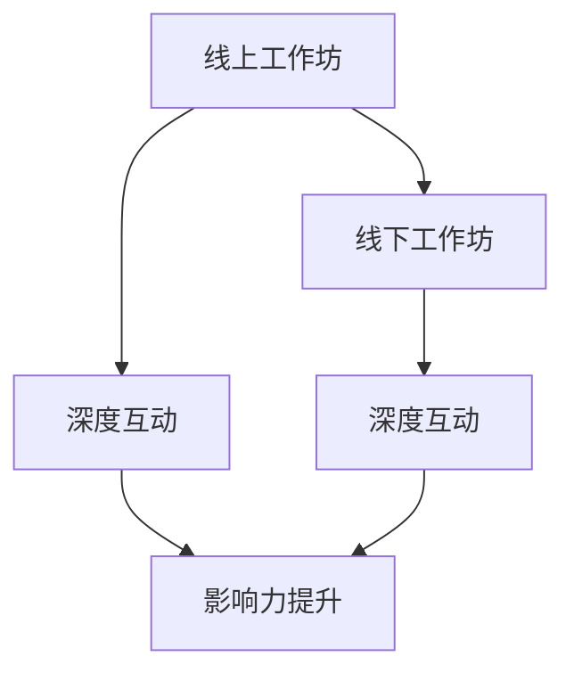

                 

# 举办线上线下工作坊：深度互动提升影响力

## 1. 背景介绍

在数字化转型的浪潮中，工作坊作为一种灵活、互动性强的培训方式，成为了推动团队学习和知识传递的重要手段。线上线下结合的工作坊形式，既能提供及时有效的知识更新，又具备线下面对面的交流互动，适合各类企业和技术团队开展深度学习、知识分享和团队建设活动。本文将系统探讨举办线上线下结合的工作坊的策划、组织和实施，帮助读者了解如何通过精心设计和组织工作坊，提升团队的协作效能和影响力。

## 2. 核心概念与联系

### 2.1 核心概念概述

为深入理解举办线上线下结合工作坊的原理和方法，我们首先介绍几个关键概念：

- **线上工作坊**：指通过互联网技术平台举办的在线培训活动，具备远程、实时、多用户参与的特点。
- **线下工作坊**：指在特定地点面对面进行的线下培训活动，强调互动、交流和实践体验。
- **线上线下结合工作坊**：将线上与线下优势相结合，通过混合模式增强培训效果。
- **深度互动**：指在工作坊中通过多种互动方式，增强参与者的学习体验和参与感，促进知识和技能的深层次理解和应用。
- **影响力提升**：指工作坊通过知识分享、技能训练和团队协作，提升参与者对工作的理解和执行力，增强团队整体效能和影响力。

这些概念之间的逻辑关系可以通过以下Mermaid流程图展示：



这个流程图展示了大语言模型的核心概念及其之间的关系：

1. 线上工作坊和线下工作坊是工作坊的两种形式，结合使用可以弥补各自的不足。
2. 深度互动是线上线下结合的核心手段，通过多种互动方式增强参与者的学习体验。
3. 影响力提升是工作坊的最终目标，通过知识分享和技能训练，增强团队的协作效能。

## 3. 核心算法原理 & 具体操作步骤
### 3.1 算法原理概述

举办线上线下结合的工作坊，本质上是一个知识传递和团队协作的过程。其核心思想是：通过设计有针对性的课程内容，结合线上和线下的互动形式，引导参与者进行深入学习和实践，最终提升团队的整体效能和影响力。

形式化地，假设线上工作坊为 $W_{\text{online}}$，线下工作坊为 $W_{\text{offline}}$，参与者群体为 $P$。则工作坊的目标是最大化参与者 $P$ 的知识水平 $K$ 和协作能力 $C$，即：

$$
\max_{W_{\text{online}}, W_{\text{offline}}} K(P, W_{\text{online}}, W_{\text{offline}}) + C(P, W_{\text{online}}, W_{\text{offline}})
$$

其中 $K$ 表示知识水平，$C$ 表示协作能力，$W_{\text{online}}$ 和 $W_{\text{offline}}$ 分别表示线上和线下工作坊的设计和执行策略。

### 3.2 算法步骤详解

举办线上线下结合的工作坊一般包括以下几个关键步骤：

**Step 1: 需求分析与目标设定**
- 确定培训目标和期望效果，如技能提升、知识更新、团队协作等。
- 分析参与者背景，包括技术水平、知识结构、工作需求等。
- 调研当前知识缺口和培训需求，制定具体的培训计划。

**Step 2: 课程设计与内容准备**
- 根据培训目标和需求，设计线上和线下课程的模块和内容。
- 线上课程应包含视频讲座、在线讨论、互动问答等形式，强调知识传递和互动。
- 线下课程应包含实战练习、案例分析、分组讨论等形式，强调实践和交流。
- 设计多层次的内容，兼顾基础性学习和先进性探索。

**Step 3: 技术平台选择与搭建**
- 选择适合工作坊的技术平台，如Zoom、Teams、腾讯会议等，确保线上互动流畅。
- 搭建互动工具和协作平台，如Slack、Teams、Miro等，支持线上线下混合互动。

**Step 4: 互动形式设计**
- 设计多种互动形式，如线上讨论、实时投票、案例分析、小组讨论等，增强参与感。
- 通过问题引导、案例分析、分组讨论等方式，促进参与者的深入思考和交流。
- 线上课程可以借助直播、录播、回放等多种形式，满足不同时间段的参与需求。

**Step 5: 实施与反馈优化**
- 按照既定计划实施线上和线下课程，确保课程内容、互动形式和协作平台的稳定运行。
- 定期收集参与者的反馈，评估培训效果，调整课程内容和互动形式。
- 持续改进工作坊的组织和实施，提升整体效果。

**Step 6: 结果评估与影响分析**
- 通过参与者知识水平提升、协作能力增强等指标评估培训效果。
- 通过参与者反馈、业务绩效提升、团队效能增强等指标分析工作坊的影响。
- 总结工作坊的实施经验，形成可复用的模板和标准流程。

### 3.3 算法优缺点

举办线上线下结合的工作坊具有以下优点：
1. 灵活性强。线上线下结合的形式可以适应多种时间和地点，便于大规模推广和实施。
2. 互动性强。多种互动形式能够增强参与者的学习体验，提升知识掌握的深度。
3. 覆盖面广。线上工作坊可以覆盖更多区域，线下工作坊可以进行深度交流，扩大影响力。
4. 持续迭代。通过不断收集反馈和优化课程内容，工作坊的效果和影响可以持续提升。

同时，该方法也存在一定的局限性：
1. 资源投入高。线上线下结合形式需要投入较多的技术资源和组织精力。
2. 参与者粘性低。线上课程缺乏面对面的互动，可能影响参与者的持续参与。
3. 知识传递分散。不同时间段的线上线下课程，难以实现知识体系的完整性和连贯性。
4. 协同难度大。线上线下混合形式增加了团队协作的复杂性，需要更多的组织和管理。

尽管存在这些局限性，但就目前而言，线上线下结合的工作坊仍是最具潜力和灵活性的培训方式之一。未来相关研究的重点在于如何进一步优化工作坊的设计和执行，提高其效果和影响力，同时兼顾成本和效率。

### 3.4 算法应用领域

线上线下结合的工作坊在企业培训、技术交流、团队建设等多个领域都有广泛应用，例如：

- **企业内部培训**：利用线上课程进行基础知识和技能培训，线下课程进行实战演练和案例分析，提升员工整体技能和团队协作能力。
- **技术交流活动**：通过线上课程分享最新技术趋势和前沿知识，线下课程进行深度交流和讨论，促进技术创新和知识传播。
- **团队建设活动**：线上课程进行团队协作和沟通技能培训，线下课程进行团队建设游戏和活动，增强团队凝聚力和协作效能。
- **客户教育与培训**：线上课程提供基础的产品知识和操作指南，线下课程进行产品演示和实战演练，提升客户使用体验和满意度。
- **开源社区活动**：线上课程分享开源项目和最佳实践，线下课程进行项目讨论和代码协作，促进社区发展和技术合作。

除了上述这些经典应用外，线上线下结合的工作坊还被创新性地应用于更多场景中，如医疗健康、教育培训、公益活动等，为不同行业提供解决方案，推动技术进步和社会发展。

## 4. 数学模型和公式 & 详细讲解 & 举例说明

### 4.1 数学模型构建

本节将使用数学语言对举办线上线下结合工作坊的数学模型进行更加严格的刻画。

记线上工作坊为 $W_{\text{online}}$，线下工作坊为 $W_{\text{offline}}$，参与者群体为 $P$。定义知识水平提升量为 $K_{\text{imp}}$，协作能力提升量为 $C_{\text{imp}}$。则工作坊的总效果 $E$ 可以表示为：

$$
E = K_{\text{imp}} + C_{\text{imp}}
$$

其中：

$$
K_{\text{imp}} = \mathcal{K}(P, W_{\text{online}}, W_{\text{offline}})
$$

$$
C_{\text{imp}} = \mathcal{C}(P, W_{\text{online}}, W_{\text{offline}})
$$

$\mathcal{K}$ 表示知识提升函数，$\mathcal{C}$ 表示协作提升函数。

### 4.2 公式推导过程

以下我们以一个具体案例，推导知识提升函数 $\mathcal{K}$ 和协作提升函数 $\mathcal{C}$ 的计算公式。

**案例**：假设某公司组织了一次线上线下结合的团队协作培训工作坊，参与者数量为 $N$。在线上课程中，参与者通过观看视频讲座和参与在线讨论，获得了基本的技术知识和最佳实践。在线下课程中，参与者通过实战演练和案例分析，掌握了具体的协作技能和方法。

**知识提升函数**：

- 假设线上课程的视频讲座时长为 $T_{\text{lecture}}$，参与者的在线讨论时长为 $T_{\text{discussion}}$。
- 知识提升函数可以表示为：

$$
\mathcal{K}(P, W_{\text{online}}, W_{\text{offline}}) = K_0 + \alpha \cdot (T_{\text{lecture}} + T_{\text{discussion}})
$$

其中 $K_0$ 为初始知识水平，$\alpha$ 为知识提升系数，表示线上线下课程对知识水平提升的贡献。

**协作提升函数**：

- 假设线下课程的实战演练时长为 $T_{\text{exercise}}$，案例分析时长为 $T_{\text{case}}$，分组讨论时长为 $T_{\text{discussion}}$。
- 协作提升函数可以表示为：

$$
\mathcal{C}(P, W_{\text{online}}, W_{\text{offline}}) = C_0 + \beta \cdot (T_{\text{exercise}} + T_{\text{case}} + T_{\text{discussion}})
$$

其中 $C_0$ 为初始协作能力，$\beta$ 为协作提升系数，表示线下课程对协作能力提升的贡献。

### 4.3 案例分析与讲解

通过上述推导，我们可以看到，线上线下结合的工作坊可以通过课程设计、参与时间等变量，实现知识水平和协作能力的提升。具体案例分析如下：

**案例1**：某软件开发团队组织了一次线上线下结合的团队协作培训工作坊，参与者数量为10人。在线上课程中，参与者观看视频讲座2小时，参与在线讨论1小时。在线下课程中，参与者进行实战演练3小时，案例分析2小时，分组讨论1小时。

**知识提升计算**：

$$
K_{\text{imp}} = K_0 + \alpha \cdot (2 + 1) = K_0 + 3\alpha
$$

**协作提升计算**：

$$
C_{\text{imp}} = C_0 + \beta \cdot (3 + 2 + 1) = C_0 + 6\beta
$$

**总效果计算**：

$$
E = K_{\text{imp}} + C_{\text{imp}} = K_0 + 3\alpha + C_0 + 6\beta
$$

可以看到，通过合理设计课程内容和时间，线上线下结合的工作坊可以显著提升参与者的知识和协作能力，增强团队的整体效能。

## 5. 项目实践：代码实例和详细解释说明
### 5.1 开发环境搭建

在进行工作坊的实践前，我们需要准备好开发环境。以下是使用Python进行工作坊开发的环境配置流程：

1. 安装Anaconda：从官网下载并安装Anaconda，用于创建独立的Python环境。

2. 创建并激活虚拟环境：
```bash
conda create -n workshop-env python=3.8 
conda activate workshop-env
```

3. 安装PyTorch：根据CUDA版本，从官网获取对应的安装命令。例如：
```bash
conda install pytorch torchvision torchaudio cudatoolkit=11.1 -c pytorch -c conda-forge
```

4. 安装各类工具包：
```bash
pip install numpy pandas scikit-learn matplotlib tqdm jupyter notebook ipython
```

完成上述步骤后，即可在`workshop-env`环境中开始工作坊的实践。

### 5.2 源代码详细实现

这里我们以一个具体的线上线下结合工作坊为例，给出使用Python进行课程设计和互动的代码实现。

首先，定义工作坊的课程内容和时长：

```python
from typing import Dict, List

# 课程内容和时长
courses = {
    '线上课程': {'name': '线上课程', 'content': ['视频讲座', '在线讨论'], 'time': [2, 1]},
    '线下课程': {'name': '线下课程', 'content': ['实战演练', '案例分析', '分组讨论'], 'time': [3, 2, 1]}
}

# 初始知识和协作能力
K_0 = 100
C_0 = 50

# 知识提升系数和协作提升系数
alpha = 0.5
beta = 0.8

# 计算总效果
E = K_0 + sum([alpha * time for content, time in courses.values()])
C_imp = C_0 + sum([beta * time for content, time in courses.values()])
```

然后，定义参与者知识水平和协作能力的提升函数：

```python
def calculate_knowledge_impact(courses: Dict[str, List[str]], times: List[int], alpha: float, K_0: int) -> int:
    """计算知识水平提升量"""
    return K_0 + sum([alpha * time for content, time in courses.items()])

def calculate_collaboration_impact(courses: Dict[str, List[str]], times: List[int], beta: float, C_0: int) -> int:
    """计算协作能力提升量"""
    return C_0 + sum([beta * time for content, time in courses.items()])
```

最后，计算工作坊的总效果并进行输出：

```python
K_imp = calculate_knowledge_impact(courses, courses['线上课程']['time'] + courses['线下课程']['time'], alpha, K_0)
C_imp = calculate_collaboration_impact(courses, courses['线下课程']['time'], beta, C_0)
E = K_imp + C_imp

print(f"线上课程总效果：{K_imp}")
print(f"线下课程总效果：{C_imp}")
print(f"工作坊总效果：{E}")
```

以上就是使用Python进行线上线下结合工作坊的代码实现。可以看到，通过简单的函数定义和变量计算，即可实现工作坊效果的量化分析。

### 5.3 代码解读与分析

让我们再详细解读一下关键代码的实现细节：

**课程内容和时长**：
- 使用字典（dictionary）表示课程内容和时间，方便计算和输出。
- 课程内容分为线上课程和线下课程，时间单位为小时。

**初始知识和协作能力**：
- 使用变量表示初始知识和协作能力，方便进行提升计算。

**知识提升函数和协作提升函数**：
- 使用自定义函数 `calculate_knowledge_impact` 和 `calculate_collaboration_impact`，计算线上线下课程的知识水平和协作能力提升量。
- 函数接受课程内容、时间、提升系数和初始值作为参数，返回提升后的值。

**总效果计算**：
- 使用 `E = K_imp + C_imp` 计算工作坊的总效果，其中 `K_imp` 和 `C_imp` 分别为知识水平和协作能力的提升量。

可以看到，通过Python的函数式编程，可以方便地实现工作坊效果的计算和分析。开发者可以根据具体需求，灵活调整课程内容、时间、提升系数等参数，实现不同的效果分析。

## 6. 实际应用场景
### 6.1 智能客服系统

线上线下结合的工作坊可以广泛应用于智能客服系统的构建。传统客服往往需要配备大量人力，高峰期响应缓慢，且一致性和专业性难以保证。通过线上线下结合的工作坊，可以7x24小时不间断服务，快速响应客户咨询，用自然流畅的语言解答各类常见问题。

在技术实现上，可以组织客服团队进行定期的线上线下结合培训，提升客服人员的沟通技巧和问题解决能力。线下课程可以模拟真实客户对话，进行实战演练和案例分析，提升客服人员的业务水平和应急处理能力。

### 6.2 金融舆情监测

金融机构需要实时监测市场舆论动向，以便及时应对负面信息传播，规避金融风险。线上线下结合的工作坊可以用于培养金融舆情监测团队，提升其分析能力和应急响应能力。

具体而言，可以组织金融分析师团队进行定期的线上线下结合培训，学习舆情分析的工具和技术，提升其数据处理和预测能力。线下课程可以进行实战演练和案例分析，帮助分析师更好地理解和应用舆情分析工具，提升其信息筛选和预警能力。

### 6.3 个性化推荐系统

当前的推荐系统往往只依赖用户的历史行为数据进行物品推荐，无法深入理解用户的真实兴趣偏好。通过线上线下结合的工作坊，可以提升推荐团队的综合素质和协作能力，推动个性化推荐系统的持续优化和创新。

在技术实现上，可以组织推荐团队进行定期的线上线下结合培训，学习推荐算法和数据处理技术，提升其数据分析和算法优化能力。线下课程可以进行实战演练和案例分析，帮助推荐团队更好地理解用户需求和推荐系统的工作原理，提升其推荐效果和用户满意度。

### 6.4 未来应用展望

随着线上线下结合的工作坊技术的发展，未来将在更多领域得到应用，为不同行业提供解决方案，推动技术进步和社会发展。

在智慧医疗领域，工作坊可以用于培养医疗团队，提升其技术水平和协作能力，推动医疗数字化转型。

在智能教育领域，工作坊可以用于提升教师的教学技能和教育水平，推动教育公平和教育质量提升。

在智慧城市治理中，工作坊可以用于培训城市管理人员，提升其数据分析和应急处理能力，推动城市管理的智能化和精细化。

此外，在企业生产、社会治理、文娱传媒等众多领域，线上线下结合的工作坊也将不断涌现，为不同行业提供解决方案，推动技术进步和社会发展。相信随着技术的日益成熟，工作坊的形式和内容将更加丰富多样，其应用场景也将不断扩展。

## 7. 工具和资源推荐
### 7.1 学习资源推荐

为了帮助开发者系统掌握线上线下结合工作坊的理论基础和实践技巧，这里推荐一些优质的学习资源：

1. **《线上线下混合学习：设计、实施与评估》系列博文**：由教育技术专家撰写，深入浅出地介绍了线上线下混合学习的原理、方法和评估工具。

2. **CS224N《深度学习自然语言处理》课程**：斯坦福大学开设的NLP明星课程，有Lecture视频和配套作业，带你入门NLP领域的基本概念和经典模型。

3. **《混合学习与知识建构》书籍**：介绍了混合学习的理论基础和实践方法，提供了大量案例和工具，帮助你设计高效的学习体验。

4. **Moodle平台**：开源的教育管理平台，支持线上线下的课程设计和互动，适合用于工作坊的组织和管理。

5. **Google Classroom**：Google提供的在线教学平台，支持多种互动工具和协作功能，适合用于线上线下的混合学习。

通过对这些资源的学习实践，相信你一定能够快速掌握线上线下结合工作坊的设计和实施，提升团队的协作效能和影响力。

### 7.2 开发工具推荐

高效的开发离不开优秀的工具支持。以下是几款用于线上线下结合工作坊开发的常用工具：

1. **Zoom、Teams、腾讯会议**：常用的视频会议平台，支持实时互动和屏幕共享，适合用于线上课程的组织和实施。
2. **Slack、Teams、Miro**：常用的协作工具，支持在线讨论、文件共享和实时编辑，适合用于线下课程的协作和交流。
3. **Google Classroom**：Google提供的在线教学平台，支持多种互动工具和协作功能，适合用于线上线下的混合学习。
4. **Jupyter Notebook**：支持Python代码的交互式开发和文档记录，方便进行代码分析和输出。
5. **Jupytext**：Jupyter Notebook和Markdown的互操作工具，支持将Notebook文档导出为Markdown格式，方便分享和协作。

合理利用这些工具，可以显著提升线上线下结合工作坊的开发效率，加快创新迭代的步伐。

### 7.3 相关论文推荐

线上线下结合的工作坊技术的发展源于学界的持续研究。以下是几篇奠基性的相关论文，推荐阅读：

1. **《混合学习与知识建构》**：探讨了混合学习的理论基础和实践方法，提供了大量案例和工具，帮助你设计高效的学习体验。
2. **《线上线下混合学习：设计、实施与评估》**：介绍了线上线下混合学习的原理、方法和评估工具，提供了大量案例和工具，帮助你设计高效的学习体验。
3. **《混合学习的未来》**：展望了混合学习的未来发展趋势和挑战，探讨了如何通过技术手段提升混合学习的质量和效果。
4. **《混合学习的效果评估》**：介绍了混合学习效果评估的方法和工具，帮助你评估和优化混合学习的效果。
5. **《线上线下混合学习的设计与实施》**：介绍了线上线下混合学习的流程和实施步骤，帮助你系统地设计和实施混合学习活动。

这些论文代表了大语言模型微调技术的发展脉络。通过学习这些前沿成果，可以帮助研究者把握学科前进方向，激发更多的创新灵感。

## 8. 总结：未来发展趋势与挑战
### 8.1 总结

本文对线上线下结合的工作坊进行系统介绍。首先阐述了线上线下结合工作坊的策划、组织和实施的原理和方法，明确了工作坊在提升团队协作效能和影响力方面的独特价值。其次，从原理到实践，详细讲解了线上线下结合工作坊的数学模型和操作步骤，给出了工作坊的代码实例和详细解释。同时，本文还广泛探讨了工作坊在智能客服、金融舆情、个性化推荐等多个行业领域的应用前景，展示了工作坊范式的巨大潜力。此外，本文精选了工作坊技术的各类学习资源，力求为读者提供全方位的技术指引。

通过本文的系统梳理，可以看到，线上线下结合的工作坊是提升团队协作效能和影响力的一种有效方式，能够通过精心设计和组织，实现知识传递和技能训练的目标。随着技术的日益成熟，工作坊形式和内容的不断丰富，其应用场景也将不断扩展，为不同行业提供解决方案，推动技术进步和社会发展。

### 8.2 未来发展趋势

展望未来，线上线下结合的工作坊技术将呈现以下几个发展趋势：

1. **技术平台多样化**：随着在线教育平台的不断发展，新的技术平台和工具将不断涌现，为工作坊提供更多选择和支持。
2. **内容形式丰富化**：除了传统的视频讲座、在线讨论、实战演练等形式，还将出现更多创新性的内容形式，如虚拟现实、增强现实等，提升学习体验和互动效果。
3. **协作工具智能化**：随着AI技术的发展，协作工具将越来越智能化，能够自动记录和分析参与者的学习行为，提供个性化的学习建议和支持。
4. **数据驱动决策**：通过大数据分析，能够更好地评估和优化工作坊的效果，实现更科学、高效的教学设计。
5. **跨界融合创新**：工作坊将与其他教育技术、企业培训、知识管理等领域的创新融合，推动更多行业实现数字化转型。

以上趋势凸显了线上线下结合工作坊技术的广阔前景。这些方向的探索发展，必将进一步提升工作坊的效果和影响力，为不同行业提供更多解决方案。

### 8.3 面临的挑战

尽管线上线下结合的工作坊技术已经取得了一定成果，但在迈向更加智能化、普适化应用的过程中，仍面临诸多挑战：

1. **资源投入高**：线上线下结合形式需要投入较多的技术资源和组织精力，包括技术平台、互动工具和协作平台的选择和搭建。
2. **技术实现复杂**：线上线下结合工作坊涉及多种技术和工具的集成和协调，实现起来较为复杂。
3. **参与者管理难**：线上线下结合形式增加了团队协作的复杂性，需要更多的组织和管理。
4. **知识传递分散**：不同时间段的线上线下课程，难以实现知识体系的完整性和连贯性。
5. **效果评估困难**：工作坊的效果评估需要综合考虑多种指标，如知识水平提升、协作能力增强等，评估过程较为复杂。

尽管存在这些挑战，但随着技术的不断进步和实践经验的积累，这些挑战终将逐步得到解决，线上线下结合的工作坊必将实现更加广泛的推广和应用。

### 8.4 研究展望

面向未来，线上线下结合的工作坊技术需要从以下几个方面进行深入研究：

1. **技术平台优化**：开发更多易用、高效的技术平台和工具，降低工作坊的实施门槛和复杂度。
2. **内容设计创新**：探索更多创新性的内容形式，提升学习体验和互动效果。
3. **协作工具智能化**：研究和开发智能化协作工具，提升协作效率和效果。
4. **数据驱动优化**：通过大数据分析，实现更科学、高效的教学设计和效果评估。
5. **跨界融合创新**：推动工作坊与其他教育技术、企业培训、知识管理等领域的融合，推动更多行业实现数字化转型。

这些研究方向的探索，必将引领线上线下结合的工作坊技术迈向更高的台阶，为不同行业提供更多解决方案，推动技术进步和社会发展。

## 9. 附录：常见问题与解答

**Q1：线上线下结合的工作坊适用于所有培训场景吗？**

A: 线上线下结合的工作坊适用于各类企业和技术团队，特别是对知识更新和技能提升有较高要求的培训场景。但并非所有培训场景都适合采用线上线下结合的形式，需要根据具体需求和特点进行选择。

**Q2：线上线下结合的工作坊能否提高团队的协作效能？**

A: 线上线下结合的工作坊通过多种互动形式和实践演练，能够显著提升团队的协作效能和沟通技巧。线下课程能够促进团队成员的面对面交流和深度互动，增强团队凝聚力和协作能力。

**Q3：线上线下结合的工作坊的资源投入高吗？**

A: 线上线下结合的工作坊需要投入较多的技术资源和组织精力，包括技术平台、互动工具和协作平台的搭建和维护。但相比于传统的线下培训，线上线下结合的形式更加灵活和高效，能够在更短的时间内实现较大的效果提升。

**Q4：线上线下结合的工作坊的效果评估标准是什么？**

A: 线上线下结合的工作坊效果评估可以从多个维度进行，如知识水平提升、协作能力增强、项目完成质量等。一般采用问卷调查、知识测试、项目评估等方式，结合定量分析和定性评价，全面评估工作坊的效果和影响力。

**Q5：线上线下结合的工作坊对参与者的技术水平有要求吗？**

A: 线上线下结合的工作坊对参与者的技术水平有一定要求，但并非必须具备高超的技术能力。通过合理设计课程内容和互动形式，能够帮助参与者逐步提升技术和知识水平。

总之，线上线下结合的工作坊是一种高效、灵活的培训方式，能够通过多种互动形式和实践演练，提升团队的协作效能和沟通技巧，推动技术进步和社会发展。尽管实施过程中面临一些挑战，但随着技术的不断进步和实践经验的积累，这些挑战终将逐步得到解决。面向未来，线上线下结合的工作坊技术将继续发展，推动更多行业实现数字化转型，为经济社会发展注入新的动力。

