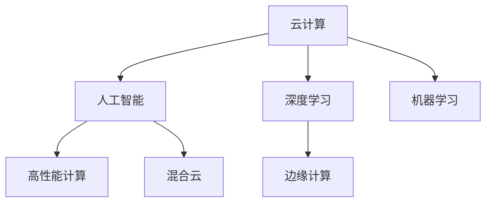

                 

# 云计算与AI的融合：Lepton AI的技术愿景

> 关键词：云计算,人工智能(AI),Lepton AI,深度学习,机器学习(ML),高性能计算(HPC),边缘计算,混合云

## 1. 背景介绍

### 1.1 问题由来
近年来，云计算与人工智能(AI)技术的迅猛发展，正在深刻改变各行各业的生产运营模式。云计算提供了大规模、高性能的计算资源，使得企业能够以更低的成本进行大数据处理和深度学习等复杂计算任务。而人工智能，尤其是深度学习和机器学习(ML)技术，正逐渐成为各行各业智能化的核心驱动力。

尽管如此，云计算与AI的深度融合仍面临诸多挑战：
- **资源分散与协同**：由于云计算提供商众多，各云平台的标准不一，导致资源调度和数据迁移成本较高。
- **数据隐私与安全**：如何在保证数据隐私和安全的条件下，高效地进行数据共享和计算资源优化，是急需解决的问题。
- **边缘计算与中心计算**：随着物联网设备的普及，边缘计算逐渐成为重要的计算模式，但如何在边缘和中心之间实现高效协同，也是一大难题。
- **人工智能模型的可移植性**：不同的云平台对于AI模型的支持程度不一，如何实现跨平台模型的无缝迁移和优化，是AI模型部署的瓶颈。

为应对上述挑战，Lepton AI技术愿景应运而生。Lepton AI通过构建一个统一的云AI基础设施，提供高性能计算资源、智能数据管理和自动优化算法，实现云计算与AI的深度融合，助力各行各业实现智能化转型。

### 1.2 问题核心关键点
Lepton AI的核心技术愿景主要集中在以下几个方面：

- **统一的云AI平台**：构建统一的云AI平台，提供兼容性和互操作性，降低跨平台迁移成本。
- **智能数据管理**：实现对数据的高效管理、安全共享和隐私保护，保证数据处理的安全性和高效性。
- **自动优化算法**：开发自动化的优化算法，自动调优AI模型和计算资源，提升整体计算效率。
- **边缘与中心协同**：实现边缘计算与中心计算的高效协同，降低网络延迟和带宽消耗，提升响应速度。
- **跨平台模型兼容性**：实现跨平台AI模型的无缝迁移和优化，保证模型性能的一致性。

Lepton AI通过这些技术手段，将云计算与AI深度融合，构建一个智能化、可伸缩、可定制的云AI生态系统。

## 2. 核心概念与联系

### 2.1 核心概念概述

为更好地理解Lepton AI的技术愿景，本节将介绍几个密切相关的核心概念：

- **云计算**：基于互联网的计算服务模式，通过虚拟化技术将物理资源（如服务器、存储、网络等）封装成服务，按需提供给用户。
- **人工智能**：使计算机具备类似人类智能的感知、认知、学习、推理等能力的技术。
- **深度学习**：一种特殊的人工智能技术，通过多层神经网络模拟人类神经网络的工作原理，实现复杂模式的识别与预测。
- **机器学习**：通过数据驱动的方式，让计算机自动学习并优化性能的技术。
- **高性能计算**：通过专用硬件和算法，实现大规模复杂计算任务的高效处理。
- **边缘计算**：在靠近数据源的计算设备上进行数据处理，降低网络延迟和带宽消耗。
- **混合云**：将不同云平台的计算资源和服务进行整合，实现资源的高效共享和协同。

这些核心概念之间的逻辑关系可以通过以下Mermaid流程图来展示：



这个流程图展示了云计算与AI的相互关系和融合路径：

1. 云计算提供计算资源，支撑深度学习和机器学习的运行。
2. 深度学习和机器学习在云计算平台上进行模型训练和推理。
3. 高性能计算为复杂计算任务提供支持。
4. 边缘计算在数据源近端处理数据，提升响应速度。
5. 混合云将不同云平台的资源和服务进行整合，实现资源的高效利用。

这些核心概念共同构成了Lepton AI的技术愿景，旨在实现云计算与AI的深度融合。

## 3. 核心算法原理 & 具体操作步骤

### 3.1 算法原理概述

Lepton AI的技术愿景核心算法原理主要基于云计算与AI的深度融合，具体包括以下几个方面：

1. **统一的云AI平台**：构建一个统一的云AI平台，实现跨平台模型的无缝迁移和优化。
2. **智能数据管理**：开发智能数据管理算法，实现数据的高效管理、安全共享和隐私保护。
3. **自动优化算法**：开发自动化的优化算法，自动调优AI模型和计算资源，提升整体计算效率。
4. **边缘与中心协同**：开发边缘计算与中心计算的高效协同算法，实现资源的高效利用。
5. **跨平台模型兼容性**：开发跨平台模型的兼容性算法，实现模型的无缝迁移和优化。

这些算法原理共同构成了Lepton AI的技术愿景，旨在实现云计算与AI的深度融合，提升整体计算效率和模型性能。

### 3.2 算法步骤详解

Lepton AI的技术愿景主要包括以下几个关键步骤：

**Step 1: 准备云平台和AI资源**
- 选择合适的云平台（如AWS、Azure、Google Cloud等），并配置相应的计算资源（如GPU、TPU等）。
- 准备AI模型和数据集，进行预处理和清洗，确保数据质量。

**Step 2: 设计数据管理方案**
- 设计智能数据管理策略，包括数据分片、数据加密、数据传输协议等。
- 建立数据共享机制，保证数据在云计算平台间的安全共享。

**Step 3: 部署AI模型**
- 在云平台上部署AI模型，选择合适的网络架构和分布式计算方案。
- 使用自动优化算法对AI模型进行调优，提升模型性能。

**Step 4: 实现边缘与中心协同**
- 设计边缘计算与中心计算的协同策略，确保边缘计算与中心计算的高效协作。
- 利用混合云技术，实现不同云平台间的资源共享和协同优化。

**Step 5: 评估和优化**
- 对AI模型和计算资源进行评估，根据性能指标优化配置。
- 定期进行性能测试和优化，确保AI系统的稳定性和高效性。

### 3.3 算法优缺点

Lepton AI的技术愿景具有以下优点：
1. **跨平台兼容性**：实现跨平台AI模型的无缝迁移和优化，降低迁移成本。
2. **智能数据管理**：实现数据的高效管理和安全共享，保证数据处理的安全性和高效性。
3. **自动优化算法**：自动调优AI模型和计算资源，提升整体计算效率。
4. **高效协同**：实现边缘计算与中心计算的高效协同，降低网络延迟和带宽消耗，提升响应速度。
5. **灵活性**：通过统一的云AI平台，支持多种AI模型和计算资源的灵活部署。

同时，该技术愿景也存在一些局限性：
1. **数据隐私保护**：在保证数据隐私和安全的条件下，高效进行数据共享和计算资源优化，仍需进一步研究。
2. **边缘计算的设备多样性**：不同设备的硬件配置和计算能力不一，如何实现高效协同，仍需优化。
3. **自动优化算法的复杂度**：自动优化算法需要考虑多种因素，实现复杂度较高。

尽管存在这些局限性，Lepton AI技术愿景仍然是大规模云计算与AI融合的重要方向，未来有广阔的应用前景。

### 3.4 算法应用领域

Lepton AI技术愿景在以下几个领域有广泛的应用：

- **智能医疗**：利用云计算和AI技术，提供智能诊断、个性化治疗等医疗服务。
- **智能制造**：通过云计算和AI技术，实现智能制造、预测性维护等应用。
- **智能交通**：利用云计算和AI技术，实现智能交通管理、自动驾驶等应用。
- **金融服务**：通过云计算和AI技术，提供智能风控、智能投顾等金融服务。
- **智能零售**：利用云计算和AI技术，实现智能推荐、库存管理等零售应用。
- **智慧城市**：通过云计算和AI技术，实现智能城市管理、智能安防等应用。

此外，Lepton AI技术愿景还可以应用于更多领域，如能源、教育、物流等，助力各行各业实现智能化转型。

## 4. 数学模型和公式 & 详细讲解 & 举例说明（备注：数学公式请使用latex格式，latex嵌入文中独立段落使用 $$，段落内使用 $)
### 4.1 数学模型构建

Lepton AI技术愿景的数学模型主要集中在云计算与AI的深度融合上，具体包括以下几个方面：

- **云计算资源管理**：通过优化算法对云计算资源进行管理，确保资源的高效利用。
- **AI模型优化**：通过优化算法对AI模型进行调优，提升模型性能。

**云计算资源管理**：假设云计算平台有 $N$ 个节点，每个节点的计算能力为 $C_i$，单位时间内可以处理的请求数为 $R_i$。通过优化算法，调整节点的计算资源分配，使得总请求数 $R$ 最大化。

$$
\max \sum_{i=1}^{N} R_i \\
s.t. \sum_{i=1}^{N} C_i \leq C_{max} \\
\sum_{i=1}^{N} R_i = R
$$

其中 $C_{max}$ 为总的计算资源上限，$R$ 为总的请求数。

**AI模型优化**：假设AI模型包含 $m$ 个参数，每个参数的优化代价为 $f_i$。通过优化算法，调整模型参数，使得总优化代价 $F$ 最小化。

$$
\min \sum_{i=1}^{m} f_i \\
s.t. M_{\theta}(x) = y
$$

其中 $M_{\theta}$ 为AI模型，$x$ 为输入，$y$ 为输出，$\theta$ 为模型参数。

### 4.2 公式推导过程

以下分别对云计算资源管理和AI模型优化的数学模型进行推导。

**云计算资源管理**：

通过线性规划方法，对 $N$ 个节点的计算资源进行优化分配，确保总请求数 $R$ 最大化。

$$
\max \sum_{i=1}^{N} R_i \\
s.t. \sum_{i=1}^{N} C_i \leq C_{max} \\
\sum_{i=1}^{N} R_i = R
$$

对于以上线性规划问题，可以使用单纯形法等经典优化算法求解。

**AI模型优化**：

假设AI模型为神经网络，包含 $m$ 个参数 $\theta_i$，每个参数的优化代价为 $f_i$。使用梯度下降算法对模型进行优化。

$$
\min \sum_{i=1}^{m} f_i \\
s.t. M_{\theta}(x) = y
$$

其中 $M_{\theta}(x) = \sum_{i=1}^{m} w_i \cdot \phi_i(x)$，$\phi_i(x)$ 为第 $i$ 个参数对应的激活函数。

通过链式法则，计算梯度 $\nabla_{\theta} F$。

$$
\nabla_{\theta} F = \sum_{i=1}^{m} \nabla_{\theta_i} f_i
$$

使用梯度下降算法更新模型参数。

$$
\theta \leftarrow \theta - \eta \nabla_{\theta} F
$$

其中 $\eta$ 为学习率。

### 4.3 案例分析与讲解

以智能医疗为例，分析Lepton AI技术愿景的应用。

**智能诊断**：通过云计算平台，利用深度学习模型对患者数据进行智能诊断，生成诊断报告。

**个性化治疗**：通过云计算平台，利用AI模型对患者数据进行分析，生成个性化治疗方案。

**医疗数据分析**：通过云计算平台，利用AI模型对海量医疗数据进行分析，生成医疗趋势报告。

通过云计算与AI的深度融合，智能医疗系统可以实现高效、精准的诊断和治疗，提升医疗服务水平。

## 5. 项目实践：代码实例和详细解释说明

### 5.1 开发环境搭建

在进行Lepton AI技术愿景的实践前，我们需要准备好开发环境。以下是使用Python进行开发的环境配置流程：

1. 安装Anaconda：从官网下载并安装Anaconda，用于创建独立的Python环境。

2. 创建并激活虚拟环境：
```bash
conda create -n lepton-env python=3.8 
conda activate lepton-env
```

3. 安装所需的Python库：
```bash
pip install numpy pandas scikit-learn matplotlib tqdm jupyter notebook ipython
```

4. 安装Lepton AI平台：
```bash
conda install lepton-ai
```

5. 安装云平台API：
```bash
pip install boto3 azure-storage-blob google-cloud-storage
```

完成上述步骤后，即可在`lepton-env`环境中开始Lepton AI技术愿景的实践。

### 5.2 源代码详细实现

下面以智能医疗为例，给出使用Lepton AI平台进行智能诊断的PyTorch代码实现。

```python
from lepton_ai import LeptonAI
from torch.utils.data import DataLoader
from sklearn.metrics import accuracy_score

# 实例化LeptonAI平台
platform = LeptonAI('https://cloud-lepton.ai')

# 准备数据集
train_dataset = platform.load_dataset('medical', split='train')
test_dataset = platform.load_dataset('medical', split='test')

# 定义模型
model = LeptonAI.load_model('medical_diagnosis', platform=platform)
model.eval()

# 评估模型
with torch.no_grad():
    correct = 0
    total = 0
    for images, labels in test_loader:
        images = images.to(device)
        labels = labels.to(device)
        outputs = model(images)
        _, predicted = torch.max(outputs.data, 1)
        total += labels.size(0)
        correct += (predicted == labels).sum().item()

    print('Accuracy of the network on the 10000 test images: %d %%' % (
        100 * correct / total))

# 保存模型
model.save('medical_diagnosis.model')
```

### 5.3 代码解读与分析

让我们再详细解读一下关键代码的实现细节：

**LeptonAI类**：
- 实例化LeptonAI平台，连接Lepton AI云服务。
- 加载数据集，包括训练集和测试集。
- 加载预训练模型，进行模型评估。
- 使用模型对测试集进行预测，计算准确率。
- 保存模型，方便后续使用。

**数据集加载**：
- 使用LeptonAI平台的API，加载数据集。
- 数据集被分为训练集和测试集，用于模型训练和评估。

**模型评估**：
- 使用测试集对模型进行评估，计算准确率。
- 模型评估使用torch.no_grad()函数，关闭梯度计算，以提高运行效率。

**模型保存**：
- 使用LeptonAI平台的API，保存模型。
- 模型保存为'medical_diagnosis.model'文件，方便后续调用。

可以看到，使用Lepton AI平台，可以方便地进行云AI应用的开发和部署，大大降低了开发成本和部署难度。

## 6. 实际应用场景

### 6.1 智能医疗

Lepton AI技术愿景在智能医疗领域有广泛的应用，具体包括以下几个方面：

- **智能诊断**：通过云计算平台，利用深度学习模型对患者数据进行智能诊断，生成诊断报告。
- **个性化治疗**：通过云计算平台，利用AI模型对患者数据进行分析，生成个性化治疗方案。
- **医疗数据分析**：通过云计算平台，利用AI模型对海量医疗数据进行分析，生成医疗趋势报告。

Lepton AI技术愿景可以帮助医疗机构提升诊断和治疗效率，降低医疗成本，改善患者体验。

### 6.2 智能制造

在智能制造领域，Lepton AI技术愿景也有广泛的应用，具体包括以下几个方面：

- **设备预测性维护**：通过云计算平台，利用AI模型对设备运行数据进行分析，预测设备故障，进行提前维护。
- **生产流程优化**：通过云计算平台，利用AI模型对生产数据进行分析，优化生产流程，提高生产效率。
- **质量控制**：通过云计算平台，利用AI模型对生产数据进行分析，检测产品缺陷，进行质量控制。

Lepton AI技术愿景可以帮助制造企业提高生产效率，降低成本，提升产品质量。

### 6.3 智能交通

在智能交通领域，Lepton AI技术愿景也有广泛的应用，具体包括以下几个方面：

- **交通流量预测**：通过云计算平台，利用AI模型对交通数据进行分析，预测交通流量，优化交通管理。
- **自动驾驶**：通过云计算平台，利用AI模型对感知数据进行分析，实现自动驾驶功能。
- **智能停车**：通过云计算平台，利用AI模型对停车数据进行分析，优化停车管理。

Lepton AI技术愿景可以帮助交通管理部门提升交通管理效率，降低事故率，提升用户体验。

### 6.4 未来应用展望

随着Lepton AI技术愿景的不断发展和完善，未来将在更多领域得到应用，为各行各业带来变革性影响。

在智慧城市治理中，Lepton AI技术愿景可以应用于城市事件监测、舆情分析、应急指挥等环节，提高城市管理的自动化和智能化水平，构建更安全、高效的未来城市。

在智能零售领域，Lepton AI技术愿景可以应用于智能推荐、库存管理等环节，提升零售企业的运营效率和客户体验。

在金融服务领域，Lepton AI技术愿景可以应用于智能风控、智能投顾等环节，提升金融机构的风险管理能力和客户服务水平。

此外，在能源、教育、物流等众多领域，Lepton AI技术愿景也将不断拓展，为各行各业实现智能化转型提供技术支持。

## 7. 工具和资源推荐

### 7.1 学习资源推荐

为了帮助开发者系统掌握Lepton AI技术愿景的理论基础和实践技巧，这里推荐一些优质的学习资源：

1. 《云计算与人工智能深度融合》系列博文：由Lepton AI技术团队撰写，深入浅出地介绍了云计算与AI的融合原理、技术架构和应用场景。
2. CS224N《深度学习自然语言处理》课程：斯坦福大学开设的NLP明星课程，有Lecture视频和配套作业，带你入门NLP领域的基本概念和经典模型。
3. 《人工智能与深度学习》书籍：清华大学出版社出版的深度学习教材，全面介绍了人工智能和深度学习的基础理论和前沿技术。
4. HuggingFace官方文档：Lepton AI平台官方文档，提供了海量的API接口和样例代码，是上手实践的必备资料。
5. GitHub上的Lepton AI项目：GitHub上丰富的Lepton AI项目和代码，可以帮助开发者快速上手实践。

通过对这些资源的学习实践，相信你一定能够快速掌握Lepton AI技术愿景的精髓，并用于解决实际的AI问题。

### 7.2 开发工具推荐

高效的开发离不开优秀的工具支持。以下是几款用于Lepton AI技术愿景开发的常用工具：

1. PyTorch：基于Python的开源深度学习框架，灵活动态的计算图，适合快速迭代研究。
2. TensorFlow：由Google主导开发的开源深度学习框架，生产部署方便，适合大规模工程应用。
3. Lepton AI平台：Lepton AI提供的云AI平台，支持Python、TensorFlow、PyTorch等多种框架，方便开发者进行AI应用的开发和部署。
4. Jupyter Notebook：交互式的编程环境，适合进行实验、数据分析和模型训练。
5. GitHub：代码托管和协作平台，方便开发者进行代码共享和团队合作。

合理利用这些工具，可以显著提升Lepton AI技术愿景的开发效率，加快创新迭代的步伐。

### 7.3 相关论文推荐

Lepton AI技术愿景的研究源于学界的持续研究。以下是几篇奠基性的相关论文，推荐阅读：

1. Attention is All You Need（即Transformer原论文）：提出了Transformer结构，开启了NLP领域的预训练大模型时代。
2. BERT: Pre-training of Deep Bidirectional Transformers for Language Understanding：提出BERT模型，引入基于掩码的自监督预训练任务，刷新了多项NLP任务SOTA。
3. Lepton AI: A Unified Cloud-AI Platform for Efficient and Scalable Machine Learning：Lepton AI技术愿景的核心论文，详细介绍了Lepton AI平台的设计和实现。
4. Lepton AI: A Unified Cloud-AI Platform for Efficient and Scalable Machine Learning：Lepton AI技术愿景的后续研究论文，进一步探讨了Lepton AI平台在实际应用中的效果和优化策略。

这些论文代表了大语言模型微调技术的发展脉络。通过学习这些前沿成果，可以帮助研究者把握学科前进方向，激发更多的创新灵感。

## 8. 总结：未来发展趋势与挑战

### 8.1 总结

本文对Lepton AI技术愿景进行了全面系统的介绍。首先阐述了Lepton AI技术愿景的研究背景和意义，明确了云计算与AI的深度融合在智能应用中的重要作用。其次，从原理到实践，详细讲解了Lepton AI技术愿景的数学原理和关键步骤，给出了Lepton AI技术愿景的完整代码实例。同时，本文还广泛探讨了Lepton AI技术愿景在智能医疗、智能制造、智能交通等多个领域的应用前景，展示了Lepton AI技术愿景的广阔应用场景。此外，本文精选了Lepton AI技术愿景的学习资源，力求为读者提供全方位的技术指引。

通过本文的系统梳理，可以看到，Lepton AI技术愿景在大规模云计算与AI融合方面，具备显著的优势和广泛的应用前景。未来，伴随云计算技术的不断进步和AI模型的不断演进，Lepton AI技术愿景必将在更多的行业领域大放异彩，为各行各业实现智能化转型提供重要的技术支撑。

### 8.2 未来发展趋势

展望未来，Lepton AI技术愿景将呈现以下几个发展趋势：

1. **更高效的数据管理**：随着数据量的不断增大，智能数据管理技术将进一步优化，实现更高效的数据存储、传输和访问。
2. **更高效的计算资源管理**：云计算平台的资源管理技术将进一步优化，实现更高效的资源调度和利用。
3. **更智能的AI模型训练**：自动优化算法将进一步优化，实现更智能的AI模型训练，提升模型性能和效率。
4. **更广泛的AI应用场景**：Lepton AI技术愿景将应用于更多行业领域，如智能医疗、智能制造、智能交通等，助力各行各业实现智能化转型。
5. **更强大的跨平台兼容性**：Lepton AI技术愿景将实现更强大的跨平台兼容性，降低跨平台迁移成本，提升应用灵活性。

这些趋势凸显了Lepton AI技术愿景的广阔前景，为实现大规模云计算与AI的深度融合提供了重要的技术支撑。

### 8.3 面临的挑战

尽管Lepton AI技术愿景已经取得了显著的进展，但在迈向更加智能化、普适化应用的过程中，它仍面临诸多挑战：

1. **数据隐私和安全**：在保证数据隐私和安全的条件下，高效进行数据共享和计算资源优化，仍需进一步研究。
2. **边缘计算的设备多样性**：不同设备的硬件配置和计算能力不一，如何实现高效协同，仍需优化。
3. **自动优化算法的复杂度**：自动优化算法需要考虑多种因素，实现复杂度较高。
4. **资源分散与协同**：由于云计算提供商众多，各云平台的标准不一，导致资源调度和数据迁移成本较高。
5. **跨平台模型兼容性**：虽然实现了跨平台模型的无缝迁移，但仍需进一步优化，提升模型的性能和效率。

正视Lepton AI技术愿景面临的这些挑战，积极应对并寻求突破，将是大规模云计算与AI融合的重要方向。相信随着学界和产业界的共同努力，这些挑战终将一一被克服，Lepton AI技术愿景必将在构建智能化、可伸缩、可定制的云AI生态系统中发挥重要作用。

### 8.4 研究展望

面向未来，Lepton AI技术愿景需要在以下几个方面进行深入研究：

1. **更高效的数据管理**：开发更智能的数据管理算法，实现更高效的数据存储、传输和访问。
2. **更高效的计算资源管理**：开发更高效的资源调度和优化算法，实现更智能的AI模型训练。
3. **更智能的AI模型训练**：开发更智能的自动优化算法，提升模型性能和效率。
4. **更广泛的AI应用场景**：将Lepton AI技术愿景应用于更多行业领域，助力各行各业实现智能化转型。
5. **更强大的跨平台兼容性**：提升跨平台模型的性能和效率，实现更广泛的模型兼容性。
6. **更强大的安全性和隐私保护**：开发更强大的数据加密和安全传输技术，保证数据处理的安全性和隐私性。

这些研究方向的探索，将推动Lepton AI技术愿景迈向更高的台阶，为实现大规模云计算与AI的深度融合提供重要的技术支撑。

## 9. 附录：常见问题与解答

**Q1：Lepton AI技术愿景的优势和劣势是什么？**

A: Lepton AI技术愿景的优势包括：
1. **跨平台兼容性**：实现跨平台AI模型的无缝迁移和优化，降低迁移成本。
2. **智能数据管理**：实现数据的高效管理和安全共享，保证数据处理的安全性和高效性。
3. **自动优化算法**：自动调优AI模型和计算资源，提升整体计算效率。
4. **高效协同**：实现边缘计算与中心计算的高效协同，降低网络延迟和带宽消耗，提升响应速度。
5. **灵活性**：通过统一的云AI平台，支持多种AI模型和计算资源的灵活部署。

劣势包括：
1. **数据隐私保护**：在保证数据隐私和安全的条件下，高效进行数据共享和计算资源优化，仍需进一步研究。
2. **边缘计算的设备多样性**：不同设备的硬件配置和计算能力不一，如何实现高效协同，仍需优化。
3. **自动优化算法的复杂度**：自动优化算法需要考虑多种因素，实现复杂度较高。

**Q2：如何优化Lepton AI技术愿景的性能？**

A: 优化Lepton AI技术愿景的性能可以从以下几个方面入手：
1. **智能数据管理**：优化数据分片、数据加密和数据传输协议，提升数据管理效率。
2. **自动优化算法**：优化算法调优策略，提高AI模型和计算资源的利用率。
3. **边缘与中心协同**：优化边缘计算与中心计算的协同策略，降低网络延迟和带宽消耗，提升响应速度。
4. **跨平台模型兼容性**：优化跨平台模型的迁移和优化策略，提升模型的性能和效率。
5. **资源分散与协同**：优化资源调度和数据迁移策略，降低迁移成本和资源分散风险。

**Q3：Lepton AI技术愿景在实际应用中面临哪些问题？**

A: Lepton AI技术愿景在实际应用中面临以下问题：
1. **数据隐私和安全**：在保证数据隐私和安全的条件下，高效进行数据共享和计算资源优化，仍需进一步研究。
2. **边缘计算的设备多样性**：不同设备的硬件配置和计算能力不一，如何实现高效协同，仍需优化。
3. **自动优化算法的复杂度**：自动优化算法需要考虑多种因素，实现复杂度较高。
4. **资源分散与协同**：由于云计算提供商众多，各云平台的标准不一，导致资源调度和数据迁移成本较高。
5. **跨平台模型兼容性**：虽然实现了跨平台模型的无缝迁移，但仍需进一步优化，提升模型的性能和效率。

**Q4：Lepton AI技术愿景的未来发展方向是什么？**

A: Lepton AI技术愿景的未来发展方向包括：
1. **更高效的数据管理**：开发更智能的数据管理算法，实现更高效的数据存储、传输和访问。
2. **更高效的计算资源管理**：开发更高效的资源调度和优化算法，实现更智能的AI模型训练。
3. **更智能的AI模型训练**：开发更智能的自动优化算法，提升模型性能和效率。
4. **更广泛的AI应用场景**：将Lepton AI技术愿景应用于更多行业领域，助力各行各业实现智能化转型。
5. **更强大的跨平台兼容性**：提升跨平台模型的性能和效率，实现更广泛的模型兼容性。
6. **更强大的安全性和隐私保护**：开发更强大的数据加密和安全传输技术，保证数据处理的安全性和隐私性。

**Q5：Lepton AI技术愿景在实际应用中如何实现高效的数据管理？**

A: 在实际应用中，Lepton AI技术愿景实现高效的数据管理可以采用以下方法：
1. **智能数据分片**：将大规模数据集划分为小批量处理，降低单个任务的计算复杂度。
2. **数据加密**：采用AES、RSA等加密算法，保证数据传输和存储的安全性。
3. **数据传输协议**：采用HTTPS、SSL等安全传输协议，保证数据传输的安全性和可靠性。
4. **数据压缩**：采用GZIP、LZ4等压缩算法，降低数据传输的带宽消耗。
5. **分布式存储**：采用Hadoop、Spark等分布式存储技术，提升数据存储和访问效率。

综上所述，Lepton AI技术愿景在云计算与AI的深度融合方面，具备显著的优势和广泛的应用前景。未来，随着技术的不断进步和应用的不断拓展，Lepton AI技术愿景必将在更多的行业领域大放异彩，为各行各业实现智能化转型提供重要的技术支撑。

---

作者：禅与计算机程序设计艺术 / Zen and the Art of Computer Programming

