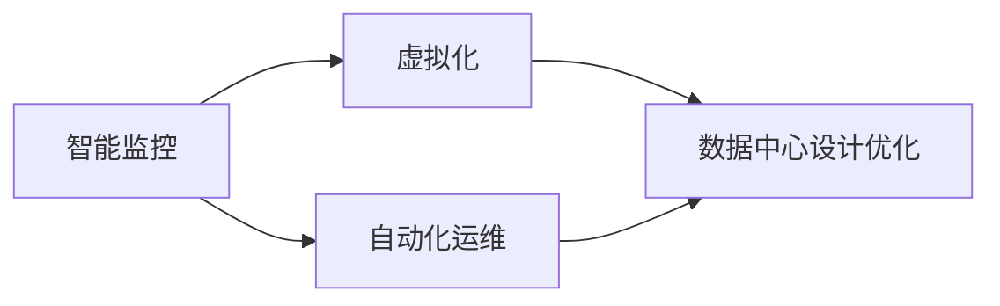

                 

# 云计算中的绿色技术：能效优化策略

> 关键词：云计算,能效优化,绿色技术,数据中心,智能监控,节能减排

## 1. 背景介绍

随着信息技术与数字化转型的加速，云计算作为基础性的信息技术服务，得到了全球企业的广泛采用。然而，云计算带来的能耗问题也日益凸显。全球数据中心消耗的电力已超过世界上所有核电站的发电量。与此同时，由于气候变化等全球性问题，各国政府对数据中心的能效要求也日益严格。

在这样的背景下，如何在云计算中实现能效优化，降低数据中心运营成本，减少碳排放，成为云服务提供商和用户共同关注的焦点。云计算中的绿色技术（Green Technologies），包括智能监控、虚拟化、自动化运维、数据中心设计优化等手段，能够在满足用户需求的同时，提升数据中心能效，实现节能减排。

本文将系统地介绍云计算中的绿色技术，包括其核心概念、关键算法和具体应用，探讨其在提升能效方面的潜力与挑战，并给出未来发展的趋势与展望。

## 2. 核心概念与联系

### 2.1 核心概念概述

云计算中的绿色技术主要涵盖以下几个核心概念：

- **智能监控（Smart Monitoring）**：利用先进传感器和AI算法，实时监控数据中心的物理环境（如温度、湿度、空气流通等），实现精细化管理。
- **虚拟化（Virtualization）**：通过虚拟化技术，将物理服务器分割为多个虚拟实例，提高资源利用率，减少能源浪费。
- **自动化运维（Automatic Operations & Maintenance）**：自动化运维工具通过自动化脚本、AI算法等手段，实现快速响应和故障预测，提升运维效率。
- **数据中心设计优化（Data Center Design Optimization）**：通过优化数据中心的结构布局、设备选型等，实现更高能效的运营。

这些概念相互联系，共同构成了云计算中的绿色技术框架。通过智能化、自动化手段，提升数据中心的物理资源利用效率，同时优化数据中心设计，实现更高能效的运营。

### 2.2 核心概念原理和架构的 Mermaid 流程图



在这个流程图里，智能监控和虚拟化是基础手段，自动化运维是运行保障，数据中心设计优化则是顶层设计。这些技术的结合，能够最大化地提升数据中心的能效。

## 3. 核心算法原理 & 具体操作步骤

### 3.1 算法原理概述

云计算中的绿色技术，其核心算法原理主要包括智能监控的算法设计、虚拟化资源的优化调度、自动化运维的预测与调整，以及数据中心设计优化的结构优化。

1. **智能监控算法**：主要利用机器学习算法对数据中心的环境数据进行实时监控和预测。
2. **虚拟化调度算法**：通过算法优化资源分配，减少能源浪费。
3. **自动化运维算法**：利用预测算法和优化算法，提升运维效率。
4. **数据中心设计优化算法**：通过分析数据中心的能效模型，设计最优结构布局。

### 3.2 算法步骤详解

**智能监控算法步骤**：

1. **数据采集**：通过传感器实时采集数据中心的环境数据（如温度、湿度、电源使用率等）。
2. **数据预处理**：对采集的数据进行清洗、去噪等预处理。
3. **特征提取**：使用特征提取算法（如PCA、LDA等），提取关键环境特征。
4. **模型训练**：利用机器学习模型（如LSTM、SVM等）对数据进行训练，构建预测模型。
5. **实时监控**：将模型应用于实时数据，预测环境变化趋势，指导决策。

**虚拟化调度算法步骤**：

1. **资源分析**：通过分析物理服务器资源使用情况，评估资源利用率。
2. **任务调度**：利用调度算法（如遗传算法、蚁群算法等），优化虚拟机的资源分配。
3. **性能评估**：监控虚拟机的性能指标，调整资源分配策略。

**自动化运维算法步骤**：

1. **数据收集**：收集系统运行数据，如硬件使用率、服务运行状态等。
2. **异常检测**：使用异常检测算法（如RNN、SVM等），识别异常事件。
3. **预测分析**：利用预测模型（如ARIMA、LSTM等），预测未来运行趋势。
4. **自动调整**：根据预测结果，自动调整系统参数，优化运行状态。

**数据中心设计优化算法步骤**：

1. **能效模型建立**：建立数据中心的能效模型，量化不同设计因素对能效的影响。
2. **参数优化**：利用优化算法（如GA、PSO等），找到最优设计参数。
3. **模拟仿真**：使用仿真工具（如AnyLogic、Simulink等），验证设计方案的能效。

### 3.3 算法优缺点

**智能监控算法**：
- **优点**：实时性高，能够快速响应环境变化，提高数据中心能效。
- **缺点**：对数据中心的基础设施要求较高，投资成本较高。

**虚拟化调度算法**：
- **优点**：提高资源利用率，减少能源浪费。
- **缺点**：调度算法复杂，实现难度大，且存在性能开销。

**自动化运维算法**：
- **优点**：降低运维成本，提升服务可靠性。
- **缺点**：依赖于高质量的监控数据，且算法复杂度较高。

**数据中心设计优化算法**：
- **优点**：通过优化设计，提升数据中心能效。
- **缺点**：设计复杂，涉及设备选型、布局规划等多方面，需要多学科合作。

### 3.4 算法应用领域

云计算中的绿色技术广泛应用于各种场景，包括但不限于以下几个领域：

- **数据中心运营**：提升数据中心能效，降低电力成本。
- **高性能计算**：优化计算资源分配，提升系统性能。
- **网络流量管理**：通过虚拟化技术，提高网络带宽利用率。
- **云计算平台运维**：自动化运维提升云服务可靠性。

## 4. 数学模型和公式 & 详细讲解 & 举例说明

### 4.1 数学模型构建

以智能监控算法为例，其数学模型主要包括以下几个部分：

- **输入数据**：数据中心的环境数据 $x \in \mathbb{R}^n$。
- **输出数据**：预测的环境变化 $y \in \mathbb{R}^m$。
- **模型参数**：模型训练得到的权重 $w \in \mathbb{R}^p$。

一个简单的智能监控模型可以表示为：

$$
y = f(x, w)
$$

其中 $f$ 为预测函数，$x$ 为输入，$w$ 为模型参数。

### 4.2 公式推导过程

以 LSTM 模型为例，其公式推导过程如下：

**LSTM 模型公式**：

$$
\begin{aligned}
i_t &= \sigma(W_i x_t + U_i h_{t-1} + b_i) \\
f_t &= \sigma(W_f x_t + U_f h_{t-1} + b_f) \\
o_t &= \sigma(W_o x_t + U_o h_{t-1} + b_o) \\
g_t &= \tanh(W_g x_t + U_g h_{t-1} + b_g) \\
c_t &= f_t \odot c_{t-1} + i_t \odot g_t \\
h_t &= o_t \odot \tanh(c_t)
\end{aligned}
$$

其中，$i_t, f_t, o_t$ 为 LSTM 中的门控，$c_t$ 为记忆细胞，$h_t$ 为输出。

### 4.3 案例分析与讲解

**案例：智能监控实时能效优化**

- **数据采集**：部署传感器，实时采集数据中心温度、湿度、电源使用率等数据。
- **数据预处理**：对数据进行清洗、去噪、归一化等预处理。
- **特征提取**：使用PCA算法提取关键特征，如温度变化率、电源使用率等。
- **模型训练**：使用LSTM模型对数据进行训练，预测未来环境变化。
- **实时监控**：根据预测结果，调整数据中心制冷和制热设备运行状态，优化能效。

## 5. 项目实践：代码实例和详细解释说明

### 5.1 开发环境搭建

开发环境搭建需要以下几个步骤：

1. **安装Python**：使用Anaconda或Miniconda安装Python，确保版本稳定。
2. **安装相关库**：安装TensorFlow、Keras、PyTorch等深度学习库。
3. **配置数据采集设备**：根据需求配置数据采集传感器，确保数据准确。

### 5.2 源代码详细实现

以下是一个智能监控算法实现的示例代码：

```python
import tensorflow as tf
from tensorflow.keras.models import Sequential
from tensorflow.keras.layers import LSTM, Dense, Input
from sklearn.preprocessing import StandardScaler

# 构建LSTM模型
model = Sequential([
    LSTM(64, input_shape=(n_samples, n_features), return_sequences=True),
    LSTM(32),
    Dense(n_output, activation='softmax')
])
model.compile(loss='mse', optimizer='adam')

# 数据预处理
scaler = StandardScaler()
x_train = scaler.fit_transform(train_data)
x_test = scaler.transform(test_data)

# 模型训练
model.fit(x_train, train_labels, epochs=50, batch_size=32)

# 模型预测
y_pred = model.predict(x_test)
```

### 5.3 代码解读与分析

**代码分析**：

1. **数据预处理**：使用`StandardScaler`对数据进行标准化处理，确保模型训练的稳定性和准确性。
2. **模型构建**：使用LSTM模型，分别定义输入层、LSTM层和输出层。
3. **模型训练**：使用`fit`方法进行模型训练，设置损失函数和优化器。
4. **模型预测**：使用`predict`方法对测试数据进行预测。

## 6. 实际应用场景

### 6.1 数据中心运营

数据中心是云计算的重要基础设施，其能效直接影响了云计算服务的成本和可靠性。通过智能监控和虚拟化技术，数据中心可以实现精细化管理，降低能源消耗。

- **智能监控**：实时监控数据中心环境，预测环境变化，提前进行预案调整。
- **虚拟化**：通过虚拟化技术，提高资源利用率，减少能源浪费。

### 6.2 高性能计算

高性能计算是云计算的重要应用场景之一，通过能效优化，可以提高计算资源的使用效率，降低成本。

- **智能监控**：监控计算节点的能耗和性能，动态调整资源分配。
- **虚拟化**：通过虚拟化技术，提高计算节点的利用率。

### 6.3 网络流量管理

网络流量管理是云计算中另一个重要场景。通过虚拟化技术，可以优化网络带宽使用，降低能耗。

- **虚拟化**：通过虚拟化技术，提高网络带宽利用率。
- **流量调度**：利用调度算法，优化流量分配，减少网络拥塞。

### 6.4 云计算平台运维

云计算平台的运维管理是保障云服务可靠性的重要环节。通过自动化运维和智能监控，可以提升运维效率，减少人为错误。

- **自动化运维**：利用自动化运维工具，实现快速响应和故障预测。
- **智能监控**：实时监控系统运行状态，预测潜在问题。

## 7. 工具和资源推荐

### 7.1 学习资源推荐

为了系统掌握云计算中的绿色技术，以下资源推荐阅读：

1. **《数据中心设计与运维》**：介绍数据中心的设计和运维技术，包含智能监控、虚拟化等内容。
2. **《云计算系统管理》**：详细讲解云计算系统管理和优化策略。
3. **《人工智能与大数据》**：介绍机器学习和深度学习算法在智能监控中的应用。

### 7.2 开发工具推荐

以下是云计算中绿色技术开发常用的工具：

1. **TensorFlow**：开源深度学习框架，支持分布式训练和部署。
2. **Keras**：高层次深度学习API，便于模型构建和调试。
3. **Jupyter Notebook**：交互式编程环境，便于数据处理和模型调试。

### 7.3 相关论文推荐

以下是云计算中绿色技术相关的重要论文，推荐阅读：

1. **《数据中心智能监控技术研究》**：介绍数据中心智能监控系统的设计与实现。
2. **《云计算资源虚拟化技术研究》**：分析云计算资源虚拟化技术及其应用。
3. **《自动化运维在云计算中的应用》**：介绍自动化运维技术在云计算中的实践与应用。

## 8. 总结：未来发展趋势与挑战

### 8.1 研究成果总结

云计算中的绿色技术通过智能化、自动化手段，显著提升了数据中心的能效。智能监控、虚拟化、自动化运维和数据中心设计优化等技术，为云计算的绿色发展提供了有力保障。

### 8.2 未来发展趋势

云计算中的绿色技术在未来将呈现以下几个趋势：

1. **更高效智能监控**：通过引入AI算法和大数据技术，实现更精细化的环境监控和预测。
2. **更先进的虚拟化技术**：发展更高效、更智能的虚拟化技术，进一步提升资源利用率。
3. **更智能的自动化运维**：利用AI和大数据技术，实现更智能、更自动化的运维。
4. **更绿色数据中心设计**：通过优化设计，降低数据中心能耗，提升绿色化水平。

### 8.3 面临的挑战

尽管云计算中的绿色技术取得了显著成果，但仍面临诸多挑战：

1. **数据采集成本高**：部署大量传感器和设备，成本较高。
2. **数据质量不稳定**：数据采集过程中可能存在噪声和干扰，影响模型训练。
3. **模型复杂度高**：智能监控和虚拟化等算法复杂度高，实现难度大。
4. **多学科合作难度大**：数据中心设计优化涉及多学科知识，跨领域合作难度大。

### 8.4 研究展望

未来，云计算中的绿色技术需要从以下几个方向进行突破：

1. **引入更先进算法**：引入更高效的算法，提升智能监控和虚拟化的精度和速度。
2. **降低数据采集成本**：研发更低成本的数据采集技术，提高数据采集的可行性和稳定性。
3. **优化数据中心设计**：通过优化设计，进一步提升数据中心的能效和可靠性。
4. **推动标准化**：制定行业标准，提升云计算中绿色技术的标准化水平。

## 9. 附录：常见问题与解答

**Q1：云计算中的绿色技术是否只适用于大规模数据中心？**

A: 尽管最初应用于大规模数据中心，云计算中的绿色技术对中小型数据中心同样有效。通过智能监控、虚拟化和自动化运维等技术，中小型数据中心也能实现能效优化，降低运营成本。

**Q2：智能监控算法的准确性如何保障？**

A: 智能监控算法的准确性依赖于高质量的监控数据和复杂的模型训练过程。通过定期校准传感器和优化模型，可以提升算法的准确性。

**Q3：虚拟化技术会带来哪些风险？**

A: 虚拟化技术虽然能提升资源利用率，但存在性能开销和兼容性问题。需要选择合适的虚拟化技术，并结合实际应用场景进行优化。

**Q4：自动化运维如何保证系统的稳定性？**

A: 自动化运维需要结合人工监控和预案，通过多级监控和预案机制，提升系统稳定性。

**Q5：如何优化数据中心设计？**

A: 通过优化数据中心的结构布局、设备选型和能效模型，找到最优设计参数，实现更高能效的运营。

---

作者：禅与计算机程序设计艺术 / Zen and the Art of Computer Programming

