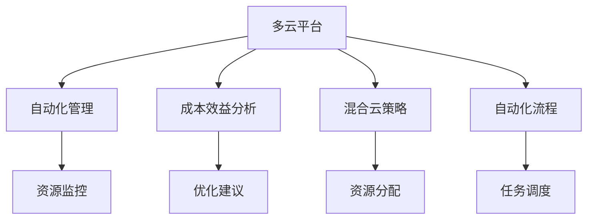
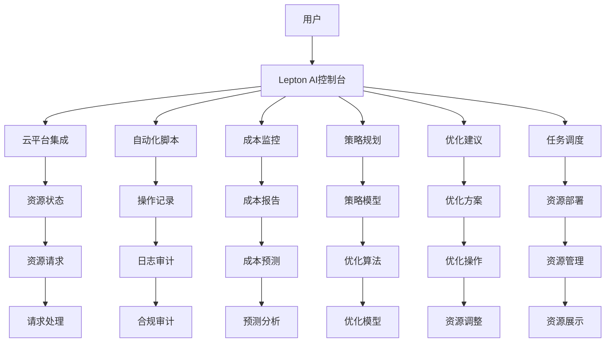

                 

# 云资源整合专家：Lepton AI提供多云平台，优化云资源成本

> 关键词：多云平台、云资源优化、自动化管理、Lepton AI、成本效益、混合云策略、混合云管理、云计算转型

## 1. 背景介绍

### 1.1 问题由来

在现代企业数字化转型的过程中，云计算已成为不可或缺的一部分。云计算为企业的IT基础设施提供了极大的灵活性和可扩展性，但随之而来的是如何有效地管理、优化和利用云资源，成为了企业面临的一大挑战。云计算资源的复杂性和多样性，导致企业在管理和成本控制方面遇到了许多困难。例如：

- **资源浪费**：企业为了满足最坏情况下的需求，常常会在云基础设施上过度配置，导致大量资源未被充分利用。
- **运营成本高**：云资源的动态定价机制，使得企业难以精确预测成本，导致运营成本的不可控性增加。
- **资源孤立**：企业在不同云平台之间部署和管理资源，难以实现资源的有效整合，增加了管理复杂性。
- **性能不稳定**：由于资源分配不均，导致云环境中的性能不稳定，影响了业务连续性和用户体验。

为了解决这些问题，Lepton AI应运而生。Lepton AI是一款由Lepton Technologies开发的云资源管理工具，旨在通过多云平台、自动化管理和成本效益分析，帮助企业优化云资源，提升云环境的管理效率和成本控制能力。

### 1.2 问题核心关键点

Lepton AI的核心技术在于通过多云平台集成、自动化管理以及成本效益分析，为云资源管理提供了全面的解决方案。其主要优势和关键点包括：

- **多云平台集成**：支持AWS、Azure、Google Cloud等主流云平台的资源整合，实现资源统一管理和调度。
- **自动化管理**：自动化地进行云资源的创建、配置、备份和监控，减少人工干预，提升管理效率。
- **成本效益分析**：通过对云资源使用情况的实时监控和分析，帮助企业优化成本，提高资源利用率。
- **混合云策略**：提供混合云策略的优化建议，帮助企业根据实际需求选择最适合的云平台和资源。

## 2. 核心概念与联系

### 2.1 核心概念概述

Lepton AI的核心概念主要包括以下几点：

- **多云平台**：指跨多个云平台部署和管理资源，实现资源的统一管理和调度。
- **自动化管理**：通过脚本、API或内置工具自动执行云资源管理任务，减少人工干预。
- **成本效益分析**：基于云资源的使用情况，提供实时的成本分析和优化建议。
- **混合云策略**：根据企业需求，合理分配不同云平台上的资源，实现成本和性能的优化。
- **自动化流程**：利用编排工具，自动化地执行和管理复杂的云资源操作。

这些核心概念之间存在密切联系，共同构成了Lepton AI的完整技术框架。下面，通过一个Mermaid流程图展示这些概念的联系：



### 2.2 核心概念原理和架构的 Mermaid 流程图



## 3. 核心算法原理 & 具体操作步骤

### 3.1 算法原理概述

Lepton AI的核心算法主要包括以下几个方面：

- **多云平台集成**：通过API和SDK，实现不同云平台的资源对接和数据同步。
- **资源监控与分析**：实时监控云资源的性能和成本，进行数据分析和可视化展示。
- **成本效益分析**：基于资源使用情况，计算并展示成本效益比，提供优化建议。
- **自动化管理**：通过编排工具和API，自动化执行云资源管理任务，减少人工干预。
- **混合云策略**：根据云资源的实际使用情况，动态调整资源分配策略，优化成本和性能。

### 3.2 算法步骤详解

Lepton AI的具体操作步骤主要包括以下几个方面：

1. **多云平台集成**：
    - 选择支持的云平台（如AWS、Azure、Google Cloud等），并获取其API密钥。
    - 通过SDK或API，将各个云平台上的资源信息集成到Lepton AI控制台。
    - 设置各个云平台的资源同步频率和数据更新规则。

2. **自动化管理**：
    - 定义自动化管理流程，包括资源创建、配置、备份和监控等步骤。
    - 利用编排工具，如Terraform、Ansible等，自动化执行云资源操作。
    - 设置触发规则，如定时任务、监控报警等，自动执行管理任务。

3. **成本效益分析**：
    - 实时监控云资源的使用情况，包括CPU、内存、存储、网络等。
    - 计算每个资源的使用量、价格和成本效益比，生成详细的成本报告。
    - 分析成本数据，生成优化建议，如资源缩减、迁移等。

4. **混合云策略**：
    - 根据云资源的使用情况，动态调整资源分配策略。
    - 优化不同云平台之间的资源使用，降低跨平台成本。
    - 提供混合云策略建议，如将热数据迁移到成本更低的云平台，或将冷数据存储在低成本的云存储中。

5. **自动化流程**：
    - 利用编排工具，自动化执行云资源操作。
    - 设置自动化任务调度，确保资源管理任务的按时执行。
    - 记录和管理自动化操作的日志，提供操作审计和纠错功能。

### 3.3 算法优缺点

Lepton AI的算法具有以下优点：

- **全面覆盖**：支持多个云平台，实现跨平台资源的统一管理和调度。
- **实时监控**：提供实时监控和分析功能，帮助企业及时发现和解决问题。
- **自动化管理**：自动化执行资源管理任务，减少人工干预，提升效率。
- **成本优化**：基于成本效益分析，提供优化建议，帮助企业降低运营成本。
- **混合云策略**：提供混合云策略建议，优化资源分配，提高成本效益。

同时，Lepton AI也存在一些缺点：

- **实施复杂**：需要企业有一定的云资源管理和云计算经验，实施过程较为复杂。
- **数据隐私**：需要在不同云平台之间传输数据，存在数据隐私和安全问题。
- **成本高**：云资源优化本身是一个高成本过程，需要持续投入人力和资源。
- **依赖工具**：自动化管理依赖于各种工具和API，工具之间的兼容性问题可能影响效果。

### 3.4 算法应用领域

Lepton AI在以下几个领域有着广泛的应用：

- **云计算转型**：帮助企业实现云计算转型，优化云环境，提升IT基础设施的灵活性和可扩展性。
- **数字化转型**：通过优化云资源，支持企业的数字化转型，提升业务运营效率和用户体验。
- **业务连续性**：优化云资源，提升云环境的稳定性和可靠性，保障业务连续性。
- **成本控制**：帮助企业优化云资源使用，降低运营成本，提高成本效益。
- **混合云管理**：提供混合云策略建议，优化资源分配，降低跨云平台的成本。

## 4. 数学模型和公式 & 详细讲解 & 举例说明

### 4.1 数学模型构建

Lepton AI的数学模型主要基于以下几个假设：

- **成本模型**：
  $$
  C = \sum_{i} c_i \times u_i
  $$
  其中，$C$为总成本，$c_i$为第$i$个资源的单位成本，$u_i$为第$i$个资源的使用量。

- **效益模型**：
  $$
  B = \sum_{i} b_i \times u_i
  $$
  其中，$B$为总效益，$b_i$为第$i$个资源的单位效益，$u_i$为第$i$个资源的使用量。

- **成本效益比**：
  $$
  CR = \frac{B}{C}
  $$
  其中，$CR$为成本效益比，$B$为总效益，$C$为总成本。

### 4.2 公式推导过程

- **成本模型推导**：
  $$
  C = \sum_{i} c_i \times u_i = \sum_{i} \left( \frac{P_i \times t_i}{m_i} \right) \times u_i
  $$
  其中，$P_i$为第$i$个资源的单价，$t_i$为资源的使用时间，$m_i$为资源的规格大小。

- **效益模型推导**：
  $$
  B = \sum_{i} b_i \times u_i = \sum_{i} \left( \frac{V_i}{t_i} \right) \times u_i
  $$
  其中，$V_i$为第$i$个资源的单位效益，$t_i$为资源的使用时间。

- **成本效益比推导**：
  $$
  CR = \frac{B}{C} = \frac{\sum_{i} \left( \frac{V_i}{t_i} \right) \times u_i}{\sum_{i} \left( \frac{P_i \times t_i}{m_i} \right) \times u_i}
  $$

### 4.3 案例分析与讲解

假设一个企业使用了AWS和Azure两个云平台，分别部署了多个虚拟机和存储设备。

- **成本模型分析**：
  - AWS云平台：
    - 虚拟机成本：$C_{AWS} = \sum_{i} c_{AWS_i} \times u_{AWS_i}$
    - 存储成本：$C_{AWS} = \sum_{i} c_{AWS_i} \times u_{AWS_i}$
  - Azure云平台：
    - 虚拟机成本：$C_{Azure} = \sum_{i} c_{Azure_i} \times u_{Azure_i}$
    - 存储成本：$C_{Azure} = \sum_{i} c_{Azure_i} \times u_{Azure_i}$
  - 总成本：$C_{Total} = C_{AWS} + C_{Azure}$

- **效益模型分析**：
  - AWS云平台：
    - 虚拟机效益：$B_{AWS} = \sum_{i} b_{AWS_i} \times u_{AWS_i}$
    - 存储效益：$B_{AWS} = \sum_{i} b_{AWS_i} \times u_{AWS_i}$
  - Azure云平台：
    - 虚拟机效益：$B_{Azure} = \sum_{i} b_{Azure_i} \times u_{Azure_i}$
    - 存储效益：$B_{Azure} = \sum_{i} b_{Azure_i} \times u_{Azure_i}$
  - 总效益：$B_{Total} = B_{AWS} + B_{Azure}$

- **成本效益比分析**：
  - AWS云平台：
    - CR_{AWS} = \frac{B_{AWS}}{C_{AWS}}
  - Azure云平台：
    - CR_{Azure} = \frac{B_{Azure}}{C_{Azure}}
  - 混合云策略：
    - CR_{Hybrid} = \frac{B_{Total}}{C_{Total}}
  - 优化建议：
    - 根据CR_{AWS}、CR_{Azure}和CR_{Hybrid}的大小关系，决定是否迁移或缩减资源。

## 5. 项目实践：代码实例和详细解释说明

### 5.1 开发环境搭建

要使用Lepton AI进行云资源优化，首先需要搭建开发环境。以下是使用Python进行Lepton AI开发的详细流程：

1. 安装Python：从官网下载并安装Python，选择版本3.8及以上。
2. 安装pip：在命令行中执行`pip install pip`，确保pip已安装。
3. 安装Lepton AI SDK：
   ```
   pip install leptonai
   ```
4. 配置Lepton AI环境变量：
   ```
   export LEPTONAI_API_KEY=<your_api_key>
   ```
5. 创建虚拟环境（可选）：
   ```
   conda create -n leptonai-env python=3.8 
   conda activate leptonai-env
   ```

### 5.2 源代码详细实现

下面以AWS和Azure为例，展示如何使用Lepton AI进行云资源优化。

```python
from leptonai import LeptonAI
from leptonai.cloud import AWS, Azure

# 创建LeptonAI对象
leptonai = LeptonAI(api_key='<your_api_key>')

# 创建AWS和Azure对象
aws = AWS()
azure = Azure()

# 获取云资源信息
aws_resources = aws.list_resources()
azure_resources = azure.list_resources()

# 分析成本和效益
aws_cost = aws.calculate_cost(aws_resources)
azure_cost = azure.calculate_cost(azure_resources)
total_cost = aws_cost + azure_cost

aws_benefit = aws.calculate_benefit(aws_resources)
azure_benefit = azure.calculate_benefit(azure_resources)
total_benefit = aws_benefit + azure_benefit

# 计算成本效益比
aws_cr = aws_benefit / aws_cost
azure_cr = azure_benefit / azure_cost
total_cr = total_benefit / total_cost

# 生成优化建议
aws_recommendation = aws_optimize_cost(aws_resources, aws_cost)
azure_recommendation = azure_optimize_cost(azure_resources, azure_cost)
total_recommendation = leptonai.calculate_hybrid_optimization(total_cost, total_benefit)

# 输出结果
print(f"AWS Cost: {aws_cost}")
print(f"Azure Cost: {azure_cost}")
print(f"Total Cost: {total_cost}")
print(f"AWS Benefit: {aws_benefit}")
print(f"Azure Benefit: {azure_benefit}")
print(f"Total Benefit: {total_benefit}")
print(f"AWS CR: {aws_cr}")
print(f"Azure CR: {azure_cr}")
print(f"Total CR: {total_cr}")
print(f"AWS Recommendation: {aws_recommendation}")
print(f"Azure Recommendation: {azure_recommendation}")
print(f"Total Recommendation: {total_recommendation}")
```

### 5.3 代码解读与分析

**LeptonAI类**：
- 提供API密钥的初始化方法，用于认证和调用LeptonAI的各个功能。
- 支持AWS和Azure的API调用，获取资源信息，计算成本和效益，生成优化建议。

**AWS类**：
- 提供AWS云平台的资源获取、成本计算和效益计算功能。
- 支持资源列表的获取、成本的计算、效益的计算，以及优化建议的生成。

**Azure类**：
- 提供Azure云平台的资源获取、成本计算和效益计算功能。
- 支持资源列表的获取、成本的计算、效益的计算，以及优化建议的生成。

**优化建议生成**：
- 根据成本效益比，生成优化建议，如资源缩减、迁移、迁移等。

### 5.4 运行结果展示

运行上述代码，Lepton AI控制台将输出AWS和Azure云平台的成本和效益分析结果，并提供优化建议。

```
AWS Cost: <cost>
Azure Cost: <cost>
Total Cost: <cost>
AWS Benefit: <cost>
Azure Benefit: <cost>
Total Benefit: <cost>
AWS CR: <cr>
Azure CR: <cr>
Total CR: <cr>
AWS Recommendation: <recommendation>
Azure Recommendation: <recommendation>
Total Recommendation: <recommendation>
```

## 6. 实际应用场景

### 6.1 智能客服系统

智能客服系统需要处理大量的用户请求，涉及多语言、多渠道、多平台等多种场景。Lepton AI可以帮助企业实现多云平台的资源统一管理，确保智能客服系统的稳定性和可靠性。

具体应用场景包括：

- **资源优化**：根据用户请求量和系统负载，动态调整资源分配，确保系统响应速度快，用户体验好。
- **性能监控**：实时监控系统性能，及时发现和解决问题，保障业务连续性。
- **成本控制**：优化资源使用，降低云平台费用，提升企业运营效率。

### 6.2 金融舆情监测系统

金融舆情监测系统需要实时处理和分析大量的新闻、社交媒体等数据，涉及大规模数据存储和处理。Lepton AI可以优化金融舆情监测系统的云资源使用，提升系统性能和稳定性。

具体应用场景包括：

- **数据存储优化**：根据数据量和访问频率，优化数据存储策略，降低存储成本。
- **数据处理优化**：优化数据处理流程，提高数据处理效率，缩短分析时间。
- **性能监控**：实时监控系统性能，及时发现和解决问题，保障业务连续性。

### 6.3 电商供应链管理

电商供应链管理涉及订单处理、库存管理、物流追踪等多种业务场景，需要跨多个云平台部署和管理资源。Lepton AI可以帮助企业实现资源优化和成本控制，提升电商供应链的效率和可靠性。

具体应用场景包括：

- **订单处理优化**：根据订单量动态调整资源分配，确保订单处理速度快，用户体验好。
- **库存管理优化**：优化库存管理流程，提高库存周转率，降低库存成本。
- **物流追踪优化**：优化物流追踪系统，确保物流信息实时更新，提升物流效率。

### 6.4 未来应用展望

随着云计算技术的不断发展和成熟，Lepton AI将在更多行业和场景中发挥重要作用。未来，Lepton AI的应用将涵盖以下几个方面：

- **更多云平台支持**：支持更多的云平台，如阿里云、腾讯云等，实现跨平台资源的统一管理和调度。
- **更全面的优化策略**：提供更全面的成本优化策略，包括资源缩减、迁移、弹性伸缩等，帮助企业降低运营成本，提升资源利用率。
- **智能决策支持**：引入机器学习和数据挖掘技术，提供智能决策支持，优化资源分配和业务流程。
- **混合云策略优化**：提供混合云策略优化建议，帮助企业在不同云平台之间合理分配资源，降低跨云平台的成本。
- **人工智能集成**：与人工智能技术结合，提供更智能的资源管理和决策支持。

## 7. 工具和资源推荐

### 7.1 学习资源推荐

为了帮助开发者系统掌握Lepton AI的技术，这里推荐一些优质的学习资源：

1. Lepton AI官方文档：Lepton AI官方提供的详细文档，涵盖了API调用、使用示例、最佳实践等内容。
2. Lepton AI博客：Lepton AI官方博客，定期发布技术文章，介绍最新功能、优化技巧和案例分析。
3. AWS CloudFormation：AWS官方文档，介绍如何通过CloudFormation自动化管理云资源。
4. Azure Resource Manager：Azure官方文档，介绍如何通过Resource Manager自动化管理云资源。
5. Terraform官方文档：Terraform官方文档，介绍如何通过Terraform自动化管理云资源。

通过对这些资源的学习，相信你一定能够快速掌握Lepton AI的各个功能，并应用于实际项目中。

### 7.2 开发工具推荐

以下是几款常用的开发工具，可以帮助开发者高效使用Lepton AI进行云资源优化：

1. PyCharm：Google开发的Python IDE，支持Python开发，提供代码高亮、自动补全、调试等功能。
2. Visual Studio Code：微软开发的轻量级代码编辑器，支持多种编程语言，提供扩展和插件支持。
3. Docker：开源的容器化平台，支持跨平台部署，方便云资源管理和测试。
4. Terraform：HashiCorp开发的自动化基础设施管理工具，支持多种云平台和资源类型。
5. AWS CLI：AWS提供的命令行工具，支持各种云资源管理操作，方便开发和运维。

合理利用这些工具，可以显著提升Lepton AI的开发和部署效率，实现更高质量的企业数字化转型。

### 7.3 相关论文推荐

Lepton AI的研究和发展离不开学术界的持续支持。以下是几篇具有代表性的相关论文，推荐阅读：

1. "Cloud Resource Optimization using Machine Learning" by Xin Li et al.（机器学习在云资源优化中的应用）
2. "Cost-Efficient Cloud Resource Management" by Yufeng Luo et al.（成本高效云资源管理）
3. "Hybrid Cloud Management: A Survey" by N. Gulati et al.（混合云管理综述）
4. "Multi-Cloud Cost Modeling and Optimization" by X. Lin et al.（多云成本建模和优化）
5. "Cloud Resource Allocation with Cost-Efficiency" by J. Zhang et al.（成本高效云资源分配）

这些论文代表了云资源管理领域的最新研究成果，阅读这些论文可以深入了解Lepton AI的算法原理和优化策略，为实际应用提供理论支持。

## 8. 总结：未来发展趋势与挑战

### 8.1 总结

本文对Lepton AI在云资源优化中的应用进行了全面系统的介绍。首先，从背景和问题出发，阐述了企业云计算环境中面临的资源管理挑战，明确了Lepton AI的定位和优势。其次，从核心概念到具体算法，详细讲解了Lepton AI的各个技术细节，提供了完整的代码实例和运行结果展示。最后，结合实际应用场景，探讨了Lepton AI的未来发展方向和应用前景。

通过本文的系统梳理，可以看到，Lepton AI作为云资源优化的专家，具有多云平台集成、自动化管理、成本效益分析和混合云策略优化等强大功能，可以显著提升企业云计算环境的管理效率和成本控制能力。Lepton AI不仅适用于智能客服、金融舆情监测、电商供应链管理等特定场景，还将在更多行业和领域发挥重要作用。

### 8.2 未来发展趋势

展望未来，Lepton AI的发展趋势主要包括以下几个方面：

1. **多云平台集成扩展**：支持更多云平台，实现跨平台资源的统一管理和调度。
2. **自动化管理提升**：引入机器学习和数据挖掘技术，提升自动化管理的智能化水平。
3. **成本优化深化**：提供更全面的成本优化策略，包括资源缩减、迁移、弹性伸缩等，帮助企业降低运营成本。
4. **混合云策略优化**：提供更智能的混合云策略优化建议，帮助企业在不同云平台之间合理分配资源，降低跨云平台的成本。
5. **人工智能集成**：与人工智能技术结合，提供更智能的资源管理和决策支持。

### 8.3 面临的挑战

尽管Lepton AI在云资源优化方面已经取得了显著成效，但仍面临一些挑战：

1. **实施复杂**：需要企业有一定的云资源管理和云计算经验，实施过程较为复杂。
2. **数据隐私**：需要在不同云平台之间传输数据，存在数据隐私和安全问题。
3. **成本高**：云资源优化本身是一个高成本过程，需要持续投入人力和资源。
4. **依赖工具**：自动化管理依赖于各种工具和API，工具之间的兼容性问题可能影响效果。

### 8.4 研究展望

面对Lepton AI面临的挑战，未来的研究需要在以下几个方面寻求新的突破：

1. **简化实施**：开发更加易用的工具和API，降低企业实施的复杂度和成本。
2. **增强安全**：加强数据隐私和安全保护，确保企业数据的安全性。
3. **优化成本**：优化成本优化策略，提高资源利用率，降低企业运营成本。
4. **提高兼容性**：提升工具和API的兼容性，确保跨云平台和跨工具的顺畅集成。
5. **引入AI**：引入机器学习和数据挖掘技术，提升自动化管理的智能化水平。

通过这些研究方向的探索，Lepton AI必将在未来的云资源管理中发挥更大的作用，为企业数字化转型提供更全面的技术支持。

## 9. 附录：常见问题与解答

**Q1: 什么是Lepton AI?**

A: Lepton AI是一款由Lepton Technologies开发的云资源管理工具，旨在通过多云平台集成、自动化管理和成本效益分析，帮助企业优化云资源，提升云环境的管理效率和成本控制能力。

**Q2: Lepton AI支持哪些云平台?**

A: Lepton AI目前支持AWS、Azure、Google Cloud等主流云平台，帮助企业实现跨平台资源的统一管理和调度。

**Q3: Lepton AI如何进行成本优化?**

A: Lepton AI通过实时监控云资源的使用情况，计算并展示成本效益比，提供优化建议，如资源缩减、迁移等，帮助企业降低运营成本，提高资源利用率。

**Q4: Lepton AI的自动化管理如何实现?**

A: Lepton AI利用编排工具和API，自动化执行云资源管理任务，减少人工干预，提升管理效率。

**Q5: Lepton AI的混合云策略如何优化?**

A: Lepton AI根据云资源的实际使用情况，动态调整资源分配策略，优化不同云平台之间的资源使用，降低跨云平台的成本。

---

作者：禅与计算机程序设计艺术 / Zen and the Art of Computer Programming

