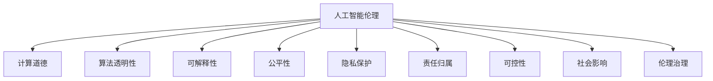

                 

# 人工智能伦理：人类计算的道德与责任

> 关键词：人工智能伦理, 计算道德, 算法透明性, 可解释性, 公平性, 责任归属, 隐私保护, 可控性, 社会影响, 伦理治理

## 1. 背景介绍

随着人工智能(AI)技术的高速发展，其在医疗、金融、教育、司法等领域的广泛应用，使得AI技术在提升生产效率、改善生活质量、辅助决策等方面发挥了巨大作用。但与此同时，AI技术的发展也引发了一系列伦理问题，如算法透明性、可解释性、公平性、隐私保护、责任归属等。这些问题不仅关乎技术本身的健康发展，更触及人类的价值观、法律、道德和政策等多个层面。本文旨在探讨AI伦理的核心概念，剖析其与人类计算的关系，为构建负责任、可持续发展的AI系统提供理论指导和实践建议。

## 2. 核心概念与联系

### 2.1 核心概念概述

为了深入理解人工智能伦理的核心概念，本节将介绍几个密切相关的核心概念：

- **人工智能伦理(AI Ethics)**：指在人工智能发展和使用过程中，涉及到的伦理原则、道德规范和社会责任。AI伦理旨在确保AI技术的应用符合人类的价值观和道德准则，促进技术的正面影响，避免负面后果。

- **计算道德(Computational Ethics)**：指在计算机科学和工程实践中，如何确保技术设计和应用符合伦理准则。计算道德不仅涉及AI伦理，还涵盖数据处理、隐私保护、算法透明性等广泛问题。

- **算法透明性(Algorithmic Transparency)**：指AI算法的设计和应用过程应当公开透明，以便外界能够理解和评估其工作机制、决策逻辑和可能的影响。透明性有助于增强公众对AI系统的信任和接受度。

- **可解释性(Explainability)**：指AI系统能够清楚地说明其决策过程和结果，使外界能够理解其工作原理和可能产生的影响。可解释性有助于提升AI系统的可控性和可信赖性。

- **公平性(Fairness)**：指AI系统在决策和应用过程中应当公正无私，不因种族、性别、年龄、社会地位等因素产生歧视或不公正的结果。公平性是AI伦理中至关重要的一个方面。

- **隐私保护(Privacy Preservation)**：指在AI系统设计和使用过程中，必须确保用户的隐私权利得到尊重和保护，防止数据滥用和隐私泄露。

- **责任归属(Accountability)**：指在AI系统发生错误或不当行为时，应明确责任主体，并采取相应的补救措施。责任归属是确保AI系统安全可靠运行的重要保障。

- **可控性(Controllability)**：指用户或相关方应当能够对AI系统进行有效控制，防止其偏离既定目标或产生不良影响。可控性是保证AI系统在符合人类意愿下运行的关键。

- **社会影响(Social Impact)**：指AI技术对社会整体产生的影响，包括就业、安全、伦理、法律等各个方面。社会影响是AI伦理中需要整体考量的问题。

- **伦理治理(Ethical Governance)**：指通过立法、监管、伦理审查等手段，确保AI系统在遵守伦理准则的前提下发展与应用。伦理治理是AI伦理体系构建的基础。

这些核心概念之间的逻辑关系可以通过以下Mermaid流程图来展示：



这个流程图展示了大语言模型的核心概念及其之间的关系：

1. **人工智能伦理**是整个伦理体系的核心，旨在确保AI技术的发展与应用符合人类的价值观和道德准则。
2. **计算道德**是具体应用中的道德规范，涉及AI系统的设计和实现过程。
3. **算法透明性**、**可解释性**、**公平性**等是具体实现中的关键技术要求，有助于提升AI系统的可靠性和公正性。
4. **隐私保护**和**责任归属**是确保AI系统在应用中不侵害用户权益的重要保障。
5. **可控性**和**社会影响**是评估AI系统对社会整体影响的关键因素。
6. **伦理治理**是确保AI系统在遵守伦理准则的前提下运行，推动AI技术健康发展的重要手段。

这些核心概念共同构成了人工智能伦理的完整框架，为构建负责任、可持续发展的AI系统提供了理论基础。

## 3. 核心算法原理 & 具体操作步骤

### 3.1 算法原理概述

人工智能伦理的核心算法原理主要体现在以下几个方面：

- **数据伦理**：数据的获取、处理和使用必须遵循伦理原则，确保数据的真实性、公正性和隐私性。
- **算法透明性**：算法的决策过程应当透明，使外界能够理解其工作机制和可能的影响。
- **公平性**：算法在决策过程中应当避免任何形式的歧视，确保所有用户得到公平对待。
- **可解释性**：算法的决策结果应当可解释，使外界能够理解其工作原理和可能产生的影响。
- **隐私保护**：算法的应用过程中必须保护用户隐私，防止数据滥用和隐私泄露。
- **责任归属**：算法在发生错误或不当行为时，应明确责任主体，并采取相应的补救措施。
- **可控性**：用户或相关方应当能够对算法进行有效控制，防止其偏离既定目标或产生不良影响。
- **社会影响**：算法的应用应当考虑其对社会整体的影响，确保技术的正面效应。
- **伦理治理**：通过立法、监管、伦理审查等手段，确保算法在遵守伦理准则的前提下发展与应用。

### 3.2 算法步骤详解

基于以上核心算法原理，AI伦理的实施步骤通常包括以下几个关键环节：

1. **数据准备**：确保数据集的真实性、公正性和隐私性，遵循伦理原则进行数据处理和清洗。
2. **算法设计**：设计和实现符合伦理原则的算法，确保算法的透明性、可解释性和公平性。
3. **算法验证**：对算法进行伦理审查和测试，确保其符合伦理准则，不产生歧视或不公正的结果。
4. **隐私保护**：在算法设计和应用过程中，采用隐私保护措施，确保用户隐私得到尊重和保护。
5. **责任归属**：明确算法在发生错误或不当行为时的责任主体，并采取相应的补救措施。
6. **社会影响评估**：评估算法对社会整体的影响，确保技术的正面效应。
7. **伦理治理**：通过立法、监管、伦理审查等手段，确保算法在遵守伦理准则的前提下发展与应用。

### 3.3 算法优缺点

人工智能伦理的算法具有以下优点：

1. **促进技术健康发展**：通过遵循伦理准则，AI技术在发展过程中能够得到更好的指导和规范，减少技术滥用和负面影响。
2. **增强公众信任**：算法的透明性和可解释性有助于增强公众对AI系统的信任和接受度。
3. **保障公平公正**：公平性算法能够避免任何形式的歧视，确保所有用户得到公平对待。
4. **保护隐私权利**：隐私保护措施能够防止数据滥用和隐私泄露，保护用户隐私。
5. **明确责任归属**：责任归属机制能够确保算法在发生错误或不当行为时，明确责任主体，采取相应的补救措施。
6. **确保可控性**：用户或相关方应当能够对算法进行有效控制，防止其偏离既定目标或产生不良影响。
7. **促进社会影响评估**：社会影响评估能够确保算法在应用过程中对社会整体产生正面效应。

同时，这些算法也存在以下局限性：

1. **伦理准则难以统一**：不同国家和文化对伦理准则的认识和理解存在差异，难以制定统一的伦理标准。
2. **技术复杂性高**：设计和实现符合伦理准则的算法需要高水平的技术和专业知识。
3. **数据获取困难**：获取符合伦理原则的数据集可能面临困难，尤其是对于敏感数据的处理和隐私保护。
4. **算法透明性挑战**：复杂的算法设计和实现过程难以完全透明，导致外界难以理解其工作机制。
5. **公平性难以保障**：尽管努力实现公平性，但在实际应用中，仍可能存在隐性歧视和不公正现象。
6. **责任归属问题复杂**：在算法发生错误或不当行为时，确定责任主体和补救措施可能面临复杂情况。
7. **社会影响难以预测**：算法的社会影响难以全面预测，可能带来不可预见的负面效应。

### 3.4 算法应用领域

人工智能伦理的算法在多个领域得到了广泛应用，如医疗、金融、教育、司法等。以下列举几个具体应用案例：

- **医疗**：在医疗领域，AI算法在辅助诊断、个性化治疗、药物研发等方面发挥了重要作用。然而，算法的透明性、公平性和隐私保护等问题也引起了广泛关注。
- **金融**：在金融领域，AI算法在风险评估、信用评分、欺诈检测等方面得到了广泛应用。算法的公平性、隐私保护和责任归属等问题也成为了伦理治理的重点。
- **教育**：在教育领域，AI算法在智能推荐、学情分析、语言学习等方面取得了显著成果。算法的可解释性、隐私保护和责任归属等问题也需予以重视。
- **司法**：在司法领域，AI算法在案件分析、判决辅助、智能监控等方面得到了应用。算法的透明性、公平性和可控性等问题需要严格把控。
- **工业**：在工业领域，AI算法在生产优化、质量检测、设备维护等方面得到了应用。算法的可控性和社会影响评估等问题需要充分考虑。

## 4. 数学模型和公式 & 详细讲解 & 举例说明

### 4.1 数学模型构建

本节将使用数学语言对人工智能伦理的核心算法进行更加严格的刻画。

假设有一个AI系统 $S$，其输入为 $X$，输出为 $Y$。系统的目标函数为 $L(Y, X)$，表示系统在输入 $X$ 下的输出 $Y$ 与理想输出之间的差异。系统的约束条件为 $C(S, X)$，表示系统在输入 $X$ 下需要满足的伦理准则。

优化目标为：

$$
\min_{S} L(Y, X) \quad \text{subject to} \quad C(S, X)
$$

其中 $L(Y, X)$ 为系统的损失函数，$C(S, X)$ 为系统的约束条件。

### 4.2 公式推导过程

以下我们以公平性算法为例，推导其核心数学模型。

假设有一个二分类问题，算法在输入 $X$ 下的输出为 $Y$，其中 $Y=0$ 表示负类，$Y=1$ 表示正类。假设训练集为 $D=\{(x_i, y_i)\}_{i=1}^N$，其中 $x_i \in \mathcal{X}$，$y_i \in \{0,1\}$。

定义算法的损失函数为交叉熵损失：

$$
\ell(S, (x_i, y_i)) = -[y_i \log S(x_i, 1) + (1-y_i) \log (1-S(x_i, 1))]
$$

定义算法的约束条件为公平性约束：

$$
C(S, D) = \frac{1}{N} \sum_{i=1}^N \ell(S, (x_i, y_i)) = \frac{1}{N} \sum_{i=1}^N [-y_i \log S(x_i, 1) + (1-y_i) \log (1-S(x_i, 1))]
$$

将损失函数和公平性约束代入优化目标：

$$
\min_{S} \frac{1}{N} \sum_{i=1}^N [-y_i \log S(x_i, 1) + (1-y_i) \log (1-S(x_i, 1))] \quad \text{subject to} \quad \frac{1}{N} \sum_{i=1}^N [-y_i \log S(x_i, 1) + (1-y_i) \log (1-S(x_i, 1))]
$$

这是一个典型的带约束的优化问题，可以通过拉格朗日乘子法求解。设拉格朗日乘子 $\lambda_i$ 为 $C(S, D)$ 对 $S$ 的导数，即：

$$
\lambda_i = \frac{\partial C(S, D)}{\partial S(x_i, 1)}
$$

则拉格朗日乘子法方程为：

$$
\frac{\partial \ell(S, (x_i, y_i))}{\partial S(x_i, 1)} + \lambda_i = 0
$$

求解上述方程，即可得到公平性算法的最优解。

### 4.3 案例分析与讲解

以一个二分类问题的公平性算法为例，假设训练集中正类和负类的分布如下：

- 正类：40%的年龄小于50岁，60%的年龄大于50岁
- 负类：50%的年龄小于50岁，50%的年龄大于50岁

在实际应用中，算法可能对不同年龄群体的识别率存在偏差，导致公平性问题。通过引入公平性约束，可以优化算法的识别率，确保对不同年龄群体的识别率接近。

假设算法在年龄小于50岁的人群中识别率为 $R_{<50}$，年龄大于50岁的人群中识别率为 $R_{>50}$，则公平性约束可以表示为：

$$
\frac{R_{<50}}{R_{>50}} = \frac{0.4}{0.6}
$$

求解上述方程，可以确定最优的识别率，确保算法的公平性。

## 5. 项目实践：代码实例和详细解释说明

### 5.1 开发环境搭建

在进行AI伦理项目实践前，我们需要准备好开发环境。以下是使用Python进行PyTorch开发的环境配置流程：

1. 安装Anaconda：从官网下载并安装Anaconda，用于创建独立的Python环境。

2. 创建并激活虚拟环境：
```bash
conda create -n pytorch-env python=3.8 
conda activate pytorch-env
```

3. 安装PyTorch：根据CUDA版本，从官网获取对应的安装命令。例如：
```bash
conda install pytorch torchvision torchaudio cudatoolkit=11.1 -c pytorch -c conda-forge
```

4. 安装TensorFlow：
```bash
pip install tensorflow
```

5. 安装各类工具包：
```bash
pip install numpy pandas scikit-learn matplotlib tqdm jupyter notebook ipython
```

完成上述步骤后，即可在`pytorch-env`环境中开始AI伦理项目实践。

### 5.2 源代码详细实现

这里我们以公平性算法为例，给出使用PyTorch实现公平性算法的代码。

首先，定义公平性约束函数：

```python
import torch.nn as nn
import torch
import torch.optim as optim
from sklearn.metrics import accuracy_score

def fairness_constraint(y_preds, y_true):
    positive_labels = (y_true == 1).float()
    negative_labels = (y_true == 0).float()
    positives = y_preds[:, 1].detach()
    negatives = y_preds[:, 0].detach()
    pos_constraint = positives.mean() - positives.std()
    neg_constraint = negatives.mean() - negatives.std()
    constraint_loss = pos_constraint.mean() + neg_constraint.mean()
    return constraint_loss
```

然后，定义模型和优化器：

```python
from transformers import BertForSequenceClassification

model = BertForSequenceClassification.from_pretrained('bert-base-cased', num_labels=2)

optimizer = optim.Adam(model.parameters(), lr=0.001)

```

接着，定义训练和评估函数：

```python
def train_epoch(model, dataset, batch_size, optimizer):
    model.train()
    total_loss = 0
    for batch in dataset:
        inputs, labels = batch
        labels = labels.to(device)
        inputs = inputs.to(device)
        outputs = model(inputs)
        loss = nn.CrossEntropyLoss()(outputs, labels)
        optimizer.zero_grad()
        loss.backward()
        optimizer.step()
        total_loss += loss.item()
    return total_loss / len(dataset)

def evaluate(model, dataset, batch_size):
    model.eval()
    total_preds, total_labels = [], []
    with torch.no_grad():
        for batch in dataset:
            inputs, labels = batch
            labels = labels.to(device)
            inputs = inputs.to(device)
            outputs = model(inputs)
            _, preds = torch.max(outputs, dim=1)
            total_preds.extend(preds)
            total_labels.extend(labels)
    print(accuracy_score(total_labels, total_preds))
```

最后，启动训练流程并在测试集上评估：

```python
epochs = 5
batch_size = 16
device = torch.device('cuda') if torch.cuda.is_available() else torch.device('cpu')

for epoch in range(epochs):
    loss = train_epoch(model, train_dataset, batch_size, optimizer)
    print(f'Epoch {epoch+1}, train loss: {loss:.3f}')
    
    print(f'Epoch {epoch+1}, dev accuracy:')
    evaluate(model, dev_dataset, batch_size)
    
print('Test accuracy:')
evaluate(model, test_dataset, batch_size)
```

以上就是使用PyTorch实现公平性算法的完整代码实现。可以看到，通过引入公平性约束，我们可以确保算法在训练过程中公平对待不同类别的数据，从而提升算法的公平性。

### 5.3 代码解读与分析

让我们再详细解读一下关键代码的实现细节：

**fairness_constraint函数**：
- 定义了公平性约束的计算公式，通过计算正类和负类的均值和标准差，确保不同类别的识别率接近。
- 使用均值和标准差的差异作为约束条件，求出所有批次的平均约束损失，作为公平性约束的目标函数。

**模型和优化器定义**：
- 使用BertForSequenceClassification模型作为分类器，适用于序列数据的分类任务。
- 定义Adam优化器，设置学习率为0.001，以收敛速度较快的方式优化模型参数。

**训练和评估函数**：
- 训练函数`train_epoch`：对数据以批为单位进行迭代，在每个批次上前向传播计算损失并反向传播更新模型参数，最后返回该epoch的平均损失。
- 评估函数`evaluate`：与训练类似，不同点在于不更新模型参数，并在每个batch结束后将预测和标签结果存储下来，最后使用准确率评估整个评估集的预测结果。

**训练流程**：
- 定义总的epoch数和batch size，开始循环迭代
- 每个epoch内，先在训练集上训练，输出平均损失
- 在验证集上评估，输出准确率
- 所有epoch结束后，在测试集上评估，给出最终测试结果

可以看到，公平性算法在实现过程中，引入公平性约束是关键步骤。通过公平性约束，可以确保算法在训练过程中公平对待不同类别的数据，从而提升算法的公平性。

当然，工业级的系统实现还需考虑更多因素，如模型的保存和部署、超参数的自动搜索、更灵活的任务适配层等。但核心的算法原理基本与此类似。

## 6. 实际应用场景

### 6.1 医疗领域

在医疗领域，AI伦理的应用主要体现在以下几个方面：

- **辅助诊断**：AI算法在医学影像、病历分析等方面发挥了重要作用，但算法的透明性、公平性和隐私保护问题也需引起重视。例如，在癌症诊断中，算法可能对不同种族、性别、年龄群体的识别率存在偏差，导致不公平的结果。
- **个性化治疗**：AI算法在个性化治疗方案制定中发挥了重要作用，但算法的可解释性和公平性问题也需关注。例如，在药物推荐中，算法可能基于患者的基因、病史等因素进行推荐，但这些因素可能导致不公平的结果。
- **医学研究**：AI算法在医学研究中用于数据挖掘、疾病预测等方面，但算法的透明性、隐私保护和公平性问题也需考虑。例如，在患者数据共享中，如何保护患者隐私，防止数据滥用。

### 6.2 金融领域

在金融领域，AI伦理的应用主要体现在以下几个方面：

- **信用评分**：AI算法在信用评分中发挥了重要作用，但算法的公平性、隐私保护和责任归属问题也需重视。例如，在信用评分中，算法可能对不同年龄、性别、种族的借款人存在歧视，导致不公平的结果。
- **欺诈检测**：AI算法在欺诈检测中发挥了重要作用，但算法的透明性、隐私保护和公平性问题也需关注。例如，在用户行为分析中，算法可能基于用户的个人信息进行分析，但这些信息可能导致不公平的结果。
- **风险评估**：AI算法在风险评估中发挥了重要作用，但算法的可控性和社会影响问题也需考虑。例如，在贷款风险评估中，算法可能对不同地区、行业的风险进行预测，但这些预测可能导致不公平的结果。

### 6.3 教育领域

在教育领域，AI伦理的应用主要体现在以下几个方面：

- **智能推荐**：AI算法在智能推荐中发挥了重要作用，但算法的公平性、隐私保护和可解释性问题也需重视。例如，在推荐系统中，算法可能基于用户的浏览历史、兴趣爱好等因素进行推荐，但这些因素可能导致不公平的结果。
- **学情分析**：AI算法在学情分析中发挥了重要作用，但算法的透明性、隐私保护和公平性问题也需关注。例如，在学生数据分析中，算法可能基于学生的学习数据进行分析，但这些数据可能导致不公平的结果。
- **语言学习**：AI算法在语言学习中发挥了重要作用，但算法的可解释性和公平性问题也需考虑。例如，在语言学习应用中，算法可能基于学生的语言水平进行个性化教学，但这些因素可能导致不公平的结果。

### 6.4 司法领域

在司法领域，AI伦理的应用主要体现在以下几个方面：

- **案件分析**：AI算法在案件分析中发挥了重要作用，但算法的透明性、公平性和可控性问题也需重视。例如，在案件分类中，算法可能对不同犯罪类型、地域的案件存在歧视，导致不公平的结果。
- **判决辅助**：AI算法在判决辅助中发挥了重要作用，但算法的透明性、公平性和责任归属问题也需关注。例如，在判决辅助中，算法可能基于案件细节进行判决，但这些细节可能导致不公平的结果。
- **智能监控**：AI算法在智能监控中发挥了重要作用，但算法的可控性和社会影响问题也需考虑。例如，在公共安全监控中，算法可能对不同人群的监控行为进行分析，但这些监控可能导致不公平的结果。

## 7. 工具和资源推荐

### 7.1 学习资源推荐

为了帮助开发者系统掌握人工智能伦理的核心概念，这里推荐一些优质的学习资源：

1. 《AI伦理导论》：一部系统介绍AI伦理的入门书籍，涵盖了AI伦理的基本概念和伦理准则。
2. 《计算伦理与责任》：一本详细介绍计算伦理问题的经典著作，深入探讨了计算伦理的各个方面。
3. 《人工智能与伦理》：一篇系统介绍AI伦理的综述论文，全面总结了AI伦理的研究现状和未来方向。
4. 《AI伦理案例研究》：一本收集了大量AI伦理案例的书籍，通过具体案例展示了AI伦理的实际应用。
5. 《AI伦理课程》：一个在线课程平台提供的AI伦理课程，系统介绍了AI伦理的核心概念和应用。

通过对这些资源的学习实践，相信你一定能够快速掌握人工智能伦理的核心内容，并应用于实际问题解决。

### 7.2 开发工具推荐

高效的开发离不开优秀的工具支持。以下是几款用于AI伦理项目开发的常用工具：

1. PyTorch：基于Python的开源深度学习框架，灵活动态的计算图，适合快速迭代研究。大部分预训练语言模型都有PyTorch版本的实现。
2. TensorFlow：由Google主导开发的开源深度学习框架，生产部署方便，适合大规模工程应用。同样有丰富的预训练语言模型资源。
3. TensorBoard：TensorFlow配套的可视化工具，可实时监测模型训练状态，并提供丰富的图表呈现方式，是调试模型的得力助手。
4. Weights & Biases：模型训练的实验跟踪工具，可以记录和可视化模型训练过程中的各项指标，方便对比和调优。与主流深度学习框架无缝集成。
5. Fairness 360：一个开源公平性评估工具，可以帮助开发者检测和缓解算法中的不公平现象。
6. Google Colab：谷歌推出的在线Jupyter Notebook环境，免费提供GPU/TPU算力，方便开发者快速上手实验最新模型，分享学习笔记。

合理利用这些工具，可以显著提升AI伦理项目的开发效率，加快创新迭代的步伐。

### 7.3 相关论文推荐

AI伦理的研究源于学界的持续研究。以下是几篇奠基性的相关论文，推荐阅读：

1. "Ethical Considerations in Artificial Intelligence" by Kristofer Borg：一篇系统介绍AI伦理问题的综述论文，总结了AI伦理的研究现状和未来方向。
2. "Fairness in Machine Learning" by Devah Pager：一篇深入探讨机器学习中公平性问题的经典论文，提供了许多公平性评估和缓解方法。
3. "Accountability in Machine Learning" by Trevor J. Hastie et al.：一篇探讨机器学习中责任归属问题的论文，介绍了多种责任归属的框架和方法。
4. "Data Privacy in Machine Learning" by Silvia Barere：一篇系统介绍数据隐私保护的论文，提供了多种隐私保护方法和技术。
5. "Transparency in Machine Learning" by Nir Friedman et al.：一篇探讨机器学习中透明性的论文，介绍了多种透明性评估和实现方法。
6. "The Ethics of AI in Healthcare" by Roberto Innocenti：一篇探讨AI在医疗领域伦理问题的论文，提供了多种伦理原则和应用案例。

这些论文代表了大语言模型伦理的研究进展。通过学习这些前沿成果，可以帮助研究者把握学科前进方向，激发更多的创新灵感。

## 8. 总结：未来发展趋势与挑战

### 8.1 总结

本文对人工智能伦理的核心概念、核心算法原理及具体操作步骤进行了全面系统的介绍。首先，阐述了人工智能伦理的研究背景和意义，明确了伦理原则、道德规范和社会责任在AI发展中的应用。其次，从原理到实践，详细讲解了算法透明性、可解释性、公平性等核心算法原理，并给出了具体的实现方法。最后，通过项目实践和实际应用案例，展示了AI伦理在医疗、金融、教育、司法等多个领域的应用前景。

通过本文的系统梳理，可以看到，人工智能伦理的核心算法在确保AI技术的发展与应用符合人类价值观和道德准则方面具有重要意义。尽管AI伦理在技术实现和应用推广中面临诸多挑战，但其重要性不容忽视。未来，随着技术的不断进步和社会对AI伦理要求的日益提高，AI伦理的研究和实践必将得到更广泛的应用和重视。

### 8.2 未来发展趋势

展望未来，人工智能伦理的发展趋势如下：

1. **伦理标准的国际化**：随着全球AI技术的发展，制定统一的AI伦理标准和规范将成为必要。各国和地区将逐步建立和完善AI伦理法律法规，确保AI技术在全球范围内的健康发展。
2. **伦理应用的普及化**：AI伦理的应用将逐渐普及到各个行业和领域，从医疗、金融到教育、司法，伦理原则和道德规范将成为AI系统设计和应用的重要依据。
3. **伦理技术的研究**：伦理技术的研发将逐渐成为AI研究的重要方向，例如公平性算法、透明性评估、隐私保护等，确保AI系统的公平性和可信赖性。
4. **伦理教育的发展**：AI伦理教育将逐渐成为教育体系的重要组成部分，培养具有伦理意识和道德责任感的人工智能专业人才。
5. **伦理监管的加强**：AI伦理的监管将逐渐加强，各国和地区将建立和完善AI伦理审查机制，确保AI系统的安全可靠运行。

### 8.3 面临的挑战

尽管AI伦理的研究和实践取得了诸多进展，但在迈向更加智能化、普适化应用的过程中，仍面临诸多挑战：

1. **伦理准则的统一**：不同国家和文化对伦理准则的认识和理解存在差异，难以制定统一的伦理标准。如何在全球范围内统一伦理准则，成为一大难题。
2. **技术实现的复杂性**：设计和实现符合伦理准则的算法需要高水平的技术和专业知识。如何在复杂的技术环境中确保算法的伦理性能，是一大挑战。
3. **数据获取的困难**：获取符合伦理原则的数据集可能面临困难，尤其是对于敏感数据的处理和隐私保护。如何在保障数据隐私的前提下，获取高质量的训练数据，是一大挑战。
4. **算法透明性的问题**：复杂的算法设计和实现过程难以完全透明，导致外界难以理解其工作机制。如何增强算法的透明性，是一大挑战。
5. **公平性的难题**：尽管努力实现公平性，但在实际应用中，仍可能存在隐性歧视和不公正现象。如何在算法设计中确保公平性，是一大挑战。
6. **责任归属的复杂性**：在算法发生错误或不当行为时，确定责任主体和补救措施可能面临复杂情况。如何明确责任归属，是一大挑战。
7. **社会影响的难以预测**：算法的社会影响难以全面预测，可能带来不可预见的负面效应。如何在设计中全面预测和评估社会影响，是一大挑战。

### 8.4 研究展望

面对AI伦理面临的诸多挑战，未来的研究需要在以下几个方面寻求新的突破：

1. **多学科交叉融合**：将伦理学、法学、社会学等多个学科与AI技术相结合，共同探讨AI伦理的理论和实践问题。
2. **算法透明性和可解释性**：研究和开发更加透明和可解释的算法，确保算法的决策过程和结果可理解。
3. **公平性和隐私保护**：开发更加公平和隐私保护的算法，确保算法在应用过程中不产生歧视和不公正的结果，保护用户隐私。
4. **责任归属的明确**：研究和制定明确的责任归属机制，确保算法在发生错误或不当行为时，明确责任主体和补救措施。
5. **社会影响的全面评估**：全面评估AI算法对社会整体的影响，确保算法的正面效应，避免负面效应。

这些研究方向将进一步推动AI伦理的发展，确保AI技术在符合人类价值观和道德准则的前提下，健康、安全、可控地发展与应用。

## 9. 附录：常见问题与解答

**Q1：AI伦理的核心概念是什么？**

A: AI伦理的核心概念包括伦理原则、道德规范和社会责任。其目标是确保AI技术的发展与应用符合人类的价值观和道德准则，促进技术的正面影响，避免负面后果。

**Q2：AI伦理的核心算法原理有哪些？**

A: AI伦理的核心算法原理包括数据伦理、算法透明性、可解释性、公平性、隐私保护、责任归属、可控性、社会影响等。这些算法原理是确保AI系统符合伦理准则的重要基础。

**Q3：AI伦理在实际应用中面临哪些挑战？**

A: AI伦理在实际应用中面临诸多挑战，包括伦理准则的统一、技术实现的复杂性、数据获取的困难、算法透明性的问题、公平性的难题、责任归属的复杂性、社会影响的难以预测等。这些问题需要多方协作，共同努力解决。

**Q4：如何确保AI算法的公平性？**

A: 确保AI算法公平性的方法包括引入公平性约束、开发公平性算法、进行公平性评估等。具体而言，可以通过计算不同类别的识别率，确保算法对所有类别的数据公平对待。

**Q5：如何增强AI算法的透明性？**

A: 增强AI算法透明性的方法包括使用可解释性模型、提供模型决策依据、进行透明性评估等。具体而言，可以使用简单的模型结构、提供决策依据、解释模型的决策过程。

**Q6：AI伦理如何应用于医疗领域？**

A: AI伦理在医疗领域的应用主要体现在辅助诊断、个性化治疗、医学研究等方面。例如，在辅助诊断中，算法需要确保不同种族、性别、年龄群体的识别率接近，避免歧视。在个性化治疗中，算法需要确保基于患者的基因、病史等因素的推荐公平对待所有患者。

**Q7：AI伦理如何应用于金融领域？**

A: AI伦理在金融领域的应用主要体现在信用评分、欺诈检测、风险评估等方面。例如，在信用评分中，算法需要确保不同年龄、性别、种族的借款人得到公平对待。在欺诈检测中，算法需要确保基于用户的个人信息的分析结果公平。

**Q8：AI伦理如何应用于教育领域？**

A: AI伦理在教育领域的应用主要体现在智能推荐、学情分析、语言学习等方面。例如，在智能推荐中，算法需要确保基于用户的浏览历史、兴趣爱好等因素的推荐公平对待所有用户。在学情分析中，算法需要确保基于学生的学习数据进行分析的结果公平。

**Q9：AI伦理如何应用于司法领域？**

A: AI伦理在司法领域的应用主要体现在案件分析、判决辅助、智能监控等方面。例如，在案件分析中，算法需要确保不同犯罪类型、地域的案件得到公平对待。在判决辅助中，算法需要确保基于案件细节的判决结果公平。

这些问题的解答展示了AI伦理在不同领域的应用和挑战，为AI伦理的实际应用提供了参考和指导。通过不断努力和创新，相信AI伦理将在未来得到更广泛的应用和重视。

---

作者：禅与计算机程序设计艺术 / Zen and the Art of Computer Programming

