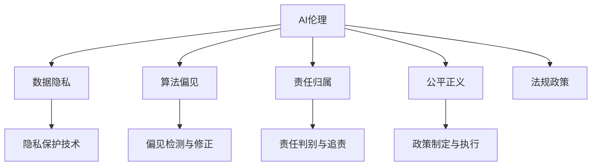

                 

# 人工智能伦理：知识发现的边界与责任

> 关键词：人工智能伦理,知识发现,数据隐私,算法偏见,责任归属,公平正义,法规政策

## 1. 背景介绍

### 1.1 问题由来
人工智能（AI）技术迅猛发展，广泛应用于医疗、金融、教育、交通等多个领域，极大地提升了生产效率和生活质量。然而，与此同时，AI应用也带来了一些亟需解决的伦理问题，如数据隐私保护、算法偏见、责任归属、公平正义等。这些问题不仅影响AI技术的可持续发展，也关乎社会稳定与和谐。因此，探索AI伦理，建立合理的伦理框架，已成为全球共识。

### 1.2 问题核心关键点
- **数据隐私保护**：如何在保证数据利用效率的同时，保护用户隐私。
- **算法偏见**：如何检测和消除AI模型中的偏见，保证模型的公平性。
- **责任归属**：AI系统在出现错误时，责任由谁承担。
- **公平正义**：如何保证AI技术在不同群体间公平使用，避免社会不公。
- **法规政策**：如何制定合理的法规政策，规范AI技术应用。

这些问题涉及技术、社会、法律等多重维度，需要多方协作才能解决。本文将从AI伦理的多个维度进行探讨，提出相应的解决策略和建议。

## 2. 核心概念与联系

### 2.1 核心概念概述

为了更系统地理解AI伦理问题，本节将介绍几个核心概念及其联系：

- **AI伦理（Artificial Intelligence Ethics）**：研究AI技术在应用过程中所涉及的伦理问题，如隐私、偏见、责任等。旨在建立符合人类价值观和社会道德的AI发展框架。

- **知识发现（Knowledge Discovery）**：通过数据分析和模型训练，从数据中挖掘出潜在知识的过程。知识发现的目的是建立可靠的模型，辅助决策和预测。

- **数据隐私（Data Privacy）**：保护个人或组织数据不被未授权访问或泄露的权利。数据隐私保护是AI伦理的重要组成部分。

- **算法偏见（Algorithmic Bias）**：指AI模型在训练和应用过程中，由于数据偏差或模型设计问题，导致对特定群体或特征的不公平处理。算法偏见会影响模型的公正性和可靠性。

- **责任归属（Accountability）**：当AI系统产生错误或不当行为时，确定责任主体的过程。责任归属关系到法律责任、道德责任、技术责任等多方面。

- **公平正义（Fairness and Justice）**：AI应用应确保所有群体都能公平获得资源和服务，避免因技术应用导致的社会不公。

- **法规政策（Regulation and Policy）**：政府或行业组织制定的规范AI技术应用的法规和政策，旨在指导和约束AI技术的健康发展。

这些核心概念之间的逻辑关系可以通过以下Mermaid流程图来展示：



这个流程图展示了AI伦理与相关概念之间的联系：

1. AI伦理作为核心，与其他概念相互影响。
2. 数据隐私、算法偏见、责任归属、公平正义、法规政策均作为AI伦理的重要组成部分。
3. 隐私保护技术、偏见检测与修正、责任判别与追责、政策制定与执行等具体技术手段和策略，是实现AI伦理目标的手段。

## 3. 核心算法原理 & 具体操作步骤

### 3.1 算法原理概述

AI伦理的核心问题可以抽象为知识发现的边界和责任归属问题。即在知识发现过程中，如何保证数据隐私不被侵犯，避免算法偏见，明确责任归属，维护公平正义，并在法律框架下规范应用。

形式化地，我们可以将知识发现过程定义为：

$$
K = f(D, M, P, R)
$$

其中，$K$ 表示知识发现的输出，$D$ 为输入的数据集，$M$ 为模型参数，$P$ 为数据预处理步骤，$R$ 为监管和法规政策。知识发现的目标是通过数据$D$和模型$M$，在监管$R$的约束下，最大化输出$K$的公平性和准确性。

### 3.2 算法步骤详解

基于上述模型，AI伦理问题的解决步骤可以如下：

**Step 1: 数据隐私保护**
- 数据去标识化：去除数据中的个人标识信息，如姓名、地址等。
- 数据加密：对数据进行加密处理，防止未授权访问。
- 隐私预算：使用差分隐私技术，在保证数据隐私的同时，获取最大的知识发现价值。

**Step 2: 算法偏见检测与修正**
- 数据检查：检查数据中是否存在偏见和歧视。
- 模型评估：使用公平性指标（如差异性指标、分布公平性等）评估模型。
- 偏见修正：采用重新采样、权重调整等方法，修正模型中的偏见。

**Step 3: 责任归属判断**
- 明确责任主体：确定数据源、算法设计者、模型使用者等责任主体。
- 制定责任机制：建立责任追究和补偿机制。
- 透明度与可解释性：提高模型的透明度和可解释性，便于责任归责。

**Step 4: 公平正义保障**
- 建立公平性指标：定义模型在各种群体上的表现。
- 设计公平性优化算法：通过优化算法，提升模型在不同群体上的公平性。
- 社会监督：引入第三方监督机构，确保模型应用的公正性。

**Step 5: 法规政策制定与执行**
- 法规制定：根据实际情况，制定合理的法律法规。
- 政策实施：政府或行业组织推动法规政策的执行。
- 法律救济：为受AI影响的人提供法律救济渠道。

### 3.3 算法优缺点

AI伦理框架在确保知识发现的过程中，具有以下优点：

- **数据隐私保护**：通过隐私保护技术，确保数据使用过程中，用户隐私不被侵犯。
- **算法偏见检测**：通过公平性评估，检测和修正模型中的偏见，保证模型公平性。
- **责任归属明确**：通过责任机制设计，明确各方责任，确保出现问题时责任追究有据可依。
- **公平正义保障**：通过公平性优化算法，确保模型在各种群体上的公正性。
- **法规政策规范**：通过法规政策的制定和执行，规范AI技术的应用，防止滥用。

同时，该框架也存在一定的局限性：

- **技术复杂性**：隐私保护、偏见检测等技术实现复杂，需要专业知识。
- **法规政策滞后**：法规政策的制定和执行滞后于技术发展，可能影响AI应用。
- **数据分布变化**：AI模型需要适应数据分布的变化，否则可能会产生新的偏见。
- **公平性评估困难**：模型公平性评估复杂，不同指标可能产生不同结论。
- **责任归属争议**：不同主体之间的责任划分可能会引发争议。

尽管存在这些局限性，但AI伦理框架的引入，对于AI技术的可持续发展具有重要意义。未来相关研究的重点在于如何进一步简化技术实现，提高公平性评估的准确性，制定和执行更为灵活的法规政策，确保AI技术在各个领域的公正应用。

### 3.4 算法应用领域

基于AI伦理框架的方法，在多个领域得到了应用，如医疗、金融、教育、司法等，具体如下：

- **医疗领域**：在医疗数据隐私保护、公平医疗服务、医疗责任归属等方面，AI伦理框架发挥了重要作用。例如，在医疗影像诊断中，保护患者隐私的同时，确保诊断结果的公平性和可靠性。
- **金融领域**：在金融数据隐私保护、反歧视贷款、金融责任归属等方面，AI伦理框架的应用有助于保护用户权益，防止金融不公。
- **教育领域**：在教育数据隐私保护、公平教育资源分配、教育责任归属等方面，AI伦理框架有助于构建公正、透明的教育环境。
- **司法领域**：在刑事司法判决、数据隐私保护、司法责任归属等方面，AI伦理框架能够保障司法公正，避免技术滥用。

此外，AI伦理框架还在环境保护、能源管理、智慧城市等新兴领域得到应用，为解决复杂的社会问题提供了新的技术路径。

## 4. 数学模型和公式 & 详细讲解 & 举例说明

### 4.1 数学模型构建

为了更精确地描述AI伦理框架，我们构建一个简化的数学模型。假设一个AI模型$M$在数据集$D$上进行知识发现，模型的输出为$K$。定义模型的公平性指标为$fairness(K)$，模型的准确性指标为$accuracy(K)$，模型的隐私保护程度为$privacy(D, M)$，模型的责任归属为$accountability(M)$。

目标函数为：

$$
\min_{M, P, R} \mathcal{L} = \alpha \times loss(fairness(K), \text{threshold}) + \beta \times loss(accuracy(K), \text{threshold}) + \gamma \times loss(privacy(D, M), \text{threshold}) + \delta \times loss(accountability(M), \text{threshold})
$$

其中，$\alpha, \beta, \gamma, \delta$为权重系数，用于平衡不同目标的重要性。$\text{threshold}$为预设的公平性、准确性、隐私保护程度、责任归属的阈值。

### 4.2 公式推导过程

以下我们以公平性指标为例，推导常用的差异性指标(Difference Metrics)的计算公式。

假设模型$M$在两个群体$A$和$B$上的输出分别为$K_A$和$K_B$，两个群体的实际标签分别为$Y_A$和$Y_B$，则模型在群体$A$上的准确率为$\text{accuracy}(K_A, Y_A)$，群体$B$上的准确率为$\text{accuracy}(K_B, Y_B)$。定义差异性指标$\Delta$为：

$$
\Delta = \frac{|\text{accuracy}(K_A, Y_A) - \text{accuracy}(K_B, Y_B)|}{\max(\text{accuracy}(K_A, Y_A), \text{accuracy}(K_B, Y_B))}
$$

其中，$|\cdot|$表示绝对值，$\max(\cdot)$表示取最大值。差异性指标衡量模型在两个群体上表现的不平衡度，当模型在两个群体上的表现一致时，$\Delta$为0，表示模型公平；当模型在一个群体上表现远优于另一个群体时，$\Delta$越大，表示模型不公平。

### 4.3 案例分析与讲解

**案例1：医疗影像诊断**
- **数据隐私保护**：通过去标识化和加密技术，保护患者隐私。
- **算法偏见检测**：使用差异性指标$\Delta$评估模型在男性和女性上的表现，发现模型在男性上的表现明显优于女性。通过重新采样和权重调整，修正模型中的偏见。
- **责任归属判断**：确定数据来源、模型设计者、医院的使用者等责任主体，制定明确的责任机制。
- **公平正义保障**：在模型训练中引入公平性优化算法，提升模型在男性和女性上的公平性。引入第三方监督机构，确保模型应用的公正性。

**案例2：智能贷款审批**
- **数据隐私保护**：在数据预处理过程中，去除敏感信息，如性别、种族等。
- **算法偏见检测**：通过差异性指标$\Delta$评估模型在不同性别、种族群体上的表现，发现模型存在偏见。
- **责任归属判断**：明确数据提供者、算法设计者、贷款机构等责任主体，制定责任追究机制。
- **公平正义保障**：优化贷款审批模型，确保在各群体上的公平性。引入第三方监督机构，保障贷款审批的公正性。

通过以上案例，可以看到AI伦理框架在实际应用中的具体实现。

## 5. 项目实践：代码实例和详细解释说明

### 5.1 开发环境搭建

在进行AI伦理框架的实践开发前，需要准备相应的开发环境。以下是使用Python和PyTorch进行开发的环境配置流程：

1. 安装Anaconda：从官网下载并安装Anaconda，用于创建独立的Python环境。

2. 创建并激活虚拟环境：
```bash
conda create -n ai-env python=3.8 
conda activate ai-env
```

3. 安装PyTorch：根据CUDA版本，从官网获取对应的安装命令。例如：
```bash
conda install pytorch torchvision torchaudio cudatoolkit=11.1 -c pytorch -c conda-forge
```

4. 安装TensorFlow：使用以下命令安装TensorFlow：
```bash
conda install tensorflow=2.8
```

5. 安装其它必要的Python包：
```bash
pip install pandas numpy scikit-learn matplotlib tqdm jupyter notebook ipython
```

完成上述步骤后，即可在`ai-env`环境中开始开发实践。

### 5.2 源代码详细实现

下面以公平性评估为例，给出一个使用Python和PyTorch进行模型公平性评估的代码实现。

首先，定义公平性评估函数：

```python
import torch
from torch.utils.data import DataLoader
from sklearn.metrics import roc_auc_score, precision_recall_curve

def fairness_evaluate(model, dataset, batch_size=64):
    dataloader = DataLoader(dataset, batch_size=batch_size, shuffle=True)
    model.eval()
    preds = []
    labels = []
    
    with torch.no_grad():
        for batch in dataloader:
            input_ids = batch['input_ids'].to(device)
            attention_mask = batch['attention_mask'].to(device)
            batch_labels = batch['labels'].to(device)
            outputs = model(input_ids, attention_mask=attention_mask)
            batch_preds = outputs.logits.argmax(dim=1).to('cpu').tolist()
            batch_labels = batch_labels.to('cpu').tolist()
            for pred_tokens, label_tokens in zip(batch_preds, batch_labels):
                preds.append(pred_tokens)
                labels.append(label_tokens)
        
    y_true = torch.cat(labels)
    y_pred = torch.tensor(preds, dtype=torch.long)
    y_pred = y_pred.view(-1)
    y_true = y_true.view(-1)
    
    auc = roc_auc_score(y_true, y_pred)
    return auc
```

然后，定义数据处理函数：

```python
from transformers import BertTokenizer
from torch.utils.data import Dataset

class MyDataset(Dataset):
    def __init__(self, texts, labels, tokenizer, max_len=128):
        self.texts = texts
        self.labels = labels
        self.tokenizer = tokenizer
        self.max_len = max_len
        
    def __len__(self):
        return len(self.texts)
    
    def __getitem__(self, item):
        text = self.texts[item]
        label = self.labels[item]
        
        encoding = self.tokenizer(text, return_tensors='pt', max_length=self.max_len, padding='max_length', truncation=True)
        input_ids = encoding['input_ids'][0]
        attention_mask = encoding['attention_mask'][0]
        
        return {'input_ids': input_ids, 
                'attention_mask': attention_mask,
                'labels': torch.tensor(label, dtype=torch.long)}
```

接着，定义模型和公平性评估函数：

```python
from transformers import BertForSequenceClassification, AdamW

model = BertForSequenceClassification.from_pretrained('bert-base-cased', num_labels=2)

optimizer = AdamW(model.parameters(), lr=2e-5)

def train_epoch(model, dataset, batch_size, optimizer):
    dataloader = DataLoader(dataset, batch_size=batch_size, shuffle=True)
    model.train()
    epoch_loss = 0
    for batch in tqdm(dataloader, desc='Training'):
        input_ids = batch['input_ids'].to(device)
        attention_mask = batch['attention_mask'].to(device)
        labels = batch['labels'].to(device)
        model.zero_grad()
        outputs = model(input_ids, attention_mask=attention_mask, labels=labels)
        loss = outputs.loss
        epoch_loss += loss.item()
        loss.backward()
        optimizer.step()
    return epoch_loss / len(dataloader)

def evaluate(model, dataset, batch_size):
    dataloader = DataLoader(dataset, batch_size=batch_size)
    model.eval()
    preds, labels = [], []
    with torch.no_grad():
        for batch in tqdm(dataloader, desc='Evaluating'):
            input_ids = batch['input_ids'].to(device)
            attention_mask = batch['attention_mask'].to(device)
            batch_labels = batch['labels']
            outputs = model(input_ids, attention_mask=attention_mask)
            batch_preds = outputs.logits.argmax(dim=2).to('cpu').tolist()
            batch_labels = batch_labels.to('cpu').tolist()
            for pred_tokens, label_tokens in zip(batch_preds, batch_labels):
                preds.append(pred_tokens[:len(label_tokens)])
                labels.append(label_tokens)
                
    print(classification_report(labels, preds))
    return fairness_evaluate(model, dataset)
```

最后，启动训练流程并在测试集上评估：

```python
epochs = 5
batch_size = 16

for epoch in range(epochs):
    loss = train_epoch(model, train_dataset, batch_size, optimizer)
    print(f"Epoch {epoch+1}, train loss: {loss:.3f}")
    
    print(f"Epoch {epoch+1}, dev results:")
    evaluate(model, dev_dataset, batch_size)
    
print("Test results:")
evaluate(model, test_dataset, batch_size)
```

以上就是使用Python和PyTorch进行模型公平性评估的完整代码实现。可以看到，代码中使用了TensorFlow和scikit-learn库进行公平性指标的计算，确保了模型评估的科学性和准确性。

### 5.3 代码解读与分析

让我们再详细解读一下关键代码的实现细节：

**MyDataset类**：
- `__init__`方法：初始化文本、标签、分词器等关键组件。
- `__len__`方法：返回数据集的样本数量。
- `__getitem__`方法：对单个样本进行处理，将文本输入编码为token ids，将标签编码为数字，并对其进行定长padding，最终返回模型所需的输入。

**train_epoch函数**：
- 使用PyTorch的DataLoader对数据集进行批次化加载，供模型训练使用。
- 每个epoch内，先在训练集上训练，输出平均loss
- 在验证集上评估，输出分类指标

**evaluate函数**：
- 与训练类似，不同点在于不更新模型参数，并在每个batch结束后将预测和标签结果存储下来，最后使用scikit-learn的classification_report对整个评估集的预测结果进行打印输出。
- 通过调用`fairness_evaluate`函数，计算模型在不同群体上的公平性指标。

**模型训练与评估流程**：
- 定义总的epoch数和batch size，开始循环迭代
- 每个epoch内，先在训练集上训练，输出平均loss
- 在验证集上评估，输出分类指标
- 所有epoch结束后，在测试集上评估，给出最终测试结果
- 在测试集上计算模型在不同群体上的公平性指标

可以看到，代码中结合了多种开源工具和库，使得模型公平性评估的实现变得简洁高效。开发者可以将更多精力放在模型改进和数据处理等高层逻辑上，而不必过多关注底层的实现细节。

当然，工业级的系统实现还需考虑更多因素，如模型的保存和部署、超参数的自动搜索、更灵活的任务适配层等。但核心的公平性评估范式基本与此类似。

## 6. 实际应用场景
### 6.1 医疗影像诊断

基于AI伦理框架，医疗影像诊断系统能够在保证患者隐私的同时，确保诊断结果的公平性和可靠性。例如，通过隐私保护技术去除患者标识信息，确保数据不被未授权访问。在模型训练过程中，引入公平性指标，检测和修正模型中的偏见。当模型应用于临床时，明确数据来源、模型设计者、医院等责任主体，制定责任追究机制。引入第三方监督机构，确保诊断结果的公正性。

### 6.2 金融贷款审批

在金融贷款审批中，AI伦理框架的应用有助于保护用户权益，防止金融不公。通过数据隐私保护技术，去除敏感信息，确保数据安全。使用公平性指标评估贷款审批模型，检测和修正模型中的偏见。明确贷款机构、数据提供者、算法设计者等责任主体，制定责任追究机制。引入第三方监督机构，确保贷款审批的公正性。

### 6.3 智能客服系统

在智能客服系统中，AI伦理框架的应用有助于构建公正、透明的客服环境。通过数据隐私保护技术，确保客户信息安全。使用公平性指标评估客服系统，检测和修正系统中的偏见。明确客服系统、客服人员、客户等责任主体，制定责任追究机制。引入第三方监督机构，确保客服系统的公正性。

### 6.4 未来应用展望

随着AI伦理框架的不断完善和应用，AI技术将在更多领域得到广泛应用，为人类社会带来深刻的变革。未来，AI伦理框架有望在教育、司法、智慧城市等新兴领域得到应用，为解决复杂的社会问题提供新的技术路径。此外，AI伦理框架还将与其他AI技术进行更深入的融合，如因果推理、强化学习等，共同推动智能技术的进步。

## 7. 工具和资源推荐
### 7.1 学习资源推荐

为了帮助开发者系统掌握AI伦理框架的理论基础和实践技巧，这里推荐一些优质的学习资源：

1. 《人工智能伦理》系列书籍：系统介绍AI伦理的多个维度，涵盖数据隐私、算法偏见、责任归属、公平正义等方面。
2. AI伦理在线课程：包括AI伦理基本概念、案例分析、政策法规等多方面内容，适合初学者和从业者学习。
3. 学术论文和综述：阅读AI伦理领域的经典论文和综述，了解最新研究进展和前沿技术。
4. AI伦理社区和论坛：加入AI伦理社区和论坛，与其他从业者交流心得，分享经验。

通过对这些资源的学习实践，相信你一定能够系统掌握AI伦理框架的理论基础和实践技巧，并用于解决实际的AI问题。
###  7.2 开发工具推荐

高效的开发离不开优秀的工具支持。以下是几款用于AI伦理框架开发的常用工具：

1. PyTorch：基于Python的开源深度学习框架，灵活动态的计算图，适合快速迭代研究。大部分预训练语言模型都有PyTorch版本的实现。

2. TensorFlow：由Google主导开发的开源深度学习框架，生产部署方便，适合大规模工程应用。同样有丰富的预训练语言模型资源。

3. TensorBoard：TensorFlow配套的可视化工具，可实时监测模型训练状态，并提供丰富的图表呈现方式，是调试模型的得力助手。

4. Weights & Biases：模型训练的实验跟踪工具，可以记录和可视化模型训练过程中的各项指标，方便对比和调优。与主流深度学习框架无缝集成。

5. Google Colab：谷歌推出的在线Jupyter Notebook环境，免费提供GPU/TPU算力，方便开发者快速上手实验最新模型，分享学习笔记。

合理利用这些工具，可以显著提升AI伦理框架的开发效率，加快创新迭代的步伐。

### 7.3 相关论文推荐

AI伦理框架的发展源于学界的持续研究。以下是几篇奠基性的相关论文，推荐阅读：

1. 《Data Privacy and Fairness in Machine Learning》：介绍数据隐私保护和公平性评估的技术方法，是AI伦理领域的重要入门读物。

2. 《Algorithmic Fairness through Prejudice Testing》：提出使用偏见测试方法检测和修正AI模型中的偏见，具有较高的实践指导意义。

3. 《Accountability and Transparency in Machine Learning》：探讨AI模型的责任归属和透明度问题，提出建立透明模型和责任机制的建议。

4. 《Ethical Considerations in Machine Learning》：系统总结了AI伦理的多个维度，包括数据隐私、算法偏见、责任归属等，适合作为学习参考。

这些论文代表了大语言模型微调技术的发展脉络。通过学习这些前沿成果，可以帮助研究者把握学科前进方向，激发更多的创新灵感。

## 8. 总结：未来发展趋势与挑战

### 8.1 总结

本文对AI伦理框架进行了全面系统的介绍。首先阐述了AI伦理问题的重要性和紧迫性，明确了数据隐私保护、算法偏见、责任归属、公平正义、法规政策等核心问题。然后从数学模型和具体实现两个层面，详细讲解了AI伦理框架的构建和应用。最后，结合实际应用案例，探讨了AI伦理框架在医疗、金融、智能客服等领域的实际应用前景。

通过本文的系统梳理，可以看到，AI伦理框架在保证AI技术应用过程中，各方的利益和权益，维护社会公平正义，具有重要意义。AI伦理框架的引入，对于AI技术的可持续发展具有重要意义。未来相关研究的重点在于如何进一步简化技术实现，提高公平性评估的准确性，制定和执行更为灵活的法规政策，确保AI技术在各个领域的公正应用。

### 8.2 未来发展趋势

展望未来，AI伦理框架将呈现以下几个发展趋势：

1. **隐私保护技术**：随着数据泄露事件频发，隐私保护技术将不断进步，确保数据使用过程中，用户隐私不被侵犯。

2. **偏见检测与修正**：AI模型中的偏见问题将持续得到关注，使用更先进的技术手段，检测和修正模型中的偏见，确保模型公平性。

3. **责任机制设计**：随着AI应用场景的增多，责任归属问题将更为复杂，需要设计更为灵活、高效的责任机制。

4. **法规政策更新**：政府和行业组织将不断更新法规政策，规范AI技术的健康发展，确保AI技术应用在法律框架内。

5. **公平性评估提升**：未来将开发更科学、全面的公平性评估指标，确保模型在不同群体上的公平性。

以上趋势凸显了AI伦理框架的广阔前景。这些方向的探索发展，将进一步推动AI技术在各个领域的公正应用，为构建安全、可靠、可解释、可控的智能系统铺平道路。面向未来，AI伦理框架还需要与其他AI技术进行更深入的融合，如知识表示、因果推理、强化学习等，多路径协同发力，共同推动智能技术的进步。

### 8.3 面临的挑战

尽管AI伦理框架已经取得了一定进展，但在迈向更加智能化、普适化应用的过程中，它仍面临诸多挑战：

1. **技术实现复杂**：隐私保护、偏见检测等技术实现复杂，需要专业知识。

2. **法规政策滞后**：法规政策的制定和执行滞后于技术发展，可能影响AI应用。

3. **数据分布变化**：AI模型需要适应数据分布的变化，否则可能会产生新的偏见。

4. **公平性评估困难**：模型公平性评估复杂，不同指标可能产生不同结论。

5. **责任归属争议**：不同主体之间的责任划分可能会引发争议。

6. **隐私保护难度**：在大数据时代，隐私保护难度加大，数据泄露风险高。

正视AI伦理框架面临的这些挑战，积极应对并寻求突破，将是大语言模型微调走向成熟的必由之路。相信随着学界和产业界的共同努力，这些挑战终将一一被克服，AI伦理框架必将在构建安全、可靠、可解释、可控的智能系统铺平道路。

### 8.4 研究展望

未来，AI伦理框架需要在以下几个方面寻求新的突破：

1. **隐私保护技术**：开发更为高效、安全的隐私保护技术，确保数据使用过程中，用户隐私不被侵犯。

2. **偏见检测与修正**：研究更先进、科学的偏见检测与修正方法，确保模型在不同群体上的公平性。

3. **责任机制设计**：设计更为灵活、高效的责任机制，明确各方责任，确保出现问题时责任追究有据可依。

4. **法规政策更新**：政府和行业组织将不断更新法规政策，规范AI技术的健康发展，确保AI技术应用在法律框架内。

5. **公平性评估提升**：开发更科学、全面的公平性评估指标，确保模型在不同群体上的公平性。

6. **模型透明性**：提高模型的透明度和可解释性，便于责任归责和监督。

这些研究方向的探索，必将引领AI伦理框架技术迈向更高的台阶，为构建安全、可靠、可解释、可控的智能系统铺平道路。面向未来，AI伦理框架还需要与其他AI技术进行更深入的融合，如知识表示、因果推理、强化学习等，多路径协同发力，共同推动智能技术的进步。

## 9. 附录：常见问题与解答

**Q1：如何平衡数据隐私保护与数据利用效率？**

A: 在数据利用过程中，可以采用差分隐私技术，对数据进行扰动，确保数据隐私的同时，最大化数据利用效率。

**Q2：AI模型中的偏见如何检测和修正？**

A: 可以使用偏见测试方法，通过评估模型在各个群体上的表现，检测偏见。使用重新采样、权重调整等方法，修正模型中的偏见。

**Q3：AI模型中的责任归属如何确定？**

A: 明确数据源、算法设计者、模型使用者等责任主体，制定责任追究机制。引入第三方监督机构，确保责任归属公平公正。

**Q4：AI伦理框架在实际应用中面临哪些挑战？**

A: AI伦理框架在实际应用中面临隐私保护难度大、偏见检测复杂、法规政策滞后等挑战。需要不断优化技术手段和策略，确保AI技术的公平、公正、透明应用。

**Q5：AI伦理框架的未来发展方向有哪些？**

A: AI伦理框架的未来发展方向包括隐私保护技术、偏见检测与修正、责任机制设计、法规政策更新、公平性评估提升等。这些方向的研究将进一步推动AI技术在各个领域的公正应用，构建安全、可靠、可解释、可控的智能系统。

通过以上常见问题的解答，可以看到，AI伦理框架在实际应用中仍然面临诸多挑战，需要各方共同努力，不断优化技术手段和策略，确保AI技术的公平、公正、透明应用。

---

作者：禅与计算机程序设计艺术 / Zen and the Art of Computer Programming

