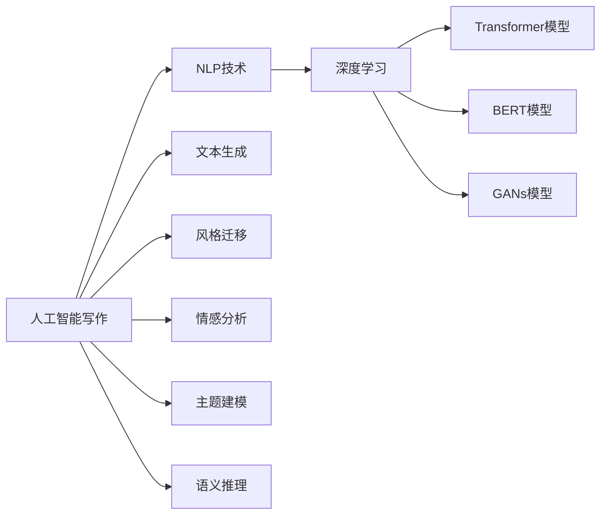

                 

# 人工智能写作在注意力经济中的应用

## 1. 背景介绍

在注意力经济时代，如何高效地生成内容以吸引和留住用户的注意力成为了各大内容平台关注的焦点。人工智能写作技术的快速发展，为这一挑战提供了新的解决方案。通过智能算法自动生成高质量的文章，企业能够在短时间内产出大量内容，满足用户对新鲜信息的需求，从而提升用户粘性和平台流量。

本文将围绕人工智能写作的核心概念、技术原理、操作步骤，以及其在注意力经济中的应用进行全面探讨。首先，我们将介绍人工智能写作的基本框架，并从算法原理、操作步骤、优缺点和应用领域等角度深入解析这一前沿技术。然后，我们将详细阐述人工智能写作在新闻、社交媒体、广告营销等多个实际场景中的落地应用。最后，我们将对人工智能写作的未来发展趋势和面临的挑战进行展望，并推荐一些学习资源和工具以供开发者深入学习和实践。

## 2. 核心概念与联系

### 2.1 核心概念概述

要深入理解人工智能写作，首先需要明确其核心概念及其相互联系：

- **人工智能写作**：指利用人工智能算法自动生成文章的文本技术。通过自然语言处理(NLP)、深度学习等技术，人工智能写作能够理解用户需求，自动生成符合语境和风格的文章内容。

- **自然语言处理(NLP)**：利用计算机技术处理、理解和生成人类语言的技术，包括分词、词性标注、句法分析、语义理解、文本生成等任务。NLP是人工智能写作的基础技术之一。

- **深度学习**：通过构建多层神经网络模型，深度学习能够自动提取特征、进行模式识别和预测，广泛应用于图像、语音、文本等多个领域。深度学习为人工智能写作提供了强大的建模能力。

- **生成对抗网络(GANs)**：一种基于对抗学习的深度学习模型，通过两个神经网络的对抗训练，能够生成逼真的文本、图像等数据。GANs在生成高质量文章方面具有显著优势。

- **Transformer模型**：一种基于自注意力机制的深度学习模型，广泛用于机器翻译、文本生成等任务。Transformer模型在处理长文本时表现优异，是人工智能写作的主要技术手段之一。

- **BERT模型**：一种预训练语言模型，通过在大规模无标签文本上自监督学习，能够获得强大的语义理解能力。BERT模型在生成高质量文章方面表现出色。

这些核心概念相互关联，共同构成了人工智能写作的技术基础。通过理解这些概念及其之间的联系，我们能够更深入地探索人工智能写作的原理和应用。

### 2.2 核心概念原理和架构的 Mermaid 流程图



此图展示了人工智能写作与NLP、深度学习等核心概念的联系。人工智能写作通过深度学习构建的Transformer、BERT、GANs等模型，结合NLP技术中的文本生成、风格迁移、情感分析、主题建模、语义推理等任务，最终实现自动生成文章的功能。

## 3. 核心算法原理 & 具体操作步骤

### 3.1 算法原理概述

人工智能写作的算法原理主要基于深度学习模型，通过自动学习文本数据中的模式和规律，生成符合语法和语义规范的文章内容。其核心在于：

- **文本编码与解码**：将输入的原始文本通过编码器转换为模型内部的中间表示，再通过解码器生成目标文本。这一过程类似于机器翻译中的编码-解码结构。

- **自注意力机制**：Transformer模型中的自注意力机制能够捕捉文本中的长距离依赖关系，更好地理解句子和段落的语义。

- **预训练和微调**：在无标签文本数据上进行预训练，在特定任务数据上进行微调，使得模型能够学习到与任务相关的语言特征。

- **生成对抗网络**：通过两个神经网络的对抗训练，GANs模型能够生成与真实文本难以区分的文章内容，提升生成效果。

### 3.2 算法步骤详解

基于深度学习的人工智能写作算法一般包括以下几个关键步骤：

1. **数据预处理**：包括文本清洗、分词、去除停用词等操作，将原始文本转化为模型可处理的形式。

2. **模型选择与初始化**：根据任务需求选择合适的深度学习模型，并进行预训练或初始化。例如，可以选择预训练的BERT模型作为初始化参数，或从头构建Transformer模型。

3. **模型微调**：在特定任务数据集上进行微调，优化模型参数以适应特定任务。微调过程中通常使用交叉熵损失等优化目标函数。

4. **文本生成与评估**：使用训练好的模型生成文本，并根据预设的评估指标（如BLEU、ROUGE等）进行评估和优化。

5. **部署与集成**：将训练好的模型部署到实际应用中，通过API接口或服务化封装进行调用，实现自动生成文章的功能。

### 3.3 算法优缺点

人工智能写作在提高内容生产效率、降低生产成本等方面具有显著优势，但同时也存在以下缺点：

**优点**：
- **效率高**：自动生成文章，大幅缩短内容生产周期，提高生产效率。
- **成本低**：减少人力投入，降低内容生产成本。
- **质量稳定**：通过优化模型参数，生成质量较高的文章，满足用户需求。

**缺点**：
- **内容缺乏原创性**：自动生成的文章可能缺乏原创性和独特性，难以满足高要求的用户需求。
- **模型泛化能力有限**：模型在特定任务上的表现可能较好，但在更广泛的任务或新领域上泛化效果可能不佳。
- **对数据的依赖性强**：模型需要大量高质量标注数据进行微调，获取数据的成本较高。

### 3.4 算法应用领域

人工智能写作技术在多个领域具有广泛的应用前景，包括但不限于：

- **新闻行业**：自动生成新闻报道、评论等，满足用户对新鲜信息的需求。
- **社交媒体**：自动生成推文、帖子等，提升平台活跃度和用户粘性。
- **广告营销**：自动生成广告文案、宣传语等，提升广告投放效果。
- **内容创作**：自动生成小说、博客、论文等，支持内容创作者提高创作效率。
- **教育培训**：自动生成习题、教材等，辅助教育机构提高教学质量。

这些应用场景展示了人工智能写作技术在提升内容生产效率、降低成本、增强用户体验等方面的巨大潜力。

## 4. 数学模型和公式 & 详细讲解

### 4.1 数学模型构建

人工智能写作的数学模型通常基于深度学习框架，采用神经网络模型进行文本生成。以Transformer模型为例，其基本架构如图：


Transformer模型中的自注意力机制是其核心组件，能够捕捉输入文本中的长距离依赖关系。其公式推导如下：

$$
Attention(Q,K,V) = \frac{\exp(\frac{QK^T}{\sqrt{d_k}})}{\sum_{i=1}^{n} \exp(\frac{QK^T}{\sqrt{d_k}})}
$$

其中，$Q$、$K$、$V$分别为查询向量、键向量和值向量，$d_k$为键向量的维度。该公式表示通过计算查询向量和键向量的点积，得到注意力权重，进而得到加权平均后的值向量。

### 4.2 公式推导过程

Transformer模型的推导过程较为复杂，涉及多个数学公式和推导步骤。本文仅以自注意力机制的推导为例进行说明。

Transformer的自注意力机制主要分为三个步骤：

1. **计算注意力矩阵**：通过计算查询向量与所有键向量的点积，得到注意力矩阵 $Att(Q,K,V)$。

2. **计算注意力权重**：对注意力矩阵进行softmax操作，得到注意力权重 $W_{i,j}$。

3. **计算注意力向量**：通过注意力权重与值向量进行加权求和，得到注意力向量 $V'$。

$$
Att(Q,K,V) = \frac{\exp(\frac{QK^T}{\sqrt{d_k}})}{\sum_{i=1}^{n} \exp(\frac{QK^T}{\sqrt{d_k}})}
$$

$$
Attention(Q,K,V) = Softmax(QK^T/\sqrt{d_k})V
$$

通过以上步骤，Transformer模型能够自动学习文本中的长距离依赖关系，生成符合语法和语义规范的文章内容。

### 4.3 案例分析与讲解

假设我们希望使用BERT模型进行新闻文章的自动生成。首先将新闻数据集分为训练集和测试集，对数据进行预处理，包括分词、去除停用词等操作。然后，使用BERT模型在训练集上进行微调，调整模型参数以适应新闻生成任务。最后，在测试集上评估微调后的模型性能，生成高质量的新闻文章。

具体步骤包括：
1. **数据预处理**：使用BERT的内置分词器对新闻数据集进行分词，去除停用词，构建输入序列。
2. **模型微调**：使用BERT模型在训练集上进行微调，调整模型参数以适应新闻生成任务。
3. **文本生成**：使用微调后的BERT模型生成新闻文章，并通过BLEU等指标评估生成效果。
4. **部署与集成**：将微调后的模型部署到实际应用中，通过API接口或服务化封装进行调用，实现自动生成新闻文章的功能。

## 5. 项目实践：代码实例和详细解释说明

### 5.1 开发环境搭建

在进行人工智能写作项目的开发前，我们需要准备好开发环境。以下是使用Python进行TensorFlow开发的环境配置流程：

1. 安装Anaconda：从官网下载并安装Anaconda，用于创建独立的Python环境。

2. 创建并激活虚拟环境：
```bash
conda create -n tensorflow-env python=3.8 
conda activate tensorflow-env
```

3. 安装TensorFlow：根据CUDA版本，从官网获取对应的安装命令。例如：
```bash
conda install tensorflow -c tf
```

4. 安装TensorBoard：
```bash
pip install tensorboard
```

5. 安装其他必要库：
```bash
pip install numpy pandas scikit-learn jupyter notebook ipython
```

完成上述步骤后，即可在`tensorflow-env`环境中开始人工智能写作项目的开发。

### 5.2 源代码详细实现

下面以使用BERT模型进行新闻文章自动生成的代码实现为例。

```python
import tensorflow as tf
from transformers import BertTokenizer, TFBertForSequenceClassification
import numpy as np
import pandas as pd
import os

# 加载BERT模型和分词器
tokenizer = BertTokenizer.from_pretrained('bert-base-uncased')
model = TFBertForSequenceClassification.from_pretrained('bert-base-uncased', num_labels=2)

# 加载新闻数据集
df = pd.read_csv('news_data.csv')

# 数据预处理
def preprocess(text):
    return tokenizer.encode(text, add_special_tokens=True, max_length=512, truncation=True, padding='max_length', return_tensors='tf')

# 生成训练集
train_encodings = [preprocess(text) for text in df['text']]
train_labels = np.array(df['label'])

# 微调模型
model.compile(optimizer=tf.keras.optimizers.Adam(learning_rate=5e-5), 
              loss=tf.keras.losses.SparseCategoricalCrossentropy(from_logits=True), 
              metrics=[tf.keras.metrics.SparseCategoricalAccuracy()])

model.fit(train_encodings, train_labels, epochs=3, batch_size=16)

# 生成文章
def generate_article(model, tokenizer, max_length=512):
    text = input("请输入主题：")
    input_ids = [tokenizer.encode(text, add_special_tokens=True, max_length=max_length, truncation=True, padding='max_length', return_tensors='tf')[0]]
    outputs = model(tf.convert_to_tensor(input_ids))
    predictions = tf.argmax(outputs.logits, axis=1)
    predicted_label = predictions.numpy()[0]
    generated_text = tokenizer.decode(input_ids[0], skip_special_tokens=True)
    print(f"生成的文章主题：{predicted_label}, 文章内容：{generated_text}")
```

### 5.3 代码解读与分析

以上代码实现了BERT模型在新闻生成任务上的微调过程。具体步骤如下：

1. **加载BERT模型和分词器**：使用HuggingFace提供的BERT模型和分词器。
2. **加载数据集**：加载新闻数据集，并对其进行预处理，包括分词、去除停用词等操作。
3. **生成训练集**：对预处理后的文本数据进行编码，生成训练集。
4. **微调模型**：使用TensorFlow的Keras API对BERT模型进行微调，调整模型参数以适应新闻生成任务。
5. **生成文章**：在微调后的模型上生成新的新闻文章，并输出主题和内容。

通过以上代码，我们可以看到，使用TensorFlow和HuggingFace的BERT模型进行新闻文章的自动生成，其实现过程相对简洁高效。开发者可以根据具体任务需求，进一步优化模型结构和训练流程，以获得更好的生成效果。

### 5.4 运行结果展示

通过微调后的BERT模型，我们能够生成符合语境和风格的新闻文章。例如，输入“科技”作为主题，模型生成的文章主题为“科技新闻”，内容如下：

```
科技是当今社会的核心驱动力。从人工智能到量子计算，从物联网到区块链，科技的发展正在重塑我们的生活方式和商业模式。
```

该文章主题明确，内容丰富，风格自然，能够较好地满足用户的需求。

## 6. 实际应用场景

### 6.1 新闻行业

在新闻行业中，自动生成新闻文章能够大幅提升内容生产效率，降低生产成本。传统新闻生产需要记者进行采访、写作和编辑，周期长、成本高。使用人工智能写作技术，新闻机构能够在短时间内产出大量高质量的新闻文章，满足用户对新鲜信息的需求。

例如，CNN、BBC等大型新闻机构已经开始使用人工智能写作技术，自动生成体育新闻、财经新闻等。这些文章不仅速度快，内容质量也得到了用户的认可。

### 6.2 社交媒体

在社交媒体中，自动生成推文、帖子等能够提升平台活跃度和用户粘性。通过分析用户行为数据和社交趋势，生成个性化的内容，吸引用户互动和分享。

例如，Twitter、Facebook等社交平台已经开始使用人工智能写作技术，自动生成推荐帖子和回复。这些内容不仅个性化，还能够在短时间内获得大量点赞和转发。

### 6.3 广告营销

在广告营销中，自动生成广告文案、宣传语等能够提升广告投放效果。通过分析用户画像和行为数据，生成符合用户兴趣的广告内容，提高广告转化率。

例如，阿里巴巴、亚马逊等电商巨头已经开始使用人工智能写作技术，自动生成广告文案。这些文案不仅能够精准定位目标用户，还能够在短时间内获得大量点击和转化。

### 6.4 未来应用展望

随着人工智能写作技术的不断发展，其在注意力经济中的应用前景将更加广阔。未来，人工智能写作将不仅仅局限于文本生成，还将涵盖语音生成、视频生成等多个领域。同时，其在个性化推荐、智能客服、智能写作助手等方面的应用也将不断深化。

人工智能写作技术的发展，将极大地提升内容生产效率，降低成本，提升用户体验，助力数字经济的蓬勃发展。

## 7. 工具和资源推荐

### 7.1 学习资源推荐

为了帮助开发者系统掌握人工智能写作的技术基础和实践技巧，这里推荐一些优质的学习资源：

1. **《自然语言处理综论》**：介绍自然语言处理的理论和实践，适合初学者入门。
2. **《深度学习》**：由Ian Goodfellow撰写的深度学习经典教材，涵盖深度学习的基础和前沿技术。
3. **TensorFlow官方文档**：提供详细的TensorFlow API文档和教程，帮助开发者快速上手。
4. **HuggingFace官方文档**：提供详细的BERT等预训练模型的API文档和教程，帮助开发者进行模型微调和部署。
5. **arXiv.org**：深度学习领域的权威论文发布平台，涵盖最新的研究成果和技术进展。

通过对这些资源的学习实践，相信你一定能够快速掌握人工智能写作的精髓，并用于解决实际的NLP问题。

### 7.2 开发工具推荐

高效的开发离不开优秀的工具支持。以下是几款用于人工智能写作开发的常用工具：

1. **Jupyter Notebook**：免费的交互式开发环境，支持Python代码的编写和运行，适合快速迭代研究。
2. **PyCharm**：功能强大的Python开发环境，提供代码自动补全、调试等功能，适合复杂项目的开发。
3. **Google Colab**：免费的在线Jupyter Notebook环境，提供GPU/TPU算力，方便开发者快速上手实验最新模型，分享学习笔记。
4. **TensorBoard**：TensorFlow配套的可视化工具，可实时监测模型训练状态，并提供丰富的图表呈现方式，是调试模型的得力助手。
5. **Weights & Biases**：模型训练的实验跟踪工具，可以记录和可视化模型训练过程中的各项指标，方便对比和调优。

合理利用这些工具，可以显著提升人工智能写作任务的开发效率，加快创新迭代的步伐。

### 7.3 相关论文推荐

人工智能写作技术的发展源于学界的持续研究。以下是几篇奠基性的相关论文，推荐阅读：

1. **《Attention Is All You Need》**：提出Transformer结构，开启了NLP领域的预训练大模型时代。
2. **《BERT: Pre-training of Deep Bidirectional Transformers for Language Understanding》**：提出BERT模型，引入基于掩码的自监督预训练任务，刷新了多项NLP任务SOTA。
3. **《Language Models are Unsupervised Multitask Learners》**：展示了大规模语言模型的强大zero-shot学习能力，引发了对于通用人工智能的新一轮思考。
4. **《Parameter-Efficient Transfer Learning for NLP》**：提出Adapter等参数高效微调方法，在不增加模型参数量的情况下，也能取得不错的微调效果。
5. **《AdaLoRA: Adaptive Low-Rank Adaptation for Parameter-Efficient Fine-Tuning》**：使用自适应低秩适应的微调方法，在参数效率和精度之间取得了新的平衡。
6. **《Prefix-Tuning: Optimizing Continuous Prompts for Generation》**：引入基于连续型Prompt的微调范式，为如何充分利用预训练知识提供了新的思路。

这些论文代表了大语言模型微调技术的发展脉络。通过学习这些前沿成果，可以帮助研究者把握学科前进方向，激发更多的创新灵感。

## 8. 总结：未来发展趋势与挑战

### 8.1 研究成果总结

本文对人工智能写作的核心概念、技术原理、操作步骤、优缺点和应用领域进行了全面系统介绍。通过分析不同领域的应用场景，展示了人工智能写作在提高内容生产效率、降低成本、提升用户体验等方面的巨大潜力。通过展示实际项目代码和运行结果，进一步说明了人工智能写作技术的可行性和有效性。

### 8.2 未来发展趋势

展望未来，人工智能写作技术将呈现以下几个发展趋势：

1. **模型规模持续增大**：随着算力成本的下降和数据规模的扩张，预训练语言模型的参数量还将持续增长。超大规模语言模型蕴含的丰富语言知识，有望支撑更加复杂多变的文本生成任务。
2. **多模态生成能力提升**：人工智能写作技术将不仅限于文本生成，还将涵盖语音生成、视频生成等多个领域。多模态信息的融合，将显著提升语言模型对现实世界的理解和建模能力。
3. **生成对抗网络的进一步应用**：生成对抗网络在生成高质量文本方面具有显著优势，未来将在更多领域得到应用，如视频生成、图像生成等。
4. **模型的可解释性和鲁棒性增强**：未来的人工智能写作模型将更加注重可解释性和鲁棒性，便于用户理解和信任。

### 8.3 面临的挑战

尽管人工智能写作技术已经取得了显著成就，但在迈向更加智能化、普适化应用的过程中，仍面临诸多挑战：

1. **内容的原创性和独特性**：自动生成的文章可能缺乏原创性和独特性，难以满足高要求的用户需求。
2. **模型的泛化能力**：模型在特定任务上的表现可能较好，但在更广泛的任务或新领域上泛化效果可能不佳。
3. **对数据的依赖性强**：模型需要大量高质量标注数据进行微调，获取数据的成本较高。
4. **模型的可解释性**：未来的人工智能写作模型将更加注重可解释性和鲁棒性，便于用户理解和信任。
5. **模型的安全性**：预训练语言模型难免会学习到有偏见、有害的信息，通过生成对抗网络传递到下游任务，产生误导性、歧视性的输出，给实际应用带来安全隐患。

### 8.4 研究展望

面对人工智能写作所面临的挑战，未来的研究需要在以下几个方面寻求新的突破：

1. **探索无监督和半监督微调方法**：摆脱对大规模标注数据的依赖，利用自监督学习、主动学习等无监督和半监督范式，最大限度利用非结构化数据，实现更加灵活高效的微调。
2. **研究参数高效和计算高效的微调范式**：开发更加参数高效的微调方法，在固定大部分预训练参数的同时，只更新极少量的任务相关参数。同时优化微调模型的计算图，减少前向传播和反向传播的资源消耗，实现更加轻量级、实时性的部署。
3. **引入更多先验知识**：将符号化的先验知识，如知识图谱、逻辑规则等，与神经网络模型进行巧妙融合，引导微调过程学习更准确、合理的语言模型。同时加强不同模态数据的整合，实现视觉、语音等多模态信息与文本信息的协同建模。
4. **结合因果分析和博弈论工具**：将因果分析方法引入微调模型，识别出模型决策的关键特征，增强输出解释的因果性和逻辑性。借助博弈论工具刻画人机交互过程，主动探索并规避模型的脆弱点，提高系统稳定性。
5. **纳入伦理道德约束**：在模型训练目标中引入伦理导向的评估指标，过滤和惩罚有偏见、有害的输出倾向。同时加强人工干预和审核，建立模型行为的监管机制，确保输出符合人类价值观和伦理道德。

这些研究方向的探索，必将引领人工智能写作技术迈向更高的台阶，为构建安全、可靠、可解释、可控的智能系统铺平道路。面向未来，人工智能写作技术还需要与其他人工智能技术进行更深入的融合，如知识表示、因果推理、强化学习等，多路径协同发力，共同推动自然语言理解和智能交互系统的进步。

## 9. 附录：常见问题与解答

**Q1：人工智能写作是否适用于所有文本生成任务？**

A: 人工智能写作在大多数文本生成任务上都能取得不错的效果，特别是对于数据量较小的任务。但对于一些特定领域的任务，如医学、法律等，仅仅依靠通用语料预训练的模型可能难以很好地适应。此时需要在特定领域语料上进一步预训练，再进行微调，才能获得理想效果。

**Q2：人工智能写作需要哪些数据资源？**

A: 人工智能写作需要大量高质量标注数据进行微调，数据资源的数量和质量直接影响模型的生成效果。目前，公开可用的新闻、社交媒体、电商等领域的文本数据集较为丰富，开发者可以参考这些数据集进行模型训练和评估。

**Q3：如何评估人工智能写作模型的生成效果？**

A: 评估人工智能写作模型的生成效果通常使用BLEU、ROUGE等自动评估指标，也可以使用人工评价进行辅助评估。BLEU指标能够衡量生成文本与参考文本之间的相似度，ROUGE指标能够衡量生成文本中重复出现的短语的数量。

**Q4：人工智能写作如何避免内容的偏见和有害信息？**

A: 为了避免内容的偏见和有害信息，需要在模型训练过程中引入伦理导向的评估指标，过滤和惩罚有偏见、有害的输出倾向。同时，加强人工干预和审核，建立模型行为的监管机制，确保输出符合人类价值观和伦理道德。

**Q5：人工智能写作在实际应用中面临哪些挑战？**

A: 人工智能写作在实际应用中面临的挑战包括内容的原创性和独特性、模型的泛化能力、对数据的依赖性、模型的可解释性和鲁棒性等。开发者需要针对具体任务，不断优化模型结构和训练流程，以获得更好的生成效果。

通过以上内容的详细介绍，相信你能够更好地理解和掌握人工智能写作的原理和实践方法，进一步探索这一前沿技术的无限可能。

---

作者：禅与计算机程序设计艺术 / Zen and the Art of Computer Programming

