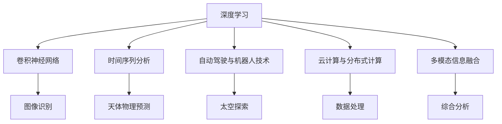

                 

# 人工智能在太空探索和天文学中的应用

> 关键词：太空探索, 天文学, 人工智能, 深度学习, 数据处理, 图像识别, 天体物理

## 1. 背景介绍

### 1.1 问题由来
随着人工智能(AI)技术的快速发展，其在各个领域的广泛应用日益凸显。在太空探索和天文学领域，AI技术已经成为不可或缺的工具，大大提升了数据处理、图像识别和天体物理研究的效率和精度。利用AI，研究人员可以自动化处理大量数据、识别复杂模式、预测天体行为，从而加速科学发现和技术进步。本文将详细探讨AI在太空探索和天文学中的各种应用场景，分析其核心算法原理和操作步骤，并展望未来发展趋势与挑战。

### 1.2 问题核心关键点
AI在太空探索和天文学中的核心关键点包括：
- 数据处理：利用深度学习模型自动分析和处理海量观测数据。
- 图像识别：通过卷积神经网络(CNN)技术，实现对天文图像的自动标注和特征提取。
- 天体物理预测：基于时间序列分析和机器学习模型，预测天体的运动轨迹和事件。
- 自动化系统：构建自动化任务执行系统，提高太空探索和天文观测的效率。
- 多模态信息融合：将观测数据、历史数据和专家知识结合起来，提升综合分析能力。
- 云计算与分布式计算：利用云平台和分布式计算技术，加速模型训练和数据处理。

这些关键点共同构成了AI在太空探索和天文学应用的基础，下面我们将详细阐述。

## 2. 核心概念与联系

### 2.1 核心概念概述

为了更好地理解AI在太空探索和天文学中的作用，本节将介绍几个核心概念及其之间的联系：

- 深度学习(Deep Learning)：一种模拟人脑神经网络的学习方法，通过多层神经网络结构，从数据中学习到复杂的模式和特征。
- 卷积神经网络(CNN)：一种特殊的深度学习网络，主要用于图像处理和识别任务，能够高效提取局部特征和全局结构。
- 时间序列分析(Time Series Analysis)：对时间依赖的数据序列进行分析，预测未来趋势和事件，适用于天体运动和自然现象的预测。
- 自动驾驶与机器人技术(Autonomous Vehicles and Robotics)：在太空探索和天文观测中，自动驾驶与机器人技术用于执行复杂的探测任务，提高任务执行的精度和效率。
- 云计算与分布式计算(Cloud Computing and Distributed Computing)：通过云端计算资源，实现大规模数据处理和模型训练，提高计算效率和可扩展性。
- 多模态信息融合(Multimodal Information Fusion)：将不同类型的数据（如图像、光谱、运动轨迹等）结合起来，进行综合分析和判断，提升天体物理研究的深度和广度。

这些核心概念之间的逻辑关系可以通过以下Mermaid流程图来展示：



这个流程图展示了AI在太空探索和天文学应用的各个环节：

1. 深度学习提供基础学习能力，卷积神经网络用于图像识别。
2. 时间序列分析用于天体物理预测，自动驾驶和机器人技术用于执行探测任务。
3. 云计算和分布式计算提供高效计算能力，多模态信息融合提升综合分析能力。

## 3. 核心算法原理 & 具体操作步骤

### 3.1 算法原理概述

AI在太空探索和天文学中的核心算法主要集中在以下几个方面：

- 深度学习模型：用于处理和分析大规模观测数据，学习数据的高级特征和模式。
- 卷积神经网络：用于对天文图像进行像素级特征提取和识别，常用于识别星体、星系等天体。
- 时间序列分析：用于预测天体运动轨迹和事件，常用于太阳黑子、行星轨道等预测。
- 自动驾驶与机器人技术：用于执行复杂的太空探测任务，如火星车、太空望远镜等。
- 云计算与分布式计算：用于加速模型训练和数据处理，提供高效的计算资源。
- 多模态信息融合：用于将不同类型的数据结合起来，进行综合分析和判断。

### 3.2 算法步骤详解

以下详细讲解基于AI的太空探索和天文学应用的具体操作步骤：

**Step 1: 数据采集与预处理**
- 收集和整理相关的天文观测数据，包括光谱、图像、运动轨迹等。
- 对数据进行预处理，如去噪、归一化、去除异常值等。

**Step 2: 模型选择与训练**
- 根据具体应用场景选择合适的深度学习模型或卷积神经网络。
- 使用训练集对模型进行训练，调整模型参数，以提高模型性能。

**Step 3: 特征提取与标注**
- 使用训练好的模型对数据进行特征提取，如从天文图像中提取局部特征。
- 对提取出的特征进行标注，如对星系、星体等进行分类和识别。

**Step 4: 预测与分析**
- 利用训练好的模型对新数据进行预测，如预测天体的运动轨迹和事件。
- 结合历史数据和专家知识，进行综合分析和判断，提升分析精度。

**Step 5: 部署与优化**
- 将训练好的模型部署到自动驾驶或机器人系统中，执行太空探索任务。
- 持续优化模型，提高模型精度和效率。

### 3.3 算法优缺点

AI在太空探索和天文学中的应用具有以下优点：
1. 高效处理大数据：深度学习和卷积神经网络能够高效处理海量天文数据，提取高级特征和模式。
2. 自动化分析：自动驾驶和机器人技术能够执行复杂探测任务，提高任务执行的精度和效率。
3. 预测能力：时间序列分析和机器学习模型能够预测天体行为，辅助科学决策。
4. 跨领域融合：多模态信息融合将不同类型的数据结合起来，提升综合分析能力。
5. 云计算支持：云计算和分布式计算提供高效计算能力，加速模型训练和数据处理。

同时，也存在一些缺点：
1. 数据质量要求高：需要高质量的观测数据，数据获取和处理成本较高。
2. 模型复杂度高：深度学习模型参数量庞大，需要高性能计算资源支持。
3. 泛化能力不足：模型在特定场景下表现良好，但对新数据的泛化能力有限。
4. 可解释性不足：深度学习模型的内部工作机制复杂，难以解释其决策过程。
5. 依赖领域知识：多模态信息融合需要领域专家的知识支持和指导，依赖性强。

### 3.4 算法应用领域

AI在太空探索和天文学中已应用于多个领域，例如：

- 天文图像处理：如使用CNN对天文图像进行像素级特征提取和分类，识别星体、星系等。
- 天体物理预测：如利用时间序列分析预测太阳黑子活动、行星轨道等。
- 太空探测任务：如使用自动驾驶和机器人技术执行火星探测、太空望远镜观测等任务。
- 多模态数据分析：如将光谱数据、图像数据和运动轨迹数据结合起来，进行综合分析和判断。
- 数据可视化与展示：如将分析结果以可视化方式展示，便于科学家理解和研究。
- 自动化任务执行：如自动化控制太空望远镜、火星车等执行复杂任务。

## 4. 数学模型和公式 & 详细讲解  
### 4.1 数学模型构建

在AI的太空探索和天文学应用中，主要涉及以下数学模型：

- 卷积神经网络模型：用于图像识别，构建公式如下：
$$
\mathcal{L}_{\text{CNN}} = \sum_{i=1}^N \ell(\mathbf{x}_i, \hat{\mathbf{x}}_i)
$$
其中，$\ell$ 为损失函数，$\mathbf{x}_i$ 为输入图像，$\hat{\mathbf{x}}_i$ 为模型输出图像。

- 时间序列分析模型：用于预测天体运动，构建公式如下：
$$
\mathcal{L}_{\text{TS}} = \frac{1}{N}\sum_{i=1}^N \|y_i - \hat{y}_i\|^2
$$
其中，$y_i$ 为真实标签，$\hat{y}_i$ 为模型预测值。

- 多模态信息融合模型：将不同类型的数据结合起来，构建公式如下：
$$
\mathcal{L}_{\text{MF}} = \sum_{i=1}^N \mathcal{L}_{\text{CNN}} + \mathcal{L}_{\text{TS}}
$$

### 4.2 公式推导过程

以下对核心数学模型的公式进行推导：

**卷积神经网络模型**
- 输入图像 $\mathbf{x}_i \in \mathbb{R}^{C \times H \times W}$，输出图像 $\hat{\mathbf{x}}_i \in \mathbb{R}^{C \times H \times W}$。
- 定义损失函数 $\ell$ 为交叉熵损失：
$$
\ell(\mathbf{x}_i, \hat{\mathbf{x}}_i) = -\frac{1}{C} \sum_{c=1}^C y_{i,c} \log \hat{y}_{i,c}
$$
其中，$C$ 为类别数，$y_{i,c}$ 为真实类别标签，$\hat{y}_{i,c}$ 为模型预测概率。

**时间序列分析模型**
- 定义时间序列数据 $\{y_t\}_{t=1}^N$，预测值 $\{\hat{y}_t\}_{t=1}^N$。
- 定义损失函数 $\ell$ 为均方误差损失：
$$
\ell(y_i, \hat{y}_i) = \frac{1}{N} \sum_{i=1}^N (y_i - \hat{y}_i)^2
$$

**多模态信息融合模型**
- 定义不同类型的数据 $\mathbf{x}_i \in \mathbb{R}^{C \times H \times W}$，$\mathbf{y}_i \in \mathbb{R}^{T \times H \times W}$。
- 定义融合后的数据 $\mathbf{z}_i = (\mathbf{x}_i, \mathbf{y}_i)$，构建综合损失函数：
$$
\mathcal{L}_{\text{MF}} = \sum_{i=1}^N \mathcal{L}_{\text{CNN}}(\mathbf{x}_i, \hat{\mathbf{x}}_i) + \mathcal{L}_{\text{TS}}(\mathbf{y}_i, \hat{\mathbf{y}}_i)
$$

### 4.3 案例分析与讲解

以天文学中常用的Hubble Deep Field(HDF)数据为例，分析AI在图像处理中的应用：

1. **数据获取**：收集HDF数据集，包括高分辨率的图像和运动轨迹。
2. **数据预处理**：对图像进行归一化、去噪和预处理，提取特征。
3. **模型选择**：选择适当的卷积神经网络模型，如ResNet、Inception等。
4. **特征提取**：使用训练好的CNN模型提取像素级特征。
5. **标注与分类**：对提取出的特征进行标注，分类识别星体、星系等天体。
6. **验证与优化**：在验证集上评估模型性能，调整模型参数进行优化。

最终，通过AI模型可以自动处理HDF数据，识别和分类大量天体，大大提升天文学家的工作效率。

## 5. 项目实践：代码实例和详细解释说明

### 5.1 开发环境搭建

在进行AI太空探索和天文学应用开发时，需要准备相应的开发环境。以下是使用Python进行TensorFlow开发的环境配置流程：

1. 安装Anaconda：从官网下载并安装Anaconda，用于创建独立的Python环境。

2. 创建并激活虚拟环境：
```bash
conda create -n tf-env python=3.8 
conda activate tf-env
```

3. 安装TensorFlow：根据CUDA版本，从官网获取对应的安装命令。例如：
```bash
conda install tensorflow-gpu -c tensorflow -c conda-forge
```

4. 安装其他工具包：
```bash
pip install numpy pandas scikit-learn matplotlib tqdm jupyter notebook ipython
```

完成上述步骤后，即可在`tf-env`环境中开始AI太空探索和天文学应用的开发。

### 5.2 源代码详细实现

下面以天文学图像分类为例，给出使用TensorFlow对CNN模型进行训练的PyTorch代码实现。

首先，定义CNN模型：

```python
import tensorflow as tf
from tensorflow.keras import layers

model = tf.keras.Sequential([
    layers.Conv2D(32, (3,3), activation='relu', input_shape=(64,64,3)),
    layers.MaxPooling2D((2,2)),
    layers.Conv2D(64, (3,3), activation='relu'),
    layers.MaxPooling2D((2,2)),
    layers.Conv2D(128, (3,3), activation='relu'),
    layers.MaxPooling2D((2,2)),
    layers.Flatten(),
    layers.Dense(128, activation='relu'),
    layers.Dense(10, activation='softmax')
])
```

接着，定义损失函数和优化器：

```python
model.compile(optimizer='adam', loss='categorical_crossentropy', metrics=['accuracy'])
```

然后，准备训练集和测试集：

```python
train_dataset = tf.keras.datasets.cifar10.load_data()
test_dataset = tf.keras.datasets.cifar10.load_data()
train_dataset, test_dataset = train_dataset / 255.0, test_dataset / 255.0
```

最后，启动训练流程：

```python
epochs = 10
batch_size = 32

model.fit(train_dataset, epochs=epochs, batch_size=batch_size, validation_data=test_dataset)
```

以上就是使用TensorFlow对CNN模型进行天文图像分类的完整代码实现。可以看到，TensorFlow提供了丰富的工具和库，使得模型开发和训练变得简单易行。

### 5.3 代码解读与分析

让我们再详细解读一下关键代码的实现细节：

**CNN模型定义**
- 使用`Sequential`模型创建卷积神经网络。
- 定义多个卷积层和池化层，提取像素级特征。
- 最后添加一个全连接层进行分类。

**模型编译**
- 使用`compile`方法设置优化器和损失函数，如Adam优化器和交叉熵损失。
- 定义模型评估指标，如准确率。

**数据加载**
- 使用`load_data`函数加载CIFAR-10数据集。
- 对数据进行归一化，将像素值缩放到0-1之间。

**模型训练**
- 使用`fit`方法进行模型训练，指定训练轮数和批大小。
- 在验证集上评估模型性能，防止过拟合。

## 6. 实际应用场景

### 6.1 天文图像处理

天文图像处理是AI在太空探索和天文学中的重要应用之一。通过深度学习模型，可以自动识别和分类大量的天文图像，提取天体的特征信息。

在实践中，可以使用卷积神经网络对天文图像进行像素级特征提取，然后利用分类器进行分类和识别。例如，使用ResNet或Inception等模型，对星系、星云、星体等进行自动识别和分类。这种方法可以显著提升天文图像处理的效率和精度，帮助天文学家快速处理大量的天文数据。

### 6.2 天体物理预测

天体物理预测是AI在太空探索和天文学中的另一个重要应用。通过时间序列分析和机器学习模型，可以对天体的运动轨迹和事件进行预测。

例如，利用时间序列模型，可以预测太阳黑子活动的周期性变化，预测行星轨道的精确位置，预测超新星爆发的可能性等。这些预测有助于科学家制定观测计划，提升天文观测的效率和精确度。

### 6.3 自动驾驶与机器人技术

自动驾驶与机器人技术在太空探索和天文观测中具有广泛应用。例如，使用机器人技术执行火星车、太空望远镜等复杂任务，可以大大提高任务执行的精度和效率。

在火星车任务中，可以使用深度学习模型对火星表面进行图像识别，引导火星车避开障碍物，执行科学探测任务。在太空望远镜任务中，可以使用机器人技术调整望远镜的位置和角度，自动观测和记录天文现象。这些技术的应用，使得太空探索和天文观测变得更加高效和可靠。

## 7. 工具和资源推荐

### 7.1 学习资源推荐

为了帮助开发者系统掌握AI在太空探索和天文学中的应用，这里推荐一些优质的学习资源：

1. 《TensorFlow实战深度学习》系列书籍：由TensorFlow官方文档编写组编写的实战指南，适合初学者入门。
2. 《深度学习基础》课程：由斯坦福大学和吴恩达教授联合推出的深度学习课程，内容涵盖广泛，适合深入学习。
3. 《计算机视觉: 模型、学习和推理》书籍：详细介绍了计算机视觉的基本概念和技术，适合视觉任务开发。
4. 《天文学中的机器学习》系列论文：展示了机器学习在天文数据分析中的应用，适合学术研究。
5. 《Python for Data Analysis》书籍：由Pandas的创始人编写的数据分析入门书籍，适合处理和分析天文数据。

通过这些资源的学习，相信你一定能够快速掌握AI在太空探索和天文学中的应用，并用于解决实际的科学问题。

### 7.2 开发工具推荐

高效的开发离不开优秀的工具支持。以下是几款用于AI太空探索和天文学应用开发的常用工具：

1. TensorFlow：由Google主导开发的深度学习框架，功能强大，支持多种模型和算法。
2. PyTorch：由Facebook开发的深度学习框架，易于使用，适合快速迭代研究。
3. Jupyter Notebook：开源的交互式计算环境，支持多种语言和库，适合科研和教学。
4. Scikit-learn：Python的机器学习库，提供了丰富的数据处理和模型评估工具。
5. Keras：高层次的神经网络库，简单易用，适合初学者和快速原型开发。

合理利用这些工具，可以显著提升AI太空探索和天文学应用的开发效率，加速创新迭代的步伐。

### 7.3 相关论文推荐

AI在太空探索和天文学的发展离不开学界的持续研究。以下是几篇奠基性的相关论文，推荐阅读：

1. ImageNet Classification with Deep Convolutional Neural Networks：提出了卷积神经网络在图像分类任务中的应用，奠定了CNN在天文图像处理的基础。
2. Deep Learning for Astronomical Data Analysis：展示了深度学习在天文数据分析中的应用，包括特征提取、分类和预测等。
3. SpaceNet Challenge：展示了卫星遥感数据的深度学习应用，提升了地球观测和环境监测的精度和效率。
4. Machine Learning in Astronomy：综述了机器学习在天文研究中的应用，涵盖了分类、回归、聚类等多种方法。
5. CIFAR-10 Dataset：提供了大规模的图像数据集，用于训练和评估深度学习模型，广泛应用于天文图像分类。

这些论文代表了大规模AI在太空探索和天文学应用的最新进展，为研究者提供了丰富的理论和实践指导。

## 8. 总结：未来发展趋势与挑战

### 8.1 总结

本文对AI在太空探索和天文学中的应用进行了全面系统的介绍。首先阐述了AI在太空探索和天文学中的研究背景和应用意义，明确了深度学习、卷积神经网络、时间序列分析等技术的重要性。其次，从原理到实践，详细讲解了AI在太空探索和天文学应用的数学模型和操作步骤，给出了具体的代码实现和解释分析。同时，本文还广泛探讨了AI在天文图像处理、天体物理预测、自动驾驶与机器人技术等多个领域的应用前景，展示了AI技术的广泛影响。此外，本文精选了AI应用的各类学习资源，力求为读者提供全方位的技术指引。

通过本文的系统梳理，可以看到，AI技术在太空探索和天文学中的应用前景广阔，其核心算法和技术手段也在不断发展和演进。AI不仅能够处理和分析海量数据，提升观测和探测的效率，还能够预测天体行为，辅助科学决策。未来，随着技术的进步和应用场景的拓展，AI在太空探索和天文学中的应用将更加广泛和深入，为人类对宇宙的探索和理解注入新的力量。

### 8.2 未来发展趋势

展望未来，AI在太空探索和天文学中的应用将呈现以下几个发展趋势：

1. 模型复杂度提高：随着计算资源的丰富和深度学习模型的不断发展，未来模型复杂度将进一步提高，处理能力和精度将大幅提升。
2. 多模态信息融合：将图像、光谱、运动轨迹等多种数据结合起来，进行综合分析和判断，提升分析和预测能力。
3. 自监督学习和无监督学习：利用无标签数据进行预训练和微调，减少对标注数据的依赖，提升模型泛化能力。
4. 自动化系统发展：自动驾驶与机器人技术将进一步发展，执行更加复杂和精细的太空探测任务。
5. 云计算与分布式计算：云计算和分布式计算技术将提供更加高效和可扩展的计算资源，加速模型训练和数据处理。
6. 多领域交叉应用：将AI技术与物理学、天文学等领域结合起来，进行跨领域融合和创新，推动科学进步。

以上趋势凸显了AI在太空探索和天文学应用的发展潜力，为未来的科研和技术创新提供了新的方向。

### 8.3 面临的挑战

尽管AI在太空探索和天文学中的应用已取得显著成果，但在迈向更加智能化、普适化应用的过程中，仍面临诸多挑战：

1. 数据质量瓶颈：高质量的观测数据是AI应用的基础，但数据获取和处理成本较高，限制了AI技术的应用范围。
2. 模型复杂性增加：深度学习模型参数量庞大，计算资源需求高，对高性能计算设备依赖性强。
3. 模型泛化能力不足：模型在特定场景下表现良好，但对新数据的泛化能力有限，难以适应未知环境。
4. 模型可解释性不足：深度学习模型的内部工作机制复杂，难以解释其决策过程，影响模型的可信度和应用效果。
5. 多模态信息整合困难：不同类型的数据之间存在异构性和差异性，整合难度大，需要领域专家的支持和指导。

这些挑战需要科研人员和工程师不断探索和突破，才能使AI技术在太空探索和天文学中发挥更大的作用。

### 8.4 研究展望

面对AI在太空探索和天文学中的应用面临的挑战，未来的研究需要在以下几个方面寻求新的突破：

1. 优化数据获取和处理：探索新的数据获取技术和自动化处理手段，降低数据获取和处理的成本，提高数据的质量和多样性。
2. 开发高效计算平台：设计和优化计算平台，支持大规模深度学习模型的训练和推理，提升计算效率和资源利用率。
3. 提升模型泛化能力：通过迁移学习、多模态学习等方法，增强模型对新数据的泛化能力，提升模型的适应性和鲁棒性。
4. 增强模型可解释性：引入可解释性方法，如可视化、规则推理等，提升模型的透明度和可信度，便于科学理解和应用。
5. 加强多领域交叉研究：将AI技术与物理学、天文学等领域结合起来，进行跨领域融合和创新，推动科学进步和技术应用。

这些研究方向将为AI在太空探索和天文学中的应用提供新的突破口，推动技术的发展和应用，为人类对宇宙的探索和理解注入新的力量。

## 9. 附录：常见问题与解答

**Q1：AI在太空探索和天文学中应用的核心关键点有哪些？**

A: AI在太空探索和天文学中应用的核心关键点包括：
1. 深度学习：用于处理和分析大规模观测数据，学习数据的高级特征和模式。
2. 卷积神经网络：用于对天文图像进行像素级特征提取和识别，常用于识别星体、星系等天体。
3. 时间序列分析：用于预测天体运动轨迹和事件，常用于太阳黑子、行星轨道等预测。
4. 自动驾驶与机器人技术：用于执行复杂的太空探测任务，如火星车、太空望远镜等。
5. 云计算与分布式计算：用于加速模型训练和数据处理，提供高效的计算资源。
6. 多模态信息融合：将不同类型的数据结合起来，进行综合分析和判断。

这些关键点共同构成了AI在太空探索和天文学应用的基础，下面我们将详细阐述。

**Q2：AI在太空探索和天文学中的应用场景有哪些？**

A: AI在太空探索和天文学中已经应用于多个领域，包括：
1. 天文图像处理：如使用CNN对天文图像进行像素级特征提取和分类，识别星体、星系等天体。
2. 天体物理预测：如利用时间序列分析预测太阳黑子活动、行星轨道等。
3. 自动驾驶与机器人技术：如使用机器人技术执行火星车、太空望远镜等复杂任务。
4. 多模态数据分析：如将光谱数据、图像数据和运动轨迹数据结合起来，进行综合分析和判断。
5. 数据可视化与展示：如将分析结果以可视化方式展示，便于科学家理解和研究。
6. 自动化任务执行：如自动化控制太空望远镜、火星车等执行复杂任务。

这些应用场景展示了AI在太空探索和天文学中的广泛影响，为科研和技术创新提供了新的方向。

**Q3：AI在太空探索和天文学中面临的挑战有哪些？**

A: AI在太空探索和天文学中面临的挑战包括：
1. 数据质量瓶颈：高质量的观测数据是AI应用的基础，但数据获取和处理成本较高，限制了AI技术的应用范围。
2. 模型复杂性增加：深度学习模型参数量庞大，计算资源需求高，对高性能计算设备依赖性强。
3. 模型泛化能力不足：模型在特定场景下表现良好，但对新数据的泛化能力有限，难以适应未知环境。
4. 模型可解释性不足：深度学习模型的内部工作机制复杂，难以解释其决策过程，影响模型的可信度和应用效果。
5. 多模态信息整合困难：不同类型的数据之间存在异构性和差异性，整合难度大，需要领域专家的支持和指导。

这些挑战需要科研人员和工程师不断探索和突破，才能使AI技术在太空探索和天文学中发挥更大的作用。

**Q4：AI在太空探索和天文学中的应用前景如何？**

A: AI在太空探索和天文学中的应用前景广阔，其核心算法和技术手段也在不断发展和演进。未来，AI不仅能够处理和分析海量数据，提升观测和探测的效率，还能够预测天体行为，辅助科学决策。随着技术的进步和应用场景的拓展，AI在太空探索和天文学中的应用将更加广泛和深入，为人类对宇宙的探索和理解注入新的力量。

**Q5：未来AI在太空探索和天文学中的应用趋势有哪些？**

A: 未来AI在太空探索和天文学中的应用趋势包括：
1. 模型复杂度提高：随着计算资源的丰富和深度学习模型的不断发展，未来模型复杂度将进一步提高，处理能力和精度将大幅提升。
2. 多模态信息融合：将图像、光谱、运动轨迹等多种数据结合起来，进行综合分析和判断，提升分析和预测能力。
3. 自监督学习和无监督学习：利用无标签数据进行预训练和微调，减少对标注数据的依赖，提升模型泛化能力。
4. 自动化系统发展：自动驾驶与机器人技术将进一步发展，执行更加复杂和精细的太空探测任务。
5. 云计算与分布式计算：云计算和分布式计算技术将提供更加高效和可扩展的计算资源，加速模型训练和数据处理。
6. 多领域交叉应用：将AI技术与物理学、天文学等领域结合起来，进行跨领域融合和创新，推动科学进步。

以上趋势凸显了AI在太空探索和天文学应用的发展潜力，为未来的科研和技术创新提供了新的方向。

---

作者：禅与计算机程序设计艺术 / Zen and the Art of Computer Programming

