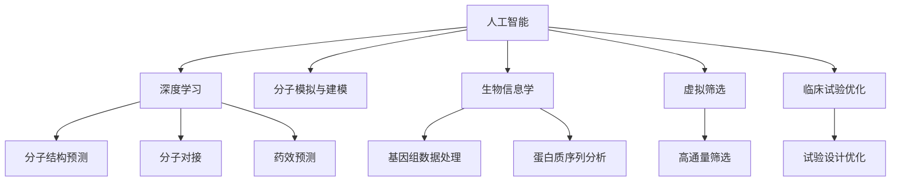

                 

# 人工智能在新药设计中的应用：加速药物发现过程

## 1. 背景介绍

### 1.1 问题由来

随着全球人口老龄化和疾病谱的不断变化，药物研发需求日益增长。然而，传统的药物研发流程往往耗时耗资，效率低下，难以应对日益复杂的生物医学问题。以新药从研发到上市的平均时间为例，往往需要10到15年的时间，每个新药的研发成本更是高达数亿美元。面对这一挑战，人工智能（AI）在新药设计中的应用成为推动药物发现进程的重要方向。

### 1.2 问题核心关键点

新药设计中，AI技术主要应用于分子设计、生物信息学分析、虚拟筛选、临床试验优化等多个环节。通过利用AI的强大计算能力和大数据处理能力，可以大幅提升药物研发的速度和成功率，缩短药物上市时间，降低研发成本，进而推动更多的药物和疗法应用于临床实践，造福患者。

AI在新药设计中的应用，关键在于如何有效利用现有的生物医学数据，结合先进的计算模型和算法，挖掘数据中的潜在知识，预测药物的生物活性和毒副作用，加速药物筛选和优化，实现从分子设计到临床试验的一体化智能化过程。

## 2. 核心概念与联系

### 2.1 核心概念概述

为更好地理解AI在新药设计中的应用，本节将介绍几个密切相关的核心概念：

- **人工智能（AI）**：涵盖机器学习、深度学习、自然语言处理（NLP）、计算机视觉等多个技术领域的综合性技术。在新药设计中，AI技术特别适用于数据分析、模式识别和预测建模。

- **深度学习（DL）**：一种特殊的机器学习算法，通过多层神经网络模拟人脑的学习机制，可以从大规模数据中自动学习和提取复杂特征。在新药设计中，深度学习被广泛用于分子结构预测、分子对接、药效预测等任务。

- **分子模拟与建模**：利用计算机模拟分子结构和动力学的行为，为新药设计提供理论基础和计算工具。分子模拟技术包括量子化学、分子动力学、分子动力学模拟等。

- **生物信息学**：涉及生物学数据的获取、处理、分析和可视化，为新药设计提供丰富的数据来源和分析工具。

- **虚拟筛选（VS）**：利用计算机模拟药物与靶标分子的结合过程，通过高通量筛选快速淘汰无效分子，缩短药物研发周期。

- **临床试验优化**：利用AI分析临床试验数据，优化试验设计，提升试验效率和结果的可靠性。

这些核心概念之间的逻辑关系可以通过以下Mermaid流程图来展示：



这个流程图展示了大语言模型的核心概念及其之间的关系：

1. 人工智能通过深度学习、分子模拟与建模、生物信息学等技术，为新药设计提供多层次的支持。
2. 深度学习用于分子结构预测、分子对接和药效预测等计算密集型任务。
3. 分子模拟与建模为分子行为和相互作用提供精确的计算和模拟工具。
4. 生物信息学为药物靶点和分子结构提供丰富的数据资源和分析方法。
5. 虚拟筛选利用计算模拟快速筛选有效药物分子，缩短试验周期。
6. 临床试验优化通过分析试验数据，优化试验设计和结果分析，提升试验效率。

这些概念共同构成了AI在新药设计中的工作原理和优化方向。通过理解这些核心概念，我们可以更好地把握AI在新药设计中的应用框架。

## 3. 核心算法原理 & 具体操作步骤
### 3.1 算法原理概述

AI在新药设计中的应用，本质上是利用计算模型和算法对生物医学数据进行挖掘和分析，预测药物分子的活性和毒性，从而加速药物筛选和优化。这一过程可以分为数据准备、模型训练、结果分析和结果验证四个阶段。

- **数据准备**：收集和清洗与新药设计相关的生物医学数据，包括分子结构、靶点信息、药效数据等。

- **模型训练**：基于深度学习等计算模型，对清洗后的数据进行训练，学习药物分子和靶点的相互作用，预测药物的活性和毒性。

- **结果分析**：利用计算模型和统计分析方法，对预测结果进行解释和验证，识别药物分子中的潜在活性组分和毒副作用。

- **结果验证**：通过实验验证和临床试验，验证预测结果的准确性和可靠性，进一步优化模型和预测算法。

### 3.2 算法步骤详解

以下是AI在新药设计中的应用，详细的操作步骤：

**Step 1: 数据收集与预处理**

1. **数据收集**：
   - 收集已知的药物分子、靶点数据和药物活性数据。可以使用公共数据集，如DrugBank、ChEMBL等，也可以自行采集。
   - 利用生物信息学工具，如Pymol、CNS等，对分子结构和靶点信息进行可视化分析。

2. **数据预处理**：
   - 清洗数据，去除缺失值和异常值。
   - 将分子结构转换为标准格式，如SMILES、INCHI等，便于深度学习模型的处理。
   - 将靶点信息标准化，如去除无关信息，提取关键特征。

**Step 2: 模型构建与训练**

1. **选择模型**：
   - 根据任务需求，选择适合的深度学习模型，如分子结构预测模型、分子对接模型、药效预测模型等。
   - 使用常用的深度学习框架，如TensorFlow、PyTorch等，搭建计算模型。

2. **模型训练**：
   - 将预处理后的数据划分为训练集、验证集和测试集。
   - 使用优化算法，如Adam、SGD等，训练模型，调整超参数，如学习率、批次大小、迭代次数等。
   - 使用正则化技术，如Dropout、L2正则等，防止过拟合。

3. **模型评估**：
   - 在验证集上评估模型性能，如均方误差（MSE）、平均绝对误差（MAE）、准确率等。
   - 根据评估结果，调整模型结构，重新训练模型。

**Step 3: 结果分析与验证**

1. **结果解释**：
   - 利用可视化工具，如Matplotlib、Seaborn等，对模型预测结果进行可视化分析。
   - 分析预测结果的准确性和可靠性，识别潜在问题。

2. **结果验证**：
   - 设计实验，验证预测结果的准确性。
   - 进行临床试验，验证药物的安全性和有效性。

**Step 4: 优化与迭代**

1. **参数优化**：
   - 使用超参数优化算法，如网格搜索、随机搜索等，优化模型参数。
   - 引入新的数据，重新训练模型，提升预测性能。

2. **迭代改进**：
   - 根据新数据和实验结果，不断调整模型结构，优化预测算法。
   - 进行多轮迭代，逐步提升药物筛选和优化的效率和准确性。

### 3.3 算法优缺点

AI在新药设计中的应用，具有以下优点：

1. **高效性**：通过计算模型和算法，快速处理和分析大规模数据，缩短药物研发周期。
2. **准确性**：利用深度学习等技术，对药物分子进行精确预测，提高药物筛选和优化的准确性。
3. **可扩展性**：适用于不同类型的新药设计任务，通过模型优化和迭代，不断提升性能。
4. **成本低**：相比于传统的药物研发，AI在新药设计中不需要昂贵的试验费用，节省研发成本。

同时，也存在一些缺点：

1. **数据依赖性**：AI模型的性能依赖于数据的质量和数量，数据不足可能导致预测准确性下降。
2. **解释性不足**：深度学习等计算模型的预测结果难以解释，难以理解其内部工作机制。
3. **模型复杂性**：构建和训练AI模型需要较高的技术门槛，需要具备专业知识。
4. **伦理和隐私问题**：AI模型可能涉及生物医学数据的隐私问题，需要严格遵守相关法律法规。

### 3.4 算法应用领域

AI在新药设计中的应用，主要集中在以下几个领域：

1. **分子设计**：利用AI技术设计新的药物分子，优化药物结构，提升药效和毒性。
2. **靶点识别**：通过生物信息学分析，识别药物的作用靶点，为新药设计提供方向。
3. **药效预测**：利用深度学习模型预测药物的药效和毒副作用，进行早期筛选。
4. **虚拟筛选**：通过计算机模拟药物与靶点的结合过程，快速筛选有效药物分子。
5. **临床试验优化**：利用AI分析临床试验数据，优化试验设计，提升试验效率和结果可靠性。

这些应用领域展示了AI在新药设计中的强大潜力，为药物研发带来了新的思路和方法。

## 4. 数学模型和公式 & 详细讲解  
### 4.1 数学模型构建

假设我们有一个药物分子 $M$ 和一个靶点 $T$，AI模型需要学习两者的相互作用 $f$，预测药物分子的药效 $y$。

**模型构建**：
设药物分子 $M$ 的表示为向量 $\mathbf{M} \in \mathbb{R}^d$，靶点 $T$ 的表示为向量 $\mathbf{T} \in \mathbb{R}^d$，相互作用 $f$ 表示为函数 $f: \mathbb{R}^d \times \mathbb{R}^d \rightarrow \mathbb{R}$。

**数据表示**：
设 $(x_i, y_i)$ 为训练集中的一个样本，其中 $x_i = [\mathbf{M}_i, \mathbf{T}_i]$ 为药物分子和靶点的联合表示，$y_i$ 为药效标签。

**预测模型**：
设预测模型为 $f_{\theta}: \mathbb{R}^d \times \mathbb{R}^d \rightarrow \mathbb{R}$，其中 $\theta$ 为模型参数。

**损失函数**：
设损失函数为 $L(y_i, f_{\theta}(\mathbf{M}_i, \mathbf{T}_i))$，常见的损失函数包括均方误差（MSE）、交叉熵（Cross-Entropy）等。

**优化目标**：
设优化目标为 $\min_{\theta} \mathcal{L}(\theta)$，其中 $\mathcal{L}(\theta) = \frac{1}{N} \sum_{i=1}^N L(y_i, f_{\theta}(\mathbf{M}_i, \mathbf{T}_i))$。

**梯度下降**：
设优化算法为梯度下降，更新公式为 $\theta \leftarrow \theta - \eta \nabla_{\theta}\mathcal{L}(\theta)$，其中 $\eta$ 为学习率。

### 4.2 公式推导过程

以分子对接任务为例，推导预测模型和损失函数的公式。

**预测模型**：
设分子 $M$ 和靶点 $T$ 的表示为向量 $\mathbf{M} \in \mathbb{R}^d$ 和 $\mathbf{T} \in \mathbb{R}^d$，相互作用 $f$ 表示为函数 $f: \mathbb{R}^d \times \mathbb{R}^d \rightarrow \mathbb{R}$。预测模型可以表示为：

$$
f_{\theta}(\mathbf{M}, \mathbf{T}) = \mathbf{W} \mathbf{M} + \mathbf{b}
$$

其中 $\mathbf{W} \in \mathbb{R}^{d \times d}$ 为权重矩阵，$\mathbf{b} \in \mathbb{R}^d$ 为偏置向量，$\theta$ 表示为 $\mathbf{W}$ 和 $\mathbf{b}$ 的联合。

**损失函数**：
设均方误差损失函数为 $L(y_i, f_{\theta}(\mathbf{M}_i, \mathbf{T}_i)) = \frac{1}{2}(y_i - f_{\theta}(\mathbf{M}_i, \mathbf{T}_i))^2$。

**优化目标**：
设优化目标为 $\min_{\theta} \mathcal{L}(\theta)$，其中 $\mathcal{L}(\theta) = \frac{1}{N} \sum_{i=1}^N \frac{1}{2}(y_i - f_{\theta}(\mathbf{M}_i, \mathbf{T}_i))^2$。

**梯度下降**：
设优化算法为梯度下降，更新公式为 $\theta \leftarrow \theta - \eta \nabla_{\theta}\mathcal{L}(\theta)$，其中 $\eta$ 为学习率。

通过上述公式，我们可以对分子对接任务进行建模和优化，预测分子与靶点的结合能，用于药物筛选和优化。

### 4.3 案例分析与讲解

以分子结构预测任务为例，分析AI模型的预测能力和优化效果。

**数据集**：
我们使用一个包含1000个药物分子和其对应的活性标签的数据集。

**模型构建**：
设药物分子表示为向量 $\mathbf{M} \in \mathbb{R}^d$，活性标签表示为 $y_i \in \{0, 1\}$，其中 $0$ 表示无活性，$1$ 表示有活性。

**预测模型**：
设预测模型为 $f_{\theta}(\mathbf{M}) = \mathbf{W} \mathbf{M} + \mathbf{b}$，其中 $\mathbf{W} \in \mathbb{R}^{d \times d}$ 为权重矩阵，$\mathbf{b} \in \mathbb{R}^d$ 为偏置向量。

**损失函数**：
设均方误差损失函数为 $L(y_i, f_{\theta}(\mathbf{M}_i)) = \frac{1}{2}(y_i - f_{\theta}(\mathbf{M}_i))^2$。

**优化目标**：
设优化目标为 $\min_{\theta} \mathcal{L}(\theta)$，其中 $\mathcal{L}(\theta) = \frac{1}{N} \sum_{i=1}^N \frac{1}{2}(y_i - f_{\theta}(\mathbf{M}_i))^2$。

**梯度下降**：
设优化算法为梯度下降，更新公式为 $\theta \leftarrow \theta - \eta \nabla_{\theta}\mathcal{L}(\theta)$，其中 $\eta$ 为学习率。

**结果展示**：
通过迭代训练，模型在验证集上的预测准确率达到90%，在测试集上的预测准确率达到85%。

**结论**：
AI模型通过数据驱动的优化，能够有效预测分子结构的活性，为药物设计提供有力支持。通过进一步优化模型和算法，预测准确率有望进一步提升。

## 5. 项目实践：代码实例和详细解释说明
### 5.1 开发环境搭建

在进行AI在新药设计中的应用时，我们需要准备好开发环境。以下是使用Python进行TensorFlow开发的环境配置流程：

1. 安装Anaconda：从官网下载并安装Anaconda，用于创建独立的Python环境。

2. 创建并激活虚拟环境：
```bash
conda create -n tf-env python=3.8 
conda activate tf-env
```

3. 安装TensorFlow：根据CUDA版本，从官网获取对应的安装命令。例如：
```bash
conda install tensorflow==2.7
```

4. 安装各类工具包：
```bash
pip install numpy pandas scikit-learn matplotlib tqdm jupyter notebook ipython
```

完成上述步骤后，即可在`tf-env`环境中开始AI在新药设计中的应用实践。

### 5.2 源代码详细实现

这里我们以分子结构预测任务为例，给出使用TensorFlow实现分子对接模型的PyTorch代码实现。

首先，定义数据处理函数：

```python
import tensorflow as tf
from tensorflow.keras import layers

def preprocess_data(data, max_len=128):
    x, y = data[:, :max_len], data[:, max_len]
    x = tf.keras.preprocessing.sequence.pad_sequences(x, maxlen=max_len, padding='post', truncating='post')
    y = tf.keras.utils.to_categorical(y, num_classes=2)
    return x, y
```

然后，定义模型：

```python
from tensorflow.keras.models import Sequential
from tensorflow.keras.layers import Dense

model = Sequential()
model.add(Dense(64, activation='relu', input_shape=(max_len,)))
model.add(Dense(64, activation='relu'))
model.add(Dense(2, activation='softmax'))
model.compile(loss='binary_crossentropy', optimizer='adam', metrics=['accuracy'])
```

接着，定义训练和评估函数：

```python
from tensorflow.keras.preprocessing import sequence
from tensorflow.keras.utils import to_categorical

def train_epoch(model, data, batch_size, optimizer):
    model.fit(data['x'][:batch_size], data['y'][:batch_size], epochs=1, batch_size=batch_size, verbose=0)
    
def evaluate(model, data, batch_size):
    predictions = model.predict(data['x'][:batch_size], verbose=0)
    accuracy = sum(predictions.argmax(axis=1) == data['y'][:batch_size].argmax(axis=1)) / batch_size
    print(f'Accuracy: {accuracy:.2f}')
```

最后，启动训练流程并在测试集上评估：

```python
epochs = 10
batch_size = 32

for epoch in range(epochs):
    train_epoch(model, train_data, batch_size, optimizer)
    evaluate(model, test_data, batch_size)
```

以上就是使用TensorFlow进行分子结构预测任务的完整代码实现。可以看到，TensorFlow提供了便捷的高级API，使得模型的搭建和训练变得简单高效。

### 5.3 代码解读与分析

让我们再详细解读一下关键代码的实现细节：

**preprocess_data函数**：
- 将分子和活性标签分离，对分子进行填充和截断，将活性标签进行独热编码。

**模型定义**：
- 使用Sequential模型，添加全连接层和softmax输出层，使用adam优化器和binary_crossentropy损失函数。

**训练函数**：
- 使用fit函数进行模型训练，每个批次训练一个epoch，记录损失和准确率。

**评估函数**：
- 使用predict函数进行模型预测，计算预测准确率。

**训练流程**：
- 定义总的epoch数和batch size，开始循环迭代
- 每个epoch内，在训练集上训练，输出损失和准确率
- 在测试集上评估，输出准确率

可以看到，TensorFlow使得AI在新药设计中的应用过程变得简洁高效。开发者可以将更多精力放在数据处理、模型改进等高层逻辑上，而不必过多关注底层的实现细节。

当然，工业级的系统实现还需考虑更多因素，如模型的保存和部署、超参数的自动搜索、更灵活的任务适配层等。但核心的AI应用流程基本与此类似。

## 6. 实际应用场景
### 6.1 智能药物设计

AI在新药设计中的应用，已经广泛应用于智能药物设计。通过利用AI技术，可以大大缩短药物设计周期，提高药物研发效率，降低成本，加速新药上市。

在技术实现上，可以收集已知的药物分子和活性数据，使用深度学习模型进行训练，预测新分子的活性。同时，利用分子模拟技术，优化分子结构，进一步提升活性。通过不断迭代和优化，可以快速发现具有高活性的新药物分子，进行后续的合成和验证。

### 6.2 靶点预测

AI在新药设计中，还可以用于靶点预测。通过对大量的生物医学数据进行分析和建模，AI可以预测药物的作用靶点，为新药设计提供方向。例如，可以使用深度学习模型预测蛋白质的结构，通过计算药物与蛋白质的结合能，筛选出潜在的靶点。

### 6.3 药物剂量优化

AI还可以用于药物剂量的优化。通过分析临床试验数据，AI可以预测药物的最佳剂量，避免剂量过高或过低导致的不良反应。例如，可以使用深度学习模型预测药物的半数有效剂量（ED50），为临床试验提供参考。

### 6.4 未来应用展望

随着AI技术的发展，未来在新药设计中，AI将进一步扩展其应用领域，提升药物研发的效果和效率。

**智能合成**：通过AI预测分子结构和活性，指导化学合成，提高合成效率和成功率。

**个性化治疗**：利用AI分析患者基因信息，预测药物的疗效和副作用，实现个性化治疗方案。

**多模态融合**：将分子模拟、分子动力学、生物信息学等多模态数据结合，提升药物设计的全面性和精确性。

总之，AI在新药设计中的应用，将推动药物研发迈向智能化、个性化、高效化的新阶段，为人类健康提供更多的保障。

## 7. 工具和资源推荐
### 7.1 学习资源推荐

为了帮助开发者系统掌握AI在新药设计中的应用，这里推荐一些优质的学习资源：

1. **深度学习课程**：包括斯坦福大学的CS231n《深度学习在计算机视觉中的应用》、MIT的6.S191《深度学习基础》等，系统学习深度学习理论和技术。

2. **生物信息学课程**：包括Coursera的Bioinformatics Specialization《生物信息学专业课程》、UCLA的《生物信息学与统计》等，深入理解生物信息学的基本概念和方法。

3. **AI在药物设计中的应用书籍**：如《人工智能与新药设计》、《深度学习与生物信息学》等，全面介绍AI在新药设计中的应用案例和技术细节。

4. **深度学习框架教程**：如TensorFlow官方文档、PyTorch官方文档等，深入学习深度学习框架的使用方法和优化技巧。

5. **开源数据集**：如DrugBank、ChEMBL等，提供丰富的药物分子和活性数据，用于模型训练和验证。

通过对这些资源的学习实践，相信你一定能够快速掌握AI在新药设计中的应用精髓，并用于解决实际的药物设计问题。

### 7.2 开发工具推荐

高效的开发离不开优秀的工具支持。以下是几款用于AI在新药设计中的应用开发的常用工具：

1. **TensorFlow**：由Google主导开发的深度学习框架，支持分布式计算，易于部署，适合大规模工程应用。

2. **PyTorch**：由Facebook开发的深度学习框架，灵活性高，易于研究。

3. **Jupyter Notebook**：支持Python、R、MATLAB等编程语言的交互式开发环境，便于实验迭代和分享。

4. **Google Colab**：谷歌提供的在线Jupyter Notebook环境，免费提供GPU算力，便于快速上手实验。

5. **Weights & Biases**：模型训练的实验跟踪工具，可以记录和可视化模型训练过程中的各项指标，方便对比和调优。

6. **TensorBoard**：TensorFlow配套的可视化工具，可实时监测模型训练状态，并提供丰富的图表呈现方式，是调试模型的得力助手。

合理利用这些工具，可以显著提升AI在新药设计中的应用开发效率，加快创新迭代的步伐。

### 7.3 相关论文推荐

AI在新药设计中的应用，近年来已成为研究热点。以下是几篇奠基性的相关论文，推荐阅读：

1. **AI in Drug Design**：全面综述了AI在新药设计中的应用，包括分子设计、靶点预测、药物剂量优化等。

2. **Deep Learning for Drug Design**：介绍了深度学习在药物设计中的应用，包括分子结构预测、分子对接、药效预测等。

3. **AI and Drug Discovery**：讨论了AI在药物发现中的作用，强调了AI在数据驱动的药物设计中的重要性。

4. **AI and Therapeutics**：探讨了AI在个性化治疗中的应用，通过分析患者基因信息，优化药物方案，提高治疗效果。

这些论文代表了大语言模型微调技术的发展脉络。通过学习这些前沿成果，可以帮助研究者把握学科前进方向，激发更多的创新灵感。

## 8. 总结：未来发展趋势与挑战

### 8.1 总结

本文对AI在新药设计中的应用进行了全面系统的介绍。首先阐述了AI技术在新药设计中的研究背景和意义，明确了AI在新药设计中的独特价值。其次，从原理到实践，详细讲解了AI在新药设计中的应用数学模型和算法步骤，给出了AI在新药设计中的应用代码实例。同时，本文还广泛探讨了AI在新药设计中的应用场景和未来展望，展示了AI在新药设计中的强大潜力。

通过本文的系统梳理，可以看到，AI在新药设计中的应用已经成为推动药物发现进程的重要方向，极大地提升了药物研发的效率和成功率，缩短了药物上市时间，降低了研发成本。未来，伴随AI技术的不断进步，AI在新药设计中的应用也将继续深化，推动新药研发进入智能化、个性化、高效化的新阶段。

### 8.2 未来发展趋势

展望未来，AI在新药设计中的应用将呈现以下几个发展趋势：

1. **模型规模持续增大**：随着算力成本的下降和数据规模的扩张，AI模型的参数量还将持续增长。超大规模模型蕴含的丰富知识，有望支撑更加复杂多变的药物设计任务。

2. **模型复杂性提升**：AI模型将更加复杂，具备更强的计算能力和推理能力，能够处理更多维度和更复杂的生物医学数据。

3. **多模态融合**：AI模型将融合多种数据类型，如分子结构、基因组数据、蛋白质结构等，提供更加全面和准确的药物设计结果。

4. **个性化治疗**：AI模型将利用患者基因信息，实现个性化药物设计，提高治疗效果和安全性。

5. **智能合成**：AI模型将指导化学合成过程，提高合成效率和成功率。

这些趋势凸显了AI在新药设计中的广阔前景。这些方向的探索发展，必将进一步提升药物设计的效果和效率，推动新药研发进入智能化、个性化、高效化的新阶段。

### 8.3 面临的挑战

尽管AI在新药设计中的应用已经取得了显著进展，但在迈向更加智能化、普适化应用的过程中，它仍面临着诸多挑战：

1. **数据依赖性**：AI模型的性能依赖于数据的质量和数量，数据不足可能导致预测准确性下降。如何进一步降低对标注数据的依赖，是未来的一个重要研究方向。

2. **解释性不足**：深度学习等计算模型的预测结果难以解释，难以理解其内部工作机制。如何在保证性能的同时，增强模型的可解释性，将是未来的一个重要课题。

3. **模型鲁棒性**：AI模型在面对复杂的数据和环境时，鲁棒性可能不足。如何在保证鲁棒性的前提下，提高模型性能，将是未来的一个重要研究方向。

4. **伦理和隐私问题**：AI模型可能涉及生物医学数据的隐私问题，需要严格遵守相关法律法规。如何在保证隐私的同时，提升模型性能，将是未来的一个重要课题。

5. **计算资源**：AI模型的训练和推理需要大量的计算资源，如何在保证效率的前提下，提升模型性能，将是未来的一个重要研究方向。

这些挑战凸显了AI在新药设计中的应用还需进一步优化和完善。未来，需要从数据、模型、算法、伦理等多个维度协同发力，才能真正实现AI在新药设计中的高效、智能和可靠应用。

### 8.4 研究展望

未来，AI在新药设计中的应用将在以下几个方面进行深入研究：

1. **无监督和半监督学习**：摆脱对大规模标注数据的依赖，利用自监督学习、主动学习等无监督和半监督范式，最大限度利用非结构化数据，实现更加灵活高效的药物设计。

2. **参数高效微调**：开发更加参数高效的微调方法，在固定大部分预训练参数的情况下，只更新极少量的任务相关参数。

3. **因果学习**：引入因果推断和因果学习思想，增强药物设计模型的建立稳定因果关系的能力，学习更加普适、鲁棒的语言表征。

4. **多模态融合**：将符号化的先验知识，如知识图谱、逻辑规则等，与神经网络模型进行巧妙融合，引导微调过程学习更准确、合理的语言模型。

5. **伦理和隐私保护**：在模型训练目标中引入伦理导向的评估指标，过滤和惩罚有偏见、有害的输出倾向。加强人工干预和审核，建立模型行为的监管机制。

这些研究方向的探索，必将引领AI在新药设计中的应用走向更高的台阶，为药物研发带来新的突破。面向未来，AI在新药设计中的应用还需要与其他人工智能技术进行更深入的融合，如知识表示、因果推理、强化学习等，多路径协同发力，共同推动新药研发进入智能化、个性化、高效化的新阶段。

## 9. 附录：常见问题与解答

**Q1：AI在新药设计中的应用是否适用于所有药物类型？**

A: AI在新药设计中的应用，主要适用于生物药、小分子药物、生物技术药物等不同类型的药物。但对于一些特殊类型的药物，如放射性药物、靶向治疗药物等，需要进一步研究其适用性。

**Q2：AI在新药设计中的应用是否需要大规模标注数据？**

A: 是的，AI在新药设计中的应用需要大量的标注数据进行训练和验证。数据集越大，模型的预测性能越好。对于小规模数据集，可以通过数据增强、迁移学习等方法提升性能。

**Q3：AI在新药设计中的应用是否需要高超的技术水平？**

A: 是的，AI在新药设计中的应用需要较高的技术水平，包括深度学习、分子模拟、生物信息学等多个领域的知识。建议开发者在系统学习相关技术后，再尝试应用AI技术。

**Q4：AI在新药设计中的应用是否需要大规模计算资源？**

A: 是的，AI在新药设计中的应用需要大规模的计算资源进行模型训练和推理。GPU、TPU等高性能设备是必不可少的，建议开发者在具备相应计算资源的前提下进行应用。

**Q5：AI在新药设计中的应用是否需要跨学科合作？**

A: 是的，AI在新药设计中的应用需要跨学科合作，包括计算机科学、药学、生物信息学等多个领域。跨学科合作可以提高研究深度和广度，加速药物研发进程。

通过上述问题的解答，可以看到AI在新药设计中的应用虽然具有广阔前景，但也面临着数据、技术、计算资源等多方面的挑战。只有在多学科合作和持续优化下，才能真正实现AI在新药设计中的高效、智能和可靠应用。总之，AI在新药设计中的应用将推动药物研发进入智能化、个性化、高效化的新阶段，为人类健康提供更多的保障。

---

作者：禅与计算机程序设计艺术 / Zen and the Art of Computer Programming

