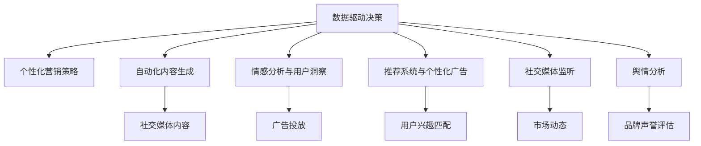

                 

# 人工智能在社交媒体和营销中的应用

## 1. 背景介绍

### 1.1 问题由来
随着互联网和移动互联网的普及，社交媒体已成为人们获取信息、交流思想、表达情感的重要平台。越来越多的企业和品牌开始将社交媒体作为市场营销的重要渠道，以期在激烈的市场竞争中脱颖而出。然而，如何在海量数据中挖掘用户行为和情感信息，提升用户参与度和转化率，成为社交媒体营销的重要挑战。

与此同时，人工智能(AI)技术近年来取得了飞速进展，特别是自然语言处理(NLP)、计算机视觉(CV)、推荐系统等技术，为社交媒体营销带来了新的机遇。人工智能技术可以帮助企业更好地理解和洞察用户需求，实现精准的营销策略，提升广告投放的ROI。

### 1.2 问题核心关键点
本文聚焦于人工智能在社交媒体和营销中的应用，重点探讨以下关键点：

- **数据驱动决策**：通过大数据分析挖掘用户行为模式和需求偏好，指导企业制定个性化营销策略。
- **自动化内容生成**：利用生成式AI技术，自动生成社交媒体内容，提高内容创作效率。
- **情感分析与用户洞察**：应用情感分析技术，深入理解用户情感变化，指导广告投放和品牌建设。
- **推荐系统与个性化广告**：通过推荐系统和个性化算法，精准匹配用户兴趣，提升广告效果。
- **社交媒体监听与舆情分析**：利用社交媒体监听和舆情分析技术，及时把握市场动态，应对舆情变化。

## 2. 核心概念与联系

### 2.1 核心概念概述

为了更好地理解人工智能在社交媒体和营销中的应用，本节将介绍几个密切相关的核心概念：

- **人工智能(AI)**：指利用计算机技术，模拟人类智能，实现语音识别、图像识别、自然语言处理等任务。
- **自然语言处理(NLP)**：指利用计算机技术，使计算机能够理解和处理自然语言，如文本分类、情感分析、机器翻译等。
- **计算机视觉(CV)**：指利用计算机技术，使计算机能够理解和处理图像和视频，如物体识别、人脸识别、视频分析等。
- **推荐系统**：指根据用户历史行为和偏好，推荐个性化内容或产品的系统，如电商推荐、内容推荐、广告推荐等。
- **社交媒体监听(Social Media Listening)**：指通过自动化工具，实时监测社交媒体上的话题、情感、提及等，以了解市场动态和用户需求。
- **舆情分析(Sentiment Analysis)**：指利用自然语言处理技术，分析社交媒体上的用户情感和舆论趋势，评估品牌声誉和市场情绪。

这些核心概念之间的逻辑关系可以通过以下Mermaid流程图来展示：



这个流程图展示了大数据驱动决策与个性化营销策略的核心关系，以及在此基础上展开的各种AI应用场景：

1. **数据驱动决策**：通过大数据分析挖掘用户行为模式和需求偏好，指导企业制定个性化营销策略。
2. **自动化内容生成**：利用生成式AI技术，自动生成社交媒体内容，提高内容创作效率。
3. **情感分析与用户洞察**：应用情感分析技术，深入理解用户情感变化，指导广告投放和品牌建设。
4. **推荐系统与个性化广告**：通过推荐系统和个性化算法，精准匹配用户兴趣，提升广告效果。
5. **社交媒体监听与舆情分析**：利用社交媒体监听和舆情分析技术，及时把握市场动态，应对舆情变化。

这些核心概念共同构成了人工智能在社交媒体和营销领域的实践框架，使其能够精准、高效地应用于实际场景中。

## 3. 核心算法原理 & 具体操作步骤
### 3.1 算法原理概述

人工智能在社交媒体和营销中的应用，主要基于以下核心算法和原理：

- **数据挖掘与机器学习**：通过大数据分析和机器学习模型，挖掘用户行为模式和需求偏好，生成个性化推荐和营销策略。
- **生成式AI**：利用生成对抗网络(GAN)、变分自编码器(VAE)等生成模型，自动生成社交媒体内容。
- **情感分析**：通过文本分类、情感词典等技术，分析用户情感和态度，评估品牌声誉和市场情绪。
- **推荐系统**：基于协同过滤、内容推荐、深度学习等技术，实现精准匹配用户兴趣，提升广告效果。
- **社交媒体监听与舆情分析**：通过情感分析、实体识别、主题建模等技术，实时监测和分析社交媒体数据，把握市场动态和用户需求。

这些算法和原理的应用，使得企业在社交媒体和营销中能够更加精准、高效地理解和引导用户，提升品牌影响力和市场竞争力。

### 3.2 算法步骤详解

以下是基于人工智能在社交媒体和营销中的应用，详细讲解了从数据收集到最终决策的全流程步骤：

1. **数据收集与预处理**：收集社交媒体数据，包括用户的帖子、评论、点赞等行为数据。对数据进行清洗和标准化，去除噪音和错误。

2. **数据建模与分析**：利用大数据技术，对用户行为数据进行建模和分析，挖掘用户兴趣、偏好、行为模式等。使用机器学习模型，预测用户未来行为和需求。

3. **内容生成与优化**：利用生成式AI技术，自动生成社交媒体内容，如文本、图片、视频等。对生成的内容进行优化和筛选，确保其质量和相关性。

4. **情感分析与用户洞察**：应用情感分析技术，分析用户情感和态度。通过情感词典、情感分类等方法，评估品牌声誉和市场情绪。

5. **个性化广告与推荐**：根据用户兴趣和行为数据，利用推荐系统生成个性化广告和内容。使用深度学习模型，提升广告投放的精准度和转化率。

6. **社交媒体监听与舆情分析**：利用社交媒体监听工具，实时监测和分析社交媒体上的话题、情感、提及等。通过情感分析和主题建模，把握市场动态和用户需求。

7. **决策与优化**：将上述分析结果整合，制定个性化的营销策略和广告投放计划。通过A/B测试等方法，不断优化和改进决策。

### 3.3 算法优缺点

人工智能在社交媒体和营销中的应用具有以下优点：

- **精准高效**：通过数据分析和模型预测，能够精准匹配用户需求和兴趣，提升广告投放效果。
- **实时响应**：利用实时监测和情感分析技术，能够及时把握市场动态和用户情感变化，迅速调整营销策略。
- **自动化创新**：利用生成式AI技术，自动生成内容，提升内容创作效率和创意度。

同时，该方法也存在一定的局限性：

- **数据隐私与安全**：收集和使用用户数据时，需要严格遵守数据隐私保护法规，确保数据安全和用户隐私。
- **算法偏见**：机器学习和推荐系统可能存在算法偏见，导致某些用户群体被忽视或歧视。
- **过度依赖数据**：过度依赖用户行为数据，可能忽视用户的主观意愿和情感需求。
- **复杂度与成本**：大规模数据处理和算法优化需要高昂的技术和人力成本。

尽管存在这些局限性，但就目前而言，人工智能在社交媒体和营销中的应用范式仍被广泛采用，并取得了显著的效果。未来相关研究的重点在于如何进一步降低算法偏见，增强算法透明度和可解释性，同时兼顾数据隐私和安全。

### 3.4 算法应用领域

人工智能在社交媒体和营销中的应用，主要涵盖以下几个领域：

- **社交媒体内容管理**：自动生成和优化社交媒体内容，提高用户参与度和品牌影响力。
- **广告投放与优化**：根据用户行为和兴趣，生成个性化广告，提升广告转化率和ROI。
- **客户关系管理**：通过情感分析和用户洞察，提升客户满意度和服务质量。
- **市场研究与预测**：利用大数据分析预测市场趋势和用户需求，制定精准的营销策略。
- **品牌声誉管理**：实时监测和分析社交媒体上的品牌提及和情感变化，及时应对负面舆情。

这些应用领域展示了人工智能在社交媒体和营销中的广泛适用性，为企业的市场营销提供了新的方法和工具。

## 4. 数学模型和公式 & 详细讲解 & 举例说明

### 4.1 数学模型构建

本节将使用数学语言对人工智能在社交媒体和营销中的应用进行更加严格的刻画。

假设用户行为数据为 $D=\{(x_i,y_i)\}_{i=1}^N$，其中 $x_i$ 为用户的社交媒体行为，$y_i$ 为用户的兴趣或情感。

定义模型的预测函数为 $f(x)$，则模型的预测误差为 $e_i=f(x_i)-y_i$。模型的损失函数为：

$$
L(D)=\frac{1}{N}\sum_{i=1}^N e_i^2
$$

为了提升模型预测的准确性，我们希望最小化损失函数 $L(D)$。

### 4.2 公式推导过程

以下是详细推导过程：

1. **最小二乘法**：假设 $f(x)$ 为线性模型，即 $f(x)=\theta_0+\theta_1x_1+\theta_2x_2+\cdots+\theta_nx_n$。则预测误差 $e_i$ 为 $e_i=\theta_0+\theta_1x_{i1}+\theta_2x_{i2}+\cdots+\theta_nx_{in}-y_i$。

2. **梯度下降**：最小化损失函数的梯度下降公式为：

$$
\theta_k \leftarrow \theta_k - \eta \frac{\partial L}{\partial \theta_k}
$$

其中 $\eta$ 为学习率，$\partial L/\partial \theta_k$ 为损失函数对 $\theta_k$ 的偏导数。

3. **反向传播**：将梯度下降公式应用于神经网络模型时，需要计算损失函数对每个参数的偏导数，即反向传播。反向传播公式为：

$$
\frac{\partial L}{\partial \theta_k} = \frac{\partial L}{\partial f(x)} \frac{\partial f(x)}{\partial x} \frac{\partial x}{\partial \theta_k}
$$

其中 $\partial f(x)/\partial x$ 为模型对输入的导数，$\partial x/\partial \theta_k$ 为输入对参数的导数。

4. **深度学习模型**：对于深度学习模型，反向传播公式需要递归展开。例如，对于多层感知器(MLP)，其反向传播公式为：

$$
\frac{\partial L}{\partial w_l} = \frac{\partial L}{\partial z_{l+1}} \frac{\partial z_{l+1}}{\partial w_l}
$$

其中 $w_l$ 为第 $l$ 层的权重矩阵，$z_{l+1}$ 为第 $l$ 层的输出。

### 4.3 案例分析与讲解

以下以情感分析为例，分析其数学模型和算法原理：

1. **情感词典**：通过构建情感词典，将文本中的情感词汇映射到情感评分。例如，“高兴”映射为正分，“悲伤”映射为负分。

2. **情感分类**：利用机器学习模型，对文本进行情感分类。常用的分类器包括朴素贝叶斯、支持向量机(SVM)、随机森林等。

3. **情感评分**：将文本的情感分类结果映射为情感评分。例如，“正面”评分为1，“负面”评分为-1。

4. **模型优化**：利用情感评分构建损失函数，最小化预测误差。常用的损失函数包括均方误差、交叉熵等。

5. **训练与测试**：在训练集上训练模型，在测试集上评估模型性能。常用的评估指标包括准确率、召回率、F1值等。

通过以上步骤，可以实现对社交媒体文本的情感分析，帮助企业理解用户情感和需求，指导广告投放和品牌建设。

## 5. 项目实践：代码实例和详细解释说明
### 5.1 开发环境搭建

在进行项目实践前，我们需要准备好开发环境。以下是使用Python进行PyTorch开发的环境配置流程：

1. 安装Anaconda：从官网下载并安装Anaconda，用于创建独立的Python环境。

2. 创建并激活虚拟环境：
```bash
conda create -n pytorch-env python=3.8 
conda activate pytorch-env
```

3. 安装PyTorch：根据CUDA版本，从官网获取对应的安装命令。例如：
```bash
conda install pytorch torchvision torchaudio cudatoolkit=11.1 -c pytorch -c conda-forge
```

4. 安装Transformers库：
```bash
pip install transformers
```

5. 安装各类工具包：
```bash
pip install numpy pandas scikit-learn matplotlib tqdm jupyter notebook ipython
```

完成上述步骤后，即可在`pytorch-env`环境中开始项目实践。

### 5.2 源代码详细实现

这里我们以情感分析任务为例，给出使用Transformers库对BERT模型进行情感分析的PyTorch代码实现。

首先，定义情感分析任务的数据处理函数：

```python
from transformers import BertTokenizer
from torch.utils.data import Dataset
import torch

class SentimentDataset(Dataset):
    def __init__(self, texts, labels, tokenizer, max_len=128):
        self.texts = texts
        self.labels = labels
        self.tokenizer = tokenizer
        self.max_len = max_len
        
    def __len__(self):
        return len(self.texts)
    
    def __getitem__(self, item):
        text = self.texts[item]
        label = self.labels[item]
        
        encoding = self.tokenizer(text, return_tensors='pt', max_length=self.max_len, padding='max_length', truncation=True)
        input_ids = encoding['input_ids'][0]
        attention_mask = encoding['attention_mask'][0]
        
        # 将标签编码为数字
        encoded_labels = torch.tensor(label, dtype=torch.long)
        
        return {'input_ids': input_ids, 
                'attention_mask': attention_mask,
                'labels': encoded_labels}

# 标签编码
label2id = {'positive': 1, 'negative': 0}
id2label = {v: k for k, v in label2id.items()}

# 创建dataset
tokenizer = BertTokenizer.from_pretrained('bert-base-cased')

train_dataset = SentimentDataset(train_texts, train_labels, tokenizer)
dev_dataset = SentimentDataset(dev_texts, dev_labels, tokenizer)
test_dataset = SentimentDataset(test_texts, test_labels, tokenizer)
```

然后，定义模型和优化器：

```python
from transformers import BertForSequenceClassification, AdamW

model = BertForSequenceClassification.from_pretrained('bert-base-cased', num_labels=2)

optimizer = AdamW(model.parameters(), lr=2e-5)
```

接着，定义训练和评估函数：

```python
from torch.utils.data import DataLoader
from tqdm import tqdm
from sklearn.metrics import classification_report

device = torch.device('cuda') if torch.cuda.is_available() else torch.device('cpu')
model.to(device)

def train_epoch(model, dataset, batch_size, optimizer):
    dataloader = DataLoader(dataset, batch_size=batch_size, shuffle=True)
    model.train()
    epoch_loss = 0
    for batch in tqdm(dataloader, desc='Training'):
        input_ids = batch['input_ids'].to(device)
        attention_mask = batch['attention_mask'].to(device)
        labels = batch['labels'].to(device)
        model.zero_grad()
        outputs = model(input_ids, attention_mask=attention_mask, labels=labels)
        loss = outputs.loss
        epoch_loss += loss.item()
        loss.backward()
        optimizer.step()
    return epoch_loss / len(dataloader)

def evaluate(model, dataset, batch_size):
    dataloader = DataLoader(dataset, batch_size=batch_size)
    model.eval()
    preds, labels = [], []
    with torch.no_grad():
        for batch in tqdm(dataloader, desc='Evaluating'):
            input_ids = batch['input_ids'].to(device)
            attention_mask = batch['attention_mask'].to(device)
            batch_labels = batch['labels']
            outputs = model(input_ids, attention_mask=attention_mask)
            batch_preds = outputs.logits.argmax(dim=2).to('cpu').tolist()
            batch_labels = batch_labels.to('cpu').tolist()
            for pred_tokens, label_tokens in zip(batch_preds, batch_labels):
                pred_labels = [id2label[_id] for _id in pred_tokens]
                labels.append(label_tokens)
                preds.append(pred_labels)
                
    print(classification_report(labels, preds))
```

最后，启动训练流程并在测试集上评估：

```python
epochs = 5
batch_size = 16

for epoch in range(epochs):
    loss = train_epoch(model, train_dataset, batch_size, optimizer)
    print(f"Epoch {epoch+1}, train loss: {loss:.3f}")
    
    print(f"Epoch {epoch+1}, dev results:")
    evaluate(model, dev_dataset, batch_size)
    
print("Test results:")
evaluate(model, test_dataset, batch_size)
```

以上就是使用PyTorch对BERT进行情感分析任务的完整代码实现。可以看到，得益于Transformers库的强大封装，我们能够用相对简洁的代码完成BERT模型的加载和微调。

### 5.3 代码解读与分析

让我们再详细解读一下关键代码的实现细节：

**SentimentDataset类**：
- `__init__`方法：初始化文本、标签、分词器等关键组件。
- `__len__`方法：返回数据集的样本数量。
- `__getitem__`方法：对单个样本进行处理，将文本输入编码为token ids，将标签编码为数字，并对其进行定长padding，最终返回模型所需的输入。

**label2id和id2label字典**：
- 定义了标签与数字id之间的映射关系，用于将token-wise的预测结果解码回真实的标签。

**训练和评估函数**：
- 使用PyTorch的DataLoader对数据集进行批次化加载，供模型训练和推理使用。
- 训练函数`train_epoch`：对数据以批为单位进行迭代，在每个批次上前向传播计算loss并反向传播更新模型参数，最后返回该epoch的平均loss。
- 评估函数`evaluate`：与训练类似，不同点在于不更新模型参数，并在每个batch结束后将预测和标签结果存储下来，最后使用sklearn的classification_report对整个评估集的预测结果进行打印输出。

**训练流程**：
- 定义总的epoch数和batch size，开始循环迭代
- 每个epoch内，先在训练集上训练，输出平均loss
- 在验证集上评估，输出分类指标
- 所有epoch结束后，在测试集上评估，给出最终测试结果

可以看到，PyTorch配合Transformers库使得BERT情感分析的代码实现变得简洁高效。开发者可以将更多精力放在数据处理、模型改进等高层逻辑上，而不必过多关注底层的实现细节。

当然，工业级的系统实现还需考虑更多因素，如模型的保存和部署、超参数的自动搜索、更灵活的任务适配层等。但核心的微调范式基本与此类似。

## 6. 实际应用场景
### 6.1 智能客服系统

基于人工智能的情感分析技术，可以应用于智能客服系统的构建。传统客服往往需要配备大量人力，高峰期响应缓慢，且一致性和专业性难以保证。而使用情感分析技术，可以自动识别用户情感，引导智能客服机器人进行情感回应，提升客户满意度。

在技术实现上，可以收集用户与客服的对话记录，提取对话中的情感信息，训练情感分析模型。微调后的情感分析模型能够自动判断用户情感状态，引导机器人根据不同情感状态采取相应的回答策略。例如，对于愤怒的用户，智能客服可以提供更加细致的解决方案，避免引发更大矛盾。

### 6.2 金融舆情监测

金融机构需要实时监测市场舆论动向，以便及时应对负面信息传播，规避金融风险。传统的人工监测方式成本高、效率低，难以应对网络时代海量信息爆发的挑战。基于情感分析技术的舆情监测系统，可以实时监测金融市场舆情，评估市场情绪，预测市场趋势。

具体而言，可以收集金融领域相关的新闻、评论、社交媒体信息，利用情感分析技术对文本情感进行识别和分类。将情感分析结果与实时舆情数据进行整合，生成市场情绪指标，及时发现异常情绪波动，预测市场风险。例如，当大量负面舆情涌现时，系统可以及时预警，帮助金融机构快速采取应对措施。

### 6.3 电子商务推荐系统

当前的推荐系统往往只依赖用户的历史行为数据进行物品推荐，无法深入理解用户的真实兴趣偏好。基于情感分析技术的推荐系统，可以更加全面地理解用户需求，提升推荐效果。

在实践中，可以收集用户浏览、点击、评论、分享等行为数据，提取和用户交互的物品描述、评价、标签等文本内容。利用情感分析技术对物品评价进行情感分析，识别出用户对物品的情感倾向。将情感倾向与用户行为数据进行整合，训练推荐模型，生成个性化的推荐结果。例如，对于用户对某个产品的正面评价，系统可以优先推荐相关产品，提升用户购买意愿。

### 6.4 未来应用展望

随着人工智能技术的发展，基于情感分析的社交媒体和营销应用将进一步拓展。

在智慧医疗领域，情感分析可以应用于患者情绪监测、医疗咨询服务等方面，提升医疗服务的智能化水平。

在智能教育领域，情感分析可以应用于学习情感监测、智能辅导系统等方面，因材施教，促进教育公平。

在智慧城市治理中，情感分析可以应用于城市事件监测、舆情分析等方面，提高城市管理的智能化水平，构建更安全、高效的未来城市。

此外，在企业生产、社会治理、文娱传媒等众多领域，基于情感分析的AI应用也将不断涌现，为经济社会发展注入新的动力。相信随着技术的日益成熟，情感分析技术将成为社交媒体和营销领域的重要工具，提升企业在市场竞争中的优势。

## 7. 工具和资源推荐
### 7.1 学习资源推荐

为了帮助开发者系统掌握人工智能在社交媒体和营销中的应用理论基础和实践技巧，这里推荐一些优质的学习资源：

1. **《深度学习理论与实践》**：深度学习领域的经典教材，系统讲解了深度学习的基础理论和常用算法。

2. **《自然语言处理综论》**：自然语言处理领域的经典教材，涵盖自然语言处理的基本概念和前沿技术。

3. **《机器学习实战》**：实用的机器学习教程，详细讲解了机器学习的基本算法和应用场景。

4. **《Python深度学习》**：Python深度学习编程指南，介绍了TensorFlow和PyTorch等深度学习框架的使用方法。

5. **《自然语言处理框架Transformers》**：介绍Transformer模型及其在自然语言处理中的应用。

6. **Kaggle平台**：开源数据集和比赛平台，提供了大量情感分析、推荐系统等NLP任务的数据集和样例代码。

通过对这些资源的学习实践，相信你一定能够快速掌握人工智能在社交媒体和营销中的应用精髓，并用于解决实际的NLP问题。
### 7.2 开发工具推荐

高效的开发离不开优秀的工具支持。以下是几款用于人工智能在社交媒体和营销中的应用开发的常用工具：

1. **Python编程语言**：Python语言简单易学，拥有丰富的第三方库和框架，是人工智能应用开发的首选语言。

2. **TensorFlow和PyTorch**：深度学习领域的两个主要框架，支持分布式训练、模型压缩、模型优化等高级功能。

3. **Transformers库**：HuggingFace开发的NLP工具库，集成了众多SOTA语言模型，支持预训练模型和微调，是自然语言处理任务开发的利器。

4. **Jupyter Notebook**：交互式编程环境，支持代码编写、数据可视化、实时调试等功能，是数据科学和机器学习开发的标准工具。

5. **Scikit-learn和XGBoost**：常用的机器学习库，提供了丰富的算法实现和评估工具，适用于各种机器学习任务。

6. **Keras**：高层次的神经网络API，易于上手，支持多种深度学习框架，是初学者和进阶者的优秀选择。

合理利用这些工具，可以显著提升人工智能在社交媒体和营销中的应用开发效率，加快创新迭代的步伐。

### 7.3 相关论文推荐

人工智能在社交媒体和营销中的应用源于学界的持续研究。以下是几篇奠基性的相关论文，推荐阅读：

1. **《Attention is All You Need》**：Transformer模型的原论文，提出了自注意力机制，为深度学习模型带来了新的突破。

2. **《BERT: Pre-training of Deep Bidirectional Transformers for Language Understanding》**：提出了BERT模型，引入掩码语言模型等自监督预训练任务，提升了自然语言处理的精度。

3. **《Recurrent Neural Network based Recommendation System》**：介绍了基于RNN的推荐系统，利用用户历史行为数据进行个性化推荐。

4. **《Sequence to Sequence Learning with Neural Networks》**：介绍了序列到序列模型，用于机器翻译、对话生成等NLP任务。

5. **《Sentiment Analysis with Deep Learning》**：详细介绍了基于深度学习的情感分析技术，涵盖模型选择、数据预处理、评估指标等内容。

6. **《Social Media Sentiment Analysis: A Review》**：综述了社交媒体情感分析的研究现状和技术进展，提供了全面的参考。

这些论文代表了大数据驱动决策与个性化营销策略的研究方向。通过学习这些前沿成果，可以帮助研究者把握学科前进方向，激发更多的创新灵感。

## 8. 总结：未来发展趋势与挑战
### 8.1 研究成果总结

本文对人工智能在社交媒体和营销中的应用进行了全面系统的介绍。首先阐述了人工智能技术在社交媒体和营销中的重要性，明确了情感分析、推荐系统等技术的研究意义。其次，从原理到实践，详细讲解了情感分析、推荐系统的数学模型和算法步骤，给出了情感分析任务的完整代码实现。同时，本文还广泛探讨了情感分析技术在智能客服、金融舆情监测、电子商务推荐等多个行业领域的应用前景，展示了其巨大的应用潜力。此外，本文精选了情感分析技术的各类学习资源，力求为读者提供全方位的技术指引。

通过本文的系统梳理，可以看到，基于人工智能的情感分析技术正在成为社交媒体和营销领域的重要工具，为企业的市场营销提供了新的方法和工具。通过情感分析技术，企业可以更加精准、高效地理解和引导用户，提升品牌影响力和市场竞争力。

### 8.2 未来发展趋势

展望未来，人工智能在社交媒体和营销中的应用将呈现以下几个发展趋势：

1. **数据驱动决策的普及**：随着大数据和深度学习技术的发展，数据驱动决策将成为企业的标准工具，提升决策的科学性和精准性。

2. **生成式AI的创新应用**：生成式AI技术将不断涌现，自动生成广告内容、社交媒体帖子等，提升内容创作效率和创意度。

3. **情感分析技术的进步**：情感分析技术将更加准确和全面，能够深入理解用户的情感和需求，提升用户参与度和满意度。

4. **推荐系统与个性化广告的融合**：推荐系统与个性化广告将深度融合，结合情感分析技术，生成更加精准和多样化的广告推荐。

5. **社交媒体监听与舆情分析的智能化**：社交媒体监听与舆情分析将利用自然语言处理和机器学习技术，实现实时监测和情感分析，提升舆情应对能力。

6. **跨领域应用的拓展**：情感分析技术将广泛应用于医疗、教育、城市治理等领域，提供智能化的解决方案。

以上趋势凸显了人工智能在社交媒体和营销中的广阔前景。这些方向的探索发展，必将进一步提升企业的市场营销水平，提升用户体验和品牌价值。

### 8.3 面临的挑战

尽管人工智能在社交媒体和营销中的应用已经取得了显著效果，但在迈向更加智能化、普适化应用的过程中，仍面临诸多挑战：

1. **数据隐私与安全**：收集和使用用户数据时，需要严格遵守数据隐私保护法规，确保数据安全和用户隐私。

2. **算法偏见与公平性**：机器学习和推荐系统可能存在算法偏见，导致某些用户群体被忽视或歧视，需加强算法公平性研究。

3. **过度依赖数据**：过度依赖用户行为数据，可能忽视用户的主观意愿和情感需求，需探索更多主观数据的采集和分析方法。

4. **复杂度与成本**：大规模数据处理和算法优化需要高昂的技术和人力成本，需降低系统复杂度，提高资源利用效率。

5. **模型可解释性**：当前模型多为黑盒模型，缺乏可解释性，需加强模型透明性和可解释性研究，提高用户信任度。

6. **安全性和鲁棒性**：需确保系统的安全性和鲁棒性，避免攻击和恶意利用，保护用户利益。

尽管存在这些挑战，但就目前而言，人工智能在社交媒体和营销中的应用范式仍被广泛采用，并取得了显著的效果。未来相关研究的重点在于如何进一步降低算法偏见，增强算法透明度和可解释性，同时兼顾数据隐私和安全。

### 8.4 研究展望

面向未来，人工智能在社交媒体和营销中的应用需要从以下几个方面进行深入研究：

1. **多模态情感分析**：结合视觉、语音等模态数据，提升情感分析的全面性和准确性。

2. **跨领域知识整合**：将知识图谱、逻辑规则等专家知识与情感分析结合，提升模型的知识整合能力。

3. **生成式模型优化**：研究生成式模型的优化方法，提高生成内容的自然度和相关性。

4. **个性化推荐系统**：结合情感分析与推荐系统，实现更加精准和多样化的推荐。

5. **实时监测与情感反馈**：研究实时监测和情感反馈机制，提升情感分析的实时性和互动性。

6. **用户隐私保护**：探索隐私保护技术，确保用户数据的安全性和隐私性。

这些研究方向的探索，必将推动人工智能在社交媒体和营销中的应用向更深的层次发展，为企业的市场营销带来更多创新和突破。

## 9. 附录：常见问题与解答

**Q1：人工智能在社交媒体和营销中的应用是否适用于所有企业？**

A: 人工智能在社交媒体和营销中的应用，主要适用于具备一定技术实力和数据积累的企业。对于技术实力较弱或数据资源不足的企业，需要根据实际情况逐步引入。

**Q2：如何评估人工智能在社交媒体和营销中的应用效果？**

A: 可以通过ROI、用户参与度、转化率等指标来评估人工智能在社交媒体和营销中的应用效果。使用A/B测试等方法，不断优化和改进模型和策略。

**Q3：人工智能在社交媒体和营销中的应用是否需要高昂的技术和人力成本？**

A: 是的，人工智能在社交媒体和营销中的应用需要较高的技术水平和人力投入。建议企业在引入之前，先进行技术评估和成本预算。

**Q4：人工智能在社交媒体和营销中的应用是否存在算法偏见？**

A: 是的，人工智能在社交媒体和营销中的应用可能存在算法偏见。建议企业在设计和训练模型时，引入多样化的数据和公平性约束。

**Q5：人工智能在社交媒体和营销中的应用是否需要考虑用户隐私？**

A: 是的，人工智能在社交媒体和营销中的应用需要严格遵守数据隐私保护法规，确保用户数据的合法使用和安全保护。

---

作者：禅与计算机程序设计艺术 / Zen and the Art of Computer Programming

