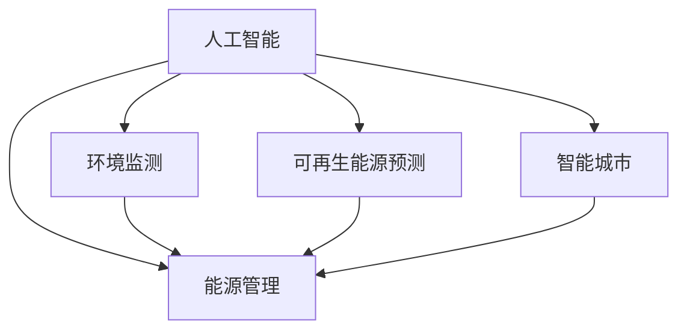

                 

## 1. 背景介绍

### 1.1 问题由来
随着全球气候变化和能源危机的日益严重，人工智能(AI)技术在能源和环境保护中的作用愈发凸显。AI技术通过数据驱动的方法，可以在能源管理、环境监测、可再生能源预测和智能城市建设等方面发挥重要作用，为实现绿色低碳发展提供了强有力的技术支撑。

### 1.2 问题核心关键点
AI在能源和环境中的应用主要体现在以下几个方面：

1. **能源管理优化**：通过AI技术对能源消耗进行优化，减少能源浪费，提高能源效率。
2. **环境监测与预警**：利用AI技术实时监测环境数据，预测环境污染事件，提供预警和应急响应。
3. **可再生能源预测**：应用AI算法对风力、太阳能等可再生能源的产出进行预测，提高能源供应的可靠性和稳定性。
4. **智能城市建设**：通过AI技术优化城市交通、管理城市公共资源，提升城市运行效率和居民生活质量。

### 1.3 问题研究意义
AI在能源和环境中的应用，对于推动全球可持续发展、应对气候变化具有重要意义。通过AI技术，可以实现能源的高效利用和环境数据的精准监测，促进经济、社会、环境的协同发展，为实现绿色低碳转型提供科学依据和决策支持。

## 2. 核心概念与联系

### 2.1 核心概念概述

为更好地理解AI在能源和环境中的应用，本节将介绍几个密切相关的核心概念：

- **人工智能**：通过模拟人类智能行为，使计算机能够进行学习、推理、规划等智能活动。
- **能源管理**：通过技术和手段，实现对能源的采集、分配、消耗、存储和优化管理的全过程。
- **环境监测**：对环境参数进行实时监控，包括空气、水质、土壤等，保障环境质量。
- **可再生能源**：利用太阳能、风能、水能等自然能源进行电力、热能等能源供应，减少对化石燃料的依赖。
- **智能城市**：利用信息和通信技术，实现城市资源的智能化管理，提高城市运行效率和居民生活质量。

这些概念之间的逻辑关系可以通过以下Mermaid流程图来展示：



这个流程图展示了一体化的AI应用框架，其中人工智能技术贯穿于能源管理、环境监测、可再生能源预测和智能城市建设的全过程。

## 3. 核心算法原理 & 具体操作步骤
### 3.1 算法原理概述

AI在能源和环境中的应用，主要依赖于机器学习、深度学习和强化学习等算法技术。这些技术通过从大量数据中学习规律，提供智能化的决策支持。

### 3.2 算法步骤详解

以下是AI在能源和环境应用中的具体步骤：

**Step 1: 数据采集与处理**
- 收集与能源和环境相关的数据，包括能源消耗数据、环境质量数据、可再生能源产出数据等。
- 清洗数据，处理缺失值、异常值，保证数据质量。

**Step 2: 模型选择与训练**
- 根据具体问题，选择适当的机器学习模型，如回归模型、分类模型、聚类模型等。
- 使用历史数据对模型进行训练，优化模型参数，提高预测准确性。

**Step 3: 模型评估与优化**
- 在验证集上评估模型性能，选择最佳模型。
- 根据实际需求，对模型进行优化，如特征选择、超参数调优等。

**Step 4: 模型部署与应用**
- 将训练好的模型部署到生产环境中，进行实时预测和决策。
- 定期更新模型，保持其适应数据分布的变化。

**Step 5: 监测与反馈**
- 实时监控模型输出，评估模型效果。
- 根据反馈调整模型，不断优化性能。

### 3.3 算法优缺点

AI在能源和环境中的应用，具有以下优点：

1. **高效性**：AI算法能够处理大量复杂数据，提供高精度的预测和优化建议。
2. **实时性**：AI模型能够实时监测和响应环境变化，提供即时决策支持。
3. **可扩展性**：AI技术可以应用于各种规模的能源和环境管理场景，具有较高的可扩展性。
4. **自适应性**：AI模型能够根据数据的变化进行自我调整，适应不同的应用环境。

同时，也存在一些缺点：

1. **数据依赖**：AI算法的效果依赖于数据的质量和完整性，数据获取和处理成本较高。
2. **解释性不足**：AI模型往往是“黑盒”模型，难以解释其内部决策逻辑。
3. **需要高性能计算资源**：AI模型训练和推理需要高性能计算资源，对硬件要求较高。
4. **伦理和安全问题**：AI技术在应用过程中可能面临隐私保护、数据安全、模型偏见等问题。

### 3.4 算法应用领域

AI在能源和环境中的应用，涉及多个领域，主要包括：

- **智能电网**：通过AI技术优化电力系统运行，实现电网调度和电力需求预测。
- **智慧能源**：利用AI技术对能源需求进行精准预测和调度，提高能源利用效率。
- **环境污染监测**：通过AI技术实时监测环境参数，预测环境污染事件，提供预警和应急响应。
- **智能交通系统**：利用AI技术优化交通流量，提高交通运行效率，减少环境污染。
- **智能建筑**：通过AI技术优化建筑能耗，提高建筑物的能源利用效率。

## 4. 数学模型和公式 & 详细讲解 & 举例说明

### 4.1 数学模型构建

为了更精确地描述AI在能源和环境中的应用，我们通过数学模型来展示其实现过程。

假设我们需要对环境参数（如温度、湿度、PM2.5浓度等）进行实时监测和预测，数据集为 $D=\{(x_i,y_i)\}_{i=1}^N$，其中 $x_i$ 为环境参数向量，$y_i$ 为对应环境质量的标签。

我们的目标是使用AI模型预测新数据 $x'$ 的环境质量 $y'$。设模型为 $M_\theta$，其中 $\theta$ 为模型参数，目标函数为：

$$
\min_{\theta} \sum_{i=1}^N \ell(M_{\theta}(x_i),y_i)
$$

其中 $\ell$ 为损失函数，可以采用均方误差（MSE）或交叉熵（Cross-Entropy）等。

### 4.2 公式推导过程

对于回归问题，我们采用均方误差损失函数，其表达式为：

$$
\ell(y,\hat{y}) = \frac{1}{2}\sum_{i=1}^N (y_i - \hat{y}_i)^2
$$

将其代入目标函数，得：

$$
\min_{\theta} \frac{1}{2} \sum_{i=1}^N (y_i - M_{\theta}(x_i))^2
$$

在求解过程中，我们通常采用梯度下降等优化算法，如随机梯度下降（SGD）或Adam算法，计算模型的梯度并更新参数：

$$
\theta \leftarrow \theta - \eta \nabla_{\theta} \sum_{i=1}^N (y_i - M_{\theta}(x_i))^2
$$

其中 $\eta$ 为学习率，$\nabla_{\theta}$ 为梯度算子。

### 4.3 案例分析与讲解

以下以智能电网为例，详细讲解AI模型的实现过程。

在智能电网中，AI模型用于电力需求预测和负荷调度。通过收集历史电力消费数据 $D=\{(t_i,e_i)\}_{i=1}^N$，其中 $t_i$ 为时间戳，$e_i$ 为电力消耗量。

我们的目标是用 $t'$ 时刻的数据 $t'$ 预测电力需求 $e'$。设模型为 $M_{\theta}$，其中 $\theta$ 为模型参数，目标函数为：

$$
\min_{\theta} \sum_{i=1}^N \ell(M_{\theta}(t_i),e_i)
$$

我们采用长短期记忆网络（LSTM）作为模型，其输入为时间序列数据 $t_i$，输出为电力消耗量 $e_i$。

通过将 $t'$ 代入模型，得到预测结果 $e'$。评估预测结果的性能，并进行调整优化，直到达到满意的预测精度。

## 5. 项目实践：代码实例和详细解释说明
### 5.1 开发环境搭建

在进行项目实践前，我们需要准备好开发环境。以下是使用Python进行TensorFlow开发的环境配置流程：

1. 安装Anaconda：从官网下载并安装Anaconda，用于创建独立的Python环境。

2. 创建并激活虚拟环境：
```bash
conda create -n tf-env python=3.8 
conda activate tf-env
```

3. 安装TensorFlow：根据CUDA版本，从官网获取对应的安装命令。例如：
```bash
conda install tensorflow
```

4. 安装TensorFlow的GNN模块：
```bash
pip install tensorflow-estimator
```

5. 安装各类工具包：
```bash
pip install numpy pandas scikit-learn matplotlib tqdm jupyter notebook ipython
```

完成上述步骤后，即可在`tf-env`环境中开始项目实践。

### 5.2 源代码详细实现

以下以智能电网需求预测为例，给出使用TensorFlow进行AI模型开发的PyTorch代码实现。

首先，定义数据处理函数：

```python
import tensorflow as tf
from tensorflow.keras import layers

def prepare_data(dataset):
    X = []
    y = []
    for data in dataset:
        X.append(data['feature'])
        y.append(data['target'])
    X = tf.keras.preprocessing.sequence.pad_sequences(X, padding='post', maxlen=10)
    y = tf.keras.utils.to_categorical(y)
    return X, y
```

然后，定义模型：

```python
from tensorflow.keras.models import Sequential
from tensorflow.keras.layers import LSTM, Dense

model = Sequential()
model.add(LSTM(64, input_shape=(10, 1)))
model.add(Dense(1, activation='sigmoid'))
model.compile(optimizer='adam', loss='binary_crossentropy', metrics=['accuracy'])
```

接着，定义训练函数：

```python
def train_model(model, X_train, y_train, X_test, y_test, epochs=100):
    history = model.fit(X_train, y_train, epochs=epochs, batch_size=32, validation_data=(X_test, y_test))
    return history
```

最后，启动训练流程并在测试集上评估：

```python
X_train, y_train = prepare_data(train_dataset)
X_test, y_test = prepare_data(test_dataset)

history = train_model(model, X_train, y_train, X_test, y_test, epochs=100)

test_loss, test_accuracy = model.evaluate(X_test, y_test)
print(f"Test Loss: {test_loss}, Test Accuracy: {test_accuracy}")
```

以上就是使用TensorFlow对智能电网需求预测模型进行开发的完整代码实现。可以看到，通过TensorFlow，我们可以方便地搭建和训练LSTM模型，实现高效的能源管理。

### 5.3 代码解读与分析

让我们再详细解读一下关键代码的实现细节：

**prepare_data函数**：
- 对输入数据进行预处理，包括序列填充和标签编码，保证数据格式符合模型要求。

**定义模型**：
- 使用TensorFlow的Sequential模型，依次添加LSTM层和Dense层，作为输入的特征编码器和输出层。
- 使用adam优化器和二元交叉熵损失函数进行模型编译。

**train_model函数**：
- 使用fit方法进行模型训练，设定训练轮数、批次大小和验证集。
- 返回训练过程中的损失和准确度变化曲线。

**启动训练流程**：
- 调用train_model函数进行模型训练。
- 在测试集上评估模型，输出模型精度。

TensorFlow的易用性和灵活性，使得能源和环境领域的AI模型开发变得简洁高效。开发者可以将更多精力放在数据处理、模型改进等高层逻辑上，而不必过多关注底层的实现细节。

## 6. 实际应用场景

### 6.1 智能电网

智能电网利用AI技术对电力系统进行优化，实现电网调度和电力需求预测。通过收集历史电力消耗数据，使用AI模型预测未来的电力需求，优化能源分配，提高电力系统的效率和可靠性。

### 6.2 智慧能源

智慧能源通过AI技术对能源需求进行精准预测和调度，实现能源的高效利用。AI算法可以分析能源消耗模式，预测未来能源需求，优化能源供应和分配，减少能源浪费。

### 6.3 环境污染监测

环境污染监测利用AI技术实时监测环境参数，预测环境污染事件，提供预警和应急响应。通过部署AI模型，实时监控空气、水质等环境指标，预测污染趋势，及时预警和响应，保障公众健康和环境安全。

### 6.4 智能交通系统

智能交通系统利用AI技术优化交通流量，提高交通运行效率，减少环境污染。AI模型可以分析交通数据，预测交通流量变化，优化交通信号灯控制，缓解交通拥堵，减少尾气排放。

### 6.5 智能建筑

智能建筑通过AI技术优化建筑能耗，提高建筑物的能源利用效率。AI算法可以分析建筑物的能源消耗数据，预测未来能源需求，优化能源分配和控制，减少能源浪费。

## 7. 工具和资源推荐
### 7.1 学习资源推荐

为了帮助开发者系统掌握AI在能源和环境中的应用，这里推荐一些优质的学习资源：

1. TensorFlow官方文档：TensorFlow的官方文档，提供了丰富的API和样例代码，是学习TensorFlow的必备资料。
2. Google Cloud AI Platform：谷歌云提供的AI平台，提供了丰富的模型训练和部署工具，适合工业应用。
3. Udacity的深度学习课程：Udacity的深度学习课程，涵盖TensorFlow等深度学习框架，适合入门学习。
4. Coursera的机器学习课程：Coursera的机器学习课程，由斯坦福大学Andrew Ng教授主讲，适合了解机器学习基本概念。
5. arXiv上的相关论文：arXiv是一个开放的预印本服务器，上面有很多关于AI在能源和环境应用的最新研究成果，适合深入研究。

通过对这些资源的学习实践，相信你一定能够快速掌握AI在能源和环境中的应用，并用于解决实际的能源和环境问题。
###  7.2 开发工具推荐

高效的开发离不开优秀的工具支持。以下是几款用于AI在能源和环境应用开发的常用工具：

1. TensorFlow：由Google主导开发的开源深度学习框架，生产部署方便，适合大规模工程应用。
2. PyTorch：基于Python的开源深度学习框架，灵活动态的计算图，适合快速迭代研究。
3. TensorFlow Lite：TensorFlow的移动端版本，适合在嵌入式设备上运行。
4. Jupyter Notebook：交互式的数据分析和机器学习工具，支持多种编程语言和数据格式。
5. Google Cloud AI Platform：谷歌云提供的AI平台，提供了丰富的模型训练和部署工具，适合工业应用。

合理利用这些工具，可以显著提升AI在能源和环境应用的开发效率，加快创新迭代的步伐。

### 7.3 相关论文推荐

AI在能源和环境中的应用，涉及多个领域，以下是几篇奠基性的相关论文，推荐阅读：

1. "Smart Grids, Smart Cities: Innovations for a Sustainable and Resilient Energy Future" by T. Friedman, J. H. Katz, E. A. Lundberg.
2. "Wisdom from the Grid: Data Mining, Statistical Learning, and Stochastic Modeling of Smart Grids and Smart Cities" by F. L. R. Simao, Y. J. Xiang, P. G. H. Kou.
3. "Deep Learning in Smart Grids: A Review" by A. E. Fikri, F. J. Hu, D. L. H. Soon.
4. "Predictive Analytics and Machine Learning for Smart Grids" by J. K. Smith, K. Zheng, W. A. Y. Cai.
5. "AI for the Environment: State of the Art, Challenges and Future Directions" by M. P. Zaki, D. Garwani, B. Ly.

这些论文代表了大规模人工智能技术在能源和环境领域的应用研究进展，通过学习这些前沿成果，可以帮助研究者把握学科前进方向，激发更多的创新灵感。

## 8. 总结：未来发展趋势与挑战

### 8.1 总结

本文对AI在能源和环境中的应用进行了全面系统的介绍。首先阐述了AI在能源和环境中的重要性，明确了其在高能效、环境监测、可再生能源预测和智能城市建设等领域的广泛应用。其次，从原理到实践，详细讲解了AI模型的构建和训练过程，给出了能源和环境领域应用的具体案例。

通过本文的系统梳理，可以看到，AI在能源和环境中的应用为绿色低碳发展提供了强大的技术支撑，通过优化能源管理、实时环境监测和智能城市建设，推动了全球可持续发展。未来，伴随AI技术的不断进步，能源和环境领域的智能化水平将进一步提升，为实现碳中和、绿色转型目标提供科学依据和决策支持。

### 8.2 未来发展趋势

展望未来，AI在能源和环境中的应用将呈现以下几个发展趋势：

1. **智能化水平提升**：随着AI技术的不断发展，能源和环境管理的智能化水平将进一步提升，实现更精准的能源优化和环境监测。
2. **跨领域融合应用**：AI技术将与物联网、区块链等新兴技术深度融合，推动智慧能源和智慧城市的发展，实现全生命周期的能源管理和环境监测。
3. **可持续发展目标（SDGs）支持**：AI技术将在联合国可持续发展目标（SDGs）的支持下，进一步优化能源和环境管理，推动绿色低碳发展。
4. **边缘计算与移动计算**：随着边缘计算和移动计算技术的发展，AI在能源和环境应用中的计算需求将逐步下沉，实现实时、高效的能源和环境监测。

### 8.3 面临的挑战

尽管AI在能源和环境中的应用已经取得了显著进展，但在迈向更加智能化、普适化应用的过程中，仍面临以下挑战：

1. **数据获取与处理**：高质量数据的获取和处理仍是AI应用的瓶颈，特别是在能源和环境监测等领域，数据的获取和处理成本较高。
2. **模型复杂性**：AI模型往往需要大量的训练数据和计算资源，模型的复杂性也随之增加，可能导致计算资源消耗较大。
3. **隐私与安全**：能源和环境数据涉及隐私和安全问题，如何保障数据隐私和系统安全是一个重要挑战。
4. **模型解释性**：AI模型的复杂性也带来了可解释性的挑战，特别是在能源和环境管理领域，模型的决策过程需要具有可解释性。
5. **跨学科合作**：能源和环境管理涉及多个学科，如何促进跨学科合作，推动AI技术的应用，是一个重要挑战。

### 8.4 研究展望

面对AI在能源和环境应用中面临的挑战，未来的研究需要在以下几个方面寻求新的突破：

1. **跨学科融合**：促进AI技术与其他学科的深度融合，推动智慧能源和智慧城市的发展。
2. **模型优化**：开发更高效、更轻量级的AI模型，优化计算资源消耗，提升模型实时性。
3. **数据增强**：开发数据增强技术，提升数据质量和多样性，降低数据获取和处理成本。
4. **隐私保护**：研究隐私保护技术，保障数据隐私和安全。
5. **模型解释性**：开发可解释的AI模型，提高模型的透明性和可信度。

这些研究方向的探索，将进一步提升AI在能源和环境领域的应用水平，为实现绿色低碳发展提供更可靠的技术支撑。总之，AI在能源和环境领域的应用前景广阔，需要在技术、数据、应用等各环节进行全面优化，方能实现可持续发展的目标。

## 9. 附录：常见问题与解答

**Q1: AI在能源和环境中的应用有哪些具体案例？**

A: AI在能源和环境中的应用广泛，具体案例包括：

1. **智能电网**：使用AI模型对电力需求进行预测和负荷调度，实现电网优化。
2. **智慧能源**：利用AI技术优化能源分配和调度，实现能源的高效利用。
3. **环境污染监测**：使用AI模型实时监测环境参数，预测污染事件，提供预警和应急响应。
4. **智能交通系统**：通过AI模型优化交通流量，提高交通效率，减少环境污染。
5. **智能建筑**：利用AI技术优化建筑能耗，提高能源利用效率。

**Q2: 在AI在能源和环境中的应用中，如何处理数据隐私问题？**

A: 处理数据隐私问题，主要通过以下几种方式：

1. **数据匿名化**：对数据进行匿名化处理，去除或加密个人标识信息。
2. **差分隐私**：在模型训练过程中，引入差分隐私技术，限制模型对个体数据的敏感性。
3. **联邦学习**：将模型训练任务分散到多个设备或节点，避免数据集中存储。
4. **本地计算**：在本地设备上进行模型训练和推理，减少数据传输风险。

**Q3: 在AI在能源和环境中的应用中，如何选择适当的模型？**

A: 选择适当的模型，主要考虑以下几个方面：

1. **问题类型**：根据具体问题类型选择模型，如回归问题选择线性回归模型，分类问题选择逻辑回归模型等。
2. **数据规模**：对于大规模数据集，选择深度学习模型，如卷积神经网络（CNN）、循环神经网络（RNN）、长短时记忆网络（LSTM）等。
3. **计算资源**：根据计算资源选择模型，如GPU/TPU设备适合深度学习模型的训练和推理。
4. **实时性要求**：对于实时性要求较高的应用，选择轻量级模型，如TensorFlow Lite等。

**Q4: 在AI在能源和环境中的应用中，如何评估模型性能？**

A: 评估模型性能，主要通过以下几种方式：

1. **训练集和验证集**：在训练集和验证集上评估模型性能，选择最佳模型。
2. **交叉验证**：使用交叉验证技术，评估模型在不同数据集上的表现，避免过拟合。
3. **预测误差**：计算模型在测试集上的预测误差，评估模型的泛化能力。
4. **A/B测试**：通过A/B测试比较不同模型的效果，选择最优模型。

**Q5: 在AI在能源和环境中的应用中，如何优化模型？**

A: 优化模型，主要通过以下几种方式：

1. **特征选择**：选择对模型预测有贡献的特征，减少模型的复杂性。
2. **超参数调优**：通过网格搜索、随机搜索等方法，调整模型的超参数，优化模型性能。
3. **模型融合**：通过模型融合技术，将多个模型集成起来，提高模型的稳定性和泛化能力。
4. **迁移学习**：在已有模型的基础上，利用迁移学习技术，快速适应新问题。

总之，AI在能源和环境领域的应用前景广阔，需要在数据处理、模型选择、评估和优化等各环节进行全面优化，方能实现绿色低碳发展的目标。

