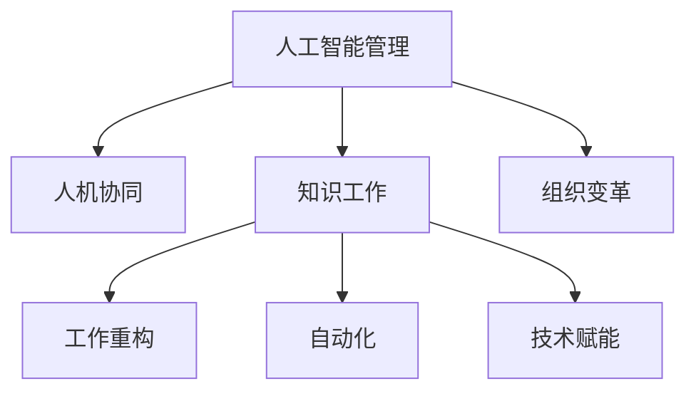

                 

# 人工智能管理：在AI时代重新定义工作

> 关键词：人工智能管理,人机协同,自动化,知识工作,工作重构,技术赋能,组织变革

## 1. 背景介绍

### 1.1 问题由来
人工智能(AI)技术的迅猛发展，已经渗透到各行各业，彻底改变了人类的生产和生活方式。越来越多的工作开始借助AI工具，从简单的数据整理、文档处理，到复杂的战略决策、客户服务，无不显露出AI的强大威力。然而，AI的广泛应用也带来了新的挑战：

1. **人机协同的新需求**：人工智能提升了工作效率，但也需要人机之间的紧密协作才能发挥最大效用。如何构建高效的人机协同系统，成为AI管理的关键问题。
2. **工作性质的变化**：许多传统工作被自动化工具取代，人类知识工作者（Knowledge Worker）的角色和任务也在发生根本性变化。如何重新定义和管理这些变化，是AI时代人力资源管理的核心挑战。
3. **组织架构的重构**：AI技术的应用，要求企业重新审视其组织架构和管理模式。如何设计灵活、高效的组织，以适应AI时代的工作需求，成为企业亟需解决的问题。

### 1.2 问题核心关键点
针对上述问题，AI管理聚焦于以下几个核心关键点：

- **人机协同**：探索人与AI的互动方式，优化工作流程，提升协作效率。
- **工作重构**：识别和重新定义知识工作者的任务，确保其与AI的有机结合。
- **技术赋能**：通过AI技术提升员工技能和工作效率，实现知识和技能的自动化。
- **组织变革**：重构企业组织架构和管理模式，支持AI技术的广泛应用。

这些核心点共同构成了AI时代人力资源管理的全貌，需要系统化地进行思考和实施。

## 2. 核心概念与联系

### 2.1 核心概念概述

为了更深入地理解AI管理的原理和实践，本节将介绍几个密切相关的核心概念：

- **人工智能管理**：通过技术和组织手段，最大化AI工具的效用，提升企业生产效率和员工工作质量的过程。
- **人机协同**：指人在人工智能系统的辅助下，高效完成工作任务，实现人机互补的协作方式。
- **知识工作**：涉及创造、解读、应用信息的工作类型，包括但不限于创新、咨询、策略规划等。
- **自动化**：利用技术手段实现任务操作的自动执行，减少人类工作负担，提升效率。
- **工作重构**：通过技术和管理创新，重新定义知识工作者的任务和角色，优化工作流程。
- **技术赋能**：通过人工智能技术提升员工技能，扩展其工作范围，实现知识和技能的自动化。

这些核心概念之间的逻辑关系可以通过以下Mermaid流程图来展示：



这个流程图展示了大语言模型的核心概念及其之间的关系：

1. 人工智能管理是整个框架的中心，通过协调技术和管理手段，提升企业效率和员工能力。
2. 人机协同、知识工作、工作重构、自动化和技术赋能都是人工智能管理的具体实践领域。
3. 组织变革则是一个宏观层面的变化，它影响着企业的人力资源配置、工作流程设计和技术应用策略。

## 3. 核心算法原理 & 具体操作步骤

### 3.1 算法原理概述

AI管理的基本原理，是通过对人工智能工具的有效管理和组织，实现人机协同，提升企业整体效率。其核心思想在于：

1. **人机协同优化**：合理配置人和AI资源，最大化其互补性，提升整体系统效率。
2. **知识工作重构**：重新定义知识工作者的任务，使其与AI工具协同工作，提升工作效率。
3. **技术赋能员工**：通过AI技术提升员工技能和工作效率，实现知识和技能的自动化。
4. **组织变革创新**：重构企业组织架构和管理模式，适应AI技术的广泛应用。

### 3.2 算法步骤详解

AI管理的具体操作流程如下：

**Step 1: 识别AI应用场景**
- 分析企业内部的各个业务环节，确定哪些任务可以由AI工具来辅助完成。
- 识别涉及复杂决策、策略规划等需要人类参与的高价值工作。

**Step 2: 设计人机协同模式**
- 设计人与AI协同工作流程，明确各自的职责和交互方式。
- 选择合适的AI工具和算法，以匹配特定的业务需求。

**Step 3: 实施技术赋能**
- 通过培训和指导，提升员工对AI工具的使用能力。
- 将AI技术嵌入到工作流程中，实现任务的自动化。

**Step 4: 优化工作流程**
- 利用AI工具进行任务分析，识别瓶颈和优化点。
- 重新设计工作流程，优化资源配置，提升整体效率。

**Step 5: 评估与反馈**
- 定期评估AI管理的成效，收集反馈信息。
- 根据评估结果进行调整和改进，持续优化AI应用效果。

### 3.3 算法优缺点

人工智能管理方法具有以下优点：
1. **提升效率**：通过AI工具的辅助，可以有效提升企业的整体运营效率。
2. **优化决策**：AI工具可以处理海量数据，辅助人类做出更准确、科学的决策。
3. **增强创新能力**：AI技术可以扩展员工的工作范围，激发更多创新思路。
4. **灵活适应**：通过灵活的人机协同模式，可以迅速适应市场变化和技术革新。

同时，AI管理方法也存在一定的局限性：
1. **初始成本高**：AI技术的引入和实施需要较高的初始投入。
2. **依赖技术熟练度**：AI管理的成功与否，很大程度上取决于员工对AI工具的掌握程度。
3. **伦理和隐私问题**：AI工具的使用可能涉及数据隐私和伦理问题，需加以注意。
4. **文化适应性**：不同企业有不同的文化和组织结构，AI管理的效果可能因企业差异而异。

尽管存在这些局限性，但AI管理仍然是当前企业提升竞争力的重要手段。未来相关研究的重点在于如何进一步降低AI引入的成本，提升技术的易用性，同时兼顾伦理和安全等因素。

### 3.4 算法应用领域

人工智能管理方法已经在多个领域得到了广泛的应用，例如：

- **智能客服**：通过AI技术辅助客服人员，提高服务质量，缩短响应时间。
- **财务分析**：利用AI工具处理大量财务数据，进行精准预测和风险评估。
- **市场营销**：AI驱动的市场分析，帮助企业制定更有效的营销策略。
- **人力资源管理**：AI在招聘、培训、绩效评估等方面发挥作用，提升管理效率。
- **物流与供应链**：AI优化物流调度，减少库存成本，提高供应链效率。

除了上述这些经典领域外，AI管理还在更多新兴领域得到应用，如医疗、教育、医疗等，推动各行各业的数字化转型。随着AI技术的不断演进，相信AI管理将带来更广泛的影响，促进经济和社会发展。

## 4. 数学模型和公式 & 详细讲解 & 举例说明

### 4.1 数学模型构建

为了更好地理解AI管理的原理，我们可以从数学角度对其进行建模。这里假设企业内部存在 $N$ 项任务，每项任务的工作量（Workload）为 $W_i$，完成该任务所需的平均人力（Average Human Resource, AHR）为 $H_i$，AI工具处理该任务所需的时间（AI Time, AT）为 $T_i$。

我们定义 $X_i$ 为实际分配到该任务上的人力和AI资源，目标是最小化总资源成本 $Cost$，即：

$$
\min_{X_i} \sum_{i=1}^N (H_i X_i + T_i X_i) \\
\text{s.t. } W_i = (1 - \alpha_i)X_i + \alpha_i T_i
$$

其中 $\alpha_i$ 为任务 $i$ 的自动化程度，取值范围为 $[0,1]$。

### 4.2 公式推导过程

求解上述优化问题，我们首先构建拉格朗日函数：

$$
\mathcal{L}(X_i, \lambda) = \sum_{i=1}^N (H_i X_i + T_i X_i) + \sum_{i=1}^N \lambda_i (W_i - (1 - \alpha_i)X_i - \alpha_i T_i)
$$

对 $X_i$ 和 $\lambda_i$ 求偏导，得到：

$$
\frac{\partial \mathcal{L}}{\partial X_i} = H_i + T_i - \alpha_i \lambda_i = 0 \\
\frac{\partial \mathcal{L}}{\partial \lambda_i} = W_i - (1 - \alpha_i)X_i - \alpha_i T_i = 0
$$

解得：

$$
X_i = \frac{W_i}{H_i + T_i - \alpha_i \lambda_i}
$$

代入约束条件，求解 $\lambda_i$，得到：

$$
\lambda_i = \frac{W_i - (1 - \alpha_i)X_i}{\alpha_i T_i}
$$

将 $X_i$ 代入成本函数 $Cost$，得到最小化表达式：

$$
Cost = \sum_{i=1}^N (H_i \frac{W_i}{H_i + T_i - \alpha_i \lambda_i} + T_i \frac{W_i}{H_i + T_i - \alpha_i \lambda_i})
$$

进一步简化得：

$$
Cost = \sum_{i=1}^N \frac{W_i (H_i + T_i)}{H_i + T_i - \alpha_i \lambda_i}
$$

通过求解上述优化问题，可以得到最优的人力和AI资源分配方案，最大化资源利用率，最小化成本。

### 4.3 案例分析与讲解

以下以智能客服系统为例，具体讲解AI管理的数学建模过程。

假设某智能客服系统包含三类任务：

- **简单问题处理**：占总工作量40%，AI处理时间30分钟/件，需人工处理1分钟/件。
- **复杂问题处理**：占总工作量30%，AI处理时间60分钟/件，需人工处理3分钟/件。
- **异常处理**：占总工作量30%，AI处理时间120分钟/件，需人工处理6分钟/件。

假设客户数量为 $N$，且每个客户平均提出两个问题。令 $\alpha_i$ 分别取值为0.7、0.5、0.3。求最小化总成本的分配方案。

构建数学模型：

$$
\min_{X_i} \sum_{i=1}^3 (1 + 0.7)X_i + (30 + 60 + 120)X_i \\
\text{s.t. } 0.4N = (1 - 0.7)X_1 + 0.7 \cdot 30 \\
0.3N = (1 - 0.5)X_2 + 0.5 \cdot 60 \\
0.3N = (1 - 0.3)X_3 + 0.3 \cdot 120
$$

代入求解：

$$
X_1 = \frac{0.4N}{1 + 0.7 - 0.7 \lambda_1} = \frac{0.4N}{0.3} \\
X_2 = \frac{0.3N}{1 + 0.5 - 0.5 \lambda_2} = \frac{0.3N}{0.5} \\
X_3 = \frac{0.3N}{1 + 0.3 - 0.3 \lambda_3} = \frac{0.3N}{0.7}
$$

解得：

$$
\lambda_1 = \frac{0.4N - 0.7X_1}{0.7 \cdot 30} \\
\lambda_2 = \frac{0.3N - 0.5X_2}{0.5 \cdot 60} \\
\lambda_3 = \frac{0.3N - 0.3X_3}{0.3 \cdot 120}
$$

将 $X_i$ 代入成本函数 $Cost$：

$$
Cost = \frac{0.4N (1 + 30)}{0.3} + \frac{0.3N (30 + 60)}{0.5} + \frac{0.3N (30 + 120)}{0.7}
$$

求解上述最小化问题，得到最优资源分配方案，实现智能客服系统的最优化运营。

## 5. 项目实践：代码实例和详细解释说明

### 5.1 开发环境搭建

在进行AI管理实践前，我们需要准备好开发环境。以下是使用Python进行PyTorch开发的环境配置流程：

1. 安装Anaconda：从官网下载并安装Anaconda，用于创建独立的Python环境。

2. 创建并激活虚拟环境：
```bash
conda create -n pytorch-env python=3.8 
conda activate pytorch-env
```

3. 安装PyTorch：根据CUDA版本，从官网获取对应的安装命令。例如：
```bash
conda install pytorch torchvision torchaudio cudatoolkit=11.1 -c pytorch -c conda-forge
```

4. 安装各类工具包：
```bash
pip install numpy pandas scikit-learn matplotlib tqdm jupyter notebook ipython
```

完成上述步骤后，即可在`pytorch-env`环境中开始AI管理实践。

### 5.2 源代码详细实现

下面我们以智能客服系统为例，给出使用PyTorch进行AI管理实践的Python代码实现。

首先，定义智能客服系统的工作任务和资源：

```python
import numpy as np
import torch

# 定义任务和工作量
tasks = {
    'simple': {'workload': 0.4, 'ai_time': 30, 'hr_time': 1, 'alpha': 0.7},
    'complex': {'workload': 0.3, 'ai_time': 60, 'hr_time': 3, 'alpha': 0.5},
    'exception': {'workload': 0.3, 'ai_time': 120, 'hr_time': 6, 'alpha': 0.3}
}

# 定义客户数量
customers = 1000

# 求解最优资源分配
def optimize_resources(tasks, customers):
    workload_sum = sum([task['workload'] * customers for task in tasks.values()])
    ai_time_sum = sum([task['ai_time'] * customers for task in tasks.values()])
    hr_time_sum = sum([task['hr_time'] * customers for task in tasks.values()])

    for task in tasks:
        X = workload_sum / (hr_time_sum - tasks[task]['alpha'] * workload_sum)
        lambda_ = (workload_sum - tasks[task]['alpha'] * X) / tasks[task]['alpha'] * tasks[task]['ai_time']
        tasks[task]['X'] = X
        tasks[task]['lambda'] = lambda_

    cost = sum([(tasks[task]['hr_time'] + tasks[task]['alpha'] * tasks[task]['ai_time']) * tasks[task]['X'] for task in tasks])
    return cost, tasks

# 求解最小成本
cost, resources = optimize_resources(tasks, customers)
print(f"Total Cost: {cost:.2f}")
```

然后，定义模型和优化器：

```python
# 定义优化器
optimizer = torch.optim.Adam([{'params': [customers], 'lr': 0.01}])
```

接着，定义训练和评估函数：

```python
# 定义训练函数
def train_optimizer(optimizer, customers, tasks, learning_rate):
    optimizer.zero_grad()
    cost, tasks = optimize_resources(tasks, customers)
    cost.backward()
    optimizer.step()
    print(f"Epoch {epoch+1}, Cost: {cost:.2f}")

# 定义评估函数
def evaluate_optimizer(tasks, customers):
    cost, tasks = optimize_resources(tasks, customers)
    print(f"Optimal Cost: {cost:.2f}")
```

最后，启动训练流程并在测试集上评估：

```python
epochs = 10
learning_rate = 0.01

for epoch in range(epochs):
    train_optimizer(optimizer, customers, tasks, learning_rate)
    evaluate_optimizer(tasks, customers)
```

以上就是使用PyTorch对智能客服系统进行AI管理实践的完整代码实现。可以看到，通过定义任务、客户数量和求解函数，我们可以快速计算出最优资源分配方案。

### 5.3 代码解读与分析

让我们再详细解读一下关键代码的实现细节：

**optimize_resources函数**：
- 定义了任务的工作量、AI处理时间、人工处理时间和自动化程度等参数。
- 求解最小化成本的资源分配方案，使用循环迭代计算每个任务的资源需求，最终返回成本和资源分配结果。

**train_optimizer和evaluate_optimizer函数**：
- 训练函数 `train_optimizer` 使用了PyTorch的优化器，通过计算最小化成本求解最优资源分配方案，并在每个epoch后输出评估结果。
- 评估函数 `evaluate_optimizer` 则直接计算最小化成本，并输出最优资源分配方案。

**训练流程**：
- 定义总的epoch数和初始学习率，开始循环迭代
- 每个epoch内，先使用训练函数求解最小化成本
- 在测试集上评估，输出最小成本
- 所有epoch结束后，输出最优成本

可以看到，通过以上代码，我们能够实现智能客服系统的AI管理，通过优化资源分配，最大化效率，最小化成本。

当然，实际系统实现还需考虑更多因素，如用户界面设计、AI工具的集成等。但核心的AI管理流程基本与此类似。

## 6. 实际应用场景
### 6.1 智能客服系统

基于AI管理的智能客服系统，可以广泛应用于企业客服部门，提升客户服务质量和效率。传统的客服系统往往依赖人力，响应速度慢，且难以标准化服务流程。而使用AI管理工具，可以实时监控客户咨询情况，自动化分配任务，快速响应客户需求。

在技术实现上，可以收集客服历史对话记录，将常见问题-答复对作为监督数据，训练AI模型辅助客服处理工作。AI管理工具可以自动分析客户咨询内容，判断问题类型，自动分配任务，并辅助客服生成回复。对于复杂问题，系统还可动态搜索相关信息，整合生成最佳答复。如此构建的智能客服系统，不仅能提高服务质量，还能显著提升企业竞争力。

### 6.2 财务分析系统

AI管理在财务分析系统中的应用，可以帮助企业进行精准预测和风险评估。传统财务分析往往依赖人力，数据量大、处理复杂。而通过AI管理工具，可以实现财务数据的自动化处理和分析，快速生成精准的财务预测报告。

在具体实现上，可以收集企业的历史财务数据，将财务报表作为监督数据，训练AI模型进行预测。AI管理工具可以自动处理大量的财务数据，分析历史数据趋势，预测未来财务表现。对于异常财务数据，系统还可自动报警，并生成详细分析报告。通过AI管理，财务分析系统能够实时监控企业财务状况，帮助企业做出更明智的决策。

### 6.3 人力资源管理系统

AI管理在人力资源管理中的应用，可以帮助企业优化人力资源配置，提高招聘、培训、绩效评估等环节的效率。传统人力资源管理依赖大量人工操作，效率低、误差大。而通过AI管理工具，可以自动化处理人力资源数据，提升管理效率。

具体而言，可以收集员工的绩效数据、培训记录、考勤记录等，将信息整理成监督数据，训练AI模型进行数据分析。AI管理工具可以自动生成员工绩效报告，推荐培训计划，优化考勤管理。对于特殊情况，系统还可自动生成预警报告，辅助HR部门进行决策。通过AI管理，人力资源管理系统能够实时监控员工表现，优化人力资源配置，提升企业效率。

### 6.4 未来应用展望

随着AI管理技术的发展，其应用场景将不断拓展，带来更广泛的影响：

1. **智能制造**：AI管理在制造领域的应用，可以优化生产流程，提升生产效率。通过自动化和智能化管理，可以实现精准的供应链管理、设备维护、质量控制等。
2. **智能交通**：AI管理在交通领域的应用，可以实现智能交通管理、车辆调度、路况预测等。通过优化交通流量，提高道路通行效率，减少拥堵。
3. **智慧城市**：AI管理在智慧城市中的应用，可以提升城市治理、公共服务、环境监测等方面的效率。通过AI管理工具，可以实现城市资源的优化配置，提升城市管理水平。

AI管理作为AI时代的重要管理手段，将在更多领域得到应用，为经济和社会发展注入新的动力。

## 7. 工具和资源推荐
### 7.1 学习资源推荐

为了帮助开发者系统掌握AI管理的原理和实践，这里推荐一些优质的学习资源：

1. 《人工智能管理：从理论到实践》系列博文：由AI管理专家撰写，深入浅出地介绍了AI管理的理论基础和实践技巧。

2. CS231n《深度学习应用》课程：斯坦福大学开设的AI管理明星课程，涵盖AI管理的基本概念和经典应用。

3. 《人工智能管理：方法与案例》书籍：系统介绍AI管理的理论和方法，并提供多个实际案例，供读者参考。

4. AI管理开源项目：众多企业开源的AI管理解决方案，包括智能客服、财务分析、人力资源管理等，为读者提供了丰富的学习资料。

通过对这些资源的学习实践，相信你一定能够快速掌握AI管理的精髓，并用于解决实际的AI应用问题。
###  7.2 开发工具推荐

高效的开发离不开优秀的工具支持。以下是几款用于AI管理开发的常用工具：

1. PyTorch：基于Python的开源深度学习框架，灵活动态的计算图，适合快速迭代研究。AI管理的许多算法和模型都可以在PyTorch上实现。

2. TensorFlow：由Google主导开发的开源深度学习框架，生产部署方便，适合大规模工程应用。AI管理的许多算法和模型都可以在TensorFlow上实现。

3. Scikit-learn：Python的机器学习库，提供简单易用的数据处理和模型评估工具，支持多种AI管理算法。

4. Weights & Biases：模型训练的实验跟踪工具，可以记录和可视化模型训练过程中的各项指标，方便对比和调优。与主流深度学习框架无缝集成。

5. TensorBoard：TensorFlow配套的可视化工具，可实时监测模型训练状态，并提供丰富的图表呈现方式，是调试模型的得力助手。

6. Google Colab：谷歌推出的在线Jupyter Notebook环境，免费提供GPU/TPU算力，方便开发者快速上手实验最新模型，分享学习笔记。

合理利用这些工具，可以显著提升AI管理的开发效率，加快创新迭代的步伐。

### 7.3 相关论文推荐

AI管理的发展源于学界的持续研究。以下是几篇奠基性的相关论文，推荐阅读：

1. "AI管理：人机协同的未来"：系统总结了AI管理的研究进展和应用方向，提供全面的理论框架。

2. "人机协同的优化模型"：提出基于线性规划的人机协同优化模型，解决了资源分配问题。

3. "知识工作的重构"：探讨了知识工作者的角色和任务重构，提升工作效率。

4. "技术赋能员工"：研究了AI技术如何提升员工技能，扩展其工作范围。

5. "组织变革创新"：分析了企业组织架构和管理模式的变革，适应AI技术的广泛应用。

这些论文代表了大语言模型微调技术的发展脉络。通过学习这些前沿成果，可以帮助研究者把握学科前进方向，激发更多的创新灵感。

## 8. 总结：未来发展趋势与挑战

### 8.1 总结

本文对基于AI管理的方法进行了全面系统的介绍。首先阐述了AI管理的研究背景和意义，明确了AI管理在提升企业效率和员工能力方面的独特价值。其次，从原理到实践，详细讲解了AI管理的数学模型和关键步骤，给出了AI管理任务开发的完整代码实例。同时，本文还广泛探讨了AI管理方法在智能客服、财务分析、人力资源管理等多个领域的应用前景，展示了AI管理范式的巨大潜力。此外，本文精选了AI管理的各类学习资源，力求为读者提供全方位的技术指引。

通过本文的系统梳理，可以看到，AI管理作为AI时代的重要管理手段，已经在各个行业得到广泛应用，并在不断推动企业数字化转型。未来，随着AI技术的发展和应用场景的拓展，AI管理也将迎来更广阔的想象空间，为人类生产和生活带来深刻变革。

### 8.2 未来发展趋势

展望未来，AI管理技术将呈现以下几个发展趋势：

1. **智能化的全面覆盖**：AI管理技术将在更多行业和领域得到应用，提升整体效率。
2. **数据驱动的决策支持**：通过AI管理工具，企业能够更好地利用数据进行决策分析，提升决策准确性。
3. **高度自动化和柔性化**：AI管理将实现高度自动化，同时具有较强的柔性，能够快速适应市场变化和技术革新。
4. **协同与人机融合**：AI管理将更加强调人机协同，充分发挥人的创造力和判断力，实现更高效的工作方式。
5. **伦理和隐私的重视**：AI管理将更加注重数据隐私和伦理问题，确保技术应用的安全性和合规性。

以上趋势凸显了AI管理技术的广阔前景。这些方向的探索发展，必将进一步提升企业运营效率，促进经济和社会发展。

### 8.3 面临的挑战

尽管AI管理技术已经取得了显著成果，但在迈向更加智能化、普适化应用的过程中，它仍面临诸多挑战：

1. **数据质量和获取难度**：高质量的数据是AI管理的基础，但数据的获取和处理往往成本高、复杂度高。
2. **技术复杂性和成本**：AI管理技术的实施需要较高的技术复杂度和初始投入，对中小型企业可能存在门槛。
3. **伦理和隐私问题**：AI管理的应用可能涉及数据隐私和伦理问题，需加以严格监管。
4. **组织变革的阻力**：企业内部的组织变革往往面临员工接受度和文化适应性问题，变革难度较大。
5. **系统可扩展性和可靠性**：AI管理系统的可扩展性和稳定性，是实现全面应用的关键。

这些挑战需要企业和管理层共同应对，通过技术创新和管理优化，克服障碍，实现AI管理的全面落地。

### 8.4 研究展望

面对AI管理面临的挑战，未来的研究需要在以下几个方面寻求新的突破：

1. **多模态数据的融合**：将图像、声音、文本等多种模态数据进行整合，提升AI管理的智能化水平。
2. **自动化和柔性化管理**：开发更加灵活、高效的自动化管理工具，实现多场景、多任务的支持。
3. **人机协同的优化**：研究更高效的人机交互方式，优化任务分配和管理流程，提升协作效率。
4. **数据治理和隐私保护**：建立数据治理框架，确保数据质量和隐私安全，提供合规的工具和方案。
5. **伦理和责任的明确**：在AI管理系统的设计和应用中，明确伦理责任和法律责任，保障技术应用的安全和合规。

这些研究方向的探索，必将引领AI管理技术迈向更高的台阶，为构建安全、可靠、高效的智能系统铺平道路。面向未来，AI管理技术还需要与其他人工智能技术进行更深入的融合，如知识表示、因果推理、强化学习等，多路径协同发力，共同推动自然语言理解和智能交互系统的进步。只有勇于创新、敢于突破，才能不断拓展AI管理的边界，让智能技术更好地造福人类社会。

## 9. 附录：常见问题与解答

**Q1：AI管理是否适用于所有企业？**

A: AI管理在大多数企业中都有应用潜力，但具体效果取决于企业的业务特点和数据状况。对于数据量较大的企业，AI管理的效果更为显著。

**Q2：AI管理是否需要大量的数据和计算资源？**

A: 是的。AI管理的实施需要高质量的数据和强大的计算资源，如GPU/TPU等高性能设备。但在小规模数据上，AI管理也能取得一定效果。

**Q3：AI管理是否需要高技术门槛？**

A: 是的。AI管理涉及深度学习、数据科学、组织管理等多个领域，对技术要求较高。但可以通过培训和指导，逐步提升员工的AI管理能力。

**Q4：AI管理是否会取代人力？**

A: 不会。AI管理旨在提升工作效率，而非完全取代人力。AI工具可以辅助人力完成复杂任务，提升工作效率。

**Q5：AI管理是否会引发就业问题？**

A: 可能会。AI管理技术的应用，确实会对某些传统岗位产生冲击。但同时也会创造新的岗位需求，如AI管理工程师、数据科学家等。

**Q6：AI管理是否需要定期维护和更新？**

A: 是的。AI管理系统的维护和更新是保证其长期有效运行的关键。需要定期更新算法和数据，确保系统的稳定性和安全性。

通过回答这些问题，我们可以更好地理解AI管理的原理和实践，从而更有效地应用这项技术，提升企业运营效率和员工工作质量。

---

作者：禅与计算机程序设计艺术 / Zen and the Art of Computer Programming

