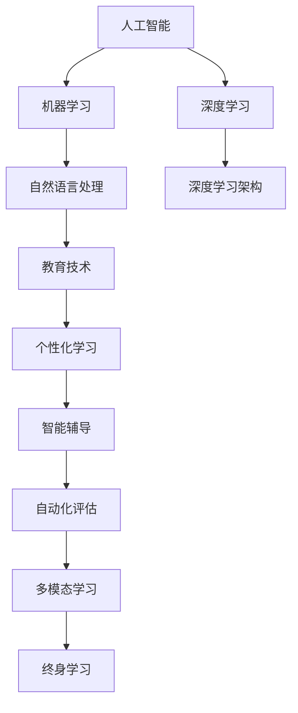

                 

## 1. 背景介绍

在当今社会，教育已经成为了国家发展的基石和未来竞争力的关键。然而，传统的教育模式和教学方法面临着诸多挑战，难以满足日益复杂和多样化的学习需求。人工智能(AI)技术的崛起，为教育的变革提供了新的可能，通过智能化的教学工具和个性化教育方案，使得教育资源得到更高效地分配和利用。本文将从背景介绍开始，阐述AI在教育领域的应用及其变革潜力。

### 1.1 教育领域面临的挑战

随着科技的迅猛发展，传统的教育模式已经难以适应现代社会的变化需求。教育领域面临的主要挑战包括：

- **教育资源不均**：城乡之间、校际之间的教育资源分布不均，影响了教育的公平性。
- **教学方法单一**：传统的“灌输式”教学方法难以激发学生的兴趣和创造力，教学效果欠佳。
- **个性化教育缺乏**：每个学生的学习能力和兴趣不同，传统教学模式难以实现因材施教。
- **教师负担过重**：教师在备课、批改作业、管理学生等方面工作量巨大，难以兼顾教学质量。

### 1.2 人工智能为教育带来的机遇

人工智能技术的进步为教育变革带来了新的机遇，主要包括：

- **个性化学习**：AI可以根据学生的学习行为和反馈，提供个性化的学习路径和资源。
- **智能辅导**：AI能够实时监控学生的学习状态，提供针对性的辅导和反馈。
- **自动化评估**：AI可以自动批改作业、评估考试，减轻教师的负担。
- **多模态学习**：AI可以整合图像、音频、视频等多种学习资源，丰富教学形式。
- **终身学习**：AI可以构建在线学习平台，支持任何时间、地点的学习。

## 2. 核心概念与联系

### 2.1 核心概念概述

为了更好地理解人工智能在教育领域的应用，本节将介绍几个关键概念及其相互联系：

- **人工智能(AI)**：一种通过模拟人类智能行为的技术，包括学习、推理、决策等能力。
- **机器学习(ML)**：一种利用数据和算法让机器从经验中学习并做出预测或决策的技术。
- **深度学习(DL)**：一种基于神经网络的机器学习技术，可以处理大规模数据和复杂任务。
- **自然语言处理(NLP)**：一种使计算机能够理解、处理和生成人类语言的技术。
- **教育技术(EdTech)**：使用信息技术手段改进教育质量和效率的技术。

这些核心概念共同构成了AI在教育领域的应用框架，使得教育资源得以更高效地分配和利用。

### 2.2 核心概念原理和架构的 Mermaid 流程图



这个流程图展示了人工智能、机器学习、深度学习、自然语言处理与教育技术之间的联系，以及这些技术如何共同支持个性化学习、智能辅导、自动化评估、多模态学习、终身学习的教育变革。

## 3. 核心算法原理 & 具体操作步骤

### 3.1 算法原理概述

人工智能在教育领域的应用，主要基于以下算法原理：

- **机器学习**：通过收集和分析教育数据，学习学生的学习行为和偏好，从而提供个性化的学习方案。
- **深度学习**：利用神经网络模型，对大规模教育数据进行特征提取和模式识别，实现自动化的评估和推荐。
- **自然语言处理**：使计算机能够理解和生成人类语言，提升教育内容的可读性和交互性。
- **强化学习**：通过模拟学生和教师的交互过程，优化教学策略和资源分配。

### 3.2 算法步骤详解

基于上述算法原理，AI在教育领域的应用通常包括以下步骤：

1. **数据收集与预处理**：收集学生的学习行为数据、成绩、反馈等，进行数据清洗和预处理。
2. **模型训练与优化**：选择合适的机器学习模型，如决策树、神经网络等，在教育数据上训练和优化模型。
3. **个性化学习方案**：根据学生的学习数据，利用机器学习算法生成个性化的学习路径和资源。
4. **智能辅导与反馈**：实时监控学生的学习状态，提供针对性的辅导和反馈。
5. **自动化评估与分析**：利用深度学习模型自动批改作业、评估考试，生成评估报告。
6. **多模态学习与资源整合**：整合图像、音频、视频等多种学习资源，提升教学形式的多样性。
7. **终身学习平台建设**：构建在线学习平台，支持任何时间、地点的学习。

### 3.3 算法优缺点

基于机器学习和深度学习的大规模教育数据分析，带来了许多优点：

- **高效性**：AI能够处理大规模教育数据，快速生成个性化学习方案。
- **准确性**：AI能够进行准确的评估和预测，提供可靠的教学建议。
- **可扩展性**：AI可以轻松扩展到不同的教育场景和应用。

但同时也存在一些缺点：

- **数据隐私**：AI需要大量的学生数据，涉及隐私保护和安全问题。
- **公平性**：AI算法可能存在偏见，影响教育公平。
- **依赖数据质量**：AI的效果高度依赖于数据的质量和多样性。
- **教师角色的改变**：AI的广泛应用可能削弱教师在教学中的作用。

### 3.4 算法应用领域

AI在教育领域的应用领域非常广泛，主要包括：

- **个性化学习**：根据学生的学习行为和偏好，提供个性化的学习路径和资源。
- **智能辅导**：实时监控学生的学习状态，提供针对性的辅导和反馈。
- **自动化评估**：利用深度学习模型自动批改作业、评估考试，减轻教师负担。
- **多模态学习**：整合图像、音频、视频等多种学习资源，提升教学形式的多样性。
- **终身学习平台**：构建在线学习平台，支持任何时间、地点的学习。
- **教育管理与决策**：利用数据分析优化教育资源的分配和教学策略。

## 4. 数学模型和公式 & 详细讲解 & 举例说明

### 4.1 数学模型构建

为了更好地理解和应用AI在教育领域的方法，我们假设有一组学生的学习数据，记为 $\mathcal{D}=\{(x_i, y_i)\}_{i=1}^N$，其中 $x_i$ 表示第 $i$ 个学生的特征向量，$y_i$ 表示其对应的成绩。我们希望构建一个线性回归模型 $f(x) = \theta^T x$ 来预测学生的成绩，其中 $\theta$ 为模型参数。

### 4.2 公式推导过程

首先，我们通过最小二乘法求解模型参数 $\theta$：

$$
\theta = (X^T X)^{-1} X^T y
$$

其中 $X$ 为特征矩阵，$y$ 为成绩向量。通过训练数据 $\mathcal{D}$ 计算得到模型参数 $\theta$，然后对新学生 $x$ 进行预测：

$$
\hat{y} = f(x) = \theta^T x
$$

### 4.3 案例分析与讲解

假设我们有一组学生的学习数据，包含他们每天的学习时间、作业完成情况和最终成绩。我们可以使用线性回归模型来预测学生的成绩，从而生成个性化的学习方案。具体步骤如下：

1. **数据预处理**：对学生数据进行归一化处理，确保特征值的范围一致。
2. **模型训练**：利用训练数据集对线性回归模型进行训练，求解模型参数 $\theta$。
3. **特征提取**：对新学生的特征向量 $x$ 进行预处理，提取其关键特征。
4. **预测成绩**：利用训练好的模型对新学生的特征向量 $x$ 进行预测，得到其预期成绩。
5. **生成学习方案**：根据预测成绩，生成个性化的学习方案，如调整学习时间、推荐习题等。

## 5. 项目实践：代码实例和详细解释说明

### 5.1 开发环境搭建

在进行教育AI项目的开发前，我们需要准备相应的开发环境。以下是使用Python和TensorFlow进行开发的流程：

1. **安装Python和TensorFlow**：
   ```bash
   pip install tensorflow
   ```

2. **创建虚拟环境**：
   ```bash
   conda create -n myenv python=3.7
   conda activate myenv
   ```

3. **安装依赖库**：
   ```bash
   pip install numpy pandas scikit-learn scipy matplotlib seaborn joblib
   ```

### 5.2 源代码详细实现

下面以一个简单的学生成绩预测模型为例，展示如何使用TensorFlow实现基于机器学习的个性化学习方案生成。

```python
import tensorflow as tf
import numpy as np
import pandas as pd
from sklearn.model_selection import train_test_split

# 读取学生数据
data = pd.read_csv('student_data.csv')

# 分割训练集和测试集
train_data, test_data = train_test_split(data, test_size=0.2)

# 特征和标签
X_train = train_data[['study_time', 'homework_completion']]
y_train = train_data['score']
X_test = test_data[['study_time', 'homework_completion']]
y_test = test_data['score']

# 构建模型
model = tf.keras.Sequential([
    tf.keras.layers.Dense(64, activation='relu', input_shape=(2,)),
    tf.keras.layers.Dense(1)
])

# 编译模型
model.compile(optimizer=tf.keras.optimizers.Adam(0.01),
              loss='mse',
              metrics=['mae'])

# 训练模型
model.fit(X_train, y_train, epochs=10, batch_size=32)

# 预测测试集
y_pred = model.predict(X_test)

# 评估模型
mae = tf.keras.metrics.MeanAbsoluteError()
mae(y_test, y_pred).numpy()
```

### 5.3 代码解读与分析

**数据处理**：
- 读取学生数据文件，将其分割为训练集和测试集。
- 提取特征 $X$ 和标签 $y$。

**模型构建**：
- 使用Sequential模型，构建包含两个全连接层的神经网络。
- 第一层包含64个神经元，使用ReLU激活函数。
- 第二层为输出层，包含一个神经元，没有激活函数。

**模型编译**：
- 使用Adam优化器，设置学习率为0.01。
- 损失函数为均方误差，评估指标为平均绝对误差。

**模型训练**：
- 使用训练集进行模型训练，设置10个epochs，每批次32个样本。

**模型评估**：
- 使用测试集进行模型评估，计算平均绝对误差。

## 6. 实际应用场景

### 6.1 智能辅导系统

智能辅导系统是AI在教育领域的重要应用之一。通过智能辅导系统，学生可以在遇到学习难题时获得实时帮助。系统可以基于学生的学习行为数据，提供个性化的辅导方案。例如，利用自然语言处理技术，智能辅导系统可以回答学生的问题，提供解题思路和步骤。

**应用实例**：
- 学生A在学习数学时遇到难题，智能辅导系统可以通过自然语言处理技术理解问题，提供详细的解题步骤和思路。
- 学生B在英语写作时遇到词汇问题，智能辅导系统可以提供单词解释、例句和语法规则。

### 6.2 教育管理与决策

AI在教育管理与决策中的应用，主要集中在优化教育资源的分配和教学策略的制定。例如，利用数据分析，可以优化班级的分配、课程的设置和教师的安排。

**应用实例**：
- 某教育机构希望优化班级规模，通过数据分析，发现班级规模在25人左右时，学生的学习效果最佳。
- 某学校希望提高数学成绩，通过数据分析，发现学生在每周额外增加一次数学辅导后，成绩有显著提升。

### 6.3 终身学习平台

终身学习平台是AI在教育领域的另一个重要应用。通过在线学习平台，学生可以随时随地进行学习，不受时间和地点的限制。平台可以根据学生的学习进度和偏好，推荐合适的学习资源。

**应用实例**：
- 学生C想学习编程，利用在线学习平台，选择适合的编程语言和课程，逐步掌握编程技能。
- 学生D想提升外语水平，利用在线学习平台，学习发音、词汇和语法，逐步提升语言能力。

### 6.4 未来应用展望

随着AI技术的不断进步，未来在教育领域的应用将更加广泛和深入。以下是一些未来应用展望：

- **虚拟现实(VR)与增强现实(AR)**：结合VR和AR技术，创建沉浸式学习环境，提升学生的学习体验。
- **智能教师助手**：AI可以作为教师的助手，处理大量的教学管理工作，让教师专注于教学。
- **自适应学习系统**：根据学生的学习进度和反馈，自动调整学习内容和难度，实现真正的因材施教。
- **教育机器人**：利用AI和机器人的技术，提供个性化的教育服务，尤其是在偏远地区和特殊教育领域。
- **学习游戏化**：将学习内容融入游戏中，提升学生的学习兴趣和参与度。

## 7. 工具和资源推荐

### 7.1 学习资源推荐

为了帮助开发者系统掌握AI在教育领域的应用，这里推荐一些优质的学习资源：

1. **《深度学习与教育》**：介绍深度学习在教育中的应用，涵盖数据预处理、模型构建、评估等多个方面。
2. **《机器学习与教育》**：结合教育数据的特点，介绍机器学习算法的应用。
3. **Coursera《人工智能在教育中的应用》课程**：由斯坦福大学教授授课，涵盖AI在教育中的多个应用场景。
4. **edX《数据分析与可视化》课程**：利用Python和R进行数据处理和可视化，提升数据分析能力。
5. **Kaggle《教育数据科学竞赛》**：通过竞赛方式，实践AI在教育数据处理和分析中的应用。

### 7.2 开发工具推荐

为了高效地开发AI教育应用，以下是几款推荐的开发工具：

1. **Python**：广泛使用的编程语言，具有丰富的科学计算和数据处理库。
2. **TensorFlow**：谷歌开源的深度学习框架，支持多种模型架构和优化器。
3. **PyTorch**：Facebook开源的深度学习框架，具有易用性和灵活性。
4. **Jupyter Notebook**：交互式的编程环境，方便开发者进行数据处理和模型调试。
5. **Google Colab**：谷歌提供的免费云服务，支持GPU和TPU资源，方便快速实验新模型。

### 7.3 相关论文推荐

为了深入理解AI在教育领域的应用，以下是几篇经典的相关论文，推荐阅读：

1. **《基于机器学习的个性化学习推荐系统》**：提出基于协同过滤和矩阵分解的个性化学习推荐算法。
2. **《深度学习在教育数据中的应用》**：讨论深度学习在学生成绩预测、学习行为分析等教育问题中的应用。
3. **《利用自然语言处理提升教育资源的可获取性》**：研究如何利用自然语言处理技术，提高教育资源的利用效率。
4. **《教育数据分析的挑战与方法》**：总结教育数据分析中的常见问题和解决方案，提供实用的分析方法。
5. **《智能辅导系统的设计与实现》**：介绍智能辅导系统的设计思路和实现技术，提升学生学习体验。

## 8. 总结：未来发展趋势与挑战

### 8.1 研究成果总结

通过上述分析，我们可以看到AI在教育领域的应用前景广阔。AI可以通过个性化学习、智能辅导、自动化评估、多模态学习等手段，提升教育质量和效率，为教育公平和终身学习提供有力支持。

### 8.2 未来发展趋势

未来，AI在教育领域的应用将呈现以下趋势：

- **个性化教育的普及**：AI将更加智能地分析学生的学习数据，提供个性化的学习方案。
- **智能教师的发展**：AI将辅助教师完成教学管理工作，提升教师的教学效果。
- **教育资源的全球共享**：利用AI技术，实现优质教育资源的全球共享，提升全球教育水平。
- **终身学习的推动**：AI将为终身学习平台提供强大的技术支持，推动终身学习的普及。
- **AI教育的伦理与公平性**：AI在教育中的应用需注重数据隐私和公平性，确保教育资源的公平分配。

### 8.3 面临的挑战

尽管AI在教育领域的应用前景广阔，但也面临着一些挑战：

- **数据隐私**：AI需要大量的学生数据，涉及隐私保护和安全问题。
- **教育公平性**：AI算法可能存在偏见，影响教育公平。
- **教师角色的转变**：AI的广泛应用可能削弱教师在教学中的作用。
- **技术普及**：AI技术在教育中的普及需要投入大量资源，且对教师和学生的技能要求较高。
- **数据质量**：AI的效果高度依赖于数据的质量和多样性，需要不断优化数据采集和处理流程。

### 8.4 研究展望

为了应对未来挑战，AI在教育领域的研究方向如下：

- **隐私保护**：研究隐私保护技术，确保学生数据的匿名性和安全性。
- **公平性算法**：开发公平性算法，减少AI算法的偏见，提升教育公平。
- **教师辅助系统**：构建教师辅助系统，提升教师的教学效果。
- **多模态学习**：整合图像、音频、视频等多种学习资源，提升教学形式的多样性。
- **终身学习平台**：构建更加智能和用户友好的终身学习平台，支持任何时间、地点的学习。

## 9. 附录：常见问题与解答

**Q1: AI在教育中的应用是否会取代教师？**

A: 虽然AI可以在某些方面辅助教师，但AI无法完全取代教师。教师在教育中扮演的角色不可替代，他们不仅传授知识，还能培养学生的思维能力和情感智能。AI和教师的结合，可以形成一个互补的关系，提升教学效果。

**Q2: 如何确保AI教育的公平性？**

A: 确保AI教育的公平性需要从数据采集、模型训练和应用部署等多个环节进行综合考虑。数据采集应尽量覆盖各个群体，避免数据偏差。模型训练时应使用公平性算法，减少算法偏见。应用部署时，应关注不同群体的需求和反馈，确保AI教育公平。

**Q3: 如何保护学生的数据隐私？**

A: 保护学生的数据隐私需要采用数据匿名化、数据加密和访问控制等技术手段。教育机构应制定严格的数据隐私政策，确保数据的安全性和隐私性。

**Q4: AI在教育中如何处理数据多样性？**

A: 处理数据多样性需要采用多种数据预处理和特征工程方法。例如，可以通过数据增强、归一化、特征选择等技术，提升数据的多样性和代表性。同时，可以结合多种数据源，进行多模态学习，提升模型的泛化能力。

**Q5: 如何确保AI教育的可持续性？**

A: 确保AI教育的可持续性需要从技术、政策和社会三个层面进行综合考虑。技术上，需要不断优化算法和模型，提升AI教育的质量和效率。政策上，需要制定相应的教育政策，推动AI教育的普及和应用。社会上，需要加强公众对AI教育的认知和接受度，促进AI教育的普及。

---

作者：禅与计算机程序设计艺术 / Zen and the Art of Computer Programming

