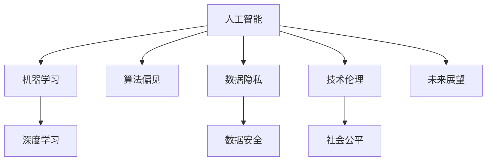

                 

# 人工智能：社会影响与思考

> 关键词：人工智能,社会影响,技术伦理,就业变迁,隐私保护,数据安全,未来展望

## 1. 背景介绍

### 1.1 问题由来
人工智能(AI)作为当今科技革命的重要驱动力，正以其迅猛发展的态势影响着社会的方方面面。从医疗、教育、交通到金融、零售、制造等各行各业，AI技术已经深入到我们的日常生活中，成为推动社会进步的重要力量。然而，AI技术在带来便捷和高效的同时，也引发了一系列深远而复杂的社会问题，对社会伦理、就业、隐私、安全等领域造成了深刻的影响。本文旨在深入探讨AI技术的社会影响，从技术、伦理、经济等多个维度，对AI的发展进行全面而深刻的思考。

### 1.2 问题核心关键点
AI技术的快速发展，给社会带来了多方面的影响。如何平衡技术发展与社会进步，如何在享受AI技术带来的便利的同时，防范其潜在的风险，成为全社会关注的焦点。以下问题将是我们探讨的核心：

1. **技术伦理**：AI技术的开发和应用过程中，如何保障数据隐私，避免算法偏见，确保AI决策的公正性和透明性？
2. **就业变迁**：AI的普及是否会导致大量工作岗位的消失，如何通过再培训和教育，平滑过渡，促进新就业形态的产生？
3. **数据安全**：在AI系统中，如何防止数据泄露和滥用，保护用户隐私和数据安全？
4. **社会公平**：AI技术的不平衡发展，是否会加剧社会不平等，如何通过合理的政策和法规，促进AI技术的公平应用？
5. **未来展望**：AI技术在未来可能带来的革命性变化，如何通过政策引导，最大化其社会价值，减少负面影响？

## 2. 核心概念与联系

### 2.1 核心概念概述

要全面理解AI技术的社会影响，我们需要掌握以下几个核心概念：

1. **人工智能(AI)**：指通过计算机模拟人类智能行为的技术，包括机器学习、自然语言处理、计算机视觉等。
2. **机器学习(ML)**：一种基于数据和算法，使机器能够自动改进的技术，是AI的核心组成部分。
3. **深度学习(Deep Learning)**：一种特殊类型的机器学习，使用多层神经网络进行复杂模式识别和数据表示学习。
4. **算法偏见(Bias)**：指AI算法在数据或设计中存在的对某些群体或特征的不公平或歧视性倾向。
5. **数据隐私(Privacy)**：涉及个人数据信息的保护，防止未经授权的访问、使用和泄露。
6. **数据安全(Security)**：保护数据免受未经授权的访问、修改、删除等威胁，确保数据完整性和可用性。
7. **技术伦理(Ethics)**：涉及AI技术的开发、应用、管理等环节的伦理考量，确保技术决策的公正性和道德性。
8. **社会公平(Social Fairness)**：指在AI技术的开发和应用中，确保不同群体、不同地域、不同背景的人们都能公平受益，避免技术鸿沟。
9. **未来展望(Future Vision)**：基于当前技术发展趋势和政策导向，对AI未来可能带来的变革进行预见和规划。

这些概念之间的联系可以通过以下Mermaid流程图来展示：



这个流程图展示了大语言模型的核心概念及其之间的关系：

1. 人工智能通过机器学习和深度学习实现智能化。
2. 机器学习过程中存在算法偏见，需要通过数据隐私和安全保护等手段进行调整。
3. 技术伦理和社会公平是AI应用过程中必须考虑的关键因素。
4. 未来展望基于当前的技术和社会背景，对AI发展趋势进行预见和规划。

## 3. 核心算法原理 & 具体操作步骤
### 3.1 算法原理概述

AI技术的社会影响，主要体现在其算法原理和操作步骤上。以下是对这些核心内容的具体分析：

#### 3.1.1 算法原理概述

AI技术的核心算法包括机器学习、深度学习、强化学习等。其中，深度学习因其强大的模式识别和数据表示能力，成为当前AI技术的主流。深度学习算法通过多层次神经网络，自动从数据中学习特征，从而实现对复杂问题的解决。

### 3.2 算法步骤详解

#### 3.2.1 数据准备
1. **数据采集**：收集所需的数据集，包括训练数据、验证数据和测试数据。数据集的选择和预处理是确保模型性能的关键步骤。
2. **数据清洗**：去除噪声数据和异常值，确保数据的质量和完整性。
3. **数据标注**：为训练数据添加标签，以便模型进行监督学习。标注数据的质量和一致性直接影响模型的准确性和泛化能力。

#### 3.2.2 模型训练
1. **模型选择**：根据任务特点选择合适的模型结构，如卷积神经网络(CNN)、循环神经网络(RNN)、Transformer等。
2. **超参数设置**：如学习率、批量大小、迭代次数等，这些参数直接影响模型的训练效率和性能。
3. **模型训练**：通过反向传播算法，不断调整模型参数，最小化损失函数，使模型在训练数据上达到最优。

#### 3.2.3 模型评估与优化
1. **模型评估**：在验证集上评估模型性能，如准确率、召回率、F1分数等。
2. **模型优化**：通过调整超参数、改进模型结构等方式，提升模型性能。
3. **模型应用**：将训练好的模型应用于实际场景，进行预测和决策。

### 3.3 算法优缺点

#### 3.3.1 优点
1. **高效性**：AI技术能够处理大量数据，提供高效的决策支持。
2. **准确性**：深度学习算法通过多层次网络，能够自动学习复杂的特征表示，提高模型准确性。
3. **自动化**：AI技术能够自动完成数据处理、模型训练等任务，降低人工成本。

#### 3.3.2 缺点
1. **算法偏见**：深度学习模型在训练过程中可能学习到数据中的偏见，导致输出结果的不公平。
2. **数据依赖**：AI模型的性能高度依赖于训练数据的规模和质量，数据偏差可能影响模型性能。
3. **可解释性差**：深度学习模型通常被视为“黑箱”，其决策过程难以解释，增加了模型使用的复杂性。
4. **安全风险**：AI系统可能遭受恶意攻击，如对抗样本攻击、数据篡改等，影响系统的安全性和可靠性。

### 3.4 算法应用领域

#### 3.4.1 医疗健康
AI在医疗领域的应用包括疾病诊断、医学影像分析、个性化治疗方案推荐等。通过深度学习模型对医疗数据进行分析，提高诊断准确率，缩短治疗时间，提升患者体验。

#### 3.4.2 金融服务
AI在金融领域的应用包括信用评分、风险管理、智能投顾等。通过机器学习模型对金融数据进行分析，预测市场趋势，优化投资组合，提升金融服务效率和客户满意度。

#### 3.4.3 智能制造
AI在智能制造领域的应用包括预测性维护、质量控制、供应链优化等。通过机器学习模型对生产数据进行分析，提高生产效率，降低成本，提升产品质量。

#### 3.4.4 自动驾驶
AI在自动驾驶领域的应用包括感知、决策、控制等。通过深度学习模型对传感器数据进行分析，实现车辆自主驾驶，提高行车安全，减少交通拥堵。

## 4. 数学模型和公式 & 详细讲解 & 举例说明

### 4.1 数学模型构建

AI技术的数学模型通常包括监督学习、无监督学习和强化学习等。以下是对这些模型的详细构建过程：

#### 4.1.1 监督学习
监督学习是一种利用标注数据进行训练的机器学习模型。其数学模型可以表示为：

$$
y = f(x;\theta)
$$

其中 $x$ 表示输入特征，$y$ 表示输出标签，$\theta$ 表示模型参数。常见的监督学习算法包括线性回归、逻辑回归、支持向量机等。

### 4.2 公式推导过程

#### 4.2.1 线性回归
线性回归模型可以表示为：

$$
y = \theta_0 + \sum_{i=1}^{n} \theta_i x_i
$$

其中 $\theta_0$ 为截距，$\theta_i$ 为线性系数，$x_i$ 为输入特征。通过最小二乘法，可以求解最优参数 $\theta$：

$$
\hat{\theta} = \mathop{\arg\min}_{\theta} \sum_{i=1}^{N}(y_i - f(x_i;\theta))^2
$$

通过求解该优化问题，得到模型参数 $\hat{\theta}$，即可用于预测新样本的输出。

### 4.3 案例分析与讲解

#### 4.3.1 贷款风险评估
一个常见的应用案例是贷款风险评估。银行可以通过AI模型，根据客户的信用记录、收入水平、职业等信息，预测其还款能力。通过监督学习算法，构建线性回归模型：

$$
\text{坏账概率} = \hat{\theta}_0 + \sum_{i=1}^{n} \hat{\theta}_i \text{特征值}_i
$$

其中 $\text{坏账概率}$ 表示客户还款风险的概率，$\text{特征值}_i$ 表示客户的第 $i$ 个特征值，$\hat{\theta}_i$ 表示第 $i$ 个线性系数。

通过在历史数据集上进行训练，可以得到最优参数 $\hat{\theta}$，然后用于预测新客户是否有违约风险。这种应用场景中，模型的可解释性和公平性尤为重要，确保模型能够公正地对待不同背景的客户，避免算法偏见。

## 5. 项目实践：代码实例和详细解释说明

### 5.1 开发环境搭建

在进行AI项目实践前，我们需要准备好开发环境。以下是使用Python进行TensorFlow开发的环境配置流程：

1. 安装Anaconda：从官网下载并安装Anaconda，用于创建独立的Python环境。

2. 创建并激活虚拟环境：
```bash
conda create -n tf-env python=3.8 
conda activate tf-env
```

3. 安装TensorFlow：根据CUDA版本，从官网获取对应的安装命令。例如：
```bash
conda install tensorflow -c conda-forge -c pytorch
```

4. 安装各类工具包：
```bash
pip install numpy pandas scikit-learn matplotlib tqdm jupyter notebook ipython
```

完成上述步骤后，即可在`tf-env`环境中开始AI实践。

### 5.2 源代码详细实现

下面我们以贷款风险评估为例，给出使用TensorFlow进行AI项目开发的PyTorch代码实现。

首先，定义贷款数据集和标签：

```python
import pandas as pd
import numpy as np

# 定义贷款数据集
data = pd.read_csv('loan_data.csv')

# 定义标签
labels = data['default'].values
data = data.drop('default', axis=1)

# 数据归一化
data = (data - data.mean()) / data.std()

# 数据划分
train_data = data.iloc[:8000]
train_labels = labels[:8000]
dev_data = data.iloc[8000:]
dev_labels = labels[8000:]
test_data = data.iloc[16000:]
test_labels = labels[16000:]
```

然后，定义模型和优化器：

```python
from tensorflow.keras.models import Sequential
from tensorflow.keras.layers import Dense
from tensorflow.keras.optimizers import Adam

# 定义模型结构
model = Sequential([
    Dense(64, activation='relu', input_shape=(8,)),
    Dense(1, activation='sigmoid')
])

# 定义优化器
optimizer = Adam(learning_rate=0.001)
```

接着，定义训练和评估函数：

```python
from tensorflow.keras.callbacks import EarlyStopping

# 定义训练函数
def train_model(model, train_data, train_labels, dev_data, dev_labels, batch_size=32, epochs=50):
    model.compile(optimizer=optimizer, loss='binary_crossentropy', metrics=['accuracy'])
    early_stopping = EarlyStopping(monitor='val_loss', patience=5, restore_best_weights=True)
    history = model.fit(train_data, train_labels, batch_size=batch_size, epochs=epochs, 
                       validation_data=(dev_data, dev_labels), callbacks=[early_stopping])
    return history

# 定义评估函数
def evaluate_model(model, test_data, test_labels):
    loss, accuracy = model.evaluate(test_data, test_labels)
    print(f'Test loss: {loss:.4f}, Test accuracy: {accuracy:.4f}')
```

最后，启动训练流程并在测试集上评估：

```python
# 训练模型
history = train_model(model, train_data, train_labels, dev_data, dev_labels)

# 在测试集上评估模型
evaluate_model(model, test_data, test_labels)
```

以上就是使用TensorFlow进行贷款风险评估的完整代码实现。可以看到，得益于TensorFlow的强大封装，我们可以用相对简洁的代码完成模型的构建和训练。

### 5.3 代码解读与分析

让我们再详细解读一下关键代码的实现细节：

**贷款数据集定义**：
- 通过pandas库读取贷款数据集，提取标签和特征。
- 对数据进行归一化处理，确保不同特征在同一量级上。
- 将数据集划分为训练集、验证集和测试集，以便模型训练和评估。

**模型定义**：
- 使用Sequential模型，定义一个包含两个全连接层的神经网络。
- 第一个层使用ReLU激活函数，第二个层使用Sigmoid激活函数，输出二分类结果。

**优化器定义**：
- 定义Adam优化器，学习率为0.001。

**训练和评估函数**：
- 使用EarlyStopping回调函数，防止模型过拟合。
- 在训练过程中，监控验证集的损失，并在验证集损失不再下降时停止训练。

**训练和评估流程**：
- 在训练集上训练模型，验证集上进行早期停止。
- 在测试集上评估模型性能，输出测试集上的损失和准确率。

通过代码实现，我们能够直观地理解AI技术在贷款风险评估中的应用。这种代码实现不仅帮助开发者进行快速原型开发，还能够为学术研究提供可复现的实验基础。

当然，工业级的系统实现还需考虑更多因素，如模型的保存和部署、超参数的自动搜索、更灵活的任务适配层等。但核心的AI项目开发流程基本与此类似。

## 6. 实际应用场景

### 6.1 医疗健康

AI在医疗健康领域的应用场景包括疾病诊断、医学影像分析、个性化治疗方案推荐等。通过深度学习模型对医疗数据进行分析，提高诊断准确率，缩短治疗时间，提升患者体验。

#### 6.1.1 疾病诊断
AI可以通过图像识别技术，对X光片、CT片等医学影像进行自动分析和诊断。例如，通过卷积神经网络(CNN)对肺部CT影像进行自动检测，识别出早期肺癌。这种应用场景中，模型的可解释性和公平性尤为重要，确保模型能够公正地对待不同背景的患者，避免算法偏见。

#### 6.1.2 医学影像分析
AI可以通过深度学习模型，对医学影像进行自动分析和标注。例如，通过卷积神经网络对乳腺X光片进行自动分析，识别出乳腺癌区域。这种应用场景中，模型的可解释性和鲁棒性尤为重要，确保模型能够在不同的医学影像中稳定输出，避免误诊。

#### 6.1.3 个性化治疗方案推荐
AI可以通过分析患者的基因数据和病史信息，推荐个性化的治疗方案。例如，通过深度学习模型对基因组数据进行分析，预测患者的疾病风险和治疗效果。这种应用场景中，模型的公平性和安全性尤为重要，确保治疗方案的公正性和有效性。

### 6.2 金融服务

AI在金融服务领域的应用场景包括信用评分、风险管理、智能投顾等。通过机器学习模型对金融数据进行分析，预测市场趋势，优化投资组合，提升金融服务效率和客户满意度。

#### 6.2.1 信用评分
AI可以通过机器学习模型，对客户的信用记录、收入水平、职业等信息进行综合评估，预测其还款能力。例如，通过逻辑回归模型对客户的信用数据进行分析，预测其违约风险。这种应用场景中，模型的可解释性和公平性尤为重要，确保模型能够公正地对待不同背景的客户，避免算法偏见。

#### 6.2.2 风险管理
AI可以通过深度学习模型，对客户的交易行为进行风险评估，防止欺诈和洗钱等违法行为。例如，通过卷积神经网络对客户的交易数据进行分析，检测出异常行为。这种应用场景中，模型的鲁棒性和安全性尤为重要，确保模型能够在不同的交易数据中稳定输出，避免误判。

#### 6.2.3 智能投顾
AI可以通过机器学习模型，为客户提供个性化的投资建议。例如，通过深度学习模型对市场数据进行分析，预测股票价格和投资趋势，推荐投资组合。这种应用场景中，模型的可解释性和安全性尤为重要，确保投资建议的公正性和有效性。

### 6.3 智能制造

AI在智能制造领域的应用场景包括预测性维护、质量控制、供应链优化等。通过机器学习模型对生产数据进行分析，提高生产效率，降低成本，提升产品质量。

#### 6.3.1 预测性维护
AI可以通过深度学习模型，对设备的运行数据进行分析，预测设备故障，进行预防性维护。例如，通过卷积神经网络对设备的传感器数据进行分析，预测设备的故障时间。这种应用场景中，模型的可解释性和鲁棒性尤为重要，确保模型能够在不同的设备数据中稳定输出，避免误判。

#### 6.3.2 质量控制
AI可以通过深度学习模型，对生产过程进行实时监控，识别出质量问题，及时调整生产参数。例如，通过卷积神经网络对生产过程中的视频数据进行分析，检测出产品的缺陷。这种应用场景中，模型的可解释性和鲁棒性尤为重要，确保模型能够在不同的生产数据中稳定输出，避免误判。

#### 6.3.3 供应链优化
AI可以通过机器学习模型，对供应链数据进行分析，优化库存管理、物流调度等环节。例如，通过线性回归模型对供应链数据进行分析，预测库存需求，优化物流调度。这种应用场景中，模型的可解释性和公平性尤为重要，确保供应链管理的公正性和有效性。

### 6.4 自动驾驶

AI在自动驾驶领域的应用场景包括感知、决策、控制等。通过深度学习模型对传感器数据进行分析，实现车辆自主驾驶，提高行车安全，减少交通拥堵。

#### 6.4.1 感知
AI可以通过深度学习模型，对车辆传感器数据进行分析，识别出道路、行人、车辆等环境要素。例如，通过卷积神经网络对车辆摄像头拍摄的图像进行分析，识别出道路上的交通标志和信号灯。这种应用场景中，模型的可解释性和鲁棒性尤为重要，确保模型能够在不同的环境数据中稳定输出，避免误判。

#### 6.4.2 决策
AI可以通过深度学习模型，对车辆周围环境进行分析，做出最优驾驶决策。例如，通过卷积神经网络对车辆传感器数据进行分析，预测道路情况和行人行为，生成最优驾驶路径。这种应用场景中，模型的可解释性和鲁棒性尤为重要，确保决策过程的公正性和安全性。

#### 6.4.3 控制
AI可以通过深度学习模型，对车辆进行实时控制，确保安全行驶。例如，通过卷积神经网络对车辆传感器数据进行分析，控制车辆的加速度和转向。这种应用场景中，模型的可解释性和鲁棒性尤为重要，确保控制过程的公正性和安全性。

## 7. 工具和资源推荐

### 7.1 学习资源推荐

为了帮助开发者系统掌握AI技术的社会影响，这里推荐一些优质的学习资源：

1. 《人工智能伦理与社会影响》系列博文：由大模型技术专家撰写，深入浅出地介绍了AI技术对社会的影响，包括隐私、公平、伦理等方面。

2. 《机器学习实战》系列书籍：清华大学出版社出版的经典教材，系统介绍了机器学习的基本概念、算法和应用。

3. 《深度学习》课程：斯坦福大学开设的深度学习课程，提供丰富的视频讲座和配套作业，适合初学者学习。

4. AI Challenger比赛：每年举办一次，涵盖多个AI应用领域，参赛者可以通过比赛学习AI技术的实际应用和优化方法。

5. Kaggle平台：提供大量公开数据集和比赛，开发者可以通过比赛提升AI技术水平，学习行业前沿知识。

通过对这些资源的学习实践，相信你一定能够全面掌握AI技术的社会影响，并用于解决实际应用中的问题。

### 7.2 开发工具推荐

高效的开发离不开优秀的工具支持。以下是几款用于AI开发的工具：

1. PyTorch：基于Python的开源深度学习框架，灵活动态的计算图，适合快速迭代研究。

2. TensorFlow：由Google主导开发的开源深度学习框架，生产部署方便，适合大规模工程应用。

3. Jupyter Notebook：一种交互式的笔记本环境，方便进行代码调试和可视化展示。

4. TensorBoard：TensorFlow配套的可视化工具，可实时监测模型训练状态，并提供丰富的图表呈现方式。

5. Weights & Biases：模型训练的实验跟踪工具，可以记录和可视化模型训练过程中的各项指标，方便对比和调优。

6. Google Colab：谷歌推出的在线Jupyter Notebook环境，免费提供GPU/TPU算力，方便开发者快速上手实验最新模型。

合理利用这些工具，可以显著提升AI项目的开发效率，加快创新迭代的步伐。

### 7.3 相关论文推荐

AI技术的社会影响领域的研究发展迅速，以下是几篇奠基性的相关论文，推荐阅读：

1. 《人工智能伦理问题探讨》：探讨AI技术在医疗、金融、教育等领域的伦理问题，提出相应的解决方案。

2. 《深度学习在金融领域的应用》：介绍深度学习在信用评分、风险管理、智能投顾等方面的应用案例。

3. 《智能制造中的AI应用》：介绍AI在预测性维护、质量控制、供应链优化等方面的应用案例。

4. 《自动驾驶中的AI技术》：介绍深度学习在自动驾驶感知、决策、控制等方面的应用案例。

这些论文代表了大语言模型微调技术的发展脉络。通过学习这些前沿成果，可以帮助研究者把握学科前进方向，激发更多的创新灵感。

## 8. 总结：未来发展趋势与挑战

### 8.1 总结

本文对AI技术的社会影响进行了全面系统的探讨。首先，我们分析了AI技术的伦理、就业、隐私、安全等多个方面的社会影响，明确了当前社会对AI技术的关注焦点。其次，从技术、伦理、经济等多个维度，深入讲解了AI技术的社会影响，探讨了AI技术对社会进步的双刃剑效应。

通过本文的系统梳理，可以看到，AI技术在带来便捷和高效的同时，也引发了一系列复杂的社会问题，对社会伦理、就业、隐私、安全等领域造成了深刻的影响。未来，伴随AI技术的进一步发展，社会影响也将更加复杂多样，需要我们共同面对和解决。

### 8.2 未来发展趋势

展望未来，AI技术的社会影响将继续深化和发展，呈现以下几个趋势：

1. **伦理和公平性**：未来，AI技术的伦理和公平性将受到更多的关注。确保AI技术决策的公正性、透明性和可解释性，将成为技术发展的重要方向。

2. **隐私保护**：随着数据隐私保护法规的逐步完善，AI技术将更加注重数据隐私和安全保护，防止数据泄露和滥用。

3. **人机协作**：未来，AI技术将更多地与人类进行协作，提升人类工作效率和生活质量。人机协作将成为AI技术的重要应用方向。

4. **跨领域应用**：AI技术将跨越传统的学科边界，与自然语言处理、计算机视觉、生物信息学等领域深度融合，推动科技革命。

5. **可持续性**：未来，AI技术将更加注重可持续发展，降低资源消耗，减少环境污染，提升社会福祉。

6. **全球治理**：随着AI技术的全球普及，国际社会将更加注重AI技术的全球治理，制定全球统一的技术标准和规范。

### 8.3 面临的挑战

尽管AI技术在社会各个领域的应用前景广阔，但在发展过程中也面临诸多挑战：

1. **伦理和公平性**：确保AI技术的公正性和透明性，避免算法偏见，仍将是技术发展的重要难题。

2. **数据隐私和安全**：随着数据隐私保护法规的逐步完善，如何在使用数据的同时保护隐私，将是AI技术面临的重要挑战。

3. **技术鸿沟**：AI技术的普及和应用仍存在较大差距，如何通过政策引导和教育普及，缩小技术鸿沟，提升全社会的AI素养，将是未来的重要任务。

4. **社会适应**：AI技术在带来便利的同时，也对社会结构和就业形态造成冲击，如何通过再培训和教育，平滑过渡，促进新就业形态的产生，将是未来的重要课题。

5. **全球治理**：随着AI技术的全球普及，如何通过国际合作，制定全球统一的技术标准和规范，避免技术滥用，将是全球治理的重要任务。

### 8.4 研究展望

面对AI技术面临的挑战，未来的研究需要在以下几个方面寻求新的突破：

1. **伦理和公平性**：研究如何构建公正透明的AI模型，减少算法偏见，确保AI技术的公平性和可解释性。

2. **隐私保护**：研究如何在保护数据隐私的同时，利用数据进行高效建模，防止数据泄露和滥用。

3. **人机协作**：研究如何构建人机协作的智能系统，提升人类工作效率和生活质量，构建和谐的人机关系。

4. **跨领域应用**：研究如何通过跨学科合作，推动AI技术在各个领域的深度应用，推动科技革命。

5. **可持续性**：研究如何通过AI技术，实现资源的高效利用和环境的可持续发展，提升社会福祉。

6. **全球治理**：研究如何通过国际合作，制定全球统一的技术标准和规范，推动AI技术的健康发展，避免技术滥用。

这些研究方向的探索，必将引领AI技术迈向更高的台阶，为构建安全、可靠、可解释、可控的智能系统铺平道路。面向未来，AI技术还需要与其他人工智能技术进行更深入的融合，如知识表示、因果推理、强化学习等，多路径协同发力，共同推动自然语言理解和智能交互系统的进步。只有勇于创新、敢于突破，才能不断拓展AI技术的边界，让智能技术更好地造福人类社会。

## 9. 附录：常见问题与解答

**Q1：AI技术在医疗健康领域的应用前景如何？**

A: AI技术在医疗健康领域具有广泛的应用前景，尤其是在疾病诊断、医学影像分析和个性化治疗方案推荐等方面。通过深度学习模型对医疗数据进行分析，可以提高诊断准确率，缩短治疗时间，提升患者体验。然而，模型的公平性和可解释性尤为重要，确保模型能够公正地对待不同背景的患者，避免算法偏见。

**Q2：AI技术在金融服务领域的应用有哪些？**

A: AI技术在金融服务领域的应用包括信用评分、风险管理、智能投顾等。通过机器学习模型对金融数据进行分析，预测市场趋势，优化投资组合，提升金融服务效率和客户满意度。然而，模型的公平性和安全性尤为重要，确保模型能够在不同的客户数据中稳定输出，避免误判。

**Q3：AI技术在智能制造领域的应用有哪些？**

A: AI技术在智能制造领域的应用包括预测性维护、质量控制、供应链优化等。通过机器学习模型对生产数据进行分析，提高生产效率，降低成本，提升产品质量。然而，模型的可解释性和鲁棒性尤为重要，确保模型能够在不同的生产数据中稳定输出，避免误判。

**Q4：AI技术在自动驾驶领域的应用有哪些？**

A: AI技术在自动驾驶领域的应用包括感知、决策、控制等。通过深度学习模型对传感器数据进行分析，实现车辆自主驾驶，提高行车安全，减少交通拥堵。然而，模型的可解释性和鲁棒性尤为重要，确保模型能够在不同的环境数据中稳定输出，避免误判。

通过这些问题的解答，可以看到AI技术在医疗健康、金融服务、智能制造、自动驾驶等多个领域的广泛应用，同时也指出了模型公平性、可解释性和鲁棒性在实际应用中的重要性。这些问题的深入探讨，将有助于我们更好地理解AI技术的社会影响，并指导未来的研究方向。

---

作者：禅与计算机程序设计艺术 / Zen and the Art of Computer Programming

