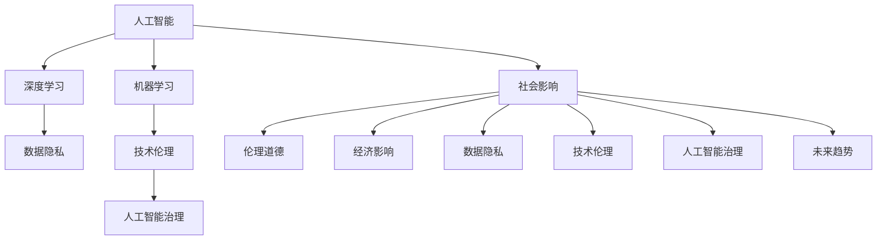

                 

# 人工智能：社会影响与思考

> 关键词：人工智能,社会影响,技术伦理,经济影响,就业变化,数据隐私,人工智能治理,未来趋势

## 1. 背景介绍

### 1.1 问题由来
随着人工智能技术的飞速发展，它在各个领域的应用越来越广泛，从医疗、教育、金融，到制造业、农业、服务业等，人工智能已经成为推动社会进步和经济发展的重要力量。然而，在享受人工智能带来的便利和效率的同时，我们也面临着一系列严峻的社会挑战，这些挑战涉及伦理道德、经济安全、隐私保护等多个方面。因此，理解和思考人工智能的社会影响，对于合理引导和规范人工智能发展至关重要。

### 1.2 问题核心关键点
人工智能的社会影响是多方面的，以下是几个核心关键点：

1. **伦理道德问题**：人工智能决策的透明性和可解释性不足，可能会引发道德和伦理问题，如算法偏见、隐私侵犯等。
2. **经济影响**：人工智能自动化替代人类工作，导致部分行业就业岗位减少，经济结构发生变化。
3. **数据隐私**：人工智能系统通常依赖大量个人数据进行训练和优化，如何保护用户隐私成为重要问题。
4. **技术治理**：缺乏有效的监管机制，可能导致人工智能系统滥用，引发社会风险。
5. **未来趋势**：人工智能技术在不断进步，其未来走向和潜在风险需要持续关注。

### 1.3 问题研究意义
研究人工智能的社会影响，对于指导其健康发展、促进社会公平与正义、保障国家安全具有重要意义。

- **指导发展方向**：通过分析人工智能的潜在风险和挑战，提出合理的政策建议，帮助人工智能技术在健康轨道上发展。
- **促进社会公平**：了解人工智能对不同群体的影响，提出针对性的政策措施，缩小数字鸿沟，促进社会公平。
- **保障国家安全**：识别并防范人工智能技术可能带来的安全威胁，确保国家安全和社会稳定。
- **探索未来趋势**：预见人工智能未来的发展方向，未雨绸缪，做好准备应对可能的挑战。

## 2. 核心概念与联系

### 2.1 核心概念概述

为更好地理解人工智能的社会影响，本节将介绍几个关键概念及其相互联系：

- **人工智能(AI)**：指通过算法、数据和计算能力实现智能任务的系统，可以执行诸如语音识别、图像处理、自然语言处理等任务。
- **机器学习(ML)**：指让计算机通过学习数据，不断优化算法，从而实现对复杂问题的自动推断和决策。
- **深度学习(DL)**：机器学习的一种高级形式，通过多层次神经网络模型，处理高维数据，提取复杂特征。
- **数据隐私**：指保护个人数据不被未经授权访问、使用或泄露的权利。
- **技术伦理**：涉及人工智能系统在设计和应用中应遵循的道德和伦理原则。
- **人工智能治理**：指对人工智能技术进行规范和管理，确保其发展方向符合社会利益。

这些概念之间的逻辑关系可以通过以下Mermaid流程图来展示：



这个流程图展示了人工智能的核心概念及其对社会的广泛影响。

## 3. 核心算法原理 & 具体操作步骤

### 3.1 算法原理概述

人工智能的社会影响涉及多个方面，包括伦理道德、经济影响、数据隐私、技术治理等。其核心算法原理和操作步骤如下：

1. **伦理道德**：使用伦理评估算法，如公平性检测、透明性分析等，对人工智能系统的决策过程进行评估，确保其符合伦理标准。
2. **经济影响**：通过经济模型，如劳动力市场分析、企业竞争力模型等，评估人工智能对就业、收入分配等经济因素的影响。
3. **数据隐私**：使用数据匿名化、加密技术等，保护用户隐私，防止数据泄露和滥用。
4. **技术治理**：建立和完善法规、标准、指南等，规范人工智能系统的开发和应用，防止滥用。
5. **未来趋势**：基于数据分析和预测模型，识别人工智能技术的发展趋势和潜在风险。

### 3.2 算法步骤详解

以下是人工智能社会影响评估的详细操作步骤：

1. **数据收集与预处理**：收集与人工智能应用相关的数据，包括用户行为数据、就业市场数据、伦理规范等。预处理数据，去除噪音和异常值，确保数据的准确性和完整性。
2. **模型选择与构建**：选择适当的模型，如因果推理模型、经济模型、数据隐私保护模型等，构建评估框架。
3. **模型训练与评估**：使用收集的数据对模型进行训练，评估模型的性能，确保其符合预期的社会影响指标。
4. **结果分析与解读**：对模型输出结果进行解读，提出针对性的政策建议，指导人工智能技术的健康发展。
5. **反馈与迭代**：根据实际应用情况和新的数据，不断调整和优化模型，确保其持续有效。

### 3.3 算法优缺点

人工智能社会影响评估的优势和劣势如下：

**优点**：
1. **系统性**：通过建立模型，可以全面、系统地分析人工智能的社会影响，避免单一视角带来的偏见。
2. **数据驱动**：基于大量数据进行建模和分析，提高决策的科学性和客观性。
3. **指导性强**：模型输出可以直接指导政策制定和技术优化，提高社会治理效率。

**缺点**：
1. **数据质量依赖**：模型效果高度依赖数据质量，低质量数据可能导致误判。
2. **模型复杂性**：构建和优化模型需要较强的专业知识和计算资源。
3. **动态变化**：社会环境和技术发展不断变化，模型需要定期更新和维护。

### 3.4 算法应用领域

人工智能社会影响评估可以应用于多个领域，包括但不限于：

- **医疗健康**：评估人工智能在医疗诊断、药物研发等领域的伦理和隐私问题。
- **金融保险**：分析人工智能在信用评分、风险管理等金融应用中的伦理和经济影响。
- **教育培训**：研究人工智能在个性化教育、考试评阅等教育场景中的伦理和隐私问题。
- **公共安全**：评估人工智能在安防监控、应急响应等公共安全应用中的技术治理和伦理问题。
- **交通出行**：分析人工智能在自动驾驶、智能交通管理等场景中的社会影响。

## 4. 数学模型和公式 & 详细讲解 & 举例说明

### 4.1 数学模型构建

人工智能社会影响评估涉及多个方面的数学模型，以下是一些常见的模型和公式：

1. **公平性检测**：使用统计学方法，如ANOVA、卡方检验等，检测模型在不同群体中的表现差异。
2. **透明性分析**：使用信息熵、互信息等指标，评估模型决策的透明性和可解释性。
3. **经济影响模型**：使用宏观经济学模型，如投入产出表、劳动市场模型等，评估人工智能对就业、收入等经济指标的影响。
4. **数据隐私保护**：使用数据匿名化技术，如差分隐私、k-匿名化等，保护用户隐私。
5. **技术治理模型**：使用规范评估模型，如伦理矩阵、合规性检查等，评估人工智能系统的治理合规性。

### 4.2 公式推导过程

以公平性检测为例，使用ANOVA方法进行模型公平性分析。假设模型输出为Y，特征向量为X，公平性指标为F，则ANOVA模型为：

$$
F = \frac{\sum_i (y_i - \bar{y})^2 / N}{\sum_i (x_i - \bar{x})^2 / (N-k)}
$$

其中，$i$ 表示样本，$y_i$ 表示第$i$个样本的模型输出，$\bar{y}$ 表示样本均值，$x_i$ 表示第$i$个样本的特征向量，$\bar{x}$ 表示特征向量均值，$N$ 表示样本数量，$k$ 表示特征维度。

### 4.3 案例分析与讲解

以下是一个简单的案例分析：

**场景**：一个医院使用人工智能系统进行疾病诊断，模型输出为诊断结果（如癌症、良性肿瘤等），输入特征为患者的年龄、性别、病史等。使用ANOVA方法检测模型在不同性别（男、女）中的表现差异。

**步骤**：
1. 收集样本数据，标记诊断结果和患者性别。
2. 使用ANOVA模型，检测不同性别下的模型输出均值差异。
3. 根据检测结果，提出改进模型建议，如增加性别特征权重，提高模型公平性。

## 5. 项目实践：代码实例和详细解释说明

### 5.1 开发环境搭建

在进行人工智能社会影响评估的开发前，我们需要准备好开发环境。以下是Python和R语言的开发环境配置步骤：

**Python**：
1. 安装Anaconda或Miniconda，创建虚拟环境。
2. 安装Python和相关依赖库，如pandas、numpy、scikit-learn等。
3. 安装Jupyter Notebook，用于编写和运行代码。

**R**：
1. 安装R语言，下载RStudio或R Tools for Visual Studio等IDE。
2. 安装R语言包，如dplyr、tidyverse、caret等。
3. 安装RMarkdown或R Notebooks等工具，用于编写和运行代码。

### 5.2 源代码详细实现

以下是一个简单的R语言代码示例，用于评估一个医疗诊断模型的公平性：

```R
library(tidyverse)
library(caret)

# 加载数据
data <- read.csv("diagnosis_data.csv")

# 分割数据集
train_index <- createDataPartition(data$label, p=0.7, list=FALSE)
train <- subset(data, train_index)
test <- subset(data, -train_index)

# 训练模型
model <- train(label ~ age + gender + medical_history, data=train, method="glm")

# 评估模型公平性
p1 <- table(model$predict(model, train, type="response") ~ train$gender)
p2 <- table(model$predict(model, test, type="response") ~ test$gender)
fairness <- (p1[1,1] - p2[1,1]) / sqrt(p1[1,1] * p2[1,1])
print(fairness)
```

**代码解释**：
1. 加载数据和分割数据集，分别用于训练和测试。
2. 使用GLM模型训练诊断模型，评估模型输出结果。
3. 计算模型在训练集和测试集中，不同性别下的公平性指标。

### 5.3 代码解读与分析

上述代码实现了基本的公平性检测功能，以下是代码的详细解读和分析：

- **数据加载**：使用`read.csv`函数，从本地文件加载数据集。
- **数据分割**：使用`createDataPartition`函数，根据标签对数据集进行分割，生成训练集和测试集。
- **模型训练**：使用`train`函数，训练一个GLM模型，预测诊断结果。
- **公平性评估**：计算模型在不同性别下的公平性指标，使用ANOVA方法进行统计分析。

## 6. 实际应用场景

### 6.1 医疗健康

人工智能在医疗健康领域的应用日益广泛，但也带来了伦理和隐私问题。以下是一个具体的案例：

**场景**：一个医院使用人工智能系统进行癌症诊断，系统输出为是否患有癌症。系统基于大量历史数据进行训练，但可能会对不同性别的诊断结果产生偏差。

**应用**：
- **公平性检测**：使用ANOVA方法，检测不同性别下的诊断结果差异。
- **透明性分析**：使用信息熵，评估模型决策的透明性和可解释性。
- **隐私保护**：使用差分隐私技术，保护患者隐私。

### 6.2 金融保险

金融行业是人工智能的重要应用场景之一，但也存在伦理和经济问题。以下是一个具体案例：

**场景**：一个保险公司使用人工智能系统进行信用评分，系统输出为信用等级。系统基于大量历史数据进行训练，但可能会对不同收入群体的评分结果产生偏差。

**应用**：
- **公平性检测**：使用卡方检验，检测不同收入群体下的评分结果差异。
- **透明性分析**：使用互信息，评估模型决策的透明性和可解释性。
- **经济影响**：使用经济模型，评估人工智能对就业、收入分配等经济指标的影响。

### 6.3 教育培训

教育行业也逐渐引入人工智能技术，但面临伦理和隐私问题。以下是一个具体案例：

**场景**：一个在线教育平台使用人工智能系统进行个性化推荐，系统输出为用户推荐课程。系统基于大量用户历史数据进行训练，但可能会对不同年龄群体的推荐结果产生偏差。

**应用**：
- **公平性检测**：使用ANOVA方法，检测不同年龄群体的推荐结果差异。
- **透明性分析**：使用信息熵，评估模型决策的透明性和可解释性。
- **隐私保护**：使用数据匿名化技术，保护用户隐私。

## 7. 工具和资源推荐

### 7.1 学习资源推荐

以下是一些推荐的学习资源，帮助深入理解人工智能的社会影响：

1. **《人工智能伦理与治理》**：详细介绍人工智能的伦理和治理问题，提供实用的政策建议。
2. **《数据隐私保护原理与实践》**：讲解数据隐私保护的基本原理和实践方法，提供丰富的案例分析。
3. **《人工智能社会影响评估》**：分析人工智能在多个领域的应用，提供系统的社会影响评估框架。
4. **《人工智能治理法规》**：解读人工智能领域的法律法规，提供实际的治理指南。

### 7.2 开发工具推荐

以下是一些推荐的人工智能社会影响评估开发工具：

1. **Python**：Python是最流行的编程语言之一，具有丰富的数据科学和机器学习库，如pandas、numpy、scikit-learn等。
2. **R**：R语言是专门用于统计分析和数据科学的数据科学工具，具有强大的数据处理和可视化能力。
3. **Jupyter Notebook**：Jupyter Notebook是一个开源的Web应用程序，支持Python和R等多种编程语言，便于编写和分享代码。
4. **RStudio**：RStudio是R语言的一个集成开发环境，提供丰富的功能和工具，方便数据科学工作。

### 7.3 相关论文推荐

以下是一些推荐的人工智能社会影响评估的论文：

1. **《人工智能伦理：挑战与展望》**：探讨人工智能伦理的基本问题，提出未来的发展方向。
2. **《人工智能对就业影响研究》**：分析人工智能对就业市场的广泛影响，提出相应的政策建议。
3. **《数据隐私保护技术综述》**：总结数据隐私保护的主要技术和方法，提供实际应用的建议。
4. **《人工智能治理框架》**：构建人工智能治理的规范和标准，提供实证研究的支持。

## 8. 总结：未来发展趋势与挑战

### 8.1 总结

本文系统介绍了人工智能的社会影响，通过核心概念和算法原理的详细讲解，结合实际应用场景的探讨，提出了一系列政策建议和未来发展的方向。

通过本文的系统梳理，可以看到，人工智能技术在带来巨大便利的同时，也伴随着诸多社会挑战，如伦理道德、数据隐私、经济影响等。这些挑战需要通过系统化的研究和政策制定，进行科学管理和有效应对。未来，随着人工智能技术的进一步发展，如何合理引导其健康发展，将是全社会共同面临的重大课题。

### 8.2 未来发展趋势

展望未来，人工智能社会影响评估将呈现以下几个发展趋势：

1. **多领域应用**：人工智能将在更多领域得到广泛应用，如医疗、教育、金融等，需要针对不同领域的特点，进行精细化评估。
2. **智能化治理**：建立智能化的人工智能治理体系，利用大数据和人工智能技术，提高治理效率和效果。
3. **动态评估机制**：引入动态评估机制，定期更新和优化模型，适应社会和技术的变化。
4. **公众参与**：引入公众参与机制，增强社会对人工智能技术的理解和监督。
5. **国际合作**：加强国际合作，制定全球统一的人工智能伦理和治理标准。

这些趋势凸显了人工智能社会影响评估的重要性和紧迫性，需要在政策制定、技术开发、公众教育等多方面共同努力，才能实现人工智能的健康发展和广泛应用。

### 8.3 面临的挑战

尽管人工智能社会影响评估研究取得了一定进展，但在面临诸多挑战的同时，仍需不断努力：

1. **数据质量问题**：人工智能模型的训练和评估高度依赖数据，低质量数据可能导致误判和误导。
2. **模型复杂性**：构建和优化模型需要较强的专业知识和计算资源，技术门槛较高。
3. **伦理道德问题**：人工智能系统可能带来伦理和道德问题，如算法偏见、隐私侵犯等，需要建立严格的规范和标准。
4. **社会接受度**：人工智能技术的推广和应用需要得到社会的广泛认同和支持，才能顺利实施。
5. **法规政策问题**：缺乏统一的法规和政策，可能引发技术滥用和法律纠纷。

这些挑战需要通过多方面的努力，才能逐步克服，确保人工智能技术的健康发展和社会效益最大化。

### 8.4 研究展望

未来的研究需要在以下几个方面寻求新的突破：

1. **跨学科研究**：结合伦理学、社会学、法律学等多学科知识，全面评估人工智能的社会影响。
2. **数据隐私保护**：引入最新的数据隐私保护技术，提高数据的匿名化和安全保护。
3. **模型优化**：开发更高效、更精确的评估模型，降低技术门槛和应用成本。
4. **公众教育**：加强公众对人工智能技术的了解和认知，提高社会对人工智能的接受度和信任度。
5. **国际合作**：推动国际合作，制定统一的人工智能伦理和治理标准，促进全球人工智能技术的发展。

这些研究方向的探索，必将引领人工智能社会影响评估技术迈向更高的台阶，为人工智能技术的健康发展和广泛应用提供坚实的理论基础和实践指导。

## 9. 附录：常见问题与解答

**Q1：如何评估人工智能系统的公平性？**

A: 可以使用统计学方法，如ANOVA、卡方检验等，检测模型在不同群体中的表现差异。同时，可以引入信息熵等指标，评估模型的透明性和可解释性。

**Q2：如何保护数据隐私？**

A: 可以使用数据匿名化技术，如差分隐私、k-匿名化等，保护用户隐私。同时，建立数据访问权限控制机制，防止数据泄露和滥用。

**Q3：如何建立人工智能治理框架？**

A: 可以制定伦理规范和标准，建立人工智能治理委员会，对人工智能技术的开发和应用进行监管。同时，引入公众参与机制，增强社会对人工智能的监督。

**Q4：如何应对人工智能技术的社会影响？**

A: 需要通过系统的社会影响评估，提出针对性的政策建议，指导人工智能技术的健康发展。同时，加强公众教育和宣传，提高社会对人工智能技术的理解和接受度。

**Q5：人工智能技术的发展方向是什么？**

A: 未来人工智能技术将更加智能化、普适化，将在更多领域得到广泛应用。同时，将更加注重伦理道德、数据隐私和技术治理，确保人工智能技术的健康发展。

---

作者：禅与计算机程序设计艺术 / Zen and the Art of Computer Programming

