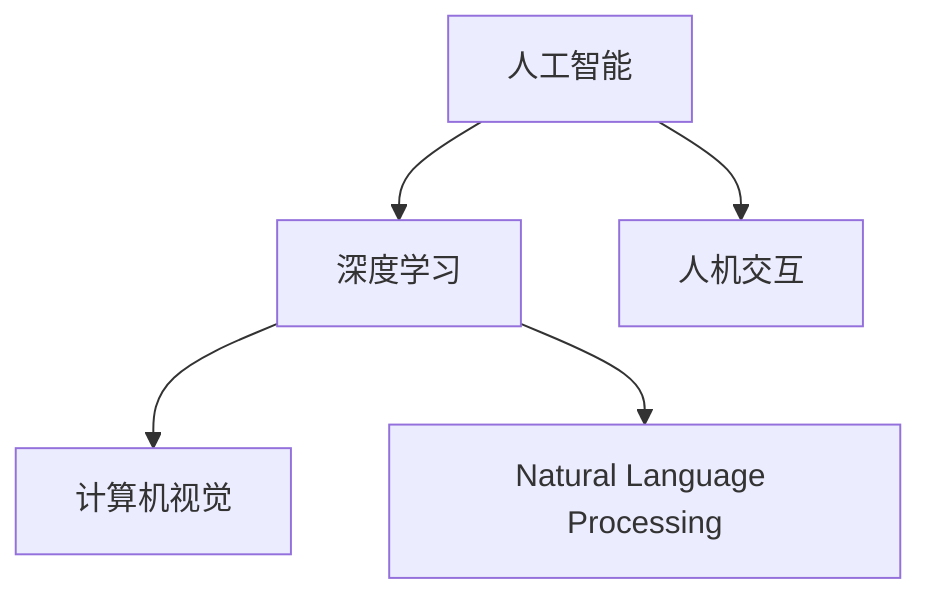

                 

# 人机协作：迈向更智能的未来

> 关键词：人机协作, 智能增强, 人工智能, 深度学习, 计算机视觉, 自然语言处理, 交互式界面, 融合创新

## 1. 背景介绍

随着技术的进步，人工智能(AI)正迅速改变我们的生活方式。从医疗诊断到金融预测，从教育培训到智能家居，人工智能的触角已经延伸到各个领域。然而，尽管AI在诸多任务上取得了显著的进展，但它仍然存在局限性，特别是在处理复杂、多变、具有上下文和社交能力的情境时。

为了克服这些局限，人机协作（Human-Machine Collaboration）的概念应运而生。它指的是在人类的参与下，通过高效的人机互动，共同完成各种任务。这种协作不仅利用了AI的强大计算能力和智能化，还发挥了人类的创造力、判断力和情感智能。本文将深入探讨人机协作的原理、方法、应用场景及未来发展趋势。

## 2. 核心概念与联系

### 2.1 核心概念概述

为了更好地理解人机协作的概念，本节将介绍几个关键概念及其之间的关系：

- **人工智能(AI)**：利用算法和计算能力，模拟、延伸和扩展人类智能的技术。AI涵盖了感知、学习、推理、规划等多个方面，其核心在于数据驱动的决策和自我学习。

- **深度学习(Deep Learning)**：利用多层次神经网络，自动从大量数据中学习特征和模式。深度学习是实现AI的关键技术之一，特别适用于处理复杂、非线性、高维度的数据。

- **计算机视觉(Computer Vision)**：使计算机能够“看”并理解图像和视频，包括对象识别、场景理解、行为分析等。

- **自然语言处理(Natural Language Processing, NLP)**：使计算机能够“听”和“理解”自然语言，包括文本分类、情感分析、机器翻译、语音识别等。

- **人机交互(Human-Computer Interaction, HCI)**：设计交互界面，使人类与计算机系统能够高效沟通。

这些核心概念之间的联系通过以下Mermaid流程图展示：



这个流程图展示了人工智能、深度学习、计算机视觉和自然语言处理之间的紧密联系，以及这些技术如何通过人机交互实现协作。

## 3. 核心算法原理 & 具体操作步骤
### 3.1 算法原理概述

人机协作的核心在于利用AI的强大计算能力和智能化，通过与人类之间的互动，实现更高效、更智能的决策和任务执行。其原理可以分为以下几个步骤：

1. **数据采集与预处理**：收集相关领域的原始数据，并进行清洗、标注和预处理。
2. **模型训练与优化**：利用深度学习模型对数据进行训练，并根据性能指标进行优化。
3. **人机交互设计**：设计友好的交互界面，使人类能够自然地与系统进行交互。
4. **协同决策与执行**：将AI的计算结果和人类的判断结合，共同完成复杂任务。

### 3.2 算法步骤详解

下面以医疗诊断为例，详细说明人机协作的算法步骤：

1. **数据采集与预处理**：
   - 收集医院的历史病历、检查报告、诊断结果等数据。
   - 对数据进行清洗，去除噪声和异常值。
   - 进行标注，为每个数据记录其正确的诊断结果。

2. **模型训练与优化**：
   - 使用深度学习模型，如卷积神经网络(CNN)或循环神经网络(RNN)，对数据进行训练。
   - 使用交叉熵损失函数，最小化模型预测结果与真实标签的差异。
   - 采用随机梯度下降(SGD)或其他优化算法，逐步调整模型参数，提高模型精度。

3. **人机交互设计**：
   - 设计友好的界面，包括输入窗口、输出显示、交互按钮等。
   - 使医生能够方便地输入患者信息、上传检查结果，查看AI的诊断建议。
   - 提供界面反馈，如高亮显示AI推荐的异常数据点，辅助医生决策。

4. **协同决策与执行**：
   - 将AI的诊断结果和医生的经验判断结合。
   - 当AI推荐结果与医生意见不一致时，提供进一步诊断建议或引证相关文献。
   - 对最终诊断结果进行记录，并反馈给AI进行持续优化。

### 3.3 算法优缺点

人机协作的优势在于：
- **提高效率**：AI可以快速处理大量数据，辅助医生进行快速诊断。
- **减少错误**：AI的精确性有助于降低误诊率，提高诊断准确性。
- **支持复杂任务**：AI能够处理复杂情境，弥补人类判断的不足。

然而，该方法也存在一些局限性：
- **依赖高质量数据**：AI的训练效果很大程度上取决于数据的质量和数量。
- **缺乏可解释性**：AI的决策过程往往难以解释，可能对医生产生信任危机。
- **伦理和安全问题**：AI的决策可能受到数据偏见的影响，产生误导性建议。

## 4. 数学模型和公式 & 详细讲解 & 举例说明

### 4.1 数学模型构建

在人机协作中，数学模型通常用于描述系统的行为和决策过程。以下是一个简单的协同诊断模型的数学模型：

假设AI的诊断结果为 $p$，医生的诊断结果为 $h$，真实诊断结果为 $y$，则协同诊断的过程可以表示为：

$$
y = f(p, h)
$$

其中 $f$ 为决策函数，将AI诊断结果和医生判断结合。

### 4.2 公式推导过程

以医疗诊断为例，公式推导如下：

1. **数据表示**：
   - 将病历数据表示为向量 $x = [x_1, x_2, ..., x_n]$，每个元素表示一种检查结果。
   - 将医生的诊断结果表示为向量 $h = [h_1, h_2, ..., h_n]$，每个元素表示对 $x_i$ 的诊断。
   - 将AI的诊断结果表示为向量 $p = [p_1, p_2, ..., p_n]$，每个元素表示对 $x_i$ 的诊断概率。

2. **协同决策函数**：
   - 设计协同决策函数 $f$，将AI诊断结果和医生判断结合，得到最终诊断结果 $y$。
   - 一种简单的协同决策函数为 $f(p, h) = \frac{p}{1 + e^{-p} + (1 - h) + h(1 - p)}$，即 AI 结果和医生结果的加权平均。

3. **性能指标**：
   - 使用准确率(Accuracy)、召回率(Recall)、精确率(Precision)等指标评估模型的性能。
   - 假设模型的准确率为 $A$，召回率为 $R$，精确率为 $P$，则有：
     - $A = \frac{TP + TN}{TP + TN + FP + FN}$
     - $R = \frac{TP}{TP + FN}$
     - $P = \frac{TP}{TP + FP}$

### 4.3 案例分析与讲解

以医疗影像识别为例，分析协同诊断的效果：

1. **数据集**：
   - 收集医院的历史影像数据，标注为正常或异常。
   - 对数据进行预处理，包括图像增强、归一化等。

2. **模型训练**：
   - 使用卷积神经网络(CNN)对影像数据进行训练。
   - 最小化交叉熵损失函数，提高模型准确性。

3. **协同诊断**：
   - 在医生查看影像时，显示AI的诊断结果和建议。
   - 医生可以根据AI的建议调整诊断结果，进行协同决策。
   - 对最终诊断结果进行记录，反馈给AI进行持续优化。

## 5. 项目实践：代码实例和详细解释说明

### 5.1 开发环境搭建

在进行人机协作项目实践前，我们需要准备好开发环境。以下是使用Python进行TensorFlow开发的环境配置流程：

1. 安装Anaconda：从官网下载并安装Anaconda，用于创建独立的Python环境。

2. 创建并激活虚拟环境：
```bash
conda create -n tf-env python=3.8 
conda activate tf-env
```

3. 安装TensorFlow：根据CUDA版本，从官网获取对应的安装命令。例如：
```bash
conda install tensorflow -c tf -c conda-forge
```

4. 安装各类工具包：
```bash
pip install numpy pandas scikit-learn matplotlib tqdm jupyter notebook ipython
```

完成上述步骤后，即可在`tf-env`环境中开始项目实践。

### 5.2 源代码详细实现

下面以协同医疗诊断为例，给出使用TensorFlow进行人机协作的Python代码实现。

首先，定义协同诊断的模型：

```python
import tensorflow as tf
from tensorflow.keras import layers, models

# 定义协同诊断模型
def collaborative_diagnosis_model(input_dim):
    # 构建模型
    model = models.Sequential([
        layers.Dense(64, activation='relu', input_shape=(input_dim,)),
        layers.Dense(64, activation='relu'),
        layers.Dense(2, activation='softmax') # 输出两层，分别代表正常和异常
    ])
    
    # 编译模型
    model.compile(optimizer='adam', loss='categorical_crossentropy', metrics=['accuracy'])
    return model
```

接着，加载和处理医疗数据：

```python
# 加载数据
import pandas as pd
train_df = pd.read_csv('train_data.csv')
test_df = pd.read_csv('test_data.csv')

# 数据预处理
from sklearn.preprocessing import StandardScaler
scaler = StandardScaler()
train_data = scaler.fit_transform(train_df[['feature1', 'feature2', 'feature3']])
test_data = scaler.transform(test_df[['feature1', 'feature2', 'feature3']])
```

最后，进行协同诊断模型的训练和评估：

```python
# 模型训练
model = collaborative_diagnosis_model(input_dim=3)
model.fit(train_data, train_df['label'], epochs=10, validation_data=(test_data, test_df['label']))

# 模型评估
test_loss, test_acc = model.evaluate(test_data, test_df['label'])
print('Test accuracy:', test_acc)
```

以上就是使用TensorFlow进行协同医疗诊断的完整代码实现。可以看到，TensorFlow提供的高效计算图和丰富的API，使得人机协作模型的实现变得简单快捷。

### 5.3 代码解读与分析

让我们再详细解读一下关键代码的实现细节：

**collaborative_diagnosis_model函数**：
- 定义了协同诊断模型的架构，包括输入层、隐藏层和输出层。
- 隐藏层采用ReLU激活函数，输出层采用softmax函数，表示模型对正常和异常的预测概率。

**数据预处理**：
- 使用sklearn的StandardScaler对数据进行归一化处理，以便于模型训练。
- 对训练集和测试集进行标准化处理，确保模型在不同数据上的稳定性。

**模型训练与评估**：
- 使用Adam优化器和交叉熵损失函数，对模型进行训练和优化。
- 在每个epoch结束时，评估模型在测试集上的性能，输出测试集上的准确率。

## 6. 实际应用场景

### 6.1 医疗诊断

协同医疗诊断系统可以帮助医生提高诊断准确性和效率。传统医疗诊断主要依赖医生的经验和直觉，存在一定的误差和主观性。引入协同诊断系统，可以使AI和医生共同参与诊断，发挥各自的优势。

例如，在影像识别任务中，AI可以初步识别异常区域，辅助医生进行详细分析。医生可以结合自己的经验和知识，进一步确认诊断结果，并提供详细解释。这样不仅提高了诊断速度，还提升了诊断准确性。

### 6.2 智能客服

智能客服系统可以为客户提供24/7的即时服务。通过协同人机交互，系统可以更好地理解客户需求，提供精准的解答和建议。

例如，在医疗咨询场景中，智能客服系统可以根据客户描述的症状，推荐可能的疾病和就医方案。然后，将客户信息传递给医生，辅助医生进行详细诊断。这样不仅可以提高客户满意度，还能减轻医生的工作负担。

### 6.3 智能推荐

智能推荐系统可以根据用户的兴趣和行为，推荐合适的产品或内容。通过协同人机互动，系统可以更好地理解用户的需求和偏好，提供更加个性化的推荐结果。

例如，在电商购物场景中，智能推荐系统可以根据用户的浏览历史和购买记录，推荐相似的商品。然后，将推荐结果展示给用户，并进行协同选择。这样不仅可以提高用户满意度，还能提升销量和转化率。

### 6.4 未来应用展望

随着技术的不断进步，人机协作的应用场景将更加广泛。未来，人机协作将成为人工智能的重要发展方向，为各行各业带来深远的影响。

在智慧医疗领域，协同诊断系统将提高诊断准确性和效率，辅助医生进行复杂疾病诊断。通过引入专家知识库和临床数据，AI将能够提供更加全面和精准的医疗建议。

在智能制造领域，协同决策系统将提高生产效率和质量。通过结合工人的经验和AI的计算能力，系统可以优化生产流程和资源配置，实现智能化生产。

在智能交通领域，协同驾驶系统将提高行车安全性和效率。通过结合驾驶员的经验和AI的决策，系统可以优化行驶路径和交通信号，实现智能驾驶。

## 7. 工具和资源推荐

### 7.1 学习资源推荐

为了帮助开发者系统掌握人机协作的理论基础和实践技巧，这里推荐一些优质的学习资源：

1. **深度学习与人工智能**：由吴恩达教授主讲的Coursera课程，涵盖深度学习、计算机视觉、自然语言处理等多个方面的内容。
2. **TensorFlow官方文档**：详细介绍了TensorFlow的使用方法和API，包括协同学习、模型优化等技术。
3. **Google AI博客**：由Google AI团队发布的博客，涵盖了最新的AI研究和应用进展，包括人机协作等前沿技术。
4. **AI对话系统实战**：一本深入浅出介绍AI对话系统的书籍，详细介绍了对话系统的人机交互、自然语言理解等技术。
5. **TensorFlow实战**：一本实战性很强的书籍，详细介绍了TensorFlow的实践技巧，包括协同学习、模型优化等技术。

通过对这些资源的学习实践，相信你一定能够快速掌握人机协作的核心技术和应用方法，并用于解决实际的AI问题。

### 7.2 开发工具推荐

高效的开发离不开优秀的工具支持。以下是几款用于人机协作开发的常用工具：

1. **TensorFlow**：由Google主导开发的深度学习框架，具有高效的计算图和丰富的API，适合进行复杂模型的训练和优化。
2. **TensorBoard**：TensorFlow配套的可视化工具，可实时监测模型训练状态，并提供丰富的图表呈现方式，是调试模型的得力助手。
3. **Jupyter Notebook**：轻量级的交互式环境，支持Python代码编写和数据处理，便于开发者快速迭代实验。
4. **PyTorch**：由Facebook开发的深度学习框架，灵活动态的计算图和丰富的API，适合快速迭代研究。
5. **Keras**：基于TensorFlow和Theano的高层API，提供简单易用的界面，便于快速搭建模型。

合理利用这些工具，可以显著提升人机协作系统的开发效率，加快创新迭代的步伐。

### 7.3 相关论文推荐

人机协作技术的发展源于学界的持续研究。以下是几篇奠基性的相关论文，推荐阅读：

1. **《深度学习与人机协作》**：吴恩达教授的论文，介绍了深度学习和人机协作的基本原理和应用方法。
2. **《协同学习：一种新的人工智能范式》**：Russell教授的论文，探讨了协同学习的基本原理和应用前景。
3. **《人机协作在自然语言处理中的应用》**：Christopher Mooney的论文，介绍了人机协作在NLP中的具体应用。
4. **《基于深度学习的协同诊断系统》**：Fangjun Luo的论文，详细介绍了基于深度学习的协同诊断系统的设计和实现。
5. **《人机协作在智能推荐中的应用》**：Nikitin教授的论文，探讨了人机协作在智能推荐系统中的应用。

这些论文代表了大规模学习模型的发展脉络。通过学习这些前沿成果，可以帮助研究者把握学科前进方向，激发更多的创新灵感。

## 8. 总结：未来发展趋势与挑战

### 8.1 总结

本文对基于人机协作的技术进行了全面系统的介绍。首先阐述了人机协作的原理、方法和应用场景，明确了协同诊断、智能推荐等技术在各行各业中的潜力。其次，从原理到实践，详细讲解了协同诊断模型的构建、训练和优化过程，给出了实际应用的代码实现。同时，本文还广泛探讨了协同诊断系统在医疗、智能客服、智能推荐等多个行业领域的应用前景，展示了协同技术的发展潜力。此外，本文精选了协同学习的各类学习资源，力求为读者提供全方位的技术指引。

通过本文的系统梳理，可以看到，人机协作技术正在成为AI领域的重要范式，极大地拓展了AI模型的应用边界，催生了更多的落地场景。受益于大规模模型的计算能力和智能化，协同系统可以在复杂、多变、具有上下文和社交能力的情境下发挥更大的作用，为人类认知智能的进化带来深远影响。

### 8.2 未来发展趋势

展望未来，人机协作技术将呈现以下几个发展趋势：

1. **协同学习效率提升**：随着深度学习模型的不断进步，协同学习效率将大幅提升。通过更高效的模型架构和优化算法，AI将能够更快地学习和适应新任务。

2. **跨领域应用拓展**：人机协作技术将从医疗、客服等领域拓展到更多垂直行业，如智能制造、智能交通等，带来新的应用场景和业务机会。

3. **多模态协同提升**：人机协作系统将从单一模态（如语音、文本、图像）拓展到多模态协同，实现更全面、更准确的感知和决策。

4. **模型可解释性增强**：协同学习模型的决策过程将更具有可解释性，能够提供详细的推理逻辑和解释，帮助用户更好地理解和信任系统。

5. **数据隐私保护**：协同学习系统将更注重数据隐私保护，确保用户数据的安全和匿名化处理，建立用户信任。

以上趋势凸显了人机协作技术的发展方向，这些方向的探索发展，必将进一步提升AI系统的性能和应用范围，为人类认知智能的进化提供新的动力。

### 8.3 面临的挑战

尽管人机协作技术已经取得了显著进展，但在迈向更加智能化、普适化应用的过程中，它仍面临诸多挑战：

1. **数据质量和安全**：协同学习系统的性能很大程度上取决于数据的质量和安全性。如何获取高质量、安全的数据，避免数据泄露和滥用，将是一大难题。

2. **模型复杂度**：大规模模型的复杂度带来了计算和存储的挑战，如何简化模型结构，提高训练和推理效率，将是重要的优化方向。

3. **交互设计**：协同系统的交互设计需要考虑用户的多样性和复杂性，如何设计友好的界面，提供自然的交互体验，将是重要的挑战。

4. **伦理和安全**：协同系统的决策过程可能受到数据偏见的影响，产生误导性建议。如何从数据和算法层面消除模型偏见，避免恶意用途，确保输出的安全性，也将是重要的研究课题。

5. **跨领域适应性**：协同系统需要在不同领域和场景下保持高效的适应性和鲁棒性，如何设计通用的协同框架，实现多领域、多场景的协同，将是重要的研究方向。

这些挑战将伴随着人机协作技术的发展不断出现，如何克服这些挑战，将是人机协作技术走向成熟的必由之路。

### 8.4 研究展望

面对人机协作技术所面临的种种挑战，未来的研究需要在以下几个方面寻求新的突破：

1. **探索更高效的学习方法**：开发更高效的协同学习算法，如联邦学习、多任务学习等，降低对数据和计算资源的依赖。

2. **引入更多先验知识**：将符号化的先验知识，如知识图谱、逻辑规则等，与神经网络模型进行巧妙融合，引导协同学习过程学习更准确、合理的知识表示。

3. **设计通用的协同框架**：建立通用的协同框架，支持多领域、多场景的协同学习，实现跨领域、跨任务的协同优化。

4. **加强模型可解释性**：引入因果分析方法，识别出模型决策的关键特征，增强输出解释的因果性和逻辑性。

5. **确保数据隐私和安全**：采用数据匿名化、加密等技术，保护用户数据隐私，建立安全的协同学习系统。

这些研究方向的探索，必将引领人机协作技术迈向更高的台阶，为构建安全、可靠、可解释、可控的智能系统铺平道路。面向未来，人机协作技术还需要与其他人工智能技术进行更深入的融合，如知识表示、因果推理、强化学习等，多路径协同发力，共同推动人工智能技术的发展和进步。

## 9. 附录：常见问题与解答

**Q1：协同学习是否适用于所有任务？**

A: 协同学习在大多数NLP任务上都能取得不错的效果，特别是对于数据量较小的任务。但对于一些特定领域的任务，如医学、法律等，仅仅依靠通用语料预训练的模型可能难以很好地适应。此时需要在特定领域语料上进一步预训练，再进行协同学习，才能获得理想效果。此外，对于一些需要时效性、个性化很强的任务，如对话、推荐等，协同学习方法也需要针对性的改进优化。

**Q2：协同学习中如何选择合适的学习率？**

A: 协同学习的学习率一般要比预训练时小1-2个数量级，如果使用过大的学习率，容易破坏预训练权重，导致过拟合。一般建议从1e-5开始调参，逐步减小学习率，直至收敛。也可以使用warmup策略，在开始阶段使用较小的学习率，再逐渐过渡到预设值。需要注意的是，不同的优化器(如Adam、SGD等)以及不同的学习率调度策略，可能需要设置不同的学习率阈值。

**Q3：协同学习过程中如何缓解过拟合问题？**

A: 过拟合是协同学习面临的主要挑战，尤其是在标注数据不足的情况下。常见的缓解策略包括：
1. 数据增强：通过回译、近义替换等方式扩充训练集。
2. 正则化：使用L2正则、Dropout、Early Stopping等避免过拟合。
3. 对抗训练：引入对抗样本，提高模型鲁棒性。
4. 参数高效协同学习：只调整少量参数(如Adapter、Prefix等)，减小过拟合风险。
5. 多协同学习模型集成：训练多个协同学习模型，取平均输出，抑制过拟合。

这些策略往往需要根据具体任务和数据特点进行灵活组合。只有在数据、模型、训练、推理等各环节进行全面优化，才能最大限度地发挥协同学习的威力。

**Q4：协同学习模型在落地部署时需要注意哪些问题？**

A: 将协同学习模型转化为实际应用，还需要考虑以下因素：
1. 模型裁剪：去除不必要的层和参数，减小模型尺寸，加快推理速度。
2. 量化加速：将浮点模型转为定点模型，压缩存储空间，提高计算效率。
3. 服务化封装：将模型封装为标准化服务接口，便于集成调用。
4. 弹性伸缩：根据请求流量动态调整资源配置，平衡服务质量和成本。
5. 监控告警：实时采集系统指标，设置异常告警阈值，确保服务稳定性。
6. 安全防护：采用访问鉴权、数据脱敏等措施，保障数据和模型安全。

协同学习模型为AI应用开启了广阔的想象空间，但如何将强大的性能转化为稳定、高效、安全的业务价值，还需要工程实践的不断打磨。唯有从数据、算法、工程、业务等多个维度协同发力，才能真正实现人工智能技术在垂直行业的规模化落地。总之，协同学习需要开发者根据具体任务，不断迭代和优化模型、数据和算法，方能得到理想的效果。

---

作者：禅与计算机程序设计艺术 / Zen and the Art of Computer Programming

