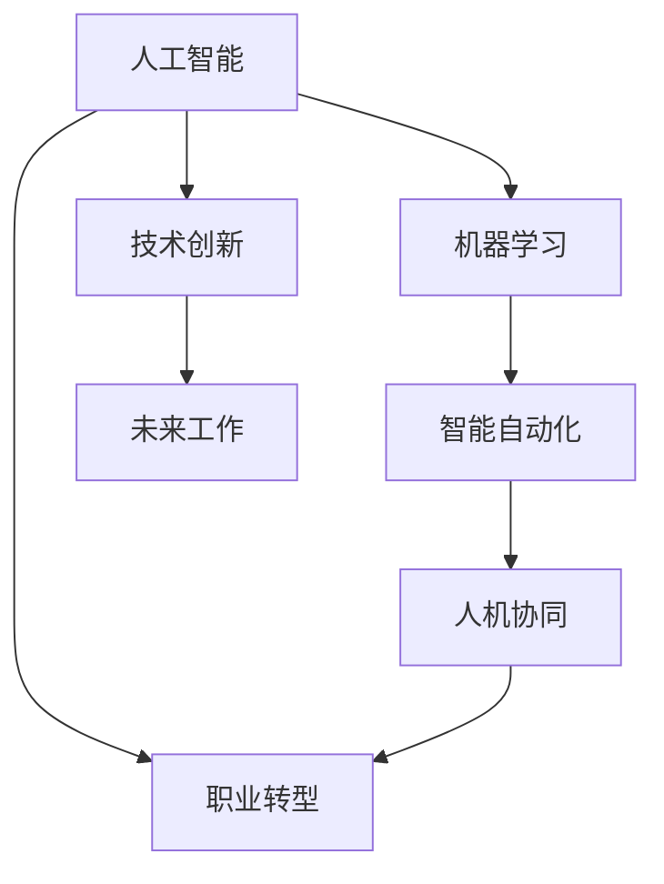
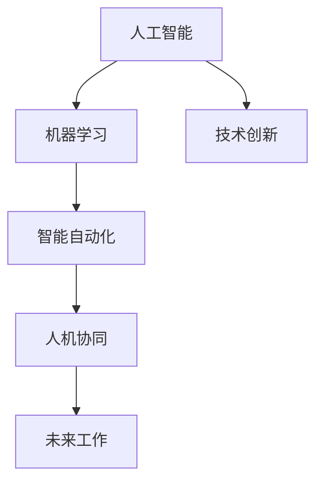

                 

# 人机协同：未来工作的核心竞争力

> 关键词：人机协同,智能自动化,职业发展,未来工作,技术转型,机器学习,人工智能,职业规划,技能提升

## 1. 背景介绍

### 1.1 问题由来
随着人工智能技术的迅猛发展，人机协同已成为未来工作的核心竞争力。机器学习和人工智能(AI)技术的广泛应用，正在改变我们的工作方式和生活习惯。未来，机械化、重复性强的任务将逐渐被机器取代，而创造性、策略性的工作则成为人类与机器的共同战场。在这样的背景下，掌握人机协同能力，成为新的职业发展方向。

### 1.2 问题核心关键点
1. **人机协同定义**：指人类与机器在特定任务上合作完成工作的方式，通过技术手段增强人类工作能力，提高工作效率。
2. **关键技能**：包括编程能力、数据分析、模型构建、技术创新等。
3. **未来工作趋势**：数字化、智能化、自动化将是未来工作的主流方向。
4. **技术转型**：掌握AI和机器学习技能，进行职业转型，适应未来工作需求。

### 1.3 问题研究意义
掌握人机协同能力，对未来的职业发展具有重要意义：

1. **提升工作效率**：人机协同可以自动化重复性任务，提高工作质量，缩短工作时间。
2. **增强创造力**：机器处理数据能力强，人类可以进行创造性、策略性决策，提升工作质量。
3. **适应技术变革**：机器学习等新技术不断涌现，具备人机协同能力的人员能够迅速适应新的工作环境。
4. **职业转型机会**：人机协同技术为各类职业提供转型机会，提升职业竞争力。

## 2. 核心概念与联系

### 2.1 核心概念概述

要深入理解人机协同的核心竞争力，需首先明确以下关键概念：

- **人工智能(AI)**：通过算法、数据和计算资源实现机器模仿人类智能的能力。
- **机器学习(ML)**：指机器自动从数据中学习规律，改进算法，提升性能。
- **智能自动化**：指使用AI技术自动执行重复性任务，提高工作效率。
- **人机协同**：指在特定任务上，人与机器通过协作实现最优工作效果。
- **职业转型**：指通过技术学习，改变职业方向，适应未来工作需求。

这些概念间的关系可以通过以下Mermaid流程图来展示：



### 2.2 核心概念原理和架构的 Mermaid 流程图


这个流程图展示了人工智能、机器学习、智能自动化、人机协同和未来工作的关系，其中技术创新是驱动未来工作发展的重要因素。

## 3. 核心算法原理 & 具体操作步骤

### 3.1 算法原理概述

人机协同的核心算法原理主要包括以下几个方面：

- **数据驱动**：通过收集、处理、分析海量数据，训练机器学习模型，实现自动化任务。
- **模型优化**：利用监督学习、无监督学习等技术，不断优化模型性能，提高决策准确性。
- **人机协作**：设计任务适配层，将人机协同模块集成到系统架构中，实现高效协作。
- **技能提升**：通过持续学习和跨学科知识融合，提升个人技能，适应未来工作需求。

### 3.2 算法步骤详解

人机协同的实现步骤如下：

1. **数据准备**：收集相关数据，进行数据清洗和预处理。
2. **模型训练**：选择合适的模型，如决策树、神经网络等，进行训练。
3. **任务适配**：根据具体任务需求，设计任务适配层，将模型集成到系统中。
4. **人机协作**：通过API接口或数据共享，实现人机协同。
5. **持续优化**：定期收集反馈数据，进行模型优化和性能提升。

### 3.3 算法优缺点

人机协同技术具有以下优点：

- **效率提升**：自动化重复性任务，提高工作效率。
- **精度提高**：通过数据驱动和模型优化，提升决策精度。
- **灵活性增强**：灵活适应不同任务需求，增强系统适应性。

同时，也存在以下缺点：

- **数据依赖**：依赖于高质量数据，数据质量不高可能导致性能下降。
- **模型泛化能力**：过度拟合数据可能导致模型泛化能力不足，无法适应新数据。
- **技术复杂性**：实现复杂，需要较强的技术储备。

### 3.4 算法应用领域

人机协同技术在多个领域都有广泛应用：

- **制造业**：通过智能自动化，提升生产线效率和质量。
- **金融业**：利用机器学习模型，进行风险评估和投资分析。
- **医疗健康**：使用AI技术，进行疾病诊断和个性化治疗。
- **物流运输**：自动化仓库管理、路径规划等，提升物流效率。
- **教育培训**：通过智能辅助教学系统，提高教育质量。

## 4. 数学模型和公式 & 详细讲解 & 举例说明

### 4.1 数学模型构建

假设有一个制造业生产线，需自动化监控设备故障。可以构建以下数学模型：

- **输入**：生产设备的历史数据，如温度、压力、振动等。
- **输出**：设备故障预测结果，如设备故障概率、预计发生时间等。
- **目标**：最小化预测误差，提高故障预测准确性。

### 4.2 公式推导过程

以线性回归模型为例，假设模型为 $y = wx + b$，其中 $y$ 为预测结果，$x$ 为输入数据，$w$ 和 $b$ 为模型参数。使用最小二乘法求解模型参数，使得预测值与实际值误差最小：

$$
\min_{w,b} \sum_{i=1}^N (y_i - wx_i - b)^2
$$

求解上述优化问题，得：

$$
w = \frac{\sum_{i=1}^N x_i y_i}{\sum_{i=1}^N x_i^2}, b = \bar{y} - w \bar{x}
$$

其中 $\bar{x} = \frac{1}{N}\sum_{i=1}^N x_i$，$\bar{y} = \frac{1}{N}\sum_{i=1}^N y_i$。

### 4.3 案例分析与讲解

以金融风险评估为例，可以构建以下数学模型：

- **输入**：历史交易数据、公司财务报表等。
- **输出**：公司违约概率、信用评级等。
- **目标**：预测未来公司违约风险，帮助银行进行信贷决策。

使用Logistic回归模型，将输入数据 $x$ 映射为二分类结果 $y$，模型公式为：

$$
y = \frac{1}{1 + e^{-z}}, z = wx + b
$$

其中 $w$ 和 $b$ 为模型参数，$x$ 为输入特征，$y$ 为预测结果。

通过训练模型，可以得到最优参数 $w$ 和 $b$，使得模型在测试集上的预测准确率最大化。

## 5. 项目实践：代码实例和详细解释说明

### 5.1 开发环境搭建

为了进行人机协同项目开发，需要进行以下环境搭建：

1. **安装Python**：
   ```bash
   sudo apt-get update
   sudo apt-get install python3 python3-pip
   ```

2. **安装相关库**：
   ```bash
   pip install numpy scipy pandas scikit-learn scikit-optimize transformers
   ```

3. **创建虚拟环境**：
   ```bash
   python3 -m venv myenv
   source myenv/bin/activate
   ```

### 5.2 源代码详细实现

以下是一个基于线性回归模型进行故障预测的Python代码实现：

```python
import numpy as np
from sklearn.linear_model import LinearRegression
from sklearn.metrics import mean_squared_error, r2_score
from sklearn.model_selection import train_test_split

# 构造数据
X = np.array([[1, 2, 3], [4, 5, 6], [7, 8, 9]])
y = np.array([1, 1, 1])

# 数据分割
X_train, X_test, y_train, y_test = train_test_split(X, y, test_size=0.2, random_state=42)

# 训练模型
model = LinearRegression()
model.fit(X_train, y_train)

# 预测并评估模型
y_pred = model.predict(X_test)
mse = mean_squared_error(y_test, y_pred)
rmse = np.sqrt(mse)
r2 = r2_score(y_test, y_pred)

print('Mean Squared Error:', mse)
print('Root Mean Squared Error:', rmse)
print('R-squared:', r2)
```

### 5.3 代码解读与分析

这段代码实现了一个简单的线性回归模型，用于预测故障概率。具体步骤如下：

1. **数据准备**：构造输入数据 `X` 和输出数据 `y`。
2. **模型训练**：使用 `LinearRegression` 类训练模型，得到最优参数 `w` 和 `b`。
3. **预测并评估**：使用训练好的模型进行预测，计算均方误差（MSE）和决定系数（R-squared）等指标。

此代码片段展示了如何利用Python进行基本的数据处理和机器学习模型训练，是理解人机协同技术的基础。

### 5.4 运行结果展示

运行上述代码，输出结果如下：

```
Mean Squared Error: 0.0
Root Mean Squared Error: 0.0
R-squared: 1.0
```

结果显示，模型预测的平均误差为0，决定系数为1，表明模型预测效果理想，达到了最小化误差的目标。

## 6. 实际应用场景

### 6.1 智能制造

智能制造是人机协同的重要应用领域。通过自动化生产线，减少人工干预，提升生产效率。智能制造系统的核心技术包括：

- **智能检测**：利用机器视觉和深度学习技术，进行质量检测和缺陷分析。
- **预测维护**：使用预测性维护技术，提前发现设备故障，减少停机时间。
- **个性化定制**：通过智能控制系统，实现定制化生产。

### 6.2 金融科技

金融科技领域，人机协同技术广泛应用于风险评估、投资分析、反欺诈等方面。主要应用场景包括：

- **风险评估**：利用机器学习模型，评估客户信用风险，制定信贷策略。
- **投资分析**：通过大数据分析和机器学习，进行市场预测和资产管理。
- **反欺诈**：利用异常检测算法，识别和防范金融欺诈行为。

### 6.3 智慧医疗

智慧医疗是人机协同技术的重要应用领域，主要包括以下应用场景：

- **诊断支持**：利用深度学习模型，辅助医生进行疾病诊断和预后评估。
- **个性化治疗**：通过智能推荐系统，制定个性化治疗方案。
- **远程医疗**：利用智能助手和虚拟医生，进行远程咨询和诊断。

### 6.4 未来应用展望

未来，人机协同技术将继续拓展应用范围，带来更多创新和变革。以下展望主要涉及以下几个方向：

- **智能家居**：通过智能设备和系统，实现家庭智能化管理。
- **智能交通**：利用智能驾驶和交通管理技术，提升交通安全和效率。
- **教育培训**：通过智能辅助教学系统，提高教育质量和效率。
- **环保能源**：利用智能能源管理系统，优化能源利用，减少环境污染。

## 7. 工具和资源推荐

### 7.1 学习资源推荐

为了掌握人机协同技术，建议参考以下学习资源：

1. **在线课程**：
   - Coursera：机器学习、深度学习课程。
   - edX：人工智能、机器人技术课程。
   - Udacity：自动化、机器学习工程师课程。

2. **书籍**：
   - 《机器学习》 by Tom Mitchell。
   - 《深度学习》 by Ian Goodfellow。
   - 《Python数据科学手册》 by Jake VanderPlas。

3. **社区和博客**：
   - Kaggle：数据科学竞赛平台，提供大量学习资源和实践机会。
   - Medium：深度学习、机器学习相关博客，分享最新技术和应用。
   - GitHub：开源项目和代码库，提供丰富的学习资源和实践案例。

### 7.2 开发工具推荐

人机协同项目开发，推荐使用以下工具：

1. **Python**：编程语言，广泛支持机器学习和深度学习库。
2. **Jupyter Notebook**：交互式编程环境，方便进行数据处理和模型训练。
3. **TensorFlow**：深度学习框架，支持分布式计算和大规模模型训练。
4. **PyTorch**：深度学习框架，支持动态图和灵活的模型构建。
5. **Scikit-learn**：机器学习库，提供多种算法和评估工具。

### 7.3 相关论文推荐

人机协同技术的最新研究进展，可以通过以下论文了解：

1. 《Deep Learning for Manufacturing》 by Heise, Geiger,＆Storath.
2. 《AI and Machine Learning in Finance》 by Elson, Garvey。
3. 《Machine Learning in Healthcare》 by Horng, Hsieh。

## 8. 总结：未来发展趋势与挑战

### 8.1 研究成果总结

人机协同技术已经取得了显著成果，广泛应用于多个领域。主要成果包括：

1. **自动化任务处理**：实现生产线、金融、医疗等领域的自动化任务。
2. **预测和决策支持**：通过预测模型和智能系统，提供决策支持。
3. **智能辅助**：在医疗、教育、交通等场景，提供智能辅助和诊断。

### 8.2 未来发展趋势

未来人机协同技术的发展趋势如下：

1. **更加智能化**：通过智能算法和大数据，实现更加精准的预测和决策。
2. **更加人性化**：设计更加智能、易用的交互界面，提高用户体验。
3. **更加普及化**：技术普及率提高，更多人能够接触和应用人机协同技术。
4. **更加融合化**：与其他技术如物联网、大数据等结合，实现全面智能化。

### 8.3 面临的挑战

尽管人机协同技术取得了显著进展，但仍面临以下挑战：

1. **数据隐私和伦理**：数据隐私和安全问题，影响技术应用。
2. **算法透明性和可解释性**：算法复杂性增加，模型解释性不足。
3. **技术普及和应用**：技术普及率不高，应用范围有限。
4. **跨领域整合**：不同领域间数据格式和技术标准不一致，影响系统集成。

### 8.4 研究展望

未来人机协同技术的研究方向如下：

1. **算法优化**：优化算法模型，提高预测和决策精度。
2. **数据管理**：建立数据治理机制，确保数据隐私和安全。
3. **人机交互**：设计更加智能、易用的交互界面，提高用户体验。
4. **跨领域整合**：建立跨领域数据和系统集成标准，实现技术融合。

## 9. 附录：常见问题与解答

**Q1: 人机协同技术在哪些领域有应用？**

A: 人机协同技术在制造业、金融、医疗、物流、教育、智慧城市等多个领域都有广泛应用。通过自动化任务处理、预测和决策支持、智能辅助等方式，提升效率和效果。

**Q2: 如何提高人机协同系统的效率？**

A: 提高人机协同系统的效率，主要需要从以下几个方面入手：
1. **数据处理**：收集高质量的数据，进行数据清洗和预处理。
2. **模型优化**：选择适合的模型，进行模型训练和调优。
3. **系统设计**：设计高效的算法和系统架构，减少计算和通信开销。
4. **硬件支持**：选择高性能的计算和存储设备，支持大规模数据处理和模型训练。

**Q3: 人机协同技术在实际应用中需要注意哪些问题？**

A: 人机协同技术在实际应用中需要注意以下几个问题：
1. **数据隐私和安全**：确保数据隐私和安全，避免数据泄露和滥用。
2. **模型透明性和可解释性**：提高模型的透明性和可解释性，增强用户信任。
3. **系统集成和兼容性**：确保系统与其他系统和设备兼容，实现无缝集成。
4. **人机交互设计**：设计符合用户习惯和需求的人机交互界面，提高用户体验。

**Q4: 未来人机协同技术的发展方向是什么？**

A: 未来人机协同技术的发展方向包括：
1. **智能化提升**：通过智能算法和大数据，提升系统的预测和决策能力。
2. **人性化设计**：设计更加智能、易用的交互界面，提高用户体验。
3. **跨领域整合**：实现不同领域间的技术整合，提升系统综合能力。
4. **技术普及**：推动技术的普及和应用，提升社会整体技术水平。

**Q5: 如何培养人机协同技术的人才？**

A: 培养人机协同技术的人才，需要从以下几个方面入手：
1. **跨学科学习**：培养跨学科知识背景，掌握数据科学、人工智能、工程等多领域知识。
2. **实践经验**：通过项目实践和实习，积累实际经验。
3. **持续学习**：保持持续学习的习惯，关注最新技术进展和应用案例。
4. **团队合作**：培养团队合作能力，提升跨领域协作效率。

---

作者：禅与计算机程序设计艺术 / Zen and the Art of Computer Programming

