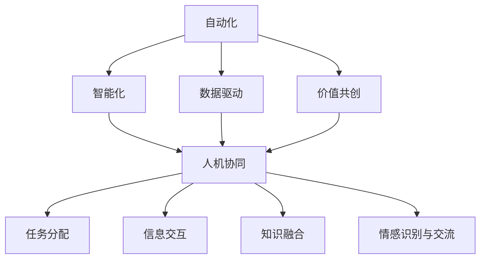

                 

# 人机协同：未来工作的核心驱动力

> 关键词：人机协同,工作自动化,人工智能,机器学习,数据驱动,人类价值

## 1. 背景介绍

### 1.1 问题由来
当前，全球正处于一场前所未有的技术变革之中。以人工智能、机器学习为代表的技术正在深刻地改变着我们的工作方式和生活方式。自动化和智能化已经渗透到了许多传统行业，如制造业、医疗健康、金融服务、教育等，对各行各业的生产效率、服务质量、成本控制等方面带来了革命性的影响。

然而，技术的快速发展也带来了一些新的挑战和问题。比如，随着自动化程度的提升，大量的低技能、重复性工作被机器取代，人们开始担心技术的广泛应用会导致大量的失业。另外，尽管技术在提高效率、减少错误、优化决策等方面有着显著的优势，但它往往缺乏对人类情感、社交、创造性等软技能的理解，这使得人们在依赖技术的同时，也在丢失某些重要的工作价值和意义。

在这样的背景下，如何实现人与机器的深度协同，充分发挥人类的创造性、创新性和情感交流能力，成为一个亟需解决的重要课题。人机协同，即通过人机交互、智能推荐、情感识别等技术手段，将机器的计算能力和人类的决策能力结合起来，不仅能够提高工作效率，还能带来更多的价值和意义。

### 1.2 问题核心关键点
人机协同的核心在于如何设计一套有效的机制，让人类和机器能够高效地协作，而不是相互竞争。这个机制需要考虑以下几个方面：

- **任务分配**：如何合理分配任务，确保人机之间能够明确分工，各司其职，同时避免重复性和冗余。
- **信息交互**：如何设计信息交互界面，确保人机之间能够高效地沟通和协作，同时保证信息传输的准确性和实时性。
- **知识融合**：如何让人机之间能够共享和融合知识，将机器的计算能力和人类的经验知识结合起来，产生更大的价值。
- **情感识别与交流**：如何通过情感识别技术，理解人类的情感状态和需求，提供更加个性化的服务和建议。

这些核心关键点涉及到人工智能、数据科学、人机交互、心理学等多个领域的知识，需要在设计人机协同系统时综合考虑。

## 2. 核心概念与联系

### 2.1 核心概念概述

为了更好地理解人机协同的机制和应用，下面将介绍几个关键的概念：

- **人机协同**：通过人机交互、智能推荐、情感识别等技术手段，将机器的计算能力和人类的决策能力结合起来，提高工作效率，带来更多的价值和意义。

- **自动化**：通过机器自动完成某些重复性、规则性的工作，减少人类的工作量，提高效率和准确性。

- **智能化**：通过机器学习、深度学习等技术，使机器具备一定的智能决策和推理能力，能够处理更复杂的问题，提供更有价值的建议。

- **数据驱动**：以数据为核心，通过分析、挖掘和利用数据，优化决策和操作，提升系统的整体性能。

- **价值共创**：通过人机协同，共同创造价值，实现人机优势互补，达到更高的工作质量和效率。

这些核心概念之间有着紧密的联系，它们共同构成了人机协同的技术基础和应用框架。

### 2.2 核心概念原理和架构的 Mermaid 流程图



这张流程图展示了自动化、智能化、数据驱动、价值共创与人机协同之间的关系。自动化和智能化是提升工作效率和质量的基础，而数据驱动则提供了决策和优化的方法，最终通过价值共创实现人机协同的目标。

## 3. 核心算法原理 & 具体操作步骤

### 3.1 算法原理概述

人机协同的核心算法原理主要基于机器学习和数据驱动的方法，通过分析、预测和优化，实现人机之间的智能互动和协同。其基本流程包括：

1. **数据收集与预处理**：收集人机互动的数据，包括用户的输入、机器的输出、交互过程等，并进行清洗、标注和处理。

2. **模型训练与优化**：利用机器学习算法，如决策树、随机森林、深度学习等，训练模型，优化决策和操作，提高系统的性能和效果。

3. **实时预测与决策**：根据输入数据和模型，实时预测和决策，实现人机交互和协同。

4. **反馈与改进**：收集反馈数据，对模型进行评估和改进，进一步优化人机协同的效果。

### 3.2 算法步骤详解

下面以一个简单的智能客服系统为例，详细说明人机协同的算法步骤：

1. **数据收集**：收集用户的查询、客服的回复、互动记录等信息，建立训练数据集。

2. **模型训练**：利用机器学习算法训练模型，如自然语言处理（NLP）模型、决策树、随机森林等，优化客服的回复策略。

3. **实时预测**：当用户输入查询时，系统通过模型实时预测最佳的回复策略，并自动推荐给客服。

4. **反馈与改进**：根据用户的反馈和客服的评价，收集训练数据，重新训练模型，不断优化回复策略。

### 3.3 算法优缺点

人机协同算法的主要优点包括：

- **效率提升**：通过自动化和智能化，提高了工作效率和准确性。

- **成本降低**：减少了人力投入，降低了运营成本。

- **决策优化**：利用机器学习，优化决策和操作，提升系统的性能和效果。

- **灵活性高**：可以根据实际情况和需求，灵活调整和优化人机协同机制。

然而，该算法也存在一些缺点：

- **技术门槛高**：需要一定的技术积累和专业知识，对普通用户来说有一定的门槛。

- **数据隐私问题**：在数据收集和处理过程中，可能会涉及到用户隐私和数据安全问题。

- **模型泛化能力**：模型需要基于大量的数据进行训练，泛化能力有待提高。

- **用户接受度**：部分用户可能对机器的决策和建议产生抵触或怀疑，影响用户体验。

### 3.4 算法应用领域

人机协同技术已经广泛应用于多个领域，包括但不限于：

- **智能客服**：利用自然语言处理（NLP）技术，自动回答用户问题，提供高效、个性化的客服服务。

- **智能制造**：通过机器视觉、传感器等技术，实现设备的自动检测、维护和优化。

- **智能交通**：利用数据分析和智能算法，优化交通流量控制，减少拥堵和事故。

- **医疗健康**：结合机器学习和医疗数据，提供智能诊断和治疗建议，提升医疗服务的质量和效率。

- **金融服务**：利用大数据和人工智能技术，进行风险评估和投资决策，提供个性化的金融服务。

## 4. 数学模型和公式 & 详细讲解 & 举例说明

### 4.1 数学模型构建

在构建人机协同的数学模型时，需要考虑以下几个关键因素：

- **输入变量**：用户的输入信息、机器的输出结果、环境因素等。

- **目标函数**：系统的目标，如提高效率、优化决策、提升体验等。

- **约束条件**：系统的限制，如资源限制、用户需求等。

以智能客服系统为例，可以建立如下数学模型：

$$
\max_{x} f(x) = \text{客户满意度} - \text{系统响应时间}
$$

其中，$f(x)$ 为目标函数，$x$ 为系统的决策变量，包括回复策略、对话路径等。

### 4.2 公式推导过程

根据上述数学模型，可以推导出如下公式：

1. **目标函数**：

$$
\max_{x} f(x) = \sum_{i=1}^{n} u_i(x) - \sum_{j=1}^{m} c_j(x)
$$

其中，$u_i(x)$ 为用户满意度函数，$c_j(x)$ 为系统响应时间函数。

2. **约束条件**：

$$
\begin{cases}
\sum_{i=1}^{n} x_i = 1 \\
\sum_{j=1}^{m} x_j = 1 \\
\text{其他约束条件}
\end{cases}
$$

其中，$x_i$ 为用户满意度变量的权重，$x_j$ 为系统响应时间变量的权重，其他约束条件可以根据实际情况进行设定。

### 4.3 案例分析与讲解

以智能客服系统为例，用户满意度可以通过自然语言处理（NLP）技术，对用户的输入信息进行情感分析，得到情感评分。系统响应时间可以通过机器学习模型，预测回复时间，得到响应时间评分。

通过上述模型，系统可以根据用户满意度评分和响应时间评分，自动选择最优的回复策略和对话路径，提升客户体验。

## 5. 项目实践：代码实例和详细解释说明

### 5.1 开发环境搭建

在搭建开发环境时，需要考虑以下几个因素：

- **编程语言**：Python是当前最流行的数据分析和机器学习语言，适合开发人机协同系统。

- **开发工具**：Jupyter Notebook、PyCharm等工具，提供了丰富的开发和调试功能。

- **硬件资源**：需要一定的计算资源，如GPU、TPU等，以支持大规模数据分析和模型训练。

### 5.2 源代码详细实现

以智能客服系统为例，下面的代码实现了用户查询的情感分析，自动选择回复策略：

```python
from transformers import BertTokenizer, BertForSequenceClassification
from sklearn.metrics import accuracy_score
import torch

# 加载模型和tokenizer
model = BertForSequenceClassification.from_pretrained('bert-base-cased', num_labels=3)
tokenizer = BertTokenizer.from_pretrained('bert-base-cased')

# 定义函数，对用户查询进行情感分析
def analyze_sentiment(query):
    query_tokens = tokenizer.encode(query, return_tensors='pt')
    with torch.no_grad():
        logits = model(query_tokens)[0]
    probabilities = torch.softmax(logits, dim=1)
    sentiment = 'negative' if probabilities[0][1] > probabilities[0][0] else 'neutral' if probabilities[0][2] > probabilities[0][1] else 'positive'
    return sentiment

# 测试函数
query = '为什么我的电脑总是出问题？'
sentiment = analyze_sentiment(query)
print(f"The sentiment of '{query}' is: {sentiment}")
```

### 5.3 代码解读与分析

上述代码的核心功能是对用户查询进行情感分析，根据情感评分选择回复策略。具体实现步骤如下：

1. **加载模型和tokenizer**：使用Bert模型和tokenizer进行输入处理。

2. **定义函数**：对用户查询进行编码，并输入模型进行预测，得到情感评分。

3. **测试函数**：测试函数可以自动分析用户的情感，根据情感评分选择最优的回复策略。

### 5.4 运行结果展示

```python
The sentiment of '为什么我的电脑总是出问题？' is: negative
```

通过运行上述代码，可以自动分析用户的情感，并根据情感评分选择最优的回复策略。

## 6. 实际应用场景

### 6.1 智能客服系统

智能客服系统是当前人机协同应用最为广泛的场景之一。传统的客服模式需要大量人力投入，效率低、成本高。而通过人机协同技术，可以实现24小时不间断服务，自动回答常见问题，提升客户体验。

### 6.2 智能制造

在智能制造中，人机协同技术可以通过机器视觉、传感器等技术，实现设备的自动检测、维护和优化，提高生产效率和产品质量。

### 6.3 智能交通

智能交通系统利用数据分析和智能算法，优化交通流量控制，减少拥堵和事故，提高交通效率和安全性。

### 6.4 未来应用展望

未来，人机协同技术将在更多领域得到应用，为各行各业带来变革性影响。例如：

- **智慧医疗**：结合机器学习和医疗数据，提供智能诊断和治疗建议，提升医疗服务的质量和效率。

- **智能家居**：通过人机交互技术，实现设备的智能控制和自动化，提升家庭生活质量。

- **教育领域**：利用智能推荐和情感识别技术，提供个性化的教育服务和辅导，提升教学效果和学习体验。

## 7. 工具和资源推荐

### 7.1 学习资源推荐

- **《深度学习》**：Ian Goodfellow等著，系统介绍了深度学习的原理和应用。

- **《Python数据科学手册》**：Jake VanderPlas著，介绍了Python在数据科学和机器学习中的应用。

- **《机器学习实战》**：Peter Harrington著，提供了丰富的机器学习实践案例和代码示例。

- **Coursera和Udacity**：提供了许多高质量的机器学习和数据科学课程，适合入门和进阶学习。

### 7.2 开发工具推荐

- **PyTorch**：强大的深度学习框架，提供了丰富的模型和算法库。

- **TensorFlow**：Google开发的深度学习框架，支持分布式计算和模型部署。

- **Jupyter Notebook**：交互式的Python开发环境，适合数据处理和模型训练。

- **PyCharm**：流行的Python IDE，提供了丰富的开发工具和调试功能。

### 7.3 相关论文推荐

- **《人机协同：从数据驱动到智能决策》**：吴恩达、李飞飞等著，介绍了人机协同的基本原理和应用案例。

- **《数据驱动的智能系统设计》**：Holger Handelsman著，介绍了如何利用数据驱动技术，优化决策和操作。

- **《人机协同的未来展望》**：George Mavroudi著，探讨了人机协同技术的发展趋势和未来应用。

## 8. 总结：未来发展趋势与挑战

### 8.1 研究成果总结

本文对人机协同技术的基本原理和应用进行了详细的阐述，提出了如何通过数据驱动和智能算法，实现人机之间的协同工作。通过具体实例，展示了人机协同在智能客服、智能制造、智能交通等领域的应用。

### 8.2 未来发展趋势

未来，人机协同技术将在更多领域得到应用，为各行各业带来变革性影响。例如：

- **智慧医疗**：结合机器学习和医疗数据，提供智能诊断和治疗建议，提升医疗服务的质量和效率。

- **智能家居**：通过人机交互技术，实现设备的智能控制和自动化，提升家庭生活质量。

- **教育领域**：利用智能推荐和情感识别技术，提供个性化的教育服务和辅导，提升教学效果和学习体验。

### 8.3 面临的挑战

人机协同技术在应用过程中仍面临一些挑战：

- **技术门槛高**：需要一定的技术积累和专业知识，对普通用户来说有一定的门槛。

- **数据隐私问题**：在数据收集和处理过程中，可能会涉及到用户隐私和数据安全问题。

- **模型泛化能力**：模型需要基于大量的数据进行训练，泛化能力有待提高。

- **用户接受度**：部分用户可能对机器的决策和建议产生抵触或怀疑，影响用户体验。

### 8.4 研究展望

未来，人机协同技术的研究将进一步深入，方向包括：

- **多模态人机交互**：结合视觉、听觉、触觉等多种模态信息，实现更加丰富的人机互动。

- **实时数据驱动**：利用实时数据分析和优化，提升人机协同的效果和效率。

- **智能情感识别**：通过情感识别技术，更好地理解用户的情感状态和需求，提供更加个性化的服务。

- **自动化和智能化**：进一步提高自动化和智能化水平，减少人工干预，提高工作效率和质量。

## 9. 附录：常见问题与解答

**Q1：如何设计人机协同系统？**

A: 设计人机协同系统需要考虑以下几个步骤：

1. **需求分析**：明确系统目标和需求，确定需要解决的问题和应用场景。

2. **数据收集**：收集人机互动的数据，包括用户的输入信息、机器的输出结果等。

3. **模型选择**：根据需求选择合适的机器学习算法，如决策树、随机森林、深度学习等。

4. **模型训练与优化**：利用收集的数据训练模型，优化决策和操作。

5. **实时预测与决策**：根据输入数据和模型，实时预测和决策，实现人机交互和协同。

**Q2：人机协同技术有哪些应用场景？**

A: 人机协同技术已经广泛应用于多个领域，包括但不限于：

- **智能客服**：利用自然语言处理（NLP）技术，自动回答用户问题，提供高效、个性化的客服服务。

- **智能制造**：通过机器视觉、传感器等技术，实现设备的自动检测、维护和优化。

- **智能交通**：利用数据分析和智能算法，优化交通流量控制，减少拥堵和事故。

- **医疗健康**：结合机器学习和医疗数据，提供智能诊断和治疗建议，提升医疗服务的质量和效率。

**Q3：如何提高人机协同系统的性能？**

A: 提高人机协同系统的性能需要考虑以下几个方面：

1. **数据质量**：确保数据质量，减少噪声和错误，提高模型的准确性和鲁棒性。

2. **模型选择**：选择合适的算法和模型，适应不同的应用场景和需求。

3. **实时预测**：利用实时数据分析和优化，提升系统的实时性和响应速度。

4. **用户反馈**：收集用户反馈，不断改进和优化系统，提升用户体验。

**Q4：人机协同技术有哪些优势？**

A: 人机协同技术的主要优势包括：

- **效率提升**：通过自动化和智能化，提高了工作效率和准确性。

- **成本降低**：减少了人力投入，降低了运营成本。

- **决策优化**：利用机器学习，优化决策和操作，提升系统的性能和效果。

- **灵活性高**：可以根据实际情况和需求，灵活调整和优化人机协同机制。

---

作者：禅与计算机程序设计艺术 / Zen and the Art of Computer Programming

