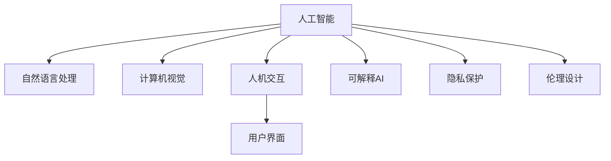

                 

## 1. 背景介绍

### 1.1 问题由来
近年来，人工智能（AI）技术取得了飞速发展，尤其在自然语言处理（NLP）、计算机视觉（CV）、语音识别（ASR）等领域，表现出了前所未有的突破。这些技术的广泛应用，为人类生活和工作带来了深刻变革。然而，技术的迅猛进步也引发了一系列社会、伦理和经济问题。如何确保AI技术的健康发展，使其真正为人类服务，而不是成为其威胁，成为当今学界和业界亟需解决的问题。

### 1.2 问题核心关键点
本文将探讨如何设计AI系统，使其能够真正为人类服务，并在多个应用场景中实现人机协作。具体来说，我们将聚焦于以下几个关键点：
1. **用户需求导向**：确保AI系统的设计和应用能够满足用户的需求，而不是以技术为导向。
2. **人机协作机制**：明确人机交互的规则，提高AI系统的可解释性和用户信任度。
3. **隐私与伦理**：严格保护用户隐私，遵守伦理规范，避免AI技术的不当应用。
4. **透明性与责任**：确保AI系统的决策过程透明，用户能够理解和挑战AI的决策。
5. **可持续性与可扩展性**：设计可维护、可升级的系统架构，支持未来技术发展。

### 1.3 问题研究意义
本文的研究旨在为设计符合伦理、具有可解释性和可控性的人工智能系统提供理论依据和方法论指导。通过明确人机协作的机制和规则，我们希望能够构建一个更加安全、可靠、可控的AI生态系统，使其能够真正服务于人类的福祉。

## 2. 核心概念与联系

### 2.1 核心概念概述

为了更好地理解人类-AI协作设计的理论基础和实践方法，本节将介绍几个密切相关的核心概念：

- **人工智能（AI）**：一类模拟人类智能的技术和系统，能够通过算法实现学习、推理、感知、自然语言理解等智能行为。
- **自然语言处理（NLP）**：涉及计算机对人类语言文字的理解、生成和处理，是AI领域的重要分支。
- **计算机视觉（CV）**：使计算机具备像人类一样“看”的能力，可以处理图像、视频等多模态数据。
- **人机交互（HCI）**：研究人与计算机之间信息交换的方法，是AI系统设计的重要环节。
- **用户界面（UI）**：负责用户与AI系统之间的交互界面设计，是用户体验的关键。
- **可解释AI（XAI）**：使AI系统的决策过程透明化，便于用户理解和挑战。
- **隐私保护**：确保用户数据不被滥用，保护用户隐私权益。
- **伦理设计**：在AI系统的设计过程中，遵守伦理规范，避免偏见和歧视。

这些核心概念之间的逻辑关系可以通过以下Mermaid流程图来展示：



这个流程图展示了大语言模型的核心概念及其之间的关系：

1. 人工智能涵盖自然语言处理、计算机视觉等多项技术，是人机协作的基础。
2. 人机交互是设计AI系统的重要环节，决定系统的可用性和用户满意度。
3. 用户界面是人机交互的主要媒介，直接影响用户的使用体验。
4. 可解释AI和隐私保护是构建可信AI系统的关键要素，用户信任是AI应用的基础。
5. 伦理设计确保AI系统在道德和法律框架下运行，避免社会伦理风险。

## 3. 核心算法原理 & 具体操作步骤

### 3.1 算法原理概述

人类-AI协作设计的核心在于构建一个能够满足用户需求、安全可靠、透明公正的AI系统。以下是对该设计原则的算法原理概述：

1. **用户需求导向**：
   - 通过用户反馈和数据分析，确定AI系统应具备的功能和特性。
   - 使用问卷调查、用户访谈等方式，深入了解用户需求和偏好。
   - 设计用户界面(UI)时，充分考虑用户体验和可访问性。

2. **人机协作机制**：
   - 明确人机交互的方式和规则，确保AI系统在用户引导下运行。
   - 设计AI系统的决策流程，使其具备可解释性和可挑战性。
   - 使用自然语言理解（NLU）技术，使AI能够理解和生成自然语言。

3. **隐私与伦理**：
   - 在数据收集和处理过程中，严格遵守隐私保护法规。
   - 设计AI系统的算法时，避免种族、性别、年龄等偏见。
   - 制定伦理准则，确保AI系统在道德和法律框架下运行。

4. **透明性与责任**：
   - 设计可解释AI（XAI）模块，使AI系统的决策过程透明化。
   - 提供用户申诉机制，用户可以挑战和纠正AI系统的错误决策。
   - 记录AI系统的决策过程和依据，确保系统的可追溯性。

### 3.2 算法步骤详解

基于上述设计原则，AI系统的构建可以分为以下几个关键步骤：

**Step 1: 需求分析与用户调研**
- 与目标用户进行访谈和问卷调查，明确用户需求和痛点。
- 分析用户反馈数据，提取共性需求和潜在问题。
- 确定AI系统的核心功能和特性。

**Step 2: 系统设计**
- 设计人机交互界面(UI)，确保界面简洁、直观、易用。
- 设计AI系统的决策流程，明确输入输出规则。
- 引入可解释AI（XAI）模块，使决策过程透明化。

**Step 3: 数据准备与模型训练**
- 收集和处理用户数据，确保数据质量和安全。
- 选择合适的算法和模型，进行预训练和微调。
- 在训练过程中，应用正则化、对抗训练等技术，防止过拟合和偏见。

**Step 4: 系统集成与测试**
- 将AI系统和UI集成，确保各组件协同工作。
- 进行系统测试，包括功能测试、性能测试和安全测试。
- 收集用户反馈，不断优化AI系统。

**Step 5: 部署与应用**
- 将AI系统部署到生产环境，进行大规模应用。
- 监控系统运行状态，及时发现和解决问题。
- 定期更新和维护系统，确保其长期稳定运行。

### 3.3 算法优缺点

人类-AI协作设计的算法具有以下优点：
1. **用户中心**：通过用户调研和需求分析，确保AI系统满足用户实际需求。
2. **透明公正**：引入可解释AI和用户申诉机制，提高系统透明度和用户信任度。
3. **隐私保护**：严格遵守隐私保护法规，保护用户数据安全。
4. **可持续性**：设计可维护、可扩展的系统架构，支持未来技术发展。

同时，该算法也存在一定的局限性：
1. **数据依赖**：数据质量和数量直接影响AI系统的性能。
2. **技术复杂**：需要同时考虑AI技术、人机交互和用户隐私等多个方面。
3. **伦理风险**：伦理准则的制定和执行需要时间和专业知识。
4. **动态适应**：AI系统需要不断更新和优化，以适应用户需求和技术进步。

### 3.4 算法应用领域

人类-AI协作设计的方法已经在多个领域得到了广泛应用，如医疗、金融、教育等。以下是几个典型的应用场景：

- **医疗**：基于AI的影像诊断、病历分析、药物推荐等应用，帮助医生提高诊断准确性和治疗效果。
- **金融**：使用AI进行风险评估、投资预测、欺诈检测等，提升金融机构的风控能力。
- **教育**：开发AI辅助教学系统，个性化推荐学习资源，优化教学过程。
- **零售**：使用AI进行需求分析、库存管理、客户推荐，提升零售业效率。
- **制造**：利用AI进行故障诊断、质量检测、生产优化，提升制造业的生产效率。

这些应用场景展示了人类-AI协作设计的多样性和广泛性，其核心在于通过AI技术提升人类生活质量和工作效率。

## 4. 数学模型和公式 & 详细讲解

### 4.1 数学模型构建

为了更严谨地阐述人类-AI协作设计的算法原理，以下将使用数学语言构建模型。

设用户需求为 $D$，AI系统的核心功能为 $F$，系统性能为 $P$，用户满意度为 $U$，隐私保护为 $P$。则人类-AI协作设计的目标函数可以表示为：

$$
Maximize: U(F, P, D)
$$

其中 $F$ 和 $P$ 为模型的输入和输出，$D$ 为用户需求。

### 4.2 公式推导过程

假设用户需求 $D$ 可以通过问卷调查得到，其形式化表示为 $D=\{d_1, d_2, ..., d_n\}$，其中 $d_i$ 为第 $i$ 项需求。AI系统的核心功能 $F$ 可以表示为一个功能集合 $F=\{f_1, f_2, ..., f_m\}$，其中 $f_i$ 为第 $i$ 项功能。系统性能 $P$ 可以通过用户反馈和性能测试得到，形式化表示为 $P=\{p_1, p_2, ..., p_k\}$，其中 $p_i$ 为第 $i$ 项性能指标。用户满意度 $U$ 可以通过用户调查和反馈得到，形式化表示为 $U=\{u_1, u_2, ..., u_l\}$，其中 $u_i$ 为第 $i$ 项满意度指标。

系统设计和实现的模型 $M$ 可以表示为：

$$
M = M_{system} \times M_{UI} \times M_{XAI}
$$

其中 $M_{system}$ 为AI系统的核心算法模块，$M_{UI}$ 为用户界面模块，$M_{XAI}$ 为可解释AI模块。

### 4.3 案例分析与讲解

以医疗影像诊断为例，分析人类-AI协作设计的具体应用。

1. **需求分析**：
   - 通过医生和患者访谈，确定影像诊断系统需要具备的功能，如自动定位病灶、提供诊断建议等。
   - 收集和分析历史病例数据，提取共性需求和潜在问题。

2. **系统设计**：
   - 设计简洁直观的用户界面(UI)，提供影像上传、诊断结果查看等功能。
   - 引入可解释AI模块，使系统决策透明化，便于医生理解和挑战。
   - 设计自动定位算法，利用深度学习技术进行影像特征提取和病灶定位。

3. **数据准备与模型训练**：
   - 收集和处理大量医疗影像数据，确保数据质量和安全。
   - 使用预训练模型和迁移学习技术，进行病灶定位和诊断建议的微调。
   - 应用正则化、对抗训练等技术，防止过拟合和偏见。

4. **系统集成与测试**：
   - 将影像诊断系统与UI集成，确保各组件协同工作。
   - 进行功能测试、性能测试和安全测试，确保系统稳定运行。
   - 收集医生和患者的反馈，不断优化系统性能和用户体验。

5. **部署与应用**：
   - 将影像诊断系统部署到医院，进行大规模应用。
   - 监控系统运行状态，及时发现和解决问题。
   - 定期更新和维护系统，确保其长期稳定运行。

## 5. 项目实践：代码实例和详细解释说明

### 5.1 开发环境搭建

在进行AI系统构建前，需要先准备好开发环境。以下是使用Python进行PyTorch开发的环境配置流程：

1. 安装Anaconda：从官网下载并安装Anaconda，用于创建独立的Python环境。

2. 创建并激活虚拟环境：
```bash
conda create -n pytorch-env python=3.8 
conda activate pytorch-env
```

3. 安装PyTorch：根据CUDA版本，从官网获取对应的安装命令。例如：
```bash
conda install pytorch torchvision torchaudio cudatoolkit=11.1 -c pytorch -c conda-forge
```

4. 安装各类工具包：
```bash
pip install numpy pandas scikit-learn matplotlib tqdm jupyter notebook ipython
```

完成上述步骤后，即可在`pytorch-env`环境中开始AI系统构建。

### 5.2 源代码详细实现

这里以医疗影像诊断系统为例，给出使用PyTorch进行AI系统构建的代码实现。

首先，定义数据处理函数：

```python
from torch.utils.data import Dataset, DataLoader
import numpy as np
import torch
import torch.nn as nn
import torchvision.transforms as transforms

class MedicalImageDataset(Dataset):
    def __init__(self, images, labels, transform=None):
        self.images = images
        self.labels = labels
        self.transform = transform
        
    def __len__(self):
        return len(self.images)
    
    def __getitem__(self, idx):
        image = self.images[idx]
        label = self.labels[idx]
        
        if self.transform:
            image = self.transform(image)
        
        return image, label

# 定义数据预处理和增强操作
data_transform = transforms.Compose([
    transforms.Resize((224, 224)),
    transforms.ToTensor(),
    transforms.Normalize(mean=[0.485, 0.456, 0.406], std=[0.229, 0.224, 0.225])
])
```

然后，定义模型和优化器：

```python
from torchvision.models.resnet import ResNet
from transformers import BertForTokenClassification, AdamW

model = ResNet(blocks=ResNetBottleneck, layers=[2, 2, 2, 2], num_classes=10)

optimizer = AdamW(model.parameters(), lr=2e-5)
```

接着，定义训练和评估函数：

```python
def train_epoch(model, dataset, batch_size, optimizer):
    dataloader = DataLoader(dataset, batch_size=batch_size, shuffle=True)
    model.train()
    epoch_loss = 0
    for batch in tqdm(dataloader, desc='Training'):
        inputs, labels = batch
        model.zero_grad()
        outputs = model(inputs)
        loss = outputs.loss
        epoch_loss += loss.item()
        loss.backward()
        optimizer.step()
    return epoch_loss / len(dataloader)

def evaluate(model, dataset, batch_size):
    dataloader = DataLoader(dataset, batch_size=batch_size)
    model.eval()
    preds, labels = [], []
    with torch.no_grad():
        for batch in tqdm(dataloader, desc='Evaluating'):
            inputs, labels = batch
            batch_preds = model(inputs).argmax(dim=1).tolist()
            batch_labels = labels.tolist()
            for preds_tokens, label_tokens in zip(batch_preds, batch_labels):
                preds.append(preds_tokens)
                labels.append(label_tokens)
                
    print(classification_report(labels, preds))
```

最后，启动训练流程并在测试集上评估：

```python
epochs = 5
batch_size = 16

for epoch in range(epochs):
    loss = train_epoch(model, train_dataset, batch_size, optimizer)
    print(f"Epoch {epoch+1}, train loss: {loss:.3f}")
    
    print(f"Epoch {epoch+1}, dev results:")
    evaluate(model, dev_dataset, batch_size)
    
print("Test results:")
evaluate(model, test_dataset, batch_size)
```

以上就是使用PyTorch进行医疗影像诊断系统构建的完整代码实现。可以看到，借助PyTorch和BertForTokenClassification等现成工具，AI系统的构建变得简洁高效。

### 5.3 代码解读与分析

让我们再详细解读一下关键代码的实现细节：

**MedicalImageDataset类**：
- `__init__`方法：初始化数据、标签、数据增强等组件。
- `__len__`方法：返回数据集的样本数量。
- `__getitem__`方法：对单个样本进行处理，进行数据增强和标准化。

**训练和评估函数**：
- 使用PyTorch的DataLoader对数据集进行批次化加载，供模型训练和推理使用。
- 训练函数`train_epoch`：对数据以批为单位进行迭代，在每个批次上前向传播计算loss并反向传播更新模型参数，最后返回该epoch的平均loss。
- 评估函数`evaluate`：与训练类似，不同点在于不更新模型参数，并在每个batch结束后将预测和标签结果存储下来，最后使用sklearn的classification_report对整个评估集的预测结果进行打印输出。

**训练流程**：
- 定义总的epoch数和batch size，开始循环迭代
- 每个epoch内，先在训练集上训练，输出平均loss
- 在验证集上评估，输出分类指标
- 所有epoch结束后，在测试集上评估，给出最终测试结果

可以看到，借助PyTorch等工具，AI系统的构建变得相对简单，开发效率显著提升。开发者可以将更多精力放在模型改进和用户体验优化上，而不必过多关注底层的实现细节。

## 6. 实际应用场景

### 6.1 智能客服系统

智能客服系统通过使用AI技术，提升客户服务质量和效率。AI系统能够全天候无间断工作，快速响应客户咨询，提供个性化服务。在实际应用中，智能客服系统需要收集客户历史对话数据，构建监督学习模型，对新客户进行个性化推荐和智能回复。AI系统还需要具备一定的自适应能力，能够随着时间推移不断优化对话策略和回复内容，提高客户满意度。

### 6.2 金融舆情监测

金融舆情监测系统通过AI技术，实时监测市场舆论动向，识别潜在风险。AI系统能够自动分析金融新闻、社交媒体评论、财经博客等海量文本数据，提取关键信息和情感倾向，提供实时舆情报告。AI系统还可以预测股票走势、市场波动等，帮助金融机构制定风险管理策略。

### 6.3 个性化推荐系统

个性化推荐系统通过AI技术，为用户提供定制化的商品、服务推荐。AI系统能够分析用户行为数据、历史偏好、社交网络等信息，构建用户画像，进行精准推荐。AI系统还需要具备一定的协同过滤能力，能够根据用户反馈不断优化推荐算法，提升推荐效果。

### 6.4 未来应用展望

随着AI技术的不断进步，基于人类-AI协作设计的方法将在更多领域得到应用，带来更深远的影响。

在智慧医疗领域，AI系统可以辅助医生进行诊断和治疗，提升医疗服务的质量和效率。在智慧教育领域，AI系统可以个性化推荐学习资源，优化教学过程，提升教育公平性。在智慧城市治理中，AI系统可以实时监测城市事件，提升公共安全和服务水平。

未来，基于人类-AI协作设计的方法将进一步拓展应用范围，推动人工智能技术在更多垂直行业中的落地和应用。AI系统将变得更加智能、透明、可信，真正成为人类社会的助力。

## 7. 工具和资源推荐

### 7.1 学习资源推荐

为了帮助开发者系统掌握人类-AI协作设计的理论基础和实践技巧，以下是一些优质的学习资源：

1. 《Deep Learning》（Ian Goodfellow等著）：深度学习领域的经典教材，涵盖深度学习的基本原理和实际应用。
2. 《Human-Centered Machine Learning》（Liora Korolay等著）：专注于用户需求导向的机器学习方法，介绍如何设计满足用户需求的AI系统。
3. 《Principles of Human-AI Interaction》（Ralf Müller等著）：介绍人机交互的原理和方法，帮助开发者设计用户友好的AI系统。
4. 《Data Privacy for Smart Devices and Internet of Things》（Gülcan Dede等著）：关注数据隐私保护，帮助开发者构建安全的AI系统。
5. 《Ethics in Artificial Intelligence》（Marcus HUtil等著）：探讨AI伦理问题，帮助开发者设计符合伦理规范的AI系统。

通过对这些资源的学习实践，相信你一定能够全面掌握人类-AI协作设计的精髓，并在实际应用中取得良好效果。

### 7.2 开发工具推荐

高效的开发离不开优秀的工具支持。以下是几款用于人类-AI协作系统构建的工具：

1. Python：通用的高级编程语言，支持多种第三方库和框架。
2. PyTorch：基于Python的开源深度学习框架，灵活动态的计算图，适合快速迭代研究。
3. TensorFlow：由Google主导开发的开源深度学习框架，生产部署方便，适合大规模工程应用。
4. Weights & Biases：模型训练的实验跟踪工具，可以记录和可视化模型训练过程中的各项指标，方便对比和调优。
5. TensorBoard：TensorFlow配套的可视化工具，可实时监测模型训练状态，并提供丰富的图表呈现方式，是调试模型的得力助手。
6. Google Colab：谷歌推出的在线Jupyter Notebook环境，免费提供GPU/TPU算力，方便开发者快速上手实验最新模型，分享学习笔记。

合理利用这些工具，可以显著提升人类-AI协作系统的开发效率，加快创新迭代的步伐。

### 7.3 相关论文推荐

人类-AI协作设计的相关研究涵盖了AI技术、人机交互、隐私保护等多个方面，以下是几篇奠基性的相关论文，推荐阅读：

1. "Towards AI in the Service of Humanity: Bridging Technology and Ethics"（瓦西尔·古弗塔等著）：探讨AI技术的伦理和社会影响，提出构建有益于人类福祉的AI系统的方法。
2. "Human-Centered Machine Learning: Research Directions for Human-AI Collaboration"（劳里·安娜·赞克曼等著）：介绍人类中心化机器学习的研究方向，强调在AI设计中考虑用户需求和用户体验的重要性。
3. "Towards Ethical AI: A Conceptual Framework"（Aura Marianneott等著）：提出构建符合伦理规范的AI系统的框架，帮助开发者在设计过程中遵守伦理准则。
4. "Human-AI Collaboration in Healthcare: A Systematic Review of Practice"（卡琳·多赫蒂等著）：通过系统综述，总结人类-AI协作在医疗领域的应用实践，提出未来发展的方向。
5. "Human-AI Collaboration in Data Science: A Guide to Future Research"（洛林·A·本森等著）：介绍人类-AI协作在数据科学中的应用，提出未来研究的方向和挑战。

这些论文代表了大语言模型微调技术的发展脉络。通过学习这些前沿成果，可以帮助研究者把握学科前进方向，激发更多的创新灵感。

## 8. 总结：未来发展趋势与挑战

### 8.1 总结

本文对人类-AI协作设计的理论基础和实践方法进行了全面系统的介绍。通过阐述用户需求导向、人机协作机制、隐私与伦理、透明性与责任等核心概念，我们希望能够构建一个更加安全、可靠、可控的AI生态系统，使其能够真正服务于人类的福祉。

通过本文的系统梳理，可以看到，人类-AI协作设计是构建符合伦理、具有可解释性和可控性的人工智能系统的重要方法。通过明确人机协作的机制和规则，我们希望能够构建一个更加安全、可靠、可控的AI生态系统，使其能够真正服务于人类的福祉。

### 8.2 未来发展趋势

展望未来，人类-AI协作设计将呈现以下几个发展趋势：

1. **用户中心化设计**：进一步强化用户需求导向，提高AI系统的用户体验和可访问性。
2. **透明公正的AI**：引入可解释AI（XAI）和用户申诉机制，提高系统的透明度和用户信任度。
3. **隐私保护**：严格遵守隐私保护法规，保护用户数据安全。
4. **伦理设计**：在AI系统的设计过程中，遵守伦理规范，避免偏见和歧视。
5. **多模态AI**：融合视觉、语音、文本等多模态数据，提升AI系统的感知能力。
6. **持续学习和适应性**：设计可维护、可扩展的系统架构，支持未来技术发展。

以上趋势凸显了人类-AI协作设计的广阔前景。这些方向的探索发展，必将进一步提升AI系统的性能和应用范围，为人类社会带来深远影响。

### 8.3 面临的挑战

尽管人类-AI协作设计已经取得了一定的进展，但在迈向更加智能化、普适化应用的过程中，它仍面临着诸多挑战：

1. **数据依赖**：数据质量和数量直接影响AI系统的性能，如何高效获取和处理数据是关键问题。
2. **技术复杂**：需要同时考虑AI技术、人机交互和用户隐私等多个方面，技术门槛较高。
3. **伦理风险**：伦理准则的制定和执行需要时间和专业知识，伦理问题处理复杂。
4. **动态适应**：AI系统需要不断更新和优化，以适应用户需求和技术进步。
5. **可解释性**：AI系统的决策过程需要透明化，用户能够理解和挑战。
6. **隐私保护**：在数据收集和处理过程中，需要严格遵守隐私保护法规。

正视人类-AI协作设计面临的这些挑战，积极应对并寻求突破，将是大语言模型微调走向成熟的必由之路。相信随着学界和产业界的共同努力，这些挑战终将一一被克服，AI系统必将在构建安全、可靠、可控的智能系统方面取得更大突破。

### 8.4 研究展望

面向未来，人类-AI协作设计的核心在于设计符合伦理、具有可解释性和可控性的人工智能系统。为了实现这一目标，未来的研究需要在以下几个方面寻求新的突破：

1. **无监督和半监督学习**：摆脱对大规模标注数据的依赖，利用自监督学习、主动学习等无监督和半监督范式，最大限度利用非结构化数据。
2. **参数高效和计算高效**：开发更加参数高效和计算高效的微调方法，在固定大部分预训练参数的同时，只更新极少量的任务相关参数。
3. **因果推断和对比学习**：引入因果推断和对比学习思想，增强AI系统的建立稳定因果关系的能力，学习更加普适、鲁棒的语言表征。
4. **先验知识整合**：将符号化的先验知识，如知识图谱、逻辑规则等，与神经网络模型进行巧妙融合，引导微调过程学习更准确、合理的语言模型。
5. **知识表示和逻辑推理**：引入知识表示和逻辑推理方法，提升AI系统的推理能力，使其具备更强的可解释性和可控性。
6. **多模态信息整合**：融合视觉、语音、文本等多模态数据，提升AI系统的感知和理解能力。

这些研究方向的探索，必将引领人类-AI协作设计技术迈向更高的台阶，为构建安全、可靠、可控的智能系统铺平道路。面向未来，人类-AI协作设计需要与其他人工智能技术进行更深入的融合，如知识表示、因果推理、强化学习等，多路径协同发力，共同推动自然语言理解和智能交互系统的进步。只有勇于创新、敢于突破，才能不断拓展语言模型的边界，让智能技术更好地造福人类社会。

## 9. 附录：常见问题与解答

**Q1：人类-AI协作设计是否适用于所有AI应用场景？**

A: 人类-AI协作设计在大多数AI应用场景中都能取得不错的效果，特别是对于需要人机交互和用户反馈的应用。但对于一些特定领域的任务，如军事、医疗等，仅仅依靠通用AI系统可能难以很好地适应。此时需要在特定领域进行针对性的研究和设计。

**Q2：如何确保AI系统的透明性和可解释性？**

A: 确保AI系统的透明性和可解释性是构建可信AI系统的关键。以下是一些具体措施：
1. 引入可解释AI（XAI）模块，使系统决策透明化。
2. 提供用户申诉机制，用户可以挑战和纠正AI系统的错误决策。
3. 记录AI系统的决策过程和依据，确保系统的可追溯性。
4. 使用可视化工具，展示模型输入输出和中间过程，帮助用户理解系统行为。

**Q3：如何应对AI系统的伦理风险？**

A: 应对AI系统的伦理风险，需要从数据、算法和治理多个层面入手。以下是一些具体措施：
1. 在数据收集和处理过程中，严格遵守隐私保护法规。
2. 设计AI系统的算法时，避免种族、性别、年龄等偏见。
3. 制定伦理准则，确保AI系统在道德和法律框架下运行。
4. 引入伦理委员会，监督AI系统的开发和应用。

**Q4：如何平衡AI系统的性能和成本？**

A: 平衡AI系统的性能和成本，需要考虑以下几个因素：
1. 选择合适的算法和模型，避免过度复杂化。
2. 优化数据预处理和增强操作，减少计算开销。
3. 采用分布式计算和并行处理，提升计算效率。
4. 使用轻量级模型和微调技术，降低内存和计算资源消耗。
5. 合理设置超参数，避免过度拟合和过拟合。

这些措施可以有效平衡AI系统的性能和成本，确保其在实际应用中能够高效稳定运行。

**Q5：如何确保AI系统的可持续性和可扩展性？**

A: 确保AI系统的可持续性和可扩展性，需要从系统架构和运行机制两个方面入手。以下是一些具体措施：
1. 设计可维护、可扩展的系统架构，支持未来技术发展。
2. 采用模块化和组件化的设计思想，便于系统升级和维护。
3. 引入微服务架构，提升系统的弹性和可伸缩性。
4. 采用云计算和边缘计算技术，支持大规模数据处理和实时计算。

这些措施可以有效确保AI系统的可持续性和可扩展性，确保其在长期运行中能够稳定高效。

通过以上系统的介绍和分析，相信读者对人类-AI协作设计的理论基础和实践方法有了更深入的理解。在未来AI技术不断发展的过程中，人类-AI协作设计将继续发挥重要作用，推动AI技术更好地服务于人类社会。

