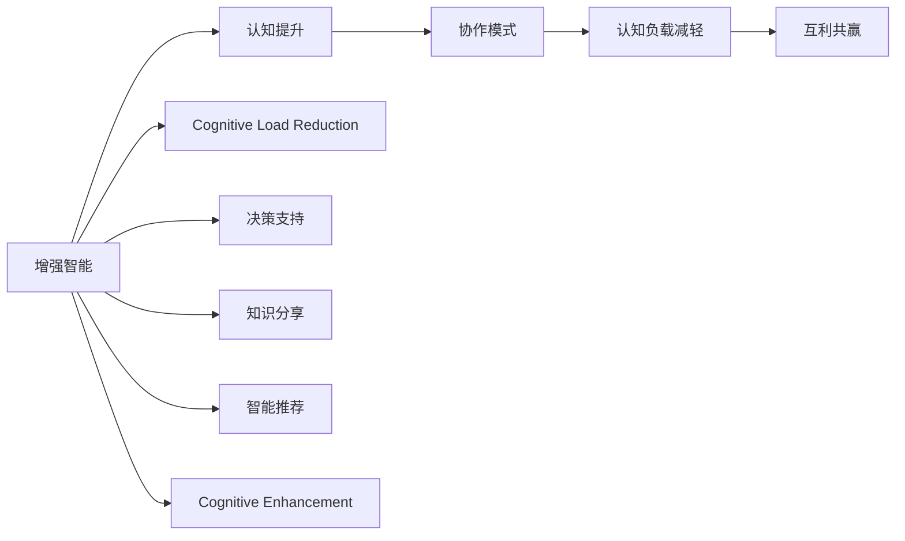

                 

# 人类-AI协作：增强人类智力

> 关键词：增强智能,认知增强,人类与AI协作,AI辅助决策,认知负载减轻,认知提升

## 1. 背景介绍

### 1.1 问题由来

随着人工智能技术的飞速发展，越来越多的行业开始尝试利用AI技术来提升效率、优化决策。在商业、医疗、教育等诸多领域，人工智能正在成为人类工作与生活中不可或缺的工具。然而，人工智能的发展并非意味着全面取代人类，而是应当与人类进行深度协作，共同提升工作与生活的质量。

人类-AI协作的目标，是利用AI的强大计算能力与学习能力，增强人类自身认知能力，减轻认知负载，提高决策效率，进而实现更好的生活与工作状态。这种协作形式，让AI不再仅仅是执行具体任务的机器，而是成为人类大脑的增强剂，帮助人类从繁重而复杂的认知任务中解放出来，专注于更具创造性和战略性的工作。

### 1.2 问题核心关键点

在人工智能与人类协作的探索中，有几个核心关键点需要关注：

1. **增强智能（Augmented Intelligence）**：AI技术应当增强人类的认知能力，而不仅仅是代替人类完成具体任务。
2. **认知提升（Cognitive Enhancement）**：通过AI的辅助，提升人类的决策能力、学习能力等。
3. **协作模式（Collaborative Model）**：AI与人类应当建立一种互助互补的关系，而非替代关系。
4. **认知负载减轻（Cognitive Load Reduction）**：通过AI的帮助，减少人类认知过程中所需要处理的复杂性和工作量。
5. **互利共赢（Mutual Benefit）**：AI技术应当为人类带来更多的积极影响，而非负面影响。

这些关键点共同构成了人类-AI协作的基石，旨在构建一个高效、有益、可持续的智能生态系统。

### 1.3 问题研究意义

探索人类-AI协作的方式与方法，对推进人工智能技术的应用，提升人类的工作与生活质量，具有重要意义：

1. **提升工作效率**：AI可以处理大量重复性、低价值的工作，让人类能够专注于更有创造性、高价值的任务。
2. **增强决策能力**：AI能够基于大量数据进行复杂分析，辅助人类做出更科学的决策。
3. **优化学习效果**：AI可以根据人类的学习习惯与反馈，提供个性化的学习方案，提升学习效率。
4. **促进人类健康**：AI可以监测健康状况，提醒生活方式改善，辅助治疗疾病。
5. **推动社会进步**：AI在教育、医疗、环保等领域的应用，将促进社会公平与进步。
6. **构建智能生态**：AI与人类协作，将形成更加智能化的生产生活体系，推动未来社会的发展。

## 2. 核心概念与联系

### 2.1 核心概念概述

为更好地理解人类-AI协作的原理与方法，本节将介绍几个核心概念：

- **增强智能（Augmented Intelligence）**：通过AI技术提升人类认知能力，增强人类智能。
- **认知提升（Cognitive Enhancement）**：AI通过提供决策支持、知识分享、认知负载减轻等功能，提升人类认知水平。
- **协作模式（Collaborative Model）**：AI与人类协同工作，共同完成复杂任务，形成互助互补的关系。
- **认知负载减轻（Cognitive Load Reduction）**：AI承担复杂数据处理、重复任务，减轻人类认知负担。
- **互利共赢（Mutual Benefit）**：AI与人类相互促进，实现共存共荣。

这些核心概念之间存在密切联系，通过AI的强大能力，提升人类智能，减轻认知负载，形成高效、有益的协作模式，最终实现互利共赢的目标。

### 2.2 核心概念原理和架构的 Mermaid 流程图



此流程图展示了增强智能、认知提升、协作模式、认知负载减轻、互利共赢等概念之间的逻辑关系。

## 3. 核心算法原理 & 具体操作步骤

### 3.1 算法原理概述

人类-AI协作的核心算法原理基于以下几个方面：

1. **认知增强**：利用AI的强大计算能力，处理大量数据，辅助人类进行复杂分析与决策。
2. **智能推荐**：根据人类需求，提供个性化的信息、建议和资源，提升决策效率。
3. **协作决策**：通过AI与人类共同参与的协作式决策机制，提升决策质量和效率。
4. **认知负载减轻**：利用AI承担重复性、低价值的任务，减轻人类认知负担。
5. **知识共享**：AI与人类共同创建、共享知识库，提升整体知识水平。

这些算法原理通过具体的技术手段实现，如知识图谱构建、自然语言处理、机器学习等。

### 3.2 算法步骤详解

基于以上算法原理，人类-AI协作的实现步骤大致如下：

**Step 1: 数据收集与预处理**
- 收集领域内相关的数据，包括文本、图像、声音等，进行清洗和标注。
- 建立数据集，供后续训练和测试。

**Step 2: 模型训练与微调**
- 选择适合任务的深度学习模型，进行预训练。
- 使用领域内的标注数据进行微调，优化模型性能。

**Step 3: 知识图谱构建**
- 构建领域内相关的知识图谱，辅助AI进行推理与决策。
- 知识图谱应包含实体、关系、属性等要素，并不断更新和维护。

**Step 4: 智能推荐系统开发**
- 基于用户的行为数据和偏好，设计智能推荐算法，提升用户体验。
- 利用协同过滤、基于内容的推荐等方法，实现个性化推荐。

**Step 5: 协作决策平台建设**
- 开发协作决策平台，支持AI与人类共同参与决策。
- 平台应具备任务分配、状态跟踪、决策记录等功能。

**Step 6: 认知负载减轻系统设计**
- 设计认知负载减轻系统，自动化处理重复性任务。
- 系统应具备任务自动分配、进度跟踪、结果反馈等功能。

**Step 7: 知识共享与协同创作**
- 建立知识共享平台，促进AI与人类共同创作知识。
- 平台应支持文档编辑、版本控制、权限管理等。

通过以上步骤，可以构建一个完整的人类-AI协作系统，辅助人类完成复杂的任务，提升工作效率和决策质量。

### 3.3 算法优缺点

人类-AI协作具有以下优点：

1. **提高效率**：AI可以快速处理大量数据，辅助人类做出决策，提升工作效率。
2. **增强决策质量**：AI的强大计算能力可以辅助人类进行复杂的决策分析，提升决策质量。
3. **减轻认知负担**：AI承担重复性、低价值任务，减轻人类认知负担。
4. **个性化服务**：AI可以根据用户偏好，提供个性化的信息、推荐和知识共享服务。

但同时，也存在一些缺点：

1. **数据依赖**：AI系统的性能依赖于高质量的数据集，数据不足可能影响效果。
2. **隐私风险**：AI系统需要大量的用户数据，可能带来隐私风险。
3. **技术复杂**：AI系统的构建与维护需要较高的技术门槛。
4. **伦理问题**：AI的决策可能缺乏透明度，可能引发伦理问题。

### 3.4 算法应用领域

人类-AI协作在多个领域都有广泛的应用，例如：

- **医疗健康**：AI辅助诊断、治疗方案推荐、健康监测等。
- **金融服务**：AI风险评估、投资决策、反欺诈检测等。
- **教育培训**：AI个性化学习路径设计、智能辅导、作业批改等。
- **市场营销**：AI客户画像分析、精准营销、广告推荐等。
- **城市管理**：AI交通调度、公共安全监测、应急响应等。

## 4. 数学模型和公式 & 详细讲解 & 举例说明

### 4.1 数学模型构建

人类-AI协作的数学模型主要基于以下几个方面：

1. **认知增强模型**：基于强化学习、深度学习等方法，构建认知增强模型，提升人类决策能力。
2. **智能推荐模型**：利用协同过滤、基于内容的推荐等方法，构建智能推荐模型，提供个性化服务。
3. **协作决策模型**：利用多智能体系统、博弈论等方法，构建协作决策模型，实现AI与人类共同决策。
4. **认知负载减轻模型**：基于任务分配算法、自动任务处理系统等，构建认知负载减轻模型，减轻人类认知负担。

### 4.2 公式推导过程

**认知增强模型的公式推导**：

设人类对任务的认知水平为 $H(t)$，AI的辅助能力为 $A(t)$，认知增强后的认知水平为 $H'(t)$。在每个时间步 $t$，认知增强的效果为 $E(t)$，则有：

$$
H'(t) = H(t) + E(t)
$$

其中 $E(t)$ 可以表示为：

$$
E(t) = f(H(t), A(t))
$$

函数 $f$ 表示认知增强的函数关系，可以根据具体任务进行设计。

**智能推荐模型的公式推导**：

设用户的偏好为 $P$，AI推荐系统的推荐效果为 $R$，用户的满意度为 $S$，则智能推荐模型的目标函数为：

$$
S = g(P, R)
$$

其中 $g$ 表示满意度函数，可以根据用户反馈进行优化。

**协作决策模型的公式推导**：

设任务的决策状态为 $D(t)$，AI的决策能力为 $C_A(t)$，人类的决策能力为 $C_H(t)$，则协作决策的效果为：

$$
D'(t) = D(t) + C_A(t) + C_H(t) - C_A(t)C_H(t)
$$

其中 $- C_A(t)C_H(t)$ 表示AI与人类协作时的内耗。

### 4.3 案例分析与讲解

以智能医疗为例，分析人类-AI协作的实现过程：

1. **数据收集与预处理**：收集病人的病历、影像、基因数据等，进行清洗和标注。
2. **模型训练与微调**：选择适合任务的深度学习模型，如BERT、Transformer等，使用标注数据进行微调。
3. **知识图谱构建**：构建医学知识图谱，辅助AI进行推理与决策。
4. **智能推荐系统开发**：利用病人的历史数据和偏好，设计智能推荐算法，推荐合适的治疗方案。
5. **协作决策平台建设**：开发协作决策平台，支持医生与AI共同参与决策。
6. **认知负载减轻系统设计**：设计认知负载减轻系统，自动化处理病历记录、影像处理等。
7. **知识共享与协同创作**：建立医学知识共享平台，促进医生与AI共同创作医学知识。

通过以上步骤，AI可以帮助医生进行更精准的诊断和决策，提升医疗服务质量，减轻医生的工作负担。

## 5. 项目实践：代码实例和详细解释说明

### 5.1 开发环境搭建

在进行人类-AI协作的实践前，我们需要准备好开发环境。以下是使用Python进行PyTorch开发的环境配置流程：

1. 安装Anaconda：从官网下载并安装Anaconda，用于创建独立的Python环境。

2. 创建并激活虚拟环境：
```bash
conda create -n ai-coop python=3.8 
conda activate ai-coop
```

3. 安装PyTorch：根据CUDA版本，从官网获取对应的安装命令。例如：
```bash
conda install pytorch torchvision torchaudio cudatoolkit=11.1 -c pytorch -c conda-forge
```

4. 安装相关库：
```bash
pip install transformers scikit-learn pandas jupyter notebook ipython
```

完成上述步骤后，即可在`ai-coop`环境中开始协作实践。

### 5.2 源代码详细实现

这里我们以智能医疗为例，展示如何利用AI技术进行医疗决策支持。

首先，定义智能医疗系统的数据处理函数：

```python
from transformers import BertTokenizer
from torch.utils.data import Dataset
import torch

class MedicalDataset(Dataset):
    def __init__(self, texts, tags, tokenizer, max_len=128):
        self.texts = texts
        self.tags = tags
        self.tokenizer = tokenizer
        self.max_len = max_len
        
    def __len__(self):
        return len(self.texts)
    
    def __getitem__(self, item):
        text = self.texts[item]
        tags = self.tags[item]
        
        encoding = self.tokenizer(text, return_tensors='pt', max_length=self.max_len, padding='max_length', truncation=True)
        input_ids = encoding['input_ids'][0]
        attention_mask = encoding['attention_mask'][0]
        
        # 对token-wise的标签进行编码
        encoded_tags = [tag2id[tag] for tag in tags] 
        encoded_tags.extend([tag2id['O']] * (self.max_len - len(encoded_tags)))
        labels = torch.tensor(encoded_tags, dtype=torch.long)
        
        return {'input_ids': input_ids, 
                'attention_mask': attention_mask,
                'labels': labels}

# 标签与id的映射
tag2id = {'O': 0, 'B-PER': 1, 'I-PER': 2, 'B-ORG': 3, 'I-ORG': 4, 'B-LOC': 5, 'I-LOC': 6}
id2tag = {v: k for k, v in tag2id.items()}

# 创建dataset
tokenizer = BertTokenizer.from_pretrained('bert-base-cased')

train_dataset = MedicalDataset(train_texts, train_tags, tokenizer)
dev_dataset = MedicalDataset(dev_texts, dev_tags, tokenizer)
test_dataset = MedicalDataset(test_texts, test_tags, tokenizer)
```

然后，定义模型和优化器：

```python
from transformers import BertForTokenClassification, AdamW

model = BertForTokenClassification.from_pretrained('bert-base-cased', num_labels=len(tag2id))

optimizer = AdamW(model.parameters(), lr=2e-5)
```

接着，定义训练和评估函数：

```python
from torch.utils.data import DataLoader
from tqdm import tqdm
from sklearn.metrics import classification_report

device = torch.device('cuda') if torch.cuda.is_available() else torch.device('cpu')
model.to(device)

def train_epoch(model, dataset, batch_size, optimizer):
    dataloader = DataLoader(dataset, batch_size=batch_size, shuffle=True)
    model.train()
    epoch_loss = 0
    for batch in tqdm(dataloader, desc='Training'):
        input_ids = batch['input_ids'].to(device)
        attention_mask = batch['attention_mask'].to(device)
        labels = batch['labels'].to(device)
        model.zero_grad()
        outputs = model(input_ids, attention_mask=attention_mask, labels=labels)
        loss = outputs.loss
        epoch_loss += loss.item()
        loss.backward()
        optimizer.step()
    return epoch_loss / len(dataloader)

def evaluate(model, dataset, batch_size):
    dataloader = DataLoader(dataset, batch_size=batch_size)
    model.eval()
    preds, labels = [], []
    with torch.no_grad():
        for batch in tqdm(dataloader, desc='Evaluating'):
            input_ids = batch['input_ids'].to(device)
            attention_mask = batch['attention_mask'].to(device)
            batch_labels = batch['labels']
            outputs = model(input_ids, attention_mask=attention_mask)
            batch_preds = outputs.logits.argmax(dim=2).to('cpu').tolist()
            batch_labels = batch_labels.to('cpu').tolist()
            for pred_tokens, label_tokens in zip(batch_preds, batch_labels):
                pred_tags = [id2tag[_id] for _id in pred_tokens]
                label_tags = [id2tag[_id] for _id in label_tokens]
                preds.append(pred_tags[:len(label_tags)])
                labels.append(label_tags)
                
    print(classification_report(labels, preds))
```

最后，启动训练流程并在测试集上评估：

```python
epochs = 5
batch_size = 16

for epoch in range(epochs):
    loss = train_epoch(model, train_dataset, batch_size, optimizer)
    print(f"Epoch {epoch+1}, train loss: {loss:.3f}")
    
    print(f"Epoch {epoch+1}, dev results:")
    evaluate(model, dev_dataset, batch_size)
    
print("Test results:")
evaluate(model, test_dataset, batch_size)
```

以上就是使用PyTorch对BERT进行医疗决策支持的完整代码实现。可以看到，借助PyTorch和Transformers库，我们可以较为轻松地构建一个智能医疗决策支持系统，辅助医生进行决策。

### 5.3 代码解读与分析

让我们再详细解读一下关键代码的实现细节：

**MedicalDataset类**：
- `__init__`方法：初始化文本、标签、分词器等关键组件。
- `__len__`方法：返回数据集的样本数量。
- `__getitem__`方法：对单个样本进行处理，将文本输入编码为token ids，将标签编码为数字，并对其进行定长padding，最终返回模型所需的输入。

**tag2id和id2tag字典**：
- 定义了标签与数字id之间的映射关系，用于将token-wise的预测结果解码回真实的标签。

**训练和评估函数**：
- 使用PyTorch的DataLoader对数据集进行批次化加载，供模型训练和推理使用。
- 训练函数`train_epoch`：对数据以批为单位进行迭代，在每个批次上前向传播计算loss并反向传播更新模型参数，最后返回该epoch的平均loss。
- 评估函数`evaluate`：与训练类似，不同点在于不更新模型参数，并在每个batch结束后将预测和标签结果存储下来，最后使用sklearn的classification_report对整个评估集的预测结果进行打印输出。

**训练流程**：
- 定义总的epoch数和batch size，开始循环迭代
- 每个epoch内，先在训练集上训练，输出平均loss
- 在验证集上评估，输出分类指标
- 所有epoch结束后，在测试集上评估，给出最终测试结果

可以看到，PyTorch配合Transformers库使得模型微调的代码实现变得简洁高效。开发者可以将更多精力放在数据处理、模型改进等高层逻辑上，而不必过多关注底层的实现细节。

当然，工业级的系统实现还需考虑更多因素，如模型的保存和部署、超参数的自动搜索、更灵活的任务适配层等。但核心的微调范式基本与此类似。

## 6. 实际应用场景

### 6.1 智能客服系统

基于人类-AI协作的智能客服系统，可以广泛应用于各企业客服部门的构建。传统的客服模式往往需要大量人力，高峰期响应缓慢，且服务质量难以保证。而利用AI技术，可以7x24小时不间断服务，快速响应客户咨询，用自然流畅的语言解答各类常见问题。

在技术实现上，可以收集企业内部的历史客服对话记录，将问题和最佳答复构建成监督数据，在此基础上对预训练模型进行微调。微调后的模型能够自动理解用户意图，匹配最合适的答案模板进行回复。对于客户提出的新问题，还可以接入检索系统实时搜索相关内容，动态组织生成回答。如此构建的智能客服系统，能大幅提升客户咨询体验和问题解决效率。

### 6.2 金融舆情监测

金融机构需要实时监测市场舆论动向，以便及时应对负面信息传播，规避金融风险。传统的人工监测方式成本高、效率低，难以应对网络时代海量信息爆发的挑战。基于人类-AI协作的文本分类和情感分析技术，为金融舆情监测提供了新的解决方案。

具体而言，可以收集金融领域相关的新闻、报道、评论等文本数据，并对其进行主题标注和情感标注。在此基础上对预训练语言模型进行微调，使其能够自动判断文本属于何种主题，情感倾向是正面、中性还是负面。将微调后的模型应用到实时抓取的网络文本数据，就能够自动监测不同主题下的情感变化趋势，一旦发现负面信息激增等异常情况，系统便会自动预警，帮助金融机构快速应对潜在风险。

### 6.3 个性化推荐系统

当前的推荐系统往往只依赖用户的历史行为数据进行物品推荐，无法深入理解用户的真实兴趣偏好。基于人类-AI协作的个性化推荐系统，可以更好地挖掘用户行为背后的语义信息，从而提供更精准、多样的推荐内容。

在实践中，可以收集用户浏览、点击、评论、分享等行为数据，提取和用户交互的物品标题、描述、标签等文本内容。将文本内容作为模型输入，用户的后续行为（如是否点击、购买等）作为监督信号，在此基础上微调预训练语言模型。微调后的模型能够从文本内容中准确把握用户的兴趣点。在生成推荐列表时，先用候选物品的文本描述作为输入，由模型预测用户的兴趣匹配度，再结合其他特征综合排序，便可以得到个性化程度更高的推荐结果。

### 6.4 未来应用展望

随着人类-AI协作技术的发展，基于AI的辅助决策系统将在更多领域得到应用，为传统行业带来变革性影响。

在智慧医疗领域，基于AI的辅助诊断、治疗方案推荐、健康监测等技术，将提升医疗服务质量，降低医疗成本，提升患者满意度。

在智能教育领域，AI辅助的学习路径设计、智能辅导、作业批改等技术，将提升教育质量，促进教育公平，推动教育现代化。

在智慧城市治理中，AI辅助的交通调度、公共安全监测、应急响应等技术，将提升城市管理效率，保障城市安全。

此外，在企业生产、社会治理、文娱传媒等众多领域，基于人类-AI协作的人工智能应用也将不断涌现，为经济社会发展注入新的动力。相信随着技术的日益成熟，人类-AI协作必将在构建人机协同的智能时代中扮演越来越重要的角色。

## 7. 工具和资源推荐

### 7.1 学习资源推荐

为了帮助开发者系统掌握人类-AI协作的理论基础和实践技巧，这里推荐一些优质的学习资源：

1. 《深度学习》课程：斯坦福大学开设的深度学习课程，涵盖深度学习的基本概念和应用，适合初学者入门。
2. 《人工智能》课程：麻省理工学院开设的AI课程，深入介绍AI技术的历史、现状和未来。
3. 《自然语言处理》书籍：自然语言处理领域的经典教材，涵盖NLP的基本概念和最新进展。
4. 《认知计算》书籍：介绍认知计算和认知增强技术的理论基础和应用实践。
5. 《智能推荐系统》书籍：介绍推荐系统的发展历程、常用技术和实际应用。

通过对这些资源的学习实践，相信你一定能够快速掌握人类-AI协作的精髓，并用于解决实际的AI应用问题。

### 7.2 开发工具推荐

高效的开发离不开优秀的工具支持。以下是几款用于人类-AI协作开发的常用工具：

1. Jupyter Notebook：轻量级的数据科学开发工具，支持多种编程语言和库的集成。
2. TensorBoard：TensorFlow配套的可视化工具，可实时监测模型训练状态，并提供丰富的图表呈现方式。
3. Weights & Biases：模型训练的实验跟踪工具，可以记录和可视化模型训练过程中的各项指标。
4. Scikit-learn：开源的机器学习库，提供简单易用的API，支持常见的机器学习算法。
5. Pandas：开源的数据处理库，提供高效的数据分析和处理功能。
6. PyTorch Lightning：轻量级的深度学习框架，支持模型训练、优化、评估等功能的自动化。

合理利用这些工具，可以显著提升人类-AI协作任务的开发效率，加快创新迭代的步伐。

### 7.3 相关论文推荐

人类-AI协作技术的发展源于学界的持续研究。以下是几篇奠基性的相关论文，推荐阅读：

1. 《增强智能：人机协同的未来》论文：探讨了人类-AI协作的原理和实现方式。
2. 《认知增强：AI辅助决策》论文：介绍了AI在认知增强中的应用，以及提升人类决策能力的方法。
3. 《智能推荐系统：技术与应用》论文：介绍了推荐系统的发展历程、常用技术和实际应用。
4. 《协作决策系统：理论与实践》论文：探讨了协作决策系统的理论基础和应用实践。
5. 《认知负载减轻：AI承担重复任务》论文：介绍了认知负载减轻技术及其应用。

这些论文代表了大语言模型微调技术的发展脉络。通过学习这些前沿成果，可以帮助研究者把握学科前进方向，激发更多的创新灵感。

## 8. 总结：未来发展趋势与挑战

### 8.1 总结

本文对人类-AI协作的原理与方法进行了全面系统的介绍。首先阐述了人类-AI协作的研究背景和意义，明确了协作在提升人类智能、减轻认知负担方面的价值。其次，从原理到实践，详细讲解了人类-AI协作的数学模型和算法步骤，给出了完整的代码实例和详细解释。同时，本文还广泛探讨了人类-AI协作在多个领域的应用前景，展示了协作范式的巨大潜力。此外，本文精选了协作技术的各类学习资源，力求为读者提供全方位的技术指引。

通过本文的系统梳理，可以看到，人类-AI协作技术正在成为AI应用的重要范式，极大地拓展了AI技术的应用边界，催生了更多的落地场景。受益于AI的强大计算能力与学习能力，人类-AI协作必将在构建人机协同的智能生态系统中发挥重要作用，共同提升人类工作与生活的质量。

### 8.2 未来发展趋势

展望未来，人类-AI协作技术将呈现以下几个发展趋势：

1. **协作机制的深化**：随着技术的发展，AI与人类将形成更加深入的协作机制，共同解决复杂问题。
2. **认知提升的个性化**：AI将根据不同用户的需求，提供个性化的认知提升方案，提升用户体验。
3. **知识共享与协同创作**：AI与人类将共同创建、共享知识库，形成更加丰富的知识体系。
4. **认知负载减轻的优化**：AI将承担更多的重复性、低价值任务，减轻人类认知负担。
5. **伦理与安全的提升**：随着技术的普及，AI系统将更加注重伦理与安全，确保AI的决策透明性和公正性。
6. **跨领域应用的扩展**：人类-AI协作技术将在更多领域得到应用，推动各个行业的智能化转型。

### 8.3 面临的挑战

尽管人类-AI协作技术已经取得了显著进展，但在迈向更加智能化、普适化应用的过程中，仍面临诸多挑战：

1. **数据与隐私问题**：数据采集与使用可能带来隐私风险，需要合理处理与保护。
2. **技术复杂度**：构建高质量的人类-AI协作系统，需要高技术门槛。
3. **伦理与法律**：AI的决策可能引发伦理与法律问题，需要合理设计与监管。
4. **技术与人类协作的平衡**：如何在技术与人之间找到平衡点，确保技术服务于人类，而非替代人类。
5. **安全与可靠性**：AI系统可能存在安全漏洞与不可靠性，需要不断优化与完善。

### 8.4 研究展望

面对人类-AI协作所面临的挑战，未来的研究需要在以下几个方面寻求新的突破：

1. **数据与隐私保护**：研究高效、低成本的数据采集与隐私保护方法，确保数据安全与隐私。
2. **技术与人类协作的平衡**：探讨技术与人类的协同工作方式，确保技术服务于人类。
3. **伦理与法律的规范**：制定AI系统的伦理与法律规范，确保其决策透明性与公正性。
4. **技术的安全性与可靠性**：研究AI系统的安全漏洞与可靠性问题，提高系统的安全性和可靠性。
5. **协作机制的优化**：研究优化人类-AI协作机制的方法，提升协作效率与效果。
6. **知识共享与协同创作的提升**：研究提升知识共享与协同创作效率的方法，丰富知识体系。

这些研究方向的探索，将引领人类-AI协作技术迈向更高的台阶，为构建安全、可靠、可解释、可控的智能系统铺平道路。面向未来，人类-AI协作技术还需要与其他AI技术进行更深入的融合，如知识表示、因果推理、强化学习等，多路径协同发力，共同推动自然语言理解和智能交互系统的进步。

## 9. 附录：常见问题与解答

**Q1：人类-AI协作是否会取代人类？**

A: 人类-AI协作旨在增强人类智能，而非取代人类。AI将承担重复性、低价值任务，减轻人类认知负担，让人类专注于更有创造性、高价值的任务。

**Q2：人类-AI协作的实施过程中，如何平衡技术与人类的关系？**

A: 在协作过程中，应注重技术服务于人类，而非取代人类。可以通过设计合理的工作流程，确保人类在决策中具有主导地位。同时，应注意AI的决策透明性与公正性，避免潜在风险。

**Q3：人类-AI协作的实际应用中，如何处理数据与隐私问题？**

A: 应严格遵守数据隐私保护法规，确保数据采集与使用的合法性。采用数据匿名化、去标识化等方法，减少隐私风险。同时，建立数据共享与使用的伦理规范，确保数据使用的透明性与公正性。

**Q4：人类-AI协作的系统构建过程中，如何确保系统的安全性与可靠性？**

A: 应采用多重安全机制，如访问控制、数据加密、异常检测等，确保系统的安全性。同时，定期进行系统测试与优化，确保系统的可靠性与稳定性。

**Q5：人类-AI协作的系统部署过程中，如何处理模型的可解释性问题？**

A: 应设计透明的模型输出机制，确保模型的决策过程可以被理解与解释。采用可解释性强的算法与模型，如决策树、规则系统等，提高模型的可解释性。同时，建立模型的审计与监管机制，确保模型的公平性与透明性。

通过以上问题与解答，相信你能够更好地理解人类-AI协作的原理与方法，并在实际应用中做出合理的设计与决策。

