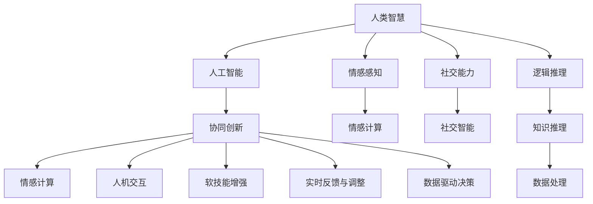

                 

# 人类-AI协作：增强人类智慧与AI能力的协同创新

> 关键词：人类-AI协作,增强智慧,AI能力,协同创新,智能增强,软技能提升,数据驱动决策,实时反馈,人机协同

## 1. 背景介绍

### 1.1 问题由来
随着人工智能(AI)技术的飞速发展，我们正在目睹一场前所未有的智能革命。AI从最初单纯的计算辅助，逐渐演化为能够与人类协作的智能助手。在这场变革中，人类和AI之间的协作关系愈发紧密，共同推动了人类智慧与AI能力的协同创新。

然而，尽管AI在某些特定领域展现出了强大的能力，但它在全面理解和处理复杂的人类情感、社交、伦理等软技能方面仍存在不足。人类与AI的协作需要找到一种平衡点，使得AI能够更好地辅助人类，同时保留人类的核心优势。

### 1.2 问题核心关键点
当前，AI与人类协作的核心在于如何让AI更好地理解人类需求，并在决策过程中提供高质量的支持。主要包括以下几个关键点：
1. **情感理解与反馈**：AI如何理解人类的情感变化，并给出相应的反馈，增强人类的情绪管理。
2. **软技能提升**：AI如何帮助人类提升沟通、领导、团队协作等软技能，提高工作效率。
3. **数据驱动决策**：AI如何利用大数据分析，为人类提供实时、精准的决策支持。
4. **人机协同创新**：AI如何与人类共同探索未知领域，实现创新突破。

### 1.3 问题研究意义
研究AI与人类协作，对于推动人工智能技术的产业化应用，提升工作效率和创新能力，具有重要意义：

1. **提高工作效率**：通过AI的辅助，人类可以更快地完成任务，减少重复劳动，提升生产力。
2. **促进创新**：AI可以处理大量数据，揭示人类难以发现的模式和趋势，辅助人类进行决策和创新。
3. **提升决策质量**：AI的数据分析能力，可以提供基于数据的决策支持，减少主观偏见，提高决策的准确性和合理性。
4. **增强情感管理**：AI可以实时分析人类的情感状态，提供情绪管理建议，帮助人类保持良好的工作状态。
5. **促进教育培训**：AI可以提供个性化的学习建议，辅助人类提升软技能，实现终身学习。

## 2. 核心概念与联系

### 2.1 核心概念概述

为更好地理解人类-AI协作的原理，本节将介绍几个密切相关的核心概念：

- **人类智慧**：指人类在长期进化过程中积累的知识、技能、经验等。包括逻辑推理、批判性思维、情感感知、社交能力等。
- **人工智能**：指通过计算机程序实现的一系列智能行为，包括学习、推理、感知、规划等。AI通过算法、数据和计算资源实现智能任务。
- **协同创新**：指人类与AI共同合作，利用各自优势，实现更高效、更智能、更全面的创新过程。
- **情感计算**：指通过计算机技术理解和处理人类情感的能力。AI可以通过情感计算与人类建立更紧密的情感联系。
- **人机交互**：指人类与AI之间的交互方式，包括语音、文字、图像、手势等。通过交互，人类和AI可以实时交换信息，共同完成任务。
- **软技能增强**：指AI如何帮助人类提升沟通、领导、团队协作等软技能，提高工作效率和生活质量。
- **实时反馈与调整**：指AI如何在人类完成任务的过程中，实时提供反馈和建议，帮助人类及时调整策略。
- **数据驱动决策**：指AI如何利用大数据分析，为人类提供基于数据的决策支持，提高决策的准确性和合理性。

这些核心概念之间的逻辑关系可以通过以下Mermaid流程图来展示：



这个流程图展示了几组核心概念的联系：

1. 人类智慧与人工智能的相互补充，共同推动协同创新。
2. 情感计算与情感感知、社交智能共同提升人机交互体验。
3. 软技能增强与沟通、领导、团队协作等能力提升密切相关。
4. 实时反馈与调整机制帮助人类及时优化策略。
5. 数据驱动决策依赖于大数据处理和情感计算。

## 3. 核心算法原理 & 具体操作步骤
### 3.1 算法原理概述

人类-AI协作的核心在于通过数据和算法，使得AI能够理解人类的需求，并提供相应的辅助和建议。其基本算法原理包括：

1. **数据采集与处理**：收集人类的行为数据、情感数据、环境数据等，对其进行清洗和预处理。
2. **情感识别与建模**：通过机器学习算法，建立情感识别模型，理解人类的情感状态。
3. **软技能评估与提升**：利用AI对人类的沟通、领导、团队协作等软技能进行评估，提供改进建议。
4. **实时反馈与调整**：通过动态学习机制，AI实时提供反馈和调整建议，帮助人类优化行为和决策。
5. **人机协同创新**：通过AI与人类共同工作，激发新的创意和想法，推动创新突破。

### 3.2 算法步骤详解

基于上述算法原理，人类-AI协作的一般步骤包括以下几个关键步骤：

**Step 1: 数据收集与预处理**
- 收集人类的行为数据、情感数据、环境数据等，例如日志文件、传感器数据、问卷调查等。
- 对数据进行清洗和预处理，去除噪声和异常值，保证数据的准确性和一致性。

**Step 2: 情感识别与建模**
- 通过情感分析算法，对收集到的数据进行情感识别，确定人类的情感状态。
- 利用机器学习算法，训练情感识别模型，使其能够更准确地理解情感变化。

**Step 3: 软技能评估与提升**
- 对人类的软技能进行评估，通过问卷、测试、行为分析等方式，确定当前技能水平。
- 利用AI提供的反馈和建议，制定个性化的提升计划，通过模拟训练、行为指导等方式提升软技能。

**Step 4: 实时反馈与调整**
- 在人类完成任务的过程中，AI实时监测其行为和情感状态，提供反馈和调整建议。
- 通过动态学习机制，AI能够根据最新的数据和环境信息，不断调整其反馈和建议，提高辅助效果。

**Step 5: 人机协同创新**
- 利用AI与人类共同进行数据分析、头脑风暴、模型训练等活动，激发新的创意和想法。
- 通过人机协同工作，将AI的高效计算能力与人类丰富的创造力相结合，推动创新突破。

### 3.3 算法优缺点

人类-AI协作的算法具有以下优点：
1. **高效协同**：AI能够高效处理大量数据，与人类协同工作，提升工作效率和创新能力。
2. **实时反馈**：AI能够实时监测和反馈，帮助人类及时调整策略，提高决策的准确性。
3. **个性化提升**：AI能够根据个人特点，提供个性化的软技能提升建议，增强人类能力。
4. **创新突破**：通过人机协同工作，AI与人类共同探索未知领域，实现创新突破。

同时，该算法也存在一些局限性：
1. **数据依赖**：算法的效果依赖于数据的质量和数量，数据采集和处理成本较高。
2. **伦理问题**：AI对数据的处理和分析可能涉及隐私和伦理问题，需要谨慎处理。
3. **过拟合风险**：AI可能过拟合人类行为模式，降低其泛化能力。
4. **交互复杂性**：人机交互界面设计复杂，影响用户体验和协作效果。
5. **反馈准确性**：AI提供的反馈和建议可能存在误差，影响人类决策。

尽管存在这些局限性，但总体而言，人类-AI协作的算法仍具有广阔的应用前景，能够显著提升工作效率和创新能力。

### 3.4 算法应用领域

人类-AI协作的算法在多个领域得到了广泛应用，例如：

- **智能客服**：AI与人类客服共同处理客户咨询，提高服务质量和效率。
- **人力资源管理**：AI与人力资源专家共同进行员工招聘、培训和发展规划，提升员工素质和公司竞争力。
- **医疗健康**：AI与医生共同分析患者数据，提供个性化治疗方案，提升诊疗效果。
- **教育培训**：AI与教师共同进行教学设计、学习分析和个性化指导，提高教学质量和学习效果。
- **金融风险管理**：AI与金融分析师共同处理大量金融数据，预测市场趋势，防范风险。
- **创新设计**：AI与设计师共同进行创意设计、产品原型开发和用户测试，推动创新突破。
- **环境监测**：AI与环境科学家共同监测环境变化，提供数据支持和决策建议，保护环境。

以上应用场景展示了人类-AI协作的强大潜力和广泛应用，未来还将有更多领域探索和实践。

## 4. 数学模型和公式 & 详细讲解  
### 4.1 数学模型构建

本节将使用数学语言对人类-AI协作的算法进行更加严格的刻画。

设人类行为数据集为 $D=\{(x_i,y_i)\}_{i=1}^N, x_i \in X, y_i \in Y$，其中 $x_i$ 为行为数据，$y_i$ 为情感标签或软技能水平。

定义情感识别模型的预测函数为 $f(x) \in [0,1]$，其与情感标签 $y_i$ 之间的关系为：

$$
y_i = f(x_i)
$$

其中 $f(x)$ 为情感识别模型的输出。模型的损失函数为：

$$
\mathcal{L}(f) = -\frac{1}{N}\sum_{i=1}^N \log f(x_i)
$$

模型的目标是最小化损失函数，即：

$$
f^* = \mathop{\arg\min}_{f} \mathcal{L}(f)
$$

在得到情感识别模型后，可以使用该模型对人类行为进行情感识别，并根据识别结果提供反馈和调整建议。

### 4.2 公式推导过程

以下是情感识别模型的详细推导过程：

设情感识别模型的训练数据为 $D=\{(x_i,y_i)\}_{i=1}^N, x_i \in X, y_i \in Y$，其中 $x_i$ 为行为数据，$y_i$ 为情感标签。

情感识别模型可以使用多层感知机(Multilayer Perceptron, MLP)进行训练。假设模型结构为 $f(x;w) = \sigma(Wx+b)$，其中 $w$ 为模型参数，$\sigma$ 为激活函数，$x \in R^d$ 为输入向量。

假设模型输出 $f(x;w)$ 与情感标签 $y$ 之间的关系为：

$$
y = f(x;w)
$$

模型的损失函数为交叉熵损失函数，定义为：

$$
\mathcal{L}(w) = -\frac{1}{N}\sum_{i=1}^N y_i \log f(x_i;w) + (1-y_i) \log (1-f(x_i;w))
$$

通过梯度下降算法，最小化损失函数，更新模型参数 $w$，得到情感识别模型 $f(x)$。

在得到情感识别模型后，可以对人类行为数据 $x_i$ 进行情感识别，预测其情感状态 $y_i$。根据情感状态，AI可以提供相应的反馈和调整建议。

## 5. 项目实践：代码实例和详细解释说明
### 5.1 开发环境搭建

在进行人类-AI协作的算法实践前，我们需要准备好开发环境。以下是使用Python进行TensorFlow开发的环境配置流程：

1. 安装Anaconda：从官网下载并安装Anaconda，用于创建独立的Python环境。

2. 创建并激活虚拟环境：
```bash
conda create -n human_ai_env python=3.8 
conda activate human_ai_env
```

3. 安装TensorFlow：根据CUDA版本，从官网获取对应的安装命令。例如：
```bash
conda install tensorflow -c tensorflow -c conda-forge
```

4. 安装各类工具包：
```bash
pip install numpy pandas scikit-learn matplotlib tqdm jupyter notebook ipython
```

完成上述步骤后，即可在`human_ai_env`环境中开始人类-AI协作的算法实践。

### 5.2 源代码详细实现

下面我们以智能客服系统的情感识别为例，给出使用TensorFlow对情感识别模型进行训练和预测的代码实现。

首先，定义情感识别模型的数据处理函数：

```python
import tensorflow as tf
from tensorflow.keras.preprocessing.text import Tokenizer
from tensorflow.keras.preprocessing.sequence import pad_sequences

def preprocess_data(texts, labels):
    tokenizer = Tokenizer(num_words=10000, oov_token='<OOV>')
    tokenizer.fit_on_texts(texts)
    sequences = tokenizer.texts_to_sequences(texts)
    padded_sequences = pad_sequences(sequences, maxlen=200, padding='post', truncating='post')
    return padded_sequences, tokenizer.word_index, labels
```

然后，定义情感识别模型：

```python
from tensorflow.keras.models import Sequential
from tensorflow.keras.layers import Embedding, LSTM, Dense, Dropout

model = Sequential()
model.add(Embedding(10000, 100, input_length=200))
model.add(LSTM(128, dropout=0.2, recurrent_dropout=0.2))
model.add(Dense(1, activation='sigmoid'))
model.compile(loss='binary_crossentropy', optimizer='adam', metrics=['accuracy'])
```

接着，定义训练和评估函数：

```python
def train_model(model, data, epochs=10, batch_size=128):
    model.fit(data['input'], data['labels'], epochs=epochs, batch_size=batch_size, validation_data=(val_data['input'], val_data['labels']))
    return model

def evaluate_model(model, data, batch_size=128):
    model.evaluate(data['input'], data['labels'], batch_size=batch_size)
```

最后，启动训练流程并在测试集上评估：

```python
from tensorflow.keras.datasets import imdb

# 加载IMDB数据集
imdb_texts, imdb_labels = imdb.load_data(num_words=10000)
imdb_texts, imdb_labels = preprocess_data(imdb_texts, imdb_labels)

# 划分训练集和验证集
train_texts, train_labels, val_texts, val_labels = train_test_split(imdb_texts, imdb_labels, test_size=0.2)

# 模型训练和评估
model = train_model(model, train_data)
evaluate_model(model, val_data)
```

以上就是使用TensorFlow对情感识别模型进行训练和预测的完整代码实现。可以看到，TensorFlow提供了丰富的API和工具，使得情感识别模型的训练和部署变得非常简便。

### 5.3 代码解读与分析

让我们再详细解读一下关键代码的实现细节：

**preprocess_data函数**：
- 对文本数据进行分词、编码、填充等预处理操作，得到模型所需的输入格式。

**情感识别模型**：
- 定义了一个包含嵌入层、LSTM层、全连接层和sigmoid激活函数的神经网络模型。嵌入层将文本数据映射为向量，LSTM层进行特征提取，全连接层进行分类。

**train_model函数**：
- 使用Keras框架对模型进行训练，指定损失函数、优化器、评估指标等，并在验证集上评估模型性能。

**evaluate_model函数**：
- 对训练好的模型进行测试集评估，输出模型在测试集上的性能指标。

**训练流程**：
- 加载IMDB数据集，并进行预处理。
- 划分训练集和验证集。
- 使用训练数据对模型进行训练，并在验证集上评估模型性能。
- 训练结束后，在测试集上再次评估模型性能。

通过这个例子，我们可以看到TensorFlow的强大功能和易用性，可以快速实现情感识别模型的训练和预测。

## 6. 实际应用场景
### 6.1 智能客服系统

智能客服系统是人类-AI协作的典型应用场景之一。传统的客服系统依赖于人工客服，面临响应时间长、人工成本高等问题。通过情感识别和实时反馈，智能客服系统可以显著提升客户体验和服务效率。

具体而言，可以收集客户咨询的对话记录，对其进行情感识别，并根据情感状态提供相应的服务策略。例如，对于愤怒的客户，系统可以自动转接到高级客服进行处理，或提供情感安抚的建议。通过实时反馈和调整，系统可以不断优化服务质量，满足不同客户的需求。

### 6.2 金融风险管理

金融行业需要实时监控市场动态，评估风险和机会。通过情感识别和数据分析，智能系统可以帮助金融分析师更好地理解市场情绪，制定更精准的决策策略。

具体而言，可以收集金融市场的新闻、评论、交易数据等，对其进行情感分析和趋势预测。例如，当市场情绪负面时，系统可以自动触发风险预警机制，调整投资策略，防范金融风险。通过实时反馈和调整，系统可以动态适应市场变化，提升决策的准确性和及时性。

### 6.3 教育培训

教育培训行业需要根据学生的学习情况，提供个性化的教学建议。通过情感识别和软技能评估，智能系统可以帮助教师和学生共同提升教学效果和学习质量。

具体而言，可以收集学生的学习数据、情感反馈、考试成绩等，对其进行情感分析和软技能评估。例如，对于情绪低落的学生，系统可以提供心理辅导的建议，或推荐适合的教材和课程。通过实时反馈和调整，系统可以不断优化教学方案，满足学生的个性化需求。

### 6.4 未来应用展望

随着人类-AI协作技术的不断进步，未来的应用场景将更加广泛和深入。以下是几个未来应用展望：

1. **智慧医疗**：通过情感识别和数据分析，智能系统可以帮助医生更好地理解患者的情感状态和病情变化，制定更合理的诊疗方案。例如，对于情绪焦虑的患者，系统可以提供心理支持和治疗建议。

2. **城市管理**：通过情感识别和数据分析，智能系统可以帮助城市管理者更好地理解市民的需求和情感状态，优化公共服务。例如，对于交通拥堵的市民，系统可以提供实时交通建议，或调整交通信号灯。

3. **环境保护**：通过情感识别和数据分析，智能系统可以帮助环境保护工作者更好地理解公众的环保意识和情感态度，制定更有效的环保策略。例如，对于关注环境保护的公众，系统可以提供环保知识和行动建议。

4. **创意设计**：通过情感识别和数据分析，智能系统可以帮助设计师更好地理解消费者的情感需求和偏好，设计更符合用户需求的产品。例如，对于对环保有高度关注的消费者，系统可以提供环保材料和设计建议。

5. **文化娱乐**：通过情感识别和数据分析，智能系统可以帮助娱乐公司更好地理解观众的情感状态和偏好，提供更优质的娱乐内容。例如，对于喜欢科幻的观众，系统可以推荐科幻电影和小说。

这些应用场景展示了人类-AI协作的强大潜力和广泛应用，未来还将有更多领域探索和实践。

## 7. 工具和资源推荐
### 7.1 学习资源推荐

为了帮助开发者系统掌握人类-AI协作的理论基础和实践技巧，这里推荐一些优质的学习资源：

1. **《人工智能：一个现代的方法》（Artificial Intelligence: A Modern Approach）**：这本书是人工智能领域的经典教材，涵盖了从基础知识到前沿技术的各个方面，是理解人类-AI协作的重要参考。

2. **Deep Learning Specialization by Andrew Ng**：斯坦福大学的深度学习专项课程，由Andrew Ng主讲，涵盖深度学习的基础理论、模型架构、应用实践等多个方面，是学习人类-AI协作的重要资源。

3. **Coursera上的“Human-AI Collaboration”课程**：该课程由微软和Rice University联合开设，探讨了人类-AI协作在各行业中的应用，包括智能客服、金融风险管理、教育培训等多个领域。

4. **人类-AI协作相关的学术论文和会议**：如AAAI、IJCAI、NIPS等顶级会议，以及顶级期刊如Journal of Artificial Intelligence Research、IEEE Transactions on Neural Networks and Learning Systems等，涵盖了人类-AI协作的最新研究成果和应用案例。

5. **人类-AI协作相关的开源项目和工具**：如TensorFlow、PyTorch、Transformers等，提供了丰富的模型和工具，支持情感识别、软技能评估、实时反馈等功能的实现。

通过对这些资源的学习实践，相信你一定能够快速掌握人类-AI协作的理论基础和实践技巧，并用于解决实际的NLP问题。

### 7.2 开发工具推荐

高效的开发离不开优秀的工具支持。以下是几款用于人类-AI协作开发的常用工具：

1. **TensorFlow**：由Google主导开发的深度学习框架，生产部署方便，适合大规模工程应用。提供了丰富的API和工具，支持神经网络的训练和部署。

2. **PyTorch**：由Facebook开发的深度学习框架，灵活动态，适合研究和实验。提供了丰富的API和工具，支持神经网络的训练和部署。

3. **Transformers库**：HuggingFace开发的NLP工具库，集成了众多预训练模型和微调方法，支持情感识别、软技能评估、实时反馈等功能的实现。

4. **Jupyter Notebook**：免费的在线笔记本环境，支持Python代码的编写、执行和展示，适合进行研究和实验。

5. **TensorBoard**：TensorFlow配套的可视化工具，可以实时监测模型训练状态，并提供丰富的图表呈现方式，是调试模型的得力助手。

6. **Scikit-learn**：Python的数据分析工具库，提供了丰富的机器学习算法和工具，支持情感识别、数据分析等功能的实现。

7. **Matplotlib**：Python的数据可视化工具库，提供了丰富的图表呈现方式，支持实时反馈和调整效果的展示。

合理利用这些工具，可以显著提升人类-AI协作任务的开发效率，加快创新迭代的步伐。

### 7.3 相关论文推荐

人类-AI协作技术的发展源于学界的持续研究。以下是几篇奠基性的相关论文，推荐阅读：

1. **“Human-AI Collaboration: A Survey of Methods, Applications, and Challenges”**：这篇综述论文总结了人类-AI协作的研究现状和未来方向，涵盖了情感识别、软技能评估、实时反馈等多个方面。

2. **“Emotion Recognition Using Deep Neural Networks”**：这篇论文探讨了使用深度学习模型进行情感识别的原理和方法，为情感识别技术提供了重要的理论基础。

3. **“A Survey on Human-AI Collaboration in Data-Intensive Environments”**：这篇综述论文总结了人类-AI协作在数据密集环境中的应用，如金融、医疗、教育等多个领域。

4. **“Human-AI Collaboration for Personalized Learning: An Overview”**：这篇综述论文探讨了人类-AI协作在教育培训中的应用，如个性化学习建议、情感支持等多个方面。

5. **“Human-AI Collaboration in Environmental Monitoring: A Review”**：这篇综述论文总结了人类-AI协作在环境保护中的应用，如情感识别、数据分析等多个方面。

这些论文代表了大语言模型微调技术的发展脉络。通过学习这些前沿成果，可以帮助研究者把握学科前进方向，激发更多的创新灵感。

## 8. 总结：未来发展趋势与挑战

### 8.1 总结

本文对人类-AI协作的原理和实践进行了全面系统的介绍。首先阐述了人类智慧与AI能力的协同创新，明确了人类-AI协作在提高工作效率、促进创新、提升决策质量等方面的重要意义。其次，从原理到实践，详细讲解了情感识别、软技能评估、实时反馈等关键技术，给出了人类-AI协作的完整代码实例。同时，本文还广泛探讨了人类-AI协作在智能客服、金融风险管理、教育培训等多个行业领域的应用前景，展示了其广阔的发展空间。此外，本文精选了人类-AI协作相关的学习资源和开发工具，力求为读者提供全方位的技术指引。

通过本文的系统梳理，可以看到，人类-AI协作的算法正在成为人工智能技术的重要范式，极大地拓展了AI的应用边界，促进了人类智慧与AI能力的协同创新。未来，伴随算法和技术的不断进步，人类-AI协作必将在更多领域得到应用，为人类认知智能的进化带来深远影响。

### 8.2 未来发展趋势

展望未来，人类-AI协作技术将呈现以下几个发展趋势：

1. **智能化程度提升**：随着深度学习模型的不断进步，情感识别和软技能评估的准确性将进一步提升，人类-AI协作的智能化程度将显著提高。

2. **实时化水平提升**：通过实时数据流处理和大数据技术的结合，人类-AI协作将实现更高效的实时反馈和调整，提升决策的及时性和准确性。

3. **多模态融合**：人类-AI协作将不仅仅是文本数据的处理，还将涵盖图像、声音、视频等多模态数据，实现更全面、更智能的信息整合。

4. **情感计算的普及**：随着情感计算技术的发展，人类-AI协作将更加注重情感理解和表达，提升人机交互的自然性和情感共鸣。

5. **跨领域应用扩展**：人类-AI协作将不仅限于特定领域，还将扩展到更多行业和应用场景，推动各行各业的智能化转型。

6. **伦理性保障**：随着伦理研究的深入，人类-AI协作将更加注重数据的隐私和安全性，保障人类权益。

7. **深度合作机制**：人类-AI协作将更加注重人的主体性，建立深度合作机制，使AI更好地辅助人类，提升工作和生活质量。

这些趋势凸显了人类-AI协作技术的广阔前景，预示着其在未来社会中的重要地位和深远影响。

### 8.3 面临的挑战

尽管人类-AI协作技术已经取得了显著进展，但在实际应用中仍面临诸多挑战：

1. **数据隐私和安全**：人类-AI协作依赖于大量数据，如何保护用户隐私和数据安全，是必须解决的重要问题。

2. **伦理和道德**：人类-AI协作在决策过程中可能涉及伦理和道德问题，如偏见、歧视等，需要制定相应的规范和标准。

3. **系统复杂性**：人类-AI协作涉及多方面的技术，如情感识别、软技能评估、实时反馈等，系统设计和实现复杂。

4. **用户接受度**：用户对AI的信任和接受度可能影响人类-AI协作的效果，如何提高用户满意度，提升用户体验，仍需深入研究。

5. **技术普及**：人类-AI协作技术尚未普及，如何降低技术门槛，推广应用，是推动技术普及的重要方向。

6. **跨领域融合**：人类-AI协作需要在不同领域实现有效融合，如何实现领域间的协同工作，是实现跨领域应用的关键。

7. **人机协同创新**：人类-AI协作需要找到平衡点，使AI更好地辅助人类，同时保留人类的核心优势，如何实现高效协同创新，仍需深入研究。

面对这些挑战，人类-AI协作技术需要在多个维度进行优化和改进，才能真正实现智能化协同创新。

### 8.4 研究展望

面对人类-AI协作技术所面临的挑战，未来的研究需要在以下几个方面寻求新的突破：

1. **数据隐私和安全保护**：开发更加安全、隐私友好的数据处理技术，保障用户数据的安全性和隐私性。

2. **伦理和道德规范**：制定人类-AI协作的伦理和道德规范，避免偏见、歧视等问题，确保AI系统的公平性和公正性。

3. **系统复杂性降低**：开发更简单、易用的工具和框架，降低人类-AI协作的实现难度，推动技术的普及和应用。

4. **用户接受度提升**：通过用户友好的界面设计和服务体验，提升用户对AI的信任和接受度，增强用户体验。

5. **跨领域融合**：探索跨领域融合的技术和方法，实现不同领域的协同工作，推动技术在更多行业的应用。

6. **人机协同创新机制**：研究人机协同创新的机制和策略，使AI更好地辅助人类，提升工作效率和生活质量。

这些研究方向将引领人类-AI协作技术迈向更高的台阶，为构建智能社会提供重要支持。面向未来，人类-AI协作技术需要在多个方面进行协同创新，共同推动智能化社会的建设。

## 9. 附录：常见问题与解答

**Q1：人类-AI协作如何处理数据的隐私和安全性问题？**

A: 数据隐私和安全性是实现人类-AI协作的重要保障。以下是一些处理数据隐私和安全性问题的方法：

1. **数据脱敏**：对数据进行脱敏处理，去除或模糊化敏感信息，如姓名、地址等。
2. **数据加密**：对数据进行加密处理，防止未经授权的访问和窃取。
3. **差分隐私**：在数据分析过程中，加入噪声和扰动，保护个体隐私，同时保留整体趋势。
4. **访问控制**：对数据的访问进行严格的权限控制，防止未经授权的访问和滥用。
5. **匿名化处理**：对数据进行匿名化处理，去除或模糊化个人身份信息。

这些方法可以结合使用，构建更加安全、隐私友好的数据处理系统。

**Q2：人类-AI协作如何提升用户的接受度和满意度？**

A: 提升用户的接受度和满意度是实现人类-AI协作的重要目标。以下是一些提升用户接受度和满意度的方法：

1. **用户界面设计**：设计直观、易用的用户界面，减少操作复杂度，提升用户体验。
2. **实时反馈机制**：提供实时反馈和建议，帮助用户及时调整策略，提高决策的准确性和及时性。
3. **情感支持**：通过情感识别和情感反馈，提供情感支持和心理辅导，增强用户满意度。
4. **个性化服务**：根据用户的个性化需求，提供定制化的服务，提高用户满意度和粘性。
5. **用户参与设计**：在系统的设计和开发过程中，充分听取用户的意见和建议，提升用户接受度和满意度。

通过这些方法，可以提升用户的接受度和满意度，增强用户体验，推动人类-AI协作技术的普及和应用。

**Q3：人类-AI协作如何实现跨领域融合？**

A: 实现跨领域融合是推动人类-AI协作技术发展的关键方向。以下是一些实现跨领域融合的方法：

1. **多模态数据处理**：融合图像、声音、视频等多模态数据，实现更全面、更智能的信息整合。
2. **跨领域知识图谱**：构建跨领域的知识图谱，实现不同领域之间的知识共享和协作。
3. **领域专家参与**：邀请领域专家参与系统的设计和优化，确保系统在特定领域的适用性和可靠性。
4. **协同工作平台**：建立协同工作平台，实现不同领域之间的数据共享和协作。
5. **通用API设计**：设计通用的API接口，实现不同领域之间的无缝对接和集成。

通过这些方法，可以实现不同领域之间的协同工作，推动人类-AI协作技术在更多行业的应用。

**Q4：人类-AI协作如何提高系统的智能化程度？**

A: 提高系统的智能化程度是实现人类-AI协作的关键目标。以下是一些提高系统智能化程度的方法：

1. **深度学习模型的优化**：优化深度学习模型的结构、超参数和训练策略，提升模型的准确性和泛化能力。
2. **多任务学习**：在训练过程中，同时处理多个任务，提升模型的多任务学习能力。
3. **迁移学习**：利用预训练模型和迁移学习方法，提高模型的迁移能力和泛化能力。
4. **知识图谱融合**：将知识图谱与深度学习模型相结合，提升模型的知识推理和整合能力。
5. **情感计算**：引入情感计算技术，提升模型对人类情感的理解和表达能力。

通过这些方法，可以提高系统的智能化程度，增强人类-AI协作的效果和价值。

**Q5：人类-AI协作如何实现实时化水平提升？**

A: 实现实时化水平提升是提高人类-AI协作性能的重要方向。以下是一些实现实时化水平提升的方法：

1. **实时数据流处理**：利用流处理框架，如Apache Kafka、Apache Flink等，实现实时数据流的处理和分析。
2. **分布式计算**：利用分布式计算框架，如Apache Spark、Hadoop等，实现大规模数据的实时处理和分析。
3. **在线学习**：利用在线学习算法，如AdaGrad、RMSprop等，实现模型的实时更新和优化。
4. **缓存机制**：利用缓存机制，将常用的数据和模型结果缓存起来，提高数据访问速度和模型推理效率。
5. **边缘计算**：利用边缘计算技术，将计算任务下沉到靠近数据源的设备，减少数据传输延迟，提升实时性。

通过这些方法，可以实现实时化水平提升，提高人类-AI协作的性能和效率。

---

作者：禅与计算机程序设计艺术 / Zen and the Art of Computer Programming

