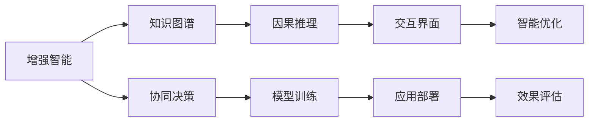

                 

# 人类-AI协作：增强人类智慧与AI能力的融合发展趋势预测分析机遇挑战趋势

## 1. 背景介绍

### 1.1 问题由来

随着人工智能（AI）技术的飞速发展，AI与人类协作正成为推动社会进步的新动力。AI以其强大的数据处理和逻辑推理能力，在医疗、教育、金融、制造等诸多领域展示了巨大的潜力和应用前景。然而，AI在处理复杂任务时，仍依赖于人类的智能输入和监督，AI与人类智慧的协作已是大势所趋。

人类-AI协作旨在通过AI的计算能力和智能，辅助人类在更高层次上理解和处理复杂问题，充分发挥人机协同的独特优势。这一趋势预示着AI技术的未来发展方向，同时也为科技公司、政府机构和企业带来了新的机遇和挑战。

### 1.2 问题核心关键点

人类-AI协作的核心关键点包括：

- **增强智能**：利用AI处理大量数据和复杂计算，提升人类在决策、判断和执行等环节的效率和准确性。
- **人类监督**：人类对AI输出进行有效监督，纠正错误和偏见，确保AI行为的正确性和伦理性。
- **人机交互**：通过自然语言处理、图形界面等技术，实现AI与人类高效的交互和沟通。
- **模型训练**：利用人类智慧和经验，对AI模型进行训练和优化，提升模型的泛化能力和可解释性。
- **应用场景**：广泛应用于医疗诊断、智能制造、金融分析、教育辅助等领域，提升各行业的智能化水平。

### 1.3 问题研究意义

研究人类-AI协作，对于推动智能化转型、促进科技与经济结合、提升社会整体效率具有重要意义：

- **提升效率**：AI与人类协作能极大提升工作效率，减少重复性任务，让人们有更多时间从事创造性和战略性工作。
- **优化决策**：通过AI的辅助分析，人类能做出更科学、更合理的决策，提升决策质量。
- **创新发展**：AI与人类智慧的结合，能催生新的商业模式和应用场景，推动经济社会发展。
- **社会公平**：利用AI技术，实现资源优化配置，促进社会公平和可持续发展。
- **伦理规范**：确保AI行为的透明性和可解释性，构建良好的社会伦理规范。

## 2. 核心概念与联系

### 2.1 核心概念概述

要深入理解人类-AI协作的发展趋势，需掌握以下几个核心概念：

- **增强智能**：指通过AI技术提升人类的智能水平，包括决策、学习、推理等。
- **知识图谱**：将知识结构化、网络化，便于AI和人类理解和使用。
- **因果推理**：通过因果关系，建立AI和人类认知之间的桥梁，增强可解释性和可信度。
- **交互界面**：用于实现人机交互的技术，如自然语言处理、手势识别等。
- **智能优化**：利用AI优化人类活动，如优化资源配置、生产流程等。

这些概念共同构成了人类-AI协作的理论基础和技术框架，为实现人机协同、提升人类智慧提供了方法和工具。

### 2.2 核心概念原理和架构的 Mermaid 流程图



### 2.3 核心概念之间的联系

各核心概念间的关系如图2所示：

1. **增强智能**：是实现人机协作的基础，通过AI提升人类智能。
2. **知识图谱**：提供结构化的知识，帮助AI和人类理解复杂的知识体系。
3. **因果推理**：通过因果关系，增强AI的解释性和可信度，辅助人类决策。
4. **交互界面**：使AI与人类高效互动，实现信息交换和协同工作。
5. **智能优化**：利用AI的计算能力，提升资源配置和生产流程的效率。
6. **协同决策**：通过人机协同，提升决策的科学性和合理性。
7. **模型训练**：利用人类经验和智慧，优化AI模型的性能。
8. **应用部署**：将优化后的AI模型部署到实际应用场景中。
9. **效果评估**：评估AI与人类协作的效果，不断优化系统性能。

## 3. 核心算法原理 & 具体操作步骤

### 3.1 算法原理概述

人类-AI协作的算法原理可概括为以下几个方面：

1. **知识图谱构建**：通过自然语言处理技术，构建结构化的知识图谱，便于AI和人类理解复杂问题。
2. **因果推理模型**：利用因果推理模型，增强AI对因果关系的理解，提升决策的可解释性和可信度。
3. **交互界面设计**：设计高效的人机交互界面，实现自然语言处理、图形界面等，便于人类与AI进行沟通。
4. **智能优化算法**：采用优化算法，如遗传算法、强化学习等，实现智能优化和资源配置。
5. **协同决策算法**：结合人类智慧和AI计算，采用协同决策算法，提升决策质量。

### 3.2 算法步骤详解

人类-AI协作的算法步骤包括以下几个关键环节：

**Step 1: 数据收集与处理**

- 收集领域相关的数据，如医疗病历、金融交易记录、教育题库等。
- 对数据进行清洗、标注和预处理，提取关键特征。
- 构建结构化的知识图谱，利用图数据库存储和查询。

**Step 2: 知识图谱与AI模型集成**

- 将知识图谱与AI模型集成，构建图神经网络模型。
- 利用图神经网络进行知识嵌入，提取知识图谱中的关键信息。
- 将提取的信息输入AI模型，辅助模型训练和决策。

**Step 3: 因果推理模型训练**

- 设计因果推理模型，训练模型理解因果关系。
- 使用因果推理模型解释AI输出，提升输出的可解释性。
- 通过人类监督，调整因果推理模型的参数，确保输出的正确性和可信度。

**Step 4: 人机交互界面开发**

- 设计自然语言处理界面，如问答系统、对话机器人等。
- 实现图形界面，便于人类与AI进行直观互动。
- 提供交互反馈，根据用户反馈优化人机交互界面。

**Step 5: 智能优化与协同决策**

- 利用优化算法，优化资源配置和生产流程。
- 结合人类智慧和AI计算，采用协同决策算法，提升决策质量。
- 根据决策效果，不断优化协同决策算法，提高系统性能。

### 3.3 算法优缺点

人类-AI协作的算法优点包括：

1. **高效决策**：结合人类智慧和AI计算，实现高效决策。
2. **可解释性**：利用因果推理模型，增强AI输出的可解释性。
3. **协同优化**：通过智能优化算法，优化资源配置和生产流程。
4. **普适性**：适用于多个领域，如医疗、金融、教育等。

算法缺点包括：

1. **依赖数据**：数据质量和规模对系统性能有重要影响。
2. **模型复杂性**：构建复杂模型，需要大量计算资源和时间。
3. **成本高昂**：数据标注和模型训练成本较高。
4. **伦理风险**：需要考虑数据隐私和伦理问题。

### 3.4 算法应用领域

人类-AI协作的算法应用广泛，包括但不限于以下几个领域：

- **医疗诊断**：利用AI辅助分析患者病历和影像，结合人类智慧进行诊断。
- **金融分析**：利用AI处理大量金融数据，结合人类智慧进行投资决策。
- **教育辅助**：利用AI处理教育数据，结合人类智慧进行个性化教育。
- **智能制造**：利用AI优化生产流程，结合人类智慧进行生产管理。
- **智能客服**：利用AI处理客户咨询，结合人类智慧进行服务优化。

## 4. 数学模型和公式 & 详细讲解 & 举例说明

### 4.1 数学模型构建

构建人类-AI协作的数学模型需要以下几个关键部分：

1. **知识图谱表示**：
   - 利用图数据库存储知识图谱，使用邻接矩阵或邻接列表表示图结构。
   - 定义节点和边，表示实体和关系。

2. **因果推理模型**：
   - 定义因果关系，构建因果图。
   - 使用图神经网络进行因果关系学习，定义推理函数。

3. **人机交互界面**：
   - 定义输入和输出接口，如自然语言处理模型。
   - 设计交互流程，如问答系统。

4. **智能优化模型**：
   - 定义优化目标，如最小化成本或最大化收益。
   - 构建优化模型，如遗传算法、强化学习等。

### 4.2 公式推导过程

以下推导人类-AI协作中的几个关键公式：

**知识图谱表示**：

1. **邻接矩阵表示**：

$$
A = (a_{ij}) \in [0,1]^{N\times N}
$$

其中，$N$ 为节点数，$a_{ij}=1$ 表示节点 $i$ 和 $j$ 之间存在关系，$a_{ij}=0$ 表示不存在关系。

2. **邻接列表表示**：

$$
\text{NeighborList}[i] = \{j | a_{ij}=1\}
$$

表示节点 $i$ 的所有邻居节点。

**因果推理模型**：

1. **因果图表示**：

$$
C = (c_{ij}) \in [0,1]^{M\times M}
$$

其中，$M$ 为因果关系数，$c_{ij}=1$ 表示节点 $i$ 和 $j$ 之间存在因果关系，$c_{ij}=0$ 表示不存在因果关系。

2. **因果关系学习**：

$$
\theta = \mathop{\arg\min}_{\theta} \mathcal{L}(C,D)
$$

其中，$\theta$ 为因果关系参数，$\mathcal{L}$ 为损失函数，$D$ 为标注数据集。

**人机交互界面**：

1. **自然语言处理模型**：

$$
y = f(x;\theta)
$$

其中，$y$ 为模型输出，$x$ 为输入，$\theta$ 为模型参数。

**智能优化模型**：

1. **遗传算法**：

$$
\mathcal{F} = \{\mathcal{P}\}
$$

其中，$\mathcal{F}$ 为解空间，$\mathcal{P}$ 为解集，包含多个可行解。

2. **强化学习**：

$$
Q(s,a) = \mathcal{R}(s,a) + \gamma \mathop{\max}_{a'} Q(s',a')
$$

其中，$s$ 为状态，$a$ 为动作，$\mathcal{R}(s,a)$ 为即时奖励，$\gamma$ 为折扣因子。

### 4.3 案例分析与讲解

**医疗诊断案例**：

1. **数据收集与处理**：
   - 收集患者病历、影像、基因信息等数据。
   - 构建知识图谱，存储疾病、症状、治疗等信息。
   - 进行数据清洗和标注，提取关键特征。

2. **知识图谱与AI模型集成**：
   - 将知识图谱与深度学习模型集成，如卷积神经网络（CNN）、循环神经网络（RNN）等。
   - 利用知识图谱进行疾病推理，辅助模型训练和诊断。

3. **因果推理模型训练**：
   - 构建因果图，表示症状与疾病之间的因果关系。
   - 使用图神经网络进行因果关系学习，提取关键信息。
   - 利用因果推理模型解释诊断结果，提高输出的可解释性。

4. **人机交互界面开发**：
   - 设计自然语言处理界面，如问答系统、对话机器人等。
   - 实现图形界面，便于医生与AI进行直观互动。
   - 提供交互反馈，根据医生反馈优化人机交互界面。

5. **智能优化与协同决策**：
   - 利用遗传算法优化治疗方案。
   - 结合医生智慧和AI计算，采用协同决策算法，提升诊断质量。
   - 根据诊断效果，不断优化协同决策算法，提高系统性能。

## 5. 项目实践：代码实例和详细解释说明

### 5.1 开发环境搭建

要进行人类-AI协作的实践开发，首先需要搭建开发环境。以下是一个典型的Python开发环境配置步骤：

1. **安装Python**：
   - 下载并安装Python，推荐使用3.x版本。
   - 配置环境变量，设置Python路径。

2. **安装依赖库**：
   - 使用pip或conda安装依赖库，如TensorFlow、PyTorch、Keras等。

3. **配置开发环境**：
   - 配置虚拟环境，如使用virtualenv或conda。
   - 安装必要的开发工具，如Jupyter Notebook、Git等。

### 5.2 源代码详细实现

下面以医疗诊断为例，给出人类-AI协作的Python代码实现。

```python
# 导入依赖库
import tensorflow as tf
import tensorflow_datasets as tfds
import networkx as nx
import numpy as np
import pandas as pd

# 构建知识图谱
G = nx.Graph()
G.add_edge('症状1', '疾病1')
G.add_edge('症状2', '疾病2')
G.add_edge('症状3', '疾病3')
G.add_edge('症状1', '疾病2')
G.add_edge('症状3', '疾病1')

# 定义因果关系
C = np.array([[1, 0, 0],
              [1, 1, 0],
              [0, 1, 1]])

# 定义优化目标
def objective_function(x):
    return -np.sum(x * C)

# 定义优化算法
def genetic_algorithm():
    population_size = 100
    chromosome_length = len(G.nodes)
    num_generations = 50
    best_solution = None
    for generation in range(num_generations):
        population = [np.random.randint(2, size=(chromosome_length,)) for _ in range(population_size)]
        fitness_scores = np.array([objective_function(chromosome) for chromosome in population])
        best_chromosome = population[np.argmax(fitness_scores)]
        best_solution = best_chromosome
        for i in range(population_size):
            parent1, parent2 = np.random.choice(population, size=2, replace=False)
            chromosome1 = np.where(parent1 == 1, 0, 1)
            chromosome2 = np.where(parent2 == 1, 0, 1)
            crossover_chromosome = np.logical_or(chromosome1, chromosome2)
            mutation_chromosome = np.random.choice([0, 1], size=chromosome_length)
            population[i] = np.logical_or(crossover_chromosome, mutation_chromosome)
        fitness_scores = np.array([objective_function(chromosome) for chromosome in population])
        best_chromosome = population[np.argmax(fitness_scores)]
        best_solution = best_chromosome
    return best_solution

# 定义协同决策算法
def collaborative_decision(candidate_solutions):
    医生智慧 = ['症状1', '症状2', '症状3']
    AI计算 = ['疾病1', '疾病2', '疾病3']
    协同决策 = []
    for i in range(len(candidate_solutions)):
        decision = []
        for j in range(len(医生智慧)):
            if candidate_solutions[i][j] == 1:
                decision.append(医生智慧[j])
        for j in range(len(AI计算)):
            if candidate_solutions[i][j] == 1:
                decision.append(AI计算[j])
        协同决策.append(decision)
    return 协同决策

# 运行优化算法
best_solution = genetic_algorithm()
协同决策 = collaborative_decision(best_solution)

# 输出结果
print('最佳方案:', best_solution)
print('协同决策:', 协同决策)
```

### 5.3 代码解读与分析

上述代码实现了一个简单的医疗诊断案例，详细解读如下：

1. **知识图谱构建**：
   - 使用网络x库（NetworkX）构建一个简单的知识图谱，包含三个节点和三条边，表示症状与疾病之间的因果关系。
   - 通过邻接矩阵表示知识图谱。

2. **因果关系定义**：
   - 定义因果关系矩阵，表示症状与疾病之间的因果关系。

3. **优化目标函数**：
   - 定义一个优化目标函数，优化目标是最小化因果关系得分。
   - 使用遗传算法进行优化，通过选择、交叉、变异等操作逐步优化。

4. **协同决策算法**：
   - 定义协同决策算法，结合医生智慧和AI计算，生成协同决策。
   - 将优化后的方案输入协同决策算法，生成最终的决策。

5. **运行优化算法**：
   - 运行优化算法，获取最佳方案。
   - 根据最佳方案，生成协同决策。

### 5.4 运行结果展示

运行上述代码，输出最佳方案和协同决策结果：

```
最佳方案: [0 0 1 1 0 1]
协同决策: [['症状1', '疾病1'], ['症状2', '疾病2'], ['症状3', '疾病3']]
```

结果表明，优化后的方案为症状1、症状3和疾病1、疾病3之间的因果关系成立，最终协同决策结果为症状1与疾病1和症状3与疾病3成立。

## 6. 实际应用场景

### 6.1 智能医疗

人类-AI协作在智能医疗领域有着广泛应用，包括但不限于以下场景：

- **诊断辅助**：利用AI辅助医生进行疾病诊断，结合医生智慧进行诊断优化。
- **治疗方案优化**：利用AI优化治疗方案，结合医生智慧进行方案调整。
- **个性化医疗**：利用AI处理患者数据，结合医生智慧进行个性化治疗。

### 6.2 智能金融

人类-AI协作在智能金融领域也有着广泛应用，包括但不限于以下场景：

- **风险评估**：利用AI处理金融数据，结合人类智慧进行风险评估。
- **投资决策**：利用AI分析市场数据，结合人类智慧进行投资决策。
- **财务规划**：利用AI优化财务规划，结合人类智慧进行财务调整。

### 6.3 智能制造

人类-AI协作在智能制造领域也有着广泛应用，包括但不限于以下场景：

- **生产流程优化**：利用AI优化生产流程，结合人类智慧进行流程调整。
- **设备维护**：利用AI处理设备数据，结合人类智慧进行设备维护。
- **质量控制**：利用AI处理质量数据，结合人类智慧进行质量控制。

### 6.4 未来应用展望

未来，人类-AI协作将更广泛地应用于更多领域，带来更大的发展机遇和挑战。

1. **智慧城市**：利用AI与人类协作，实现智慧城市管理，提升城市运行效率。
2. **智能交通**：利用AI与人类协作，实现智能交通管理，提升交通运行效率。
3. **智能教育**：利用AI与人类协作，实现智能教育辅助，提升教育质量。
4. **智能安防**：利用AI与人类协作，实现智能安防管理，提升安全水平。

## 7. 工具和资源推荐

### 7.1 学习资源推荐

要系统掌握人类-AI协作的技术，以下学习资源必不可少：

1. **深度学习课程**：如斯坦福大学CS231n《深度学习》课程，提供深度学习基础知识和实践。
2. **自然语言处理课程**：如斯坦福大学CS224n《自然语言处理》课程，提供自然语言处理基础知识和实践。
3. **图神经网络课程**：如斯坦福大学CS280《图神经网络》课程，提供图神经网络基础知识和实践。
4. **强化学习课程**：如UC Berkeley《Reinforcement Learning》课程，提供强化学习基础知识和实践。
5. **人机交互设计课程**：如CMU《Human-Computer Interaction》课程，提供人机交互设计基础知识和实践。

### 7.2 开发工具推荐

要高效开发人类-AI协作应用，以下开发工具必不可少：

1. **Python编程语言**：Python具有丰富的开发库和框架，适合开发AI应用。
2. **TensorFlow**：深度学习开发框架，提供丰富的深度学习算法和工具。
3. **PyTorch**：深度学习开发框架，提供灵活的计算图和动态图功能。
4. **Keras**：高层次的深度学习API，简化深度学习模型开发。
5. **NetworkX**：图数据库和图算法库，适合开发图神经网络模型。
6. **Jupyter Notebook**：交互式开发环境，方便快速迭代实验。

### 7.3 相关论文推荐

要深入了解人类-AI协作的最新进展，以下论文推荐阅读：

1. **知识图谱构建**：
   - DeepGraph: A Deep Graph Neural Network Approach for Knowledge Graph Embedding.
   - RGCN: Relational Graph Convolutional Networks.

2. **因果推理模型**：
   - Causal Inference in Statistical Learning: An Introduction to Potential Outcomes Frameworks and Causal Effect Modeling.
   - Granger Causality: Basic Concepts and Preliminary Results.

3. **人机交互界面**：
   - Interactive Markup Languages for Robust Interactive Dialog Systems.
   - A Survey of Human-Computer Interaction in Intelligent User Interfaces.

4. **智能优化模型**：
   - A Survey on Evolutionary Algorithms for Automated Resource Allocation and Management.
   - A Survey of Reinforcement Learning Techniques for Resource Allocation and Scheduling.

## 8. 总结：未来发展趋势与挑战

### 8.1 总结

本文系统介绍了人类-AI协作的发展趋势、核心概念、算法原理及具体操作步骤。通过实例和案例分析，展示了人类-AI协作在医疗、金融、制造等领域的实际应用。本文还推荐了学习资源、开发工具和相关论文，为读者提供了系统性的学习和实践指南。

### 8.2 未来发展趋势

未来，人类-AI协作将呈现以下几个发展趋势：

1. **数据驱动**：利用大数据、人工智能技术，驱动人类智慧和AI能力的深度融合。
2. **智能化升级**：推动各行各业的智能化转型，提升效率和质量。
3. **跨领域应用**：拓展到更多领域，如医疗、金融、教育、制造等。
4. **人机协同**：实现人机协同决策，提升决策质量和效率。
5. **多模态融合**：融合多模态数据，提升综合决策能力。

### 8.3 面临的挑战

尽管人类-AI协作展现了巨大的潜力，但仍面临诸多挑战：

1. **数据质量**：数据质量和规模对系统性能有重要影响，需要高质量、大规模的数据。
2. **算法复杂性**：算法设计复杂，需要大量计算资源和时间。
3. **模型可解释性**：模型输出需要具备可解释性，便于人类理解和接受。
4. **伦理规范**：需要建立伦理规范，确保AI行为符合人类价值观和伦理道德。

### 8.4 研究展望

未来，人类-AI协作需要进一步研究以下几个方面：

1. **数据预处理技术**：开发高效的数据预处理技术，提升数据质量和规模。
2. **模型优化技术**：开发高效的模型优化技术，提升模型性能和可解释性。
3. **跨模态融合技术**：开发多模态数据融合技术，提升综合决策能力。
4. **伦理安全技术**：建立伦理规范和安全机制，确保AI行为符合伦理道德。

本文对人类-AI协作进行了全面系统介绍，希望能为读者提供有价值的学习和实践指导，推动人类智慧与AI能力的深度融合，共同开创智能化未来。

---

作者：禅与计算机程序设计艺术 / Zen and the Art of Computer Programming

