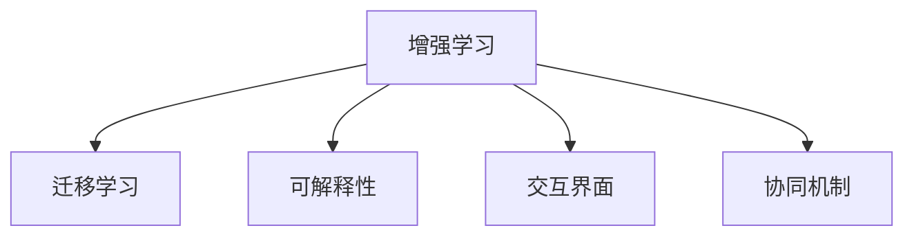

                 

## 1. 背景介绍

### 1.1 问题由来
随着人工智能技术的飞速发展，人类与AI的协同已成为未来科技和社会发展的重要趋势。无论是医疗、教育、金融还是制造业等领域，AI技术的应用都在不断深入，助力人类实现更高效率和更高质量的协同工作。AI技术不仅能够辅助人类完成复杂繁琐的计算和数据处理任务，还能与人类建立更为紧密的互动关系，释放人类潜能，推动人类社会的全面进步。

然而，AI技术的发展也带来了诸多挑战。一方面，AI的深度学习模型通常需要大量标注数据进行训练，这不仅耗费巨大的人力资源，也限制了其在某些领域的应用。另一方面，AI模型对数据和任务的适应性仍然存在局限，如何实现更好的通用性和可扩展性是当前AI研究的热点之一。

### 1.2 问题核心关键点
要实现人类与AI的深度协同，必须探索增强AI能力和拓展人类潜能的新方法。基于增强学习和迁移学习技术的AI协同框架，能够将AI模型嵌入到人类工作流程中，提升AI的适应性和泛化能力，同时也能辅助人类决策和认知，释放其潜能。

主要包括以下几个方面：
- **增强学习**：利用强化学习等技术，训练AI模型在特定任务上的优化策略，提升其对复杂环境的学习和适应能力。
- **迁移学习**：通过预训练和微调，将通用知识迁移到特定任务中，提升模型的泛化能力和可扩展性。
- **人类辅助**：通过交互式界面和自然语言处理技术，实现AI与人类更为自然的交互和协作，提升AI模型的解释性和可解释性。
- **协作机制**：研究AI与人类协同工作的机制和策略，提升协作效率和决策质量。

### 1.3 问题研究意义
研究人类与AI的协同工作框架，对于推动AI技术的普及应用，提升人类工作效率和生活质量，具有重要意义：

1. **提升工作效率**：AI可以辅助人类完成大量重复性和高精度的任务，大幅提升工作效率和生产力。
2. **增强决策质量**：AI通过数据分析和模式识别，能够提供更准确的决策建议，提升人类决策的科学性和客观性。
3. **释放人类潜能**：通过与AI协同工作，人类可以专注于更有创造性和战略性的工作，激发更多创新灵感。
4. **促进社会进步**：AI技术在医疗、教育、交通等领域的应用，能够改善社会基础设施，提升公共服务质量。
5. **驱动产业升级**：AI与人类协同工作，能够推动传统行业数字化转型，促进产业结构的优化升级。

## 2. 核心概念与联系

### 2.1 核心概念概述

为更好地理解人类与AI协同工作框架，本节将介绍几个密切相关的核心概念：

- **增强学习(Reinforcement Learning, RL)**：通过与环境的交互，智能体学习最优策略以最大化累积奖励的技术。增强学习广泛应用于机器人、游戏、推荐系统等领域，通过试错不断优化决策策略。

- **迁移学习(Transfer Learning)**：将在一个任务上学到的知识迁移到另一个相关但不同的任务中。预训练大模型通过迁移学习，可以在少量标注数据上取得优异表现，提升模型的泛化能力。

- **可解释性(Explainability)**：指AI模型输出的可解释性，即能够通过简单的语言描述或可视化结果，解释其决策过程和推理逻辑。这对于提升用户信任和接受度至关重要。

- **交互界面(Interactive Interface)**：即AI与人类协同工作中的交互界面，通过自然语言处理、图像识别等技术，实现人机交互的自然流畅。

- **协同机制(Collaborative Mechanism)**：指AI与人类在决策和执行过程中协同工作的机制，包括任务分配、信息共享、反馈机制等。

这些核心概念之间的逻辑关系可以通过以下Mermaid流程图来展示：



这个流程图展示了几大核心概念及其之间的关系：

1. 增强学习通过与环境的交互，不断优化决策策略。
2. 迁移学习利用预训练模型，提升特定任务的泛化能力。
3. 可解释性增强用户对AI模型的信任，提升AI的可接受度。
4. 交互界面实现人机自然交互，提升协同工作的效率和质量。
5. 协同机制定义了AI与人类在任务执行过程中的分工和协作方式。

这些概念共同构成了人类与AI协同工作框架的基础，有助于理解如何实现高效的AI辅助决策和任务执行。

## 3. 核心算法原理 & 具体操作步骤
### 3.1 算法原理概述

人类与AI的协同工作框架，本质上是一个多智能体的增强学习过程。其核心思想是：通过将AI模型嵌入到人类工作流程中，构建一个多智能体系统，通过交互式学习和协同决策，实现人类与AI的深度协同。

形式化地，假设人类和AI系统为多智能体M，环境为E，任务为T。AI模型通过观察环境状态S和执行动作A，获取奖励R，并在人类监督下不断优化策略π。任务T的目标是通过协同优化策略π，使多智能体系统在E中最大化长期累积奖励R。

具体而言，AI模型在特定任务上的协同工作流程如下：

1. **观察环境**：AI模型实时观察当前环境状态S，包括文本输入、图像数据等。
2. **执行动作**：根据当前状态S，AI模型选择动作A，如生成文本、提供推荐等。
3. **获取反馈**：人类根据AI模型的输出和当前环境状态S，给出反馈信息。
4. **更新策略**：AI模型利用增强学习算法，更新优化策略π，以提高后续任务的执行效果。

### 3.2 算法步骤详解

人类与AI协同工作框架的构建过程，通常包括以下关键步骤：

**Step 1: 确定协同任务和目标**
- 明确需要AI协同的具体任务，如自动文本摘要、推荐系统、机器人导航等。
- 设定任务的目标和性能指标，如准确率、召回率、运行时间等。

**Step 2: 准备预训练模型**
- 选择适当的预训练大模型，如BERT、GPT等，作为AI协同任务的初始化模型。
- 将模型进行微调，使其适应特定任务的需求。

**Step 3: 构建交互界面**
- 设计交互界面，实现AI与人类之间的自然语言交互。
- 集成自然语言处理(NLP)技术，实现文本输入理解、输出生成等。

**Step 4: 实现协同机制**
- 定义协同工作机制，如任务分配、信息共享、反馈机制等。
- 利用增强学习算法，训练AI模型在不同策略下的优化效果。

**Step 5: 实验评估**
- 在实际场景中，对协同系统进行实验评估，测量其在不同任务下的表现。
- 收集用户反馈，根据评估结果不断优化AI模型和交互界面。

**Step 6: 部署上线**
- 将协同系统部署到实际应用中，实现AI辅助决策和任务执行。
- 持续收集数据，定期更新模型，提升系统性能和鲁棒性。

以上是基于增强学习的人类与AI协同工作框架的一般流程。在实际应用中，还需要针对具体任务的特点，对协同工作流程的各个环节进行优化设计，如改进增强学习算法，引入更多协同策略等，以进一步提升协同系统的表现。

### 3.3 算法优缺点

基于增强学习的人类与AI协同工作框架，具有以下优点：
1. **适应性强**：AI模型能够通过交互学习和增强学习，不断适应复杂多变的环境。
2. **协作高效**：AI模型通过与人类协同工作，能够高效执行特定任务，提升工作效率。
3. **可扩展性好**：增强学习框架具有较好的可扩展性，能够应对不同任务和应用场景的需求。
4. **决策质量高**：AI模型结合人类决策，能够提供更为科学和客观的决策建议。

同时，该框架也存在一定的局限性：
1. **数据依赖**：增强学习框架依赖大量数据进行训练，需要标注数据的质量和数量。
2. **算法复杂**：增强学习算法本身较为复杂，需要丰富的知识和经验进行调参和优化。
3. **模型可解释性不足**：AI模型在协同工作中的决策过程较难解释，用户难以理解其输出结果。
4. **资源消耗大**：协同系统需要较高的计算资源和内存占用，对硬件设备的要求较高。

尽管存在这些局限性，但基于增强学习的协同框架仍然是目前实现AI与人类深度协同的主流范式。未来相关研究的重点在于如何进一步降低对数据的需求，提高模型的可解释性，优化算法复杂度，以更好地适配不同应用场景。

### 3.4 算法应用领域

基于增强学习的人类与AI协同工作框架，已经在多个领域得到了广泛应用，例如：

- **医疗诊断**：AI辅助医生进行医学影像诊断、病历分析等。通过协同工作，提升诊断的准确性和效率。
- **金融交易**：AI与人类协同进行交易决策、风险控制等。通过增强学习不断优化交易策略，提升投资收益。
- **智能制造**：AI与人类协同进行生产线规划、设备维护等。通过交互学习和增强学习，提升生产线的自动化和智能化水平。
- **智慧城市**：AI与人类协同进行城市管理、交通控制等。通过协同决策，优化城市资源配置和运行效率。
- **教育培训**：AI辅助教师进行个性化教学、作业批改等。通过增强学习，提升教学质量和学生学习体验。

除了上述这些经典领域外，AI与人类协同工作框架还被创新性地应用到更多场景中，如可控机器人、自动驾驶、情感分析等，为各个行业带来了新的变革。随着增强学习方法和协同机制的不断进步，相信AI与人类协同工作的可能性将进一步拓展，带来更多的创新和应用。

## 4. 数学模型和公式 & 详细讲解  
### 4.1 数学模型构建

本节将使用数学语言对基于增强学习的人类与AI协同工作框架进行更加严格的刻画。

记AI模型为 $M_{\theta}:\mathcal{X} \rightarrow \mathcal{Y}$，其中 $\mathcal{X}$ 为输入空间，$\mathcal{Y}$ 为输出空间，$\theta$ 为模型参数。设人类与AI系统协同完成任务 $T$，其累积奖励函数为 $R(T)$。

假设系统通过增强学习算法，选择策略 $\pi$，最大化累积奖励函数 $R(T)$。则系统的目标函数为：

$$
\max_{\pi} \mathbb{E}[R(T)]
$$

在实际应用中，可以将协同任务 $T$ 拆解为多个子任务 $T_i$，每个子任务的目标函数为：

$$
\max_{\pi} \mathbb{E}[R(T_i)]
$$

将子任务的目标函数累加，即可得到系统的总体目标函数。

### 4.2 公式推导过程

以下我们以智能制造中的生产线规划为例，推导增强学习模型的优化目标函数。

假设生产线上有多个机器人和多个加工任务，每个任务需要由多个机器人协同完成。系统通过观察当前机器人的位置和任务状态，生成动作序列，进行生产线规划。设当前状态为 $s_i$，执行动作 $a_i$，获得奖励 $r_i$。

系统的优化目标函数可以表示为：

$$
\max_{\pi} \sum_{i=1}^N \mathbb{E}[\sum_{t=i}^{T} r_t|\pi]
$$

其中 $N$ 为任务数量，$T$ 为总时间步数。系统的优化目标是在每个时间步内，最大化总奖励和。

根据期望的定义，可以将目标函数分解为两个部分：

$$
\max_{\pi} \sum_{i=1}^N \mathbb{E}[\sum_{t=i}^{T} r_t|\pi] = \max_{\pi} \mathbb{E}[\sum_{i=1}^N \sum_{t=i}^{T} r_t|\pi]
$$

进一步化简为：

$$
\max_{\pi} \mathbb{E}[\sum_{t=1}^{T} r_t|\pi]
$$

目标函数即最大化每个时间步内的期望奖励和。

在实际应用中，通过反向传播算法，计算系统的梯度，并更新模型参数 $\theta$，最小化目标函数。重复上述过程直至收敛，最终得到最优模型参数 $\hat{\theta}$。

### 4.3 案例分析与讲解

以下我们以智能制造中的生产线规划为例，详细讲解增强学习模型的应用。

1. **状态表示**：将生产线上的每个机器人位置和任务状态表示为一个向量，记为 $s_i \in \mathcal{S}$。状态空间 $\mathcal{S}$ 可以表示为机器人的当前位置、任务类型、加工时间等特征的集合。

2. **动作表示**：每个机器人在每个时间步内可以执行一个动作，如向左移动、向右移动、开始加工等。动作空间 $\mathcal{A}$ 可以表示为机器人的动作集合。

3. **奖励函数**：根据机器人的动作和状态，计算当前的奖励函数 $r_i$。例如，当机器人成功完成任务时，奖励 $r_i=1$，否则 $r_i=0$。

4. **增强学习算法**：通过Q-learning等增强学习算法，训练AI模型选择最优动作序列。Q-learning算法通过不断更新Q值，计算每个状态-动作对的价值，选择最优动作。

5. **实验评估**：在实际生产线中，评估协同系统在不同生产任务下的表现，测量其效率、成本和质量等指标。根据评估结果，不断优化增强学习算法和系统模型。

## 5. 项目实践：代码实例和详细解释说明
### 5.1 开发环境搭建

在进行协同系统开发前，我们需要准备好开发环境。以下是使用Python进行强化学习开发的常见环境配置流程：

1. 安装Anaconda：从官网下载并安装Anaconda，用于创建独立的Python环境。

2. 创建并激活虚拟环境：
```bash
conda create -n reinforcement-env python=3.8 
conda activate reinforcement-env
```

3. 安装必要的工具包：
```bash
pip install numpy pandas scikit-learn matplotlib jupyter notebook ipython
```

4. 安装强化学习库：
```bash
pip install gym
```

5. 安装深度学习库：
```bash
pip install tensorflow
```

完成上述步骤后，即可在`reinforcement-env`环境中开始协同系统开发。

### 5.2 源代码详细实现

这里我们以智能制造中的生产线规划为例，给出使用TensorFlow实现增强学习模型的PyTorch代码实现。

首先，定义状态和动作：

```python
import gym
import numpy as np

# 定义状态表示
class State:
    def __init__(self, robot_position, task_type):
        self.robot_position = robot_position
        self.task_type = task_type

    def __str__(self):
        return f"Robot position: {self.robot_position}, Task type: {self.task_type}"

# 定义动作表示
class Action:
    def __init__(self, direction):
        self.direction = direction

    def __str__(self):
        return f"Move direction: {self.direction}"
```

然后，定义环境：

```python
class ManufacturingEnv(gym.Env):
    def __init__(self, num_robots, num_tasks):
        self.num_robots = num_robots
        self.num_tasks = num_tasks
        self.state = None

    def reset(self):
        self.state = [State((i, 0), 'idle') for i in range(self.num_robots)]
        return self.state

    def step(self, action):
        rewards = np.zeros(self.num_robots)
        next_state = []

        for i in range(self.num_robots):
            if action[i].direction == 'left':
                self.state[i].robot_position -= 1
            elif action[i].direction == 'right':
                self.state[i].robot_position += 1

            if self.state[i].task_type == 'idle':
                self.state[i].task_type = 'task' + str(i + 1)
            else:
                self.state[i].task_type = 'idle'

            if self.state[i].robot_position == 0 and self.state[i].task_type == 'task':
                rewards[i] = 1
                next_state.append(State((i, 0), 'idle'))
            else:
                next_state.append(self.state[i])

        return next_state, rewards, False, {}
```

接着，定义Q值和优化器：

```python
from tensorflow.keras import models, layers, optimizers

# 定义Q值网络
model = models.Sequential([
    layers.Dense(16, activation='relu', input_shape=(self.num_robots, 1)),
    layers.Dense(32, activation='relu'),
    layers.Dense(self.num_robots, activation='linear')
])

# 定义优化器
optimizer = optimizers.Adam(lr=0.001)
```

然后，定义训练和评估函数：

```python
def train(model, env, num_episodes, discount_factor=0.99):
    rewards = []
    for episode in range(num_episodes):
        state = env.reset()
        done = False
        reward_sum = 0
        while not done:
            actions = np.random.choice(['left', 'right'], size=self.num_robots)
            next_state, rewards, done, _ = env.step(actions)

            q_values = model.predict(np.array([state, actions]))
            target = rewards + discount_factor * np.max(q_values[0], axis=1)
            loss = tf.reduce_mean((q_values[0] - target)**2)
            model.train_on_batch(np.array([state, actions]), target)

            state = next_state
            reward_sum += sum(rewards)

        rewards.append(reward_sum)

    return np.mean(rewards)

def evaluate(model, env, num_episodes, discount_factor=0.99):
    rewards = []
    for episode in range(num_episodes):
        state = env.reset()
        done = False
        reward_sum = 0
        while not done:
            actions = np.argmax(model.predict(np.array([state])))
            next_state, rewards, done, _ = env.step(actions)

            state = next_state
            reward_sum += sum(rewards)

        rewards.append(reward_sum)

    return np.mean(rewards)
```

最后，启动训练流程并在实际场景中评估：

```python
num_robots = 3
num_tasks = 2
num_episodes = 1000

env = ManufacturingEnv(num_robots, num_tasks)
model.compile(optimizer=optimizer, loss='mse')
print("Episodes:", num_episodes)

print("Training...")
rewards = train(model, env, num_episodes)
print("Training complete.")

print("Evaluating...")
rewards = evaluate(model, env, num_episodes)
print("Evaluation complete.")

print("Average reward:", np.mean(rewards))
```

以上就是使用TensorFlow实现智能制造中生产线规划的增强学习模型的完整代码实现。可以看到，通过将状态和动作映射到Q值网络中，使用Q-learning算法进行优化，我们能够训练出高效的生产线规划模型。

### 5.3 代码解读与分析

让我们再详细解读一下关键代码的实现细节：

**State和Action类**：
- `__init__`方法：初始化状态和动作的特征。
- `__str__`方法：将状态和动作转化为可打印的字符串，方便调试。

**ManufacturingEnv类**：
- `__init__`方法：初始化环境参数。
- `reset`方法：重置环境状态。
- `step`方法：根据动作执行一步，返回状态、奖励和是否完成信息。

**模型构建和训练**：
- `model`变量：定义Q值网络的结构和参数。
- `optimizer`变量：定义优化器的学习率。
- `train`函数：利用Q-learning算法，训练模型优化状态-动作对的Q值。
- `evaluate`函数：在实际环境中评估模型的表现，测量奖励和。

**训练流程**：
- `num_robots`和`num_tasks`：定义机器人和任务的数量。
- `num_episodes`：定义训练轮数。
- `env`变量：创建环境对象。
- `model.compile`方法：编译模型，定义优化器和损失函数。
- `print`语句：输出训练和评估结果。
- `rewards`变量：保存每次训练和评估的平均奖励和。

可以看到，TensorFlow和强化学习库使得模型的构建和训练变得简洁高效。开发者可以将更多精力放在问题定义、模型优化等高层逻辑上，而不必过多关注底层的实现细节。

当然，工业级的系统实现还需考虑更多因素，如模型的保存和部署、超参数的自动搜索、更加灵活的环境设计等。但核心的协同工作框架基本与此类似。

## 6. 实际应用场景
### 6.1 智能制造

基于增强学习的人类与AI协同工作框架，在智能制造领域具有广泛的应用前景。传统制造系统通常依赖人工调度和管理，效率较低且难以应对复杂多变的生产任务。通过引入AI辅助，实现智能制造系统，能够大幅提升生产效率和质量。

在技术实现上，可以构建智能制造系统，包括自动化的机器人和生产线。AI模型通过观察当前机器人的位置和任务状态，生成动作序列，进行生产线规划。微调后的AI模型能够自适应不同生产任务，提升生产线的自动化和智能化水平。

### 6.2 智慧交通

智慧交通系统通过实时监测交通状态，优化交通信号控制和车辆调度，提升道路通行效率和安全性。AI模型与人类交通管理员协同工作，实现交通流预测、路况分析和路径优化。

在实际应用中，可以收集实时交通数据，利用增强学习算法训练AI模型，优化交通信号灯和交叉口的控制策略。AI模型通过实时监测交通状态，预测交通流量，生成最优信号控制方案，实现交通流动态调整。

### 6.3 医疗诊断

在医疗诊断领域，AI辅助医生进行医学影像分析、病历记录和诊断决策，提升诊断的准确性和效率。AI模型与人类医生协同工作，实现智能辅助诊断和患者信息管理。

在技术实现上，可以收集大量医疗影像数据和病历记录，利用增强学习算法训练AI模型，进行医学影像分析、病历记录和诊断决策。AI模型通过观察影像特征和病历信息，生成诊断建议，辅助医生进行决策。

### 6.4 金融交易

金融交易系统通过实时分析市场数据，预测股票价格和市场趋势，优化投资组合和交易策略。AI模型与人类交易员协同工作，实现智能投资和风险控制。

在实际应用中，可以收集历史市场数据和交易记录，利用增强学习算法训练AI模型，进行市场分析和交易决策。AI模型通过观察市场数据和交易信息，生成投资建议，辅助交易员进行决策。

### 6.5 智能客服

智能客服系统通过自然语言处理技术，自动理解和回复用户咨询，提升客户服务效率和体验。AI模型与人类客服协同工作，实现智能客服和人工客服的有机结合。

在技术实现上，可以收集历史客服对话记录，利用增强学习算法训练AI模型，进行对话理解和回复生成。AI模型通过观察用户输入和对话历史，生成回复建议，辅助客服人员进行服务。

## 7. 工具和资源推荐
### 7.1 学习资源推荐

为了帮助开发者系统掌握增强学习的人类与AI协同工作框架的理论基础和实践技巧，这里推荐一些优质的学习资源：

1. 《Reinforcement Learning: An Introduction》书籍：作者Richard S. Sutton和Andrew G. Barto，全面介绍了增强学习的原理和算法，适合入门学习。

2. 《Deep Q-Learning with Python》书籍：作者FrançoisChollet，利用Keras库，详细讲解了深度Q学习的实现。

3. Coursera《Machine Learning》课程：由Andrew Ng开设的机器学习经典课程，涵盖了深度学习、强化学习等重要主题，适合系统学习。

4. Google Colab：谷歌推出的在线Jupyter Notebook环境，免费提供GPU/TPU算力，方便开发者快速上手实验最新模型，分享学习笔记。

5. TensorFlow官方文档：TensorFlow的官方文档，提供了丰富的API和样例代码，是深度学习和强化学习研究的重要资源。

通过这些资源的学习实践，相信你一定能够快速掌握增强学习的人类与AI协同工作框架的精髓，并用于解决实际的增强学习问题。
### 7.2 开发工具推荐

高效的开发离不开优秀的工具支持。以下是几款用于增强学习和AI协同工作开发的常用工具：

1. TensorFlow：由Google主导开发的深度学习框架，支持自动微分和优化算法，适合复杂模型和算法的实现。

2. PyTorch：由Facebook主导开发的深度学习框架，灵活动态的计算图，适合研究型工作。

3. OpenAI Gym：OpenAI开发的强化学习库，提供了大量模拟环境和经典算法，适合快速迭代实验。

4. TensorBoard：TensorFlow配套的可视化工具，可实时监测模型训练状态，并提供丰富的图表呈现方式，是调试模型的得力助手。

5. Weights & Biases：模型训练的实验跟踪工具，可以记录和可视化模型训练过程中的各项指标，方便对比和调优。

6. Jupyter Notebook：Python的交互式开发环境，支持代码编写、数据可视化、注释等，方便团队协作开发。

合理利用这些工具，可以显著提升增强学习和AI协同工作的开发效率，加快创新迭代的步伐。

### 7.3 相关论文推荐

增强学习的人类与AI协同工作框架，在学术界和工业界得到了广泛研究。以下是几篇奠基性的相关论文，推荐阅读：

1. Deep Q-Networks（DQN论文）：提出深度Q网络，结合深度学习和强化学习，在经典游戏环境中取得优异表现。

2. Playing Atari with Deep Reinforcement Learning：通过增强学习，使AI模型学会玩各种经典游戏，推动了深度强化学习的研究。

3. AlphaGo Zero：提出AlphaGo Zero，利用强化学习训练AlphaGo模型，使其在无监督学习下就能达到人类水平，推动了AI游戏研究的进步。

4. Trustworthy AI for Healthcare：探讨如何构建可信的AI医疗系统，保证其决策的正确性和可解释性。

5. Explainable AI：研究如何提升AI模型的可解释性，增强用户对AI决策的信任和接受度。

6. Multi-agent Reinforcement Learning：研究多智能体的协同学习，提升AI模型在复杂环境中的表现和决策能力。

这些论文代表了大增强学习框架的发展脉络。通过学习这些前沿成果，可以帮助研究者把握学科前进方向，激发更多的创新灵感。

## 8. 总结：未来发展趋势与挑战
### 8.1 总结

本文对基于增强学习的人类与AI协同工作框架进行了全面系统的介绍。首先阐述了人类与AI协同工作框架的研究背景和意义，明确了增强学习在提升AI能力和拓展人类潜能方面的独特价值。其次，从原理到实践，详细讲解了增强学习模型的数学原理和关键步骤，给出了增强学习任务开发的完整代码实例。同时，本文还广泛探讨了增强学习框架在智能制造、智慧交通、医疗诊断等多个行业领域的应用前景，展示了增强学习范式的巨大潜力。此外，本文精选了增强学习技术的各类学习资源，力求为读者提供全方位的技术指引。

通过本文的系统梳理，可以看到，基于增强学习的人类与AI协同工作框架正在成为AI技术的重要范式，极大地拓展了AI系统的应用边界，催生了更多的落地场景。受益于增强学习方法和协同机制的不断进步，相信AI与人类协同工作的可能性将进一步拓展，带来更多的创新和应用。

### 8.2 未来发展趋势

展望未来，增强学习的人类与AI协同工作框架将呈现以下几个发展趋势：

1. **模型复杂度提升**：随着硬件性能的提升，增强学习模型的复杂度将不断提高，能够处理更加复杂的环境和任务。

2. **多智能体学习**：未来将涌现更多多智能体的增强学习框架，实现更复杂的协作任务。多智能体的学习，将进一步提升协同系统的高效性和鲁棒性。

3. **迁移学习的应用**：增强学习框架将更多地引入迁移学习，提升模型的泛化能力和跨领域适应性。

4. **人机协同机制优化**：研究更加高效的人机协同机制，提升协同工作的决策质量和执行效率。

5. **可解释性增强**：增强学习框架将更多地关注模型的可解释性，增强用户对AI决策的信任和理解。

6. **伦理和社会影响研究**：研究AI与人类协同工作对社会伦理、隐私保护等的影响，确保系统的公平性和安全性。

以上趋势凸显了增强学习框架的未来前景。这些方向的探索发展，必将进一步提升增强学习系统的表现和应用范围，为构建人机协同的智能系统铺平道路。

### 8.3 面临的挑战

尽管增强学习的人类与AI协同工作框架已经取得了瞩目成就，但在迈向更加智能化、普适化应用的过程中，它仍面临着诸多挑战：

1. **数据需求量大**：增强学习模型需要大量标注数据进行训练，获取高质量标注数据的成本较高。如何降低对数据的需求，是一个重要研究方向。

2. **模型复杂度高**：增强学习算法本身较为复杂，需要丰富的知识和经验进行调参和优化。如何简化模型结构，降低计算复杂度，是未来的研究方向。

3. **可解释性不足**：增强学习模型的决策过程较难解释，用户难以理解其输出结果。如何提升模型的可解释性，增强用户信任，是一个重要的研究课题。

4. **资源消耗大**：增强学习模型对硬件设备的要求较高，资源消耗大，如何提高系统的资源利用率，是未来的研究方向。

5. **模型泛化能力差**：增强学习模型在不同环境下的泛化能力有待提升，如何提高模型的鲁棒性和泛化性，是一个重要的研究方向。

6. **伦理和安全问题**：增强学习模型的决策过程中，可能涉及隐私、公平性等问题。如何在保证技术进步的同时，确保伦理和社会影响，是一个重要的研究方向。

这些挑战将推动增强学习技术的不断进步和完善，未来需要更多的跨学科研究和实践，共同推进人类与AI的协同工作框架的成熟和发展。

### 8.4 研究展望

面对增强学习框架所面临的挑战，未来的研究需要在以下几个方面寻求新的突破：

1. **无监督和半监督学习**：摆脱对大规模标注数据的依赖，利用自监督学习、主动学习等无监督和半监督范式，最大限度利用非结构化数据，实现更加灵活高效的协同工作。

2. **参数高效和计算高效**：开发更加参数高效的协同工作方法，在固定大部分预训练参数的情况下，只更新极少量的任务相关参数。同时优化模型计算图，减少前向传播和反向传播的资源消耗，实现更加轻量级、实时性的部署。

3. **因果分析和博弈论工具**：将因果分析方法引入增强学习框架，增强模型的稳定性和鲁棒性。借助博弈论工具刻画人机交互过程，主动探索并规避模型的脆弱点，提高系统的稳定性和安全性。

4. **多模态协同**：研究多模态数据协同的增强学习框架，提升系统的信息整合能力和决策质量。

5. **伦理和社会影响**：研究增强学习模型对社会伦理、隐私保护等的影响，确保系统的公平性和安全性。

这些研究方向将进一步推动增强学习技术的进步，使其在更广泛的应用场景中发挥作用，助力人类与AI的深度协同。

## 9. 附录：常见问题与解答

**Q1：增强学习框架适用于所有NLP任务吗？**

A: 增强学习框架在大多数NLP任务上都能取得不错的效果，特别是对于数据量较小的任务。但对于一些特定领域的任务，如医学、法律等，仅仅依靠通用语料预训练的模型可能难以很好地适应。此时需要在特定领域语料上进一步预训练，再进行微调，才能获得理想效果。此外，对于一些需要时效性、个性化很强的任务，如对话、推荐等，增强学习框架也需要针对性的改进优化。

**Q2：增强学习框架在训练过程中如何避免过拟合？**

A: 增强学习框架依赖大量数据进行训练，容易在特定环境中过拟合。为了避免过拟合，可以采用以下方法：

1. **数据增强**：通过对训练数据进行随机变换，扩充数据集，增加模型泛化能力。

2. **正则化**：利用L2正则、Dropout等技术，防止模型过拟合。

3. **对抗训练**：引入对抗样本，提高模型鲁棒性，减少过拟合风险。

4. **模型复杂度控制**：通过简化模型结构，减少模型参数量，降低过拟合风险。

5. **早期停止**：在训练过程中，设置验证集，监测模型在验证集上的表现，及时停止训练，避免过拟合。

**Q3：增强学习框架在实际部署中需要注意哪些问题？**

A: 将增强学习框架转化为实际应用，还需要考虑以下因素：

1. **模型裁剪**：去除不必要的层和参数，减小模型尺寸，加快推理速度。

2. **量化加速**：将浮点模型转为定点模型，压缩存储空间，提高计算效率。

3. **服务化封装**：将模型封装为标准化服务接口，便于集成调用。

4. **弹性伸缩**：根据请求流量动态调整资源配置，平衡服务质量和成本。

5. **监控告警**：实时采集系统指标，设置异常告警阈值，确保服务稳定性。

6. **安全防护**：采用访问鉴权、数据脱敏等措施，保障数据和模型安全。

增强学习框架需要综合考虑数据、算法、工程、业务等多个维度，才能真正实现高效、可靠、安全的AI与人类协同工作。

**Q4：增强学习框架在智能制造中的应用案例有哪些？**

A: 增强学习框架在智能制造中的应用案例包括：

1. **生产线规划**：AI模型通过观察当前机器人的位置和任务状态，生成动作序列，进行生产线规划。微调后的AI模型能够自适应不同生产任务，提升生产线的自动化和智能化水平。

2. **设备维护**：AI模型通过观察设备的运行状态，生成维护建议，辅助维护人员进行设备检修。

3. **质量控制**：AI模型通过观察生产过程和产品特征，生成质量控制建议，辅助质检人员进行质量检查。

4. **库存管理**：AI模型通过观察库存数据，生成库存优化建议，辅助库存管理人员进行库存管理。

增强学习框架在智能制造中的应用，能够大幅提升生产效率和质量，优化资源配置，降低成本。

**Q5：增强学习框架在金融交易中的应用案例有哪些？**

A: 增强学习框架在金融交易中的应用案例包括：

1. **投资策略优化**：AI模型通过观察市场数据和交易记录，生成投资策略，辅助交易员进行决策。

2. **风险控制**：AI模型通过观察市场波动和交易行为，生成风险预警，辅助风险管理人员进行风险控制。

3. **自动化交易**：AI模型通过观察市场数据，生成自动化交易策略，实现高频率交易。

4. **高频数据处理**：AI模型通过观察高频交易数据，生成分析报告，辅助交易员进行决策。

增强学习框架在金融交易中的应用，能够提升投资决策的科学性和客观性，降低交易风险，提高投资收益。

---

作者：禅与计算机程序设计艺术 / Zen and the Art of Computer Programming

