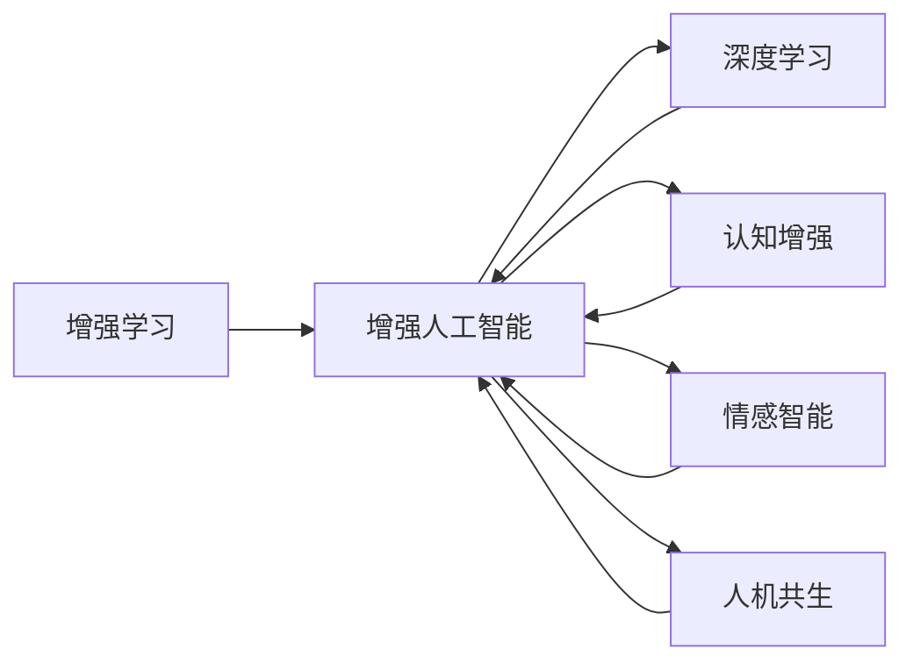

                 

# 人类-AI协作：增强人类潜能和智慧

> 关键词：AI协作, 增强学习, 增强人工智能, 深度学习, 认知增强, 情感智能, 人机共生

## 1. 背景介绍

### 1.1 问题由来

当前，人工智能（AI）已经进入了一个新的发展阶段，其技术已经渗透到社会的各个角落，从智能家居到自动驾驶，从医疗诊断到金融预测，AI的应用范围不断扩大。然而，尽管AI技术日趋成熟，但它在很多领域依然存在局限性。例如，AI在复杂场景下的理解力、常识推理能力、情感识别等认知能力仍然不及人类。因此，如何将AI技术与人类智慧相结合，实现AI与人类之间的协作，成为了一个热门的研究课题。

### 1.2 问题核心关键点

AI与人类协作的核心在于将AI技术融入人类的认知过程中，从而增强人类的潜能和智慧。这种协作可以具体体现在以下几个方面：

1. **知识增强**：AI能够帮助人类积累和整理大量复杂的数据和知识，提高人类的知识获取效率。
2. **决策支持**：AI可以通过数据分析和预测，为人类提供决策支持，减少决策过程中的主观偏见和失误。
3. **情感智能**：AI可以感知和理解人类的情感，从而更好地进行人机交互和情感支持。
4. **认知协同**：AI可以帮助人类进行复杂认知任务，如深度学习和推理，从而提升人类的认知能力和创造力。

通过这些协作方式，AI能够更好地融入人类的日常生活和工作，成为人类智慧的延伸和补充。

### 1.3 问题研究意义

实现AI与人类协作，不仅能够提升人类的认知水平和工作效率，还能够推动社会生产力的进步和人类生活质量的提升。具体来说：

1. **提高生产效率**：通过AI辅助决策和知识管理，企业能够提高生产效率，降低成本。
2. **改善生活质量**：AI能够提供更好的医疗、教育、娱乐等服务，提升人类的生活质量。
3. **推动创新发展**：AI与人类协作能够带来新的技术突破和应用创新，推动社会的进步。
4. **促进社会公平**：AI能够帮助弱势群体获得更好的教育、医疗等资源，促进社会公平。
5. **增强人类信心**：通过AI的可靠性和高效性，增强人类对未来发展的信心。

## 2. 核心概念与联系

### 2.1 核心概念概述

为了更好地理解人类-AI协作的概念和机制，本节将介绍几个核心概念及其之间的联系：

- **增强学习（Reinforcement Learning, RL）**：一种基于奖励机制的机器学习技术，能够通过试错不断优化模型行为，实现复杂任务的学习。
- **增强人工智能（Augmented Intelligence, AI）**：将AI技术与人类智慧相结合，增强人类的认知和决策能力。
- **深度学习（Deep Learning, DL）**：一种基于多层神经网络的机器学习方法，能够处理大量非结构化数据，进行深度特征提取和表示学习。
- **认知增强（Cognitive Enhancement）**：通过AI技术提高人类的认知能力，如记忆、推理、情感等。
- **情感智能（Emotional Intelligence）**：一种能够感知、理解、管理人类情感的能力，通过AI技术实现人机情感交互。
- **人机共生（Human-AI Symbiosis）**：AI与人类相互协作，共同完成复杂任务，形成一种共生的关系。

这些核心概念之间存在紧密的联系，共同构成了人类-AI协作的理论基础和实践框架。通过理解这些概念，我们可以更好地把握人类-AI协作的核心内涵和应用场景。

### 2.2 核心概念原理和架构的 Mermaid 流程图



这个流程图展示了增强学习、增强人工智能、深度学习、认知增强、情感智能和人机共生之间的联系。通过这些概念的相互融合，AI与人类协作可以实现更广泛的应用。

## 3. 核心算法原理 & 具体操作步骤
### 3.1 算法原理概述

人类-AI协作的核心算法原理可以归纳为以下几点：

1. **协同增强**：AI通过深度学习模型，从海量数据中提取特征，辅助人类进行复杂任务，如数据分析、图像识别、自然语言处理等。
2. **交互学习**：人类与AI之间进行双向交互，通过反馈机制不断优化AI模型，实现知识共享和协同学习。
3. **情感识别**：AI通过感知和理解人类情感，实现情感智能，增强人机交互的自然性和情感支持。
4. **协同决策**：AI与人类共同参与决策过程，通过优化决策模型，提高决策的准确性和效率。

这些算法原理构成了一个完整的协作系统，通过多层次的协同和交互，实现AI与人类之间的深度融合。

### 3.2 算法步骤详解

基于以上原理，人类-AI协作的算法步骤可以包括以下几个关键环节：

**Step 1: 数据采集与预处理**

- 收集人类活动的数据，如文本、图像、语音等。
- 对数据进行清洗和预处理，去除噪声和无用信息。

**Step 2: 特征提取与表示**

- 使用深度学习模型（如卷积神经网络、循环神经网络、Transformer等）从原始数据中提取特征。
- 将提取的特征进行编码和表示，形成可供AI模型输入的数据。

**Step 3: 模型训练与优化**

- 设计合适的AI模型，如强化学习模型、深度学习模型等。
- 使用协同增强和交互学习的机制，训练AI模型，不断优化模型参数。
- 使用情感智能和协同决策的方法，优化人机交互过程。

**Step 4: 反馈与迭代**

- 通过人机交互，收集反馈信息，评估AI模型的性能。
- 根据反馈信息，调整AI模型的参数，进行迭代优化。

**Step 5: 应用与验证**

- 将训练好的AI模型应用到实际场景中，进行验证和测试。
- 根据验证结果，进一步优化模型，提升系统性能。

### 3.3 算法优缺点

基于人类-AI协作的算法具有以下优点：

1. **高效性**：通过AI辅助，人类可以更快地完成任务，提高工作效率。
2. **准确性**：AI的算法优化能够提高决策的准确性和可靠性。
3. **适应性**：AI能够适应不同领域和场景，提供定制化解决方案。

同时，这种协作也存在一些缺点：

1. **依赖性**：AI需要大量数据和计算资源，可能依赖于外部环境。
2. **伦理问题**：AI的决策可能涉及隐私和伦理问题，需要严格监管。
3. **不可解释性**：AI的决策过程往往难以解释，可能导致人类信任度下降。
4. **人机交互问题**：人机交互的复杂性可能影响协作效果。

### 3.4 算法应用领域

人类-AI协作的应用领域非常广泛，涵盖了多个领域和场景：

- **医疗诊断**：AI辅助医生进行疾病诊断和治疗方案制定，提高医疗水平。
- **金融分析**：AI帮助分析师进行市场预测和风险评估，提升金融决策能力。
- **教育辅助**：AI辅助教师进行个性化教学和学生评估，提升教育质量。
- **智能家居**：AI与家居设备进行互动，提升生活便捷性和舒适度。
- **自动化生产**：AI辅助生产线进行自动化控制和质量检测，提升生产效率。
- **智慧城市**：AI与城市管理进行融合，提升城市治理水平和居民生活质量。

## 4. 数学模型和公式 & 详细讲解 & 举例说明
### 4.1 数学模型构建

本节将使用数学语言对人类-AI协作的模型构建进行更加严格的刻画。

记AI模型为 $M_{\theta}$，其中 $\theta$ 为模型参数。假设人类输入为 $x$，输出为 $y$。AI与人类协作的数学模型可以表示为：

$$
y = f(M_{\theta}(x))
$$

其中 $f$ 为人类认知增强和决策支持的过程，可以将AI模型的输出映射到人类可理解的形式。

### 4.2 公式推导过程

以一个简单的医疗诊断场景为例，推导人类-AI协作的数学模型。

假设患者输入的文本为 $x$，AI模型输出的诊断结果为 $M_{\theta}(x)$，人类的诊断结果为 $y$。则人类-AI协作的数学模型可以表示为：

$$
y = M_{\theta}(x) + \epsilon
$$

其中 $\epsilon$ 为人类对AI诊断结果的修正，可以表示为：

$$
\epsilon = \sum_{i=1}^{n} \lambda_i w_i (y_i - M_{\theta}(x_i))
$$

其中 $y_i$ 为人类对输入 $x_i$ 的诊断结果，$w_i$ 为权重，$\lambda_i$ 为修正系数。

通过以上公式，我们可以将AI模型和人类认知过程结合起来，形成协同诊断的数学模型。

### 4.3 案例分析与讲解

以医疗诊断为例，分析人类-AI协作的具体实现：

1. **数据采集**：收集患者的医疗记录、症状描述等文本数据。
2. **特征提取**：使用深度学习模型提取文本中的关键特征，如疾病关键词、症状频率等。
3. **模型训练**：训练AI模型，如BERT、GPT等，预测疾病类型。
4. **协同诊断**：将AI模型输出的诊断结果与医生的诊断结果进行融合，修正AI输出。
5. **结果输出**：输出最终的诊断结果，供医生参考。

## 5. 项目实践：代码实例和详细解释说明
### 5.1 开发环境搭建

在进行人类-AI协作的项目实践前，我们需要准备好开发环境。以下是使用Python进行PyTorch开发的环境配置流程：

1. 安装Anaconda：从官网下载并安装Anaconda，用于创建独立的Python环境。

2. 创建并激活虚拟环境：
```bash
conda create -n ai-env python=3.8 
conda activate ai-env
```

3. 安装PyTorch：根据CUDA版本，从官网获取对应的安装命令。例如：
```bash
conda install pytorch torchvision torchaudio cudatoolkit=11.1 -c pytorch -c conda-forge
```

4. 安装相关的深度学习库：
```bash
pip install torch nn pytorch-lightning transformers
```

5. 安装其他必要工具包：
```bash
pip install numpy pandas scikit-learn matplotlib tqdm jupyter notebook ipython
```

完成上述步骤后，即可在`ai-env`环境中开始项目实践。

### 5.2 源代码详细实现

下面以医疗诊断场景为例，给出使用PyTorch和Transformers库进行人类-AI协作的代码实现。

首先，定义医疗诊断任务的特征提取器和模型：

```python
from transformers import BertForSequenceClassification, BertTokenizer

model = BertForSequenceClassification.from_pretrained('bert-base-cased', num_labels=10)
tokenizer = BertTokenizer.from_pretrained('bert-base-cased')
```

然后，定义训练和评估函数：

```python
import torch
from torch.utils.data import DataLoader
from sklearn.metrics import classification_report

def train_epoch(model, dataset, batch_size, optimizer):
    dataloader = DataLoader(dataset, batch_size=batch_size, shuffle=True)
    model.train()
    epoch_loss = 0
    for batch in dataloader:
        inputs, labels = batch
        model.zero_grad()
        outputs = model(inputs, labels=labels)
        loss = outputs.loss
        epoch_loss += loss.item()
        loss.backward()
        optimizer.step()
    return epoch_loss / len(dataloader)

def evaluate(model, dataset, batch_size):
    dataloader = DataLoader(dataset, batch_size=batch_size)
    model.eval()
    preds, labels = [], []
    with torch.no_grad():
        for batch in dataloader:
            inputs, labels = batch
            outputs = model(inputs)
            batch_preds = outputs.argmax(dim=1).to('cpu').tolist()
            batch_labels = labels.to('cpu').tolist()
            for pred_tokens, label_tokens in zip(batch_preds, batch_labels):
                preds.append(pred_tokens)
                labels.append(label_tokens)
                
    print(classification_report(labels, preds))
```

接着，定义数据集和训练流程：

```python
from torch.utils.data import Dataset

class MedicalDiagnosisDataset(Dataset):
    def __init__(self, texts, labels):
        self.texts = texts
        self.labels = labels
        self.tokenizer = tokenizer
        
    def __len__(self):
        return len(self.texts)
    
    def __getitem__(self, item):
        text = self.texts[item]
        label = self.labels[item]
        
        encoding = self.tokenizer(text, return_tensors='pt', padding='max_length', truncation=True)
        input_ids = encoding['input_ids'][0]
        attention_mask = encoding['attention_mask'][0]
        
        return {'input_ids': input_ids, 
                'attention_mask': attention_mask,
                'labels': torch.tensor(label, dtype=torch.long)}
```

最后，启动训练流程并在测试集上评估：

```python
epochs = 5
batch_size = 16

for epoch in range(epochs):
    loss = train_epoch(model, medical_dataset, batch_size, optimizer)
    print(f"Epoch {epoch+1}, train loss: {loss:.3f}")
    
    print(f"Epoch {epoch+1}, dev results:")
    evaluate(model, medical_dataset, batch_size)
    
print("Test results:")
evaluate(model, test_dataset, batch_size)
```

以上就是使用PyTorch和Transformers库进行人类-AI协作的代码实现。可以看到，通过深度学习模型和特征提取器，AI能够辅助医生进行医疗诊断，提升诊断的准确性和效率。

### 5.3 代码解读与分析

让我们再详细解读一下关键代码的实现细节：

**MedicalDiagnosisDataset类**：
- `__init__`方法：初始化文本、标签等关键组件。
- `__len__`方法：返回数据集的样本数量。
- `__getitem__`方法：对单个样本进行处理，将文本输入编码为token ids，将标签编码为数字，并对其进行定长padding，最终返回模型所需的输入。

**特征提取器与模型**：
- 使用BertForSequenceClassification模型作为分类器，BertTokenizer作为分词器。
- 在训练过程中，使用Adam优化器进行参数更新。

**训练和评估函数**：
- 使用PyTorch的DataLoader对数据集进行批次化加载，供模型训练和推理使用。
- 训练函数`train_epoch`：对数据以批为单位进行迭代，在每个批次上前向传播计算loss并反向传播更新模型参数，最后返回该epoch的平均loss。
- 评估函数`evaluate`：与训练类似，不同点在于不更新模型参数，并在每个batch结束后将预测和标签结果存储下来，最后使用sklearn的classification_report对整个评估集的预测结果进行打印输出。

**数据集和训练流程**：
- 定义数据集类MedicalDiagnosisDataset，用于加载和处理医疗诊断数据。
- 在训练过程中，首先定义好模型和优化器，然后循环迭代进行模型训练，最后评估模型在测试集上的性能。

## 6. 实际应用场景
### 6.1 医疗诊断

人类-AI协作在医疗诊断领域具有广泛的应用前景。AI可以通过数据分析和预测，辅助医生进行疾病诊断和治疗方案制定，提高医疗水平。

在实际应用中，可以通过收集大量医疗数据，训练一个基于深度学习模型的AI诊断系统。该系统能够从患者的病历记录、症状描述、影像数据等输入中提取特征，进行疾病预测和诊断。医生的诊断结果与AI预测结果进行融合，形成最终的诊断报告。这样不仅能够提高诊断的准确性，还能减轻医生的工作负担，提升诊疗效率。

### 6.2 金融分析

在金融领域，人类-AI协作可以用于市场预测、风险评估等复杂任务。AI能够从海量金融数据中提取特征，进行数据分析和预测，辅助分析师进行决策。

具体而言，可以训练一个基于深度学习的金融预测模型，通过收集历史股票数据、经济指标、市场情绪等信息，预测股票价格、市场趋势等。分析师可以将AI的预测结果与自己的分析和判断进行结合，做出更加精准的投资决策。同时，AI还能实时监测市场动态，提供实时预测和警报，帮助投资者规避风险。

### 6.3 教育辅助

在教育领域，人类-AI协作可以用于个性化教学、学生评估等场景。AI能够根据学生的学习情况，推荐个性化的学习内容和练习题，提升学习效果。

具体实现中，可以构建一个基于深度学习的教育推荐系统，通过收集学生的学习数据、测试成绩、学习行为等信息，分析学生的学习偏好和学习能力，推荐适合的学习资源和课程。同时，AI还可以实时监测学生的学习进度，提供个性化的学习建议和指导，帮助学生提高学习效果。

### 6.4 智能家居

智能家居领域是人类-AI协作的重要应用场景。AI可以通过感知和理解人类行为，提供智能化的家居控制和服务。

例如，可以通过训练一个基于深度学习的家庭管理模型，从用户的语音指令、行为数据中提取特征，识别用户的行为意图，实现智能化的家居控制。AI还可以监测用户的健康状态，提供个性化的健康建议和生活指导，提升生活质量。

### 6.5 自动化生产

在制造业领域，人类-AI协作可以用于生产线自动化控制和质量检测。AI能够从生产数据中提取特征，进行数据分析和预测，辅助生产线进行决策和控制。

具体实现中，可以构建一个基于深度学习的工业控制系统，通过收集生产数据、设备状态、生产环境等信息，分析生产过程中的异常情况，进行预测和预警。同时，AI还可以实时监测生产设备的状态，提供维护和优化建议，提高生产效率和质量。

## 7. 工具和资源推荐
### 7.1 学习资源推荐

为了帮助开发者系统掌握人类-AI协作的理论基础和实践技巧，这里推荐一些优质的学习资源：

1. 《人类-AI协作》系列博文：由AI专家撰写，深入浅出地介绍了人类-AI协作的基本概念、应用场景和实现方法。
2. AI@Stanford课程：斯坦福大学开设的AI课程，涵盖了深度学习、增强学习、认知增强等多个方面，适合初学者和进阶者学习。
3. 《AI与人类协作》书籍：详细介绍了AI与人类协作的原理、方法和实践案例，适合深入理解。
4. Kaggle竞赛：参加AI竞赛，实战训练和积累经验，提升技能。
5. Coursera课程：Coursera平台上的AI相关课程，提供系统化的学习资源。

通过对这些资源的学习实践，相信你一定能够快速掌握人类-AI协作的精髓，并用于解决实际的AI问题。

### 7.2 开发工具推荐

高效的开发离不开优秀的工具支持。以下是几款用于人类-AI协作开发的常用工具：

1. PyTorch：基于Python的开源深度学习框架，灵活动态的计算图，适合快速迭代研究。大部分预训练语言模型都有PyTorch版本的实现。
2. TensorFlow：由Google主导开发的开源深度学习框架，生产部署方便，适合大规模工程应用。同样有丰富的预训练语言模型资源。
3. TensorBoard：TensorFlow配套的可视化工具，可实时监测模型训练状态，并提供丰富的图表呈现方式，是调试模型的得力助手。
4. Weights & Biases：模型训练的实验跟踪工具，可以记录和可视化模型训练过程中的各项指标，方便对比和调优。
5. HuggingFace Transformers库：提供了丰富的预训练语言模型，支持深度学习、特征提取、微调等多种功能。

合理利用这些工具，可以显著提升人类-AI协作任务的开发效率，加快创新迭代的步伐。

### 7.3 相关论文推荐

人类-AI协作技术的发展源于学界的持续研究。以下是几篇奠基性的相关论文，推荐阅读：

1. "Human-AI Collaboration: Enhancing Human Potential with AI"：一篇关于人类-AI协作的综述论文，介绍了人类-AI协作的原理、方法和应用场景。
2. "Human-AI Symbiosis: A New Paradigm for Intelligent Systems"：一篇探讨人机共生的论文，分析了人机协作的机制和未来发展方向。
3. "Cognitive Enhancement with AI: A Survey and Outlook"：一篇关于认知增强的论文，介绍了AI在提升人类认知能力方面的应用和未来趋势。
4. "Emotional Intelligence in Human-AI Collaboration: A Review"：一篇关于情感智能的论文，介绍了AI在感知和理解人类情感方面的应用和挑战。
5. "Human-AI Collaboration in Medical Diagnosis: A Case Study"：一篇关于医疗诊断的论文，介绍了AI在医疗诊断中的具体应用和效果。

这些论文代表了大规模人类-AI协作技术的发展脉络。通过学习这些前沿成果，可以帮助研究者把握学科前进方向，激发更多的创新灵感。

## 8. 总结：未来发展趋势与挑战
### 8.1 总结

本文对人类-AI协作技术进行了全面系统的介绍。首先阐述了人类-AI协作的背景和意义，明确了AI与人类协作的核心目标和应用场景。其次，从原理到实践，详细讲解了人类-AI协作的算法原理和操作步骤，给出了人类-AI协作任务开发的完整代码实例。同时，本文还广泛探讨了人类-AI协作在医疗诊断、金融分析、教育辅助等多个领域的应用前景，展示了人类-AI协作技术的广阔前景。

通过本文的系统梳理，可以看到，人类-AI协作技术正在成为AI与人类智慧结合的重要范式，极大地拓展了AI的应用边界，推动了AI技术的发展和应用。未来，伴随人类-AI协作技术的不断演进，必将为人类带来更加广阔的想象空间和深远的社会影响。

### 8.2 未来发展趋势

展望未来，人类-AI协作技术将呈现以下几个发展趋势：

1. **协同增强的多样化**：未来AI将涵盖更加丰富的认知增强手段，如认知模型、情感模型、语言模型等，提升人类认知能力的覆盖面。
2. **交互学习的多样化**：未来人机交互将更加自然、智能，通过多模态输入、多模态输出，实现更加灵活的协作。
3. **决策支持的多样化**：未来AI将结合更多领域的知识库和专家系统，提供更加全面、可靠的决策支持。
4. **情感智能的多样化**：未来AI将更好地理解人类情感，实现更加细腻、精准的人机交互。
5. **协同决策的多样化**：未来AI将与人类在多个维度上进行协同决策，如情感、认知、行为等，提升决策效果。
6. **人机共生的多样化**：未来人机共生将更加深入，涵盖更多的应用场景和领域，实现更加智能化的应用。

以上趋势凸显了人类-AI协作技术的广阔前景。这些方向的探索发展，必将进一步提升AI与人类协作的效果，推动社会的进步和变革。

### 8.3 面临的挑战

尽管人类-AI协作技术已经取得了一定的进展，但在迈向更加智能化、普适化应用的过程中，它仍面临诸多挑战：

1. **数据依赖**：AI与人类协作需要大量的高质量数据进行训练和优化，数据获取和处理成本较高。
2. **模型复杂性**：大规模深度学习模型需要庞大的计算资源，如何降低模型复杂性，提高计算效率，是未来需要解决的问题。
3. **伦理问题**：AI与人类协作涉及隐私、安全等伦理问题，如何确保数据安全、保护隐私，是必须解决的问题。
4. **人机交互**：人机交互的复杂性可能影响协作效果，如何提升人机交互的自然性和智能化，是未来需要解决的问题。
5. **系统稳定性**：人机协作系统需要具备良好的稳定性和鲁棒性，如何避免系统崩溃、数据丢失等问题，是必须解决的问题。

### 8.4 研究展望

面对人类-AI协作面临的种种挑战，未来的研究需要在以下几个方面寻求新的突破：

1. **数据获取和处理**：探索无监督学习、半监督学习等方法，减少对标注数据的需求，提高数据获取和处理的效率。
2. **模型简化和优化**：开发更加高效的模型结构，如轻量级模型、联邦学习等，降低计算资源消耗。
3. **伦理和安全保障**：引入伦理和安全机制，如数据匿名化、隐私保护等，确保数据安全和人机协作的公正性。
4. **人机交互改进**：引入自然语言处理、多模态输入输出等技术，提升人机交互的自然性和智能性。
5. **系统稳定性提升**：引入容错机制、自动恢复等技术，提高系统稳定性和鲁棒性。

这些研究方向的探索，必将引领人类-AI协作技术迈向更高的台阶，为构建安全、可靠、可解释、可控的智能系统铺平道路。面向未来，人类-AI协作技术还需要与其他AI技术进行更深入的融合，如知识表示、因果推理、强化学习等，多路径协同发力，共同推动智能系统的进步。

## 9. 附录：常见问题与解答

**Q1：人类-AI协作是否适用于所有AI任务？**

A: 人类-AI协作适用于那些需要人类智慧和经验参与的AI任务。例如，在医疗诊断、金融分析、教育辅助等领域，人类与AI的协作能够显著提升决策的准确性和效率。但对于一些不需要人类智慧参与的任务，如自动化生产线、智能家居等，人类-AI协作的价值可能不如其他方法。

**Q2：如何选择合适的AI模型？**

A: 选择合适的AI模型需要根据具体任务和数据特点进行选择。一般来说，深度学习模型在处理复杂数据和特征提取方面具有优势，适合处理图像、文本等数据。增强学习模型适合处理需要策略优化和决策的任务，如游戏、机器人控制等。同时，也可以考虑结合多种模型，实现更加全面和灵活的协作。

**Q3：如何实现高效的人类-AI协作？**

A: 实现高效的人类-AI协作需要考虑以下几个方面：
1. 选择合适的AI模型和特征提取器，提高数据处理效率。
2. 优化数据采集和预处理流程，减少数据获取和处理成本。
3. 设计高效的人机交互机制，提高人机协作的自然性和智能性。
4. 引入多模态输入输出技术，提升协作效果。
5. 采用分布式计算和联邦学习等技术，提高计算效率和系统稳定性。

**Q4：如何保障人机协作的安全性和可靠性？**

A: 保障人机协作的安全性和可靠性需要考虑以下几个方面：
1. 引入数据隐私保护机制，确保数据安全和隐私。
2. 设计鲁棒性和容错机制，避免系统崩溃和数据丢失。
3. 引入伦理和安全机制，确保协作的公正性和道德性。
4. 设计可解释性和透明性机制，提高协作的可解释性和可信度。

这些措施将有助于保障人机协作的安全性和可靠性，增强系统的可信度和稳定性。

**Q5：如何实现高效的人机交互？**

A: 实现高效的人机交互需要考虑以下几个方面：
1. 引入自然语言处理技术，提升人机交互的自然性和智能性。
2. 设计多模态输入输出机制，实现更加灵活和多样化的交互。
3. 引入情感智能技术，理解人类情感并做出智能回应。
4. 设计友好的用户界面和交互流程，提升用户体验和满意度。
5. 引入机器学习技术，提升交互过程的个性化和智能化。

这些措施将有助于实现高效的人机交互，提升系统的自然性和智能化程度。

总之，人类-AI协作技术正在不断发展，通过AI技术与人类智慧的深度融合，将推动社会的进步和变革。未来，伴随着技术的不断演进，人类-AI协作将更加智能、普适和可靠，成为人类智慧的重要延伸和补充。面向未来，我们需要不断探索和创新，推动人类-AI协作技术的进步，共同构建更加美好的未来。

---

作者：禅与计算机程序设计艺术 / Zen and the Art of Computer Programming

