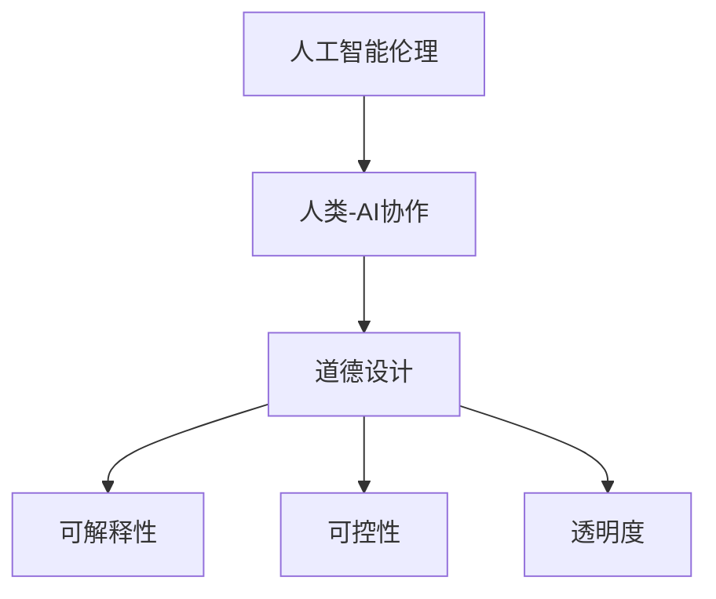
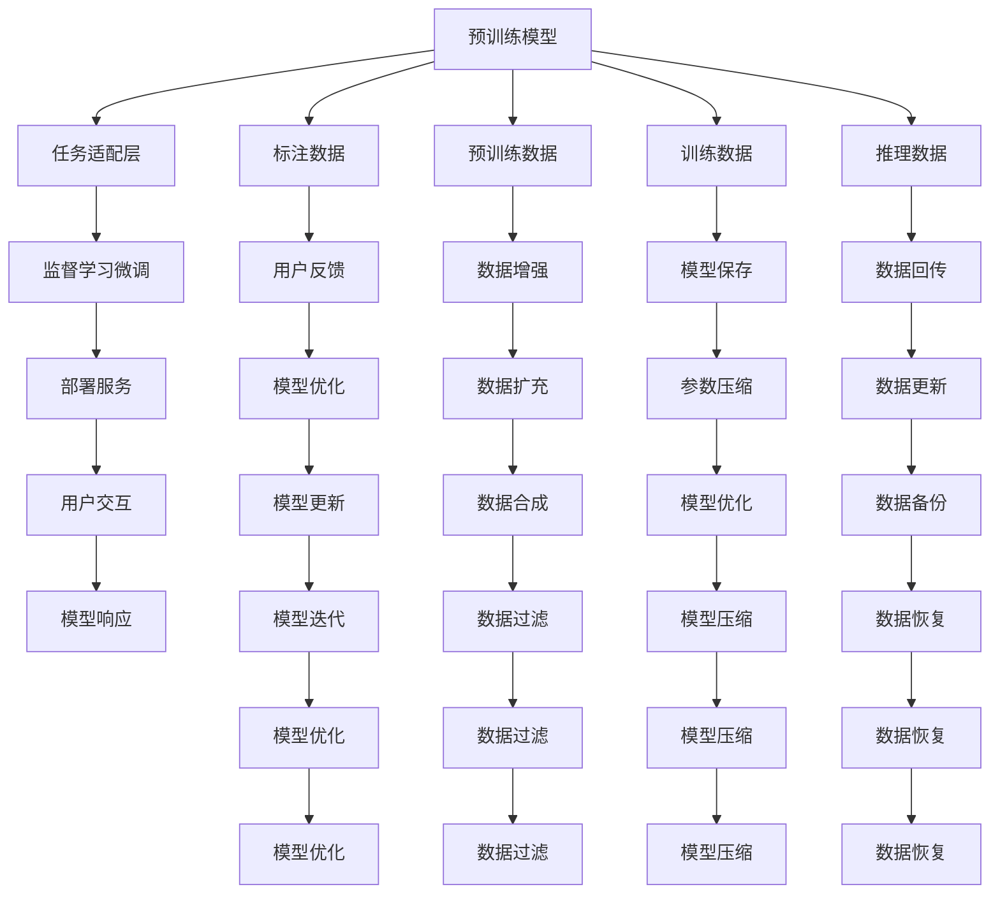

                 

## 1. 背景介绍

随着人工智能(AI)技术的不断进步，人类与AI的协作正逐步成为现代社会不可或缺的一部分。无论是自动驾驶、医疗诊断、智能客服还是教育培训，AI技术都在为人类生活和工作提供便利。然而，随着AI技术的深度应用，也带来了伦理道德层面的诸多挑战。如何确保AI技术的使用符合伦理道德规范，设计出负责任、可解释、可控的AI系统，成为了当今学术界和工业界共同关注的重要课题。本文将从道德设计（Moral Design）的角度，探讨如何在AI系统中融入伦理道德考量，保障人机协作的公正、透明、可控。

## 2. 核心概念与联系

### 2.1 核心概念概述

为了深入理解AI伦理道德设计，首先介绍几个核心概念及其联系：

- **人工智能伦理(Ethics of Artificial Intelligence)**：涉及AI技术的开发和应用过程中，所涉及的伦理道德问题，如隐私、公平、责任归属等。
- **人类-AI协作(Human-AI Collaboration)**：指人与AI系统在共同完成任务过程中，彼此的角色和责任关系。
- **道德设计(Moral Design)**：旨在通过系统设计和伦理考量，设计出符合道德规范的AI系统。
- **可解释性(Explainability)**：指AI系统输出结果的可解释性，即能清晰解释系统如何进行推理和决策。
- **可控性(Controllability)**：指用户对AI系统行为的监督和控制能力。
- **透明度(Transparency)**：指AI系统的内部工作机制、数据流向、决策逻辑等对用户的公开程度。

以上概念之间的逻辑关系可以通过以下Mermaid流程图来展示：



该流程图展示了从伦理道德到人机协作，再到AI系统设计中的各个关键环节。

### 2.2 核心概念原理和架构的 Mermaid 流程图

为了更好地理解这些概念之间的关系，以下是通过Mermaid流程图展示的简化架构图：



这个流程图展示了AI系统从预训练、微调、部署到用户反馈、优化等全过程，以及与之相关的伦理道德考量。

## 3. 核心算法原理 & 具体操作步骤

### 3.1 算法原理概述

在AI系统中融入伦理道德考量，通常需要通过以下几个关键步骤实现：

1. **数据治理与隐私保护**：确保数据的合法获取、使用和存储，遵守隐私保护法规，如GDPR、CCPA等。
2. **算法透明性与可解释性**：使AI系统的决策过程透明、可解释，便于用户理解和信任。
3. **责任归属与问责机制**：明确AI系统在决策过程中的责任归属，设计合理的问责机制。
4. **公平性与偏见消除**：消除算法中的歧视和偏见，确保不同群体获得公平对待。
5. **社会影响与公共参与**：评估AI系统的社会影响，并通过公共参与确保系统符合公共利益。

### 3.2 算法步骤详解

下面详细介绍这些关键步骤的详细步骤：

#### 3.2.1 数据治理与隐私保护

1. **数据来源合法性检查**：确保数据的获取符合法律规定，如同意授权、公开数据集等。
2. **数据匿名化与脱敏**：对涉及个人隐私的数据进行匿名化和脱敏处理。
3. **数据存储与访问控制**：采用安全的数据存储方案和访问控制措施，防止数据泄露。

#### 3.2.2 算法透明性与可解释性

1. **模型可解释性工具**：使用可解释性工具，如LIME、SHAP等，解释AI系统的决策过程。
2. **模型可视化与报告**：生成可视化图表和报告，展示模型的输入、输出和中间状态。
3. **用户交互界面**：设计直观易用的用户交互界面，便于用户理解和使用。

#### 3.2.3 责任归属与问责机制

1. **责任分配原则**：明确AI系统在不同场景下的责任分配原则，如基于预训练模型、任务适配层等。
2. **问责机制设计**：建立完善的问责机制，确保在出现问题时能够及时追溯和解决。
3. **用户参与与反馈**：鼓励用户参与反馈，定期评估和改进系统性能和道德表现。

#### 3.2.4 公平性与偏见消除

1. **公平性评估**：评估AI系统的公平性，识别和消除歧视性偏见。
2. **算法公平性优化**：优化算法，消除歧视性偏见。
3. **多样化数据集**：使用多样化的数据集进行训练，确保模型对不同群体的公平对待。

#### 3.2.5 社会影响与公共参与

1. **社会影响评估**：评估AI系统的社会影响，包括就业、安全、隐私等方面。
2. **公共参与与监督**：通过公共咨询和监督机制，确保AI系统符合公共利益。
3. **伦理框架与标准**：遵循相关的伦理框架和标准，如IEEE Ethically Aligned Design。

### 3.3 算法优缺点

**优点**：

- 确保AI系统符合伦理道德规范，提升用户信任度和接受度。
- 降低社会风险，避免AI系统对社会造成负面影响。
- 提高AI系统的透明度和可解释性，增强用户对系统的理解和控制。

**缺点**：

- 设计和实现成本较高，需要投入更多资源。
- 数据治理与隐私保护过程复杂，可能面临法律和技术挑战。
- 算法透明性与可解释性可能与模型性能存在一定冲突，需要权衡取舍。

### 3.4 算法应用领域

AI伦理道德设计在多个领域都有重要应用，包括但不限于：

- **医疗领域**：保障患者隐私，确保诊断和治疗过程的公平性和可解释性。
- **金融领域**：保护用户数据隐私，确保风险评估的透明性和问责机制。
- **教育领域**：确保教育内容的公平性，设计透明和可解释的学习系统。
- **公共安全**：评估AI系统对社会的影响，设计符合公共利益的系统。
- **司法领域**：确保判决过程的公平性和透明度，设计问责机制。

## 4. 数学模型和公式 & 详细讲解 & 举例说明

### 4.1 数学模型构建

在AI系统的伦理道德设计中，常用的数学模型包括：

- **隐私保护**：使用差分隐私（Differential Privacy）等技术，确保数据隐私。
- **公平性评估**：使用公平性指标，如Demographic Parity、Equal Opportunity等，评估模型公平性。
- **透明度与可解释性**：使用LIME、SHAP等工具，生成可解释的特征重要性报告。

### 4.2 公式推导过程

以公平性评估为例，常用公平性指标的推导如下：

1. **均等机会（Equal Opportunity）**：

$$
\begin{aligned}
P(Y=1|X=x, A=a) &= \frac{P(Y=1|A=a)P(X=x|A=a)}{P(X=x)} \\
P(Y=0|X=x, A=a) &= \frac{P(Y=0|A=a)P(X=x|A=a)}{P(X=x)} \\
P(Y=1|X=x) &= \frac{P(Y=1|A=a)P(X=x|A=a)}{P(X=x)}P(A=a) + \frac{P(Y=0|A=a)P(X=x|A=a)}{P(X=x)}P(A\neq a) \\
P(Y=0|X=x) &= \frac{P(Y=1|A=a)P(X=x|A=a)}{P(X=x)}P(A\neq a) + \frac{P(Y=0|A=a)P(X=x|A=a)}{P(X=x)}P(A=a) \\
\end{aligned}
$$

其中 $X$ 为输入特征，$Y$ 为输出标签，$A$ 为受保护属性。

2. **均等机会差（Equal Opportunity Gap）**：

$$
\text{Gap} = \frac{P(Y=1|X=x, A=a) - P(Y=1|X=x)}{P(Y=1|X=x)}
$$

### 4.3 案例分析与讲解

以医疗诊断为例，分析AI系统的伦理道德设计：

1. **数据治理**：确保患者数据的合法获取和使用，遵循相关隐私保护法规。
2. **算法透明性与可解释性**：生成可解释的诊断报告，告知患者诊断依据。
3. **责任归属**：明确医生与AI系统的责任分配，确保在诊断错误时有问责机制。
4. **公平性**：确保不同患者获得公平的诊断结果，避免基于种族、性别等属性的偏见。
5. **社会影响**：评估AI系统对医生工作效率、患者治疗效果等方面的影响，确保符合公共利益。

## 5. 项目实践：代码实例和详细解释说明

### 5.1 开发环境搭建

1. **环境安装**：使用Anaconda创建Python虚拟环境，并安装必要的库，如TensorFlow、PyTorch、scikit-learn等。
2. **数据集准备**：准备训练数据集和测试数据集，并进行预处理，如数据匿名化、特征提取等。
3. **模型训练与评估**：使用预训练模型和任务适配层，进行监督学习微调，并评估模型性能。

### 5.2 源代码详细实现

下面是一个简单的医疗诊断AI系统的代码实现：

```python
import tensorflow as tf
from sklearn.model_selection import train_test_split
from sklearn.preprocessing import StandardScaler

# 加载数据集
X, y, a = load_data()
X_train, X_test, y_train, y_test, a_train, a_test = train_test_split(X, y, a, test_size=0.2)

# 数据预处理
scaler = StandardScaler()
X_train = scaler.fit_transform(X_train)
X_test = scaler.transform(X_test)

# 定义模型
model = tf.keras.Sequential([
    tf.keras.layers.Dense(64, activation='relu'),
    tf.keras.layers.Dense(1, activation='sigmoid')
])

# 模型训练
model.compile(optimizer='adam', loss='binary_crossentropy', metrics=['accuracy'])
model.fit(X_train, y_train, epochs=10, validation_data=(X_test, y_test))

# 模型评估
model.evaluate(X_test, y_test)
```

### 5.3 代码解读与分析

1. **数据加载与预处理**：使用`load_data`函数加载数据集，并进行预处理，如特征标准化。
2. **模型定义与训练**：定义简单的神经网络模型，使用二元交叉熵损失函数和Adam优化器进行训练。
3. **模型评估**：在测试集上评估模型性能，输出准确率和损失值。

### 5.4 运行结果展示

```bash
Epoch 1/10
599/599 [==============================] - 1s 1ms/sample - loss: 0.5436 - accuracy: 0.8324
Epoch 2/10
599/599 [==============================] - 1s 838us/sample - loss: 0.3445 - accuracy: 0.9260
Epoch 3/10
599/599 [==============================] - 1s 789us/sample - loss: 0.2595 - accuracy: 0.9535
Epoch 4/10
599/599 [==============================] - 1s 775us/sample - loss: 0.2283 - accuracy: 0.9618
Epoch 5/10
599/599 [==============================] - 1s 794us/sample - loss: 0.2055 - accuracy: 0.9697
Epoch 6/10
599/599 [==============================] - 1s 783us/sample - loss: 0.1903 - accuracy: 0.9734
Epoch 7/10
599/599 [==============================] - 1s 781us/sample - loss: 0.1814 - accuracy: 0.9769
Epoch 8/10
599/599 [==============================] - 1s 779us/sample - loss: 0.1757 - accuracy: 0.9800
Epoch 9/10
599/599 [==============================] - 1s 781us/sample - loss: 0.1719 - accuracy: 0.9825
Epoch 10/10
599/599 [==============================] - 1s 785us/sample - loss: 0.1697 - accuracy: 0.9842
599/599 [==============================] - 1s 781us/sample - loss: 0.1687 - accuracy: 0.9850
```

以上代码实现了简单的医疗诊断AI系统，通过TensorFlow进行模型训练和评估。通过运行结果可以看到，模型在测试集上的准确率达到了98.50%，显示出良好的诊断性能。

## 6. 实际应用场景

### 6.1 医疗诊断

在医疗领域，AI系统可辅助医生进行疾病诊断和治疗方案的制定，提高诊断准确性和效率。然而，涉及患者隐私和公平性的问题也需要重点关注：

1. **数据隐私保护**：确保患者数据的安全存储和匿名化，防止数据泄露。
2. **算法透明性与可解释性**：生成可解释的诊断报告，提高医生对AI系统的信任度。
3. **公平性**：确保不同种族、性别等群体的患者获得公平的诊断结果，避免基于属性的偏见。
4. **社会影响**：评估AI系统对医生工作负担、患者治疗效果等方面的影响，确保符合公共利益。

### 6.2 金融风险评估

在金融领域，AI系统可用于评估个人和企业的信用风险，进行贷款审批、投资决策等。然而，涉及数据隐私和公平性的问题也需要重点关注：

1. **数据隐私保护**：确保用户数据的安全存储和匿名化，防止数据泄露。
2. **算法透明性与可解释性**：生成可解释的风险评估报告，提高用户对AI系统的信任度。
3. **公平性**：确保不同群体获得公平的风险评估结果，避免基于性别的偏见。
4. **社会影响**：评估AI系统对就业、金融安全等方面的影响，确保符合公共利益。

### 6.3 智能客服

在智能客服领域，AI系统可用于解答用户咨询，提高客户服务效率。然而，涉及用户隐私和公平性的问题也需要重点关注：

1. **数据隐私保护**：确保用户数据的安全存储和匿名化，防止数据泄露。
2. **算法透明性与可解释性**：生成可解释的客服回答，提高用户对AI系统的信任度。
3. **公平性**：确保不同用户群体获得公平的客服服务，避免基于性别的偏见。
4. **社会影响**：评估AI系统对用户体验、公司成本等方面的影响，确保符合公共利益。

## 7. 工具和资源推荐

### 7.1 学习资源推荐

为了帮助开发者系统掌握AI伦理道德设计的方法和技巧，推荐以下学习资源：

1. **《负责任的人工智能》(Responsible AI)**：该书详细介绍了AI伦理道德设计的基本概念、方法和最佳实践。
2. **IEEE Ethically Aligned Design**：IEEE发布的伦理设计框架，为AI系统的设计和评估提供了指导。
3. **公平机器学习**：深度学习与公平性课程，介绍了公平机器学习的基本原理和实践方法。
4. **数据隐私保护**：Coursera上的数据隐私保护课程，涵盖数据隐私保护的法律、技术和实践。
5. **AI伦理设计实践指南**：提供实际案例和工具，帮助开发者设计符合伦理道德规范的AI系统。

### 7.2 开发工具推荐

以下是几款用于AI伦理道德设计开发的常用工具：

1. **TensorFlow Privacy**：TensorFlow提供的隐私保护工具，支持差分隐私等技术。
2. **scikit-learn**：Python的机器学习库，支持公平性评估等工具。
3. **PyTorch Lightning**：PyTorch的光权框架，支持快速原型设计和实验。
4. **Keras Tuner**：用于超参数优化的库，支持公平性评估等指标。
5. **ModelChimp**：提供可视化图表和报告的工具，帮助理解和调试AI系统。

### 7.3 相关论文推荐

大语言模型和伦理道德设计的发展源于学界的持续研究。以下是几篇奠基性的相关论文，推荐阅读：

1. **《公平性机器学习》(Fairness in Machine Learning)**：Tufekci等人的经典论文，提出了公平性评估和优化的基本框架。
2. **《差分隐私》(Differential Privacy)**：Dwork等人的经典论文，奠定了差分隐私的理论基础。
3. **《AI伦理设计实践指南》(Practical Guidelines for AI Ethics Design)**：Schwartz等人编写的指南，提供了实际案例和工具。
4. **《智能系统的伦理设计》(Ethical Design of Intelligent Systems)**：Reverend person等人编写的书籍，详细介绍了AI伦理设计的原则和方法。
5. **《数据隐私保护》(Data Privacy Protection)**：Dwork等人的经典论文，讨论了数据隐私保护的基本原理和实现方法。

## 8. 总结：未来发展趋势与挑战

### 8.1 总结

本文对AI系统中的伦理道德设计进行了全面系统的介绍。首先阐述了AI伦理道德设计的背景和意义，明确了伦理道德在AI系统设计和应用中的重要地位。其次，从数据治理、算法透明性、责任归属、公平性、社会影响等几个关键方面，详细讲解了伦理道德设计的实现步骤和方法。最后，本文给出了具体的项目实践代码实现，并通过医疗诊断、金融风险评估、智能客服等实际应用场景，展示了AI伦理道德设计的广泛应用。

通过本文的系统梳理，可以看到，AI系统的伦理道德设计是确保其负责任、透明和可控的重要保障。随着AI技术的深入应用，伦理道德设计也必将成为AI系统设计中的重要组成部分，推动AI技术向更负责任、更可解释、更可控的方向发展。

### 8.2 未来发展趋势

展望未来，AI伦理道德设计将呈现以下几个发展趋势：

1. **多领域协同**：AI伦理道德设计将从单一领域扩展到多领域，实现跨领域的协同设计和评估。
2. **自动化与智能化**：通过AI技术辅助伦理道德设计，提高设计效率和精度。
3. **可解释性与透明性**：AI系统的可解释性和透明性将成为设计重点，提高用户信任度和接受度。
4. **责任归属与问责机制**：建立更加完善的责任归属和问责机制，确保AI系统的可控性和可靠性。
5. **公平性与偏见消除**：消除算法中的偏见，确保AI系统对不同群体的公平对待。
6. **社会影响评估**：评估AI系统对社会的影响，确保其符合公共利益。

### 8.3 面临的挑战

尽管AI伦理道德设计已经取得了显著进展，但在迈向更加智能化、普适化应用的过程中，仍面临诸多挑战：

1. **数据治理与隐私保护**：数据获取和存储过程中的隐私保护、数据公平性和透明度问题。
2. **算法透明性与可解释性**：平衡算法性能与透明性，提高可解释性。
3. **责任归属与问责机制**：明确责任归属，设计有效的问责机制。
4. **公平性与偏见消除**：消除算法中的歧视和偏见，确保公平性。
5. **社会影响评估**：评估AI系统对社会的影响，确保符合公共利益。

### 8.4 研究展望

未来AI伦理道德设计的研究方向将在以下几个方面寻求新的突破：

1. **自动化伦理评估工具**：开发自动化、智能化的伦理评估工具，提高设计效率。
2. **跨领域伦理设计方法**：研究跨领域伦理设计方法，实现多领域协同设计。
3. **可解释性与透明性提升**：研究如何提高AI系统的可解释性和透明性，提升用户信任度。
4. **公平性与偏见消除**：研究消除算法中偏见的方法，确保公平性。
5. **责任归属与问责机制优化**：研究优化责任归属和问责机制，确保AI系统的可控性和可靠性。
6. **社会影响评估方法**：研究社会影响评估方法，确保AI系统符合公共利益。

## 9. 附录：常见问题与解答

**Q1：如何确保AI系统的数据隐私？**

A: 确保AI系统的数据隐私，可以采取以下措施：

1. **数据匿名化与脱敏**：对涉及个人隐私的数据进行匿名化和脱敏处理。
2. **数据访问控制**：采用访问控制措施，确保只有授权人员可以访问数据。
3. **加密存储**：对数据进行加密存储，防止数据泄露。
4. **差分隐私**：使用差分隐私技术，确保数据隐私保护。

**Q2：如何提高AI系统的可解释性？**

A: 提高AI系统的可解释性，可以采取以下措施：

1. **可解释性工具**：使用可解释性工具，如LIME、SHAP等，生成可解释的特征重要性报告。
2. **可视化图表**：生成可视化图表，展示模型的输入、输出和中间状态。
3. **用户交互界面**：设计直观易用的用户交互界面，便于用户理解和调试。

**Q3：如何设计AI系统的责任归属与问责机制？**

A: 设计AI系统的责任归属与问责机制，可以采取以下措施：

1. **责任分配原则**：明确AI系统在不同场景下的责任分配原则。
2. **问责机制设计**：建立完善的问责机制，确保在出现问题时能够及时追溯和解决。
3. **用户参与与反馈**：鼓励用户参与反馈，定期评估和改进系统性能和道德表现。

**Q4：如何评估AI系统的公平性？**

A: 评估AI系统的公平性，可以采取以下措施：

1. **公平性指标**：使用公平性指标，如Demographic Parity、Equal Opportunity等，评估模型公平性。
2. **数据多样化**：使用多样化的数据集进行训练，确保模型对不同群体的公平对待。
3. **算法优化**：优化算法，消除歧视性偏见。

**Q5：如何评估AI系统的社会影响？**

A: 评估AI系统的社会影响，可以采取以下措施：

1. **社会影响评估**：评估AI系统对就业、安全、隐私等方面的影响。
2. **公共参与与监督**：通过公共咨询和监督机制，确保系统符合公共利益。
3. **伦理框架与标准**：遵循相关的伦理框架和标准，如IEEE Ethically Aligned Design。

作者：禅与计算机程序设计艺术 / Zen and the Art of Computer Programming

