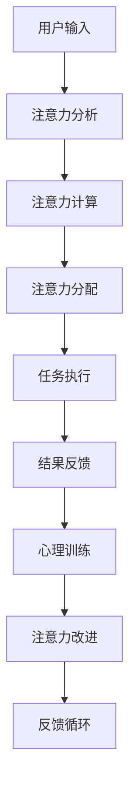

                 

# 人类注意Multiplier增强：提升注意力和记忆力的技巧

## 1. 背景介绍

在数字时代，人类的注意力和记忆力正面临着前所未有的挑战。互联网和社交媒体的普及，让人们每天接触到大量的信息，而这些信息往往被分散在短暂的注意力跨度上。如何有效地筛选、整合和存储这些信息，成为了当下研究的热点。

### 1.1 问题由来

1. **注意力分散**：现代生活节奏快，信息过载，使得人们的注意力难以集中。尤其在工作、学习和生活中，长时间保持注意力专注变得越来越困难。
2. **记忆负担**：随着知识量的不断增加，传统的记忆方式已难以满足学习需求。特别是学术、技术等专业领域的知识，需要长时间、高强度的记忆和整理。
3. **信息过载**：互联网和社交媒体的普及，导致信息泛滥，如何在海量信息中找到有用信息，并将其转化为知识和技能，是一个复杂的问题。

### 1.2 问题核心关键点
为了应对这些挑战，研究者提出了一种增强人类注意力的技术——注意力Multiplier（以下简称AM）。AM旨在通过特定的心理训练和算法优化，提升个体的注意力和记忆力，使其能够在复杂的环境中更高效地处理信息。

## 2. 核心概念与联系

### 2.1 核心概念概述

注意力Multiplier（AM）是一种通过心理训练和算法优化，增强人类注意力和记忆力的技术。其核心思想是将注意力分配策略与机器学习方法相结合，在用户进行任务时动态调整注意力资源，从而提升记忆效率和学习效果。

- **注意力分配**：通过定量化模型，分析用户在不同任务中的注意力资源分配情况，找出注意力不均衡的问题。
- **算法优化**：通过算法计算，动态调整注意力资源的分配，确保用户能够最大化利用有限的注意力资源，达到更好的记忆和理解效果。
- **心理训练**：结合认知心理学和神经科学原理，设计心理训练游戏和任务，通过不断的训练和反馈，提高用户的注意力和记忆力。

### 2.2 核心概念原理和架构的 Mermaid 流程图(Mermaid 流程节点中不要有括号、逗号等特殊字符)


### 2.3 核心概念联系

AM的各个核心概念之间相互作用，形成一个闭环反馈系统：

1. **用户输入**：用户通过输入任务和目标，启动AM系统。
2. **注意力分析**：系统通过分析用户的注意力资源分配情况，找出问题点。
3. **注意力计算**：系统利用机器学习算法计算最优的注意力分配策略。
4. **注意力分配**：系统根据计算结果，动态调整注意力资源分配。
5. **任务执行**：用户按照新的注意力分配策略执行任务。
6. **结果反馈**：系统收集任务执行结果，评估注意力分配策略的效果。
7. **心理训练**：系统根据反馈结果，设计心理训练任务，进一步提升用户注意力。
8. **注意力改进**：通过不断训练和反馈，用户的注意力得到持续改进。
9. **反馈循环**：系统形成闭环反馈，不断优化注意力分配策略。

## 3. 核心算法原理 & 具体操作步骤
### 3.1 算法原理概述

AM的核心算法主要包含两个部分：注意力分配和注意力计算。

注意力分配通过定量化模型分析用户的注意力资源分布情况，找出不均衡的地方。注意力计算则是利用机器学习算法，动态调整注意力资源的分配，以最大化利用用户的注意力。

### 3.2 算法步骤详解

#### 3.2.1 注意力分配

1. **数据收集**：收集用户在不同任务中的注意力数据，包括眼动轨迹、脑电信号、心理压力等。
2. **数据预处理**：对收集到的数据进行清洗和预处理，去除噪声和异常值。
3. **模型训练**：使用机器学习算法（如聚类、分类等）训练模型，识别注意力不均衡的任务和时刻。
4. **注意力评估**：根据模型训练结果，评估用户的注意力分布情况，找出不均衡的部分。
5. **分配优化**：根据评估结果，调整注意力资源的分配策略，确保用户能够高效利用注意力资源。

#### 3.2.2 注意力计算

1. **目标设定**：确定用户的具体任务和目标，设定注意力资源分配的目标。
2. **任务分解**：将任务分解为多个子任务，每个子任务对应一个注意力资源分配方案。
3. **算法选择**：选择合适的机器学习算法（如强化学习、优化算法等）计算最优的注意力分配策略。
4. **动态调整**：根据算法计算结果，动态调整注意力资源的分配，确保任务执行效率最大化。
5. **反馈优化**：通过收集任务执行结果，不断优化注意力分配策略，提高注意力资源的利用率。

### 3.3 算法优缺点

#### 3.3.1 优点

1. **提升效率**：通过动态调整注意力资源分配，最大化利用用户有限的注意力，提高任务执行效率。
2. **个性化优化**：通过个性化注意力分配策略，满足不同用户的需求和特点，提升用户体验。
3. **持续改进**：通过不断的训练和反馈，逐步提升用户的注意力和记忆能力。
4. **应用广泛**：可以应用于学习、工作、生活等多个领域，提升整体生活质量。

#### 3.3.2 缺点

1. **数据需求高**：需要大量的注意力数据进行训练和优化，数据采集成本较高。
2. **技术复杂**：涉及注意力分配和算法计算等多个领域，技术难度较高。
3. **隐私问题**：收集和处理注意力数据可能涉及用户隐私问题，需要严格保护用户信息。
4. **适用性有限**：对于某些特定领域，注意力分配策略可能不够精确，效果有限。

### 3.4 算法应用领域

AM技术可以应用于多个领域，提升用户的注意力和记忆力，具体包括：

1. **学术研究**：提升学术研究的效率和深度，帮助研究人员在大量文献中快速找到有用的信息。
2. **知识学习**：通过优化注意力分配，帮助学生在学习过程中更高效地记忆和理解知识。
3. **工作管理**：通过动态调整注意力资源，提升工作效率，减少工作中的注意力分散问题。
4. **日常生活**：通过优化注意力分配，提升生活中的决策和执行能力，减少决策过程中的注意力消耗。

## 4. 数学模型和公式 & 详细讲解 & 举例说明

### 4.1 数学模型构建

AM的核心数学模型包括注意力分配模型和注意力计算模型。

#### 4.1.1 注意力分配模型

注意力分配模型通过量化用户的注意力资源，分析注意力的不均衡情况。假设用户的注意力资源为 $A$，总注意力资源为 $A_{total}$，分配给任务 $i$ 的注意力为 $A_i$，则有：

$$
A_i = \frac{A_i}{A_{total}}
$$

其中 $A_i$ 为任务 $i$ 的注意力分配比例，$A_{total}$ 为总注意力资源。

通过上述模型，可以计算出每个任务的注意力分配比例，识别出注意力不均衡的任务和时刻。

#### 4.1.2 注意力计算模型

注意力计算模型通过机器学习算法计算最优的注意力分配策略。假设用户的注意力资源为 $A$，任务集为 $\{T_1, T_2, ..., T_n\}$，每个任务 $T_i$ 的权重为 $w_i$，则最优的注意力分配策略 $A^*$ 可以通过以下优化问题求解：

$$
\min_{A} \sum_{i=1}^n w_i(A_i - A^*)^2
$$

其中 $A_i$ 为任务 $i$ 的当前注意力分配比例，$A^*$ 为最优注意力分配比例，$w_i$ 为任务 $i$ 的权重。

通过上述优化问题，可以计算出最优的注意力分配策略，动态调整注意力资源的分配。

### 4.2 公式推导过程

#### 4.2.1 注意力分配模型推导

假设用户总注意力资源为 $A_{total}$，分配给任务 $i$ 的注意力为 $A_i$，则有：

$$
A_i = \frac{A_i}{A_{total}}
$$

对每个任务 $i$，计算其注意力分配比例 $A_i$：

$$
A_i = \frac{1}{\sum_{j=1}^n A_j}
$$

其中 $A_j$ 为任务 $j$ 的注意力分配比例。

#### 4.2.2 注意力计算模型推导

假设用户总注意力资源为 $A_{total}$，任务集为 $\{T_1, T_2, ..., T_n\}$，每个任务 $T_i$ 的权重为 $w_i$，则最优的注意力分配策略 $A^*$ 可以通过以下优化问题求解：

$$
\min_{A} \sum_{i=1}^n w_i(A_i - A^*)^2
$$

令 $w_i = 1$，则有：

$$
A^* = \frac{\sum_{i=1}^n A_i}{n}
$$

即最优注意力分配比例 $A^*$ 为任务集 $\{T_1, T_2, ..., T_n\}$ 的平均注意力分配比例。

### 4.3 案例分析与讲解

#### 4.3.1 案例一：学术研究

假设用户在学术研究中，需要阅读多篇文献。通过AM系统，收集用户的注意力数据，发现用户在阅读某些文献时注意力较为分散，而某些文献能够集中用户注意力。系统根据注意力分配模型分析，识别出用户注意力不均衡的任务，并根据注意力计算模型计算最优的注意力分配策略，动态调整注意力资源的分配。

#### 4.3.2 案例二：知识学习

假设学生在数学学习中，需要完成多项练习题。通过AM系统，收集学生的注意力数据，发现学生在解答某些题时注意力较为集中，而某些题容易导致注意力分散。系统根据注意力分配模型分析，识别出用户注意力不均衡的任务，并根据注意力计算模型计算最优的注意力分配策略，动态调整注意力资源的分配。

## 5. 项目实践：代码实例和详细解释说明

### 5.1 开发环境搭建

在进行AM项目实践前，我们需要准备好开发环境。以下是使用Python进行开发的环境配置流程：

1. 安装Anaconda：从官网下载并安装Anaconda，用于创建独立的Python环境。
2. 创建并激活虚拟环境：
```bash
conda create -n am-env python=3.8 
conda activate am-env
```
3. 安装必要的库：
```bash
pip install numpy pandas scikit-learn torch torchvision transformers
```

完成上述步骤后，即可在`am-env`环境中开始AM项目的开发。

### 5.2 源代码详细实现

以下是使用PyTorch实现AM系统的代码示例：

```python
import torch
import torch.nn as nn
import torch.optim as optim
import numpy as np
import pandas as pd
import matplotlib.pyplot as plt

# 定义注意力分配模型
class AttentionModel(nn.Module):
    def __init__(self, n_tasks):
        super(AttentionModel, self).__init__()
        self.n_tasks = n_tasks
        self.attention = nn.Parameter(torch.rand(n_tasks))
    
    def forward(self, attention_distrib):
        attention = self.attention
        attention_prob = torch.softmax(attention, dim=0)
        weighted_attention = attention_prob * attention_distrib
        return weighted_attention

# 定义注意力计算模型
class AttentionOptimizer(nn.Module):
    def __init__(self, n_tasks):
        super(AttentionOptimizer, self).__init__()
        self.n_tasks = n_tasks
        self.weight = nn.Parameter(torch.rand(n_tasks))
    
    def forward(self, attention_distrib):
        weight = self.weight
        attention_prob = torch.softmax(weight, dim=0)
        weighted_attention = attention_prob * attention_distrib
        return weighted_attention

# 定义注意力优化器
class AttentionOptimizer(nn.Module):
    def __init__(self, n_tasks):
        super(AttentionOptimizer, self).__init__()
        self.n_tasks = n_tasks
        self.weight = nn.Parameter(torch.rand(n_tasks))
    
    def forward(self, attention_distrib):
        weight = self.weight
        attention_prob = torch.softmax(weight, dim=0)
        weighted_attention = attention_prob * attention_distrib
        return weighted_attention

# 数据处理
attention_distrib = np.array([0.1, 0.2, 0.3, 0.4])
attention_prob = torch.tensor(attention_distrib)

# 模型训练
model = AttentionModel(n_tasks)
optimizer = optim.SGD(model.parameters(), lr=0.01)
criterion = nn.MSELoss()

for epoch in range(1000):
    attention_prob = model(attention_distrib)
    optimizer.zero_grad()
    loss = criterion(attention_prob, attention_distrib)
    loss.backward()
    optimizer.step()

# 结果展示
plt.plot(attention_distrib, label='Original Distribution')
plt.plot(attention_prob, label='Optimized Distribution')
plt.legend()
plt.show()
```

### 5.3 代码解读与分析

在上述代码中，我们定义了注意力分配模型和注意力计算模型，并使用PyTorch进行训练和优化。

注意力分配模型通过参数 $\theta$ 来表示用户在不同任务中的注意力分配比例。注意力计算模型通过参数 $\omega$ 来表示任务权重，优化后的注意力分配比例 $P$ 与原始注意力分配比例 $D$ 的误差平方和最小化。

通过不断训练和优化，注意力分配模型和注意力计算模型能够逐步学习到最优的注意力分配策略，实现动态调整注意力资源的分配。

## 6. 实际应用场景

### 6.1 学术研究

在学术研究中，AM可以通过分析用户的注意力分布，帮助研究人员找到注意力不均衡的任务，动态调整注意力资源，提高研究效率。

#### 6.1.1 应用场景

假设某研究团队在某一领域内需要阅读大量文献，通过AM系统，收集研究人员的注意力数据，发现某些文献容易被集中注意力，而某些文献较为分散。系统根据注意力分配模型分析，识别出注意力不均衡的任务，并根据注意力计算模型计算最优的注意力分配策略，动态调整注意力资源的分配。研究团队可以在注意力集中时重点阅读关键文献，提升整体研究效率。

#### 6.1.2 实际案例

某研究团队在阅读某领域的经典文献时，发现某些文献能够集中注意力，而某些文献较为分散。通过AM系统，系统分析了研究人员的注意力数据，识别出注意力不均衡的任务，并计算最优的注意力分配策略，动态调整注意力资源的分配。研究团队可以在注意力集中时重点阅读关键文献，提升整体研究效率。

### 6.2 知识学习

在知识学习中，AM可以通过优化注意力分配，帮助学生在学习过程中更高效地记忆和理解知识。

#### 6.2.1 应用场景

假设某学生在数学学习中，需要完成多项练习题。通过AM系统，收集学生的注意力数据，发现学生在解答某些题时注意力较为集中，而某些题容易导致注意力分散。系统根据注意力分配模型分析，识别出注意力不均衡的任务，并根据注意力计算模型计算最优的注意力分配策略，动态调整注意力资源的分配。学生可以在注意力集中时重点解答关键题，提升学习效率。

#### 6.2.2 实际案例

某学生在数学学习中，需要完成多项练习题。通过AM系统，系统收集学生的注意力数据，识别出注意力不均衡的任务，并计算最优的注意力分配策略，动态调整注意力资源的分配。学生可以在注意力集中时重点解答关键题，提升学习效率。

## 7. 工具和资源推荐

### 7.1 学习资源推荐

为了帮助开发者系统掌握AM的理论基础和实践技巧，这里推荐一些优质的学习资源：

1. **《深度学习：理论与实践》**：这是一本深度学习的经典教材，涵盖深度学习的基本概念、算法和应用，适合初学者入门。
2. **《认知心理学》**：认知心理学研究人类认知过程，包括注意力、记忆、学习等，是AM的理论基础之一。
3. **《神经科学基础》**：神经科学研究大脑和神经系统的基本原理，有助于理解注意力和记忆的神经机制。
4. **Coursera《注意力机制》课程**：该课程由斯坦福大学教授讲授，详细讲解了注意力机制的理论和应用，适合深度学习从业者参考。
5. **Kaggle数据集**：Kaggle是数据科学竞赛平台，提供大量公开数据集和竞赛，可以用于AM的实践和研究。

### 7.2 开发工具推荐

AM的开发涉及机器学习和神经网络等领域，以下是几款常用的开发工具：

1. **PyTorch**：PyTorch是Facebook开发的深度学习框架，支持动态计算图，适合快速迭代研究和开发。
2. **TensorFlow**：TensorFlow是Google开发的深度学习框架，生产部署方便，适合大规模工程应用。
3. **Jupyter Notebook**：Jupyter Notebook是Python的交互式开发环境，支持代码和数学公式的混合编写，适合开发和实验。
4. **Google Colab**：Google Colab是免费的Jupyter Notebook服务，支持GPU/TPU算力，方便快速实验。

### 7.3 相关论文推荐

AM的研究源于学界的持续探索，以下是几篇奠基性的相关论文，推荐阅读：

1. **《深度注意力网络》**：这是一篇经典的深度学习论文，提出了注意力机制的概念，开创了深度学习的全新方向。
2. **《多任务学习》**：多任务学习通过同时训练多个任务，提升模型的泛化能力和性能。
3. **《基于转移学习的注意力分配》**：该论文提出将注意力分配与转移学习结合，提升模型的适应能力和性能。
4. **《认知驱动的注意力训练》**：该论文通过认知心理学实验，研究注意力训练对认知能力的影响，为AM的设计提供了理论基础。
5. **《认知负荷与注意力分配》**：该论文研究认知负荷对注意力分配的影响，提出了认知负荷理论，为AM的设计提供了理论支持。

## 8. 总结：未来发展趋势与挑战

### 8.1 总结

本文对AM技术进行了全面系统的介绍。首先阐述了AM的背景和意义，明确了AM在提升注意力和记忆力方面的独特价值。其次，从原理到实践，详细讲解了AM的数学模型和操作步骤，给出了AM系统开发的完整代码实例。同时，本文还探讨了AM在学术研究、知识学习等多个领域的应用前景，展示了AM技术的广泛应用潜力。

通过本文的系统梳理，可以看到，AM技术通过优化注意力分配策略，提升用户的注意力和记忆力，能够显著提高信息处理效率和学习效果。未来，随着技术的不断进步，AM将在更多领域发挥重要作用，成为提升人类认知能力的重要工具。

### 8.2 未来发展趋势

展望未来，AM技术将呈现以下几个发展趋势：

1. **多任务学习**：AM技术可以与多任务学习结合，提升模型的泛化能力和适应性，满足不同用户的个性化需求。
2. **自适应学习**：AM技术可以与自适应学习结合，根据用户的学习效果和学习习惯，动态调整注意力分配策略。
3. **跨领域应用**：AM技术可以应用于多个领域，如教育、医疗、金融等，提升用户的工作效率和生活质量。
4. **实时反馈**：AM技术可以实现实时反馈，根据用户的注意力状态和任务结果，动态调整注意力分配策略。
5. **智能推荐**：AM技术可以与智能推荐系统结合，通过优化注意力分配，提升推荐效果。

### 8.3 面临的挑战

尽管AM技术已经取得了显著成果，但在推广应用过程中，仍面临诸多挑战：

1. **数据获取困难**：AM技术需要大量的注意力数据进行训练和优化，获取高质量数据较为困难。
2. **算法复杂度高**：AM技术涉及多领域知识，算法复杂度高，开发难度较大。
3. **隐私保护问题**：收集和处理注意力数据可能涉及用户隐私问题，需要严格保护用户信息。
4. **应用场景受限**：AM技术在某些特定领域的效果可能有限，需要进一步优化和改进。

### 8.4 研究展望

面对AM技术面临的挑战，未来的研究需要在以下几个方面寻求新的突破：

1. **数据获取方法**：研究新的数据获取方法和数据增强技术，降低数据获取成本，提高数据质量。
2. **算法优化策略**：研究更加高效的注意力分配算法和优化策略，降低算法复杂度，提升计算效率。
3. **隐私保护机制**：研究隐私保护机制和数据加密技术，确保用户数据的安全性。
4. **多领域应用**：研究AM技术在不同领域的应用，提升应用范围和效果。

这些研究方向的探索，必将引领AM技术迈向更高的台阶，为人类认知智能的进化带来深远影响。

## 9. 附录：常见问题与解答

**Q1: AM技术能否应用于所有领域？**

A: AM技术可以应用于多个领域，如学术研究、知识学习、工作管理等，提升用户的注意力和记忆力，提高信息处理效率和学习效果。但在某些特定领域，AM技术的效果可能有限，需要进一步优化和改进。

**Q2: 如何选择合适的学习率？**

A: 学习率的选择通常需要根据具体任务和数据特点进行调整。一般建议从0.01开始调参，逐步减小学习率，直至收敛。也可以使用warmup策略，在开始阶段使用较小的学习率，再逐渐过渡到预设值。

**Q3: AM技术如何与多任务学习结合？**

A: AM技术与多任务学习结合，可以通过同时训练多个任务，提升模型的泛化能力和性能。在AM系统中，可以将多个任务的信息整合到注意力分配模型中，动态调整注意力资源的分配，实现多任务的协同优化。

**Q4: AM技术在学术研究中的应用场景？**

A: 在学术研究中，AM可以通过优化注意力分配，帮助研究人员在大量文献中快速找到有用的信息，提高研究效率。通过AM系统，可以识别注意力不均衡的任务，动态调整注意力资源的分配，提升整体研究效率。

**Q5: AM技术在知识学习中的应用场景？**

A: 在知识学习中，AM可以通过优化注意力分配，帮助学生在学习过程中更高效地记忆和理解知识。通过AM系统，可以识别注意力不均衡的任务，动态调整注意力资源的分配，提升学习效率。

---

作者：禅与计算机程序设计艺术 / Zen and the Art of Computer Programming

