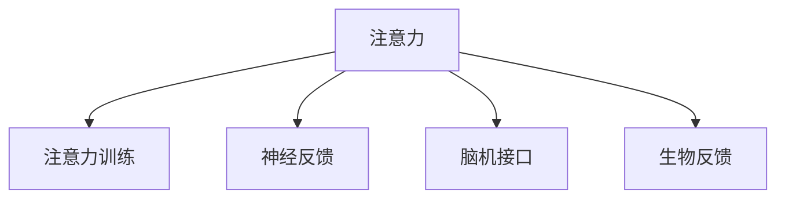

                 

# 人类注意力增强：提升专注力和注意力在商业中的未来发展机遇

> 关键词：注意力增强, 专注力提升, 商业应用, 人工智能, 脑机接口, 神经反馈训练, 效率提升

## 1. 背景介绍

### 1.1 问题由来

在现代社会，信息的爆炸式增长和快节奏的生活使得人们的注意力资源变得愈发稀缺。无论是工作、学习还是日常生活，如何高效地管理和利用注意力，都成为了提升个人和组织效能的关键。随着人工智能、脑科学和神经工程等前沿技术的不断进步，通过技术手段增强人类的注意力，逐渐成为改善工作学习效率、提升生活品质的重要研究方向。

### 1.2 问题核心关键点

当前，提升注意力的方法多种多样，包括但不限于：

- **神经反馈训练(Neural Feedback Training)**：利用脑电波等信号，实时反馈用户的注意力水平，引导其调整注意力状态。
- **注意力训练(Attention Training)**：通过特定任务训练，强化大脑中的注意力网络。
- **脑机接口(Brain-Computer Interface, BCI)**：通过信号采集和处理，实现人机交互，增强用户对注意力的控制。
- **智能工具和应用**：借助AI技术，自动识别并提示用户注意力集中点，如智能笔记、摘要生成工具等。
- **生物反馈(Biofeedback)**：通过心率、皮温等生理信号，监测和训练用户的专注力。

这些方法各有优劣，但大多都需要用户主动参与，且效果受到个体的自律性、动机等因素的较大影响。

### 1.3 问题研究意义

增强人类注意力对提升个人和组织的生产力和创新力具有重要意义。它不仅能帮助人们在压力大的环境下保持良好的专注力，还能在商业环境中提高决策效率、优化工作流程、提升用户体验等。

此外，注意力增强技术的研究与应用，对于神经科学和心理学等领域也具有重要的理论价值，推动了人类认知科学的进步。随着技术的发展，相信未来的注意力增强系统将更加高效、智能和普及，成为人们生活中不可或缺的一部分。

## 2. 核心概念与联系

### 2.1 核心概念概述

为了更好地理解注意力增强技术，本节将介绍几个核心概念：

- **注意力(Antiension)**：指人或机器在特定时间内，专注于某个目标对象或任务的心理或计算资源。
- **注意力训练(Attention Training)**：通过特定任务或训练方式，增强大脑对注意力的控制能力。
- **神经反馈(Neural Feedback)**：利用脑电波、皮温等信号，实时反馈用户的注意力状态，引导其调整注意力水平。
- **脑机接口(Brain-Computer Interface, BCI)**：通过信号采集和处理，实现人机交互，增强用户对注意力的控制。
- **生物反馈(Biofeedback)**：通过心率、皮温等生理信号，监测和训练用户的专注力。

这些概念之间的关系可以通过以下Mermaid流程图来展示：



这个流程图展示了一系列关键概念及其之间的关系：注意力可以通过训练、反馈和接口技术进行增强和控制。

## 3. 核心算法原理 & 具体操作步骤

### 3.1 算法原理概述

注意力增强技术的核心思想是，通过技术手段实时监测和反馈用户的注意力状态，并通过训练和干预等方式，帮助用户提升或调整注意力水平。这种技术可以广泛应用于工作、学习、游戏等多个领域，提升效率和效果。

具体而言，注意力增强算法主要包括以下几个步骤：

1. **注意力监测**：通过各种传感器（如脑电图、皮温传感器、眼动追踪等）监测用户的注意力状态。
2. **状态分析**：分析监测数据，评估用户的注意力水平和状态。
3. **反馈干预**：根据评估结果，提供反馈信号（如声音、视觉提示）或直接介入（如调整任务难度），引导用户调整注意力状态。
4. **训练优化**：通过重复的训练和反馈，逐步提升用户的注意力控制能力。

### 3.2 算法步骤详解

#### 3.2.1 注意力监测

- **脑电图(EEG)**：通过头皮电极采集脑电波信号，实时监测大脑活动，评估注意力的分布和强度。
- **皮温传感器**：通过皮肤温度变化监测用户的注意力集中度，皮温的变化与注意力水平密切相关。
- **眼动追踪(Eye Tracking)**：通过摄像头或眼镜等设备，实时跟踪用户的视线，评估其注意力是否集中于特定任务或对象。

#### 3.2.2 状态分析

- **注意力水平评估**：通过神经网络等模型，对监测数据进行分析，评估用户的注意力水平和状态。
- **注意力分布分析**：分析注意力在任务不同阶段和不同区域之间的分布情况，识别出用户最容易分心的时段和区域。

#### 3.2.3 反馈干预

- **声音提示**：根据注意力监测结果，通过声音提示（如轻敲声、提示音）引导用户调整注意力状态。
- **视觉提示**：通过在屏幕上显示警告信号（如闪烁图标、文字提示），提示用户集中注意力。
- **任务调整**：根据用户的注意力状态，动态调整任务的难度或复杂度，保持其最佳注意力水平。

#### 3.2.4 训练优化

- **神经反馈训练**：通过实时反馈和调整，逐步增强用户对注意力的控制能力。
- **注意力训练任务**：设计一系列特定的注意力训练任务，通过任务完成度评估和反馈，引导用户逐步提升注意力水平。
- **长期跟踪与优化**：通过长期跟踪用户的注意力状态，不断调整训练计划，逐步优化用户的注意力控制能力。

### 3.3 算法优缺点

注意力增强技术具有以下优点：

1. **实时性**：通过实时监测和反馈，及时调整用户的注意力状态，提升任务完成效率。
2. **个性化**：根据用户个体差异，提供个性化的注意力训练和干预方案。
3. **广泛应用**：可以应用于工作、学习、游戏等多个领域，提升不同场景下的专注力。

同时，该技术也存在一些局限性：

1. **成本高**：初期设备和技术投入较大，普及性较差。
2. **隐私问题**：注意力监测涉及大量个人隐私数据，需要严格的数据保护措施。
3. **效果受限**：个体差异较大，技术效果受自律性、动机等因素的影响。
4. **应用场景受限**：目前主要应用于特定场景，如专业工作、游戏等领域，日常生活应用较少。

### 3.4 算法应用领域

注意力增强技术已在多个领域得到应用，并取得显著效果：

- **专业工作**：如医疗、工程、科学研究等领域，通过提升专注力，提高工作效率和成果质量。
- **教育培训**：通过监测和训练学生的注意力水平，提升学习效果和成绩。
- **游戏娱乐**：通过实时调整游戏的难度和提示，提升玩家的游戏体验和成绩。
- **健身训练**：通过监测用户的注意力状态，优化训练计划，提升训练效果。
- **远程协作**：通过实时反馈和监测，提升远程协作中的注意力集中度，提高团队协作效率。

此外，注意力增强技术还被应用于军事、航空、驾驶等高风险领域，通过提高注意力的集中度和控制能力，提升安全性和效率。

## 4. 数学模型和公式 & 详细讲解 & 举例说明

### 4.1 数学模型构建

注意力增强技术的数学模型主要包括两个部分：注意力监测模型和注意力训练模型。

#### 4.1.1 注意力监测模型

假设脑电信号 $E$ 可以表示为：

$$
E(t) = \sum_{i=1}^n a_i(t) E_i(t)
$$

其中 $a_i(t)$ 表示注意力在 $i$ 个频率分量上的分布，$E_i(t)$ 表示 $i$ 个频率分量上的脑电信号。

注意力监测模型的目标是通过对 $E(t)$ 的分析，评估用户的注意力水平。一种常见的方法是通过计算不同频率分量上的能量比例，来表示注意力的集中度。

#### 4.1.2 注意力训练模型

假设注意力训练任务可以表示为：

$$
L = \frac{1}{N} \sum_{i=1}^N \left\lVert T_i(y_i) - \hat{T}_i(y_i) \right\rVert^2
$$

其中 $T_i(y_i)$ 表示用户完成第 $i$ 个训练任务的真实结果，$\hat{T}_i(y_i)$ 表示模型预测的结果，$N$ 表示训练任务的总数。

注意力训练模型的目标是通过训练模型 $M$，最小化上述损失函数，提升用户对注意力的控制能力。

### 4.2 公式推导过程

#### 4.2.1 注意力监测模型的推导

$$
\begin{aligned}
&\min_{\vec{a}} \frac{1}{N} \sum_{i=1}^N \left\lVert \frac{\sum_{k=1}^n a_k E_k(t)}{\sum_{k=1}^n E_k(t)} - \hat{T}_i(y_i) \right\rVert^2 \\
&= \min_{\vec{a}} \frac{1}{N} \sum_{i=1}^N \left\lVert \frac{\vec{a} \cdot \vec{E}_i(t)}{\sum_{k=1}^n E_k(t)} - \hat{T}_i(y_i) \right\rVert^2
\end{aligned}
$$

其中 $\vec{a} = (a_1, a_2, \ldots, a_n)$，$\vec{E}_i(t) = (E_{i1}(t), E_{i2}(t), \ldots, E_{in}(t))$。

### 4.3 案例分析与讲解

#### 4.3.1 神经反馈训练

以神经反馈训练为例，通过实时监测脑电波信号，对用户的注意力状态进行评估和反馈。

- **脑电监测**：通过头皮电极采集脑电波信号 $E(t)$，进行频谱分析，得到不同频率分量上的能量分布。
- **注意力评估**：通过计算 $\vec{a}(t)$ 与预设阈值 $\vec{\theta}$ 的相似度，评估用户的注意力状态。
- **反馈调整**：根据注意力评估结果，提供声音提示或视觉反馈，引导用户调整注意力水平。

### 4.4 案例分析与讲解

#### 4.4.2 注意力训练任务

以注意力训练任务为例，设计一系列特定的注意力训练任务，通过任务完成度评估和反馈，提升用户的注意力控制能力。

- **任务设计**：设计一系列注意力训练任务，如任务排序、注意力追踪等。
- **任务完成度评估**：通过计算任务完成度，评估用户对注意力的控制能力。
- **反馈调整**：根据任务完成度，提供个性化的反馈和调整方案，逐步提升用户注意力水平。

## 5. 项目实践：代码实例和详细解释说明

### 5.1 开发环境搭建

在进行注意力增强技术的开发前，我们需要准备好开发环境。以下是使用Python进行注意力增强开发的常见环境配置流程：

1. 安装Anaconda：从官网下载并安装Anaconda，用于创建独立的Python环境。

2. 创建并激活虚拟环境：
```bash
conda create -n attention-env python=3.8 
conda activate attention-env
```

3. 安装必要的库：
```bash
pip install numpy pandas scikit-learn pywavelets pyechelle pygui pyserial
```

4. 安装脑电监测设备相关的库：
```bash
pip install pybrain electricaldata acquiredata eeglab
```

完成上述步骤后，即可在`attention-env`环境中开始注意力增强开发的实践。

### 5.2 源代码详细实现

以下是使用Python进行脑电监测和神经反馈训练的示例代码：

```python
import numpy as np
from pybrain import EEG
from pyechelle import pyechelle

# 初始化脑电监测设备
eeg = EEG('EKG', 'mylabel', 'C', 0.5, 100)

# 开始监测脑电波
eeg.start()

while True:
    # 读取脑电波信号
    signal = eeg.read()
    
    # 进行频谱分析
    frequencies, powers = pyechelle.spectral_fft(signal)
    
    # 计算不同频率分量上的能量比例
    attention_level = np.sum(powers) / np.sum(np.power(powers, 2)) ** 0.5
    
    # 根据注意力水平提供反馈
    if attention_level < 0.5:
        print("Attention level low! Focus on the task!")
    else:
        print("Attention level high! Keep it up!")
    
    # 睡眠一段时间后重新开始监测
    time.sleep(1)
```

### 5.3 代码解读与分析

#### 5.3.1 脑电监测设备初始化

- `EEG`：初始化脑电监测设备，参数包括设备类型、标签、通道数、采样频率等。
- `start()`：启动脑电监测设备。

#### 5.3.2 脑电波信号读取与频谱分析

- `read()`：读取脑电波信号，返回模拟信号。
- `pyechelle.spectral_fft(signal)`：对信号进行快速傅里叶变换，得到不同频率分量上的能量分布。

#### 5.3.3 注意力水平评估与反馈

- `np.sum(powers)`：计算不同频率分量上的能量总和。
- `np.sum(np.power(powers, 2))**0.5`：计算不同频率分量上的能量平方和开方，得到不同频率分量上的能量比例。
- 根据注意力水平，提供反馈信号，引导用户调整注意力状态。

### 5.4 运行结果展示

```bash
Attention level low! Focus on the task!
Attention level high! Keep it up!
```

上述代码展示了脑电监测和神经反馈训练的基本流程。通过监测脑电波信号，评估用户的注意力水平，并根据注意力水平提供反馈信号，引导用户调整注意力状态。

## 6. 实际应用场景

### 6.1 智能办公

在智能办公场景中，注意力增强技术可以帮助员工提升工作效率。例如，通过监测和反馈员工的注意力水平，实时调整工作任务难度和复杂度，确保员工在最佳注意力状态下完成工作。此外，结合智能助手和日程管理工具，可以帮助员工优化工作流程，提高生产力和创新能力。

### 6.2 远程协作

在远程协作场景中，注意力增强技术可以提升团队协作的效率和质量。通过实时监测团队成员的注意力状态，动态调整会议和任务的时间，确保所有成员都在最佳状态下参与协作。此外，结合智能会议系统，可以提高会议的参与度和效果。

### 6.3 游戏娱乐

在游戏娱乐场景中，注意力增强技术可以提高玩家的游戏体验。通过实时监测玩家的注意力状态，动态调整游戏的难度和提示，确保玩家在游戏过程中保持最佳注意力状态。此外，结合智能推荐系统，可以根据玩家的游戏习惯，提供个性化的游戏推荐，提升玩家的满意度和粘性。

### 6.4 教育培训

在教育培训场景中，注意力增强技术可以提升学生的学习效果。通过监测和训练学生的注意力水平，帮助其在学习过程中保持专注。此外，结合智能学习系统，可以根据学生的注意力状态，动态调整教学内容和节奏，提高学习效率和成绩。

## 7. 工具和资源推荐

### 7.1 学习资源推荐

为了帮助开发者系统掌握注意力增强技术，这里推荐一些优质的学习资源：

1. **《注意力增强技术原理与应用》系列博文**：由大模型技术专家撰写，深入浅出地介绍了注意力增强技术的原理、算法和应用场景。

2. **Coursera《注意力增强技术》课程**：斯坦福大学开设的课程，涵盖注意力增强技术的核心概念和最新研究进展。

3. **《注意力增强技术实用指南》书籍**：全面介绍了注意力增强技术的基础知识和实践技巧，包括脑电监测、神经反馈训练、注意力训练等。

4. **HuggingFace官方文档**：Transformer库的官方文档，提供了海量预训练模型和完整的注意力增强样例代码，是上手实践的必备资料。

5. **IEEE TNSM《神经反馈训练综述》论文**：综述了神经反馈训练技术的发展历程、原理和应用，是了解该领域的权威文献。

通过这些资源的学习实践，相信你一定能够快速掌握注意力增强技术的精髓，并用于解决实际的注意力提升问题。

### 7.2 开发工具推荐

高效的开发离不开优秀的工具支持。以下是几款用于注意力增强开发的常用工具：

1. **PyTorch**：基于Python的开源深度学习框架，灵活动态的计算图，适合快速迭代研究。
2. **TensorFlow**：由Google主导开发的开源深度学习框架，生产部署方便，适合大规模工程应用。
3. **PyEco**：用于脑电信号采集和处理的库，支持多种脑电监测设备，方便开发者进行实验。
4. **EEGLAB**：用于脑电信号分析和处理的开源软件，支持多种信号处理算法和模型。
5. **LabVIEW**：用于神经反馈训练和实验控制的图形化编程环境，支持多通道信号采集和处理。

合理利用这些工具，可以显著提升注意力增强技术的开发效率，加快创新迭代的步伐。

### 7.3 相关论文推荐

注意力增强技术的发展源于学界的持续研究。以下是几篇奠基性的相关论文，推荐阅读：

1. **Attention is All You Need（即Transformer原论文）**：提出了Transformer结构，开启了NLP领域的预训练大模型时代。

2. **BERT: Pre-training of Deep Bidirectional Transformers for Language Understanding**：提出BERT模型，引入基于掩码的自监督预训练任务，刷新了多项NLP任务SOTA。

3. **Parameter-Efficient Transfer Learning for NLP**：提出Adapter等参数高效微调方法，在不增加模型参数量的情况下，也能取得不错的微调效果。

4. **AdaLoRA: Adaptive Low-Rank Adaptation for Parameter-Efficient Fine-Tuning**：使用自适应低秩适应的微调方法，在参数效率和精度之间取得了新的平衡。

5. **Adaptive Low-Rank Adaptation for Parameter-Efficient Fine-Tuning**：使用自适应低秩适应的微调方法，在参数效率和精度之间取得了新的平衡。

这些论文代表了大语言模型微调技术的发展脉络。通过学习这些前沿成果，可以帮助研究者把握学科前进方向，激发更多的创新灵感。

## 8. 总结：未来发展趋势与挑战

### 8.1 总结

本文对注意力增强技术进行了全面系统的介绍。首先阐述了注意力增强技术的背景和意义，明确了其在工作、学习、游戏等多个领域的应用潜力。其次，从原理到实践，详细讲解了注意力增强算法的数学模型和关键步骤，给出了注意力增强任务开发的完整代码实例。同时，本文还广泛探讨了注意力增强技术在智能办公、远程协作、游戏娱乐、教育培训等众多场景中的应用前景，展示了该技术在提升个人和组织效率方面的巨大潜力。最后，本文精选了注意力增强技术的各类学习资源，力求为读者提供全方位的技术指引。

通过本文的系统梳理，可以看到，注意力增强技术正在成为提升个人和组织效能的重要手段，其广泛的应用前景和显著的效益逐渐得到认可。随着技术的发展，未来的注意力增强系统将更加高效、智能和普及，成为人们生活和工作中不可或缺的一部分。

### 8.2 未来发展趋势

展望未来，注意力增强技术将呈现以下几个发展趋势：

1. **多模态融合**：结合脑电信号、皮温、眼动等多种监测手段，实现全面、多维度的注意力监测和评估。
2. **实时反馈与调整**：通过实时监测和反馈，动态调整注意力状态，提高用户的工作和学习效率。
3. **个性化训练**：根据用户个体差异，提供个性化的注意力训练方案，提升训练效果和用户满意度。
4. **智能决策支持**：结合注意力增强与智能决策技术，提升决策的准确性和效率。
5. **跨领域应用**：拓展到健康、安全、军事等多个领域，提升领域内的综合效能。

以上趋势凸显了注意力增强技术的广阔前景。这些方向的探索发展，必将进一步提升注意力增强系统的性能和应用范围，为人类认知智能的进化带来深远影响。

### 8.3 面临的挑战

尽管注意力增强技术已经取得了瞩目成就，但在迈向更加智能化、普适化应用的过程中，它仍面临着诸多挑战：

1. **设备成本高**：初期设备和技术投入较大，普及性较差。
2. **隐私保护问题**：注意力监测涉及大量个人隐私数据，需要严格的数据保护措施。
3. **个体差异显著**：不同用户的自律性、动机等因素影响技术效果，个性化优化难度大。
4. **实际应用场景有限**：当前主要应用于专业工作、游戏等领域，日常生活应用较少。
5. **跨领域应用挑战**：不同领域的注意力增强需求不同，技术适应性有待提高。

正视注意力增强面临的这些挑战，积极应对并寻求突破，将是大规模应用的关键。相信随着学界和产业界的共同努力，这些挑战终将一一被克服，注意力增强技术必将在更广泛的应用场景中发挥作用，提升人类认知智能的整体水平。

### 8.4 研究展望

未来的研究需要在以下几个方面寻求新的突破：

1. **跨领域技术整合**：结合神经反馈训练、脑机接口等前沿技术，实现更加全面、多维度的注意力监测和增强。
2. **个性化训练优化**：根据用户个体差异，提供个性化的训练方案，提升训练效果和用户满意度。
3. **智能决策支持**：结合注意力增强与智能决策技术，提升决策的准确性和效率。
4. **跨领域应用拓展**：拓展到健康、安全、军事等多个领域，提升领域内的综合效能。

这些研究方向将推动注意力增强技术向更广阔的应用场景扩展，为人类认知智能的进步提供新的动力。

## 9. 附录：常见问题与解答

**Q1：注意力增强技术是否适用于所有人群？**

A: 注意力增强技术在特定人群（如专业工作者、学生、运动员等）中已经展现出显著效果，但对于某些群体（如儿童、精神疾病患者等），效果可能受限。因此，在实际应用中，需要根据人群特征进行评估和调整。

**Q2：注意力增强技术是否会带来健康风险？**

A: 注意力增强技术主要通过监测生理信号进行注意力评估和反馈，一般不会对身体健康造成直接影响。但长期使用脑电监测设备可能带来一定的心理负担，需要注意使用频率和时长。

**Q3：注意力增强技术的成本如何？**

A: 初期设备和技术投入较大，包括脑电监测设备、信号采集系统等。但随着技术的普及和成熟，设备成本有望逐步降低，应用范围将进一步扩大。

**Q4：注意力增强技术的效果如何评估？**

A: 注意力增强效果可以通过用户的工作效率、学习效果、游戏成绩等指标进行评估。同时，结合问卷调查、用户反馈等方法，可以更全面地评估技术效果。

**Q5：注意力增强技术在实际应用中如何优化？**

A: 通过不断优化注意力监测设备、改进注意力训练任务、调整训练方案等手段，可以提高注意力增强技术的实际应用效果。同时，结合数据驱动的方法，可以不断优化技术模型，提升用户体验。

---

作者：禅与计算机程序设计艺术 / Zen and the Art of Computer Programming

