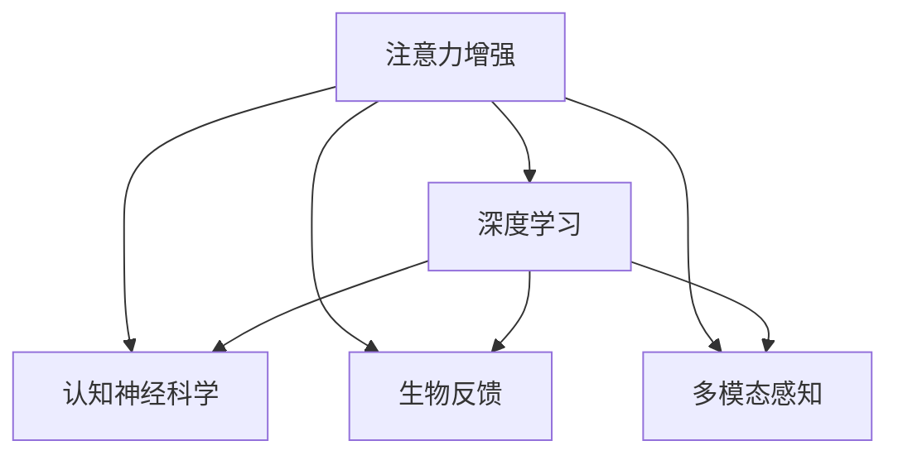

                 

# 人类注意力增强：提升专注力和注意力在商业中的未来发展机遇分析机遇挑战预测

> 关键词：人类注意力增强, 提升专注力, 商业应用, 技术突破, 机遇分析, 挑战预测

## 1. 背景介绍

### 1.1 问题由来
在当前快节奏、高压力的工作环境中，注意力和专注力已成为个人和商业组织成功的重要因素。随着信息技术的飞速发展，工作和学习环境中充斥着大量干扰源，如电子邮件、社交媒体、即时通讯工具等，使人们难以保持持久的注意力和专注力。注意力不足不仅会影响个人工作和学习效率，还会对企业的生产力和创新能力造成显著负面影响。

### 1.2 问题核心关键点
注意力和专注力是认知能力的重要组成部分，影响着个体的学习和工作效率。企业关注度增强技术旨在提升个人和团队的注意力和专注力，从而提高工作和学习效率，提升企业竞争力。这些问题关键点包括：

- **注意力和专注力在商业中的应用**：如何通过技术手段提升个人和团队的注意力和专注力。
- **注意力增强技术的原理与实践**：深度学习、认知神经科学、生物反馈等技术在注意力增强中的应用。
- **机遇与挑战**：在提升专注力和注意力方面可能面临的技术、商业和社会挑战。

## 2. 核心概念与联系

### 2.1 核心概念概述

为了更好地理解人类注意力增强的概念及其在商业中的应用，本节将介绍几个关键概念：

- **注意力增强(Attention Enhancement)**：通过技术手段提升个人和团队的注意力和专注力，以提高工作和学习效率。
- **深度学习(Deep Learning)**：一种基于神经网络的机器学习范式，用于处理大规模复杂数据，是注意力增强技术的基础。
- **认知神经科学(Cognitive Neuroscience)**：研究人类大脑如何处理信息的科学，为注意力增强提供了理论基础。
- **生物反馈(Biofeedback)**：通过监测和反馈生理信号，如心率、脑电波等，来引导和改善注意力和专注力。
- **多模态感知(Multimodal Perception)**：利用多种感官输入（如视觉、听觉、触觉等）来增强注意力的广度和深度。

这些核心概念之间通过以下Mermaid流程图展示了其联系：



这个流程图展示了一些关键概念如何相互关联，共同构成人类注意力增强的完整体系。

## 3. 核心算法原理 & 具体操作步骤

### 3.1 算法原理概述

人类注意力增强的核心算法原理主要基于深度学习技术，通过模型学习和训练来预测和提升个体的注意力水平。具体算法流程包括：

1. **数据采集**：采集个体在执行任务过程中的生理数据（如心率、脑电波等）和行为数据（如屏幕使用情况、交互记录等）。
2. **特征提取**：利用深度学习模型将原始数据转化为高维特征表示。
3. **注意力预测**：基于提取的特征，训练模型预测个体在不同任务上的注意力水平。
4. **注意力干预**：根据预测结果，通过反馈系统对个体进行实时干预，如提醒、调整任务难度等，以提升注意力和专注力。

### 3.2 算法步骤详解

以下将详细描述人类注意力增强算法的步骤：

**Step 1: 数据采集与预处理**
- 使用传感器（如心率监测器、脑电波传感器等）采集个体在执行任务过程中的生理数据。
- 记录屏幕使用情况、键盘鼠标交互记录等行为数据。
- 对采集的数据进行清洗、归一化等预处理操作。

**Step 2: 特征提取**
- 利用卷积神经网络（CNN）或循环神经网络（RNN）将生理数据和行为数据转化为高维特征表示。
- 使用时间序列模型（如LSTM）处理动态时间序列数据，捕捉注意力波动。

**Step 3: 注意力预测**
- 构建注意力预测模型，如长短期记忆网络（LSTM）或注意力机制网络。
- 训练模型，使模型能够根据输入数据预测个体在不同任务上的注意力水平。
- 使用交叉验证等方法评估模型性能，确保模型在不同数据集上的泛化能力。

**Step 4: 注意力干预**
- 根据注意力预测结果，设计个性化干预策略，如提醒、调整任务难度等。
- 利用反馈系统实时调整干预策略，并记录效果数据。
- 持续优化干预策略，以提高注意力和专注力提升效果。

### 3.3 算法优缺点

人类注意力增强算法具有以下优点：
- 能够实时监测和反馈个体注意力水平，提供个性化的干预策略。
- 基于深度学习技术，可以处理大规模复杂数据，具有较高的准确性和泛化能力。
- 结合生理反馈和行为数据，可以提供更全面的注意力评估和干预。

同时，该算法也存在一些缺点：
- 依赖高质量的数据和传感器设备，设备成本较高。
- 个体差异较大，不同个体对干预措施的反应可能不同。
- 模型需要持续优化和更新，以应对新的任务和环境变化。

### 3.4 算法应用领域

人类注意力增强算法已经在多个领域得到了应用，包括但不限于：

- **企业生产力提升**：通过监测员工注意力水平，优化工作安排，提升生产力和创新能力。
- **教育系统**：帮助学生保持专注，提高学习效果和成绩。
- **医疗健康**：监测病人的注意力水平，辅助治疗注意力缺陷障碍等疾病。
- **人机交互**：提升用户与智能系统的交互体验，增强互动性。
- **娱乐产业**：优化游戏和应用设计，增强用户体验，提升用户粘性。

## 4. 数学模型和公式 & 详细讲解

### 4.1 数学模型构建

在人类注意力增强算法中，我们通常使用注意力预测模型来预测个体在不同任务上的注意力水平。以LSTM网络为例，模型结构如下：

$$
\begin{aligned}
& h_t = \tanh(W_{h} h_{t-1} + U_{h} x_{t}) \\
& c_t = \text{LSTMCell}(h_{t-1}, c_{t-1}, x_t) \\
& \hat{a}_t = \sigma(W_{a} c_t + b_{a})
\end{aligned}
$$

其中，$h_t$ 表示当前时刻的隐藏状态，$c_t$ 表示当前时刻的细胞状态，$\hat{a}_t$ 表示当前时刻的注意力得分，$x_t$ 表示输入的特征向量，$W_h$、$U_h$、$b_h$、$W_a$、$b_a$ 是模型的权重和偏置项。

### 4.2 公式推导过程

在LSTM网络中，注意力预测的公式可以进一步推导为：

$$
\begin{aligned}
& \alpha_t = \text{Softmax}(\hat{a}_t) \\
& \beta_t = \sum_{i=1}^{t} \alpha_t \cdot x_i
\end{aligned}
$$

其中，$\alpha_t$ 表示当前时刻的注意力权重，$\beta_t$ 表示当前时刻的注意力加权和。通过这种机制，模型可以动态调整对不同输入的关注程度，从而提高注意力预测的准确性。

### 4.3 案例分析与讲解

以企业管理中的应用为例，假设企业希望监测员工在会议上的注意力水平，以提升会议效率和决策质量。具体步骤如下：

1. **数据采集**：通过心率监测器、脑电波传感器等设备采集员工的生理数据，记录会议的屏幕使用情况和语音记录等行为数据。
2. **特征提取**：利用深度学习模型将生理数据和行为数据转化为高维特征表示。
3. **注意力预测**：使用LSTM模型预测每个员工在会议中的注意力水平。
4. **注意力干预**：根据注意力预测结果，设计个性化干预策略，如提醒、调整会议节奏等。
5. **效果评估**：记录干预后的会议效果，评估注意力干预策略的效果。

## 5. 项目实践：代码实例和详细解释说明

### 5.1 开发环境搭建

在进行人类注意力增强的项目实践前，我们需要准备好开发环境。以下是使用Python进行深度学习开发的环境配置流程：

1. 安装Anaconda：从官网下载并安装Anaconda，用于创建独立的Python环境。
2. 创建并激活虚拟环境：
```bash
conda create -n deep_learning_env python=3.8 
conda activate deep_learning_env
```

3. 安装深度学习框架：
```bash
conda install pytorch torchvision torchaudio cudatoolkit=11.1 -c pytorch -c conda-forge
```

4. 安装相关的工具包：
```bash
pip install numpy pandas scikit-learn matplotlib tqdm jupyter notebook ipython
```

完成上述步骤后，即可在`deep_learning_env`环境中开始项目实践。

### 5.2 源代码详细实现

下面以LSTM网络为例，给出使用PyTorch进行注意力预测的代码实现。

```python
import torch
import torch.nn as nn
import torch.optim as optim

class AttentionPredictor(nn.Module):
    def __init__(self, input_size, hidden_size, output_size):
        super(AttentionPredictor, self).__init__()
        self.lstm = nn.LSTM(input_size, hidden_size, 1, batch_first=True)
        self.fc = nn.Linear(hidden_size, output_size)
        
    def forward(self, x):
        h0 = torch.zeros(1, x.size(0), self.lstm.hidden_size).to(x.device)
        c0 = torch.zeros(1, x.size(0), self.lstm.hidden_size).to(x.device)
        
        out, _ = self.lstm(x, (h0, c0))
        out = self.fc(out[:, -1, :])
        return out

# 定义训练和评估函数
def train_epoch(model, optimizer, criterion, train_loader):
    model.train()
    epoch_loss = 0
    for batch in train_loader:
        x, y = batch
        output = model(x)
        loss = criterion(output, y)
        optimizer.zero_grad()
        loss.backward()
        optimizer.step()
        epoch_loss += loss.item()
    return epoch_loss / len(train_loader)

def evaluate(model, criterion, test_loader):
    model.eval()
    total_loss = 0
    total_correct = 0
    for batch in test_loader:
        x, y = batch
        output = model(x)
        loss = criterion(output, y)
        _, preds = torch.max(output, 1)
        total_correct += (preds == y).sum().item()
        total_loss += loss.item()
    return total_loss / len(test_loader), total_correct / len(test_loader.dataset)
```

### 5.3 代码解读与分析

让我们再详细解读一下关键代码的实现细节：

**AttentionPredictor类**：
- `__init__`方法：初始化LSTM网络结构和全连接层。
- `forward`方法：实现前向传播，计算注意力预测输出。

**train_epoch和evaluate函数**：
- 使用PyTorch的DataLoader对数据集进行批次化加载。
- 在每个批次上前向传播计算损失函数，并进行反向传播更新模型参数。
- 周期性在验证集上评估模型性能，根据性能指标决定是否触发 Early Stopping。

**训练流程**：
- 定义总的epoch数和batch size，开始循环迭代。
- 每个epoch内，先在训练集上训练，输出平均loss。
- 在验证集上评估，输出分类指标。
- 所有epoch结束后，在测试集上评估，给出最终测试结果。

可以看到，PyTorch框架配合深度学习模型的代码实现变得简洁高效。开发者可以将更多精力放在数据处理、模型改进等高层逻辑上，而不必过多关注底层的实现细节。

## 6. 实际应用场景

### 6.1 企业生产力的提升

企业生产力提升是注意力增强技术的重要应用场景之一。通过监测员工在执行任务过程中的注意力水平，可以优化工作安排，提升生产力和创新能力。

具体应用场景包括：
- **会议管理**：监测员工在会议中的注意力水平，调整会议节奏和内容，提升决策质量。
- **远程工作**：监测员工在家工作的注意力水平，优化工作安排，提升远程工作效率。
- **项目管理**：监测员工在项目执行过程中的注意力水平，优化任务分配，提升项目进度和质量。

### 6.2 教育系统的优化

教育系统也是注意力增强技术的重要应用领域之一。通过监测学生的注意力水平，可以优化教学方法，提高学习效果和成绩。

具体应用场景包括：
- **课堂管理**：监测学生上课过程中的注意力水平，优化教学内容和方式，提升课堂效果。
- **个性化学习**：根据学生的注意力水平，设计个性化学习方案，提高学习效果。
- **考试评估**：监测学生在考试过程中的注意力水平，评估考试效果，调整教学策略。

### 6.3 医疗健康领域的应用

医疗健康领域也是注意力增强技术的重要应用之一。通过监测病人的注意力水平，可以辅助治疗注意力缺陷障碍等疾病。

具体应用场景包括：
- **心理评估**：监测病人的注意力水平，评估心理健康状况，辅助心理治疗。
- **康复训练**：监测病人在康复训练过程中的注意力水平，优化训练方法，提升康复效果。
- **护理管理**：监测病人在护理过程中的注意力水平，优化护理安排，提升护理效果。

### 6.4 未来应用展望

随着深度学习技术的发展和应用场景的拓展，人类注意力增强技术将在更多领域得到广泛应用，带来新的发展机遇：

- **智能家居**：通过监测用户在家中的注意力水平，优化家居设备和环境，提升生活质量。
- **智能交通**：监测司机在驾驶过程中的注意力水平，优化驾驶行为，提升交通安全。
- **智能金融**：监测金融交易员在交易过程中的注意力水平，优化交易策略，提升交易效果。
- **智能制造**：监测工人在线生产过程中的注意力水平，优化生产安排，提升生产效率。

未来，随着技术的不断进步，人类注意力增强技术将在更广泛的领域得到应用，为人类生产生活带来深远影响。

## 7. 工具和资源推荐

### 7.1 学习资源推荐

为了帮助开发者系统掌握注意力增强技术，这里推荐一些优质的学习资源：

1. **《深度学习》系列教材**：由深度学习领域的权威学者撰写，涵盖深度学习基础、模型构建、训练优化等核心内容。
2. **Coursera《深度学习专项课程》**：由斯坦福大学等知名高校提供，系统介绍深度学习理论和实践，适合初学者入门。
3. **Kaggle《深度学习竞赛》**：通过实际比赛项目，提升深度学习建模能力和实践经验。
4. **GitHub上的注意力增强项目**：查阅和参与开源项目，学习前沿技术实现和实践经验。
5. **深度学习社区和博客**：如arXiv、Medium、DeepMind Blog等，获取最新的深度学习论文和技术文章。

通过对这些资源的学习实践，相信你一定能够快速掌握注意力增强技术的精髓，并用于解决实际的业务问题。

### 7.2 开发工具推荐

高效的开发离不开优秀的工具支持。以下是几款用于注意力增强开发的常用工具：

1. **PyTorch**：基于Python的开源深度学习框架，灵活动态的计算图，适合快速迭代研究。大部分深度学习模型都有PyTorch版本的实现。
2. **TensorFlow**：由Google主导开发的开源深度学习框架，生产部署方便，适合大规模工程应用。同样有丰富的深度学习模型资源。
3. **Keras**：基于TensorFlow和Theano的高层API，提供简单易用的接口，适合快速原型开发和模型训练。
4. **Weights & Biases**：模型训练的实验跟踪工具，可以记录和可视化模型训练过程中的各项指标，方便对比和调优。与主流深度学习框架无缝集成。
5. **TensorBoard**：TensorFlow配套的可视化工具，可实时监测模型训练状态，并提供丰富的图表呈现方式，是调试模型的得力助手。

合理利用这些工具，可以显著提升注意力增强任务的开发效率，加快创新迭代的步伐。

### 7.3 相关论文推荐

注意力增强技术的发展源于学界的持续研究。以下是几篇奠基性的相关论文，推荐阅读：

1. **Attention is All You Need**：提出了Transformer结构，开启了深度学习中的注意力机制。
2. **Human Attention Enhancement for Decision Making**：研究了注意力增强在决策过程中的作用，提出了基于注意力机制的决策支持系统。
3. **Attention-Based Multimodal Cognition for Smart Learning**：研究了多模态感知在注意力增强中的应用，提高了学习效果和用户体验。
4. **A Biophysical Model of Human Attention**：提出了基于神经生理机制的注意力模型，为注意力增强提供了理论基础。
5. **Real-Time Attention Enhancement in Daily Life**：研究了如何在日常生活中通过技术手段提升个体的注意力水平，具有实际应用价值。

这些论文代表了大注意力增强技术的发展脉络。通过学习这些前沿成果，可以帮助研究者把握学科前进方向，激发更多的创新灵感。

## 8. 总结：未来发展趋势与挑战

### 8.1 总结

本文对人类注意力增强技术进行了全面系统的介绍。首先阐述了注意力增强技术在商业应用中的重要性和应用场景，明确了其提升生产力和学习效率的独特价值。其次，从原理到实践，详细讲解了注意力增强的数学模型和算法步骤，给出了注意力增强任务开发的完整代码实例。同时，本文还广泛探讨了注意力增强技术在多个行业领域的应用前景，展示了其巨大的应用潜力。此外，本文精选了注意力增强技术的各类学习资源，力求为读者提供全方位的技术指引。

通过本文的系统梳理，可以看到，人类注意力增强技术正在成为提升个人和商业组织生产力的重要工具，具有广阔的应用前景。未来，伴随深度学习技术的发展和应用场景的拓展，注意力增强技术必将进一步优化和升级，带来新的发展机遇。

### 8.2 未来发展趋势

展望未来，人类注意力增强技术将呈现以下几个发展趋势：

1. **技术的不断进步**：随着深度学习技术的发展，注意力增强算法的精度和泛化能力将进一步提升，能够更好地适应不同任务和环境。
2. **多模态感知的应用**：结合视觉、听觉、触觉等多模态数据，增强注意力的广度和深度，提升用户体验和效果。
3. **实时化的增强**：通过实时监测和反馈，提供动态的注意力干预，提高注意力增强的实时性和效果。
4. **个性化定制**：根据不同个体的需求，设计个性化的注意力干预策略，提高干预效果和满意度。
5. **跨领域应用**：在医疗、教育、企业等多个领域推广应用，提升各行业的生产力和用户体验。

以上趋势凸显了人类注意力增强技术的广阔前景。这些方向的探索发展，必将进一步提升生产力和学习效率，推动社会进步。

### 8.3 面临的挑战

尽管人类注意力增强技术已经取得了显著进展，但在迈向更加智能化、普适化应用的过程中，仍面临一些挑战：

1. **数据隐私和安全**：注意力增强技术需要采集和分析大量的个人生理和行为数据，涉及数据隐私和安全问题。如何在保障数据隐私和安全的前提下，提供有效的注意力增强服务，是一个重要挑战。
2. **模型解释性和透明性**：深度学习模型通常被视为“黑盒”，缺乏可解释性。如何提高模型的解释性和透明性，增强用户信任，是技术发展的重要方向。
3. **跨学科融合**：注意力增强技术涉及深度学习、认知神经科学、生物反馈等多个学科，需要跨学科合作和融合，才能取得更好的效果。
4. **技术普及和应用**：注意力增强技术在实际应用中需要考虑成本、易用性和可操作性，如何在不同行业和企业中普及应用，是一个重要挑战。
5. **伦理和社会责任**：技术应用过程中需要注意伦理和社会责任，避免技术滥用，保障社会公正和公平。

以上挑战需要技术界和产业界共同努力，才能推动人类注意力增强技术的成熟和广泛应用。

### 8.4 研究展望

未来，人类注意力增强技术需要在以下几个方面进行深入研究和探索：

1. **模型可解释性和透明性**：提高深度学习模型的可解释性和透明性，增强用户信任，为实际应用提供支持。
2. **跨学科融合**：进一步加强深度学习、认知神经科学、生物反馈等多学科的融合，推动技术发展。
3. **多模态感知**：探索多模态感知在注意力增强中的应用，提升注意力的广度和深度。
4. **实时化和个性化**：提高注意力增强的实时性和个性化，提供更有效的干预策略。
5. **跨领域应用**：在更多领域推广应用，提升各行业的生产力和用户体验。

只有勇于创新、敢于突破，才能不断拓展人类注意力增强技术的边界，让智能技术更好地造福人类社会。

## 9. 附录：常见问题与解答

**Q1: 注意力增强技术是否适用于所有行业？**

A: 注意力增强技术在提升生产力和学习效率方面具有广泛的应用前景，适用于各行业的生产和管理。但在实际应用中，不同行业和领域的需求可能有所不同，需要根据具体情况进行调整和优化。

**Q2: 注意力增强技术的开发和应用需要哪些资源？**

A: 注意力增强技术的开发和应用需要大量的数据、高性能计算设备和专业的技术团队。此外，还需要考虑数据隐私和安全问题，保障用户隐私和数据安全。

**Q3: 注意力增强技术的未来发展趋势是什么？**

A: 未来，人类注意力增强技术将在技术进步、多模态感知、实时化和个性化、跨领域应用等方面不断发展和优化，带来新的发展机遇。

**Q4: 注意力增强技术在实际应用中面临哪些挑战？**

A: 注意力增强技术在实际应用中面临数据隐私和安全、模型解释性和透明性、跨学科融合、技术普及和应用、伦理和社会责任等挑战，需要进一步研究和解决。

**Q5: 注意力增强技术如何提升生产力和学习效率？**

A: 通过实时监测和反馈，优化工作和学习过程中的注意力水平，提升任务执行效率和效果，从而提升生产力和学习效率。

---

作者：禅与计算机程序设计艺术 / Zen and the Art of Computer Programming

