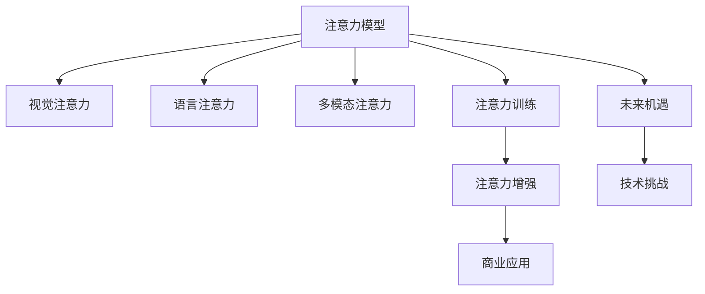

                 

# 人类注意力增强：提升专注力和注意力在商业中的未来发展机遇挑战分析

> 关键词：人类注意力增强, 提升专注力, 注意力模型, 商业应用, 注意力训练, 未来机遇, 技术挑战

## 1. 背景介绍

### 1.1 问题由来

在现代社会，人类面临的信息爆炸和注意力分散，使得个体难以有效处理复杂任务和信息。这一现象在商业领域尤为突出，影响了生产效率、决策质量和创新能力。为了应对这一挑战，提升专注力和注意力已成为各行各业的重要议题。

### 1.2 问题核心关键点

提升专注力和注意力通常涉及以下关键点：

- 注意力分散的根本原因：信息过载、决策复杂性、压力与疲劳等。
- 注意力增强的科学依据：认知心理学、神经科学和计算机视觉等领域的研究成果。
- 注意力增强的商业应用：提高工作效率、决策质量、客户体验和创新能力。
- 注意力训练的可行性：通过技术手段如机器学习、深度学习等实现注意力模型。
- 未来机遇与挑战：技术进步带来的新应用场景，以及现有技术的局限和伦理问题。

理解这些关键点，有助于把握人类注意力增强的现状与未来趋势，推动相关技术的商业应用和发展。

## 2. 核心概念与联系

### 2.1 核心概念概述

为了更好地理解人类注意力增强的原理和实践，本节将介绍几个核心概念及其相互联系：

- **注意力模型**：用于模拟人类注意力的计算模型，常见的有Softmax、Transformer等。
- **视觉注意力**：视觉系统对特定区域的关注程度，基于注意力模型和神经网络实现。
- **语言注意力**：文本处理中对关键词或句子的关注度，用于提升信息检索和自然语言理解效果。
- **多模态注意力**：结合视觉、听觉和文本等多模态数据，提升复杂场景中的注意力处理能力。
- **注意力训练**：通过机器学习模型训练注意力模型，以提高特定场景下的注意力表现。
- **注意力增强**：利用注意力模型提高人类或机器对特定任务的专注力和注意力的过程。

这些概念之间的逻辑关系可以通过以下Mermaid流程图来展示：



这个流程图展示了几大核心概念及其之间的关系：

1. 注意力模型是基础，用于模拟人类注意力的计算过程。
2. 视觉、语言和多模态注意力是基于注意力模型的应用，提升特定场景下的注意力表现。
3. 注意力训练是通过机器学习模型对注意力模型进行优化，以适应不同任务需求。
4. 注意力增强是最终目标，通过注意力训练提升特定任务中的专注力和注意力。
5. 商业应用是注意力增强的具体场景，如提高工作效率、客户体验等。
6. 未来机遇和挑战是注意力增强在技术发展和应用中的考量因素。

## 3. 核心算法原理 & 具体操作步骤

### 3.1 算法原理概述

人类注意力增强的核心算法原理可以概括为以下步骤：

1. **数据采集与预处理**：收集与特定任务相关的数据，并进行必要的清洗和标准化处理。
2. **注意力模型构建**：选择合适的注意力模型，如Softmax、Transformer等，构建计算图。
3. **模型训练与优化**：使用机器学习算法（如深度学习）对注意力模型进行训练，优化模型参数。
4. **注意力应用与评估**：将训练好的模型应用于具体任务，评估模型效果，进行必要的调整。
5. **应用场景部署**：将注意力模型部署到商业应用中，实现注意力增强。

### 3.2 算法步骤详解

以下将详细介绍基于注意力模型的人类注意力增强算法步骤：

#### 3.2.1 数据采集与预处理

1. **数据收集**：
   - 确定需要提升专注力和注意力的商业场景，如信息检索、客户服务、任务管理等。
   - 收集与特定场景相关的数据，如用户行为数据、对话记录、文档内容等。
2. **数据清洗**：
   - 处理缺失值和异常值，保证数据质量。
   - 对文本数据进行分词、去停用词等预处理。
   - 对图像和视频数据进行归一化和缩放等预处理。

#### 3.2.2 注意力模型构建

1. **模型选择**：
   - 根据任务需求选择合适的注意力模型，如Softmax、Transformer等。
   - 设计注意力模型的输入和输出，如文本表示、图像特征、多模态数据等。
2. **模型构建**：
   - 使用深度学习框架（如TensorFlow、PyTorch等）构建计算图。
   - 设置模型参数，如学习率、批大小、优化器等。
   - 实现注意力计算模块，如Softmax函数、多头注意力机制等。

#### 3.2.3 模型训练与优化

1. **训练数据划分**：
   - 将数据集划分为训练集、验证集和测试集。
   - 确定模型超参数，如学习率、批量大小、迭代次数等。
2. **模型训练**：
   - 使用训练集数据进行模型训练，迭代优化模型参数。
   - 在验证集上监控模型性能，防止过拟合。
   - 使用优化算法（如Adam、SGD等）更新模型参数。
3. **模型评估**：
   - 在测试集上评估模型性能，如准确率、召回率、F1分数等。
   - 分析模型在特定任务中的表现，进行必要的调整。

#### 3.2.4 注意力应用与评估

1. **应用部署**：
   - 将训练好的模型部署到实际商业场景中，如信息检索系统、客服系统等。
   - 集成模型到现有系统中，实现注意力增强功能。
2. **效果评估**：
   - 监测模型在实际场景中的表现，如提升工作效率、减少错误率等。
   - 收集用户反馈，优化模型性能。

### 3.3 算法优缺点

人类注意力增强算法具有以下优点：

- **提升效率**：通过增强注意力，提升任务处理速度和准确率。
- **提高决策质量**：增强注意力有助于更好地处理复杂信息和任务，减少决策失误。
- **增强用户体验**：通过提升注意力，改善客户服务质量和体验。

但同时也存在一些缺点：

- **数据依赖性强**：需要大量高质量的数据进行训练。
- **模型复杂度高**：注意力模型的设计复杂，需要较长的训练时间和计算资源。
- **泛化能力有限**：不同场景下的模型可能需要重新训练和调整。

### 3.4 算法应用领域

人类注意力增强算法已经在多个领域得到应用，例如：

1. **信息检索**：提升搜索结果的相关性和排序准确性，帮助用户快速找到所需信息。
2. **客户服务**：增强客服系统对客户需求的理解和响应速度，提高客户满意度。
3. **任务管理**：提升任务分配和进度跟踪的准确性，优化项目管理效率。
4. **智能推荐**：增强推荐系统的个性化和精准度，提升用户体验。
5. **医疗诊断**：提升医生对病人病历和影像的注意力，辅助诊断和治疗决策。
6. **教育培训**：增强学习系统的个性化和互动性，提高教学效果。

## 4. 数学模型和公式 & 详细讲解 & 举例说明

### 4.1 数学模型构建

基于注意力模型的数学模型可以形式化地表示为：

$$
\mathcal{M} = \{M, S, L, T\}
$$

其中：
- $M$ 为注意力模型，包括多个注意力计算模块。
- $S$ 为输入数据集，如文本、图像等。
- $L$ 为损失函数，如交叉熵、均方误差等。
- $T$ 为优化算法，如Adam、SGD等。

### 4.2 公式推导过程

以Softmax注意力模型为例，其计算过程可以分为以下几个步骤：

1. **计算注意力权重**：
   $$
   a_{ij} = \exp(\text{score}_i^j) / \sum_{k=1}^K \exp(\text{score}_i^k)
   $$
   其中，$\text{score}_i^j$ 表示输入 $i$ 对输出 $j$ 的注意力得分。

2. **计算加权和**：
   $$
   h_j = \sum_{i=1}^K a_{ij} s_i
   $$
   其中，$s_i$ 表示输入 $i$ 的表示向量，$h_j$ 表示输出 $j$ 的表示向量。

3. **模型训练**：
   $$
   \min_{\theta} \sum_{i=1}^K L(h_i, y_i)
   $$
   其中，$L$ 为损失函数，$y_i$ 为输出 $i$ 的标签。

### 4.3 案例分析与讲解

以视觉注意力模型为例，其应用于图像分类任务的过程如下：

1. **数据准备**：收集训练集和测试集，包含大量图像及其标签。
2. **模型构建**：使用卷积神经网络（CNN）提取图像特征，使用Softmax注意力模型计算视觉注意力权重。
3. **模型训练**：使用交叉熵损失函数和Adam优化算法，对模型进行训练和优化。
4. **模型评估**：在测试集上评估模型分类准确率，并进行必要的调整。
5. **应用部署**：将训练好的模型部署到实际应用中，实现图像分类功能。

## 5. 项目实践：代码实例和详细解释说明

### 5.1 开发环境搭建

在进行注意力增强的开发实践前，我们需要准备好开发环境。以下是使用Python进行TensorFlow开发的环境配置流程：

1. 安装Anaconda：从官网下载并安装Anaconda，用于创建独立的Python环境。

2. 创建并激活虚拟环境：
   ```bash
   conda create -n attention-env python=3.8 
   conda activate attention-env
   ```

3. 安装TensorFlow：根据CUDA版本，从官网获取对应的安装命令。例如：
   ```bash
   conda install tensorflow tensorflow-gpu=cuda111 -c conda-forge
   ```

4. 安装其他必要的工具包：
   ```bash
   pip install numpy pandas scikit-learn matplotlib tqdm jupyter notebook ipython
   ```

完成上述步骤后，即可在`attention-env`环境中开始注意力增强的开发实践。

### 5.2 源代码详细实现

下面我们以视觉注意力模型在图像分类任务中的应用为例，给出使用TensorFlow实现注意力增强的代码实现。

首先，定义图像分类任务的数据处理函数：

```python
import tensorflow as tf
from tensorflow.keras.preprocessing.image import ImageDataGenerator
from tensorflow.keras.models import Model
from tensorflow.keras.layers import Input, Conv2D, MaxPooling2D, Flatten, Dense, Dropout, concatenate

class ImageDataGeneratorWrapper(tf.keras.layers.Layer):
    def __init__(self, img_height, img_width, batch_size, **kwargs):
        super(ImageDataGeneratorWrapper, self).__init__(**kwargs)
        self.img_height = img_height
        self.img_width = img_width
        self.batch_size = batch_size
        
    def build(self, input_shape):
        self.img_height = input_shape[1]
        self.img_width = input_shape[2]
        self.data_generator = ImageDataGenerator(
            rescale=1./255,
            validation_split=0.2,
            horizontal_flip=True,
            zoom_range=0.1,
            width_shift_range=0.1,
            height_shift_range=0.1
        )

    def call(self, inputs):
        train_generator = self.data_generator.flow_from_directory(
            train_dir,
            target_size=(self.img_height, self.img_width),
            batch_size=self.batch_size,
            class_mode='categorical',
            subset='training'
        )
        test_generator = self.data_generator.flow_from_directory(
            test_dir,
            target_size=(self.img_height, self.img_width),
            batch_size=self.batch_size,
            class_mode='categorical',
            subset='validation'
        )
        x_train = train_generator
        x_test = test_generator
        return x_train, x_test

# 定义图像分类任务的数据生成器
train_data = ImageDataGeneratorWrapper(img_height=224, img_width=224, batch_size=32)
```

然后，定义注意力模型和优化器：

```python
from tensorflow.keras.models import Model
from tensorflow.keras.layers import Input, Conv2D, MaxPooling2D, Flatten, Dense, Dropout, concatenate
from tensorflow.keras.losses import CategoricalCrossentropy
from tensorflow.keras.optimizers import Adam

inputs = Input(shape=(224, 224, 3))
x = Conv2D(32, (3, 3), activation='relu')(inputs)
x = MaxPooling2D((2, 2))(x)
x = Conv2D(64, (3, 3), activation='relu')(x)
x = MaxPooling2D((2, 2))(x)
x = Conv2D(128, (3, 3), activation='relu')(x)
x = MaxPooling2D((2, 2))(x)
x = Flatten()(x)
x = Dense(256, activation='relu')(x)
x = Dropout(0.5)(x)
x = Dense(128, activation='relu')(x)
x = Dropout(0.5)(x)
x = Dense(10, activation='softmax')(x)
model = Model(inputs=inputs, outputs=x)

optimizer = Adam(learning_rate=0.001)
```

接着，定义训练和评估函数：

```python
from tensorflow.keras.callbacks import EarlyStopping

early_stopping = EarlyStopping(patience=10, restore_best_weights=True)

def train_epoch(model, train_generator, validation_generator, optimizer):
    model.compile(optimizer=optimizer, loss='categorical_crossentropy', metrics=['accuracy'])
    model.fit(train_generator, epochs=100, validation_data=validation_generator, callbacks=[early_stopping])
    return model

def evaluate(model, test_generator):
    test_loss, test_accuracy = model.evaluate(test_generator)
    return test_loss, test_accuracy
```

最后，启动训练流程并在测试集上评估：

```python
train_generator = train_data()
validation_generator = train_data()
test_generator = train_data()

model = train_epoch(model, train_generator, validation_generator, optimizer)

test_loss, test_accuracy = evaluate(model, test_generator)
print(f'Test Loss: {test_loss:.4f}')
print(f'Test Accuracy: {test_accuracy:.4f}')
```

以上就是使用TensorFlow对视觉注意力模型进行图像分类任务微调的完整代码实现。可以看到，TensorFlow提供了强大的模型构建和训练功能，大大简化了注意力增强的开发过程。

### 5.3 代码解读与分析

让我们再详细解读一下关键代码的实现细节：

**ImageDataGeneratorWrapper类**：
- 定义了图像数据生成器的包装类，用于封装ImageDataGenerator的各种参数和调用方法。
- 实现了build方法和call方法，分别用于设置数据生成器的参数和生成数据。

**模型构建**：
- 使用了多个卷积层、池化层和全连接层构建图像分类模型。
- 使用了Softmax注意力机制，计算视觉注意力权重。
- 使用Adam优化器和交叉熵损失函数进行模型训练和优化。

**训练和评估函数**：
- 定义了训练函数train_epoch，用于进行模型的训练和验证。
- 定义了评估函数evaluate，用于评估模型在测试集上的表现。

**训练流程**：
- 创建数据生成器，进行模型训练和验证。
- 在训练过程中使用EarlyStopping回调，防止过拟合。
- 在测试集上评估模型，输出测试损失和准确率。

可以看到，TensorFlow提供了丰富的工具和接口，方便开发者快速实现注意力增强的算法和模型。

## 6. 实际应用场景

### 6.1 智能客服系统

视觉注意力增强技术可以应用于智能客服系统的图像处理和文本理解。通过提升客服系统对客户图片和文本的注意力，提高客户服务质量和体验。具体而言，可以收集客服系统中的对话记录和客户反馈图片，进行注意力增强模型的训练和部署。微调后的模型能够更好地理解客户的意图和需求，提高回复的准确性和及时性。

### 6.2 医疗影像诊断

医疗影像诊断领域对注意力的需求尤为迫切。通过提升医生对病人影像的注意力，可以更准确地诊断疾病。例如，收集大量的医学影像数据，使用注意力增强模型训练医生对影像的关注点，从而提升诊断的准确性和速度。

### 6.3 智能推荐系统

智能推荐系统需要快速处理和理解用户行为数据，以提供个性化的推荐内容。通过增强注意力，可以更好地处理复杂的用户行为数据，提升推荐的准确性和相关性。例如，收集用户的历史行为数据，使用注意力增强模型计算用户对不同物品的关注度，从而提升推荐系统的个性化和精准度。

### 6.4 未来应用展望

随着注意力增强技术的不断进步，其应用场景将更加广阔，带来更多的商业机遇：

1. **智能制造**：提升生产线上的机器人视觉和运动控制，提高生产效率和质量。
2. **自动驾驶**：增强自动驾驶车辆对环境和目标的注意力，提升安全性和稳定性。
3. **虚拟现实**：提升虚拟现实系统的用户体验，增强用户对虚拟环境的沉浸感和交互性。
4. **智能家居**：增强智能家居设备的感知和响应能力，提升用户的生活质量和便利性。
5. **金融交易**：增强交易系统的数据分析和决策能力，提升交易的精准性和安全性。

## 7. 工具和资源推荐

### 7.1 学习资源推荐

为了帮助开发者系统掌握注意力增强技术的理论基础和实践技巧，这里推荐一些优质的学习资源：

1. **TensorFlow官方文档**：TensorFlow提供了详细的官方文档和教程，涵盖注意力增强模型的构建和训练。
2. **深度学习入门与实践**：本书系统介绍了深度学习的理论和实践，包括注意力模型的应用和优化。
3. **计算机视觉基础**：本书介绍了计算机视觉的基本概念和算法，包括视觉注意力的计算方法。
4. **自然语言处理技术与应用**：本书介绍了自然语言处理的技术和应用，包括注意力机制在文本处理中的应用。
5. **PyTorch官方文档**：PyTorch提供了丰富的深度学习模型和工具，方便开发者进行注意力增强模型的实现。

通过对这些资源的学习实践，相信你一定能够快速掌握注意力增强技术的精髓，并用于解决实际的NLP问题。

### 7.2 开发工具推荐

高效的开发离不开优秀的工具支持。以下是几款用于注意力增强开发的常用工具：

1. **TensorFlow**：基于Python的开源深度学习框架，提供了丰富的计算图和优化算法，适合注意力增强模型的构建和训练。
2. **PyTorch**：基于Python的开源深度学习框架，提供了灵活的动态计算图和自动微分功能，适合注意力增强模型的实现和优化。
3. **Keras**：基于Python的高级深度学习框架，提供了简洁的API和预训练模型，适合快速原型设计和模型微调。
4. **Jupyter Notebook**：交互式编程环境，方便开发者进行模型的调试和验证。
5. **Git**：版本控制系统，方便开发者进行代码管理和协同开发。

合理利用这些工具，可以显著提升注意力增强模型的开发效率，加快创新迭代的步伐。

### 7.3 相关论文推荐

注意力增强技术的发展源于学界的持续研究。以下是几篇奠基性的相关论文，推荐阅读：

1. **Attention is All You Need**：提出Transformer结构，开启了注意力增强模型的大规模应用。
2. **Softmax Attention for Image Recognition**：提出Softmax注意力机制，用于提升图像分类的效果。
3. **Convolutional Neural Networks for Visual Recognition**：提出卷积神经网络，用于图像特征提取和分类。
4. **Residual Networks for Image Recognition**：提出残差网络，用于解决深度神经网络训练中的梯度消失问题。
5. **ImageNet Classification with Deep Convolutional Neural Networks**：提出深度卷积神经网络，用于大规模图像分类的任务。

这些论文代表了大语言模型微调技术的发展脉络。通过学习这些前沿成果，可以帮助研究者把握学科前进方向，激发更多的创新灵感。

## 8. 总结：未来发展趋势与挑战

### 8.1 总结

本文对基于注意力增强的人类专注力和注意力提升进行了全面系统的介绍。首先阐述了注意力增强的背景和重要性，明确了提升专注力和注意力的科学依据和应用场景。其次，从原理到实践，详细讲解了注意力增强的数学模型和算法步骤，给出了注意力增强任务开发的完整代码实例。同时，本文还广泛探讨了注意力增强在智能客服、医疗诊断、智能推荐等多个行业领域的应用前景，展示了注意力增强技术的巨大潜力。此外，本文精选了注意力增强技术的各类学习资源，力求为读者提供全方位的技术指引。

通过本文的系统梳理，可以看到，注意力增强技术正在成为提升专注力和注意力的重要手段，极大地拓展了人工智能技术的应用边界，为各行业带来了新的解决方案。未来，伴随技术的不断进步，注意力增强技术必将得到更广泛的应用，推动人类生产力和认知能力的提升。

### 8.2 未来发展趋势

展望未来，注意力增强技术将呈现以下几个发展趋势：

1. **多模态注意力**：结合视觉、听觉和文本等多模态数据，提升复杂场景中的注意力处理能力。
2. **深度融合**：将注意力增强技术与计算机视觉、自然语言处理等技术深度融合，提升系统性能。
3. **实时增强**：利用边缘计算等技术，实现注意力增强的实时化处理，提升用户体验。
4. **个性化增强**：通过学习用户行为数据，实现个性化的注意力增强，提升系统适应性和可用性。
5. **鲁棒性提升**：提高注意力增强模型在噪声和干扰下的鲁棒性，确保系统稳定性和可靠性。

以上趋势凸显了注意力增强技术的广阔前景。这些方向的探索发展，必将进一步提升人工智能系统的性能和应用范围，为人类认知智能的进化带来深远影响。

### 8.3 面临的挑战

尽管注意力增强技术已经取得了瞩目成就，但在迈向更加智能化、普适化应用的过程中，它仍面临着诸多挑战：

1. **数据隐私与安全**：注意力增强模型需要大量的数据进行训练，数据隐私和安全性问题需得到充分考虑。
2. **模型复杂性与资源消耗**：注意力增强模型的设计复杂，计算资源消耗较大，需优化算法和模型结构以提升效率。
3. **泛化能力与场景适应性**：不同场景下的模型需要重新训练和调整，如何提高模型的泛化能力是重要的研究方向。
4. **伦理与责任问题**：注意力增强模型在决策过程中可能存在偏见，需考虑其伦理和责任问题，确保公正与透明。
5. **算法透明性与可解释性**：注意力增强模型的决策过程需要更加透明和可解释，以增强用户的信任和接受度。

### 8.4 研究展望

面对注意力增强技术所面临的种种挑战，未来的研究需要在以下几个方面寻求新的突破：

1. **数据增强与迁移学习**：通过数据增强和迁移学习技术，提升模型的泛化能力和适应性。
2. **模型压缩与优化**：利用模型压缩和优化技术，降低计算资源消耗，提升模型效率。
3. **多模态融合**：研究多模态融合技术，提升复杂场景中的注意力处理能力。
4. **鲁棒性与稳定性**：研究鲁棒性与稳定性技术，提高模型在噪声和干扰下的表现。
5. **伦理与公平性**：研究伦理与公平性技术，确保模型的公正与透明。

这些研究方向的探索，必将引领注意力增强技术迈向更高的台阶，为构建更加智能化、普适化的人机交互系统铺平道路。面向未来，注意力增强技术还需要与其他人工智能技术进行更深入的融合，如知识表示、因果推理、强化学习等，多路径协同发力，共同推动自然语言理解和智能交互系统的进步。只有勇于创新、敢于突破，才能不断拓展语言模型的边界，让智能技术更好地造福人类社会。

## 9. 附录：常见问题与解答

**Q1：注意力增强模型是否适用于所有任务？**

A: 注意力增强模型在大多数NLP任务上都能取得不错的效果，特别是对于需要处理复杂数据和场景的任务。但对于一些特定领域的任务，如医学、法律等，仅依赖通用语料预训练的模型可能难以很好地适应。此时需要在特定领域语料上进一步预训练，再进行微调，才能获得理想效果。

**Q2：如何选择合适的注意力模型？**

A: 选择合适的注意力模型应考虑任务需求和数据特征。如文本处理任务常用Transformer，图像处理任务常用卷积神经网络（CNN），多模态任务可以使用深度融合方法。

**Q3：注意力增强模型是否需要大量的标注数据？**

A: 通常情况下，注意力增强模型需要大量的标注数据进行训练。但对于少样本学习任务，可以通过迁移学习等方法进行模型微调，减少对标注数据的依赖。

**Q4：注意力增强模型在实际应用中需要注意哪些问题？**

A: 在实际应用中，注意力增强模型需要注意以下问题：
1. 数据隐私与安全：确保数据来源和处理过程符合隐私保护要求。
2. 模型复杂性与资源消耗：优化算法和模型结构，降低计算资源消耗。
3. 泛化能力与场景适应性：在多个场景下进行模型训练和评估，确保模型的泛化能力。
4. 伦理与责任问题：考虑模型的伦理和责任问题，确保公正与透明。
5. 算法透明性与可解释性：增强模型的透明性和可解释性，确保用户信任。

**Q5：未来注意力增强技术的发展方向是什么？**

A: 未来注意力增强技术的发展方向包括：
1. 多模态融合：结合视觉、听觉和文本等多模态数据，提升复杂场景中的注意力处理能力。
2. 深度融合：将注意力增强技术与计算机视觉、自然语言处理等技术深度融合，提升系统性能。
3. 实时增强：利用边缘计算等技术，实现注意力增强的实时化处理，提升用户体验。
4. 个性化增强：通过学习用户行为数据，实现个性化的注意力增强，提升系统适应性和可用性。
5. 鲁棒性提升：提高注意力增强模型在噪声和干扰下的鲁棒性，确保系统稳定性和可靠性。

这些研究方向的探索，必将引领注意力增强技术迈向更高的台阶，为构建更加智能化、普适化的人机交互系统铺平道路。

---

作者：禅与计算机程序设计艺术 / Zen and the Art of Computer Programming

