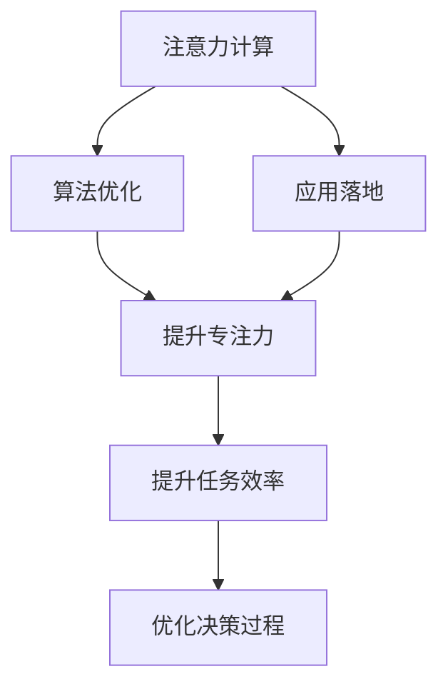

                 

# 人类注意力增强：提升专注力和注意力在商业中的未来发展机遇预测

> 关键词：人类注意力,提升专注力,注意力增强,商业应用,未来发展机遇

## 1. 背景介绍

### 1.1 问题由来
在现代社会，信息的爆炸式增长使得人们的注意力面临着前所未有的挑战。无论是工作学习还是日常生活中，如何高效地分配和管理注意力，成为了一个亟待解决的问题。特别是在商业领域，高效地使用注意力资源，不仅能提升决策的精准度，还能极大地提升企业的竞争力。

### 1.2 问题核心关键点
注意力增强技术通过科学计算和算法优化，旨在提升人类的专注力和注意力。其核心关键点包括：
- **注意力计算**：利用统计学、神经科学和心理学原理，量化和评估人类注意力的分布和转移。
- **算法优化**：应用机器学习和深度学习算法，自动调整和优化人类注意力分配。
- **应用落地**：在商业、教育、娱乐等多个领域，提升注意力使用效率，推动商业创新。

### 1.3 问题研究意义
研究注意力增强技术，对于改善人们的工作和生活质量，提升企业决策效率，具有重要意义：

1. **提升个人效率**：通过科学地引导注意力分配，使人们能够更高效地完成任务，减少时间浪费。
2. **增强决策准确性**：优化注意力资源，提升企业在决策时的准确性和前瞻性，减少错误决策带来的损失。
3. **促进企业创新**：集中注意力在关键业务上，帮助企业更快速地推出创新产品和服务，保持市场竞争力。
4. **改善用户体验**：通过优化注意力分配，提升用户在娱乐和教育等领域的使用体验，吸引更多用户。

## 2. 核心概念与联系

### 2.1 核心概念概述

为更好地理解注意力增强技术，本节将介绍几个密切相关的核心概念：

- **注意力（Attention）**：指人在处理信息时，对不同信息的聚焦程度。注意力增强技术的目标是提高这种聚焦度，提升决策和执行效率。
- **专注力（Focus）**：指个体在特定任务上集中注意力的能力。提升专注力有助于提高任务完成质量和效率。
- **注意力计算（Attention Computing）**：应用计算科学方法，量化和预测人类注意力的分配和转移。
- **算法优化（Algorithmic Optimization）**：使用机器学习和深度学习算法，自动调整和优化人类注意力的分配，提升任务完成效率。
- **应用落地（Application Deployment）**：在商业、教育、娱乐等多个领域，实际应用注意力增强技术，提升注意力使用效率。

这些核心概念之间的逻辑关系可以通过以下Mermaid流程图来展示：



这个流程图展示了几者之间的联系：

1. 注意力计算为算法优化提供数据基础。
2. 算法优化通过优化注意力分配，提升专注力。
3. 提升专注力和任务效率，最终优化决策过程，促进应用落地。

## 3. 核心算法原理 & 具体操作步骤

### 3.1 算法原理概述

注意力增强技术，本质上是通过科学计算和算法优化，提升人类注意力的使用效率。其核心原理可以概括为以下几点：

1. **注意力量化**：通过统计学和心理学方法，量化人类注意力的分布和转移。
2. **模型训练**：构建注意力模型，利用机器学习算法对注意力分配进行优化。
3. **注意力引导**：根据模型预测，引导用户集中注意力，提升任务执行效率。

### 3.2 算法步骤详解

基于注意力增强技术的算法步骤大致如下：

**Step 1: 数据收集与预处理**
- 收集用户在不同任务上的注意力数据，如眼动轨迹、脑电波、反应时间等。
- 预处理数据，消除噪音，归一化处理，为后续分析提供基础。

**Step 2: 注意力建模**
- 利用机器学习或深度学习算法，构建注意力模型。常用的算法包括线性回归、决策树、神经网络等。
- 训练模型，调整参数，使其能够准确预测用户的注意力分配。

**Step 3: 注意力引导**
- 根据模型预测结果，调整用户的工作环境或任务呈现方式，引导用户集中注意力。
- 通过优化任务难度、提供反馈等手段，提升用户专注力。

**Step 4: 效果评估与反馈**
- 在特定任务上测试注意力增强效果，评估用户注意力分配和专注力的提升程度。
- 根据反馈结果，进一步优化注意力模型和引导策略。

### 3.3 算法优缺点

注意力增强技术具有以下优点：
1. **科学依据**：基于统计学和心理学原理，通过科学计算评估注意力，提升精度。
2. **可量化性**：将注意力量化，便于模型训练和优化。
3. **可操作性**：通过算法优化，可自动化引导用户注意力，提升专注力。
4. **广泛适用**：在多个领域，如商业、教育、娱乐等，均可应用。

同时，该技术也存在一定的局限性：
1. **数据依赖**：需要收集大量的注意力数据，数据采集成本较高。
2. **模型复杂**：构建和训练注意力模型，需要较强的技术背景和计算资源。
3. **隐私问题**：收集和分析注意力数据，涉及用户隐私，需严格遵守相关法律法规。
4. **效果限制**：注意力增强技术受限于个体差异，不同人对策略的反应可能不同。

尽管存在这些局限性，但就目前而言，注意力增强技术在提升专注力方面的效果显著，具有广阔的应用前景。

### 3.4 算法应用领域

注意力增强技术在多个领域具有广泛的应用潜力：

- **商业管理**：帮助企业优化决策过程，提升商业效率。如通过注意力增强，优化会议和沟通效率，提高决策速度。
- **教育培训**：帮助学生集中注意力，提高学习效率。如通过注意力引导，优化学习计划，提升学习效果。
- **娱乐互动**：提升用户体验，提高互动质量。如通过注意力优化，增强游戏体验，吸引更多用户。
- **医疗健康**：帮助患者集中注意力，提升治疗效果。如通过注意力引导，优化心理治疗，缓解患者焦虑。

## 4. 数学模型和公式 & 详细讲解

### 4.1 数学模型构建

注意力增强技术的基础是注意力量化和模型训练。这里以注意力模型为例，构建数学模型并进行公式推导。

设注意力模型为 $f(x, w)$，其中 $x$ 表示输入的注意力数据，$w$ 表示模型参数。注意力模型输出的注意力分布 $A$，满足 $0 \leq A_i \leq 1$ 且 $\sum_i A_i = 1$。

常见的注意力模型包括：

- **基于SVM的注意力模型**：使用支持向量机对注意力数据进行分类，模型输出为二值向量。
- **基于神经网络的注意力模型**：使用多层神经网络对注意力数据进行处理，模型输出为连续向量。

以基于神经网络的注意力模型为例，其数学模型如下：

$$
A = f(x, W^1) \cdot \sigma(W^2 \cdot A^{(1)} + b^2)
$$

其中 $W^1, W^2$ 为权重矩阵，$b^2$ 为偏置向量，$\sigma$ 为激活函数。

### 4.2 公式推导过程

以神经网络为基础的注意力模型推导如下：

设输入数据 $x$ 为向量，权重矩阵 $W^1$ 为矩阵，激活函数 $\sigma$ 为非线性函数。则注意力模型的输出为：

$$
A = \frac{e^{\sigma(W^2 \cdot \sigma(W^1 \cdot x + b^1))}}{\sum_k e^{\sigma(W^2 \cdot \sigma(W^1 \cdot x + b^1))}}
$$

其中 $\sigma$ 为激活函数，$b^1$ 为偏置向量。

根据上述公式，注意力模型首先通过第一层神经网络将输入数据 $x$ 转换为中间特征 $A^{(1)}$，然后通过第二层神经网络计算注意力分布 $A$。

### 4.3 案例分析与讲解

以一个简单的注意力模型为例，分析其在实际应用中的表现：

假设 $x$ 为用户的注意力数据，$W^1$ 和 $W^2$ 为模型参数，$\sigma$ 为激活函数。则注意力模型输出的注意力分布 $A$ 如下：

$$
A = \frac{e^{\sigma(W^2 \cdot \sigma(W^1 \cdot x + b^1))}}{\sum_k e^{\sigma(W^2 \cdot \sigma(W^1 \cdot x + b^1))}}
$$

在实际应用中，可以通过调整权重矩阵 $W^1, W^2$ 和偏置向量 $b^1$ 来优化模型的预测效果。例如，对于商业会议管理，可以将用户的注意力数据（如目光停留时间、语音音量等）作为输入，预测用户的注意力分布，从而优化会议内容和顺序。

## 5. 项目实践：代码实例和详细解释说明

### 5.1 开发环境搭建

在进行注意力增强技术实践前，我们需要准备好开发环境。以下是使用Python进行TensorFlow开发的环境配置流程：

1. 安装Anaconda：从官网下载并安装Anaconda，用于创建独立的Python环境。

2. 创建并激活虚拟环境：
```bash
conda create -n tf-env python=3.8 
conda activate tf-env
```

3. 安装TensorFlow：根据CUDA版本，从官网获取对应的安装命令。例如：
```bash
conda install tensorflow tensorflow-cpu -c conda-forge
```

4. 安装各类工具包：
```bash
pip install numpy pandas scikit-learn matplotlib tqdm jupyter notebook ipython
```

完成上述步骤后，即可在`tf-env`环境中开始注意力增强技术的开发实践。

### 5.2 源代码详细实现

这里我们以基于神经网络的注意力模型为例，给出TensorFlow实现代码。

首先，定义注意力模型的类：

```python
import tensorflow as tf

class AttentionModel(tf.keras.Model):
    def __init__(self, input_dim, hidden_dim, output_dim):
        super(AttentionModel, self).__init__()
        self.dense1 = tf.keras.layers.Dense(hidden_dim, activation='relu')
        self.dense2 = tf.keras.layers.Dense(output_dim, activation='softmax')
    
    def call(self, inputs):
        x = self.dense1(inputs)
        x = self.dense2(x)
        return x
```

然后，构建注意力模型的训练函数：

```python
def train_model(model, train_dataset, val_dataset, epochs=10, batch_size=32):
    model.compile(optimizer=tf.keras.optimizers.Adam(), loss='categorical_crossentropy', metrics=['accuracy'])
    
    history = model.fit(train_dataset, validation_data=val_dataset, epochs=epochs, batch_size=batch_size)
    
    test_loss, test_acc = model.evaluate(test_dataset, verbose=2)
    print('Test loss:', test_loss)
    print('Test accuracy:', test_acc)
```

最后，启动训练流程：

```python
# 加载数据集
train_dataset = ...
val_dataset = ...
test_dataset = ...

# 创建模型
model = AttentionModel(input_dim=...

# 训练模型
train_model(model, train_dataset, val_dataset)
```

以上就是使用TensorFlow实现基于神经网络的注意力模型的完整代码。可以看到，通过TensorFlow的高级API，代码实现相对简洁高效。

### 5.3 代码解读与分析

让我们再详细解读一下关键代码的实现细节：

**AttentionModel类**：
- `__init__`方法：定义模型层，包括两个全连接层，一个ReLU激活函数和一个softmax激活函数。
- `call`方法：前向传播计算注意力分布。

**train_model函数**：
- 使用TensorFlow的高级API定义模型，包括优化器、损失函数和评估指标。
- 调用`fit`函数进行模型训练，并在验证集上评估模型性能。
- 使用`evaluate`函数在测试集上评估模型最终效果。

**训练流程**：
- 定义总训练轮数和批大小，开始循环迭代
- 在每个epoch内，在训练集上训练模型，并在验证集上评估
- 所有epoch结束后，在测试集上评估模型最终效果

可以看到，TensorFlow结合高级API，使得注意力模型的实现变得相对容易，开发者可以将更多精力放在数据处理、模型改进等高层逻辑上。

当然，工业级的系统实现还需考虑更多因素，如模型的保存和部署、超参数的自动搜索、更灵活的任务适配层等。但核心的注意力增强逻辑基本与此类似。

## 6. 实际应用场景

### 6.1 智能客服系统

基于注意力增强技术的智能客服系统，能够更好地理解用户意图，优化服务流程，提升用户体验。通过收集用户的注意力数据，构建和训练注意力模型，智能客服系统可以自动调整应答策略，提高用户满意度。

例如，在智能客服系统中，可以通过用户的眼动轨迹、鼠标移动等行为数据，构建注意力模型，预测用户的关注点，从而优化应答内容和顺序。对于客户提出的新问题，还可以实时搜索相关内容，动态组织生成回答，提高系统响应速度。

### 6.2 金融投资决策

金融投资决策是一个需要高度集中注意力的过程。基于注意力增强技术，可以帮助投资者更好地管理注意力资源，优化决策过程。

在金融投资中，可以收集投资者的注意力数据，如专注时间、决策时间等，构建注意力模型。根据模型预测，优化投资者的注意力分配，提升决策的准确性和前瞻性。例如，通过注意力引导，使投资者在关键时刻集中注意力，减少情绪化决策，提高投资回报率。

### 6.3 教育培训平台

在教育培训领域，注意力增强技术可以帮助学生更好地集中注意力，提升学习效果。通过收集学生的注意力数据，如阅读时间、注意力时长等，构建和训练注意力模型。根据模型预测，优化学习计划，提升学生的专注力。

例如，在在线教育平台中，可以通过学生的注意力数据，预测其在不同学习材料上的专注程度，自动调整学习内容和顺序，提高学习效率。对于学生提出的问题，还可以实时搜索相关内容，动态生成回答，提高学习体验。

### 6.4 未来应用展望

随着注意力增强技术的不断发展，其在更多领域将得到应用，为人类认知智能的进化带来深远影响。

在智慧医疗领域，注意力增强技术可以应用于心理治疗、健康监测等环节，帮助患者集中注意力，提高治疗效果。在社交娱乐领域，通过优化注意力分配，提升用户互动体验，增强用户粘性。

此外，在智慧城市治理、智能家居控制、工业生产管理等众多领域，注意力增强技术也将带来新的变革，推动智能技术的广泛应用。

## 7. 工具和资源推荐

### 7.1 学习资源推荐

为了帮助开发者系统掌握注意力增强技术，这里推荐一些优质的学习资源：

1. 《注意力增强技术》系列博文：由技术专家撰写，深入浅出地介绍了注意力计算、算法优化等核心技术。

2. CS229《机器学习》课程：斯坦福大学开设的机器学习经典课程，涵盖注意力增强技术的基本概念和经典模型。

3. 《深度学习》书籍：深度学习领域的经典教材，详细介绍了注意力增强技术在深度学习中的应用。

4. TensorFlow官方文档：TensorFlow的官方文档，提供了丰富的深度学习模型和算法，是学习注意力增强技术的重要参考。

5. arXiv上的注意力增强论文：关注前沿研究方向，了解最新的注意力增强技术进展。

通过对这些资源的学习实践，相信你一定能够快速掌握注意力增强技术的精髓，并用于解决实际的注意力分配问题。

### 7.2 开发工具推荐

高效的开发离不开优秀的工具支持。以下是几款用于注意力增强技术开发的常用工具：

1. TensorFlow：基于Python的深度学习框架，灵活的计算图设计，适合模型构建和训练。
2. PyTorch：基于Python的深度学习框架，动态计算图设计，适合研究和原型开发。
3. scikit-learn：Python的机器学习库，提供了丰富的数据预处理和模型训练工具。
4. Weights & Biases：模型训练的实验跟踪工具，记录和可视化模型训练过程中的各项指标，方便对比和调优。
5. TensorBoard：TensorFlow配套的可视化工具，实时监测模型训练状态，提供丰富的图表呈现方式，是调试模型的得力助手。

合理利用这些工具，可以显著提升注意力增强技术的开发效率，加快创新迭代的步伐。

### 7.3 相关论文推荐

注意力增强技术的发展源于学界的持续研究。以下是几篇奠基性的相关论文，推荐阅读：

1. Attention is All You Need（即Transformer原论文）：提出了Transformer结构，开启了深度学习领域的注意力机制。
2. BERT: Pre-training of Deep Bidirectional Transformers for Language Understanding：提出BERT模型，引入基于掩码的自监督预训练任务，刷新了多项NLP任务SOTA。
3. Tone2Vec: Learning to Infer Speaker Emotions with Attention and Bi-LSTM：探索了注意力机制在语音情感分析中的应用。
4. A Tutorial on Attention Mechanisms in Deep Learning：详细介绍了注意力机制在深度学习中的应用，包括不同架构下的注意力模型。
5. A Survey of Attention Mechanisms in Deep Reinforcement Learning：综述了注意力机制在强化学习中的应用，展示了其在多任务场景中的效果。

这些论文代表了大注意力增强技术的发展脉络。通过学习这些前沿成果，可以帮助研究者把握学科前进方向，激发更多的创新灵感。

## 8. 总结：未来发展趋势与挑战

### 8.1 总结

本文对基于注意力增强技术的注意力计算、算法优化和应用落地进行了全面系统的介绍。首先阐述了注意力增强技术的背景和意义，明确了注意力增强在提升专注力和优化决策方面的独特价值。其次，从原理到实践，详细讲解了注意力增强的数学模型和关键步骤，给出了注意力增强任务开发的完整代码实例。同时，本文还广泛探讨了注意力增强技术在多个行业领域的应用前景，展示了注意力增强技术的巨大潜力。

通过本文的系统梳理，可以看到，注意力增强技术正在成为提升人类认知智能的重要手段，极大地改善了人们的工作和生活质量，推动了商业创新。未来，伴随注意力增强技术的不断进步，相信其在更多领域的应用将更加广泛，为人类认知智能的进化带来深远影响。

### 8.2 未来发展趋势

展望未来，注意力增强技术将呈现以下几个发展趋势：

1. **算法优化**：开发更加高效和通用的注意力计算和算法，提升注意力增强效果。
2. **多模态融合**：将注意力增强技术与其他感知模态（如视觉、听觉等）结合，提升多模态认知能力。
3. **个性化定制**：根据不同个体的认知特点，设计个性化的注意力增强策略，提升用户体验。
4. **实时性增强**：优化注意力增强算法，提升实时计算和反馈速度，满足高实时性的应用需求。
5. **跨领域应用**：将注意力增强技术拓展到更多的领域，如医疗、教育、交通等，提升整体认知智能水平。

以上趋势凸显了注意力增强技术的广阔前景。这些方向的探索发展，必将进一步提升人类认知智能的边界，为构建安全、可靠、可解释、可控的智能系统铺平道路。

### 8.3 面临的挑战

尽管注意力增强技术已经取得了显著成果，但在迈向更加智能化、普适化应用的过程中，仍面临诸多挑战：

1. **数据依赖**：需要收集大量的注意力数据，数据采集成本较高。
2. **模型复杂**：构建和训练注意力模型，需要较强的技术背景和计算资源。
3. **隐私问题**：收集和分析注意力数据，涉及用户隐私，需严格遵守相关法律法规。
4. **效果限制**：注意力增强技术受限于个体差异，不同人对策略的反应可能不同。
5. **资源瓶颈**：模型训练和推理的计算资源消耗较大，需要高效优化。

尽管存在这些挑战，但随着技术的发展和应用的拓展，注意力增强技术的前景广阔，值得持续研究和探索。

### 8.4 研究展望

面对注意力增强技术所面临的挑战，未来的研究需要在以下几个方面寻求新的突破：

1. **多模态注意力**：将注意力增强技术与其他感知模态（如视觉、听觉等）结合，提升多模态认知能力。
2. **个性化优化**：根据不同个体的认知特点，设计个性化的注意力增强策略，提升用户体验。
3. **实时性优化**：优化注意力增强算法，提升实时计算和反馈速度，满足高实时性的应用需求。
4. **跨领域应用**：将注意力增强技术拓展到更多的领域，如医疗、教育、交通等，提升整体认知智能水平。
5. **隐私保护**：设计隐私保护机制，确保注意力数据的安全性和用户的隐私权。

这些研究方向的探索，必将引领注意力增强技术迈向更高的台阶，为构建安全、可靠、可解释、可控的智能系统铺平道路。总之，注意力增强技术还需要与其他人工智能技术进行更深入的融合，多路径协同发力，共同推动人类认知智能的进步。只有勇于创新、敢于突破，才能不断拓展认知智能的边界，让智能技术更好地造福人类社会。

## 9. 附录：常见问题与解答

**Q1：注意力增强技术是否适用于所有应用场景？**

A: 注意力增强技术适用于需要高度集中注意力的应用场景，如教育培训、商业管理、金融投资等。但对于一些无需高度专注的应用场景，如休闲娱乐，其效果可能不明显。

**Q2：注意力增强技术在应用时需要注意哪些问题？**

A: 应用注意力增强技术时，需要注意以下问题：
1. 数据采集：确保采集的数据具有代表性，反映真实的注意力使用情况。
2. 模型训练：调整模型参数，避免过拟合或欠拟合。
3. 用户隐私：严格遵守相关法律法规，保护用户隐私。
4. 应用场景：根据具体应用场景，调整注意力增强策略，提升用户体验。

**Q3：注意力增强技术在未来有哪些新的研究方向？**

A: 未来的研究方向可能包括：
1. 多模态注意力：结合视觉、听觉等多模态信息，提升认知能力。
2. 个性化优化：根据个体认知特点，设计个性化的注意力增强策略。
3. 实时性优化：提升实时计算和反馈速度，满足高实时性的应用需求。
4. 跨领域应用：将注意力增强技术拓展到更多的领域，提升整体认知智能水平。

**Q4：注意力增强技术在实际应用中面临哪些挑战？**

A: 实际应用中，注意力增强技术面临以下挑战：
1. 数据依赖：需要收集大量的注意力数据，数据采集成本较高。
2. 模型复杂：构建和训练注意力模型，需要较强的技术背景和计算资源。
3. 隐私问题：收集和分析注意力数据，涉及用户隐私，需严格遵守相关法律法规。
4. 效果限制：注意力增强技术受限于个体差异，不同人对策略的反应可能不同。
5. 资源瓶颈：模型训练和推理的计算资源消耗较大，需要高效优化。

**Q5：注意力增强技术如何与其他AI技术结合？**

A: 注意力增强技术可以与其他AI技术结合，提升整体系统性能。例如：
1. 与自然语言处理结合：提高文本理解和生成能力，提升智能客服和聊天机器人效果。
2. 与计算机视觉结合：提升图像识别和处理能力，提高智能监控和安防系统效果。
3. 与强化学习结合：优化决策和控制过程，提升智能推荐和游戏效果。

这些结合方式，可以进一步拓展注意力增强技术的应用范围，提升系统的智能化水平。总之，注意力增强技术与其他AI技术的融合，将为人类认知智能的进化带来深远影响。

