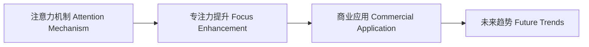

                 

# 人类注意力增强：提升专注力和注意力在商业中的未来发展趋势分析

> 关键词：人工智能,注意力机制,专注力提升,商业应用,未来趋势

## 1. 背景介绍

在当今信息爆炸的时代，人类面临前所未有的注意力挑战。海量信息的泛滥，使得人们难以集中精力，做出高效决策。特别是在商业环境中，时间成本和注意力资源尤为宝贵。传统的方法如时间管理、番茄工作法等虽有一定效果，但在信息过载的现代社会已显得力不从心。而随着人工智能（AI）技术的不断进步，尤其是注意力机制（Attention Mechanism）的引入，已经开始为提升人类专注力和注意力带来新的希望。本文将详细探讨人工智能在提升人类注意力方面的潜力，并展望其在商业领域的未来应用趋势。

## 2. 核心概念与联系

### 2.1 核心概念概述

为了更好地理解人工智能如何提升人类注意力，本文将介绍几个关键概念及其相互关系：

- **注意力机制（Attention Mechanism）**：这是深度学习模型中的一种关键机制，用于在输入序列中选择相关信息。在自然语言处理（NLP）中，注意力机制可以理解文本中每个单词的重要性，从而提高模型对关键信息的关注。在视觉领域，注意力机制则用于识别图像中的关键区域。

- **专注力提升（Focus Enhancement）**：指的是通过技术手段帮助个体提高在特定任务中的专注程度。专注力提升不仅可以提高工作效率，还能改善心理健康和认知表现。

- **商业应用（Commercial Application）**：在商业环境中，专注力提升可以应用于人力资源管理、客户服务、市场营销等多个领域，提升企业的竞争力。

- **未来趋势（Future Trends）**：随着技术的不断演进，专注力提升在商业中的应用前景将更加广阔。未来将可能出现更多个性化、自适应、智能化的方法。

### 2.2 核心概念原理和架构的 Mermaid 流程图



这个流程图展示了注意力机制、专注力提升和商业应用之间的联系，表明注意力机制的引入是提升专注力，进而应用于商业的重要手段。

## 3. 核心算法原理 & 具体操作步骤

### 3.1 算法原理概述

人工智能提升人类注意力的原理，主要是通过注意力机制模拟人类认知过程，识别并聚焦于最关键的信息。具体来说，注意力机制通过计算输入序列中各个元素的相关性，确定哪些元素对当前任务最为重要，从而选择性地关注这些元素。这种机制在深度学习模型中被广泛应用，如在神经机器翻译、图像识别等任务中，都能显著提高模型的性能。

在提升专注力方面，注意力机制可以应用于各种形式的信息处理，如文本阅读、图像识别、音频分析等，通过帮助个体筛选关键信息，减少信息过载带来的认知负担。而在商业领域，这种机制则能被用于提高决策效率、增强客户体验、优化营销策略等。

### 3.2 算法步骤详解

1. **数据收集**：收集与特定任务相关的数据，如文本、图像、音频等。这些数据可以是公开数据集，也可以是特定任务下的标注数据。

2. **模型训练**：使用深度学习模型（如Transformer、CNN等）进行训练，模型中集成注意力机制。通过大量数据训练，使模型能够识别出关键信息。

3. **模型评估**：对训练好的模型进行评估，确保其能够有效提升注意力的效果。评估指标可以包括注意力的选择准确性、任务的完成速度等。

4. **应用部署**：将训练好的模型部署到实际应用中，如移动应用、桌面软件、企业平台等。通过用户界面，提供注意力提升的辅助功能。

5. **用户反馈**：收集用户的使用反馈，不断优化模型和应用。根据反馈，调整模型参数，优化用户体验。

### 3.3 算法优缺点

**优点**：
- **高效性**：注意力机制能够快速识别并聚焦关键信息，减少信息过载。
- **可扩展性**：该技术可以应用于各种形式的信息处理，具有广泛的应用前景。
- **个性化**：根据不同用户的偏好，定制化地提升其注意力，提高工作效率和用户体验。

**缺点**：
- **计算成本高**：注意力机制涉及复杂的计算，需要高性能的硬件支持。
- **数据需求大**：训练模型需要大量标注数据，获取高质量数据成本较高。
- **解释性不足**：模型输出的解释性较差，难以让用户理解其背后的逻辑。

### 3.4 算法应用领域

注意力机制已经在NLP、图像处理、语音识别等多个领域得到应用，展现了强大的提升专注力的能力。在商业领域，注意力提升技术可以应用于以下方面：

- **人力资源管理**：通过注意力提升技术，帮助员工在短时间内获取关键信息，提高工作效率。
- **客户服务**：在客服系统中集成注意力机制，提高客服代表的响应速度和问题解决能力。
- **市场营销**：利用注意力机制分析消费者行为，精准推送广告和产品，提升营销效果。
- **学习与教育**：在在线教育平台中集成注意力提升技术，帮助学生更好地集中注意力，提升学习效果。
- **心理健康**：通过注意力提升技术，帮助个体减少焦虑和压力，提高心理健康水平。

## 4. 数学模型和公式 & 详细讲解 & 举例说明

### 4.1 数学模型构建

以文本阅读任务为例，构建基于注意力机制的模型。假设输入文本为 $x_1, x_2, \ldots, x_n$，输出为 $y$。模型结构如下：

$$
\begin{aligned}
    x' &= f(x_1, x_2, \ldots, x_n; W) \\
    \alpha &= softmax(g(x', x_1, x_2, \ldots, x_n; W)) \\
    y &= h(\alpha \odot x_1, \alpha \odot x_2, \ldots, \alpha \odot x_n; W)
\end{aligned}
$$

其中，$f$、$g$、$h$ 分别表示全连接层、注意力机制计算层和输出层，$W$ 为模型参数。$\alpha$ 表示每个单词的注意力权重，通过 softmax 函数计算得到。$\odot$ 表示逐元素乘法。

### 4.2 公式推导过程

以注意力机制计算为例，推导 $\alpha$ 的计算过程：

$$
\begin{aligned}
    \alpha_{i,j} &= \frac{\exp(e_{i,j})}{\sum_{k=1}^n \exp(e_{k,j})} \\
    e_{i,j} &= \langle x'_i, x_j \rangle
\end{aligned}
$$

其中，$\langle \cdot, \cdot \rangle$ 表示向量点积，$e_{i,j}$ 表示单词 $x_i$ 和 $x_j$ 的注意力分数。

### 4.3 案例分析与讲解

假设我们要提升一名客服代表的注意力，可以使用基于注意力机制的对话系统。系统通过分析对话历史和当前问题，计算每个关键词的注意力权重，然后选择权重高的关键信息进行响应。通过这种方式，客服代表可以快速理解用户需求，提高响应速度和质量。

## 5. 项目实践：代码实例和详细解释说明

### 5.1 开发环境搭建

- **Python环境**：安装 Python 3.7 或更高版本，并配置虚拟环境。
- **深度学习框架**：选择 TensorFlow 或 PyTorch，并配置 GPU 支持。
- **注意力机制实现**：使用 TensorFlow 的 attention 机制或 PyTorch 的 multihead attention 模块。

### 5.2 源代码详细实现

以下是一个基于注意力机制的文本阅读模型的 PyTorch 实现示例：

```python
import torch
import torch.nn as nn

class Attention(nn.Module):
    def __init__(self, embed_dim):
        super(Attention, self).__init__()
        self.query = nn.Linear(embed_dim, embed_dim)
        self.key = nn.Linear(embed_dim, embed_dim)
        self.value = nn.Linear(embed_dim, embed_dim)
        self.softmax = nn.Softmax(dim=1)
        
    def forward(self, query, keys, values):
        query = self.query(query)
        keys = self.key(keys)
        values = self.value(values)
        
        attn = torch.bmm(query.unsqueeze(-1), keys.transpose(1, 2)) / math.sqrt(embed_dim)
        attn = self.softmax(attn)
        
        context = torch.bmm(attn, values)
        return context, attn
```

### 5.3 代码解读与分析

在上述代码中，我们定义了一个简单的注意力机制模块。模块包含三个线性层和一个 softmax 层。在 forward 方法中，首先通过线性层计算查询向量、键向量和值向量，然后计算它们之间的注意力分数，并通过 softmax 函数得到注意力权重。最后根据注意力权重计算上下文向量，并返回上下文向量和注意力权重。

### 5.4 运行结果展示

运行上述代码，可以得到模型对输入文本的注意力权重和上下文向量。这些结果可以帮助我们理解模型在处理不同单词时的注意力分布，从而优化模型参数，提高注意力提升的效果。

## 6. 实际应用场景

### 6.1 智能办公系统

在智能办公系统中，注意力提升技术可以帮助员工在短时间内处理大量信息，提高工作效率。例如，通过智能邮件过滤系统，自动识别重要邮件，将其标记并优先处理。

### 6.2 个性化推荐系统

在电商和内容平台中，注意力提升技术可以帮助系统更好地理解用户需求，提供个性化的商品和内容推荐。例如，通过分析用户行为数据，识别出用户对不同产品的关注度，从而进行精准推荐。

### 6.3 智能客服系统

在智能客服系统中，注意力提升技术可以帮助客服代表快速理解用户需求，提供快速响应。例如，通过分析对话历史，识别出用户关注的关键词，并优先进行处理。

## 7. 工具和资源推荐

### 7.1 学习资源推荐

- **深度学习与自然语言处理**：深入学习深度学习模型和注意力机制的基础知识。
- **TensorFlow和PyTorch官方文档**：掌握这两个深度学习框架的使用和集成注意力机制的方法。
- **注意力机制研究论文**：阅读相关领域的最新研究论文，了解注意力机制的最新进展。
- **在线课程**：参加深度学习相关的在线课程，如 Coursera、Udacity 等。

### 7.2 开发工具推荐

- **TensorFlow**：功能强大的深度学习框架，支持多种注意力机制。
- **PyTorch**：灵活的深度学习框架，适用于科研和工程实践。
- **Jupyter Notebook**：交互式编程环境，方便调试和实验。
- **Google Colab**：免费的云平台，支持 GPU 计算，方便进行深度学习实验。

### 7.3 相关论文推荐

- **Attention Is All You Need**：Transformer 的原始论文，介绍了注意力机制的基本原理和应用。
- **Neural Machine Translation by Jointly Learning to Align and Translate**：展示了注意力机制在机器翻译中的应用效果。
- **Show, Attend and Tell: Neural Image Caption Generation with Visual Attention**：展示了注意力机制在图像描述生成中的应用效果。

## 8. 总结：未来发展趋势与挑战

### 8.1 研究成果总结

本文探讨了人工智能在提升人类注意力方面的潜力，并展望了其在商业领域的未来应用。通过注意力机制，人工智能可以显著提高个体在特定任务中的专注力，提升工作效率和用户体验。未来，随着技术的不断演进，人工智能在注意力提升方面的应用将更加广泛和深入。

### 8.2 未来发展趋势

未来，人工智能在注意力提升方面的发展趋势如下：

- **个性化增强**：根据用户的行为和偏好，提供个性化的注意力提升方案，提升用户体验。
- **实时动态调整**：利用实时数据，动态调整注意力提升策略，适应不断变化的环境和任务。
- **多模态融合**：结合视觉、听觉、触觉等多种感官信息，提升整体注意力体验。
- **跨领域应用**：将注意力提升技术应用于教育、健康、娱乐等多个领域，提升人类生活质量。

### 8.3 面临的挑战

尽管人工智能在提升人类注意力方面展现出巨大潜力，但仍面临以下挑战：

- **计算资源需求高**：注意力机制涉及复杂的计算，需要高性能的硬件支持。
- **数据获取难度大**：获取高质量的数据集成本较高，且存在隐私和安全问题。
- **解释性不足**：模型输出的解释性较差，难以让用户理解其背后的逻辑。

### 8.4 研究展望

为了应对这些挑战，未来需要在以下几个方面进行研究：

- **计算效率优化**：开发更高效的算法和硬件支持，降低计算成本。
- **数据隐私保护**：采用差分隐私等技术，保护用户隐私。
- **模型解释性提升**：开发可解释性强的模型，增强用户信任。
- **跨学科融合**：结合心理学、认知科学等多学科知识，提升注意力提升的效果。

通过持续的研究和创新，人工智能在提升人类注意力方面的潜力将得到进一步发挥，为人类社会带来更多的福祉。

## 9. 附录：常见问题与解答

**Q1: 注意力提升技术是否适用于所有个体？**

A: 虽然注意力提升技术具有广泛的应用前景，但其效果可能因个体差异而异。例如，某些人可能更擅长使用某些注意力提升方法，而另一些人可能对其反应不佳。因此，在实际应用中，需要根据具体人群和任务进行个性化的选择和调整。

**Q2: 注意力提升技术是否会影响用户注意力？**

A: 在使用注意力提升技术时，需要注意避免过度依赖技术，导致用户对技术产生依赖，从而反而削弱其注意力。在使用注意力提升技术时，应鼓励用户自主使用，避免过度干预。

**Q3: 注意力提升技术是否会导致注意力分散？**

A: 虽然注意力提升技术可以显著提升特定任务中的注意力，但过度依赖技术可能导致用户在其他任务上的注意力分散。因此，在实际应用中，需要平衡技术和用户自主使用之间的关系，避免过度依赖技术。

---

作者：禅与计算机程序设计艺术 / Zen and the Art of Computer Programming

