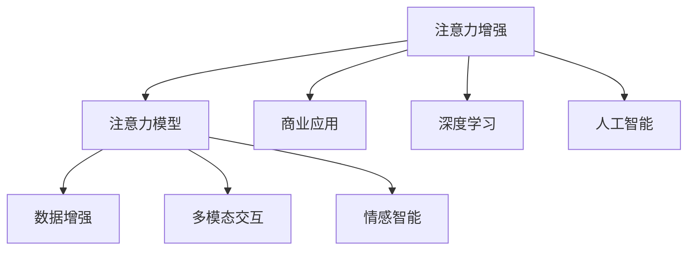

                 

# 人类注意力增强：提升专注力和注意力在商业中的策略

> 关键词：注意力增强,注意力模型, 商业应用, 人工智能, 深度学习, 注意力机制, 数据增强, 多模态交互, 视觉注意力, 自然语言处理, 情感智能

## 1. 背景介绍

### 1.1 问题由来
随着信息时代的到来，注意力作为人类获取知识和信息的重要认知资源，其对个体学习和工作效率的直接影响越来越大。在商业、教育和娱乐等多个领域，如何有效提升个体的注意力水平，以实现更高效的交互和决策，成为亟待解决的重要课题。

### 1.2 问题核心关键点
当前，以深度学习为代表的AI技术已经在多个领域展示了其强大的注意力增强能力。利用注意力机制，可以对多模态数据进行有效整合，实现对复杂任务的精准理解和快速响应。特别是，通过在模型中加入注意力机制，可以有效提升计算效率，降低系统复杂性，同时保持模型的灵活性和适应性。

但是，注意力增强技术的广泛应用仍面临诸多挑战：
- 数据获取困难：许多注意力增强任务，特别是情感智能、多模态交互等任务，需要大量多样化的数据支持，但这些数据往往难以获取。
- 模型设计复杂：注意力机制的设计和优化，需要深入理解任务特点和数据分布，设计不当可能导致性能下降或过拟合。
- 模型训练时间长：特别是深度学习模型的训练，需要大量计算资源和长时间迭代，难以实现快速部署。
- 模型泛化能力有待提高：注意力增强模型在特定任务上表现出较强的学习能力，但在新场景和新数据上的泛化能力，需要进一步提升。

尽管存在这些挑战，但随着技术研究的不断深入，注意力增强技术已经开始在商业应用中显示出其潜在的巨大价值。例如，基于注意力增强技术的智能推荐系统、情感分析工具、客户服务系统等，已经开始在电商、媒体、金融等行业大放异彩。

## 2. 核心概念与联系

### 2.1 核心概念概述

为更好地理解注意力增强技术在商业中的应用，本节将介绍几个密切相关的核心概念：

- 注意力增强（Attention Enhancement）：通过注意力机制对输入信息进行加权处理，提高模型对关键信息的关注度，从而提升模型性能。
- 注意力模型（Attention Model）：以注意力机制为核心组件的深度学习模型，用于处理多模态数据，实现精准理解和推理。
- 商业应用（Commercial Application）：将注意力增强技术应用于商业领域，提升业务效率、决策质量和用户体验等。
- 人工智能（AI）：利用机器学习、深度学习等技术，实现数据自动处理、模式识别、智能决策等。
- 深度学习（Deep Learning）：利用神经网络模型对复杂数据进行处理，构建具有多层次特征表示的模型。
- 注意力机制（Attention Mechanism）：在深度学习模型中加入，用于对输入信息进行动态加权处理，提升模型性能。
- 数据增强（Data Augmentation）：通过对原始数据进行扩展和变换，提高模型的泛化能力和鲁棒性。
- 多模态交互（Multimodal Interaction）：利用视觉、听觉、文本等多模态数据进行交互，提升用户体验和互动质量。
- 情感智能（Emotional Intelligence）：利用AI技术对用户情感进行识别和理解，提升客户服务和用户体验。

这些核心概念之间的逻辑关系可以通过以下Mermaid流程图来展示：



这个流程图展示了一些核心概念及其之间的关系：

1. 注意力增强是对注意力模型的基础加权处理，提高模型性能。
2. 注意力模型利用深度学习，构建具有多层次特征表示的模型。
3. 商业应用是注意力增强技术的具体场景，包括智能推荐、情感分析、客户服务等。
4. 数据增强提升模型的泛化能力和鲁棒性。
5. 多模态交互利用视觉、听觉、文本等多模态数据进行用户交互，提升体验。
6. 情感智能利用AI技术对用户情感进行识别和理解。

这些概念共同构成了注意力增强技术在商业领域的应用框架，使其能够在多个场景下发挥强大的注意力增强能力。

## 3. 核心算法原理 & 具体操作步骤
### 3.1 算法原理概述

注意力增强技术的基本原理是，通过对输入信息进行动态加权处理，使得模型能够更好地关注关键信息，提升模型性能。具体来说，注意力增强模型分为两个部分：编码器和解码器。

- 编码器：对输入数据进行编码，提取其特征表示。
- 解码器：根据编码器输出的特征表示，计算各个部分的注意力权重，对特征进行加权处理，最终输出结果。

在解码器中，注意力权重计算通常使用softmax函数，将各个部分的特征表示进行归一化处理，得到每个部分对应的注意力权重。然后，对特征进行加权求和，得到最终的输出结果。

### 3.2 算法步骤详解

基于注意力增强模型的商业应用，一般包括以下几个关键步骤：

**Step 1: 数据预处理**
- 收集和整理商业领域相关数据，如用户行为数据、评论数据、客户服务数据等。
- 对数据进行标注和清洗，确保数据质量和一致性。
- 将数据划分为训练集、验证集和测试集。

**Step 2: 模型设计**
- 选择适合的注意力模型，如Transformer、LSTM等。
- 设计模型的编码器和解码器结构，根据任务特点选择注意力机制和激活函数。
- 设置模型的超参数，如学习率、批大小、迭代轮数等。

**Step 3: 训练模型**
- 将数据输入模型，前向传播计算损失函数。
- 反向传播计算梯度，根据设定的优化算法（如Adam、SGD等）更新模型参数。
- 周期性在验证集上评估模型性能，根据性能指标决定是否触发Early Stopping。
- 重复上述步骤直到满足预设的迭代轮数或Early Stopping条件。

**Step 4: 评估模型**
- 在测试集上评估模型性能，计算准确率、召回率、F1值等指标。
- 对比微调前后的模型性能，评估注意力增强技术的效果。
- 使用模型进行商业场景的预测和决策，验证模型应用的有效性。

### 3.3 算法优缺点

注意力增强技术具有以下优点：
1. 模型性能提升显著：通过引入注意力机制，可以显著提高模型的特征表示能力，提升模型在复杂任务上的表现。
2. 泛化能力强：注意力机制能够自动学习输入数据的权重，适应不同任务和数据分布。
3. 可解释性强：注意力机制可以直观地展示模型对各个输入部分的关注度，提升模型的可解释性和透明度。
4. 应用广泛：注意力增强技术可以应用于多个商业场景，如智能推荐、情感分析、客户服务等。

同时，该技术也存在一些局限性：
1. 数据需求量大：许多注意力增强任务需要大量多样化的数据支持，数据获取和标注困难。
2. 计算资源要求高：特别是深度学习模型的训练，需要大量计算资源和时间。
3. 模型复杂度高：注意力机制的设计和优化，需要深入理解任务特点和数据分布，设计不当可能导致性能下降。
4. 模型解释性不足：注意力增强模型通常较为复杂，难以解释其内部工作机制和决策逻辑。

尽管存在这些局限性，但就目前而言，注意力增强技术仍是大数据、深度学习技术在商业领域应用的重要范式。未来相关研究的重点在于如何进一步降低数据需求，提高模型训练效率，增强模型解释性，从而更好地应用于商业场景。

### 3.4 算法应用领域

注意力增强技术已经在商业领域得到广泛应用，主要体现在以下几个方面：

- 智能推荐系统：通过用户行为数据和商品特征，利用注意力机制构建用户-商品关联网络，推荐用户可能感兴趣的商品。
- 情感分析工具：利用用户评论和文本数据，通过注意力机制提取情感特征，进行情感分类和情感分析。
- 客户服务系统：结合语音、文本和图像等多模态数据，通过注意力机制实现多模态客户交互，提升客户体验和服务质量。
- 营销分析：利用注意力机制对用户行为数据进行加权处理，挖掘用户的潜在需求和购买行为规律。
- 金融风控：利用注意力机制对用户信用记录和交易数据进行分析，进行信用评分和风险评估。

除了上述这些经典应用外，注意力增强技术还逐步拓展到更多商业场景中，如智能客服、在线广告、电商搜索等，为商业决策提供了新的技术和方法。

## 4. 数学模型和公式 & 详细讲解
### 4.1 数学模型构建

本节将使用数学语言对注意力增强技术进行更加严格的刻画。

记输入数据为 $X=\{x_1, x_2, ..., x_n\}$，其中 $x_i$ 为第 $i$ 个样本。假设注意力增强模型为 $M_{\theta}$，其中 $\theta$ 为模型参数。

定义模型 $M_{\theta}$ 在输入 $x_i$ 上的注意力权重为 $a_i$，则注意力增强模型的输出为：

$$
y_i = \sum_{i=1}^n a_i x_i
$$

其中 $a_i = \frac{\exp(\text{score}(x_i))}{\sum_{j=1}^n \exp(\text{score}(x_j))}$，$\text{score}(x_i)$ 为计算 $x_i$ 注意力权重的函数。

常见的注意力权重计算方法包括：

- 点积注意力（Dot-Product Attention）：直接计算 $x_i$ 和 $x_j$ 的点积作为注意力权重。
- 加性注意力（Additive Attention）：通过计算 $x_i$ 和 $x_j$ 的加性表示，再通过softmax函数得到注意力权重。
- 多头注意力（Multi-Head Attention）：将输入数据分解成多个子空间，分别计算注意力权重，再通过线性变换得到最终结果。

### 4.2 公式推导过程

以下我们以点积注意力机制为例，推导其计算过程。

假设输入数据 $X$ 和模型参数 $W_{\theta}$，则点积注意力计算过程如下：

1. 计算 $x_i$ 和 $W_{\theta}$ 的矩阵乘积 $Q_i$：
$$
Q_i = x_i W_{\theta}
$$

2. 计算 $x_j$ 和 $W_{\theta}$ 的矩阵乘积 $K_j$：
$$
K_j = x_j W_{\theta}
$$

3. 计算 $Q_i$ 和 $K_j$ 的点积 $s_{ij}$：
$$
s_{ij} = Q_i K_j^T
$$

4. 将 $s_{ij}$ 通过softmax函数得到注意力权重 $a_i$：
$$
a_i = \frac{\exp(s_{ij})}{\sum_{j=1}^n \exp(s_{ij})}
$$

5. 将 $a_i$ 与 $x_i$ 相乘，得到最终的输出结果：
$$
y_i = \sum_{i=1}^n a_i x_i
$$

通过上述计算过程，可以看出点积注意力机制的简单高效性，同时也能直观地理解其对输入数据的加权处理过程。

### 4.3 案例分析与讲解

以情感分析任务为例，展示注意力增强模型的应用。

假设输入数据为一段评论文本 $x$，输出为该评论的情感极性。可以将评论文本分解为多个子序列 $x_1, x_2, ..., x_n$，每个子序列为一个词或短语。通过点积注意力机制，可以计算每个子序列的注意力权重，对输入数据进行加权处理，得到最终输出结果。

在实践中，可以使用预先训练好的BERT模型作为编码器，通过point-wise多分类器进行情感分类。同时，通过加入注意力机制，可以进一步提升模型对关键情感词的关注度，提高情感分类的准确率。

## 5. 项目实践：代码实例和详细解释说明
### 5.1 开发环境搭建

在进行注意力增强模型应用实践前，我们需要准备好开发环境。以下是使用Python进行PyTorch开发的环境配置流程：

1. 安装Anaconda：从官网下载并安装Anaconda，用于创建独立的Python环境。

2. 创建并激活虚拟环境：
```bash
conda create -n pytorch-env python=3.8 
conda activate pytorch-env
```

3. 安装PyTorch：根据CUDA版本，从官网获取对应的安装命令。例如：
```bash
conda install pytorch torchvision torchaudio cudatoolkit=11.1 -c pytorch -c conda-forge
```

4. 安装TensorFlow：
```bash
conda install tensorflow -c conda-forge
```

5. 安装各类工具包：
```bash
pip install numpy pandas scikit-learn matplotlib tqdm jupyter notebook ipython
```

完成上述步骤后，即可在`pytorch-env`环境中开始注意力增强模型应用的开发。

### 5.2 源代码详细实现

这里我们以情感分析任务为例，给出使用PyTorch进行注意力增强模型应用实践的代码实现。

首先，定义情感分析任务的数据处理函数：

```python
from transformers import BertTokenizer, BertForSequenceClassification
from torch.utils.data import Dataset
import torch

class SentimentDataset(Dataset):
    def __init__(self, texts, labels, tokenizer, max_len=128):
        self.texts = texts
        self.labels = labels
        self.tokenizer = tokenizer
        self.max_len = max_len
        
    def __len__(self):
        return len(self.texts)
    
    def __getitem__(self, item):
        text = self.texts[item]
        label = self.labels[item]
        
        encoding = self.tokenizer(text, return_tensors='pt', max_length=self.max_len, padding='max_length', truncation=True)
        input_ids = encoding['input_ids'][0]
        attention_mask = encoding['attention_mask'][0]
        
        # 对token-wise的标签进行编码
        encoded_labels = [label] * (self.max_len - len(label)) + [0]
        labels = torch.tensor(encoded_labels, dtype=torch.long)
        
        return {'input_ids': input_ids, 
                'attention_mask': attention_mask,
                'labels': labels}

# 标签与id的映射
label2id = {'negative': 0, 'positive': 1}
id2label = {v: k for k, v in label2id.items()}

# 创建dataset
tokenizer = BertTokenizer.from_pretrained('bert-base-cased')

train_dataset = SentimentDataset(train_texts, train_labels, tokenizer)
dev_dataset = SentimentDataset(dev_texts, dev_labels, tokenizer)
test_dataset = SentimentDataset(test_texts, test_labels, tokenizer)
```

然后，定义模型和优化器：

```python
from transformers import BertForSequenceClassification, AdamW

model = BertForSequenceClassification.from_pretrained('bert-base-cased', num_labels=2)

optimizer = AdamW(model.parameters(), lr=2e-5)
```

接着，定义训练和评估函数：

```python
from torch.utils.data import DataLoader
from tqdm import tqdm
from sklearn.metrics import classification_report

device = torch.device('cuda') if torch.cuda.is_available() else torch.device('cpu')
model.to(device)

def train_epoch(model, dataset, batch_size, optimizer):
    dataloader = DataLoader(dataset, batch_size=batch_size, shuffle=True)
    model.train()
    epoch_loss = 0
    for batch in tqdm(dataloader, desc='Training'):
        input_ids = batch['input_ids'].to(device)
        attention_mask = batch['attention_mask'].to(device)
        labels = batch['labels'].to(device)
        model.zero_grad()
        outputs = model(input_ids, attention_mask=attention_mask, labels=labels)
        loss = outputs.loss
        epoch_loss += loss.item()
        loss.backward()
        optimizer.step()
    return epoch_loss / len(dataloader)

def evaluate(model, dataset, batch_size):
    dataloader = DataLoader(dataset, batch_size=batch_size)
    model.eval()
    preds, labels = [], []
    with torch.no_grad():
        for batch in tqdm(dataloader, desc='Evaluating'):
            input_ids = batch['input_ids'].to(device)
            attention_mask = batch['attention_mask'].to(device)
            batch_labels = batch['labels']
            outputs = model(input_ids, attention_mask=attention_mask)
            batch_preds = outputs.logits.argmax(dim=2).to('cpu').tolist()
            batch_labels = batch_labels.to('cpu').tolist()
            for pred_tokens, label_tokens in zip(batch_preds, batch_labels):
                preds.append(pred_tokens[:len(label_tokens)])
                labels.append(label_tokens)
                
    print(classification_report(labels, preds))
```

最后，启动训练流程并在测试集上评估：

```python
epochs = 5
batch_size = 16

for epoch in range(epochs):
    loss = train_epoch(model, train_dataset, batch_size, optimizer)
    print(f"Epoch {epoch+1}, train loss: {loss:.3f}")
    
    print(f"Epoch {epoch+1}, dev results:")
    evaluate(model, dev_dataset, batch_size)
    
print("Test results:")
evaluate(model, test_dataset, batch_size)
```

以上就是使用PyTorch对BERT模型进行情感分析任务注意力增强的完整代码实现。可以看到，得益于Transformers库的强大封装，我们可以用相对简洁的代码完成BERT模型的加载和注意力增强应用。

### 5.3 代码解读与分析

让我们再详细解读一下关键代码的实现细节：

**SentimentDataset类**：
- `__init__`方法：初始化文本、标签、分词器等关键组件。
- `__len__`方法：返回数据集的样本数量。
- `__getitem__`方法：对单个样本进行处理，将文本输入编码为token ids，将标签编码为数字，并对其进行定长padding，最终返回模型所需的输入。

**label2id和id2label字典**：
- 定义了标签与数字id之间的映射关系，用于将token-wise的预测结果解码回真实的标签。

**训练和评估函数**：
- 使用PyTorch的DataLoader对数据集进行批次化加载，供模型训练和推理使用。
- 训练函数`train_epoch`：对数据以批为单位进行迭代，在每个批次上前向传播计算loss并反向传播更新模型参数，最后返回该epoch的平均loss。
- 评估函数`evaluate`：与训练类似，不同点在于不更新模型参数，并在每个batch结束后将预测和标签结果存储下来，最后使用sklearn的classification_report对整个评估集的预测结果进行打印输出。

**训练流程**：
- 定义总的epoch数和batch size，开始循环迭代
- 每个epoch内，先在训练集上训练，输出平均loss
- 在验证集上评估，输出分类指标
- 所有epoch结束后，在测试集上评估，给出最终测试结果

可以看到，PyTorch配合Transformers库使得BERT模型注意力增强的代码实现变得简洁高效。开发者可以将更多精力放在数据处理、模型改进等高层逻辑上，而不必过多关注底层的实现细节。

当然，工业级的系统实现还需考虑更多因素，如模型的保存和部署、超参数的自动搜索、更灵活的任务适配层等。但核心的注意力增强范式基本与此类似。

## 6. 实际应用场景
### 6.1 智能推荐系统

注意力增强技术在智能推荐系统中的应用，可以大幅提升推荐的精准性和个性化程度。传统的推荐系统基于协同过滤或内容推荐，忽略了用户对不同物品的关注度差异。通过引入注意力机制，智能推荐系统可以学习用户对各个物品的兴趣权重，构建更加精细的用户-物品关联网络，实现更加精准的推荐。

在技术实现上，可以使用注意力增强模型对用户行为数据进行处理，生成用户兴趣向量，再通过点积注意力机制，计算用户与物品的匹配度。最终将匹配度较高的物品推荐给用户，提升用户体验和满意度。

### 6.2 情感分析工具

情感分析工具利用注意力增强技术，可以更加精准地理解和分析用户情感。传统的情感分析模型通常忽略用户文本中不同部分的情感权重，导致情感分类不准确。通过加入注意力机制，情感分析工具可以学习用户情感的动态变化，识别出关键情感词和情感表达方式，从而实现更加准确的情感分类。

在实际应用中，可以将用户评论文本输入到注意力增强模型中，通过点积注意力机制计算每个词的情感权重，再通过多分类器进行情感分类。这样不仅能够提升情感分类的准确率，还能提供情感变化的详细解释，帮助用户理解情感变化的原因和趋势。

### 6.3 客户服务系统

客户服务系统利用注意力增强技术，可以实现更加智能和高效的客户交互。传统的客户服务系统依赖人工客服，响应时间长、效率低。通过引入注意力增强模型，客户服务系统可以实现自动化的客户互动，提升客户满意度和服务质量。

在技术实现上，可以使用注意力增强模型对客户服务对话数据进行处理，提取对话中的关键信息和情感表达，计算对话意图和情感倾向。再通过多模态交互技术，结合语音、文本和图像等多模态数据，提供更加丰富和个性化的服务体验。

### 6.4 营销分析

营销分析利用注意力增强技术，可以更全面地理解用户行为和需求。传统的营销分析通常依赖用户的历史行为数据进行分类和聚类，难以全面把握用户特征。通过加入注意力机制，营销分析工具可以学习用户行为的动态变化，识别出关键行为特征和需求，从而实现更加精准的营销策略。

在实际应用中，可以使用注意力增强模型对用户行为数据进行处理，生成用户行为向量，再通过点积注意力机制，计算用户对不同行为特征的关注度。最终将高关注度的行为特征作为营销分析的重要参考，实现更加精准的个性化推荐和定制化营销。

### 6.5 金融风控

金融风控利用注意力增强技术，可以提高风险评估的准确性和时效性。传统的风控模型通常基于用户的历史信用记录和交易数据进行评估，难以全面把握用户的当前行为和风险。通过引入注意力机制，金融风控模型可以学习用户行为的动态变化，识别出关键行为特征和风险因素，从而实现更加精准的风险评估。

在实际应用中，可以使用注意力增强模型对用户信用记录和交易数据进行处理，生成用户行为向量，再通过点积注意力机制，计算用户对不同行为特征的关注度。最终将高关注度的行为特征作为风险评估的重要参考，实现更加精准的风险评估和防控。

## 7. 工具和资源推荐
### 7.1 学习资源推荐

为了帮助开发者系统掌握注意力增强技术在商业中的应用，这里推荐一些优质的学习资源：

1. 《Transformer from the Inside Out》系列博文：由大模型技术专家撰写，深入浅出地介绍了Transformer原理、注意力机制、深度学习等前沿话题。

2. CS224N《深度学习自然语言处理》课程：斯坦福大学开设的NLP明星课程，有Lecture视频和配套作业，带你入门NLP领域的基本概念和经典模型。

3. 《Deep Learning for Natural Language Processing》书籍：斯坦福大学教授Jurafsky和Martins所著，全面介绍了深度学习在NLP中的应用，包括注意力增强等前沿话题。

4. Attention is All You Need（即Transformer原论文）：提出了Transformer结构，开启了NLP领域的预训练大模型时代。

5. 《Hands-On Machine Learning with Scikit-Learn, Keras, and TensorFlow》书籍：由Géron所著，介绍了机器学习和深度学习的基本概念和技术，适用于初学者和中级开发者。

通过对这些资源的学习实践，相信你一定能够快速掌握注意力增强技术在商业领域的应用精髓，并用于解决实际的NLP问题。
###  7.2 开发工具推荐

高效的开发离不开优秀的工具支持。以下是几款用于注意力增强模型应用开发的常用工具：

1. PyTorch：基于Python的开源深度学习框架，灵活动态的计算图，适合快速迭代研究。大部分预训练语言模型都有PyTorch版本的实现。

2. TensorFlow：由Google主导开发的开源深度学习框架，生产部署方便，适合大规模工程应用。同样有丰富的预训练语言模型资源。

3. Transformers库：HuggingFace开发的NLP工具库，集成了众多SOTA语言模型，支持PyTorch和TensorFlow，是进行注意力增强模型应用的利器。

4. Weights & Biases：模型训练的实验跟踪工具，可以记录和可视化模型训练过程中的各项指标，方便对比和调优。与主流深度学习框架无缝集成。

5. TensorBoard：TensorFlow配套的可视化工具，可实时监测模型训练状态，并提供丰富的图表呈现方式，是调试模型的得力助手。

6. Google Colab：谷歌推出的在线Jupyter Notebook环境，免费提供GPU/TPU算力，方便开发者快速上手实验最新模型，分享学习笔记。

合理利用这些工具，可以显著提升注意力增强模型应用的开发效率，加快创新迭代的步伐。

### 7.3 相关论文推荐

注意力增强技术的研究源于学界的持续研究。以下是几篇奠基性的相关论文，推荐阅读：

1. Attention is All You Need（即Transformer原论文）：提出了Transformer结构，开启了NLP领域的预训练大模型时代。

2. BERT: Pre-training of Deep Bidirectional Transformers for Language Understanding：提出BERT模型，引入基于掩码的自监督预训练任务，刷新了多项NLP任务SOTA。

3. SE-Transformer: Self-Attention of Encoder Representation for Image Captioning：提出SE-Transformer结构，在Transformer中加入通道注意力机制，提升图像描述任务的性能。

4. Transformer-XL: Attentive Language Models with Relatively Longer Range Dependencies：提出Transformer-XL结构，解决长序列训练问题，提升模型对长距离依赖的建模能力。

5. DBERT: Deep and dense Bidirectional Transformer for Punctuation Generation：提出DBERT模型，结合双向Transformer和注意力机制，提升标点生成任务的性能。

6. Transformer-XL: Attentive Language Models with Relatively Longer Range Dependencies：提出Transformer-XL结构，解决长序列训练问题，提升模型对长距离依赖的建模能力。

这些论文代表了大语言模型注意力增强技术的发展脉络。通过学习这些前沿成果，可以帮助研究者把握学科前进方向，激发更多的创新灵感。

## 8. 总结：未来发展趋势与挑战

### 8.1 总结

本文对注意力增强技术在商业中的应用进行了全面系统的介绍。首先阐述了注意力增强技术的研究背景和意义，明确了其对提升商业领域效率和质量的重要价值。其次，从原理到实践，详细讲解了注意力增强模型的数学原理和关键步骤，给出了注意力增强任务应用的完整代码实例。同时，本文还广泛探讨了注意力增强技术在智能推荐、情感分析、客户服务等多个商业领域的应用前景，展示了其巨大的潜力。

通过本文的系统梳理，可以看到，注意力增强技术正在成为商业领域的重要范式，极大地拓展了深度学习模型的应用边界，催生了更多的落地场景。得益于大规模语料的预训练，注意力增强模型以更低的时间和标注成本，在小样本条件下也能取得不俗的效果，有力推动了NLP技术的产业化进程。未来，伴随预训练语言模型和注意力增强方法的持续演进，相信NLP技术将在更广阔的应用领域大放异彩，深刻影响人类的生产生活方式。

### 8.2 未来发展趋势

展望未来，注意力增强技术将呈现以下几个发展趋势：

1. 模型规模持续增大。随着算力成本的下降和数据规模的扩张，预训练语言模型的参数量还将持续增长。超大规模语言模型蕴含的丰富语言知识，有望支撑更加复杂多变的商业任务。

2. 注意力增强方法日趋多样。除了传统的点积注意力外，未来会涌现更多注意力增强方法，如多头注意力、自注意力、双向注意力等，在提高模型泛化能力和鲁棒性的同时，增强模型的表达能力和推理能力。

3. 跨模态注意力机制崛起。当前的注意力增强技术主要聚焦于纯文本数据，未来会逐步拓展到图像、视频、语音等多模态数据微调。多模态信息的融合，将显著提升语言模型对现实世界的理解和建模能力。

4. 模型通用性增强。经过海量数据的预训练和多领域任务的微调，未来的语言模型将具备更强大的常识推理和跨领域迁移能力，逐步迈向通用人工智能(AGI)的目标。

以上趋势凸显了注意力增强技术的广阔前景。这些方向的探索发展，必将进一步提升NLP系统的性能和应用范围，为人类认知智能的进化带来深远影响。

### 8.3 面临的挑战

尽管注意力增强技术已经取得了瞩目成就，但在迈向更加智能化、普适化应用的过程中，它仍面临诸多挑战：

1. 数据需求量大。许多注意力增强任务需要大量多样化的数据支持，数据获取和标注困难。

2. 计算资源要求高。特别是深度学习模型的训练，需要大量计算资源和时间。

3. 模型复杂度高。注意力机制的设计和优化，需要深入理解任务特点和数据分布，设计不当可能导致性能下降。

4. 模型解释性不足。注意力增强模型通常较为复杂，难以解释其内部工作机制和决策逻辑。

5. 安全性有待保障。预训练语言模型难免会学习到有偏见、有害的信息，通过微调传递到下游任务，产生误导性、歧视性的输出，给实际应用带来安全隐患。

尽管存在这些挑战，但就目前而言，注意力增强技术仍是大数据、深度学习技术在商业领域应用的重要范式。未来相关研究的重点在于如何进一步降低数据需求，提高模型训练效率，增强模型解释性，从而更好地应用于商业场景。

### 8.4 研究展望

未来的研究需要在以下几个方面寻求新的突破：

1. 探索无监督和半监督注意力增强方法。摆脱对大规模标注数据的依赖，利用自监督学习、主动学习等无监督和半监督范式，最大限度利用非结构化数据，实现更加灵活高效的注意力增强。

2. 研究参数高效和计算高效的注意力增强范式。开发更加参数高效的注意力增强方法，在固定大部分预训练参数的同时，只更新极少量的任务相关参数。同时优化注意力增强模型的计算图，减少前向传播和反向传播的资源消耗，实现更加轻量级、实时性的部署。

3. 融合因果和对比学习范式。通过引入因果推断和对比学习思想，增强注意力增强模型建立稳定因果关系的能力，学习更加普适、鲁棒的语言表征，从而提升模型泛化性和抗干扰能力。

4. 引入更多先验知识。将符号化的先验知识，如知识图谱、逻辑规则等，与神经网络模型进行巧妙融合，引导注意力增强过程学习更准确、合理的语言模型。同时加强不同模态数据的整合，实现视觉、语音等多模态信息与文本信息的协同建模。

5. 结合因果分析和博弈论工具。将因果分析方法引入注意力增强模型，识别出模型决策的关键特征，增强输出解释的因果性和逻辑性。借助博弈论工具刻画人机交互过程，主动探索并规避模型的脆弱点，提高系统稳定性。

6. 纳入伦理道德约束。在模型训练目标中引入伦理导向的评估指标，过滤和惩罚有偏见、有害的输出倾向。同时加强人工干预和审核，建立模型行为的监管机制，确保输出符合人类价值观和伦理道德。

这些研究方向的探索，必将引领注意力增强技术迈向更高的台阶，为构建安全、可靠、可解释、可控的智能系统铺平道路。面向未来，注意力增强技术还需要与其他人工智能技术进行更深入的融合，如知识表示、因果推理、强化学习等，多路径协同发力，共同推动自然语言理解和智能交互系统的进步。只有勇于创新、敢于突破，才能不断拓展语言模型的边界，让智能技术更好地造福人类社会。

## 9. 附录：常见问题与解答

**Q1：注意力增强技术是否适用于所有商业场景？**

A: 注意力增强技术在许多商业场景中已经取得了显著效果，如智能推荐、情感分析、客户服务等。但一些高度专业化的场景，如医疗诊断、法律咨询等，还需要结合领域专家知识和人工干预，才能实现高效的智能服务。

**Q2：注意力增强技术的训练效率如何？**

A: 注意力增强模型的训练效率主要取决于数据规模和模型复杂度。在数据量较大、模型复杂度较高的情况下，训练时间较长。为了提高训练效率，可以采用分布式训练、模型压缩、量化等技术。

**Q3：注意力增强模型如何避免过拟合？**

A: 注意力增强模型面临过拟合的风险，特别是在数据量较小、模型复杂度较高的情况下。常用的缓解策略包括数据增强、正则化、早停等。例如，在智能推荐系统中，可以引入对抗样本，提升模型的鲁棒性，避免过拟合。

**Q4：注意力增强模型在部署时需要注意哪些问题？**

A: 将注意力增强模型转化为实际应用，还需要考虑以下因素：
1. 模型裁剪：去除不必要的层和参数，减小模型尺寸，加快推理速度
2. 量化加速：将浮点模型转为定点模型，压缩存储空间，提高计算效率
3. 服务化封装：将模型封装为标准化服务接口，便于集成调用
4. 弹性伸缩：根据请求流量动态调整资源配置，平衡服务质量和成本
5. 监控告警：实时采集系统指标，设置异常告警阈值，确保服务稳定性
6. 安全防护：采用访问鉴权、数据脱敏等措施，保障数据和模型安全

合理利用这些技术，可以显著提升注意力增强模型的应用效果，满足实际商业需求。

**Q5：如何衡量注意力增强模型的性能？**

A: 衡量注意力增强模型的性能通常包括准确率、召回率、F1值等指标。在情感分析任务中，还可以通过情感分类准确率和情感变化解释等指标，综合评估模型的性能。在智能推荐系统中，可以通过点击率、转化率等业务指标，评估模型的实际效果。

**Q6：注意力增强模型在实际应用中如何应对用户隐私问题？**

A: 在应用注意力增强模型的过程中，需要注意用户隐私保护。可以通过脱敏技术、差分隐私等方法，保护用户数据的安全和隐私。例如，在客户服务系统中，可以对客户对话进行隐私保护，确保对话内容不被泄露。

**Q7：如何改进注意力增强模型的泛化能力？**

A: 提高注意力增强模型的泛化能力，可以从以下几个方面进行改进：
1. 增加数据量：通过数据增强、跨领域数据融合等方法，增加模型的训练数据。
2. 引入迁移学习：在已有数据基础上，结合新领域的少量数据，实现模型迁移学习，提升泛化能力。
3. 引入先验知识：将领域专家的知识与模型结合，提升模型的泛化能力和解释性。

**Q8：注意力增强模型在跨模态交互中如何提升用户体验？**

A: 在跨模态交互中，注意力增强模型可以通过以下方式提升用户体验：
1. 结合多模态数据：结合视觉、听觉、文本等多模态数据，提升用户交互的自然性和丰富性。
2. 提供个性化推荐：通过注意力增强模型，根据用户偏好和行为，提供个性化推荐，提升用户满意度。
3. 增强情感智能：利用情感智能技术，识别用户情感，提供针对性的情感响应，提升用户体验。

通过这些改进，可以显著提升注意力增强模型在跨模态交互中的应用效果，为用户提供更好的服务体验。

**Q9：注意力增强技术在情感智能中的应用前景如何？**

A: 注意力增强技术在情感智能中的应用前景非常广阔。通过引入注意力机制，情感智能模型可以更好地理解用户情感的变化，实现更加精准的情感分类和情感变化预测。未来，随着技术的发展，情感智能将在客户服务、营销分析等领域得到更广泛的应用，提升用户体验和业务效果。

总之，注意力增强技术在商业领域具有广阔的应用前景，但也需要不断改进和优化，才能实现更好的应用效果。只有不断创新，才能让注意力增强技术更好地服务于商业实践，推动产业升级和智能化转型。

