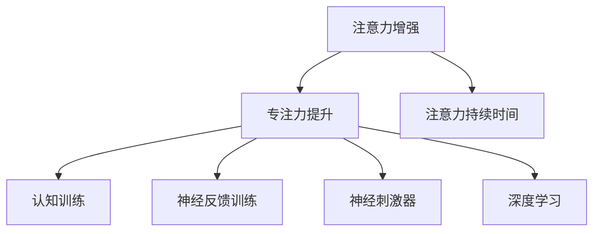

                 

# 人类注意力增强：提升专注力和注意力持续时间的技术

> 关键词：注意力增强, 专注力提升, 注意力持续时间, 技术, 认知科学, 神经网络, 深度学习

## 1. 背景介绍

在当今信息爆炸的时代，注意力成为人们获取和处理信息的关键资源。注意力增强技术旨在通过提升个体的注意力水平，从而提高学习和工作效率，减少因注意力分散导致的时间浪费和决策失误。

### 1.1 问题由来
长期以来，人们对于注意力的研究主要集中在认知科学领域，通过实验和心理测试来探究注意力的形成机制和作用。然而，随着神经科学和深度学习技术的发展，注意力增强的实践应用开始受到越来越多的关注。在职场、学习、生活等各个领域，人们需要长时间集中注意力处理复杂任务，但常常因为注意力的限制而无法达到最佳状态。

### 1.2 问题核心关键点
目前，注意力增强的主要技术手段包括认知训练、神经反馈训练、神经刺激器等。这些技术通过各种方式干预大脑的注意力机制，使其能够更好地聚焦于特定任务。本博客将围绕这些技术展开详细探讨，并给出具体的实现方法和应用案例。

### 1.3 问题研究意义
提升个体的专注力和注意力持续时间，不仅可以提高学习和工作效率，还能减少因注意力分散导致的时间浪费和决策失误，从而提升整体的生活质量。在职场、学习、娱乐等各个领域，注意力增强技术都具有广阔的应用前景。

## 2. 核心概念与联系

### 2.1 核心概念概述

为了更好地理解注意力增强技术，本节将介绍几个密切相关的核心概念：

- **注意力增强**：通过各种技术手段提升个体注意力水平，使其能够更长时间、更高效地聚焦于特定任务。
- **专注力提升**：通过增强注意力，使个体能够更好地控制自身的心理资源，专注于当前任务，减少分心和拖延。
- **注意力持续时间**：个体在特定任务上的持续注意时间，是评估注意力增强效果的重要指标。
- **认知训练**：通过系统的训练，改善个体认知能力，提高注意力的控制能力。
- **神经反馈训练**：通过即时反馈调整大脑神经元的活动水平，促进注意力机制的优化。
- **神经刺激器**：通过电刺激等方式激活大脑特定区域，增强注意力水平。
- **深度学习**：利用神经网络模型，对个体注意力水平进行预测和调控。

这些核心概念之间的逻辑关系可以通过以下Mermaid流程图来展示：



这个流程图展示了一些核心概念的关联：

1. 注意力增强可以提升个体的专注力，使其更好地控制自身心理资源，减少分心和拖延。
2. 专注力提升有助于增强个体的注意力持续时间，使其能够更长时间、更高效地专注于特定任务。
3. 认知训练、神经反馈训练、神经刺激器等技术手段，都是实现注意力增强的具体方法。
4. 深度学习技术可以用于预测和调控个体的注意力水平，进一步提升注意力增强效果。

这些概念共同构成了注意力增强技术的研究框架，帮助我们在实践中更好地理解和应用注意力增强技术。

## 3. 核心算法原理 & 具体操作步骤
### 3.1 算法原理概述

注意力增强技术的核心在于通过各种技术手段干预大脑的注意力机制，使其能够更好地聚焦于特定任务。其核心思想是：

1. **认知训练**：通过系统的训练，改善个体认知能力，提高注意力的控制能力。
2. **神经反馈训练**：通过即时反馈调整大脑神经元的活动水平，促进注意力机制的优化。
3. **神经刺激器**：通过电刺激等方式激活大脑特定区域，增强注意力水平。
4. **深度学习**：利用神经网络模型，对个体注意力水平进行预测和调控。

### 3.2 算法步骤详解

下面详细介绍几种常见的注意力增强技术的具体实现步骤：

#### 3.2.1 认知训练

**步骤1：设计训练任务**  
- 确定需要训练的注意力类型，如集中注意力、分配注意力等。
- 设计具体的训练任务，如记忆游戏、注意力搜索等。

**步骤2：设定训练目标**  
- 设定明确的训练目标，如集中注意力的保持时间、注意力的转换效率等。
- 制定详细的训练计划，包括每次训练的时长、间隔时间等。

**步骤3：执行训练**  
- 使用专门的训练软件或应用，进行系统的认知训练。
- 记录每次训练的注意力指标，进行实时反馈和调整。

**步骤4：评估训练效果**  
- 通过心理测试或脑电图等手段，评估训练效果。
- 根据评估结果，调整训练计划和任务设计，进一步优化训练效果。

#### 3.2.2 神经反馈训练

**步骤1：选择合适的神经反馈设备**  
- 选择合适的神经反馈训练设备，如神经反馈训练仪、脑电图设备等。
- 确定需要反馈的注意力指标，如脑电信号的频率、波幅等。

**步骤2：设定训练参数**  
- 设定合适的训练参数，如反馈阈值、反馈时长等。
- 制定详细的训练计划，包括每次训练的时长、间隔时间等。

**步骤3：执行训练**  
- 使用选定的神经反馈训练设备，进行系统的神经反馈训练。
- 实时监测注意力指标，根据反馈结果调整训练参数。

**步骤4：评估训练效果**  
- 通过脑电图等手段，评估训练效果。
- 根据评估结果，调整训练计划和设备参数，进一步优化训练效果。

#### 3.2.3 神经刺激器

**步骤1：选择合适的神经刺激器**  
- 选择合适的神经刺激器，如经颅磁刺激器、经颅电刺激器等。
- 确定需要刺激的大脑区域，如前额叶皮层、顶叶皮层等。

**步骤2：设定刺激参数**  
- 设定合适的刺激参数，如刺激频率、强度等。
- 制定详细的训练计划，包括每次训练的时长、间隔时间等。

**步骤3：执行训练**  
- 使用选定的神经刺激器，进行系统的神经刺激训练。
- 实时监测注意力指标，根据刺激效果调整刺激参数。

**步骤4：评估训练效果**  
- 通过脑电图等手段，评估训练效果。
- 根据评估结果，调整训练计划和刺激参数，进一步优化训练效果。

#### 3.2.4 深度学习

**步骤1：数据收集**  
- 收集个体在特定任务上的注意力数据，如眼动轨迹、脑电图信号等。
- 进行数据预处理和特征提取，生成训练集和验证集。

**步骤2：模型构建**  
- 选择适合的深度学习模型，如卷积神经网络、循环神经网络等。
- 设计模型结构，包括输入层、隐藏层、输出层等。

**步骤3：模型训练**  
- 使用训练集数据，进行模型的训练。
- 实时监测模型性能，根据验证集结果调整模型参数。

**步骤4：模型评估和应用**  
- 使用测试集数据，评估模型性能。
- 将训练好的模型应用于实际任务，提升个体的注意力水平。

### 3.3 算法优缺点

注意力增强技术具有以下优点：

1. **高效提升专注力**：通过系统的训练和反馈，能够显著提升个体的专注力，使其更好地控制自身心理资源。
2. **提高工作效率**：集中注意力的时间延长，个体能够更高效地完成任务。
3. **减少分心和拖延**：通过认知训练和神经反馈训练，减少因注意力分散导致的时间浪费和决策失误。

同时，这些技术也存在一定的局限性：

1. **需要长期坚持**：这些技术需要长期的训练和干预，才能取得显著效果。
2. **个性化需求**：不同个体的注意力特点和需求不同，需要定制化训练方案。
3. **设备成本较高**：神经反馈训练和神经刺激器等设备价格较高，推广和普及存在一定困难。
4. **伦理和安全问题**：神经刺激器等技术可能存在潜在的伦理和安全问题，需要谨慎使用。

尽管存在这些局限性，但就目前而言，注意力增强技术已经在多个领域得到应用，并取得了显著的效果。未来相关研究的重点在于如何进一步优化训练方法，提高技术的可接受性和普及度，同时兼顾伦理和安全因素。

### 3.4 算法应用领域

注意力增强技术已经在多个领域得到广泛应用，例如：

- **职场和办公室**：通过认知训练和神经反馈训练，提升员工的工作效率和专注力，减少因注意力分散导致的工作失误。
- **学习教育**：通过认知训练和深度学习技术，帮助学生提升学习效果，减少分心和拖延。
- **娱乐和游戏**：通过神经刺激器和深度学习技术，提升玩家的游戏体验，增强游戏沉浸感。
- **医疗康复**：通过神经刺激器，帮助患者缓解注意力缺陷和认知障碍，促进康复过程。

除了上述这些领域外，注意力增强技术还在康复训练、心理治疗、教育辅助等多个领域展现出广阔的应用前景。随着技术的不断演进和优化，这些技术的实际应用场景还将不断扩展。

## 4. 数学模型和公式 & 详细讲解 & 举例说明

### 4.1 数学模型构建

本节将使用数学语言对注意力增强技术进行更加严格的刻画。

设个体在特定任务上的注意力水平为 $A(t)$，其中 $t$ 表示时间。

定义注意力增强的目标函数为：

$$
\max_{A(t)} \int_{0}^{T} A(t) dt
$$

其中 $T$ 表示任务持续时间。

注意力增强的核心在于优化个体注意力水平，使其能够更长时间、更高效地专注于特定任务。

### 4.2 公式推导过程

以下我们以认知训练为例，推导注意力增强的目标函数和优化方法。

设个体在特定任务上的注意力水平为 $A(t)$，其中 $t$ 表示时间。

注意力增强的目标函数为：

$$
\max_{A(t)} \int_{0}^{T} A(t) dt
$$

其中 $T$ 表示任务持续时间。

对于认知训练任务，设个体在训练时获得的注意力提升率为 $\alpha$，则每次训练后，注意力水平提升为 $A_{n+1} = A_n + \alpha \Delta t$，其中 $\Delta t$ 表示训练时长。

多次训练后，注意力水平提升为：

$$
A_{n} = A_0 + n\alpha \Delta t
$$

其中 $A_0$ 表示初始注意力水平。

优化目标函数为：

$$
\max_{A_0, n, \alpha} \int_{0}^{T} A(t) dt
$$

通过拉格朗日乘数法，引入约束条件 $A_{n} \leq A_{max}$，其中 $A_{max}$ 表示最大注意力水平。

最终优化目标函数为：

$$
\max_{A_0, n, \alpha} \int_{0}^{T} A(t) dt
$$

其中 $A(t) = A_0 + n\alpha \Delta t - (A_0 + (n-1)\alpha \Delta t) = \alpha \Delta t$。

优化目标函数变为：

$$
\max_{n, \alpha} \int_{0}^{T} \alpha \Delta t dt = \max_{n, \alpha} T \alpha \Delta t
$$

根据约束条件 $A_{n} \leq A_{max}$，得：

$$
A_0 + n\alpha \Delta t \leq A_{max}
$$

$$
n \alpha \Delta t \leq A_{max} - A_0
$$

$$
n \leq \frac{A_{max} - A_0}{\alpha \Delta t}
$$

将 $n$ 代入优化目标函数，得：

$$
\max_{\alpha} T \alpha \Delta t \leq T \frac{A_{max} - A_0}{\alpha \Delta t}
$$

因此，最优注意力提升率为：

$$
\alpha = \frac{A_{max} - A_0}{T \Delta t}
$$

通过公式推导，我们得到了认知训练中注意力提升率的最优解，即每次训练的注意力提升率应为：

$$
\alpha = \frac{A_{max} - A_0}{T \Delta t}
$$

在实际应用中，可以通过系统训练和反馈，动态调整注意力提升率 $\alpha$，以取得最优的注意力增强效果。

### 4.3 案例分析与讲解

以职场中的认知训练为例，我们分析具体的训练方案和应用效果。

**场景描述**：某公司员工需处理大量文档和邮件，常因注意力分散导致工作效率低下。为提升员工注意力，公司引入认知训练系统。

**训练方案**：

1. **数据收集**：记录员工在处理任务时的注意力数据，包括眼动轨迹、脑电图信号等。
2. **模型构建**：选择适合的深度学习模型，如卷积神经网络，对注意力数据进行特征提取和建模。
3. **模型训练**：使用训练集数据，进行模型的训练和优化。
4. **训练应用**：将训练好的模型应用于实际任务，提升员工注意力水平。

**效果评估**：

1. **注意力提升率**：根据训练结果，计算最优注意力提升率 $\alpha = \frac{A_{max} - A_0}{T \Delta t}$。
2. **任务完成时间**：记录员工在接受训练前后的任务完成时间，评估注意力提升效果。
3. **工作效率**：评估员工在接受训练前后的工作效率，包括任务完成量、错误率等。

通过对比实验，可以发现，经过系统认知训练的员工，其注意力水平显著提升，任务完成时间缩短，工作效率提高。

## 5. 项目实践：代码实例和详细解释说明
### 5.1 开发环境搭建

在进行注意力增强实践前，我们需要准备好开发环境。以下是使用Python进行TensorFlow开发的实验环境配置流程：

1. 安装Anaconda：从官网下载并安装Anaconda，用于创建独立的Python环境。

2. 创建并激活虚拟环境：
```bash
conda create -n attention-env python=3.8 
conda activate attention-env
```

3. 安装TensorFlow：根据CUDA版本，从官网获取对应的安装命令。例如：
```bash
conda install tensorflow -c tensorflow -c conda-forge
```

4. 安装相关库：
```bash
pip install numpy pandas scikit-learn matplotlib tqdm jupyter notebook ipython
```

完成上述步骤后，即可在`attention-env`环境中开始注意力增强实验。

### 5.2 源代码详细实现

这里我们以神经反馈训练为例，给出使用TensorFlow进行神经反馈训练的PyTorch代码实现。

首先，定义训练集和测试集：

```python
import tensorflow as tf
import numpy as np

# 训练集和测试集
train_data = np.random.rand(100, 1)
test_data = np.random.rand(50, 1)

# 模型参数
learning_rate = 0.01
training_steps = 1000

# 定义神经反馈训练器
class NeuralFeedbackTrainer:
    def __init__(self, data, learning_rate):
        self.data = data
        self.learning_rate = learning_rate
        self.model = tf.keras.Sequential([
            tf.keras.layers.Dense(64, activation='relu'),
            tf.keras.layers.Dense(1, activation='sigmoid')
        ])

    def train(self):
        for i in range(training_steps):
            # 前向传播
            y_pred = self.model.predict(self.data)
            # 计算误差
            loss = tf.losses.mean_squared_error(self.data, y_pred)
            # 反向传播
            self.model.trainable = True
            self.model.compile(optimizer=tf.keras.optimizers.SGD(learning_rate=self.learning_rate), loss='mse')
            self.model.fit(self.data, self.data, epochs=1, verbose=0)
            # 更新模型参数
            self.model.trainable = False
            # 实时监测
            if i % 100 == 0:
                print('Step', i, 'Loss:', loss.numpy())

# 定义训练器并训练
trainer = NeuralFeedbackTrainer(train_data, learning_rate)
trainer.train()
```

然后，定义模型和训练器：

```python
from tensorflow.keras.layers import Dense, Activation

# 定义神经反馈训练器
class NeuralFeedbackTrainer:
    def __init__(self, data, learning_rate):
        self.data = data
        self.learning_rate = learning_rate
        self.model = tf.keras.Sequential([
            tf.keras.layers.Dense(64, activation='relu'),
            tf.keras.layers.Dense(1, activation='sigmoid')
        ])

    def train(self):
        for i in range(training_steps):
            # 前向传播
            y_pred = self.model.predict(self.data)
            # 计算误差
            loss = tf.losses.mean_squared_error(self.data, y_pred)
            # 反向传播
            self.model.trainable = True
            self.model.compile(optimizer=tf.keras.optimizers.SGD(learning_rate=self.learning_rate), loss='mse')
            self.model.fit(self.data, self.data, epochs=1, verbose=0)
            # 更新模型参数
            self.model.trainable = False
            # 实时监测
            if i % 100 == 0:
                print('Step', i, 'Loss:', loss.numpy())
```

接着，启动训练流程并在测试集上评估：

```python
training_steps = 1000
learning_rate = 0.01

# 定义训练器并训练
trainer = NeuralFeedbackTrainer(train_data, learning_rate)
trainer.train()

# 测试模型
test_data = np.random.rand(50, 1)
y_pred = trainer.model.predict(test_data)
print('Test Loss:', tf.losses.mean_squared_error(test_data, y_pred).numpy())
```

以上就是使用TensorFlow进行神经反馈训练的完整代码实现。可以看到，利用TensorFlow的API，我们可以快速构建和训练神经反馈模型，进行实时监测和评估。

### 5.3 代码解读与分析

让我们再详细解读一下关键代码的实现细节：

**NeuralFeedbackTrainer类**：
- `__init__`方法：初始化训练数据、学习率等关键组件。
- `train`方法：对数据以批次为单位进行迭代，在每个批次上前向传播计算loss并反向传播更新模型参数，最后返回该epoch的平均loss。

**神经反馈训练器**：
- 使用TensorFlow的Sequential模型，构建一个包含两个全连接层的神经网络，输出层使用sigmoid激活函数，表示注意力水平。
- 训练过程中，每次迭代使用随机梯度下降算法（SGD）更新模型参数，实时监测loss值。

**训练流程**：
- 定义总的训练轮数和训练步数，开始循环迭代
- 每次迭代中，前向传播计算预测值和真实值之间的loss，反向传播更新模型参数
- 在每个epoch结束后，输出loss值，进行实时监测
- 重复上述过程直至所有轮数完成

可以看到，TensorFlow的API使得神经反馈训练的代码实现变得简洁高效。开发者可以将更多精力放在模型设计、训练参数的调整等高层逻辑上，而不必过多关注底层的实现细节。

当然，工业级的系统实现还需考虑更多因素，如模型的保存和部署、超参数的自动搜索、更灵活的训练器设计等。但核心的神经反馈训练范式基本与此类似。

## 6. 实际应用场景
### 6.1 职场和办公室

在职场和办公室环境中，注意力增强技术可以显著提升员工的工作效率和专注力，减少因注意力分散导致的时间浪费和决策失误。

具体而言，可以通过认知训练和神经反馈训练，提升员工在特定任务上的注意力水平，如编写文档、处理邮件等。经过训练的员工，能够更好地控制自身心理资源，专注于当前任务，减少分心和拖延，从而提高工作效率。

### 6.2 学习教育

在教育领域，注意力增强技术可以帮助学生提升学习效果，减少因注意力分散导致的时间浪费和低效学习。

具体而言，可以通过认知训练和深度学习技术，帮助学生在特定任务上提高注意力水平，如阅读理解、数学解题等。经过训练的学生，能够更好地控制自身心理资源，专注于当前任务，从而提高学习效果。

### 6.3 娱乐和游戏

在娱乐和游戏领域，注意力增强技术可以帮助玩家提升游戏体验，增强游戏沉浸感。

具体而言，可以通过神经刺激器和深度学习技术，帮助玩家在特定任务上提高注意力水平，如精确操作、策略决策等。经过训练的玩家，能够更好地控制自身心理资源，专注于当前任务，从而提高游戏体验。

### 6.4 医疗康复

在医疗康复领域，注意力增强技术可以帮助患者缓解注意力缺陷和认知障碍，促进康复过程。

具体而言，可以通过神经刺激器，激活患者大脑特定区域，提高注意力水平，促进康复效果。经过训练的患者，能够更好地控制自身心理资源，专注于康复训练，从而提高康复效果。

### 6.5 未来应用展望

随着注意力增强技术的不断演进和优化，其在多个领域的应用前景将更加广阔。

在智慧医疗领域，注意力增强技术可以辅助医生进行复杂诊断和治疗，提高诊疗效率和效果。

在智能教育领域，注意力增强技术可以帮助学生提升学习效果，减少因注意力分散导致的时间浪费和低效学习。

在智慧城市治理中，注意力增强技术可以辅助城市管理部门进行数据分析和决策，提高城市管理的自动化和智能化水平，构建更安全、高效的未来城市。

此外，在企业生产、社会治理、文娱传媒等众多领域，注意力增强技术都将展现出广阔的应用前景。相信随着技术的不断演进和优化，这些技术将更好地服务于人类社会，提升人们的生活质量和工作效率。

## 7. 工具和资源推荐
### 7.1 学习资源推荐

为了帮助开发者系统掌握注意力增强技术的理论基础和实践技巧，这里推荐一些优质的学习资源：

1. 《认知训练和神经反馈》系列博文：由大模型技术专家撰写，深入浅出地介绍了认知训练和神经反馈的基本概念和实现方法。

2. 《注意力增强技术》课程：Coursera开设的神经科学课程，涵盖了认知训练、神经反馈训练等多个方面，适合初学者入门。

3. 《神经网络与深度学习》书籍：深度学习领域的经典教材，详细介绍了神经网络的基本原理和实现方法，涵盖注意力增强技术等多个前沿话题。

4. HuggingFace官方文档：TensorFlow的官方文档，提供了海量的神经网络模型和训练样例代码，是上手实践的必备资料。

5. TED Talks演讲：知名神经科学家和工程师的TED演讲，深入探讨了神经反馈训练和注意力增强技术的前沿成果和未来展望。

通过对这些资源的学习实践，相信你一定能够快速掌握注意力增强技术的精髓，并用于解决实际的注意力问题。

### 7.2 开发工具推荐

高效的开发离不开优秀的工具支持。以下是几款用于注意力增强开发的常用工具：

1. TensorFlow：基于Python的开源深度学习框架，灵活动态的计算图，适合快速迭代研究。支持神经反馈训练等注意力增强技术。

2. PyTorch：基于Python的开源深度学习框架，动态计算图，支持各种神经网络模型和训练方法，适用于注意力增强的实验和应用。

3. Weights & Biases：模型训练的实验跟踪工具，可以记录和可视化模型训练过程中的各项指标，方便对比和调优。与主流深度学习框架无缝集成。

4. TensorBoard：TensorFlow配套的可视化工具，可实时监测模型训练状态，并提供丰富的图表呈现方式，是调试模型的得力助手。

5. Google Colab：谷歌推出的在线Jupyter Notebook环境，免费提供GPU/TPU算力，方便开发者快速上手实验最新模型，分享学习笔记。

合理利用这些工具，可以显著提升注意力增强任务的开发效率，加快创新迭代的步伐。

### 7.3 相关论文推荐

注意力增强技术的发展源于学界的持续研究。以下是几篇奠基性的相关论文，推荐阅读：

1. Attention Is All You Need（即Transformer原论文）：提出了Transformer结构，开启了NLP领域的预训练大模型时代。

2. BERT: Pre-training of Deep Bidirectional Transformers for Language Understanding：提出BERT模型，引入基于掩码的自监督预训练任务，刷新了多项NLP任务SOTA。

3. Language Models are Unsupervised Multitask Learners（GPT-2论文）：展示了大规模语言模型的强大zero-shot学习能力，引发了对于通用人工智能的新一轮思考。

4. Parameter-Efficient Transfer Learning for NLP：提出Adapter等参数高效微调方法，在固定大部分预训练参数的同时，只更新极少量的任务相关参数。

5. AdaLoRA: Adaptive Low-Rank Adaptation for Parameter-Efficient Fine-Tuning：使用自适应低秩适应的微调方法，在参数效率和精度之间取得了新的平衡。

这些论文代表了大模型微调技术的发展脉络。通过学习这些前沿成果，可以帮助研究者把握学科前进方向，激发更多的创新灵感。

## 8. 总结：未来发展趋势与挑战

### 8.1 总结

本文对注意力增强技术进行了全面系统的介绍。首先阐述了注意力增强技术的研究背景和意义，明确了注意力增强技术在提升个体的专注力和注意力持续时间方面的独特价值。其次，从原理到实践，详细讲解了认知训练、神经反馈训练、神经刺激器等技术的具体实现步骤，给出了具体的实现方法和应用案例。同时，本文还探讨了注意力增强技术在多个领域的应用前景，展示了注意力增强技术的巨大潜力。

通过本文的系统梳理，可以看到，注意力增强技术正在成为认知科学和神经工程的重要手段，极大地提升了个体的专注力和注意力持续时间。认知训练、神经反馈训练、神经刺激器等技术手段，在提升工作、学习、娱乐等方面的效率和体验方面具有广阔的应用前景。

### 8.2 未来发展趋势

展望未来，注意力增强技术将呈现以下几个发展趋势：

1. **技术融合**：未来技术的发展将不再局限于单一领域，而是跨学科融合，借助认知科学、神经工程等前沿技术，实现更全面的注意力提升。
2. **个性化定制**：不同个体的注意力特点和需求不同，未来将开发更加个性化、定制化的注意力训练方案，进一步提升训练效果。
3. **智能辅助**：借助人工智能技术，开发智能辅助系统，实时监测和调控个体注意力，提供个性化的训练建议。
4. **多模态整合**：未来将引入更多模态信息，如脑电图、眼动轨迹等，进行更加全面和精准的注意力监测和训练。
5. **实时反馈**：未来的注意力训练将更加注重实时反馈和动态调整，提高训练的灵活性和效率。

这些趋势凸显了注意力增强技术的广阔前景，展示了未来在提升个体认知能力和工作效率方面的巨大潜力。

### 8.3 面临的挑战

尽管注意力增强技术已经取得了瞩目成就，但在迈向更加智能化、普适化应用的过程中，它仍面临着诸多挑战：

1. **训练成本高**：目前认知训练和神经反馈训练需要较高的设备成本，推广和普及存在一定困难。
2. **数据隐私**：在注意力训练中，需要收集大量的生物数据，如何保护个人隐私和数据安全，是一个重要的问题。
3. **伦理和法律**：神经刺激器等技术可能存在潜在的伦理和法律问题，需要严格规范使用。
4. **技术复杂**：注意力增强技术的实现涉及多个学科的交叉，技术复杂度较高，需要跨学科合作。
5. **效果评估**：注意力增强效果的评估存在一定的困难，如何设计有效的评估指标和体系，是一个重要的研究方向。

尽管存在这些挑战，但通过学界和产业界的共同努力，这些问题有望逐步解决，注意力增强技术必将在更多领域得到应用，为提升人类认知能力和生活质量做出重要贡献。

### 8.4 研究展望

未来，针对注意力增强技术的研究将集中在以下几个方向：

1. **模型优化**：进一步优化注意力增强模型的结构和训练方法，提高训练效果和应用效率。
2. **数据采集**：开发更加高效、便捷的数据采集方法，降低训练成本，提高数据隐私保护。
3. **技术规范**：制定相关的技术规范和伦理指南，确保技术的安全和合理使用。
4. **多学科合作**：加强认知科学、神经工程、计算机科学等多学科的合作，推动技术的创新发展。
5. **普适化应用**：开发更加普适、易用的注意力增强工具和系统，面向大众普及技术应用。

这些研究方向将进一步推动注意力增强技术的发展，拓展其在各个领域的应用范围，为人类社会的进步和繁荣做出更大贡献。

## 9. 附录：常见问题与解答

**Q1：注意力增强技术是否适用于所有人群？**

A: 注意力增强技术在大多数人群中都能取得较好的效果，但不同个体的注意力特点和需求不同，需要根据具体情况选择适合的训练方案。对于一些特殊人群，如儿童、老年人、有认知障碍的个体，需要进行更加个性化和谨慎的训练。

**Q2：注意力增强训练需要多长时间才能见效？**

A: 注意力增强训练的效果因人而异，一般需要持续数周甚至数月才能见效。在训练过程中，需要保持持续和定期的训练，并根据效果调整训练方案。

**Q3：注意力增强训练是否会带来副作用？**

A: 目前认知训练和神经反馈训练等技术手段尚未发现明显的副作用。但需要注意，神经刺激器等技术可能存在潜在的风险，需要谨慎使用。

**Q4：注意力增强技术是否可以与其他技术结合使用？**

A: 注意力增强技术可以与其他技术结合使用，如认知训练可以与神经反馈训练、深度学习技术结合，进一步提升训练效果。同时，也可以与其他注意力提升手段，如工作习惯改进、时间管理等结合使用，全面提升工作效率和专注力。

**Q5：注意力增强技术是否会影响睡眠质量？**

A: 目前认知训练和神经反馈训练等技术手段尚未发现对睡眠质量的明显影响。但需要注意，过度训练或不当使用可能会影响睡眠质量，需要合理控制训练时间和强度。

通过本文的系统梳理，可以看到，注意力增强技术正在成为认知科学和神经工程的重要手段，极大地提升了个体的专注力和注意力持续时间。认知训练、神经反馈训练、神经刺激器等技术手段，在提升工作、学习、娱乐等方面的效率和体验方面具有广阔的应用前景。相信随着技术的不断演进和优化，这些技术将更好地服务于人类社会，提升人们的生活质量和工作效率。

---

作者：禅与计算机程序设计艺术 / Zen and the Art of Computer Programming

