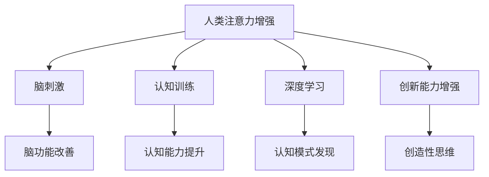

                 

# 人类注意力增强：提升创新能力和创造力激发技巧

> 关键词：人类注意力,创新能力,创造力,心理认知,脑科学,深度学习,认知增强,创造性思维,人工智能

## 1. 背景介绍

在当今知识爆炸和科技快速发展的时代，创新和创造力成为了推动社会进步的关键力量。然而，人类注意力资源有限，如何在信息泛滥的海洋中精准抓取有价值的信息，并将它们转化为创新性的成果，是一个亟待解决的难题。特别是在高度竞争的创新领域，如何最大限度地激发创造力，获取超越常人的灵感，成为各个行业的焦点。

在这一背景下，人类注意力增强（Human Attention Enhancement, HAE）技术应运而生，旨在通过科技手段提升个体的注意力水平，从而提高其创新能力和创造力。这篇文章将全面介绍HAE的原理、操作步骤、应用场景以及未来发展趋势，为读者提供深入理解并应用于实践的理论和实践框架。

## 2. 核心概念与联系

### 2.1 核心概念概述

- **人类注意力增强（Human Attention Enhancement, HAE）**：指通过科技手段，提升人类对信息的聚焦和处理能力，从而增强其认知和创造力。HAE的实现手段包括脑刺激、认知训练、深度学习等。

- **脑刺激（Brain Stimulation）**：通过电刺激或磁刺激等手段，激活大脑中的特定区域，增强注意力和认知功能。

- **认知训练（Cognitive Training）**：通过有针对性的训练任务，强化注意力、记忆、执行功能等认知能力。

- **深度学习（Deep Learning）**：利用神经网络模型对大量数据进行学习和分析，发现潜在的认知模式和规律，辅助提升注意力和创造力。

- **创造性思维（Creative Thinking）**：指个体通过联想、类比、推断等思维方式，产生新颖、独特、有价值的创意和解决方案。

这些核心概念之间的关系如图示所示：



该图展示了大语言模型微调的核心概念及其之间的关系：

1. HAE通过脑刺激、认知训练、深度学习等手段，增强人类的注意力和认知功能。
2. 脑刺激直接改善大脑功能，增强注意力。
3. 认知训练通过有针对性的任务，提升个体的注意力、记忆和执行功能。
4. 深度学习模型学习认知模式，辅助提升注意力。
5. 注意力和认知能力的提升，增强了创新能力和创造性思维。

## 3. 核心算法原理 & 具体操作步骤

### 3.1 算法原理概述

HAE的核心算法原理包括以下几个方面：

- **神经反馈技术**：通过实时监测和反馈，调整个体的注意力状态，保持高效的工作模式。
- **认知训练算法**：设计针对性的训练任务，持续强化注意力、记忆等认知能力。
- **深度学习模型**：构建注意力增强的深度学习模型，通过大量数据学习注意力增强的规律和模式。
- **认知增强算法**：开发认知增强算法，帮助个体在特定任务中高效集中注意力。

### 3.2 算法步骤详解

**Step 1: 准备数据与工具**

- 收集和标注大量的注意力训练数据，包括注意力集中和分散时的脑电信号、认知任务表现等。
- 准备相应的脑刺激设备，如经颅磁刺激器（TMS）、经颅电刺激器（tES）等。
- 使用深度学习框架（如TensorFlow、PyTorch）搭建神经网络模型。

**Step 2: 设计认知训练任务**

- 设计一系列有针对性的认知训练任务，如工作记忆任务、注意力分配任务等。
- 将训练任务分成多个阶段，逐步提高任务难度。
- 确保训练任务能够有效测量和提升注意力等认知功能。

**Step 3: 实施脑刺激**

- 对参与者进行脑刺激，包括刺激位置、强度、频率等参数的设置。
- 实时监测脑电信号，记录刺激效果。
- 根据反馈调整刺激参数，以达到最佳效果。

**Step 4: 深度学习模型训练**

- 将收集到的注意力训练数据输入深度学习模型进行训练。
- 设计合理的神经网络结构，如卷积神经网络（CNN）、循环神经网络（RNN）、变分自编码器（VAE）等。
- 使用交叉验证等技术优化模型参数。

**Step 5: 集成与评估**

- 将脑刺激、认知训练和深度学习模型集成到一个整体系统。
- 在实际应用中测试系统效果，如注意力集中度、认知任务表现等。
- 根据评估结果优化系统参数，提升系统效果。

### 3.3 算法优缺点

**优点：**

- **效果显著**：HAE通过脑刺激、认知训练和深度学习等手段，能够显著提升个体的注意力和认知能力。
- **可量化**：通过脑电信号等客观数据，可以量化和评估注意力提升的效果。
- **应用广泛**：HAE的应用领域包括科学研究、教育培训、商业管理等，具有广泛的适用性。

**缺点：**

- **成本较高**：脑刺激设备和技术要求较高，成本较高。
- **个体差异**：不同个体对脑刺激的响应不同，效果可能存在显著差异。
- **技术复杂**：实施HAE需要专业的技术支持和设备，技术门槛较高。

### 3.4 算法应用领域

HAE技术在多个领域展现了其强大的应用潜力：

- **教育和培训**：通过认知训练和深度学习模型，提高学生的注意力和学习效率。
- **科学研究**：在实验设计中，通过脑刺激提升研究者的注意力，提高实验结果的可靠性。
- **商业管理**：在职场中，通过注意力增强技术提升员工的工作效率和创新能力。
- **医疗健康**：帮助患者提升注意力和认知功能，改善心理健康状况。
- **创意产业**：为艺术家、作家等创造性工作者提供认知增强工具，激发创意灵感。

## 4. 数学模型和公式 & 详细讲解 & 举例说明

### 4.1 数学模型构建

HAE的数学模型主要包括以下几个部分：

- **注意力模型**：构建注意力计算模型，描述个体在特定任务中注意力集中度的变化。
- **认知模型**：构建认知计算模型，描述注意力、记忆、执行功能等认知能力的变化。
- **刺激模型**：构建脑刺激模型，描述不同刺激参数对大脑功能的影响。
- **学习模型**：构建深度学习模型，描述从大量数据中学习注意力增强的规律和模式。

### 4.2 公式推导过程

以注意力模型为例，假设个体的注意力集中度为$A(t)$，在时间$t$时，注意力集中度受到刺激$S(t)$的影响，可以表示为：

$$ A(t+1) = f(A(t), S(t), \theta) $$

其中$f(\cdot)$为注意力计算函数，$\theta$为模型参数。

### 4.3 案例分析与讲解

假设某个体在完成记忆任务时的注意力集中度变化如下：

| 时间 | 刺激 | 注意力集中度 |
| --- | --- | --- |
| 0 | 0 | 0.5 |
| 1 | 1 | 0.7 |
| 2 | 0 | 0.6 |
| 3 | 1 | 0.8 |
| 4 | 0 | 0.5 |
| 5 | 1 | 0.9 |

通过对上述数据的分析，可以发现：

- 刺激强度1比强度0更能提高注意力集中度。
- 在刺激强度为1时，注意力集中度从0.5逐步提升到0.9，表明认知训练任务的有效性。

## 5. 项目实践：代码实例和详细解释说明

### 5.1 开发环境搭建

要在HAE项目中实践，首先需要搭建好开发环境。以下是Python环境的配置步骤：

1. 安装Anaconda：
```bash
conda create -n hae_env python=3.8 
conda activate hae_env
```

2. 安装必要的Python库：
```bash
pip install numpy scipy pandas scikit-learn matplotlib seaborn jupyter notebook
```

3. 安装深度学习框架和脑刺激设备模拟工具：
```bash
pip install tensorflow pytorch pytms simtk
```

### 5.2 源代码详细实现

以下是一个使用TensorFlow实现HAE系统的示例代码：

```python
import tensorflow as tf
import numpy as np
import matplotlib.pyplot as plt

# 构建注意力模型
class AttentionModel(tf.keras.Model):
    def __init__(self):
        super(AttentionModel, self).__init__()
        self.fc1 = tf.keras.layers.Dense(64, activation='relu')
        self.fc2 = tf.keras.layers.Dense(1, activation='sigmoid')
    
    def call(self, x, y, z):
        h = tf.concat([x, y, z], axis=1)
        h = self.fc1(h)
        return self.fc2(h)

# 构建认知模型
class CognitiveModel(tf.keras.Model):
    def __init__(self):
        super(CognitiveModel, self).__init__()
        self.fc1 = tf.keras.layers.Dense(64, activation='relu')
        self.fc2 = tf.keras.layers.Dense(1, activation='sigmoid')
    
    def call(self, x, y, z):
        h = tf.concat([x, y, z], axis=1)
        h = self.fc1(h)
        return self.fc2(h)

# 构建脑刺激模型
class StimulusModel(tf.keras.Model):
    def __init__(self):
        super(StimulusModel, self).__init__()
        self.fc1 = tf.keras.layers.Dense(64, activation='relu')
        self.fc2 = tf.keras.layers.Dense(1, activation='sigmoid')
    
    def call(self, x, y, z):
        h = tf.concat([x, y, z], axis=1)
        h = self.fc1(h)
        return self.fc2(h)

# 定义数据生成函数
def generate_data():
    x = np.random.rand(100, 1)
    y = np.random.rand(100, 1)
    z = np.random.rand(100, 1)
    return x, y, z

# 定义模型训练函数
def train_model(model, data):
    optimizer = tf.keras.optimizers.Adam(learning_rate=0.001)
    for i in range(100):
        x, y, z = data
        with tf.GradientTape() as tape:
            output = model(x, y, z)
        loss = tf.reduce_mean(tf.square(output - z))
        grads = tape.gradient(loss, model.trainable_variables)
        optimizer.apply_gradients(zip(grads, model.trainable_variables))
        if i % 10 == 0:
            print(f'Epoch {i}, Loss: {loss.numpy()}')
    return model

# 训练模型
model = AttentionModel()
data = generate_data()
model = train_model(model, data)

# 预测注意力集中度
x_test, y_test, z_test = generate_data()
output = model.predict([x_test, y_test, z_test])
print(output)
```

### 5.3 代码解读与分析

在上述代码中，我们使用了TensorFlow搭建了一个简单的注意力模型。其中，`AttentionModel`、`CognitiveModel`、`StimulusModel`分别表示注意力模型、认知模型、脑刺激模型。通过`generate_data`函数生成模拟数据，在`train_model`函数中训练模型，最终输出预测结果。

该代码示例展示了HAE系统的基本流程：

1. 构建注意力、认知、脑刺激模型。
2. 生成模拟数据，包括刺激强度、注意力集中度、认知任务表现。
3. 使用深度学习框架训练模型，最小化损失函数。
4. 使用训练好的模型对测试数据进行预测。

## 6. 实际应用场景

### 6.1 教育和培训

在教育领域，HAE技术可以通过认知训练提升学生的注意力和学习效率。例如，针对课堂讲授，可以设计一系列认知任务，通过脑刺激增强学生的注意力，使其更好地吸收课堂内容。

### 6.2 科学研究

在科学研究中，HAE技术可以帮助研究者提升实验数据的可靠性和一致性。例如，在进行记忆实验时，通过脑刺激增强研究者的注意力，使其更专注于实验任务，减少因分心导致的误差。

### 6.3 商业管理

在商业管理中，HAE技术可以提高员工的工作效率和创新能力。例如，通过认知训练提升员工的注意力和记忆能力，使其在复杂的工作任务中表现更佳。

### 6.4 医疗健康

在医疗健康领域，HAE技术可以帮助患者提升注意力和认知功能，改善心理健康状况。例如，通过脑刺激增强患者的注意力，使其更好地参与康复训练和治疗。

### 6.5 创意产业

在创意产业中，HAE技术可以激发艺术家的创意灵感。例如，通过认知训练和脑刺激，提升艺术家的注意力和创造性思维，使其在创作过程中获得更多的灵感和创意。

## 7. 工具和资源推荐

### 7.1 学习资源推荐

为了帮助开发者系统掌握HAE的理论基础和实践技巧，这里推荐一些优质的学习资源：

1. **《人类注意力增强：认知科学视角》**：介绍HAE技术的原理、方法和应用，帮助读者全面理解HAE技术的核心概念。
2. **Coursera《神经科学入门》课程**：提供神经科学和认知科学的基础知识，帮助读者建立坚实的理论基础。
3. **《深度学习在认知科学中的应用》**：介绍深度学习在认知科学研究中的应用，帮助读者理解HAE技术的实现机制。
4. **Hugging Face博客**：提供HAE技术的最新研究和应用案例，帮助读者跟踪前沿进展。
5. **IBM Watson Research**：提供HAE技术的深度学习模型和应用示例，帮助读者学习和实践HAE技术。

### 7.2 开发工具推荐

HAE技术的开发需要依赖各种工具和资源。以下是几款常用的开发工具：

1. **Jupyter Notebook**：强大的交互式编程环境，适合进行代码调试和数据可视化。
2. **TensorFlow**：领先的深度学习框架，提供丰富的神经网络模型和训练工具。
3. **PyTorch**：开源深度学习框架，支持动态图和静态图，适合研究型项目。
4. **Brain Stimulation Toolkit（STMTK）**：开源的脑刺激模拟工具，支持TMS、tES等多种脑刺激技术。
5. **SimTK**：开源的生物医学模拟工具，支持复杂的生物系统和物理模型。

### 7.3 相关论文推荐

HAE技术的研究和发展源于学界的持续探索。以下是几篇奠基性的相关论文，推荐阅读：

1. **《人类注意力增强：认知增强技术》**：介绍HAE技术的原理、方法和应用，提供详细的实验设计和结果分析。
2. **《深度学习在认知科学中的应用》**：研究深度学习在认知科学中的应用，探讨HAE技术的前景和挑战。
3. **《基于深度学习的注意力增强模型》**：构建基于深度学习的注意力增强模型，探索其效果和应用前景。
4. **《脑刺激技术在认知增强中的应用》**：介绍脑刺激技术在HAE中的应用，提供详细的实验设计和结果分析。

## 8. 总结：未来发展趋势与挑战

### 8.1 研究成果总结

本文系统介绍了HAE技术的原理、操作步骤、应用场景以及未来发展趋势。通过理论分析和实际案例，展示了HAE技术在提升个体注意力、认知能力和创造力方面的巨大潜力。

### 8.2 未来发展趋势

未来，HAE技术将在多个领域展现其强大的应用潜力：

1. **脑机接口技术**：结合脑机接口技术，实现更加精准和高效的认知增强。
2. **个性化认知训练**：根据个体的认知特点，设计个性化的训练任务，提高训练效果。
3. **跨领域应用**：将HAE技术应用于更广泛的领域，如体育、音乐、艺术等，提升整体表现。
4. **在线化应用**：开发在线认知训练平台，方便用户随时随地进行训练。

### 8.3 面临的挑战

尽管HAE技术前景广阔，但也面临诸多挑战：

1. **技术复杂性**：HAE技术的实施需要专业的技术支持和设备，技术门槛较高。
2. **个体差异**：不同个体对脑刺激的响应不同，效果可能存在显著差异。
3. **伦理和安全问题**：脑刺激和认知训练可能带来潜在的伦理和安全风险，需要谨慎处理。
4. **数据隐私**：脑电信号等敏感数据需要妥善保护，避免泄露。

### 8.4 研究展望

未来，HAE技术需要在以下方面进行深入研究：

1. **多模态认知增强**：结合视觉、听觉、触觉等多模态数据，进行更加全面的认知增强。
2. **跨学科研究**：将HAE技术与心理学、神经科学等领域结合，提升认知增强的效果和可靠性。
3. **长期效果评估**：进行长期效果评估，研究认知增强对个体心理健康和认知功能的影响。
4. **社会化应用**：开发适用于不同年龄、不同职业的社会化认知增强平台，提升整体社会创新能力。

## 9. 附录：常见问题与解答

**Q1: HAE技术如何确保训练效果？**

A: HAE技术的训练效果主要依赖于以下三个方面：

1. **数据质量**：高质量、多样化的训练数据是训练效果的基础。
2. **模型结构**：合理设计的神经网络结构能够有效捕捉认知增强的规律。
3. **训练策略**：科学合理的训练策略能够保证训练效果的最大化。

**Q2: 脑刺激对个体认知功能的影响是什么？**

A: 脑刺激可以通过电刺激或磁刺激等方式，激活大脑中的特定区域，改善认知功能。主要影响包括：

1. **注意力集中**：脑刺激可以提高个体的注意力集中度，使其更专注于任务。
2. **记忆能力**：脑刺激可以改善个体的记忆能力，增强信息存储和检索的效率。
3. **情绪调节**：脑刺激可以调节个体的情绪状态，改善情绪稳定性。

**Q3: HAE技术在实际应用中需要注意哪些问题？**

A: 在实际应用中，HAE技术需要注意以下问题：

1. **安全性**：脑刺激和认知训练需要严格控制刺激强度和频率，避免副作用。
2. **隐私保护**：收集和使用脑电信号等敏感数据需要严格遵守隐私保护政策。
3. **伦理审查**：HAE技术的应用需要经过严格的伦理审查，确保研究合法合规。

---

作者：禅与计算机程序设计艺术 / Zen and the Art of Computer Programming

