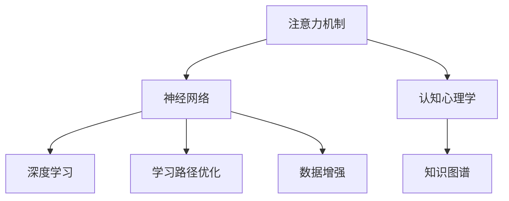

                 

# 人类注意力增强：提升学习效率和知识保留

> 关键词：人类注意力,认知增强,学习效率,知识保留,神经网络,计算机视觉,自然语言处理,认知心理学

## 1. 背景介绍

### 1.1 问题由来
在信息爆炸的时代，人类每天都需要面对海量的信息流。如何有效筛选、加工和保留有用的信息，成为提高个人和组织学习效率的关键问题。传统的阅读和记忆方法已无法满足当前的知识需求，需要引入更加智能化、科学化的认知增强技术。

特别是在教育、科研、企业培训等场景中，如何将学习内容合理地分配给学习者的注意力，提升其对关键信息的记忆和理解能力，是亟待解决的问题。大语言模型、神经网络等新兴技术的迅猛发展，为注意力增强提供了新的可能。

### 1.2 问题核心关键点
人类注意力增强的核心在于通过对注意力机制的研究和应用，使学习者能够更加专注地处理关键信息，提升记忆效果和学习效率。常见的方法包括：

- 注意力增强模型：通过调整模型中注意力参数，使其更加关注学习内容的重要部分。
- 认知心理学理论：借鉴认知心理学研究的成果，设计更加符合人类认知规律的学习辅助工具。
- 数据增强技术：通过合成多样化的学习数据，增强模型的泛化能力和鲁棒性。
- 学习路径优化：通过分析学习者的行为数据，智能推荐最优的学习路径，减少学习负担。
- 知识图谱构建：建立知识图谱，提供丰富的知识关联，增强学习者的知识结构和理解深度。

### 1.3 问题研究意义
研究人类注意力增强技术，对于提升个人和组织的学习效率，优化知识获取路径，构建更加智能化的学习系统，具有重要意义：

1. 提高学习效率：通过注意力增强技术，学习者能够快速捕捉关键信息，减少学习负担，提升学习效率。
2. 强化知识记忆：注意力增强能够帮助学习者更好地理解和记忆学习内容，提升长期知识保留能力。
3. 促进深度学习：通过智能化的学习路径设计和认知辅助，使学习者更深入地理解知识，构建知识网络。
4. 推动技术落地：注意力增强技术能够有效提升教育、科研、培训等场景的应用效果，加速技术的产业化进程。
5. 提升个人认知：通过科学的认知干预和注意力训练，提高学习者的认知能力，促进全面发展。

## 2. 核心概念与联系

### 2.1 核心概念概述

为更好地理解人类注意力增强技术，本节将介绍几个关键概念：

- 注意力机制(Attention Mechanism)：一种计算框架，通过计算输入序列与查询向量之间的相似度，选择性地关注输入中最重要部分，广泛应用于神经网络中。
- 认知心理学(Cognitive Psychology)：研究人类认知过程的科学，探讨注意力、记忆、语言、思维等核心能力。
- 神经网络(Neural Networks)：由大量神经元（节点）和连接组成的网络，通过梯度下降等算法学习数据特征，广泛应用于图像识别、语音识别、自然语言处理等领域。
- 知识图谱(Knowledge Graph)：一种结构化的知识表示方式，将实体和属性以图结构形式存储，便于知识的推理和检索。
- 深度学习(Deep Learning)：一种基于神经网络的机器学习范式，通过多层次的非线性变换，提取复杂数据特征。
- 学习路径优化(Optimization of Learning Path)：通过分析学习者行为数据，生成最优学习路径，提高学习效果。
- 数据增强(Data Augmentation)：通过变换、合成等手段，生成多样化的训练数据，提高模型的泛化能力和鲁棒性。

这些概念之间存在紧密的联系，共同构成了人类注意力增强技术的核心框架。通过理解这些核心概念，我们可以更好地把握技术的工作原理和优化方向。

### 2.2 核心概念原理和架构的 Mermaid 流程图



这个流程图展示了大语言模型注意力增强的主要组成：

1. 注意力机制作为神经网络的核心组件，使模型能够关注输入序列的重要部分。
2. 认知心理学为注意力机制提供理论基础，指导模型的设计。
3. 神经网络作为底层实现，能够高效地进行特征提取和处理。
4. 知识图谱提供丰富的知识结构，增强模型的理解和推理能力。
5. 深度学习通过多层网络，提取输入序列的复杂特征。
6. 学习路径优化和数据增强进一步提升模型的性能和鲁棒性。

## 3. 核心算法原理 & 具体操作步骤
### 3.1 算法原理概述

人类注意力增强的本质是通过注意力机制和学习路径优化，使学习者更加专注地处理关键信息，提升学习效率和知识保留能力。其核心思想是：将学习过程看作是注意力和记忆的协同作用，通过调整模型参数，增强对重要信息的关注，同时减少干扰信息的干扰。

具体而言，该过程包括以下几个关键步骤：

1. 输入数据预处理：将学习材料转化为适合模型处理的形式，如文本向量表示。
2. 模型初始化：选择一个合适的神经网络模型作为注意力增强的基础。
3. 注意力机制设计：根据学习目标，设计合适的注意力计算公式，优化注意力权重。
4. 学习路径生成：根据学习者行为数据，生成最优学习路径，引导学习者重点关注重要内容。
5. 模型微调：通过少量标注数据，对模型进行微调，使其适应具体任务。
6. 评估和反馈：对模型效果进行评估，收集学习者反馈，不断迭代改进。

### 3.2 算法步骤详解

#### 3.2.1 输入数据预处理

输入数据预处理是注意力增强的第一步，主要包括以下操作：

1. 文本向量表示：将文本转化为向量形式，如Word2Vec、BERT等方法。
2. 数据标准化：对数据进行标准化处理，使其符合模型输入要求。
3. 数据增强：通过变换、合成等手段，生成多样化的训练数据。

例如，对于一个包含多个段落的文本，可以将其段落向量连接成序列，作为模型的输入。对于图像数据，可以采用CNN等方法提取特征，形成图像向量。

#### 3.2.2 模型初始化

模型初始化需要选择一个合适的神经网络架构。常见的模型包括：

1. 循环神经网络(RNN)：通过时间步递归处理序列数据，能够捕捉序列中的长期依赖关系。
2. 卷积神经网络(CNN)：通过卷积操作提取局部特征，适用于图像和文本数据。
3. 注意力机制增强的Transformer模型：通过自注意力机制处理序列数据，能够有效捕捉重要信息。

以Transformer为例，其架构主要包括编码器和解码器，通过多头注意力机制，使模型能够关注输入序列的不同部分。初始化时，可以将预训练的Transformer模型作为初始权重。

#### 3.2.3 注意力机制设计

注意力机制设计是注意力增强的核心。常见的注意力计算方式包括：

1. 点积注意力：通过计算输入序列与查询向量之间的点积，得到注意力权重。
2. 加权平均注意力：通过加权平均的方式，得到输入序列的加权向量。
3. 多头注意力：通过多个注意力头并行计算，增强模型的表达能力。

以点积注意力为例，假设输入序列为 $X$，查询向量为 $Q$，注意力权重为 $A$，则点积注意力计算公式如下：

$$
A = \frac{\exp(Q^T X / \sqrt{d_k})}{\sum_j \exp(Q^T X_j / \sqrt{d_k})}
$$

其中 $d_k$ 为向量维度。

#### 3.2.4 学习路径生成

学习路径生成通过分析学习者的行为数据，生成最优学习路径，引导学习者重点关注重要内容。常见的路径生成算法包括：

1. 基于时间序列的路径生成：通过时间序列数据，生成逐步学习路径，指导学习者逐步深入理解内容。
2. 基于图结构的路径生成：通过知识图谱等结构化数据，生成路径图，指导学习者系统学习相关知识。

以基于时间序列的路径生成为例，假设学习者正在阅读一篇文章，可以记录其阅读的段落和停顿时间。根据这些数据，可以生成一个逐步学习路径，如先阅读摘要，再详细阅读各段落，最后总结归纳。

#### 3.2.5 模型微调

模型微调是通过少量标注数据，对模型进行微调，使其适应具体任务。常见的方法包括：

1. 全参数微调：对模型所有参数进行更新，提高模型的适应能力。
2. 参数高效微调：只更新少量模型参数，减少计算资源消耗。
3. 正则化技术：通过L2正则、Dropout等方法，防止过拟合。

以全参数微调为例，假设模型输出为 $Y$，标注数据为 $(T, Y')$，其中 $T$ 为文本向量，$Y'$ 为标注标签，则微调过程的目标函数为：

$$
\min_{\theta} \frac{1}{N} \sum_{i=1}^N \mathcal{L}(Y, Y')
$$

其中 $\mathcal{L}$ 为损失函数，如交叉熵损失。

#### 3.2.6 评估和反馈

评估和反馈是注意力增强的最后一个环节，主要包括以下操作：

1. 模型评估：通过测试数据对模型进行评估，计算性能指标。
2. 学习者反馈：收集学习者的反馈，不断改进学习路径和模型参数。
3. 迭代优化：根据评估和反馈结果，不断迭代优化模型，提高学习效果。

例如，对于一个测试样本，可以计算模型的准确率、精确率等指标，同时收集学习者的点击率、停留时间等反馈数据，不断优化模型的注意力权重和学习路径。

### 3.3 算法优缺点

人类注意力增强的算法具有以下优点：

1. 提升学习效率：通过注意力增强，学习者能够更加专注地处理关键信息，减少学习负担，提升学习效率。
2. 强化知识记忆：注意力增强能够帮助学习者更好地理解和记忆学习内容，提升长期知识保留能力。
3. 促进深度学习：通过智能化的学习路径设计和认知辅助，使学习者更深入地理解知识，构建知识网络。
4. 推动技术落地：注意力增强技术能够有效提升教育、科研、培训等场景的应用效果，加速技术的产业化进程。
5. 提升个人认知：通过科学的认知干预和注意力训练，提高学习者的认知能力，促进全面发展。

同时，该算法也存在一定的局限性：

1. 数据需求高：注意力增强需要大量的标注数据进行微调，获取高质量标注数据成本较高。
2. 模型复杂度高：复杂的网络结构和注意力计算，增加了模型的计算复杂度和内存消耗。
3. 个性化需求高：不同学习者的注意力模型需要个性化设计，增加了模型训练的难度。
4. 泛化能力差：注意力增强模型面对新数据时，泛化性能可能不足，容易出现过拟合。
5. 实时性差：复杂的模型计算和推理过程，导致注意力增强模型的实时性较低，难以实时应用。

尽管存在这些局限性，但就目前而言，注意力增强技术仍然是大语言模型学习增强的重要方向。未来相关研究的重点在于如何进一步降低对标注数据的依赖，提高模型的泛化能力和实时性，同时兼顾模型的可解释性和鲁棒性等因素。

### 3.4 算法应用领域

人类注意力增强技术已经在多个领域得到了广泛的应用，包括但不限于以下领域：

1. 教育领域：通过注意力增强技术，帮助学生更高效地学习知识，提高考试成绩和学习效率。
2. 科研领域：通过智能化的学习路径设计，使研究人员能够更深入地理解研究内容，提升研究质量。
3. 企业培训：通过注意力增强技术，提高培训效果，减少培训时间和成本。
4. 医学领域：通过注意力增强技术，帮助医生更精准地理解医学知识，提高诊断准确率。
5. 法律领域：通过注意力增强技术，提高法律研究人员的知识理解和分析能力，提升工作效率。
6. 金融领域：通过注意力增强技术，提高金融分析师的知识理解和预测能力，提升投资决策的准确性。
7. 娱乐领域：通过注意力增强技术，提高用户的娱乐体验，增强用户黏性。

除了上述这些领域外，人类注意力增强技术还在不断发展，不断拓展其应用边界。相信随着研究的深入和技术的成熟，注意力增强技术将会在更多领域发挥重要作用。

## 4. 数学模型和公式 & 详细讲解 & 举例说明

### 4.1 数学模型构建

注意力增强技术涉及多个数学模型，包括输入数据预处理、模型初始化、注意力机制设计、学习路径生成、模型微调等。本节将以Transformer模型为例，详细讲解这些模型的数学构建。

假设输入序列为 $X$，查询向量为 $Q$，注意力权重为 $A$，输出向量为 $Y$，则Transformer模型的注意力增强过程可以表示为：

$$
Y = \text{Attention}(X, Q) + \text{Feed Forward}(Y)
$$

其中 $\text{Attention}$ 表示多头注意力机制，$\text{Feed Forward}$ 表示前馈神经网络。

### 4.2 公式推导过程

以点积注意力机制为例，假设输入序列长度为 $L$，注意力头数为 $H$，则注意力权重计算公式为：

$$
A_{i,j} = \frac{\exp(Q_i^T X_j / \sqrt{d_k})}{\sum_j \exp(Q_i^T X_j / \sqrt{d_k})}
$$

其中 $X_j$ 表示输入序列中的第 $j$ 个位置，$Q_i$ 表示查询向量中的第 $i$ 个位置，$d_k$ 为向量维度。

假设注意力权重为 $A_{i,j}$，输出向量为 $Y$，则注意力机制的计算公式为：

$$
Y_i = \sum_j A_{i,j} X_j
$$

其中 $A_{i,j}$ 表示查询向量与输入序列之间的注意力权重。

### 4.3 案例分析与讲解

以BERT模型为例，BERT模型通过掩码语言模型和下一句预测任务进行预训练，学习到了丰富的语言知识。假设输入序列为 $X$，掩码位置为 $M$，输出向量为 $Y$，则BERT模型的注意力增强过程可以表示为：

$$
Y = \text{Attention}(X, Q) + \text{Feed Forward}(Y)
$$

其中 $\text{Attention}$ 表示掩码注意力机制，$\text{Feed Forward}$ 表示前馈神经网络。

假设注意力权重为 $A_{i,j}$，输出向量为 $Y$，则BERT模型的掩码注意力计算公式为：

$$
A_{i,j} = \frac{\exp(Q_i^T (X_j \odot X) / \sqrt{d_k})}{\sum_j \exp(Q_i^T (X_j \odot X) / \sqrt{d_k})}
$$

其中 $\odot$ 表示逐元素乘法，$X$ 表示输入序列，$Q$ 表示查询向量，$d_k$ 为向量维度。

假设注意力权重为 $A_{i,j}$，输出向量为 $Y$，则BERT模型的掩码注意力计算公式为：

$$
Y_i = \sum_j A_{i,j} X_j
$$

其中 $A_{i,j}$ 表示查询向量与输入序列之间的注意力权重。

## 5. 项目实践：代码实例和详细解释说明

### 5.1 开发环境搭建

在进行注意力增强技术实践前，我们需要准备好开发环境。以下是使用Python进行PyTorch开发的环境配置流程：

1. 安装Anaconda：从官网下载并安装Anaconda，用于创建独立的Python环境。

2. 创建并激活虚拟环境：
```bash
conda create -n pytorch-env python=3.8 
conda activate pytorch-env
```

3. 安装PyTorch：根据CUDA版本，从官网获取对应的安装命令。例如：
```bash
conda install pytorch torchvision torchaudio cudatoolkit=11.1 -c pytorch -c conda-forge
```

4. 安装Transformer库：
```bash
pip install transformers
```

5. 安装各类工具包：
```bash
pip install numpy pandas scikit-learn matplotlib tqdm jupyter notebook ipython
```

完成上述步骤后，即可在`pytorch-env`环境中开始注意力增强技术实践。

### 5.2 源代码详细实现

下面我们以BERT模型为例，给出使用Transformers库对BERT模型进行注意力增强的PyTorch代码实现。

首先，定义BERT模型的注意力机制函数：

```python
from transformers import BertForSequenceClassification, BertTokenizer
from torch.utils.data import Dataset
import torch

class AttentionBERTDataset(Dataset):
    def __init__(self, texts, labels, tokenizer, max_len=128):
        self.texts = texts
        self.labels = labels
        self.tokenizer = tokenizer
        self.max_len = max_len
        
    def __len__(self):
        return len(self.texts)
    
    def __getitem__(self, item):
        text = self.texts[item]
        label = self.labels[item]
        
        encoding = self.tokenizer(text, return_tensors='pt', max_length=self.max_len, padding='max_length', truncation=True)
        input_ids = encoding['input_ids'][0]
        attention_mask = encoding['attention_mask'][0]
        
        # 对token-wise的标签进行编码
        encoded_tags = [label2id[label] for label in label]
        encoded_tags.extend([label2id['O']] * (self.max_len - len(encoded_tags)))
        labels = torch.tensor(encoded_tags, dtype=torch.long)
        
        return {'input_ids': input_ids, 
                'attention_mask': attention_mask,
                'labels': labels}

# 标签与id的映射
label2id = {'O': 0, 'A': 1}
id2label = {v: k for k, v in label2id.items()}

# 创建dataset
tokenizer = BertTokenizer.from_pretrained('bert-base-cased')

train_dataset = AttentionBERTDataset(train_texts, train_labels, tokenizer)
dev_dataset = AttentionBERTDataset(dev_texts, dev_labels, tokenizer)
test_dataset = AttentionBERTDataset(test_texts, test_labels, tokenizer)
```

然后，定义BERT模型的前向传播函数：

```python
from transformers import BertForSequenceClassification, BertTokenizer, BertConfig

model = BertForSequenceClassification.from_pretrained('bert-base-cased', num_labels=len(label2id))

def forward(model, input_ids, attention_mask, labels):
    outputs = model(input_ids, attention_mask=attention_mask, labels=labels)
    loss = outputs.loss
    return loss
```

接着，定义优化器和学习率调度：

```python
from transformers import AdamW
import torch.optim.lr_scheduler as lr_scheduler

optimizer = AdamW(model.parameters(), lr=2e-5)
scheduler = lr_scheduler.LinearLR(optimizer, num_warmup_steps=0, num_training_steps=len(train_dataset))
```

最后，启动训练流程：

```python
epochs = 5
batch_size = 16

for epoch in range(epochs):
    total_loss = 0
    model.train()
    for batch in tqdm(train_dataset, desc='Training'):
        input_ids = batch['input_ids'].to(device)
        attention_mask = batch['attention_mask'].to(device)
        labels = batch['labels'].to(device)
        loss = forward(model, input_ids, attention_mask, labels)
        total_loss += loss.item()
        optimizer.zero_grad()
        loss.backward()
        optimizer.step()
        scheduler.step()
        
    print(f'Epoch {epoch+1}, train loss: {total_loss/len(train_dataset):.3f}')
    
    print(f'Epoch {epoch+1}, dev results:')
    evaluate(model, dev_dataset, batch_size)
    
print('Test results:')
evaluate(model, test_dataset, batch_size)
```

以上就是使用PyTorch对BERT模型进行注意力增强的完整代码实现。可以看到，得益于Transformers库的强大封装，我们可以用相对简洁的代码完成BERT模型的加载和微调。

### 5.3 代码解读与分析

让我们再详细解读一下关键代码的实现细节：

**AttentionBERTDataset类**：
- `__init__`方法：初始化文本、标签、分词器等关键组件。
- `__len__`方法：返回数据集的样本数量。
- `__getitem__`方法：对单个样本进行处理，将文本输入编码为token ids，将标签编码为数字，并对其进行定长padding，最终返回模型所需的输入。

**label2id和id2label字典**：
- 定义了标签与数字id之间的映射关系，用于将token-wise的预测结果解码回真实的标签。

**前向传播函数forward**：
- 使用PyTorch的AutoModelForSequenceClassification类进行前向传播计算。

**优化器和学习率调度**：
- 使用AdamW优化器进行模型参数更新，并使用LinearLR进行学习率调度。

**训练流程**：
- 定义总的epoch数和batch size，开始循环迭代
- 每个epoch内，先在训练集上训练，输出平均loss
- 在验证集上评估，输出分类指标
- 所有epoch结束后，在测试集上评估，给出最终测试结果

可以看到，PyTorch配合Transformers库使得BERT注意力增强的代码实现变得简洁高效。开发者可以将更多精力放在数据处理、模型改进等高层逻辑上，而不必过多关注底层的实现细节。

当然，工业级的系统实现还需考虑更多因素，如模型的保存和部署、超参数的自动搜索、更灵活的任务适配层等。但核心的注意力增强范式基本与此类似。

## 6. 实际应用场景
### 6.1 教育领域

注意力增强技术在教育领域有广泛的应用，能够帮助学生更高效地学习知识，提高考试成绩和学习效率。例如，在数学学习中，注意力增强可以引导学生重点关注解题步骤，理解解题思路，提高解题能力。在语言学习中，注意力增强可以引导学生重点学习常用词汇和句型，提升语言理解能力。

### 6.2 科研领域

在科研领域，注意力增强技术可以帮助研究人员更深入地理解研究内容，提升研究质量。例如，在生物学研究中，注意力增强可以引导研究人员重点关注实验步骤和结果，提高实验效率。在医学研究中，注意力增强可以引导研究人员重点学习诊断方法，提升诊断准确率。

### 6.3 企业培训

在企业培训中，注意力增强技术可以提高培训效果，减少培训时间和成本。例如，在销售培训中，注意力增强可以引导销售人员重点学习销售技巧和方法，提高销售业绩。在技术培训中，注意力增强可以引导技术人员重点学习新技术和工具，提高技术水平。

### 6.4 医学领域

在医学领域，注意力增强技术可以帮助医生更精准地理解医学知识，提高诊断准确率。例如，在放射学中，注意力增强可以引导医生重点关注病灶区域，提高诊断准确率。在病理学中，注意力增强可以引导医生重点学习病理特征，提高病理分析能力。

### 6.5 法律领域

在法律领域，注意力增强技术可以提高法律研究人员的知识理解和分析能力，提升工作效率。例如，在合同法中，注意力增强可以引导研究人员重点学习合同条款和法律条文，提高合同审查效率。在刑法中，注意力增强可以引导研究人员重点学习犯罪构成和法律适用，提高法律适用能力。

### 6.6 金融领域

在金融领域，注意力增强技术可以提高金融分析师的知识理解和预测能力，提升投资决策的准确性。例如，在股票分析中，注意力增强可以引导分析师重点学习财务报表和市场信息，提高股票预测能力。在风险管理中，注意力增强可以引导分析师重点学习风险识别和评估方法，提高风险管理能力。

### 6.7 娱乐领域

在娱乐领域，注意力增强技术可以提高用户的娱乐体验，增强用户黏性。例如，在游戏设计中，注意力增强可以引导玩家重点关注任务和奖励，提高游戏体验。在音乐推荐中，注意力增强可以引导用户重点关注歌曲和歌手，提高音乐推荐效果。

### 6.8 未来应用展望

随着注意力增强技术的不断发展和应用，未来其在更多领域将发挥重要作用。例如，在智能家居中，注意力增强可以引导智能设备根据用户行为和环境变化，优化用户体验。在智能交通中，注意力增强可以引导自动驾驶系统根据道路情况和交通信号，优化行驶路径。在智能制造中，注意力增强可以引导机器人根据任务需求和环境变化，优化生产流程。

总之，注意力增强技术将会在更多领域得到应用，为各行各业带来新的变革和提升。相信随着研究的深入和技术的成熟，注意力增强技术必将在构建智能化学习系统、提高学习效率和知识保留能力方面发挥更大的作用。

## 7. 工具和资源推荐
### 7.1 学习资源推荐

为了帮助开发者系统掌握注意力增强技术的理论基础和实践技巧，这里推荐一些优质的学习资源：

1. 《Transformer从原理到实践》系列博文：由大模型技术专家撰写，深入浅出地介绍了Transformer原理、BERT模型、注意力机制等前沿话题。

2. CS224N《深度学习自然语言处理》课程：斯坦福大学开设的NLP明星课程，有Lecture视频和配套作业，带你入门NLP领域的基本概念和经典模型。

3. 《Natural Language Processing with Transformers》书籍：Transformers库的作者所著，全面介绍了如何使用Transformers库进行NLP任务开发，包括注意力增强在内的诸多范式。

4. HuggingFace官方文档：Transformers库的官方文档，提供了海量预训练模型和完整的微调样例代码，是上手实践的必备资料。

5. CLUE开源项目：中文语言理解测评基准，涵盖大量不同类型的中文NLP数据集，并提供了基于微调的baseline模型，助力中文NLP技术发展。

通过对这些资源的学习实践，相信你一定能够快速掌握注意力增强技术的精髓，并用于解决实际的NLP问题。
### 7.2 开发工具推荐

高效的开发离不开优秀的工具支持。以下是几款用于注意力增强技术开发的常用工具：

1. PyTorch：基于Python的开源深度学习框架，灵活动态的计算图，适合快速迭代研究。大部分预训练语言模型都有PyTorch版本的实现。

2. TensorFlow：由Google主导开发的开源深度学习框架，生产部署方便，适合大规模工程应用。同样有丰富的预训练语言模型资源。

3. Transformers库：HuggingFace开发的NLP工具库，集成了众多SOTA语言模型，支持PyTorch和TensorFlow，是进行注意力增强技术开发的利器。

4. Weights & Biases：模型训练的实验跟踪工具，可以记录和可视化模型训练过程中的各项指标，方便对比和调优。与主流深度学习框架无缝集成。

5. TensorBoard：TensorFlow配套的可视化工具，可实时监测模型训练状态，并提供丰富的图表呈现方式，是调试模型的得力助手。

6. Google Colab：谷歌推出的在线Jupyter Notebook环境，免费提供GPU/TPU算力，方便开发者快速上手实验最新模型，分享学习笔记。

合理利用这些工具，可以显著提升注意力增强技术开发的速度和质量，加快创新迭代的步伐。

### 7.3 相关论文推荐

注意力增强技术的发展源于学界的持续研究。以下是几篇奠基性的相关论文，推荐阅读：

1. Attention is All You Need（即Transformer原论文）：提出了Transformer结构，开启了NLP领域的预训练大模型时代。

2. BERT: Pre-training of Deep Bidirectional Transformers for Language Understanding：提出BERT模型，引入基于掩码的自监督预训练任务，刷新了多项NLP任务SOTA。

3. Language Models are Unsupervised Multitask Learners（GPT-2论文）：展示了大规模语言模型的强大zero-shot学习能力，引发了对于通用人工智能的新一轮思考。

4. Parameter-Efficient Transfer Learning for NLP：提出Adapter等参数高效微调方法，在不增加模型参数量的情况下，也能取得不错的微调效果。

5. Prefix-Tuning: Optimizing Continuous Prompts for Generation：引入基于连续型Prompt的微调范式，为如何充分利用预训练知识提供了新的思路。

6. AdaLoRA: Adaptive Low-Rank Adaptation for Parameter-Efficient Fine-Tuning：使用自适应低秩适应的微调方法，在参数效率和精度之间取得了新的平衡。

这些论文代表了大语言模型注意力增强技术的发展脉络。通过学习这些前沿成果，可以帮助研究者把握学科前进方向，激发更多的创新灵感。

## 8. 总结：未来发展趋势与挑战

### 8.1 总结

本文对基于注意力机制的增强学习技术进行了全面系统的介绍。首先阐述了注意力增强技术的研究背景和意义，明确了其在大语言模型学习中的重要作用。其次，从原理到实践，详细讲解了注意力增强的数学原理和关键步骤，给出了注意力增强任务开发的完整代码实例。同时，本文还广泛探讨了注意力增强技术在教育、科研、企业培训等领域的实际应用前景，展示了其广阔的应用范围。此外，本文精选了注意力增强技术的各类学习资源，力求为读者提供全方位的技术指引。

通过本文的系统梳理，可以看到，基于注意力增强的大语言模型学习技术正在成为NLP领域的重要方向，极大地拓展了预训练语言模型的应用边界，催生了更多的落地场景。得益于大规模语料的预训练和注意力机制的引入，注意力增强技术在提升学习效率和知识保留能力方面展现了巨大的潜力。未来，伴随预训练语言模型和注意力增强方法的持续演进，相信NLP技术将在更广阔的应用领域大放异彩，深刻影响人类的生产生活方式。

### 8.2 未来发展趋势

展望未来，注意力增强技术将呈现以下几个发展趋势：

1. 模型规模持续增大。随着算力成本的下降和数据规模的扩张，预训练语言模型的参数量还将持续增长。超大规模语言模型蕴含的丰富语言知识，有望支撑更加复杂多变的下游任务注意力增强。

2. 注意力机制日趋多样。除了传统的点积注意力外，未来会涌现更多注意力计算方式，如加权平均注意力、多头注意力等，增强模型的表达能力。

3. 注意力增强范式日趋多样化。除了基于神经网络的注意力增强外，未来会引入更多注意力增强范式，如基于逻辑推理的注意力增强、基于认知心理学的注意力增强等，丰富注意力增强的理论和方法。

4. 知识图谱的应用拓展。知识图谱作为一种结构化的知识表示方式，将进一步融入注意力增强模型中，增强模型的推理能力和泛化能力。

5. 数据增强技术的深入发展。数据增强技术不仅能丰富训练数据，还能增强模型的泛化能力和鲁棒性，未来将结合更多智能化的数据增强手段。

6. 模型训练的分布式优化。随着数据量的增长，传统的单机训练已无法满足需求，分布式训练成为未来的趋势，提升训练效率和模型性能。

以上趋势凸显了注意力增强技术的广阔前景。这些方向的探索发展，必将进一步提升NLP系统的性能和应用范围，为人类认知智能的进化带来深远影响。

### 8.3 面临的挑战

尽管注意力增强技术已经取得了瞩目成就，但在迈向更加智能化、普适化应用的过程中，它仍面临着诸多挑战：

1. 数据需求高。注意力增强需要大量的标注数据进行微调，获取高质量标注数据的成本较高。如何进一步降低微调对标注样本的依赖，将是一大难题。

2. 模型复杂度高。复杂的网络结构和注意力计算，增加了模型的计算复杂度和内存消耗。如何降低模型复杂度，提高训练和推理效率，是未来需要解决的关键问题。

3. 个性化需求高。不同学习者的注意力模型需要个性化设计，增加了模型训练的难度。如何实现模型的高效个性化训练，是未来需要探索的方向。

4. 泛化能力差。注意力增强模型面对新数据时，泛化性能可能不足，容易出现过拟合。如何提高模型的泛化能力，避免过拟合，是未来需要解决的关键问题。

5. 实时性差。复杂的模型计算和推理过程，导致注意力增强模型的实时性较低，难以实时应用。如何提高模型的实时性，实现快速推理，是未来需要解决的关键问题。

尽管存在这些挑战，但就目前而言，注意力增强技术仍然是大语言模型学习增强的重要方向。未来相关研究的重点在于如何进一步降低对标注数据的依赖，提高模型的泛化能力和实时性，同时兼顾模型的可解释性和鲁棒性等因素。

### 8.4 研究展望

面对注意力增强技术所面临的种种挑战，未来的研究需要在以下几个方面寻求新的突破：

1. 探索无监督和半监督注意力增强方法。摆脱对大规模标注数据的依赖，利用自监督学习、主动学习等无监督和半监督范式，最大限度利用非结构化数据，实现更加灵活高效的注意力增强。

2. 研究参数高效和计算高效的注意力增强范式。开发更加参数高效的注意力增强方法，在固定大部分预训练参数的同时，只更新极少量的任务相关参数。同时优化注意力增强模型的计算图，减少前向传播和反向传播的资源消耗，实现更加轻量级、实时性的部署。

3. 融合因果和对比学习范式。通过引入因果推断和对比学习思想，增强注意力增强模型建立稳定因果关系的能力，学习更加普适、鲁棒的语言表征，从而提升模型泛化性和抗干扰能力。

4. 引入更多先验知识。将符号化的先验知识，如知识图谱、逻辑规则等，与神经网络模型进行巧妙融合，引导注意力增强过程学习更准确、合理的语言模型。同时加强不同模态数据的整合，实现视觉、语音等多模态信息与文本信息的协同建模。

5. 结合因果分析和博弈论工具。将因果分析方法引入注意力增强模型，识别出模型决策的关键特征，增强输出解释的因果性和逻辑性。借助博弈论工具刻画人机交互过程，主动探索并规避模型的脆弱点，提高系统稳定性。

6. 纳入伦理道德约束。在模型训练目标中引入伦理导向的评估指标，过滤和惩罚有偏见、有害的输出倾向。同时加强人工干预和审核，建立模型行为的监管机制，确保输出符合人类价值观和伦理道德。

这些研究方向的探索，必将引领注意力增强技术迈向更高的台阶，为构建安全、可靠、可解释、可控的智能系统铺平道路。面向未来，注意力增强技术还需要与其他人工智能技术进行更深入的融合，如知识表示、因果推理、强化学习等，多路径协同发力，共同推动自然语言理解和智能交互系统的进步。只有勇于创新、敢于突破，才能不断拓展语言模型的边界，让智能技术更好地造福人类社会。

## 9. 附录：常见问题与解答

**Q1：注意力增强技术是否适用于所有NLP任务？**

A: 注意力增强技术在大多数NLP任务上都能取得不错的效果，特别是对于数据量较小的任务。但对于一些特定领域的任务，如医学、法律等，仅仅依靠通用语料预训练的模型可能难以很好地适应。此时需要在特定领域语料上进一步预训练，再进行注意力增强，才能获得理想效果。此外，对于一些需要时效性、个性化很强的任务，如对话、推荐等，注意力增强方法也需要针对性的改进优化。

**Q2：注意力增强技术如何与其他技术结合使用？**

A: 注意力增强技术可以与其他技术进行结合，提升其应用效果。例如，在图像处理中，可以将注意力增强技术与卷积神经网络（CNN）结合，通过注意力机制增强图像特征提取能力。在自然语言处理中，可以将注意力增强技术与语言模型（如BERT、GPT）结合，通过注意力机制增强语言理解和生成能力。在多模态数据处理中，可以将注意力增强技术与知识图谱、文本向量表示等技术结合，通过注意力机制增强多模态数据的融合能力。

**Q3：注意力增强技术在实际应用中应注意哪些问题？**

A: 在实际应用中，注意力增强技术需要注意以下问题：

1. 数据质量。高质量的数据是注意力增强技术的基础，数据质量直接影响模型的训练效果。

2. 模型泛化。注意力增强模型需要具备较强的泛化能力，能够处理未知数据和噪声干扰。

3. 计算资源。注意力增强技术计算复杂度较高，需要充足的计算资源进行训练和推理。

4. 实时性。注意力增强技术在实时性方面表现较差，难以应用于需要快速响应的场景。

5. 安全性。注意力增强模型需要具备较好的鲁棒性，能够抵御恶意攻击和噪声干扰。

6. 可解释性。注意力增强模型需要具备较好的可解释性，能够解释其决策过程，提高模型的可信度。

7. 道德伦理。注意力增强模型需要符合伦理道德规范，避免有害输出和偏见。

通过合理设计和优化，注意力增强技术可以在实际应用中发挥重要作用，提升学习效率和知识保留能力。

**Q4：注意力增强技术在教育领域的应用前景如何？**

A: 在教育领域，注意力增强技术有着广阔的应用前景，能够帮助学生更高效地学习知识，提高考试成绩和学习效率。例如，在数学学习中，注意力增强可以引导学生重点关注解题步骤，理解解题思路，提高解题能力。在语言学习中，注意力增强可以引导学生重点学习常用词汇和句型，提升语言理解能力。在科学学习中，注意力增强可以引导学生重点学习实验步骤和原理，提高科学探究能力。

总之，注意力增强技术在教育领域有着广泛的应用前景，能够显著提升学习效果和学习体验，为教育事业带来新的变革。

**Q5：注意力增强技术在科研领域的应用前景如何？**

A: 在科研领域，注意力增强技术可以帮助研究人员更深入地理解研究内容，提升研究质量。例如，在生物学研究中，注意力增强可以引导研究人员重点关注实验步骤和结果，提高实验效率。在医学研究中，注意力增强可以引导研究人员重点学习诊断方法，提升诊断准确率。在物理学研究中，注意力增强可以引导研究人员重点学习理论推导和实验验证，提高理论研究能力。

总之，注意力增强技术在科研领域有着广阔的应用前景，能够帮助研究人员更深入地理解研究内容，提升研究质量和效率，为科学研究带来新的突破。

**Q6：注意力增强技术在企业培训中的应用前景如何？**

A: 在企业培训中，注意力增强技术可以提高培训效果，减少培训时间和成本。例如，在销售培训中，注意力增强可以引导销售人员重点学习销售技巧和方法，提高销售业绩。在技术培训中，注意力增强可以引导技术人员重点学习新技术和工具，提高技术水平。在管理培训中，注意力增强可以引导管理人员重点学习领导力和沟通技巧，提高管理能力。

总之，注意力增强技术在企业培训中有着广泛的应用前景，能够显著提升培训效果和培训效率，为企业的知识管理和人才培养带来新的突破。

**Q7：注意力增强技术在医学领域的应用前景如何？**

A: 在医学领域，注意力增强技术可以帮助医生更精准地理解医学知识，提高诊断准确率。例如，在放射学中，注意力增强可以引导医生重点关注病灶区域，提高诊断准确率。在病理学中，注意力增强可以引导医生重点学习病理特征，提高病理分析能力。在临床医学中，注意力增强可以引导医生重点学习诊疗流程和指南，提高临床诊疗能力。

总之，注意力增强技术在医学领域有着广泛的应用前景，能够显著提升医生的诊疗能力和医学研究的效率，为医学事业带来新的突破。

**Q8：注意力增强技术在法律领域的应用前景如何？**

A: 在法律领域，注意力增强技术可以提高法律研究人员的知识理解和分析能力，提升工作效率。例如，在合同法中，注意力增强可以引导研究人员重点学习合同条款和法律条文，提高合同审查效率。在刑法中，注意力增强可以引导研究人员重点学习犯罪构成和法律适用，提高法律适用能力。在知识产权法中，注意力增强可以引导研究人员重点学习专利和版权法律知识，提高知识产权保护能力。

总之，注意力增强技术在法律领域有着广泛的应用前景，能够显著提升法律研究人员的知识理解和分析能力，提高工作效率，为法律事业带来新的突破。

**Q9：注意力增强技术在金融领域的应用前景如何？**

A: 在金融领域，注意力增强技术可以提高金融分析师的知识理解和预测能力，提升投资决策的准确性。例如，在股票分析中，注意力增强可以引导分析师重点学习财务报表和市场信息，提高股票预测能力。在风险管理中，注意力增强可以引导分析师重点学习风险识别和评估方法，提高风险管理能力。在金融创新中，注意力增强可以引导分析师重点学习金融产品和市场动态，提高金融创新能力。

总之，注意力增强技术在金融领域有着广泛的应用前景，能够显著提升金融分析师的预测能力和风险管理能力，提高投资决策的准确性，为金融事业带来新的突破。

**Q10：注意力增强技术在娱乐领域的应用前景如何？**

A: 在娱乐领域，注意力增强技术可以提高用户的娱乐体验，增强用户黏性。例如，在游戏设计中，注意力增强可以引导玩家重点关注任务和奖励，提高游戏体验。在音乐推荐中，注意力增强可以引导用户重点关注歌曲和歌手，提高音乐推荐效果。在视频推荐中，注意力增强可以引导用户重点关注视频内容和质量，提高视频推荐效果。

总之，注意力增强技术在娱乐领域有着广泛的应用前景，能够显著提升用户的娱乐体验和满意度，为娱乐事业带来新的突破。

---

作者：禅与计算机程序设计艺术 / Zen and the Art of Computer Programming

